# creem支付é…置：å°ç™½è§†è§’和路径，手把手教学

> æ¥æºï¼š[https://ewtk6agpo4c.feishu.cn/docx/EiFEdIjdqo5a2sxecjpcYBS5nRh](https://ewtk6agpo4c.feishu.cn/docx/EiFEdIjdqo5a2sxecjpcYBS5nRh)

网站出海赚ç¾é‡‘是æ¯ä¸€ä¸ªå‡ºæµ·äººåœ¨åšçš„事儿，赚ç¾é‡‘，我们把工具åšå¥½äº†ï¼Œå°¤å…¶æ˜¯ä¸€æ¬¡æ€§æ”¯ä»˜æˆ–者订阅的这ç§å·¥å…·ï¼Œå°±éœ€è¦æœ‰ä¸€ç§æ”¯ä»˜å·¥å…·å¸®åŠ©æˆ‘们“收款ç¾é‡‘â€ï¼Œå¸¸è§çš„stripe需è¦åŠç†æ¸¯å¡ï¼Œä¸”å°æ§ä¸¥æ ¼ï¼Œæ–°æ‰‹æä¸å‹å¥½ï¼›PayPalçš„è¯ç”µå•†ç¡®å®å¸¸è§ï¼Œåªæ˜¯å¿…须需è¦å…¬å¸ï¼Œå¯¹äºç‹¬ç«‹ä¸ªä½“也ä¸æ–¹ä¾¿ï¼Œè¿™æ—¶å€™Creem出ç°äº†ï¼

*   中国人å‹å¥½

*   ç›´æ¥æ‰“款支付å®

*   支付æ¥å…¥ç®€å•

这几个在一起，“如æœæ˜¯çœŸçš„â€ï¼Œé‚£å¾ˆç‹ç‚¸å•Šï¼

第一次看到creem支付是在这篇文章 海外支付平å°Creem注册教程


当时的说法是，这个支付åªéœ€è¦20分钟就能æ定，我信了，注册到审核确å®åªè¦20分钟，但是åé¢çš„æ“作，让作为0基础å°ç™½çš„我崩溃了。ç»è¿‡äº†2周的爱æ¨çº ç»“，终äºè¿˜æ˜¯æŠŠè¿™ä¸ªcreem给装完了了，，3月底æ¥å®Œäº†æ”¯ä»˜ä¹Ÿå†™äº†è¿™ç¯‡æ–‡ç« çš„80%，但是还是拖到了5月中æ‰çœŸæ­£æŠŠcreem的支付给“拿下â€ï¼Œä»Šå¤©å°±ç”¨å°ç™½çš„视角帮大家一起梳ç†æ¥creem支付的æ¯ä¸€ä¸ªæ­¥éª¤ã€‚

文章主è¦åŒ…å«å››ä¸ªéƒ¨åˆ†ï¼š

1.  注册creemè´¦å·

1.  准备å„ç§creemçš„ä¿¡æ¯

1.  webhookå’Œngrok（有些情况ä¸éœ€è¦ï¼‰

1.  æ­£å¼é…置支付

# 一ã€æ³¨å†Œè´¦å·+完善信æ¯

## 1\. 注册账å·ï¼ˆgoogleå¯ç›´æ¥ç™»å½•ï¼‰

直通车，å¯ä»¥ç›´æ¥google登录 或者邮箱注册，注册æˆåŠŸå°±ä¼šè¿›å…¥ä¸‹é¢çš„页é¢

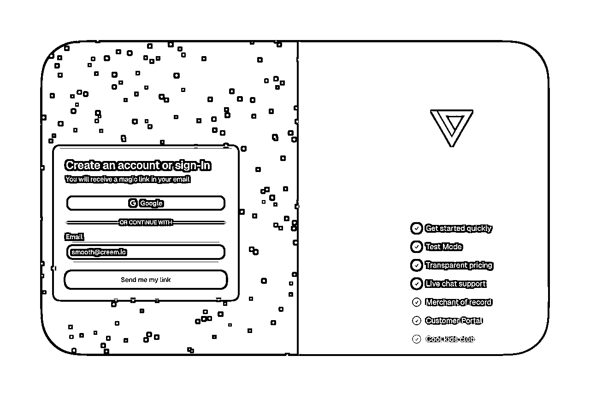


## 完善æç°ä¿¡æ¯

### 2.1 创建æç°è´¦å·

在Balanceçš„Payout Account中，选择创建一个新的账å·ï¼Œå›½å®¶é€‰æ‹©China，


### 2.2 填写业务信æ¯

主è¦å¡«å†™ä½ çš„基本信æ¯å’Œä½ çš„产å“是åšä»€ä¹ˆçš„

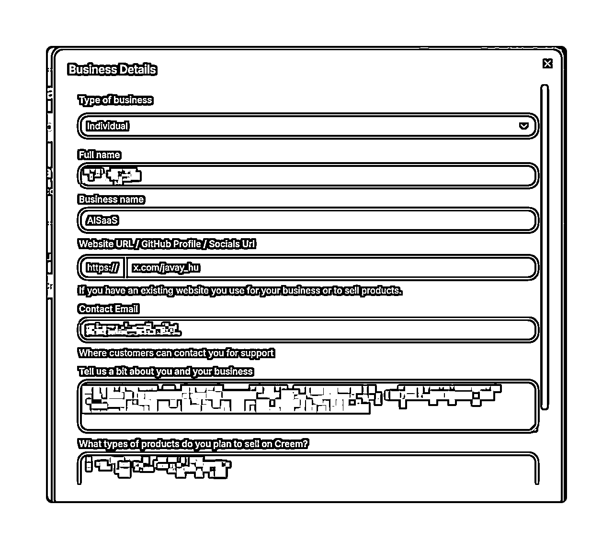

### 2.3 完善个人信æ¯

请按照下é¢çš„æµç¨‹ï¼Œå®Œæˆä¸ªäººä¿¡æ¯å¡«å†™ï¼Œä¸Šä¼ å¤§é™†èº«ä»½è¯çš„æ­£åé¢ï¼Œå¹¶ä¸”电脑摄åƒå¤´æ‹ç…§ï¼Œæœ€ç»ˆä½ çš„个人信æ¯ä¼šè¢«ä¿å­˜åˆ°Sumsub ID中。

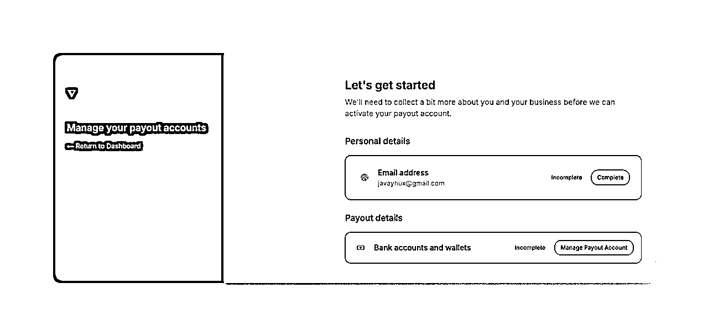

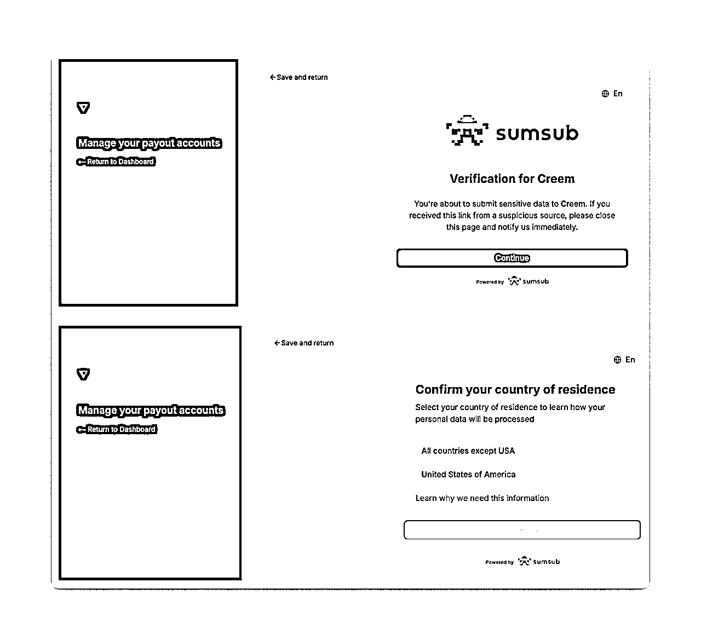

æ交完以å，你å¯èƒ½ä¼šçœ‹åˆ°ï¼š


è«æ…Œï¼Œç­‰å¾…å³å¯ï¼Œå¤§æ¦‚过了24å°æ—¶ï¼Œå°±ä¼šé‚®ä»¶é€šçŸ¥ 审核通过ï¼

当然 你也有å¯èƒ½æ˜¯ ç›´æ¥é€šè¿‡çš„é‚£ç§


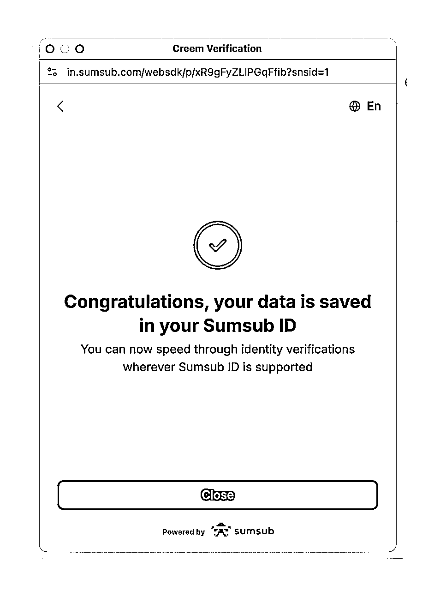

### 2.4 完善æç°ä¿¡æ¯

点击Payout Detailsçš„Manage Payout Account，完善æç°ä¿¡æ¯ã€‚


填写æç°è´¦å·çš„国家，选择China，å¸ç§é€‰æ‹©CNY，转账方å¼é€‰æ‹©æ”¯ä»˜å®ã€‚

æ¥ç€å¡«å†™æ”¯ä»˜å®çš„è´¦å·ï¼Œé‚®ç®±åœ°å€å’Œå…¨å（中文å）。

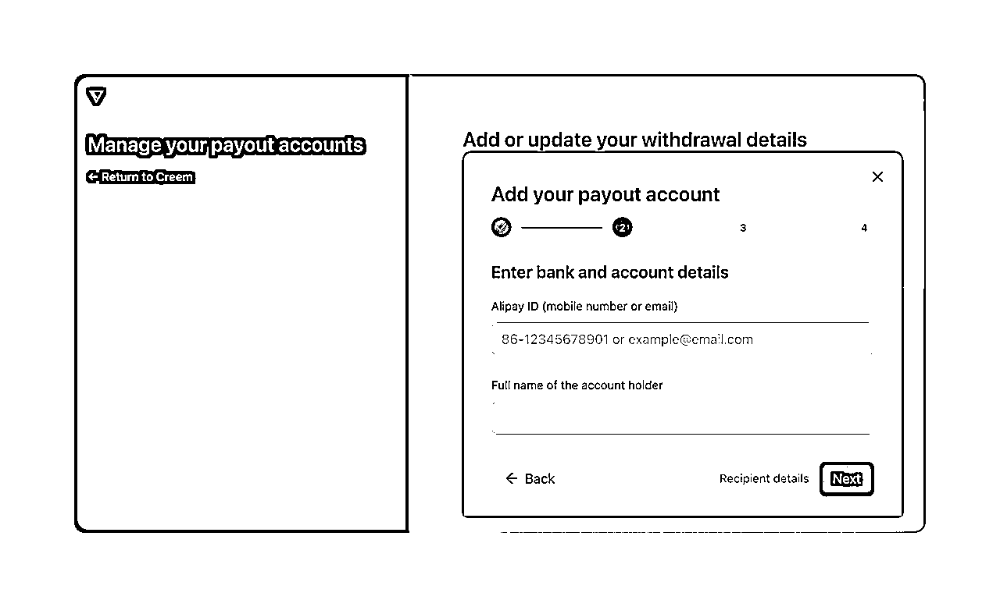

最å填写你的家庭地å€ï¼Œè¿™é‡Œå¦‚å®å¡«å†™å³å¯ã€‚æ交之å，个人信æ¯å’Œæç°ä¿¡æ¯å°±å®Œå–„好了。

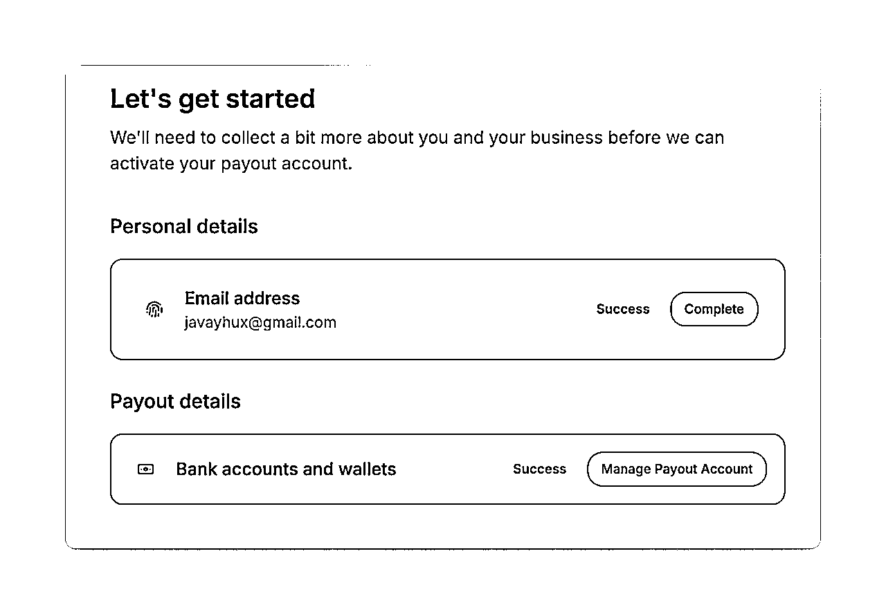

### 2.5 等待审核

最å就是等待审核，快的è¯ï¼ŒåŠå¤©åˆ°ä¸€å¤©å°±å¯ä»¥ç»“æœã€‚


# 二ã€å‡†å¤‡2套é…置信æ¯

测试ç¯å¢ƒå’Œç”Ÿäº§ç¯å¢ƒçš„é…置信æ¯ä¸ä¸€æ ·ï¼

这个é常的é‡è¦ï¼å½“åˆæˆ‘跟彩笺都忽略了“test modeâ€è¿™ä¸ªä¸œè¥¿ï¼

打开和关æ‰ï¼Œæ˜¯å®Œå…¨çš„2套内容，所以下é¢æ‰€æœ‰çš„东西，都è¦åš2é。

一个是 test mode一个是étest mode

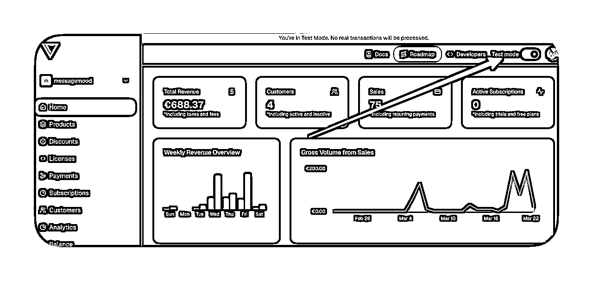

## 1\. product

首先是注册产å“

product--->add product

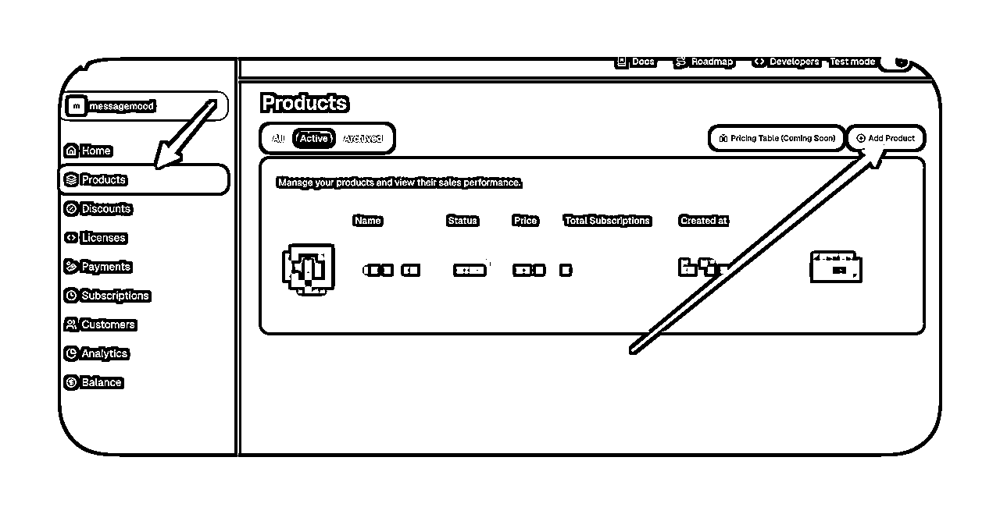

### 1.1 product details

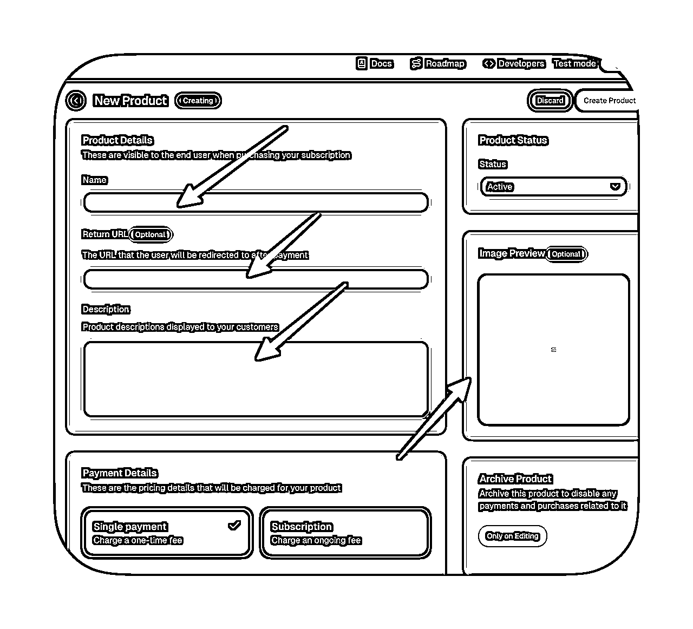

name：产å“åå­—

return url：用户在支付完æˆä»¥å，你希望对方返å›çš„页é¢

description：产å“介ç»ï¼ˆå¯ä»¥è®©ai生æˆå•¦ï½ï¼‰

status：选择active（激活状æ€ï¼‰

image preview:产å“图，å¯ä»¥ä¸Šä¼ ï¼Œå¯ä»¥ä¸ä¸Šä¼ 

### 1.2 payment details


支付方å¼ï¼šä½ æ˜¯ä¸€æ¬¡æ€§æ”¯ä»˜ï¼ˆsingle payment）还是 订阅类å‹ï¼ˆsubscrition）的支付

curency：货å¸æ–¹å¼

price:自定义价格

tax category：一般选择“digital goods or serviceâ€ï¼ˆè™šæ‹ŸæœåŠ¡ï¼‰

tax behaviour：是å¦åŒ…å«ç¨ï¼ˆçœ‹ä¸ªäººæƒ…况选择

### 1.3 product other infomation

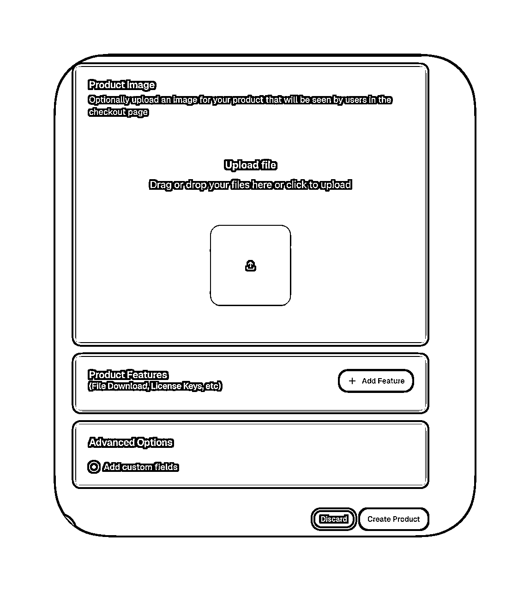

图片ã€ç‰¹æ€§ã€å…¶ä»–...

这些内容都能让aiæ定

填写完æˆä»¥å 点击“create productâ€

### 1.4 productä¿¡æ¯

在producté¡µé¢ è‡ªå·±åˆ›å»ºçš„äº§å“ æœ‰ä¸‰ä¸ªç‚¹ï¼Œç‚¹å‡»ä»¥å å¯ä»¥å¤åˆ¶è‡ªå·±çš„product id


## 2\. api key


点击å³ä¸Šè§’çš„ developer就创建自己的api key

记得创建2组，testå’Œétestçš„ 这是2个ä¸åŒçš„

# 三ã€webhook&ngrok（选择性）

## 1 什么是webhook

直通车

Webhook å¯ä»¥ç†è§£ä¸ºä¸€ä¸ªç½‘络通知器"。

想象你在等快递，有两ç§æ–¹å¼çŸ¥é“快递到了：

1.  传统方å¼ï¼šä½ æ¯éš”一会儿就è¦æ‰“å¼€App 查看快递到哪了（这就åƒä¼ ç»Ÿçš„轮询方å¼ã€‚隔一段时间就问，然å得到å›å¤ï¼‰

1.  Webhook æ–¹å¼ï¼šå¿«é€’员到了直æ¥ç»™ä½ æ‰“电è¯ï¼ˆè¿™å°±æ˜¯ Webhook 的工作方å¼ï¼‰

## 2 æ€ä¹ˆåˆ¤æ–­è‡ªå·±éœ€ä¸éœ€è¦

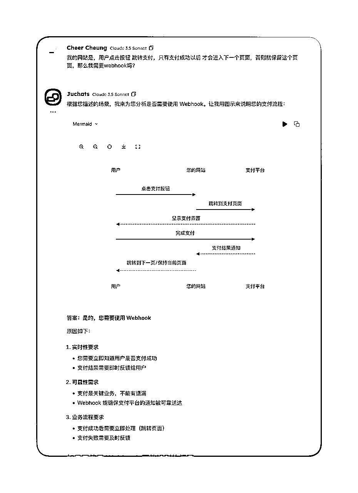

以下情况你å¯èƒ½éœ€è¦ Webhook：

1.  需è¦å®æ—¶é€šçŸ¥

*   用户下å•åç«‹å³é€šçŸ¥å•†å®¶

*   有人在你的åšå®¢ç•™è¨€åç«‹å³æ”¶åˆ°æ醒

1.  需è¦è‡ªåŠ¨åŒ–处ç†

*   用户付款æˆåŠŸå自动å‘è´§

*   有人æ交表å•å自动å‘é€ç¡®è®¤é‚®ä»¶

1.  需è¦ç³»ç»Ÿè”动

*   Github 代ç æ›´æ–°å自动部署网站

*   订å•ç³»ç»Ÿå’Œåº“存系统需è¦å®æ—¶åŒæ­¥

如æœä½ çš„网站ä¸éœ€è¦è¿™äº›å®æ—¶æ€§æˆ–自动化的功能，å¯èƒ½å°±ä¸éœ€è¦ Webhook。

## 3 准备webhook

如æœç»†å¿ƒçš„朋å‹ä¼šå‘ç°ï¼Œåˆšåˆšåœ¨åˆ›å»ºapi key的时候 æ—边就有一个 webhooks

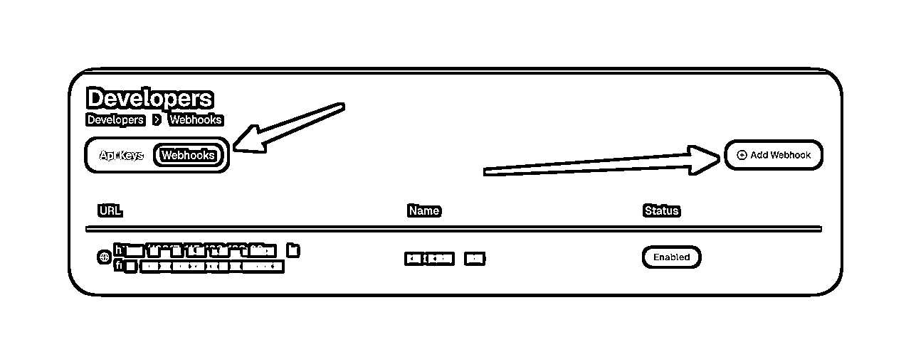

点击add webhookåªéœ€è¦å¡«å†™ä¸¤ä¸ªä¿¡æ¯

webhook name：å–个å字，这个通知器是通知什么的

webhook url：这个地方的url是指，在支付完æˆä»¥å，creem需è¦å‘哪一个page传达通知。

那这个url具体è¦æ€ä¹ˆå¡«å†™å‘¢ï¼Ÿ

### 3.1 étest mode

*   ç›´æ¥è®©cursor告诉你 需è¦é‚£ä¸ªé¡µé¢æ¥æ¥æ”¶é€šçŸ¥ï¼Œä»–就会给你一个路径，域å+pathå³å¯.例如下é¢çš„

```
www.XXXX.com/payment/result
```

### 3.2 test mode

按ç†è¯´åº”该是

```
http://localhost:3000/payment/result
```

但是 ä½ å¡«è¿›å» å°±å¾—åˆ°é€šçŸ¥ï¼Œä¸èƒ½ä½¿ç”¨æœ¬åœ°çš„路径，必须使用公开的URL。所以这个时候你就需è¦ä¸€ä¸ªæ–°çš„东西ngrok。

具体看下一个part的具体å®æ“

ç»è¿‡ngrokçš„æ“作以å，本地è¿æ¥å°±ä¼šå˜æˆä¸€ä¸ªå¯ä»¥ç”¨çš„public url

```
https://8733-191-204-177-89.sa.ngrok.io/payment/result
```

### 3.3 è·å– webhookRUL

创建完æˆä»¥å è·å– webhookçš„URL


### 3.4 è·å–webhookçš„secret


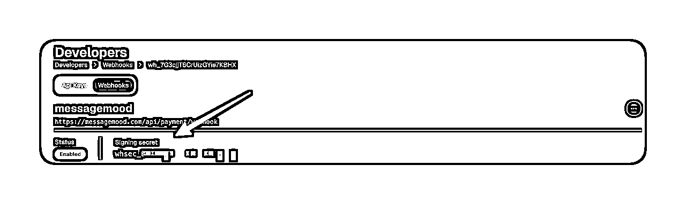

## 4\. ngrok

ngrok 是一个é常å®ç”¨çš„网络工具，它的主è¦ä½œç”¨æ˜¯å¸®åŠ©æˆ‘们å®ç°"内网穿é€"，开å‘者å¯ä»¥è®©å…¶ä»–人å®æ—¶æŸ¥çœ‹æœ¬åœ°å¼€å‘的网站

### 4.1 注册账å·

ngrok

å¯ä»¥googleç›´æ¥ç™»å½•ï¼Œç‚¹å‡»èœå•æ çš„ “your authtokenâ€ï¼ŒæŸ¥çœ‹å¹¶å¤åˆ¶ä½ çš„token


### 4.2 安装ngrok

#### 4.2.1 下载

```
brew install ngrok
```

也å¯ä»¥ç›´æ¥ç‚¹å‡»â€œdownloadâ€è¿›è¡Œä¸‹è½½ï¼Œé€‰æ‹©å¯¹åº”的芯片


#### 4.2.2 加入token

添加 authtoken到电脑上，终端è¿è¡Œä¸‹é¢å†…容

```
ngrok config add-authtoken ä½ çš„token
```

### 4.3 使用ngrok

å¯åŠ¨æœ¬åœ°å¼€å‘æœåŠ¡ï¼Œç»ˆç«¯è¿è¡Œä¸‹é¢ğŸ‘‡

```
npm start
```

è¿è¡Œngrok，一般程åºåœ¨3000端å£ï¼Œå¦‚æœä½ çš„有指定修改端å£å³å¯

```
ngrok http 3000
```

è¿è¡Œå®Œä»¥åä¼šå‡ºç° ç±»ä¼¼ä¸‹é¢çš„图，就得到了localçš„path对应的public URL

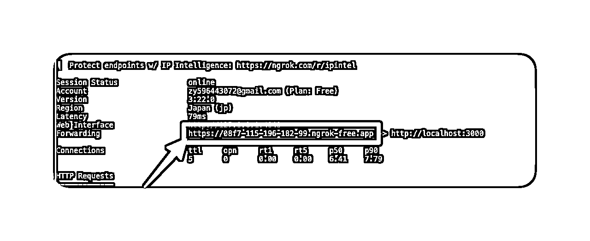

最åå†æŠŠæˆ‘们需è¦çš„具体pathæ¢è¿›å»ä¾‹å¦‚

```
localhost:3000/payment/result
```

Public URL就是

```
https://08f7-115-196-182-99.ngrok-free.app/payment/result
```

### 4\. 注æ„事项

å…费版本的，æ¯ä¸€æ¬¡ run ngrok以å 都会生æˆä¸€ä¸ªéšæœºçš„url。

如æœä½ å…³é—­äº†terminal以å，å†æ¬¡æ‰“开，就会生æˆå¦å¤–一个URL，你就需è¦å»creem里é¢æ›´æ¢mode 模å¼ä¸‹çš„ webhookçš„URLï¼

# å››ã€é…ç½®

## 1\. 检查é…置信æ¯

ç»è¿‡ä»¥ä¸Šç§ç§ ，我们应该就得到了下é¢çš„所有东西

env文件

```
CREEM_API_KEY=
CREEM_PRODUCT_ID=
CREEM_API_URL=https://api.creem.io
CREEM_SUCCESS_URL=
```

### api_key

```
CREEM_API_KEY=
CREEM_API_KEY_TEST=
```

### product_id

```
CREEM_PRODUCT_ID=
CREEM_PRODUCT_ID_TEST=
```

### api URL

这个好åƒæ˜¯é€šç”¨çš„

```
CREEM_API_URL=https://api.creem.io
CREEM_API_URL_TEST=https://test-api.creem.io
```

### webhook 相关

```
CREEM_WEBHOOK_URL_test=
CREEM_WEBHOOK_URL=
CREEM_WEBHOOK_secret_test=
CREEM_WEBHOOK_secret=
```

### 支付æˆåŠŸä»¥åè¦è¿”å›çš„页é¢è·¯å¾„

```
CREEM_SUCCESS_URL=
CREEM_SUCCESS_URL_TEST=
```

## 2\. 使用cursorè¿æ¥

### 2.1 支付的逻辑

我让ai给我画了一个说æ˜çš„æµç¨‹å›¾ï¼Œç»“æœæ„Ÿè§‰ç”»çš„é常å¤æ‚，看起æ¥å¯èƒ½çœŸçš„这么å¤æ‚，简å•æ¥è¯´å°±æ˜¯ï¼Œ

*   å‰ç«¯çœ‹åˆ°çš„：用户点击付款按钮--->跳转付款页é¢--->填写信æ¯ä»˜æ¬¾æˆåŠŸ--->è¿”å›æŸä¸ªé¡µé¢/è·å¾—积分

*   å端å®é™…：æœåŠ¡å™¨å‘起请求--->支付端收到请求，给了一个付款è¿æ¥--->æœåŠ¡å™¨æŠŠä»˜æ¬¾è¿æ¥ä¼ ç»™ç”¨æˆ·--->用户支付--->支付端收到支付通知--->支付端给æœåŠ¡å™¨å›ä¼ æ¶ˆæ¯ï¼ˆé€šçŸ¥æ”¯ä»˜å®Œæˆï¼‰

大概就是这么个æ„æ€ï½ï¼ˆä¸»æ‰“一个看图说è¯

网站的支付就2ç§ï¼Œä¸€æ¬¡æ€§ï¼ˆpay one-time）&订阅（subscribe），下é¢å°±æ‰‹æŠŠæ‰‹æŠŠå¸¦å¤§å®¶å°è¯•ä¸€ä¸‹ 一次性付费。

é…置规则文档直通车

### 2.2 一次性付费（Return URL）

一å¥è¯è¯´é€»è¾‘就是：é…置规则在这里，我有这些é…置信æ¯ï¼Œæˆ‘希望å®ç°ä»€ä¹ˆæ•ˆæœï¼Œä½ å¸®æˆ‘写

划é‡ç‚¹â€œé…置信æ¯â€ã€â€œé…置规则â€ã€â€œå®ç°æ•ˆæœâ€

就是这3个内容，é…置信æ¯ä¸Šé¢æˆ‘们已ç»æ定，æ¥ä¸‹æ¥å°±æ˜¯é…置规则和å®ç°æ•ˆæœ

先确定我们这一次的å®ç°æ•ˆæœ

âš ï¸æ•´ä¸ªæ“作，ä¸æ¶‰åŠç”¨æˆ·æ³¨å†Œå’Œç™»å½•ï¼Œæ‰€ä»¥ä¹ŸæŒºå®¹æ˜“å®ç°çš„，别害怕，å³ä½¿æ˜¯åé¢æœ‰æ³¨å†Œå’Œç™»å½•ï¼Œä¹Ÿéƒ½æœ‰ç¬¬ä¸‰æ–¹é›†æˆï¼Œè«æ…Œï¼

这个å®ç°é€»è¾‘，我们是需è¦æœ‰ä¸€ä¸ªä½¿ç”¨å‚æ•°`success_url`å’Œ`signature验è¯`ç›´æ¥çœ‹åˆ°å¯¹åº”文档官方解释

1.  您å¯ä»¥ä¸ºæ¯ä¸ª checkout_session 传递一个自定义的success_url，它将覆盖success_url产å“上的设置。这使得您å¯ä»¥åœ¨æ¯æ¬¡ä»˜æ¬¾å动æ€åœ°å°†ç”¨æˆ·é‡å®šå‘到自定义页é¢ï¼ˆå¯¹äºåœ¨ä»˜æ¬¾å将用户引导到他们的特定å¸æˆ·èµ„æºå¾ˆæœ‰ç”¨ï¼‰ã€‚

1.  è¿”å›å’Œé‡å®šå‘ URL 是æˆåŠŸä»˜æ¬¾å您的客户将被é‡å®šå‘到的 URL。它们包å«ç”± creem ç­¾åçš„é‡è¦ä¿¡æ¯ï¼Œæ‚¨å¯ä»¥ä½¿ç”¨è¿™äº›ä¿¡æ¯æ¥éªŒè¯ä»˜æ¬¾å’Œç”¨æˆ·ã€‚

划é‡ç‚¹ï¼šä»˜æ¬¾æˆåŠŸï¼Œé‡å®šå‘的自定义页é¢ï¼Œä½¿ç”¨ä¿¡æ¯éªŒè¯ä»˜æ¬¾ï¼ˆå’Œç”¨æˆ·ï¼‰

一次性付费总共需è¦3个API：创建checkoutã€ç”Ÿæˆsignatureã€éªŒè¯signature

#### API1:创建会è¯

```
const redirectUrl = await axios.post(
      `https://api.creem.io/v1/checkouts`,
        {
          "success_url": "https://example.com",
          "product_id": "prod_your-product-id",
        },
        {
          headers: { "x-api-key": `creem_123456789` },
        },
    );
```

看起æ¥å“人，å®é™…上就4个东西：

1.  https://api.creem.io/v1/checkouts支付è¿æ¥(固定的，测试和生产2个ä¸åŒè¿æ¥)

1.  success_url": "https://example.com 支付æˆåŠŸä»¥åä½ è¦å»åˆ°çš„页é¢path（路径）

1.  "product_id": "prod_your-product-id æ¢æˆä½ çš„产å“id

1.  "x-api-key": `creem_123456789 æ¢æˆä½ çš„api key（测试和生产2个ä¸åŒï¼‰

我的文件如下：

```
import axios from 'axios';

export interface CreateCheckoutParams {
  productId: string;
  requestId?: string;
  successUrl?: string;
}

export interface CreateCheckoutResponse {
  checkout_url: string;
  [key: string]: any;
}

/**
 * 创建Creem结账会è¯
 * @param params 结账å‚æ•°
 * @returns 包å«ç»“è´¦URLçš„å“应
 */
export async function createCheckout(params: CreateCheckoutParams): Promise {
  try {
    const API_URL = process.env.CREEM_API_URL || 'https://test-api.creem.io';
    const API_KEY = process.env.CREEM_API_KEY || 'creem_test_3sioDtbY5ADbmoODbQnNiW';

    // è·å–æ ¼å¼åŒ–çš„API基础URL（确ä¿æ²¡æœ‰å°¾éƒ¨æ–œæ ï¼‰
    const baseUrl = API_URL.endsWith('/') ? API_URL.slice(0, -1) : API_URL;
    const apiUrl = `${baseUrl}/v1/checkouts`;

    const response = await axios.post(
      apiUrl,
      {
        product_id: params.productId,
        request_id: params.requestId,
        success_url: params.successUrl,
      },
      {
        headers: { 'x-api-key': API_KEY },
      }
    );

    if (!response.data || !response.data.checkout_url) {
      throw new Error('API response does not contain checkout_url');
    }

    return response.data;
  } catch (error) {
    console.error('Error creating checkout session:', error);
    if (axios.isAxiosError(error) && error.response) {
      console.error('API error response:', error.response.data);
    }
    throw error;
  }
} 
```


(GPT的解读，下é¢çš„你也å¯ä»¥å‘给任æ„aiå»çœ‹çœ‹å†™çš„到底是什么)

#### API2:生æˆsignture

```
import crypto from 'crypto';

/**
 * 生æˆCreemç­¾å
 * @param params å‚数对象
 * @param apiKey API密钥
 * @returns 生æˆçš„ç­¾å
 */
export function generateSignature(params: Record, apiKey: string): string {
  // 创建格å¼ä¸º "key1=value1|key2=value2|...|salt=apiKey" çš„æ•°æ®å­—符串
  // é‡è¦ï¼šä¸è¦å¯¹é”®è¿›è¡Œæ’åº - 按照æ供的顺åºä½¿ç”¨
  const data = Object.entries(params)
    .map(([key, value]) => `${key}=${value}`)
    .concat(`salt=${apiKey}`)
    .join('|');

  // 使用SHA-256哈希算法生æˆç­¾å
  const hash = crypto.createHash('sha256').update(data).digest('hex');
  return hash;
} 
```

#### API3:验è¯ç­¾åsignature

```
import { generateSignature } from './signatureUtils';

export interface RedirectParams {
  request_id?: string | null;
  checkout_id?: string | null;
  order_id?: string | null;
  customer_id?: string | null;
  subscription_id?: string | null;
  product_id?: string | null;
}

/**
 * 验è¯Creemç­¾å
 * @param params é‡å®šå‘å‚æ•°
 * @param signature è¦éªŒè¯çš„ç­¾å
 * @returns ç­¾å是å¦æœ‰æ•ˆ
 */
export function verifySignature(params: Record, signature: string): boolean {
  try {
    const API_KEY = process.env.CREEM_API_KEY || 'creem_test_3sioDtbY5ADbmoODbQnNiW';

    // 过滤æ‰null/undefined值，并移除signatureå‚数（如æœå­˜åœ¨ï¼‰
    const filteredParams: Record <string string="">= {};
    Object.entries(params).forEach(([key, value]) => {
      if (value !== null && value !== undefined && key !== 'signature') {
        filteredParams[key] = value;
      }
    });

    // 使用Creemæ供的方法生æˆç­¾å
    const computedSignature = generateSignature(filteredParams, API_KEY);

    // 比较计算的签åä¸æ¥æ”¶åˆ°çš„ç­¾å
    return computedSignature === signature;
  } catch (error) {
    console.error('Error verifying signature:', error);
    return false;
  }
}</string> 
```

## 测试支付

### 3.1 测试支付

测试支付时使用测试信用å¡

å¡å·

```
4242 4242 4242 4242
```

其他信æ¯éƒ½å¯ä»¥éšä¾¿å¡«å†™

### 3.2 å®é™…支付（必须看ï¼ç—›å¤±40刀）

完æˆäº†ä»¥ä¸Šæ‰€æœ‰çš„，也完æˆäº†æµ‹è¯•æ¨¡å¼çš„支付以å，准备å®é™…检查一下，生产ç¯å¢ƒçš„真å®æ”¯ä»˜äº†ï¼Œè¯·ä¸€å®šè¦åšä»¥ä¸‹äº‹æƒ…，ä¸ç„¶è·åŒ…真的会痛ï¼

#### 💶1000å…ƒå…手续费说æ˜

这个1000元的货å¸å•ä½ç«Ÿç„¶æ˜¯â€œæ¬§å…ƒâ€ï¼è¯·æ³¨æ„，ä¸æ˜¯ç¾å…ƒï¼Œæ˜¯æ¬§å…ƒã€‚我跟彩笺都踩了这个å‘，一开始我的产å“设置的就是ç¾å…ƒï¼Œè‡ªå·±ç»™è‡ªå·±ä»˜äº†9.9以åå‘ç°æ‰£äº†æ‰‹ç»­è´¹ï¼åæ¥ä»”细看，越看越ä¸å¯¹åŠ²å„¿ï¼Œè¿™ä¸ªç¬¦å·ï¼Œå°±æ˜¯æ¬§å…ƒç¬¦å·å§ï¼

#### ğŸ«Discount 折扣

在èœå•é¡µï¼Œæœ‰ä¸€ä¸ªé常æ˜æ˜¾çš„discount按钮，这里å¯ä»¥è‡ªå·±åˆ›å»ºä¼˜æƒ åˆ¸ï¼Œæœ€é«˜æ˜¯100%的折扣，也就是å…费使用ï¼

å…费使用ï¼

在æ—悦己给自己的支付测试冲了5次9.9ç¾åˆ€ä»¥å，在大哥的æ醒下，å‘ç°å¹¶ä½¿ç”¨äº†è¿™ç©æ„儿，一开始我还åªæ˜¯è®¾ç½®90%，结æœå¤§å“¥è‡ªå·±æµ‹è¯•çš„时候，直æ¥ä¸Šäº†100%（我？）

有了这个折扣券，在支付的时候甚至ä¸éœ€è¦è¾“入银行å¡ä¿¡æ¯ï¼Œåªéœ€è¦è¾“å…¥discountçš„code就会显示FREEï¼

#### 💰Refund 退款

在大哥的æ醒下，我åˆæ— æ„中点进了我的payment，想ç€ï¼Œæ˜¯ä¸æ˜¯å¯ä»¥é€€æ¬¾ï¼ˆrefund），还真给我找到了，点击order最å³è¾¹çš„三个点，就会有一个“refundâ€æŒ‰é’®ï¼Œ2分钟内完æˆé€€æ¬¾

（如æœæ˜¯ç«‹åˆ»æ”¯ä»˜ï¼Œä¿¡ç”¨å¡è¿˜æ²¡å…¥è´¦çš„情况，写这个帖å­çš„时候，我有4笔9.9是几天å‰çš„，还没退给我）

# 五ã€å®æˆ˜æ“作演示

å‰æ：这次å®æˆ˜ï¼Œåªä¸“注在如何æ¥æ”¯ä»˜çš„api，关äºâ€œç™»å½•â€ã€â€œæ•°æ®åº“â€ç­‰éƒ¨åˆ†ä¸ä¼šè¯¦ç»†è¯´æ˜ï¼ˆåé¢æˆ‘也准备å†å†™ä¸€ç¯‡æ¥æ”¯ä»˜çš„）

## 5.1 完æˆçš„效æœ

点击按钮，触å‘支付，完æˆæ”¯ä»˜ï¼Œè¿”å›æŒ‡å®šçš„æˆåŠŸé¡µé¢ï¼Œcreemåå°æŸ¥çœ‹é’±æ˜¯å¦æ”¶åˆ°

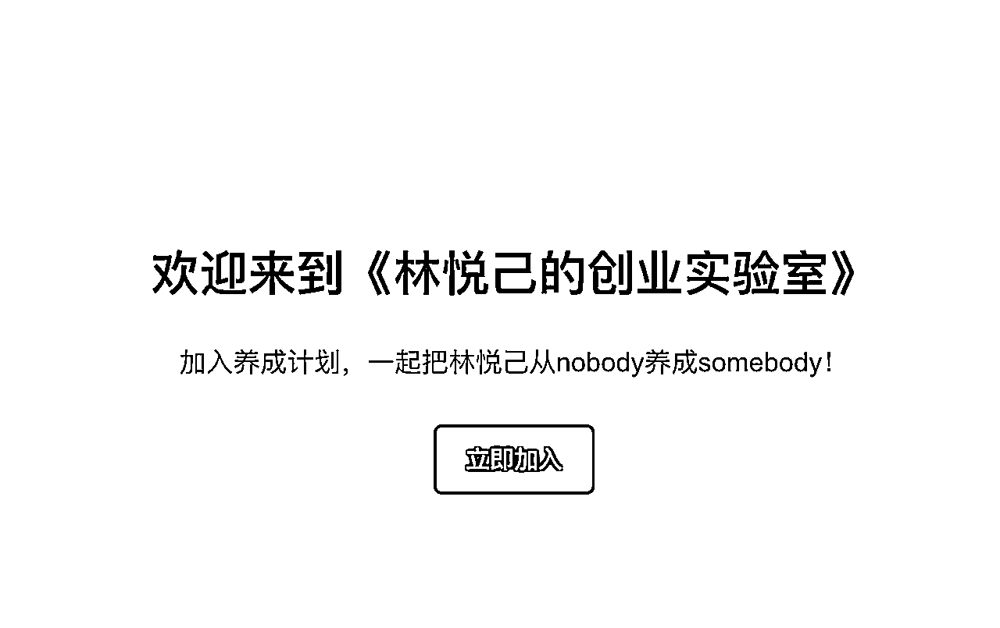


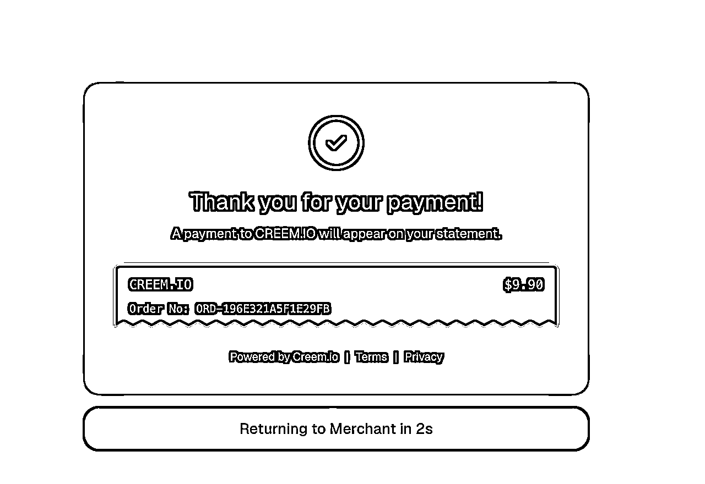


## 5.2 代ç ç»“æ„

为了节çœcursor的次数，我使用augment作为演示（还没有用上augment的朋å‹å¯ä»¥çœ‹æˆ‘之å‰é‚£ç¯‡augment，ç°åœ¨è¿˜èƒ½è–…羊毛，越早上车越好）ï¼

```
支付æµç¨‹
├── 1\. 用户点击支付按钮 (app/page.tsx)
│   └── 生æˆå”¯ä¸€requestId
│
├── 2\. å‰ç«¯è°ƒç”¨API (app/api/create-checkout/route.ts)
│   └── 调用createCheckoutæœåŠ¡
│       └── services/creem/createCheckout.ts
│           ├── 使用ç¯å¢ƒå˜é‡è·å–APIé…ç½®
│           ├── 调用Creem API创建结账会è¯
│           └── è¿”å›checkout_url
│
├── 3\. 用户被é‡å®šå‘到Creem支付页é¢
│
├── 4\. 支付完æˆå，Creemé‡å®šå‘å›success页é¢
│   ├── URL包å«æ”¯ä»˜ç»“æœå‚数和签å
│   └── app/success/page.tsx (æœåŠ¡ç«¯ç»„件)
│       └── app/success/client.tsx (客户端包装器)
│           └── components/SuccessContent.tsx
│               ├── ä»URLè·å–å‚æ•°
│               ├── 调用verifySignature验è¯ç­¾å
│               │   └── services/creem/verifySignature.ts
│               │       ├── 过滤å‚æ•°
│               │       └── 调用generateSignature生æˆç­¾å
│               │           └── services/creem/signatureUtils.ts
│               │               ├── 按照Creem规则格å¼åŒ–å‚æ•°
│               │               ├── 添加API密钥作为salt
│               │               └── 使用SHA-256生æˆå“ˆå¸Œ
│               └── æ ¹æ®éªŒè¯ç»“æœæ˜¾ç¤ºæˆåŠŸæˆ–失败页é¢
```

### å„文件详细功能

1.  signatureUtils.ts:

*   核心功能：生æˆç¬¦åˆCreem规范的签å

*   工作方å¼ï¼šå°†å‚数按照key1=value1|key2=value2|...|salt=apiKeyæ ¼å¼è¿æ¥ï¼Œç„¶å使用SHA-256哈希算法生æˆç­¾å

*   被verifySignature.ts调用æ¥éªŒè¯ç­¾å

1.  verifySignature.ts:

*   核心功能：验è¯ä»Creemé‡å®šå‘å›æ¥çš„URL中的签å

*   工作方å¼ï¼šè¿‡æ»¤å‚数，移除signatureå‚数，调用generateSignature生æˆç­¾å，然åä¸URL中的签å比较

*   被SuccessContent.tsx组件调用æ¥éªŒè¯æ”¯ä»˜ç»“æœ

1.  createCheckout.ts:

*   核心功能：调用Creem API创建结账会è¯

*   工作方å¼ï¼šä½¿ç”¨axioså‘é€POST请求到Creem API，返å›åŒ…å«checkout_urlçš„å“应

*   被app/api/create-checkout/route.ts调用

1.  app/api/create-checkout/route.ts:

*   核心功能：处ç†å‰ç«¯æ”¯ä»˜è¯·æ±‚

*   工作方å¼ï¼šæ¥æ”¶å‰ç«¯è¯·æ±‚，验è¯å‚数，调用createCheckoutæœåŠ¡ï¼Œè¿”å›ç»“æœ

*   被app/page.tsx中的支付按钮点击事件调用

## 5.3 è·ŸAI对è¯çš„过程

```
我需è¦æ¥å…¥creem，在service下é¢ï¼Œå¸®æˆ‘å°è£…creemçš„apiæ¥å£ï¼Œapi一共有3个，分别是 “createCheckoutâ€ã€â€œsignatureUtilsâ€ã€â€œverifySignatureâ€
å…³äºè¿™ä¸‰ä¸ªçš„å‚考文件我已ç»æ”¾åˆ°readme里é¢ï¼Œä½ å¯ä»¥å‚考学习，ç¯å¢ƒå˜é‡æˆ‘å·²ç»å‡†å¤‡å¥½äº†
代ç å†™å®Œä»¥å 请测试最å的验è¯signature，æˆåŠŸä»¥å处ç†é¦–页按钮的调用
```

写好md文件，å‘出prompt，就开始自己工作了

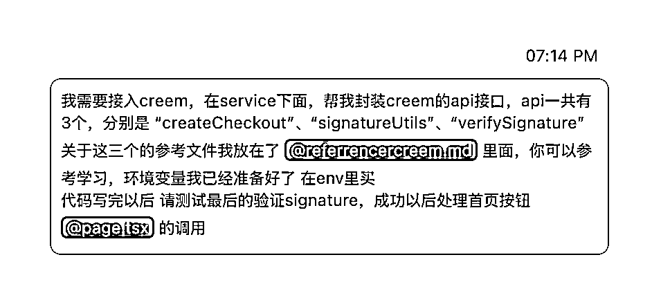

如æœä½ é‡åˆ°äº† verify失败，就是下é¢è¿™ç§æƒ…况


就让ai检查verify的代ç å’Œå‚考代ç çš„区别，严格按照å‚考代ç è¿›è¡Œä¿®æ”¹ï¼š


# å…­ã€ç¢ç¢å¿µ

一开始ä¸æ‡‚，真的是很正常的，ä¸æ‡‚就硬上ï¼å´©æºƒ100次以å，就进入下一个阶段了ï¼

支付ã€ç™»å½•çœŸçš„是2座å¯æ€•çš„大山，这篇内容其å®åœ¨3月底的时候我就写好了，一直想加一个å®æ“演练，结æœå°±æ‹–到了ç°åœ¨ã€‚

é¢å¯¹è¿™ä¸ªè‡ªå·±å®³æ€•çš„东西，ææ˜ç™½æ”¯ä»˜åˆ°åº•æ€ä¹ˆæ¥ï¼Œapi还有service之间的关系到底是æ€æ ·ï¼Œä¼¼æ‡‚é懂等äºä¸æ‡‚，完全懂，完全æ˜ç™½ï¼Œå®Œå…¨æŒæ¡ï¼Œæ‰ç®—真正克æœäº†è¿™åº§å¤§å±±ã€‚借è€å¸ˆçš„é‚£å¥è¯ï¼Œä»Šå¤©ï¼Œæˆ‘终äºæŠŠæ”¯ä»˜è¿™é¢—ç å­ 给扔æ‰äº†ï¼


希望这篇内容能帮助到需è¦æ¥æ”¯ä»˜çš„你，如æœæ¥å…¥æˆåŠŸï¼Œæ¬¢è¿å›æ¥ç•™è¨€å–”ï¼