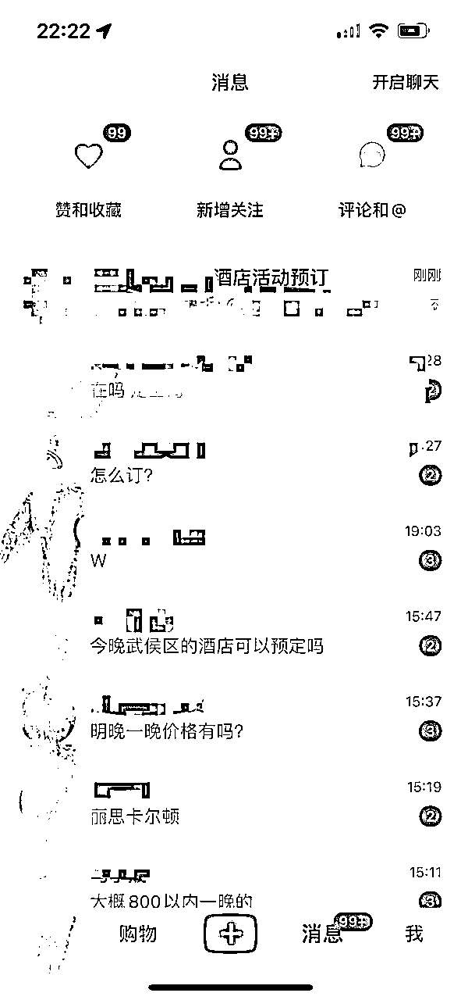

# 高客单副业《酒店代订》全网最全攻略【补充版】

> 来源：[https://fi8jncah4ds.feishu.cn/docx/RyS7dVX4koi1KbxUgDHcMwd5n1b](https://fi8jncah4ds.feishu.cn/docx/RyS7dVX4koi1KbxUgDHcMwd5n1b)

自我介绍

大家好，我是风小海。公众号同名

人在武汉，三年生财老圈友，服装行业，亏过也赚过，现在时间自由，离财富自由还差亿点点。

在过去的一年里，我通过发风向标兑换了一年生财门票，我不是天赋型选手，只是走过不少弯路，踩过的坑刚好比你多一点。所以我想把这些年亲自试过的赚钱项目一条条写下来，这段我会分享100个真实项目，全都写给认真生活、认真赚钱的人。

我第一桶金的故事

* * *

# 前情提要

这可能是全网第一次有人系统性地将酒店代订这个项目放在台面上讲，应该会得罪不少人。

但我知道，有太多普通人正急着找一个靠谱的副业。别说创业了，就算是多赚个1000块，也能缓一口气。

这个项目，不用囤货、不用发快递、更不用露脸直。

哪怕你不打算做这个生意，自己出去旅游、出差，住酒店也能省下不少钱。

更重要的是，它没有你想象的那么难，也没有那么卷。只要一部手机，嘴巴不笨，就能试一试。

感谢 @潇墨｜生财鱼丸 很有耐心的帮我审稿

本文核心内容是告诉你市面上酒店代订的所有渠道和原理，以及如何用“旅行社协议价”在小红书和闲鱼引流来获取酒店佣金。

# 酒店的品牌与分类（科普一下）

在你正式学会怎么靠“酒店代订”赚钱之前，咱们先把酒店这门生意的门槛降一降。毕竟你得先知道客户想住什么，你才能知道怎么赚他们的钱，对吧？

我们可以把酒店按“段位”来分个级，打个比方：

#### 【1星~3星】经济型

这类就像快餐店，住得起，用得上，讲究的是便宜又干净。

比如：如家、汉庭、7天、锦江之星、格林豪泰

客单价：100-300元/晚

#### 【3星+~4星】中档酒店

有床、有桌、有窗，适合出差和短期旅行。

比如：全季、桔子、亚朵、怡程、喆啡

客单价：300-600元/晚

#### 【4星+~5星】高端酒店

带点调性，适合小资情侣、商务宴请、仪式感住客。

比如：希尔顿欢朋、万达嘉华、美居、华邑、皇冠假日

客单价：600-1200元/晚

#### 【五星+】豪华酒店

品牌响、服务好、硬件顶，住进去你会觉得：我人上人了。

比如：香格里拉、洲际、瑰丽、悦榕庄、W酒店、英迪格

客单价：1200-3000元/晚

#### 【顶奢天花板】一晚一个iPhone

这类酒店，住一次就能在朋友圈吹一年，你赚的差价也大得惊人。

比如：宝格丽、安缦、文华东方、四季、丽兹卡尔顿、半岛酒店

客单价：3000起跳，8000+很正常，节假日上万也是常事

# 酒店术语

看懂这些术语，你就比80%的人更懂酒店了。做酒店代订，懂行话是基本功，下面这些词，你得搞明白：

1️⃣ BAR价（Best Available Rate）

通俗点说就是“门市价”，是酒店官网或OTA上给普通顾客看到的最公开的价格。

### 2️⃣ 协议价

给大客户、旅行社、代理的专属价。

### 3️⃣ 房型术语别搞混：

大床房：只有一张大床，适合情侣或单人商旅

双床房 / 标间：两张单人床，适合闺蜜、基友或拼房出行

套房（Suite）：有客厅、有卧室，有的还有厨房，适合商务接待或“重要时刻”

行政楼层（Executive Floor）：带专属酒廊、早餐和下午茶，很多商旅人士会选

家庭房 / 三人房：适合一家出行，有时有上下铺，适合遛娃家庭

无窗房：一般价格便宜，但住起来可能像“密室逃脱”，谨慎推荐

### 4️⃣ 房态术语

甩房：酒店临时降价清库存，聪明的代订人会时刻盯着这些机会

封房：节假日满房，不接受预订，但有时你能拿到“隐藏资源”

Overbook（超卖）：有些酒店会超额接单，常住老客户反而有更大概率被“升级”

### 5️⃣ OTA（Online Travel Agency）

线上旅行社，也就是你熟悉的：携程、飞猪、去哪儿、马蜂窝、同程...等等

代订的核心竞争力，就是比这些平台“更便宜”、“更灵活”。客户的第一反应永远是“你比携程便宜吗？”

### 6️⃣ PNR / 酒店确认号

客人订完房会收到一个“确认号”，也叫PNR。这是你和客户之间的“信任锚点”，尤其你不是平台、又不露脸直播时，一串编号比你发 10 条语音都管用。

### 7️⃣酒店常用语

CI / CO：Check-in / Check-out，入住 / 退房。

No Show：订了房却没来，“鸽了”。

Upgrade：升级房型。通常要会员或加钱，但也有操作空间，技巧以后讲。

含早 / 不含早：有些酒店早饭比房费还贵，订的时候别只看价格，看清楚有没有早餐。

# 代订有哪些渠道

想靠酒店代订赚钱，第一步不是吆喝客户，而是搞清楚你手上能拿到什么房、凭什么比别人便宜。

这部分，就是带你摸清这些“进货渠道”的门道，弄懂你到底在卖什么。越懂货，越有底气

## 保级房 / 房卡房

很多酒店的高级会员每年都有一定的入住次数要求，有些人没时间去住，又想保住他们的高端会员身份，就会把这些房挂在网上售卖，让别人帮他去住。那他们为什么非要保级呢？因为会员福利太香了：除了折扣优惠之外，还有免费升房 免费早餐 延迟退房 酒廊随便吃。这样你们俩都双赢！会员既完成了入住次数，卡保住了，你也住到了优惠和会员待遇。

有些酒店查的比较严，必须要本人到前台登记才能办理入住，这个时候就出现了房卡房。预订人订完房后，把房卡交给你，不刷身份证，悄悄绕过前台，你拿着房卡直接上楼住。

## 世界500强的协议价

就是那种“高大上”大公司专享的内部福利，最低能到5折左右。这种协议价可不是谁都能拿到的，它是通过一些大公司的全球合作协议，专门为员工提供的超优惠酒店房价，通常是酒店给大公司或者集团的特别折扣价。

早些年酒店前台管的比较松，有些代订人是直接用PS的“大厂工作证”的搞定前台，让你蹭上协议价，他再从中间赚一笔。当然偶尔也会遇上一些尴尬事，这个时候就考验你的演技和心理素质了。

现在就没这么简单了，通常是大厂的员工用自己的身份去前台登记，以房卡房的形式交给你，赚取一点外快。

## 澳门的会员房

说白了就是赌场搞的活动，原理其实不复杂。你每在赌场里梭哈一次，系统就给你记上一笔积分。这个积分不是超市会员卡那种积分，不能换鸡蛋，但可以换酒店房。

这时候，传说中的“叠码仔”就登场了。他们就像赌场的中介经纪人，掌握着大量高赌客的“积分资源”。这些房就会被他们低价拿出来卖，夸张点说，价格可以接近无限低，哪怕赚几十也行，因为这些积分一过期就打水漂，今天不用，明天作废，能出掉一单是一单。但便宜归便宜，也不是百分百稳妥。叠码仔的职业道德……嗯，得看人品，有靠谱的，也有跑路的。因为这些房源，跟你抢的人太多了，它不像正规平台锁房那样保险，更像一场小型拍卖：谁出价高，谁就能睡上那张五星级的大床。所以你哪怕已经付款了，美滋滋收拾行李准备出发，也别太早开心，在你打车赶往酒店的路上，叠码仔可能已经把房间转手给了一个多加200块的土豪哥，只剩下你大包小包在风中凌乱。

## 各大OTA的包房

如果你把酒店比作一个演唱会现场，那OTA平台（像携程、飞猪、同程这类）拿到的“包房”，就相当于黄牛提前扫了一排前排票。

OTA们会提前和酒店谈好一个批量价格，比如：我一次性跟你订100间房，能不能给我个友情价？

酒店一想，这批房反正短期也卖不完，有人愿意预付现金，当然好说！

于是这些包下来的房，被OTA拿来打包上架、自由组合，再做个“特价限时秒杀”，加点“含双早/延迟退房”小buff，就成了你我眼中“捡漏价”的来源。如果经常在携程订酒店的话，相信你肯定看到过有些房型上会标有“代理”字样，这些房的来源就是这里。

## 房券房

简单说就是酒店界的拼多多百亿补贴，酒店为了拉新、冲销量、做口碑，经常和各种平台、银行、信用卡、公司搞联合促销，发一堆限时房券。因为淡季真没人住，酒店宁愿打折回点现金，也不想让房间空着发霉。

大多数人根本懒得用这些券，或者忘记了于是就有人低价收券，再转手卖出，赚中间差价

所以你看到很多酒店在某些平台、团购群、员工福利商城上偷偷甩房券。看着像亏，其实是回血。

# 旅行社协议价（重点）

旧时王谢堂前燕，飞入寻常百姓家

### 代订圈里的“正规军”，不押金不跑路，还自带五星待遇

正规手续入住，可正常开发票，连佣金都合法缴税。

如果说澳门积分房像在赌场边缘蹭吃蹭喝，那旅行社协议价就是代订圈的海底捞——流程标准、服务周到，还附赠小福利。

这个渠道本来是美国运通白金卡、黑金卡高端用户的特权，住酒店不仅有优惠，还送早餐、升房、延迟退房、报到即送100美金消费额度，非常体面。

现在很多国内旅行社都已经悄咪咪对接上了运通高端酒店系统，甚至开发出了代订专用小程序，你不需要美卡，不需要黑卡，不需要任何卡，只要一个链接，你就能订到原本高攀不起的酒店，还享受一样的待遇。

这套协议价系统，覆盖全球1000+家顶奢酒店，包括但不限于：四季、安缦、华尔道夫 、柏悦、宝格丽 、瑞吉 、文华东方 、丽思卡尔顿 、瑰丽、凯宾斯基、洲际、W、艾迪逊等

最重要的是：

无需垫资，你帮客户下好订单后，客户自己到酒店前台付款，一点资金周转的压力都没有。

100%正规，全流程正规透明！你下好订单后客人可以打电话到酒店用自己的名字查到订单信息，天然的让客人有信任感。

可以开发票，可以计入客人自己的酒店会员积分，一整个无敌了

客人本人身份信息入住，遇到任何问题也方便和酒店反馈，售后也无需你操心。

客人住得安心，你赚得安心，谁都不觉得亏。

直接走VIP通道，该有的礼遇一样都不落，走正门赚正钱！！

##   我是怎么发现这条渠道的

其实一开始我并没有打算做酒店代订这件事，就是喜欢玩信用卡，尤其是那些可以带我去住高端酒店的信用卡。在信用卡论坛里总是有很多常旅客在分享他们的酒店体验，我也慢慢变成了‘酒店控’——无论是出差还是旅行，酒店几乎成了我旅行中最重要的‘第一需求’。很多信用卡真的是能提供不错的顶奢酒店优惠和vip待遇。

后来有一次，我在闲鱼上发现，有人代订酒店，价格竟然和我用高级信用卡优惠拿到的价格差不多，甚至有时候还低。我当时就懵了，后来想了想，明白了可能是有返佣的机制，于是我的好奇心一下子就被激发了。

接着，我就开始深挖这个渠道。这些酒店优惠，原来最早是信用卡公司和酒店达成了协议价，然后几家大旅行社把这些协议价接了下来，等于我通过这些旅行社的渠道下单，他们给我返佣也就是CPS（按销售返佣）模式。大家都开心——我能住到便宜的酒店，旅行社和酒店也能赚点，简直是三赢！甚至很多人都用这个渠道开公司来做长期主营的业务，你在小红书、闲鱼上看到的高端酒店渠道，八成都是来自这。

还有个小小的矛盾点，那就是，这些渠道是不能在淘宝、闲鱼、小红书上公开卖的，传统的OTA平台更是没戏。甚至，旅行社连他们名字都不让透在公开场合提，怕酒店找他们麻烦。用这个渠道代订，要缴纳一些押金，如果不小心触犯了规则，佣金没了就算了，最严重的是你可能被罚款，押金也直接没收，甚至被拉黑，今后再也用不了这个渠道了。

别问我为什么，血和泪的教训，最早接单时，由于我和客户沟通不够清楚，结果客户一到酒店前台登记时，自己没忍住直接自报家门：‘我是在闲鱼订的！’被酒店晾在了大厅，闹的很不愉快。酒店直接找旅行社麻烦，旅行社又找我麻烦……你可以想象那时的我有多尴尬。

后来也只能换家里人身份证，猥琐发育继续用这个渠道操作代订了...

这个渠道可以称之为“隐秘协议价”

这类顶奢酒店比较爱惜自己的羽毛，怕影响品牌形象，但话说回来，因为酒店的空房率都比较高，酒店也是愿意给我们这个渠道帮忙销售的，前提是“偷偷来”。只要不被酒店查出来，合作的旅行社不被投诉，我们就可以持续做。所以主战场还是小红书和闲鱼。

去年一条小红书帖子爆了，给我带来了5000左右的收益，而且我几乎什么也没干，长尾流量很可怕，根本挡不住

小红书的长尾流量很明显

私信回复多了容易违规限流，后续可以用笔记挂链接，在店铺和客人沟通。

# 新手适合做什么渠道

因为酒店这个行业门道非常多，很多新手刚入行容易踩雷、翻车、弄不好还得垫钱背锅。

新手的起点，我强烈建议从几个中低端酒店集团的会员代订入手，江湖上俗称“华住系、锦江系、亚朵系、东呈系”。

为什么？因为这些酒店的房价相对不贵，酒店的高级会员门槛低，套路不多。客户群体也对酒店的要求不会太苛刻，新手能更好的应对。客群好找，尤其是商务出差、学生短住的需求很多，其次即使是踩雷翻车，因为酒店价格低的原因，也不用担心赔不起，风险系数低，对新手友好。

以亚朵和华住会为例，和如果说旅行社协议价是豪门贵族的高桌晚宴，那华住和亚朵，就是你隔壁小卖部里最香的热卤拼盘——门槛低、出货快、利润稳。

#### 💡 操作原理：

#### 案例一：华住会

“中产代订界”的老大哥，旗下品牌从【如家、宜必思】一直排排坐到【全季、桔子水晶、禧玥】，涵盖低中高端，一线五线都有据点，只要有路灯的地方，大概率有家华住。

高等级会员能享受85折+双人早餐+免费升房，待遇可以说是相当吸引人。

弄一个华住的高卡会员就能直接开干，在闲鱼/小红书上发布，“华住会代订”来引流，高端一点的品牌一间房能赚个百来块钱差价，中低端的话由于房价较低，只能按平均一间房来20-30来收取服务费。

不过华住会还有自己的官方App和积分体系，做代订久了就会累积一大堆积分，积分可以换房、换咖啡、换早餐，各种酒店的同款（枕头、香薰、浴袍等等）顺便薅点福利不寒碜。

#### 案例二：亚朵酒店

“文艺中产代表队”，号称用书香气息洗净旅途疲惫。

旗下分为：

亚朵 S（高端定位）

亚朵 X / 优选（偏设计感）

普通亚朵（商务为主）

会员系统也很香，高卡可打到8折，且经常送早升房。

去年的时候还能通过接码平台无限注册新号来低于8折代订，当时订单跟疯了一样的来！

和华住会一样，也是通过闲鱼/小红书来引流，利润也没太大差别。不过亚朵与会员之间的链接更加的紧密，回头客非常多，亚朵积分不仅能换房，还能换洗衣液、咖啡杯等酒店同款 ，其中最有名的就是2024全年累计销量突破380万个的亚朵枕头。

# 进阶渠道

那就是“旅行社协议价”

这也是我最最最推荐的代订渠道，但我得先提醒你：

新手暂时先别急着碰。它不是入门难，而是门槛在“人”身上。

这个板块的天花板很高，是一个非常适合长期经营的副业赛道。你将慢慢具备三个能力：

小红书内容种草能力：学会讲故事、做合集、吸引人主动来问你。

闲鱼成交与流量把控：转化更轻松，客户对你更信任。

微信私域客户运营：学会用朋友圈做信任、学会复购、学会沉淀高质量客户。

#### 这个渠道在订什么？

主打的是五星级，以及五星级以上的顶奢酒店：

北京宝格丽、上海半岛、杭州西子湖四季、三亚艾迪逊、澳门永利皇宫……

动辄一晚两三千起跳，顶级套房上万一晚都属常态。

这类酒店的常驻客人，最在乎的是：“你是否真正懂我。”

#### 面对的是哪类客人？

你要面对的，不是普通旅客，是那群“把酒店当生活方式”的人

这个高端渠道，之所以不建议新手一开始就冲，是因为你面对的客人，根本不是来“住一晚”的那种人。他们不是把酒店当“睡觉的地方”，是当“体验项目”在挑。你能否服务好他们，核心不是比谁订得更便宜，而是你能不能成为他的“贴身酒店管家”。你要懂酒店、懂服务、懂得提前规划、懂得客人还没开口就知道他想要啥。

这类人对于酒店的消费理念非常纯粹，也非常讲究仪式感

房间不能没有欢迎水果，红酒得提前冰好；

对房型有执念，对景观有情怀，对早餐buffet能写出小作文。

房型、楼层、朝向、早餐、欢迎礼，甚至窗帘是不是自动拉开的，都会影响他们的心情。

一晚7000块的房，哪怕房卡边角有点磨损，他们都可能找你吐槽。

而你作为代订人，扮演的就不再是“我帮你找个便宜房”这个角色

而是——“懂他们的人”。一个靠谱又万能的酒店管家。

要的不多，就一句：“放心，我来搞定。”

* * *

再说白点，这类人不差钱，差的是省心。当然，如果你能帮他订到优惠，又无比的懂他! 对于客人而言，你就是他的活地图 + 活菩萨：不光能推荐酒店，还能保佑升套房、送早餐、延迟退房。

只要你服务到位，他们下一次出行必！然！还找你！

这也是为什么这个渠道，一旦你搞明白了、做顺了，

一单的利润高、粘性强、还容易转介绍——稳到不行。

#### 这条高端代订渠道，也正是市面上那帮做“酒店代订训练营”收费1999、2999的核心内容。

他们怎么包装的呢？

👇标准台词大概是这样：

“我在酒店行业十年，和某某奢牌区域经理是朋友……”

“这渠道是我朋友在万豪做副总裁的时候私下给我的……”

“市面上根本没人知道这种内部资源，今天只讲给你听……”

他们不光收你训练营费，后面还得拿你的佣金抽成

但说到底，他们讲的，就是我们现在聊的这个——

顶奢协议价系统、以及配套佣金结算机制。

唯一的区别是：

他们用“神秘”来收门票， 而我——用“常识”把门打开。

* * *

而你只要听懂前面那些逻辑：

知道为啥有佣金、活动是怎么来的、客人为啥愿意找你订……

其实，你已经比那些交了学费、还一头雾水的学员懂得多了。

说白了，代订是个服务业，拼的是细节、资源、和持续的专业度。

不是你学完一节“如何装懂酒店”的网课，就能装成酒店教父。

* * *

我一直觉得，真正牛的人不会把知识藏着掖着，

而是用自己的经验帮别人走得更稳一点。

所以如果你看到这，哪怕只是心动了一点点，

记得把这篇收藏好，说不定哪天你就能靠它走出自己的第一步了。

#### 💰 那这渠道到底赚不赚钱？

答案是：

一单赚的，可能是你在华住跑10单的利润。

价格越高，佣金越高。

服务好了，回头率几乎100%。

这些人可不是旅游一年一次的“小白”，他们常常一年住几十晚，

出游的第一件事，不是去哪玩，而是“订哪家酒店”。

只要你拿下一个，就像开了个“酒店ATM”。

这我说得一点不夸张，是真实体会。

#### 再告诉你一个让人忍不住想偷笑的点

像这种顶奢酒店，经常有“住三付二”“住四付三”的活动，

以曼谷文华东方酒店为例：

4月24日-4月27日，3晚，携程价格12087.33元

4月24日-4月27日，3晚，渠道价格10957.88元

差价差了1129.45元！！并且我们渠道还有100美金的消费额度赠送，免费升房！！

这些活动只有有这些高端特定渠道才能订到，普通OTA是看不到的。

你在内部小程序里帮客人下单，客人自己去前台刷卡结算，

退房后，系统会自动根据房费给你结佣，通常是5%～7%。

简单算一笔账：

比如上面这个订单总价是10957.88元

如果佣金按 6% 算，你这单就赚 657.47元

而如果是住四付三、住五付三这类活动，总价更高，赚千八百的都不是事儿

#### 不只是“订房”，而是信任和依赖

说得再直接一点：

你不是代订，是在做他身边的“酒店秘书”。

有时候帮他们搞定一间紧急满房的套房，或者提前check-in赶飞机——

那种“终于有人懂我”的感觉，是无法用钱衡量的。

我见过太多客户，第一次合作后直接加微信，

“下次去哪个城市你帮我看看。”

慢慢的就成了朋友圈里唯一的“酒店顾问”。

也许你现在会觉得，“这些是不是听起来有点玄”，

但当你真的做了一两单，体会到被信任、赚到第一笔钱、收到客户好评的那种满足感……

你大概就懂我为啥一直说这条渠道值得好好经营了。

# 独家渠道

这个渠道放在最后，不是因为它不重要，而是因为它太重要了！！不能随便说。。

这类资源也是最难获取的一个渠道，不是你翻网页能找出来的，也不是加几个代订群就能摸清的，更不会在朋友圈流转。

只能靠一个字——“熬”。

它靠的，是长时间的信任积累。你得跑得久，配合得稳，够专业、够细致，还不能惹麻烦。是那种出了问题，你宁愿自己贴钱，也不愿让酒店添一点麻烦的程度。才有机会被酒店经理记住、信得过你，愿意在合适的时候，给你开一扇别人看不到的门。

因为你知道，这些资源来之不易：天时、地利、人和，差一样都成不了。而且这种东西，一旦失去一次，就再也拿不回来。

我现在手上能拿到的独家价，大部分就是这么磨出来的

你要细节处理得像刀口一样精准，才能换来一句：“这个价格，只给你。”

你得自己走到门口，才知道这门后还有一层门。

# 结束语

我知道你刷到这里，不是为了听道理，

也不是只想学点赚钱的招儿。

你更像是在找一种可能性：有没有什么办法，

能让生活变得轻松一点，自由一点，有选择一点。

我分享的这些，没啥大道理，

就是一些我亲身试过的事儿，踩过的坑，走过的路。

如果刚好给你打开了一扇窗，

或者哪怕只是有一瞬间觉得，

“这人懂我。”

那我们，大概已经算认识了

愿你在你自己的世界里，做那个最舒服的自己。

我是风小海

祝你生财，也祝你自由

* * *

# 2025年6月2日补充

这篇帖发布之后，现在不少圈友都直接找我订酒店。也有越来越多的圈友知道了找代订住酒店有优惠这件事，为了防止大家后续找代订上当受骗，这里我详细补充一下市面上容易上当的骗局案例：

## ①信用卡盗刷（主要在国外酒店）：

核心套路是：黑卡套现 + 虚假代订

具体操作路径如下：

1.骗子手上有非法获取的信用卡卡号（多为境外被盗刷卡）。

2.他用这些黑卡去酒店官网帮你正常下单。

3.你入住成功，房费却是从受害人的信用卡中扣的。

4.当持卡人发现信用卡被盗刷后，联系银行拒付，银行就会把钱退回去。

5.酒店发现收不到钱，就会直接取消原订单并向你追责。

而骗子这时候早已人间蒸发，钱也拿到了，他完全不用为后果负责。

### 最让人后怕的是：

你作为使用者，表面上没做错任何事，但实际上沦为了“非法资金链的一环”。

有人因此被警方叫去做笔录，甚至立案调查。

有酒店直接在客户黑名单中拉人，今后无法再次预订。

更有甚者，高峰期入住后被赶出酒店，损失金钱＋尊严。

* * *

## ②LV“员工邀请函”入住骗局

这种骗局和PS世界500强员工证件类似

骗局形式：

骗子假装自己掌握某大牌（比如LV、Chanel、Dior）的员工预订渠道或“内部折扣名额”，以此为幌子接单。他会向客人收取远低于市场价的房费，并在出发前临时发送伪造的员工工作证或名片，要求客人假冒员工身份入住。

酒店一旦识别不出来，入住成功，骗子就白赚一笔。酒店如果识破，骗子就会装作“这边渠道出问题了”，主动退款或承诺赔偿，装出一副“也很无奈”的样子。

实际风险：你一旦用了这些资料入住，就构成了协同欺诈酒店，一旦酒店报警，你是第一责任人，骗子早就消失了。

### 骗子逻辑 + 运营心态分析

这是典型的“单边博弈”骗术。

✅ 成功入住 → 赚你一笔房差

❌ 被酒店发现 → 假装配合，退款退群，拍拍屁股走人

这就像那种“算命先生包生儿子”的骗局一样

只要结果对，他就能吃红利；结果错了，他什么都没损失，顶多退你钱。

换句话说：他根本没做任何努力，也没有任何风险承担，一切靠你的脸皮和运气在博酒店能不能糊弄过去。

更讽刺的是，这类骗子还经常在小红书/闲鱼上晒订单截图、客户反馈，全是精挑细选的好评，因为——

❌ 出事的客人已经退款拉黑

✅ 没出事的客人以为自己占了大便宜，还主动好评

这就是为什么这种骗局看起来像有逻辑、像是专业代理，但本质就是赌博，赌你的无知、赌酒店的疏忽、赌自己的运气。

* * *

## ③澳门“房卡房”骗局

### 骗局形式

骗子在闲鱼、小红书等平台发布澳门酒店“特价房源”，比如威尼斯人、新濠影汇、巴黎人等豪华酒店，价格低于官方报价，诱导你支付定金，承诺到店后交尾款即可入住。

但真正入住流程并非正常前台登记，而是房卡房。这背后往往是赌场会员积分刷房、员工房、甚至空房盗刷风险房源。

### 骗子操作逻辑

1.以低价吸引用户：打出远低于市场价的“内部渠道房”，让你以为捡到了便宜。

2.只收定金+模糊流程：只让你付一小部分钱，说到店后补尾款，让你放松警惕。

3.住当日玩“人间蒸发”：到酒店后对你信息不回，或者电话态度恶劣。

4.最后坐地起价：告诉你“没房了，需要补差价”，或者临时改到别的酒店。你带着老人孩子、行李多、节假日无房，根本无法谈条件。

5.你不加价就放弃订单：让你自己另找酒店，但不会退你定金，直到你申请平台介入。

* * *

## ④ 假装前台

### 骗局形式

骗子潜伏在小红书等社交平台，主动私信你，假装自己是酒店工作人员（前台/内部员工/淡季促销负责人），用“便宜又真实”的话术骗你加微信，骗你交定金+尾款，最终在你到达当天“人间蒸发”。

### 骗子操作逻辑

1.钓鱼式选目标：专挑发布“求推荐酒店”的用户下手，伪装为热心“酒店前台”搭话

2.建立信任关系：通过微信持续聊天，甚至发旅游攻略、主动关心你的行程，让你放松警惕

3.以“保本促销”为由收定金：说是淡季房源清仓、加盟内部优惠，只需300元定金锁房

4.二次收费：几天后又称“要付尾款才能保证入住”，继续收取400元

5.临入住前变卦：你到南京当日，称“加盟问题无法入住”，承诺退款

6.假装退款拖延：收你银行卡信息，说“转账失败”反复拖延，随后失联拉黑

7.一人多面：跟你说是酒店内部员工，跟别人说是代订机构，精心编造身份

* * *

## ⑤追星拼房骗局

这个案例比较小众，但是考虑到生财也有不少在校大学生圈友，还是有必要写一下

本案例背景，某粉丝准备前往澳门观看演唱会期间。受害者在小红书发布拼房需求帖后，被一位自称拥有低价酒店渠道的用户私信搭讪。对方利用“房价便宜”“演唱会期间紧张房源”等心理预设，进行连环诱导，险些造成资金损失。。

### 为什么很多人会上当？

1.港澳酒店很多是不可退订的，骗子会拿“早订更便宜”“晚订涨价”来制造焦虑。

2.不熟悉港澳酒店的粉丝容易担心没地方住，就更容易被套路。

3.追星赶演唱会本身就很急，注意力容易不集中，会影响主观判断，

* * *

记住这几个真理，你就永远不会踩坑：

不要提前转账、不要提前确认收货。

任何一个靠谱的合作关系，都不应该建立在你先“交出主动权”的基础上。无论是订酒店还是拼房，所有的钱都要等你真正住进酒店、确认入住无误、平安退房之后，再考虑付款或确认收货。

不要让自己处在一个被动等待、寄希望于别人讲诚信的状态里。这个世界最不可靠的事，就是“假设对方不会骗你”。

你唯一能控制的，是自己的行为边界。你只能保证自己不会骗别人，但你无法靠善良换来别人的真诚。

所以，请把安全感建立在流程和规则上，而不是建立在聊天截图、身份证照片，或者“她也像个正常人”的表象上。别图省事、别怕麻烦，凡是能走平台的，坚决不走私下。