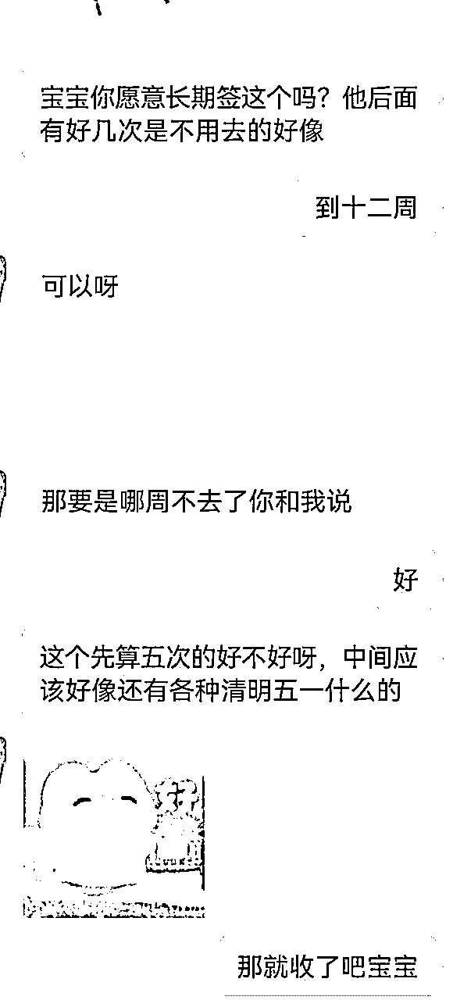
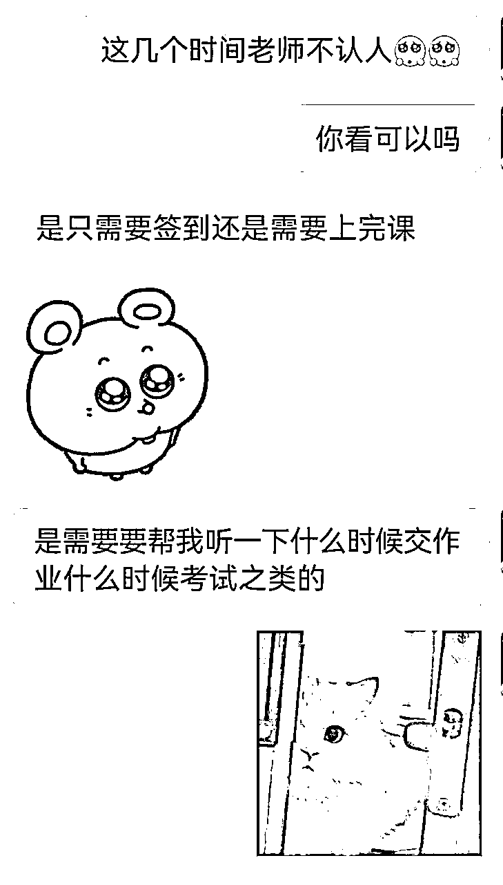
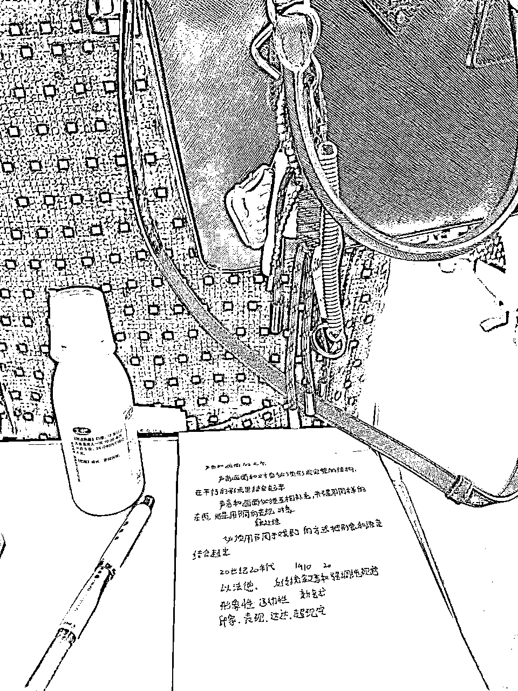

# 二十不惑——在生财的第二年，随便聊聊

> 来源：[https://ywfmllgra2k.feishu.cn/docx/X7T2dBldGob7HkxhQAOcqKStnRg](https://ywfmllgra2k.feishu.cn/docx/X7T2dBldGob7HkxhQAOcqKStnRg)

有时候觉得人生真的很奇妙

去年，在去武汉玩的路上，半小时写的这个帖子突破了千赞，感觉受宠若惊

那个时候我刚刚大病初愈，感慨万千，所以能写的比较多

今天在刚考完试回西安的飞机上，争取在起飞前码完这个帖子吧。

于是决定把这个习惯保持下去，每年写一点碎碎念，争取写成系列剧吧。

# 建立自己的智囊团

如果说有什么东西是我认为最珍贵的资产，我觉得一定是我的微信号。

只需要一个微信，我遇到的所有卡点几乎都有人能帮我解决掉，在关键时刻能点醒我，辅助我去做决策。

产品设计问题问许老师，小红书问题问富贵，矩阵问题问柠柠，朋友圈文案写不出来问虎牙。

几乎没有什么事是打开手机问人找不到的，任何卡点当下立马解决。

甚至于我想买个飞书模板，车剐蹭了找人修车，搬家需要收纳师，卖点闲置的首饰，几乎全部都是找圈友帮忙解决的。

关于智囊团这一点，前几天跟Albert边吃椰子鸡边聊天的时候，我得到了一个更高维的答案。

起因是关于Albert我有一个印象特别深刻的事情，是亦仁说，他是一个只喜欢倾听不喜欢表达的人，而albert经常会主动问他，说有一个观点和想法，问他怎么看这个观点。

我问他，你这样做是出于什么思考。

他说，他每次想要启动一个项目的时候，他会同时找5个拿到大结果的人去问他们的视角和看法，或者这个业务给他们去做会怎么做，然后修正自己的视角。

5个大结果的人，最好本身的挣钱基因不太一样——产品、运营、流量、IP，这样会避免同基因的人把你直接拉脱轨道的情况。

我说，那如果他们互相说的意见是相反的，或者他们跟你本身的想法是完全相悖的，你会怎么做。

他说，他会去思考对方给出这个建议的出发点是什么，快速做出决策，快速验证路径，得到反馈，再去修正。

不要花过多的时间在思考、内耗、做决策上。

这句话，让我第二天启动了一件内耗了半年不知道怎么处理的事情。

那么，问题来了，怎么微信里拥有n个拥有大结果还愿意回答你问题的人？

很简单，第一步，打开scys.com，搜索关键词，选择点赞最多，选择航海家，找鱼丸直接要联系方式。

第二步，认认真真发一个好的自我介绍，具备以下三点特质：1.业务清晰 2.我有点牛逼 3.谦和有礼，愿意认真学习

第三步，提出一个有价值的问题

什么叫有价值的问题？

看了会emo的问题：AI写作适不适合我，我零基础能做吗？【问，就是不知道】

有价值的问题：我已经做AI写作在写手端实现闭环了，目前的接单情况是这样的【附数据表格，图片版本，不要飞书，因为飞书会多一条点进去登录的链路，方便别人就是方便自己】，我当下应该去专注在一个品类还是去多扩充更多品类去做？

不过，有更简单的办法。

带着你的问题和卡点去参加生财有术的大型活动，现场想办法找机会问合适的人，问完记得加个微信，发个自我介绍。

一般熟人的熟人就能给你带一个有答案的过来。

注意边界：1.不要窥探别人隐私 2.不过度索取 3.互换信息，互换价值。

什么？你在生财有术还没有熟人？

那先从找5个在生财有术的熟人开始吧。

# 定期跟比自己高十倍维度的人线下对话

这句话也是那次椰子鸡给我的启发，Albert说：想要保持高速成长的状态，你最好成为你朋友圈里最菜的人。

在挖掘项目的时候，要找到正确的，合适的对标，比如你现在挣10w，你就得看100w的对标，你现在挣100w，就得看1kw的对标，最好向行业头部看齐，找到行业的上限，拆解和分析头部的路径，分析自己和他们的差距在哪里。

不要看数据的差距，而是看他的动作。

比如他一天进1000个量，你只进100个量，他做了哪些平台是你没做的；

比如你做了闲鱼小红书，他做了电商平台；他一天铺10个号300篇内容上去，你一天只上3个号；

比如你的转化率20%，他的转化率40%，这个就很容易靠日夜的精细化观察销售话术，销售节奏步骤补齐。

这种信息是很难靠线上交流获取的，最终最有含金量的信息一定在线下，小局。

根据这一句话我去复盘我的既往路线，我发现我每一次高速增长，顿悟几乎都在生财办活动前后，而且这个瞬间几乎不在活动进行时，而是一起跟朋友去参会的路上，晚上一起吃饭，小房间闲聊的时候。

虽然分享内容本身肯定有启发的，但远远没有小局对话的冲击和震撼强烈。

光是今年3-4月，我认为对我的路径造成极大影响的对话有：在北京，damo老师对我说，你们年轻人好像都是这样，做的事情乱七八糟，又朝气蓬勃。

紫菜说：生财大部分已经闭环的项目都能跑到100w以上利润，只是普通人没有对应的组织能力和执行力的认知，没办法把小生意放成大生意。

lemon说：所有东西都是可以靠数据验证的。

富贵说：当你想要去根据一个群体的用户画像做内容，不能能用粗浅的标签去快速概括这个群体，而是要具象化到：女性，20-30岁，原生家庭差（没钱/父母不给钱/父母重男轻女），是否有原生创伤（强势的父亲软弱的母亲/强势的单亲妈妈），是不是单身，是不是恋爱脑，男朋友对她好还是不好（家暴/不给钱/出轨），年收入情况，平时消费习惯如何（储蓄/超前消费），受教育程度（高学历/专科野鸡）……

你想要挣谁的钱，你脑子里要有他的脸。

刘小排说：在传统互联网学到的东西是冷兵器，在生财有术学到的东西是枪炮，拿着生财有术的东西去传统互联网就是拿着枪炮进入冷兵器时代。

他还说：小鹅在群里装完逼一分钟就关机了吗……

咳咳，跑题了

定期与比自己高十倍维度的人线下聚会，并且尽可能提出有质量有密度的问题，一定是帮助自己是被增长最快的方式之一。

# 做别人视野范围内最懂某件事的人

我的增长的主力来源于复购和转介绍，很多时候我躺在床上都会有人加我说姐姐我在xx那里听说过你很靠谱，我希望找你做什么什么事。

每个人的视野范围都是有限的，洗头不会找一公里以外的tony，找家教不会跨一个城市驱车前往，旅游订酒店超出不了app榜单和小红书推荐前十页。

所以，你的技能，你的专业，成为了很多人视野内的当前最优解以后，就自动会有源源不断的人来找你解决问题，钱反而成为了被动的附加品。

这里蕴含着两个信息：

①你要尽可能多地闯入别人的视野

我自己喜欢看电影，所以我之前加过好几个电影群，和他们聊着聊着，他们都知道我做家教很厉害，经常推朋友的小孩给我提分。

后来我进入生财，每一次线下聚会，我都会主动帮忙收拾会场，采访录制，整理文稿，只要你去了我在的聚会，你大概率会对我印象深刻。

在主动贡献，积极付出的过程中，我无形地进入了他们的世界里面。

②你要大方对外输出你的价值和技能

我还有发现一个现象，很多同学，在自我介绍的时候，要么会说很多冗余杂糅的信息，要么会含含糊糊地说，不好意思认真介绍自己的业务。

这其实无形间会错失许多增长机会，你不用简洁又有力度的标签去抓住注意力，不是别人不愿意给你机会，而是别人根本没听懂你在做什么、能帮上什么忙、是否值得信任。

有一次我和我对象去参加一个线下活动，不可避免的要自我介绍一圈，后面回去一上车我就骂了他一顿

他的介绍是：

1.我在做ai产品

2.我很看好ai自媒体方向，最近在尝试

我说，你这个自我介绍等于在说：我什么也不是，没有任何的信息点。

做别人视野范围内最懂某件事的人，重要的点就在于持续大方，简明扼要且清晰的对外输出你的价值和技能。

为什么我刚开始做AI写作的时候，我在没跟你说过话的情况下，一直找你处理AI账号问题，而且我给你导的客户绝对不下300个，我从来不担心。

就是因为之前封号潮的时候我被好几个sb跑路过亏了好多钱，当时我对你一条朋友圈有了印象：封号的时候，你自己贴钱给客户补号，所以我才愿意相信你，前两年一直只找你合作。

你有一个稳定日盈利过千的产品，并且我知道的很多AI大佬都找你拿号，这是很明确的价值点。总是怯于表达的话，会错过大量的增长空间和潜在机会。

后面我骂过他以后，他开始好好梳理自己的自我介绍，一次是330线下大会，我们认识了一些大客户去找他拿api，另一个是418直播的时候，在许多大佬聊AI网站的间隙插空介绍了自己的网站，一瞬间得到了很多人的认可，甚至有一个千万级大佬当场说——我今晚最大的收获就是认识了你，我希望和你去尝试一些事情。

出来混，最重要的是出来。优先占据生态位上游的人，资源和信息都会被动的涌入。

# 知识的罅隙

前几天，我和朋友在聊知识付费这个事情。

我们都花了很多钱，买了很多课，有的回报率很高，有的就是纯被割韭菜了，我们有一个共同观点：好的课，可能几万块钱，精华就那一两句话，就足够让你突破现在的大问题。

为什么，好的课的讲师，能说出一两句如此生死攸关的话？

因为对知识的罅隙的理解的不同。

拿股票举例子，理论上，一个理想的，大致的曲线，是A这样的曲线，但实际上，真实的线是B这样，坑坑洼洼的线，里面有很多小的罅隙。

在这个起伏的罅隙当中，投资者会拥有大量痛苦，喜悦，兴奋，失落的情绪体验，对应着大量不同的操作细节。

一个项目的基础逻辑都是差不多的，说实话是个人你去学两天说不定都能唠上两句，如果只讲逻辑的话，都是A那样子的线，每个人都是大理论家。

但最终影响你拿到结果的，一定是大量的实操中间，真实的体感带来的对细小的罅隙的洞察。

比如，私域的核心其实就是转化率，但是转化率的提升点在哪里？

可能是朋友圈背景文字设计的一个位置，可能是客户加上微信说的第一句话，可能是朋友圈置顶的引导，可能是公众号引流的路径。

再举一个特别小的例子，你在小红书店铺用虚拟资料做导流，你会怎么样想办法把你的加v率提升到90%？

很多人都会给客户发短信告诉客户领资料这一招，那么，你该怎么发短信？

应该分三行：

我是xx

加微信xxx

领取xxxx

不变成一整个大行原因在于：1.方便客户复制微信 2.防止被当成垃圾短信拦截

这些很小的细节，全部都是大量实操后积累的微小的体感，变成了“无他，唯手熟尔”，变成了你觉得习以为常的一两句话

但这一句话，是没有实践经验的人一辈子想破脑袋都想不出来的东西。

# 成为一名时间管理大师，把自己从琐碎的事情解放出来

很多人会问，小鹅，你不用上学的吗？

当然要啊！更恐怖的是，生财每一次在周末办大型活动，几乎都在周五或者周一我要考试。

24年，我一直处于上午在学校，下午上飞机，提着行李去教室，拿着资料在酒店背的极限冲刺状态。

可能大家觉得我能做到这样是因为学校管理不严格，或者学业压力不大，恰恰相反——我的学校是我在整个生财00后里见过的学习压力最大，管理最严的，几乎每个月都有考试，每周都需要各种签到，有各种细分的小项需要完成，老师一个重点都不给划。

那我是怎么做到学业和事业两不误的呢。

第一，学会花钱买时间，外包所有投产比不高的工作

大一的时候我为了预备卖货拉了很多个宿舍楼群，导致我掌握了大量廉价劳动力资源，虽然货没卖成，但是因此找代课容易了非常多。

我因此养活了很多人，大部分事情都是他们去做，我只用等消息就好

我一年能挣七位数以上，也就是意味着我的单日产值是3000-6000，代课是一个一天不到100的活，意味着我不能花时间亲自去做，解放出来的时间我能做更多效益更高的事情

这里有个小细节：我的代课费是发在我的微信里给他们用的，敲黑板，这是什么原因？

当然是在发代课费的同时，顺带给我的微信养号。

第二，跟老师能沟通则沟通，能不要脸则不要脸

我主动跟几个非常开明的老师讲了我的情况，于是他们主动给我偷偷开了后门，允许我不去上课，有一些不太讲道理的老师，就直接厚着脸皮让别人直接变成我上台做pre

第三，考试前抓紧一切碎片时间去学习，利用AI大幅度提效

如图所示，我的复习时间全部在——高铁，飞机，酒店，经常都是白天聊完事晚上回房间开始背书。

复习的材料我会让代课帮我找，如果没有的话，基本AI就是我的大哥。

把书本发给AI让它拆解重点，把看不懂的概念让chatgpt给我解释，把不会写的解答题发给秘塔AI搜索搜集信息，把背不下来的单词句子发给chatgpt帮我巩固，把做不完的ppt发给kimi帮我做。

【如图2，秘塔AI搜索新出一天的功能被我用上冲刺考试了，我一天用这个看完了两本400多页的书，用了一个飞机的时间过完了两个月的课程】

在这种完全脱离学校后夹缝中学习的状态

我的雅思7分【大一考的，现在考不到…】，四级590分，学校的课基本每门都在80以上，是一个我觉得非常满意的状态。

# 找到命中注定的礼物，敢于承受所有的不确定性

“盈亏同源”这句话第一次听是第一次传术士线下老大讲话的时候说的

大抵的意思就是，他因为懒得操作，把大饼拿了很久，挣到了这部分的钱，同样也因为懒，少做了该做的动作，失去了这笔钱

第一次听，只是单纯的有印象，有感触，没有太多的想法

后来有一期孟岩老师的播客，再一次听到这句话的时候，带给了我极大地冲击和震撼

“所有命运赠送的礼物，早已在暗中标好了价格”

盈利和亏损本质上是同一策略或决策在不同市场条件下的两面

若你因“重仓某只股票”获得高收益，未来也可能因同样的重仓行为遭遇大幅回撤

若你因“分散投资”避免了极端亏损，也可能因分散而牺牲了潜在的高收益

任何策略的优势和劣势都绑定在一起，无法只保留“赚钱的部分”而剔除“亏钱的部分”

投资当中，高收益、低风险、高确定性三者无法同时满足。

如果追求其中的某一个或者两个优势，必然需要接受对应的风险

如果你想要靠投资挣到高额的收入，你必然要承受波动当中长期的心理压力，恐惧，自责，后悔等体验

所以，永远不可能有完美的策略

也就是说，当你想要拿到你命中注定的礼物，你就要支付对应的价格

他用的一个例子是风吹半夏里赵丽颖演的那个角色

她做过码头，做过废钢，后来建立了自己的钢厂，在这个起起伏伏的过程中，她赚过很多钱，也几乎没有一天是安生的，中间有无数个节点，她是可以停下来的，但是她没有

她一直在尽全力的的创造更多的东西，不断地跟这个世界上的不确定性相处，去交手，在痛苦的波澜起伏中拿结果

为什么呢？

因为她找到了命中注定的那个礼物，她知道自己想要什么

所以她能坦然面对所有的波动，恐惧，不安，痛苦

这是去找寻礼物的过程中，注定要去承受的体验

听完这一期的时候，我也躺在床上翻来覆去的睡不着，一遍一遍的想

在我原本的计划里，寒假在深圳，结束了以后就回去恢复平平淡淡上学的日常，等暑假再去生财

我打包了所有东西，坐着飞机回到了西安，开始看在西安怎么能租到四个月的房子。

落地的前两天，我找了一个酒店过渡，一大早起来上课，坐在教室。

我突然感觉，我坐不下去了

我为什么一直没有离开学校？

我好像总是有太多的恐惧，我恐惧同学的目光，恐惧老师和导员发现会尴尬，恐惧来回坐飞机通勤的成本

突然到了那一天，我感觉我恐惧的这些都不重要。

每个月机票往返考试要两千元打底支出，养着代课八百块一个月，来杭州要租新房子，从灵光一现到打包全部家当举家搬迁到杭州总共花了三天时间。

我选择了创业，是选择了一种生活方式。

是一种永远在路上，永远在学习，永远在和痛苦的不确定性交手，永远在起伏中找到信念的生活方式。

我愿意为此支付代价。

我想说的就这么多，今天刚好也是我加入生财的二周年

我们三周年再见！