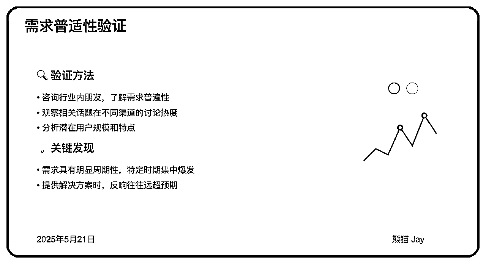
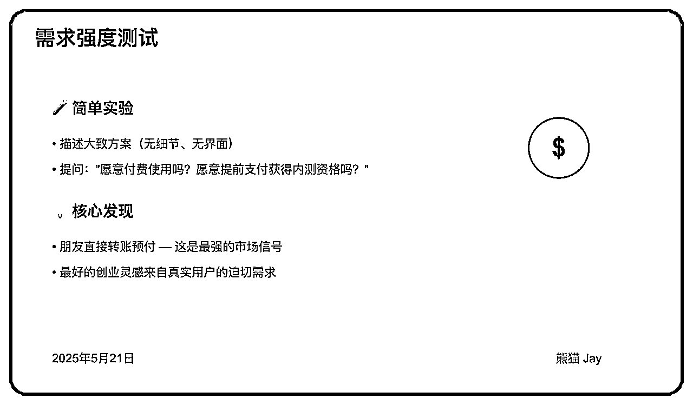
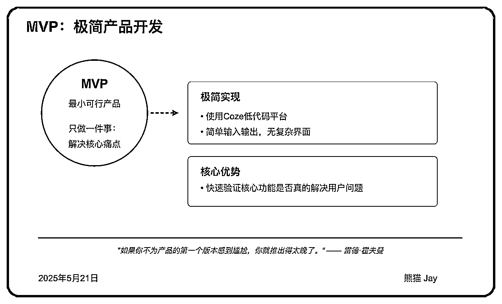
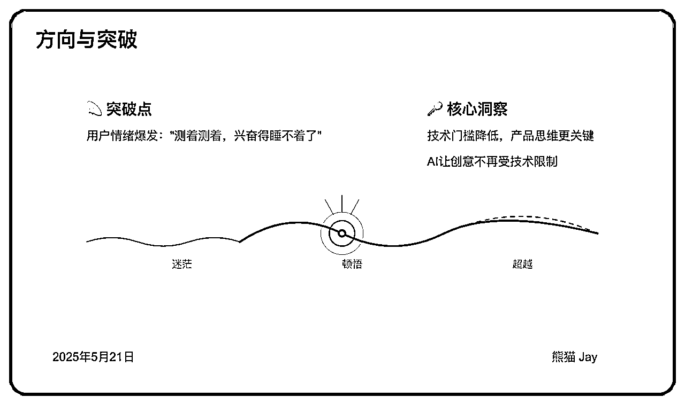
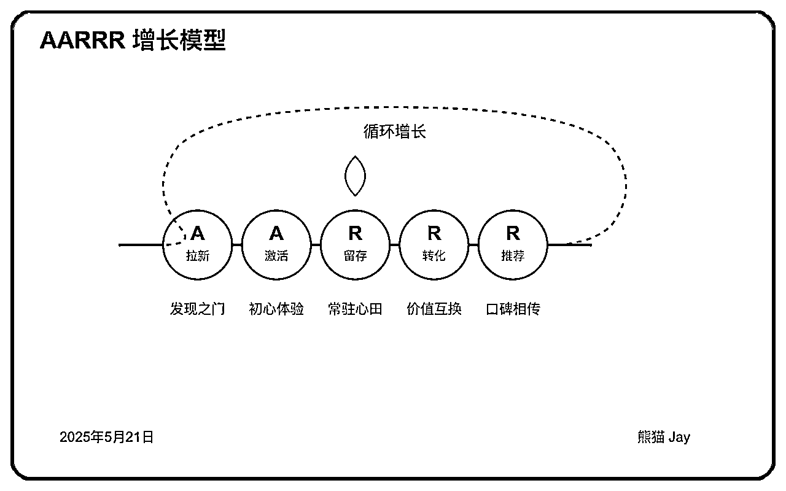
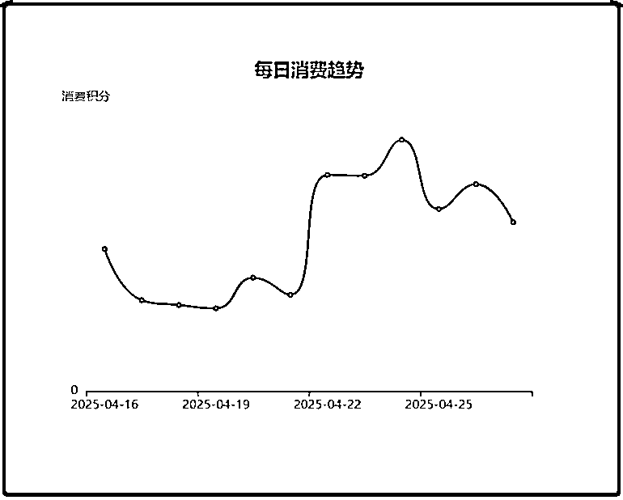
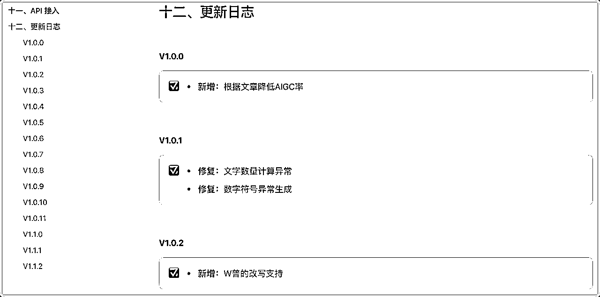
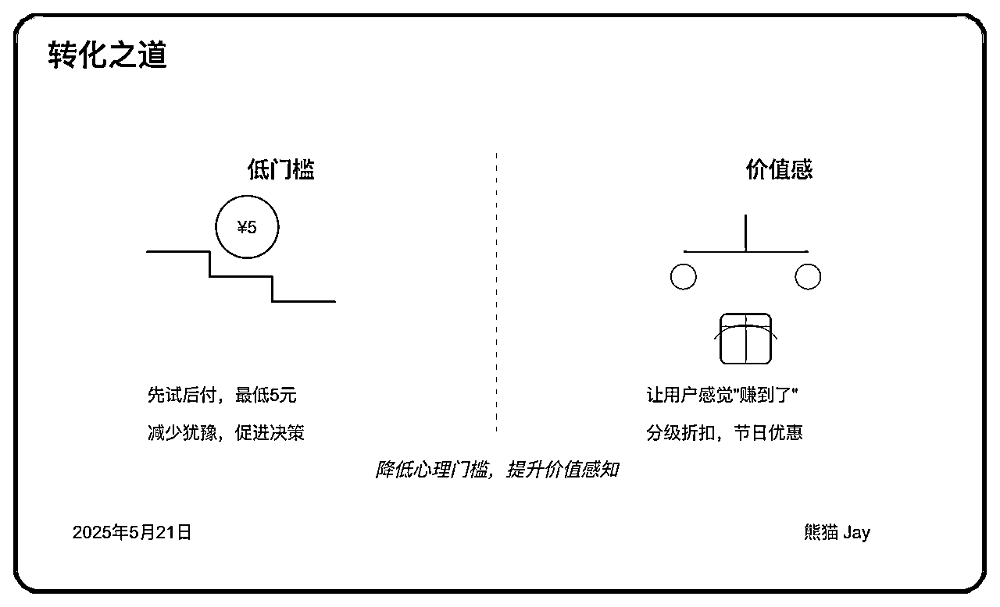
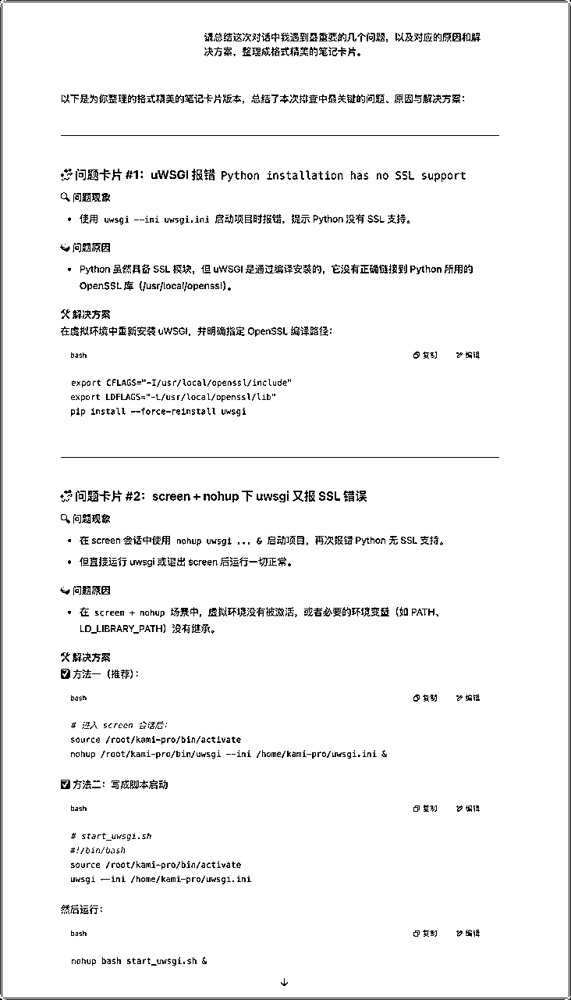

# 曾想拒绝这个需求，如今靠它 8 周跑通商业闭环

> 来源：[https://zzi7a49xoa.feishu.cn/docx/DZhwdAvd5o6YJ1xUwNmcdc8mnoh](https://zzi7a49xoa.feishu.cn/docx/DZhwdAvd5o6YJ1xUwNmcdc8mnoh)

过去2个月的产品开发之旅，让我迎来了诸多人生的第一次经历：

第一张营业执照，让我从“随便试试”走向“肩负责任”；

第一位合伙人，陪我熬过无数场头脑风暴、Bug修复，和深夜发版；

第一个 AI 工具，让我从内容输出到替 400+ 付费用户解决问题的产品研发和运营；

第一次高效跑通「流量 → 价值创造 → 价值传递 → 推广 → 收益」的完整闭环。

每个“第一次”，都伴随着兴奋、焦虑，又或是大量的试错。所以，我需要一个深度的复盘。

如果你正准备踏上同样的路——打磨产品、副业突围、用 AI 实现变现。

希望这篇文章能给你一个方向，一丝勇气，和一些有价值的方法。

## 一、为什么要做这个产品？

说实话，从一开始，我根本没打算做这个 AI 降重工具。

很多人可能以为我是看到了市场机会主动出击，但事实是，这完全是被“倒逼”出来的产品。

最早提出这个需求的是一些粉丝朋友。

记得二月份底，很多人主动找到我，请我一定帮忙解决“ AI 降重”这个难题。他们给我的反馈特别强烈，甚至让我觉得自己成了他们的“救命稻草”。

但当时我其实手头还有智能体商单要忙，主业也经常要加班，自己要写文章、做分享。

我内心的第一反应是：“这不在我的能力圈内，到底值不值得投入精力呢？”

无论如何，我需要做的是冷静下来，认真去评估这个需求到底有没有价值：

1、需求真实性评估

我更关注需求背后的紧迫度和严重性，而不仅仅是表面的请求：

*   这些用户的情绪强度如何？他们表达的紧急程度如何？

*   如果问题得不到解决，会对他们造成什么影响？

*   他们目前用什么方法解决？为什么这些方法不够好？

通过一系列对话和观察，我发现这个需求的特点是“存在但隐藏”。

用户需要，但市场上的解决方案并不理想，很多人处于无奈的状态，说难听的，就是举手投降。

2、需求普适性验证

这个需求是不是少数人的小众需求？有没有足够广泛的用户基础？

其实这些我都是不知道的。网上的资料也不多，站在这个背景下，我是这么做的：

*   咨询行业内的朋友，了解需求的普遍性

*   观察相关话题在不同渠道的讨论热度

*   分析这类需求的潜在用户规模和特点

经过这些思考和咨询，我发现两个重要特征：一是需求有明显的周期性，在特定时期会集中爆发。

二是虽然不是所有人都会直接表达需求，但当你提供解决方案时，反响会远超预期。

3、解决方案差距分析

在确认了用户确实有需求之后，我又做了一轮简单的市场调研，主要是想搞清楚两个问题：

*   这个需求，技术上能不能落地？

*   市面上现有的方案，到底好不好用？

我重点看了以下几个方面：

*   市面上的主流方案，各自的特点是什么？

*   用户最不满意的地方集中在哪？

*   有没有哪一块，是明显被忽略、但用户真的很需要的？

我发现市场上的解决方案主要分为两类：一类是效果好但价格高昂的服务，另一类是价格低但效果却很一般。

也就是说，目前市面上，缺少一种“效果靠谱 + 价格合理”的中间路线。

我当时就在想，或许这个空白，就是我可以做出 差异化 的地方。

4、需求强度测试

光有理论分析还不够，我决定做一个简单但有效的实验，来验证这个需求的“真实程度”。

我找了一些潜在用户，向他们描述了一个还在脑海里的大致方案——没有细节、没有界面。

只是告诉他们：我可能会做一个这样的工具，用来解决 AI 降重这个问题。然后我问了两个关键问题：

*   “如果真的做出来，你愿意付费使用吗？”

*   “如果我现在开发这个工具，你愿意提前支付一部分费用，获得内测资格和未来最低折扣吗？”

结果令我惊讶：好几个朋友表示愿意，然后直接给我转账预付。

到这里为止，这就是一个极为强烈的市场信号——当人们愿意为一个还不存在的产品付费时，你知道这里有真正的需求。

在需求验证阶段，我最大的收获：

最好的创业灵感往往不是凭空想象出来的，而是来自真实用户的迫切需求。当有人愿意在产品还没做出来时就给你转账，那就是最好的市场信号。

我们不必有多么惊艳的创意，但我们需要足够敏感地去听懂用户的痛点。

这种敏感度，往往来源于平时的多看、多听、多尝试，以及对用户问题的同理心。

## 二、如何快速做出产品原型 ？

确认了需求的真实性后，我开始了产品的开发旅程。

面对有限的资源和时间，第一个关键决策是确定最小可行产品(MVP)的范围：

*   什么是必须有的核心功能？

*   什么是可以等的次要功能？

*   用户的核心体验路径是什么？

甚至可以只问自己第一个问题：“如果现在只能做一件事，什么是最核心、最能解决用户痛点的功能？”

很简单，对于我而言，我只需要帮助用户有效解决一个平台的 AIGC 消除问题就可以了。

功能确认了，那接下来还需要做什么原型设计、原型确认、软件开发吗？

对于个人或者我们这样的小团队而言，这套传统流程实在是玩不起。所以，一定是越简单，越快越好。

对于产品雏形，我几乎没有做任何设计，而是选择了极简路径：做一个 Coze 智能体。

输入文本，输出降重后的内容。没有华丽的界面，没有复杂的选项，就是这么简单直接。

虽然这种方式的确不专业，UI 不好看，易用性也不强。

但快速推出产品的优势在于：你能在最短时间内验证核心功能是否真的解决了用户问题，而不会被各种条条框框所约束。

LinkedIn 联合创始人雷德·霍夫曼说过一句话：“如果你不为你的产品的第一个版本感到尴尬，你就推出得太晚了。”

在这里我想说下：Coze 核心是一个低代码平台，学习门槛也不高，它非常适合普通人以低成本的方式做出 AI 产品的雏形。

过去我写过一些关于 Coze 的教程，大家感兴趣可以看下。

## 三、产品的优化和迭代

做完初版后，我遇到了许多创业者都会面临的问题：反馈不足 --- 只有几个微信好友在用，根本不足以支撑我投入更多时间和精力。

没多少人用，或者用的人太少，反馈很少，这些现状都会让我怀疑是否要继续？

但是让我真正下定决心去优化这个产品的转折点，来自一位苏州的朋友的肯定。

记得那天，我们坐在餐厅里，我给他展示我的产品，他测试我的 demo，一直测试到晚上 11 点，他的惊喜给了我巨大的动力。

我清晰记得那天晚上他说的话：“本来都已经困了，结果测着测着，兴奋的睡不着了”。这种用户情绪的正向爆发，是最好的产品方向确认。

他也给了很多建议，包括关于定价和用户体验的反馈，告诉我必须做一个网页工具才能让更多人方便使用。

这让我意识到了产品形态的重要性。

如果换成过去，我可能会陷入纠结。

我是做技术管理的，不是一线 coding 的人员，具备实现需求的能力，但是编码速度相对慢一些。

所以我需要准备预算，拉一个更熟练的一线开发人员，甚至需要找个UI。这些都需要不少费用，到这里，故事有可能就结束。

但是现在不一样，有了 AI 编程的加持，只要我们说清楚需求，就可以很快地完成各种形态的产品。

在整个产品的迭代和优化过程中，AI 编程给了我巨大的技术支撑，事实上有 70% 左右的产品代码，都是我借助 AI 完成的。

这也正说明了：技术门槛正在降低，而“知道要做什么”的产品思维变得更加关键。

现在，懂需求、懂业务、有清晰产品思路的人，即使技术能力有限，也能借助 AI 工具实现自己的创意。

这是以往任何时代都难以想象的。

## 四、产品的持续运营

有了前面预付款 + 新的收入之后，接下来最重要的问题就是如何扩大收益、持续增长用户。

这一阶段的核心思考，就是如何实现用户规模化增长。

这里我用了一个模型 --- AARRR 模型，即 拉新（Acquisition）、激活（Activation）、留存（Retention）、转化（Revenue）、推荐（Referral）。

### 一）拉新：如何让用户主动靠近产品？

除了预付款，我记得第一笔充值只有 25 块钱，但这笔收入给了我很大的激励。

预付款更多的是来自于过去的信任，而新用户的充值，让我看到了将会有更多人愿意为这个工具付费的可能性。

怎么持续扩大用户规模呢？拉新的关键在于：

*   扩大产品曝光度，吸引更多人关注。

*   降低用户首次接触门槛，让用户愿意尝试产品。

过去我通过做自媒体结识了很多朋友，也收获了自己的第一批付费用户。

在给产品拉新的过程，我利用朋友圈、公众号持续发布产品的使用体验、案例、软文，甚至是私聊，尝试通过多种方式，不停地触达用户。

比如，当我尝试按照过去先输出干货，再带货的文章风格，写了一篇软文，虽然流量一般，但是却给产品每天的营业额直接涨了一倍。

为了更好吸引用户，我还提供了一些内测码和免费额度，降低用户的使用门槛，这个效果也立竿见影。

### 二）激活：让用户第一次使用后“留下来”

用户进来了，第一次使用后怎样确保他们真正留下来？

我的经验是，好用 比任何口号都更能激活用户。

因此，我们团队早期投入了很多精力去优化产品，对数百篇不同类型的文章、不同的场景进行了测试。

从而确保产品的稳定性，让用户第一次使用，就能体验到它的价值。

当然也包含 UI 方面的优化，从最开始的一个简易智能体到网页交互的优化过程。

### 三）留存：如何保证用户持续使用？

用户使用一次之后，如何让用户持续获得价值，并愿意长期使用呢？

用户留存的核心在于持续的价值创造与良好的用户运营：

*   持续优化产品，迭代功能

*   保持沟通，提供快速反馈和高质量的答疑服务

为了做好留存，我们特地拉了群聊，尽量及时的答疑，用户感受到“被重视”，自然更愿意留下来长期使用。

除了大家对产品和业务的疑问，我们平时也会积极帮助大家促成合作，实现共赢。

用户用产品久了，总会觉得腻，甚至可能会转向其他产品，更别说产品上还有一堆 Bug 了。

由于群聊的建立，我们可以从中获得更多用户的反馈，从而优化功能、提升体验。

短短 2 个月时间内，我们总共迭代了 15 个版本，团队经常在深夜 12 点左右仍在紧张发布新版本。

### 四）转化：把用户流量变成真正的收入

用户进来了，觉得产品也挺好用的，但你怎么让他们掏钱？

这一步特别关键，因为再好的产品，用户再多，如果用户不愿意付费，最后也会很难继续做下去。

转化的核心是降低用户付费的心理门槛，让用户更愿意、更轻松地做出付费决策。

我们早期做了几个关键的决策：

1、把门槛降到最低，减少用户的纠结

我们最开始提供免费试用额度，用户先尝试满意后再充值。

充值时，最低支持 5 元的试用机会，且最初没做任何限制。这种方式，用户基本不会太犹豫，都会愿意花点小钱试一试。

2、定价合理，让用户感觉“赚到了”

我仔细对比了市场上同类型的产品，定了一个具备性价的价位，让用户感觉超值甚至赚到。

此外，当在用户达到一定充值金额后，按照不同的充值等级，我们会给予不同的折扣策略，激励用户逐渐增加投入。

当遇到一些重要的节日或者时间点，我们会做一些小活动，给到老用户一些优惠，让大家感受到我们在用心经营。

### 五）推荐：怎么让用户主动帮你传播产品？

其实最好的营销，就是用户自发地帮你去传播和推荐。这种传播成本最低，效果也是最好。

推荐的关键就是让用户觉得帮你推广特别值得。怎么做呢？我简单讲几个我自己的方法：

1、做好分销，让用户主动传播

最开始，因为分销模式没做好，导致长时间遇到流量卡点。

后来，我们专门设计了一套三级分销制度，让愿意帮忙推广产品的用户，都能拿到一部分佣金。

这样一来，用户在使用过程中觉得不错，顺手一推荐，还能拿到点收入。他们就有动力，自然会主动帮你宣传。

2、提供代理模式

我们设置了不同的代理等级，给那些推广能力更强的用户更大的折扣优惠，但也有一定的门槛要求。

针对高级代理，我们甚至提供纯净版的网站，让他们 完全掌握客户资源，这就更能激发他们的推广热情。

当然，这些都只是一些推广的技巧与策略，从长期来看，最重要的还是 不断提升产品力，打造良好口碑，这才是最稳定、最高效的方法。

## 五、问题和心得

除了前面产品开发和运营的过程，在此再分享一些心得体会：

### 一）主业和副业的时间平衡

在产品开发和迭代的过程中，我遇到了一个最大的问题：主业比较忙，副业精力不够。

1、聚焦核心，学会取舍

过去一年左右，我在朋友圈、公众号保持着足够多的活跃度。但是当有更加重要的事情来临后，我不得不做减法。

放弃了公众号的周更，甚至朋友圈也不怎么活跃。

上周在杭州线下活动，见到一位比较关注我的大佬，一见面，第一句话就是“熊猫，怎么最近消失了”

放弃了很多和现阶段不相关的事情，是我做的第一个关键决策。

2、寻找合伙人的重要性

第二点，我需要寻找一位和自己时间节奏一致、能力互补的合伙人。

时间节奏一致非常重要。这样才能保证更多高质量的交流和协作。

其次就是能力互补，每个人都有自己的优势，如果能力互补，各司其职，这样才能发挥 1 + 1 > 2的效果。

而不是找一个跟你一模一样的人，最后容易吵架、谁都不让谁。

那，寻找合伙人的方法是什么呢？

总而言之，一句话，你要找到那个和你节奏一致、能力互补、最重要的是靠谱的人。

如果你现在身边还没有这样的人，别着急，多做项目、多参与讨论、多线下交流，慢慢地，这样的人会自然浮出水面。

### 二）预算不足，怎么省钱？

1、 服务器：能跑起来就行，别上来就买高配

一开始，我们选择了配置非常普通的服务器，价格低廉、节省成本。

比如阿里云、腾讯云等大厂都推出了年费不到 100 元的入门级服务器产品，非常适合产品起步阶段使用。

虽然性能有限，但对于初期较小的流量来说，能够稳定运行核心功能就已经足够了。

这符合我们“先验证、再投入”的原则。

随着用户数量明显增长，我们才开始考虑升级服务器配置。

值得一提的是，我们没有冒然切换，而是采用 蓝绿部署 策略进行平滑迁移，既确保了服务连续性，又保留了必要的回滚空间。

升级配置时，我们也选择了性价比更高的服务器 --- 雨云：https://www.rainyun.com/NDg1Mzcw_

2、 SSL证书：淘宝真的能省一大笔

很多人不知道，其实你去官方买SSL证书，价格可能是淘宝的好几倍。

比如阿里云的通配符SSL证书，官方卖几千块，淘宝上同样的证书服务只要几百，甚至更低。

### 三）AI 使用心得

1、问题一直修不好？别急着让 AI 继续改，先检查两个盲点

有时候，我们让 AI 修 Bug，但越改越乱，最后自己都不知道逻辑跑哪去了。

后来我发现，每次遇到这种情况，都要先停下来，问自己两个问题：

✅ 有没有把 需求说清楚？是不是留了“只有你懂的”这种含糊词汇？

✅ 有没有尝试 让 AI 给代码打上详尽的日志？纠错时把运行日志给到 AI ？

好几次当我修复bug，陷入死循环的时候，尤其是第二点，帮我修复了很多重要的问题。

2、需求想不全？让 AI 边做边补需求文档

作为独立开发者，很多时候，我们都是 一边写、一边想、一边改。

但随着项目推进，细节会越来越多，历史逻辑也越来越复杂。

一旦你不记，下一次要改东西时，就很容易误删、误改，甚至直接把之前写对的逻辑改错了。

我的做法是这样的：

✅ 每次有重大调整，我会让 AI 针对现有需求整理成一段“需求文档说明的补充”，更新到原始需求文档中。

✅ 未来功能迭代前，将需求文档的功能描述作为上下文发给 AI，它就能「在已有逻辑上」做增量修复，不至于全盘推翻。

这个方法让我在后期维护产品时省了很多时间，顺便还同步更新了需求文档。

3、修完 Bug 别急着走，让 AI 整理“知识卡片”

修复完问题，不要立刻放下，可以让 AI 总结知识卡片，否则过两天你就忘了它是怎么修好的。

所以我习惯在每次 Bug 修复之后，立刻让 AI 总结三件事：

✅ 问题现象是什么？

✅ 原因是什么？

✅ 最终的解决方案是什么？

我们只需要在最后丢下一句 Prompt：

请总结这次对话中我遇到最重要的xx个问题，以及对应的原因和解决方案，整理成格式精美的笔记卡片。

这样一张张“知识卡片”，也将成为我们个人知识库里重要的经验积累。

## 六、总结

两年前，当我第一次想做 AI 产品时，面临的是一片窘境：需求模糊、预算有限、工具匮乏，举步维艰。

想完，也就结束了。

而今天，当我们真正动手，整个世界都会以意想不到的方式靠近你：

AI 成为你的外脑，朋友圈化身行业顾问团，昔日一起工作的同事、做项目的伙伴，可能就是未来的合伙人。

所以，动起来，至关重要。

这一路，我也放弃了很多：周更的公众号、定期的社群分享、丰厚的 AI 商单，以及很多可能分散注意力的事物。

因为我希望走一条从未走过的路。

即使失败，即使产品很快会死掉，我依然渴望从中找到一条可复制的路径，聚焦自我，解决问题，吸收内化。

这些才是真正属于我的，能让我更加有底气的东西。

我是 🐼 熊猫 Jay，希望能给你带来一些启发。