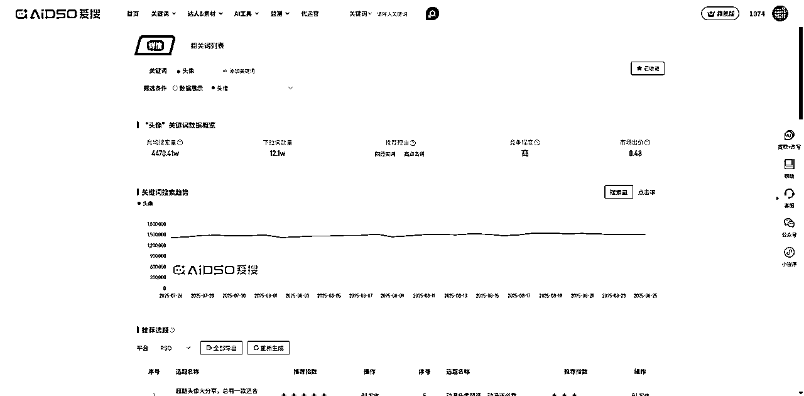
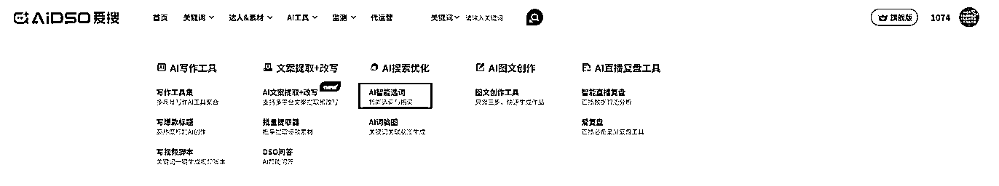
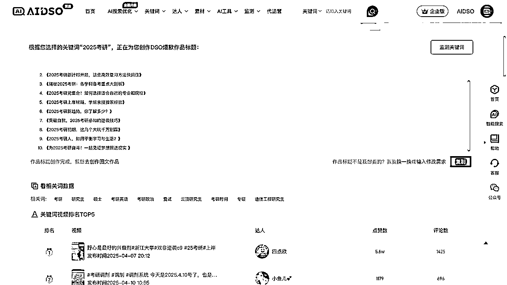
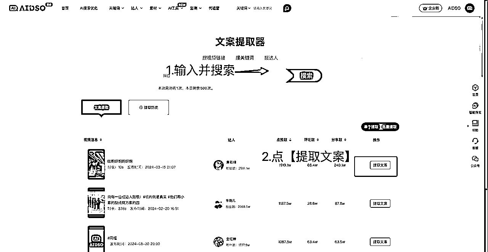

# AIDSO 爱搜手册

> 来源：[https://s12is4u3s19.feishu.cn/docx/UdbkdYZfYoispVxZCXmcAgqYnze](https://s12is4u3s19.feishu.cn/docx/UdbkdYZfYoispVxZCXmcAgqYnze)

出品方：爱搜团队（抖查查原班人马）公司BASE北京&杭州

法律注明：本手册版权受法律保护。未经授权，禁止抄袭。

DSO = Douyin Search Optimization

从SEO到DSO，新搜索流量机会，AI+DSO：爱搜因此而得名

支持：抖、快、红、微 搜一搜、b站、tiktok等，

顶尖搜索流量操盘手都在用爱搜^_^

# 一、引言：

## 1.1 搜索流量隐藏着巨大的红利

十几年前的百度如日中天！谁排在了搜索词前面，谁就掌握了流量的绝对入口。

可是在2020年抖音的搜索流量就已经超过了百度。举例一些关键词对比：

关键词：vlog 抖音 44000：百度（530+2818）=13倍

抖音每天搜索次数

百度每天搜索次数

关键词：获客 抖音 794：百度（26+40）=70倍

抖音每天搜索次数

百度每天搜索次数

可能是推荐算法的光环太过耀眼，让大家忽略了崛起的抖音搜索流量。

现在哪怕拍不好视频，投不好dou+，掌握正确的DSO方法，就能吃到这波搜索红利。

做搜索我们是认真的^_^，越来越多的商家、品牌方、流量玩家通过DSO搜索逻辑拿到大结果，实现流量获取能力提升，利润增加，生意基本盘扩大。很多公司和团队开始组建DSO团队稳定获取流量。通过爱搜工具进行选词，通过我们提供的培训服务，学会生产卡关键词的视频内容，通过数据监控功能进行复盘和调优。

为什么说搜索的红利巨大？

只要关联上了搜索词，我们的作品呢，就会有不断的流量。

一条占据关键词的优质视频，甚至可以长达数年为你带来精准流量。

下面这条50万播放的内容，自然搜索来了49万流量。而平台里绝大部分作品，搜索只有可怜的1%？

目前搜索流量的获取技巧，全网绝大部分创作者，是不知道的，信息差足够大！^_^

搜索流量是持续灌入作品的，所以优质DSO内容的数据曲线会持续走高，每天都有稳定的播放量。

量级大小和关键词每天搜索的人数有关，也和作品在搜索结果页中排名的高低有关。

小知识点：怎么看视频流量来源？

在你的近期作品里，点右下角的三个点，然后里面找到数据分析按钮，选择流量分析选项卡，下滑就可以看到流量来源，下面还可以看到是哪些关键词带来的流量。

用爱搜的监控工具，可以实现更多关键词排名的监控。

长尾词是被广大内容创作者和流量玩家忽视的蓝海生态。AIDSO爱搜平台，仅抖音平台的关键词收录量就超过10亿条。词库量级大，挖掘到蓝海词的能力就强。工具适合：内容创作者、流量玩家、品牌方、达人、各类商家使用。

通过爱搜工具能够发现很多流量大争抢不激烈的蓝海词，从而高效获取精准流量。配合工具，我们有一套完善的方法论，可以帮助短视频或者图文内容，确定性的拿到搜索流量。（搜索流量占比80%+）

## 1.2 DSO核心主要包含三大部分

精准选词、内容覆盖、转化产出。

这是一套通过多种运营策略，对发布在平台上的内容进行优化的体系，目的是让相关内容在搜索结果页面中获得更靠前的排名，让用户在搜索某个关键词的时候，优先看到你的作品，对你感兴趣，进而产生留资、下载和购买等一系列用户行为。

推荐产生兴趣，搜索反映需求

激活兴趣的内容未必能实现转化，但做好搜索的内容却有机可乘。

搜索机制，针对主动、明确需求的用户（足够大的精准需求人群），打造长效内容，一旦打磨出转化模型，就会成为某个关键词下面的若干个流量池，如果持续积累生产，覆盖越来越多的关键词，就会积累茫茫多的大大小小的流量池，每天都在给你提供大量的精准用户。

相较于推荐流量，

搜索流量正反馈周期较长，

一旦起量，也会更加持续。

推荐流量拼的是短跑，爆发力，搜索流量玩的是长跑，耐力！是成功的必要因素。

“快”不如“持久”！不断的正确选词+不断的高转化内容生产，就会收获源源不断的流量。

通过平台的搜推联动机制，可以更加精准的影响我们的推荐流量基本盘！

一般一条内容按照DSO逻辑生产的内容：

卡住长尾词的周期5天左右

卡住大词的周期20天左右

一个蓝V线索账号，从最开始搭建，到稳定单日100-200条有效精准线索，也要经历2月左右的稳定输出。

电商账号也可以通过搜索词生产爆品带货短视频，同时基于搜索流量的投放激活自身直播间的成交。

DSO主要步骤：

选词>覆盖>排名优化>点击率优化>完播/停留/互动>引导>转化

前期：产品分析（包含：产品定位、目标人群、盈利模式、主要业务/功能、推广方式、经营现状等）、竞品分析（相似竞品3款在抖音推广内容分析）、关键词词性定位（定位方案关键词类型及数量预估）选择高转化精准的关键词进行拓量。

中期：根据已选定的关键词进行内容创作（包含：排名创意、覆盖创意）、拍摄和剪辑；视频发布、运营、合集创建等，达到关键词覆盖、排名抢占、霸屏、目标转化等指标。

后期：运营数据每日监控，实时数据盯盘，随时挖掘商机、黑马关键词进行策略调整，一切以流量最大化转化为目标！

针对于已经有项目基本盘的同学，搜索流量可以实现精准获客，直接带来可观的收入，可以参考DSO岗位的等级以及可以实现的收益对照表。

| 序号 | DSO等级 | 单人效毛利润 | 描述 | 达标情况 |
| 1 | SSS | 赚50万+/月 | 适合赛道，矩阵账号，结合付费流量打法，通过DSO逻辑，霸屏赛道核心搜索词，成为头部。 | 少量团队的精英可以达到这个水平 |
| 2 | S | 赚10万/月 | 赛道高客单，蓝v账号稳定更新，持续上词排名，价值50-100元的有效线索，每天大于100条。或者低客单线索过1000。 | 有少量同学已经达到这个级别，且稳定盈利中。 |
| 3 | A | 赚5万/月 | 赛道比较适合搜索，有稳定的DSO内容更新，有一定的上词排名率，线索和营收持续走高。 | DSO成熟公司的团队已经达到相应级别。 |
| 4 | B | 赚2万/月 | 赛道较小，对DSO逻辑已经完全理解，具备一定的内容和转化能力，开始有利润出现。 | DSO陪跑同学，2个月左右达到相应级别。 |
| 5 | C | 赚1万/月 | 赛道较小或者变现能力有限，DSO逻辑有一定了解，偶尔卡住不错的词，实现一定营收 | 刚接触DSO同学达到相应级别。 |

## 1.3 爱搜工具介绍

欢迎使用AIDSO爱搜！

欢迎来到AIDSO，中文名：爱搜，一个为用户量身定制的新媒体平台搜索优化工具。无论你是短视频创作者、营销专家，还是电商运营者，AIDSO都将帮助你高效选词，提升内容曝光，获取更多精准搜索流量。

在这里，你可以：

*   精准选词：通过海量关键词库、榜数据，挖掘高潜热门搜索关键词，洞察用户需求。

*   智能选词：AI搜索优化，自动完成关键词搜索+视频脚本创作

*   数据分析：全面分析关键词数据，了解用户搜索行为和趋势，优化内容策略和发布时间。

*   精准引流：根据数据制定高效内容策略，实现精准流量获取。

*   竞争监控：实时了解竞争对手与自己账号的关键词和排名，快速调整搜索策略。

*   AI创作：结合AI写作工具，快速生成高质量内容，提高工作效率。

*   理解用户需求：通过直观的关键词脑图，帮助你更好地理解潜在用户需求，提高内容针对性和用户粘性。

PC端入口：

*   官网地址：https://www.aidso.com/

*   小程序入口

# 二、重点功能详解

## 2.1 行业搜索词整体分析

*   首页的行业词大盘数据：可以洞察不同行业竞争热词与蓝海词的整体对比，快速判断整体搜索流量的态势，做出相应的布局。目前已经有很多赛道的头部公司，根据AIDSO爱搜的数据报告，分析所属赛道在头部社交平台里面的搜索流量态势。从而制定合理的打法策略，组建DSO团队进行流量获取。行业词企业版支持一键下载整个行业词库。该功能头部企业针对整个行业的关键词，进行布局，至关重要。

## 2.2 <※ 关键词库 ※>

选词是DSO最重要的环节，AIDSO爱搜核心功能就是选词，词库量大且实时性强。同时配套了实用性强的AI选词辅助工具。可以进行智能拓词，优选符合DSO逻辑的词，以及各种导出功能。

功能入口：https://www.aidso.com/KeywordDouyin/searchWord

以抖音平台为例，展示下整体关键词分布态势：

1.  头部词竞争激烈人群泛，打法：极致内容+付费，漏斗层层筛选，筛出优质客户；

1.  腰部词人群精准质量高，打法：选词拓词，挖掘潜力蓝海词，做优质的DSO内容+微付费；

1.  长尾词量大需求细分，打法：海量布词+AI内容提效；

知识点：关键词热度不同，对于内容质量分要求不同，所谓的血脉压制，如果内容质量很差，在大词上面是排不到前面的。所以很多新手上来选大词，但是内容分做不高，基本上是无法拿到任何排名的。

好的选词不是选竞争最激烈的，谁都知道的词，而是要寻找一些价值被低估，不容易被人想到，但是流量却很大的词。同时优先选择容易成交的词成交，然后再选择人群词，以及行业热词去种草。看到这里，可能大家瞬间会理解选词工具的重要性。我们收录超过10亿的词条，可以帮助大家在自己的行业里面，快速找到蓝海词。

*   AIDSO爱搜支持多平台关键词查询：支持多家主流平台，总词库数量超过10亿。

*   全方位关键词数据分析：可查询感兴趣关键词的月覆盖人次、下拉词数据、竞争度、类型等多维度信息。

*   关键词搜索示例：以“考研”为例，用户可查看搜索结果及相关词、下拉词、行业词、电商词。

知识点：月覆盖人次，可以帮我们筛选关键词的竞争度，一般适合做DSO的词，月覆盖可以设置大于1万，如果不想竞争太激烈可以，设置小于50万。字数大于等于6，一般就是长尾词了，往往竞争对手想不到的词，都是字数比较多的。通过合理设置筛选条件，可以快速挖掘，高价值蓝海词。然后按照下面的内容生产逻辑来生产内容即可。

知识点：以下是快速选词的策略。

按照以下六个思路去选词，可以快速找到你想要的高潜关键词~

1.  选择稳定词：查看7天搜索人次，选择流量趋势稳定的关键词。

1.  优先高覆盖：选择月覆盖人次高的关键词。

1.  关键词长度：词越长需求越明确，竞争越小。

1.  蓝海词优先：选择竞争少但流量大的蓝海词，可在【类型】中查看标签。

1.  同行买词：有广告投放的词，具有一定商业价值。

1.  低竞争度：选择竞争度小的关键词。

【备注】相关名词解释

*   黑马词：搜索人数最近快速上升的关键词。

*   蓝海词：流量大、竞争小的关键词，选词过程中推荐使用蓝海词。

*   商机词：用户有购买需求的关键词。

*   地域词：包含城市、省份的关键词。

*   同行买词：同行有近期有广告投放记录的词。

*   高点击词：用户点击率高的词。

如果需要更详细的数据分析，可以点击关键词详情，里面有多维的详细数据。

*   关键词详情与趋势：进入详情页，用户可查看30日搜索人次趋势图，月覆盖高的下拉词对比，以及用户画像和地域、年龄、性别、兴趣分布数据。同时AI针对该关键词生成了多个标题文案，供内容创作使用。

*   关联视频排名数据分析：用户可在详情页查看排名快照数据，并在“相关词列表”中查看TOP100的相关词数据，同时，在“搜索关联”中可查看关键词搜索关联数据及内容关联数据。

*   关键词监测：用户可在“监测”页添加关键词监测，监测关键词1h后，监测页数据更新；若用户已监测关键词，可查看小时级更新的排名数据及流量变化。

除抖音以外，爱搜支持更多其他平台关键词库：

*   RSO关键词库：用户可在RSO关键词库中查看小某书关键词、相关词、下拉词、行业词的数据

*   WSO关键词库：用户可在WSO关键词库中查看搜一搜关键词、相关词、下拉词、行业词的数据

*   BSO关键词库：用户可在BSO关键词库中查看哔某站关键词、相关词、下拉词的数据

*   TSO关键词库：用户可在TSO关键词库中查看TK 关键词、相关词、下拉词、电商词的数据

## 2.3 关键词榜单

关键词榜单可以反应全网用户的热点需求，AIDSO提供全网最全的抖音关键词榜单，并且支持完备的数据导出功能。通过总榜和分类榜，可以直接获取全网用户每月以及每周最关心的内容，多看榜单，更多生意机会尽在把握。

功能入口：https://www.aidso.com/KeywordDouyinHot/blue

*   小蓝词榜：热门带货种草视频+电商高成交关键词，助力您的业务增长。

*   话题榜：包含话题总榜和话题飙升榜

*   电商词榜单：查看电商词（热搜、飙升、热销）周榜/月榜，榜单支持筛选/导出功能。

*   行业词榜单：查看行业词（热搜、高跑量、飙升）周榜/月榜，榜单支持筛选/导出功能。

知识点：飙升词，往往是最大的蓝海词。

因为它流量极大，竞争极小。

爱搜的行业词飙升榜里面也可以捕捉更多相关的飙升词。

这种暴涨的搜索词，可以通过榜单捕捉。电商飙升和行业飙升，再加上细分类目筛选，以及一些关键词，就可以挖掘出这种，超级蓝海词。实现本文给出案例的这种结果。

## 2.4 AI提取与智能改写

支持抖音、小红书、快手、B站等平台的内容文案提取，与AI智能改写。支持视频和图文的文案提取。

功能入口：https://ai.aidso.com/

详细使用说明：

请在符合各平台的法律要求下合理使用：

## 2.5 DSO任务管理与监测排名

该功能能够帮助团队，做好DSO的实行工作，以及数据汇总，从而在现有数据基础上，对DSO的策略方向，内容质量，以及数据优化，进行全面的掌控、迭代、以及完美执行。

新版监测功能入口：https://www.aidso.com/dataMarketNew

功能介绍文档：

*   数据大盘与运营日报：用户可在监测数据大盘中查看账号作品的多维度数据并自动生成运营日报，完成工作提效。

*   视频关键词排名监测：用户可在监测排名功能中查看已授权账号所有视频关键词的排名数据，点击“监测趋势”操作，可查看3小时级的视频排名数据。

## 2.5 达人库

*   行业达人DSO数据：用户可在达人库中查看各行业优质达人的DSO运营数据，优化自身账号运营策略。

*   达人详情：达人详情页展示视频关键词、排名数据、视频概览、粉丝画像。

## 2.5 素材库

*   爆款素材关键词：视频库展示爆款素材关键词及历史最高排名，为视频内容创作提供数据支持。

*   视频搜索功能：提供搜索功能，用户可快速查找关键词下的爆款视频数据。

*   视频详情与人群画像：点击视频详情，用户可查看视频实时流量数据及人群画像。

## 2.7 更多AI功能

*   智能关键词推荐：用户输入关键词后，系统将基于DSO运营逻辑，推荐适合搜索优化的关键词。

*   AI视频脚本生成：系统不仅提供视频脚本创作，还提供相关关键词及视频排名TOP5数据，助力用户决策。

*   脚本优化与重构：对生成的脚本不满意？可通过“换一换”或“输入修改需求”功能，让AI重新生成视频脚本。

*   AI作品标题创作：点击【写标题】按钮，系统能一键为您批量生成爆款作品标题～

*   智能图文创作：您可以通过点击【写图文】按钮，快速创作关键词相关的图文作品，图文作品还支持在线编辑。

*   AI脚本创作：用户可根据需求选择写作场景，AI快速生成运营文案。

*   文案提取器：搜索关键词，快速提取相关爆款视频脚本内容。

*   AI词脑图：输入关键词，系统自动生成相关词脑图，激发选词灵感。

*   直播复盘：用户可在功能中一键完成直播录制+复盘，并预览复盘结果。

*   写作历史管理：用户可在写作历史页面管理或查看AI创作的所有历史记录。

# 三、DSO系列线下沙龙活动与企业内训

## 4.1 线下沙龙

AIDSO爱搜团队，从去年8月30号起，已经在全国多地举办线下活动，邀请行业知名讲师和顶级操盘手，分享内容搜索知识，以及实操案例数据。深受好评，目前保持，每月2场以上的沙龙活动，敬请关注与报名参与。

沙龙活动照片：

北京站活动

北京我司游学

杭州站活动

上海站活动

上海站活动

字节服务商杭州我司游学

杭州站第二场活动

成都站活动

广州站活动

深圳站活动

杭州第三场

## 4.2 企业内训（咨询桃子微信：dcc2899）

越来越多的头部企业开始重视搜索流量。布局了大量的人员，All in DSO获客，且拿到了非常可观的结果。

企业内训照片：

## 4.3 游学陪跑与学员案例（桃子微信：dcc2899）

DSO深度游学，来爱搜公司5天时间集中学习，边学边做自己的账号。可以随时得到资深运营的一对一指导，解决项目冷启阶段遇到的各种卡点。实操中遇到的卡点因人而异，每个问题卡一天，往往一个月过去了，空耗人效，有很多细节执行不到位，就是浪费时间。线下沉浸式深度DSO游学，可以早掌握，早拿结果。

游学陪跑照片：

优秀DSO学员案例：

学员名称：西安老任

行业赛道：金融贷款

游学时间：2024.10.14-10.18

学习效果：

新号起步短视频曝光10w+，作品综搜页流量来源占比95%以上，0投放的情况下,每日获客留资20+，现在已经稳定在每月精准线索2000+

* * *

学员名称：罗女士

行业赛道：两性健康

游学时间：2024.11.18-11.22

学习效果：

学完第二天，用DSO逻辑打造的爆款视频，播放量近7日500万+，单条视频100万+，纯自然流，无付费，每周大约还有300万+自然流，且流量一直在上涨中~

* * *

学员名称：张女士

行业赛道：律所

游学时间：2025.1.6-2025.1.10

学习效果：

学习后第2周，将DSO逻辑灵活运用到视频号，完成了单条视频40W+播放，涨粉3000+，带来了众多客资，之后又开始搞矩阵账号，实现DSO内容批量生产；同时，“工程款拖欠超过三年怎么办”，这个关键词搜索结果，前16展示结果里面，作品占9个，律所机构号、3个律师的个人号，都被收录、在榜

* * *

学员名称：新农人祥子聊农业

行业赛道：农业教育

游学时间：2025.3.10-3.14

学习效果：

学完第六天，用DSO逻辑创作的短视频吸引目标用户，直接变现1W元；后续又有多条内容爆量，并抢占搜索结果页靠前排名，陆续完成变现动作。

* * *

学员名称：小枫

行业赛道：电动车托运

游学时间：2025.3.10-3.14

学习效果：

学习第三天，用两个全新的账号，且粉丝量极低的情况下，跑通了DSO从内容引流到转化的全流程

* * *

# 四、联系我们

1.  关注CEO波波视频号，每周四晚直播：

1.  扫码加入知识星球，爱搜讲师团全年为你在线答疑

1.  获取更多信息、了解更多服务内容，请联系企业微信

1.  欢迎关注AIDSO官方公众号，了解最新行业资讯

1.  企业内训、游学陪跑，请联系桃子同学

