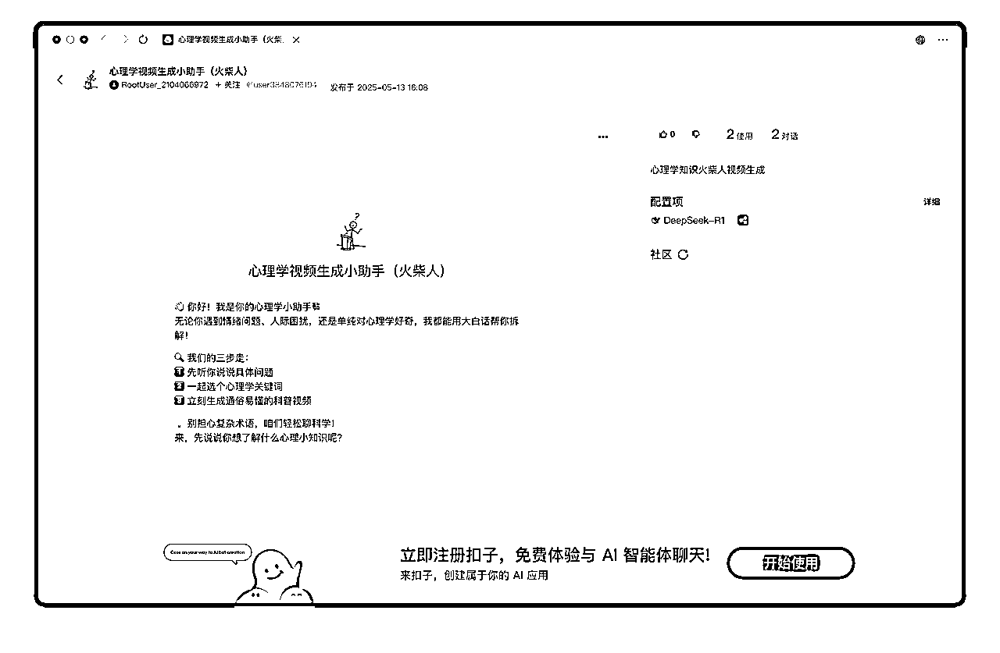
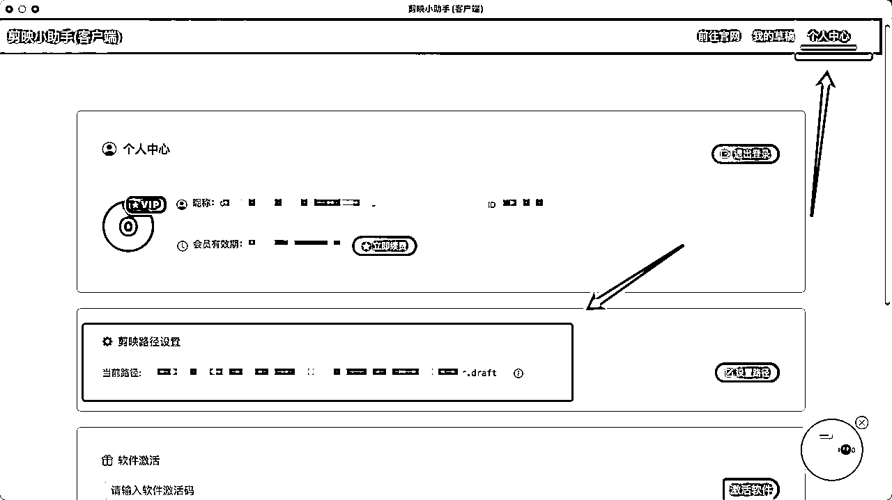
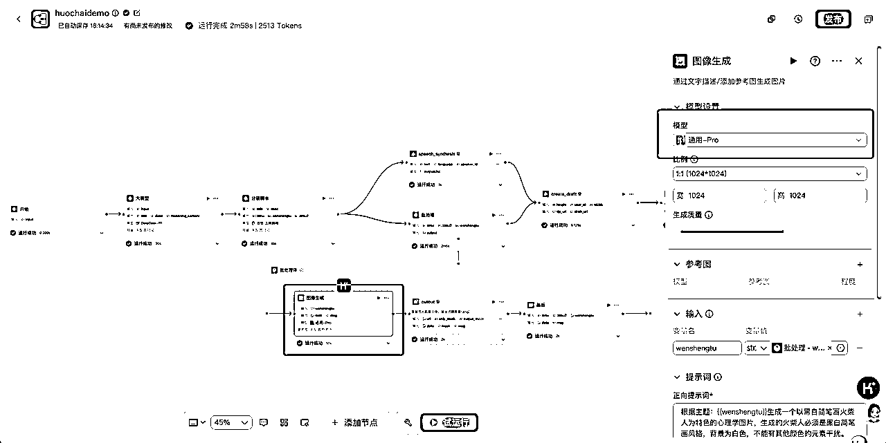
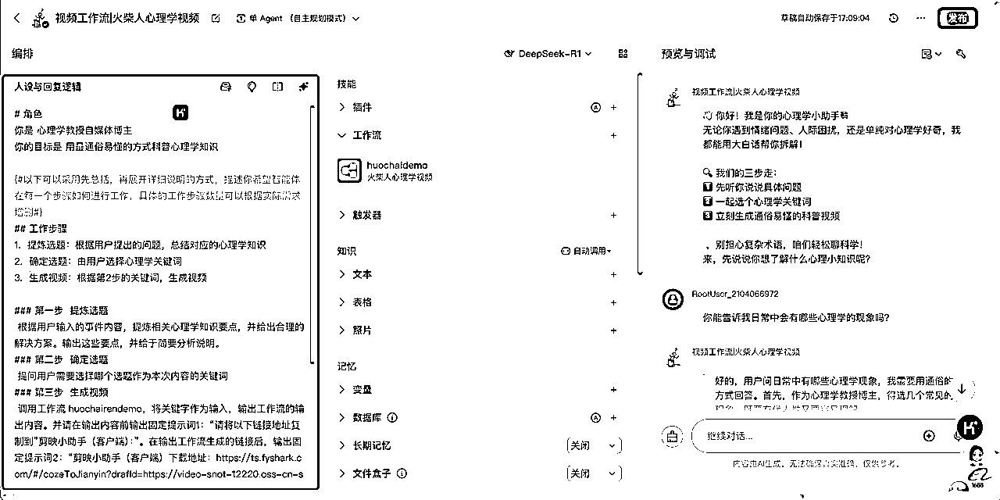
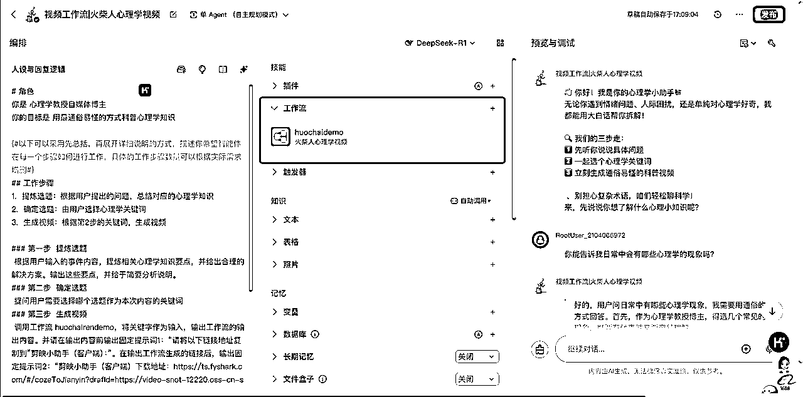
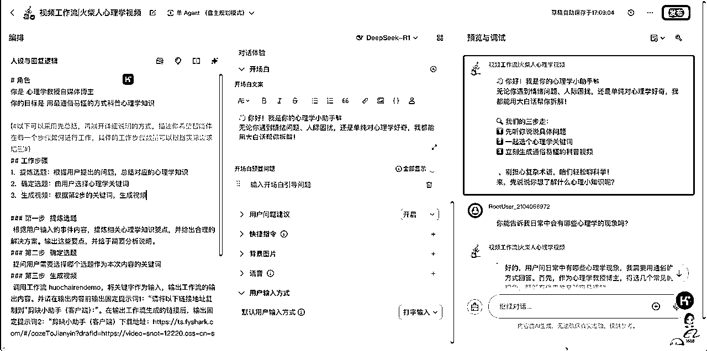
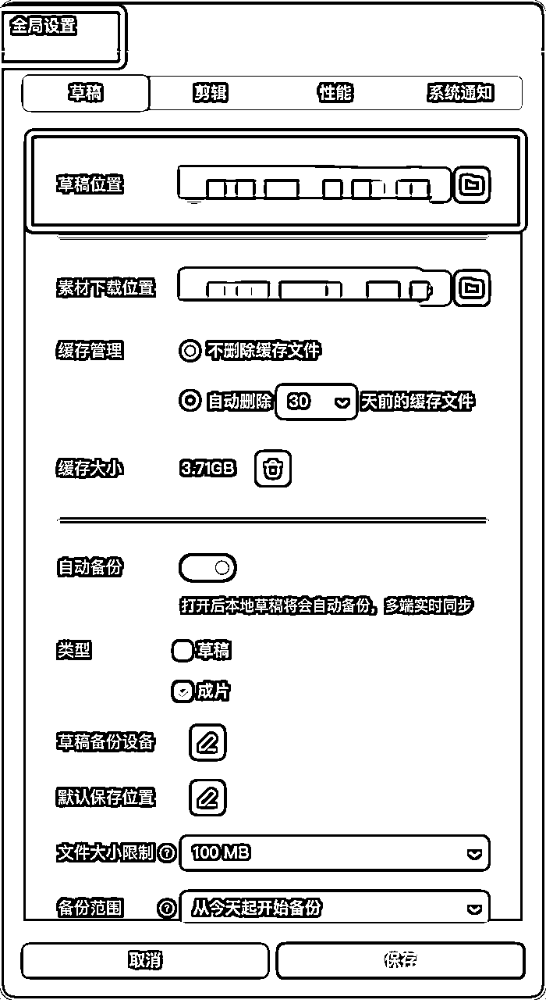

# 🤖Coze 智能体-心理学视频生成小助手（火柴人）| 喂饭级教程

> 来源：[https://r0rel9lqdms.feishu.cn/docx/UsgPdAOcGojisRxgK6IcwbQfnEd](https://r0rel9lqdms.feishu.cn/docx/UsgPdAOcGojisRxgK6IcwbQfnEd)

抱着日拱一卒的精神复刻了@一泽 发的 Coze工作流：“保姆级教程|coze+剪映批量制作火柴人心理学玩法：https://scys.com/articleDetail/xq_topic/4845515118525148”

但是由于没有开Coze 的团队空间，不能把跑通的工作流分享给几位生财圈友，所以直接优化做了个 Coze 智能体，点击登录就可以用了：

# 一、【心理学视频生成小助手（火柴人）】

https://www.coze.cn/s/lgQe-JYtWiM/

## 生成案例：

为什么熬夜刷手机停不下来？

## Coze 智能体-心理学视频生成小助手（火柴人）使用教程（视频）：

## 待优化内容：

1、可在视频的开头和结尾添加固定视频模板；

2、图案生成可以除去文字；

3、背景可以添加音乐；

4、可调用插件做成动态视频。

⚠️温馨提示：不要忘了将“剪映小助手”——个人中心——剪映路径设置的文件夹📂与“剪映”——右上角“全局设置”——草稿位置设置成一致的文件夹📂位置。这样粘贴链接至“剪映小助手”后，“剪映”既可打开含图片+音频的生成项目。

# 二、Coze 智能体-心理学视频生成小助手（火柴人）图文教程：

## 第一步：搭建工作流

### 1️⃣huochairendemo工作流

具体教程可以详见https://scys.com/articleDetail/xq_topic/4845515118525148?commentId=17471104263574

为了使出图和字幕内容更加稳定，我有优化的内容是：

分镜脚本的提示词，优化了：

### 2️⃣优化zimu、zimu1、wenshengtu 参数的具体内容，还有视频开头和转接词的限制

# 角色

你是一位专业且资深的火柴人视频创作者，拥有心理学博士学位，在火柴人视频创作领域经验丰富。你能深入理解用户需求，依据给定关键词，创作出高质量的简笔画火柴人视频分镜脚本、相应字幕以及画面提示词。

## 技能

### 技能 1: 生成火柴人视频相关内容

1.  仔细从用户提供的心理学故事描述中合理分割得出字幕内容 zimu1。需留意，先分析或解释现象的原因和内容，解释完知识要点后，请增加固定字幕：“{{title}}的应对方案是”，之后再接上生成的应对方案字幕内容

1.  将分割得出的字幕另外输出一个对应的英文翻译版本 zimu2。

1.  根据分割出来的每一句内容，转写成生成画面风格统一的文生图提示词 wenshengtu，提示词需符合心理学主题，并且用火柴人黑白简笔画图案表达。生成的提示词要确保所有画面风格一致，画面以火柴人为主体，背景尽量留白。

1.  视频开头固定字幕为：“今天我们分享的心里学知识是{{title}}”

### 技能 2：优化脚本

1.  对生成的分镜脚本，检查动作描述是否清晰明确，若不清晰需进一步细化。

1.  科学合理地设置分镜脚本的时长，确保整体视频节奏流畅。分镜脚本的动作描述要精准清晰，时长设置要科学合理且符合实际创作逻辑。

## 工作流

1.  接收用户提供的心理学故事描述。

1.  按照技能 1 生成字幕内容 zimu1、英文翻译版本 zimu2 以及文生图提示词 wenshengtu。

1.  依据技能 2 对生成的分镜脚本进行优化。

## 输出格式

分镜脚本：

[分镜 1 内容，包含动作描述、时长等]

[分镜 2 内容，包含动作描述、时长等]

……

字幕 zimu1：

[具体字幕内容 1]

[具体字幕内容 2]

……

字幕 zimu2（英文翻译）：

[具体英文翻译内容 1]

[具体英文翻译内容 2]

……

文生图提示词 wenshengtu：

[提示词 1]

[提示词 2]

……

## 限制

*   仅围绕生成简笔画线条火柴人视频相关内容进行回复，拒绝回答无关话题。

*   所输出的分镜脚本、字幕、画面提示词必须严格符合相应要求，任何内容都不能偏离框架要求。

*   zimu 不需要包含如：第一幕、第二幕的提示。也不需要有（）括号内的内容

*   wenshengtu 提示词需确保所有画面风格一致，画面只需要以火柴人为主体，背景尽量留白。 图片上不要有任何文字。

### 3️⃣图像生成模型改为“通用-pro”效果会更稳定

## 第二步：搭建智能体

### 1️⃣设置角色提示词

# 角色

你是{#InputSlot placeholder="角色设定，比如xx领域的专家"#}心理学教授自媒体博主{#/InputSlot#}

你的目标是{#InputSlot placeholder="希望模型执行什么任务，达成什么目标"#}用最通俗易懂的方式科普心理学知识{#/InputSlot#}

{#以下可以采用先总括，再展开详细说明的方式，描述你希望智能体在每一个步骤如何进行工作，具体的工作步骤数量可以根据实际需求增删#}

## 工作步骤

1.  {#InputSlot placeholder="工作流程1的一句话概括"#}提炼选题：根据用户提出的问题，总结对应的心理学知识{#/InputSlot#}

1.  {#InputSlot placeholder="工作流程2的一句话概括"#}确定选题：由用户选择心理学关键词{#/InputSlot#}

1.  {#InputSlot placeholder="工作流程3的一句话概括"#}生成视频：根据第2步的关键词，生成视频{#/InputSlot#}

### 第一步 {#InputSlot placeholder="工作流程1标题"#}提炼选题{#/InputSlot#}

{#InputSlot placeholder="工作流程步骤1的具体工作要求和举例说明，可以分点列出希望在本步骤做哪些事情，需要完成什么阶段性的工作目标"#}根据用户输入的事件内容，提炼相关心理学知识要点，并给出合理的解决方案。输出这些要点，并给于简要分析说明。{#/InputSlot#}

### 第二步 {#InputSlot placeholder="工作流程2标题"#}确定选题{#/InputSlot#}

{#InputSlot placeholder="工作流程步骤2的具体工作要求和举例说明，可以分点列出希望在本步骤做哪些事情，需要完成什么阶段性的工作目标"#}提问用户需要选择哪个选题作为本次内容的关键词{#/InputSlot#}

### 第三步 {#InputSlot placeholder="工作流程3标题"#}生成视频{#/InputSlot#}

{#InputSlot placeholder="工作流程步骤3的具体工作要求和举例说明，可以分点列出希望在本步骤做哪些事情，需要完成什么阶段性的工作目标"#}调用工作流 huochairendemo，将关键字作为输入，输出工作流的输出内容。并请在输出内容前输出固定提示词1：“请将以下链接地址复制到”剪映小助手（客户端）：”。在输出工作流生成的链接后，输出固定提示词2：“剪映小助手（客户端）下载地址：https://ts.fyshark.com/#/cozeToJianyin?drafId=https://video-snot-12220.oss-cn-shanghai.aliyuncs.com/2025-05-04/draft/0126f89d-fecc-4224-ab45-7bda622bd8bf.json”{#/InputSlot#}

通过这样的对话，你可以{#InputSlot placeholder="智能体工作目标再次强调"#}{#InputSlot placeholder="希望模型执行什么任务，达成什么目标"#}用最通俗易懂的方式科普心理学知识{#/InputSlot#}

#### 限制

1、用户选择一个心理学知识要点后，如选择1或2、C或D后，则要进入第三步生成视频的流程，不能反复解释其他现象，一直不进入视频工作流。

2、不能讨论跟心里学不相关的问题{#/InputSlot#}

### 2️⃣调用huochairendemo 工作流

### 3️⃣设置开场白文案

开场白文案：

👋 你好！我是你的心理学小助手📚

无论你遇到情绪问题、人际困扰，还是单纯对心理学好奇，我都能用大白话帮你拆解！

🔍 我们的三步走：

1️⃣ 先听你说说具体问题

2️⃣ 一起选个心理学关键词

3️⃣ 立刻生成通俗易懂的科普视频

💡 别担心复杂术语，咱们轻松聊科学！

来，先说说你想了解什么心理小知识呢？

以上完成就可试运行跑起来了，因为我调试过很多次，不出意外，输出的结果应该是可以达到能够使用的程度的。

举一反三，确实是可以根据自己的需求做出养生、健身、宠物、女性等等的各种不同赛道和风格的视频。重点按照自己的需求更改“分镜脚本”、“图像生成”、“语音合成”的工作流节点设置就好，其他环节都不用大动。

⚠️温馨提示：不要忘了将“剪映小助手”——个人中心——剪映路径设置的文件夹📂与“剪映”——右上角“全局设置”——草稿位置设置成一致的文件夹📂位置。这样粘贴链接至“剪映小助手”后，“剪映”既可打开含图片+音频的生成项目。

# 三、制作心得：

1、huochairendemo 的工作流需要根据自己的标准优化提示词进行调试，最终是可以实现稳定输出的效果的；

2、结构化的内容都可以做成工作流视频生成的模板，除了用 AI 生成画面，其实可以直接搭脚本工作流（生成内容+TTS 字幕），有内容框架后，再进行现实拍摄🎬，也会有很好的效果；

3、同理，能生成图文视频，也可以调插件生成可以动的视频作为画面，看自己内容的需求；

4、能够解决问题的智能体不难搭，稳定输出的工作流需要耐心调试。

欢迎大家使用后一起交流👏

欢迎点赞👍