# 用 AI 学习生财有术，是我快速拉齐信息差、认知差的杠杆解

> 来源：[https://aiawaken.feishu.cn/docx/A1tZdXQ3CoiPCXxArsAckuX2ngf](https://aiawaken.feishu.cn/docx/A1tZdXQ3CoiPCXxArsAckuX2ngf)

不知不觉，从去年 6 月开始转行做一人 AI 公司，到 11 月正式 AI 创业快 1 年了，

经常有朋友问：

你如何这么快适应一个新领域的？

你是如何这么快知道小红书，公众号，视频号的流量规则或者变现方式的？

你从哪里知道这么多的副业项目，变现方式的。

先说结论：一个公式

AI+优质信息源（input） = What \why \how（output）

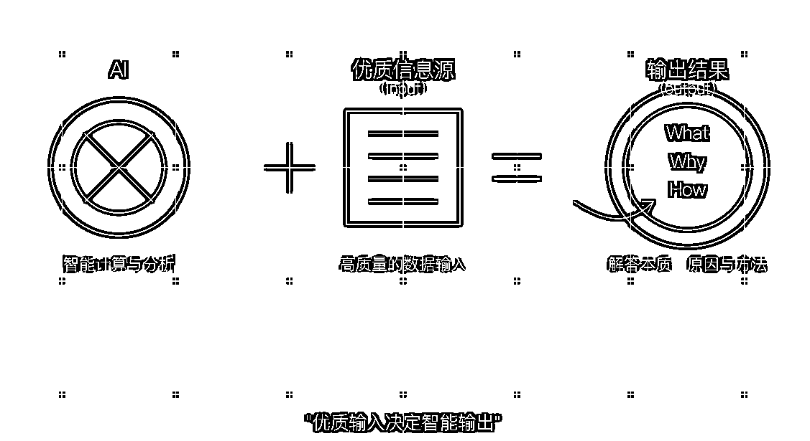

今天的文章希望对大家有一些启发。

* * *

## 普通人为何陷入信息焦虑

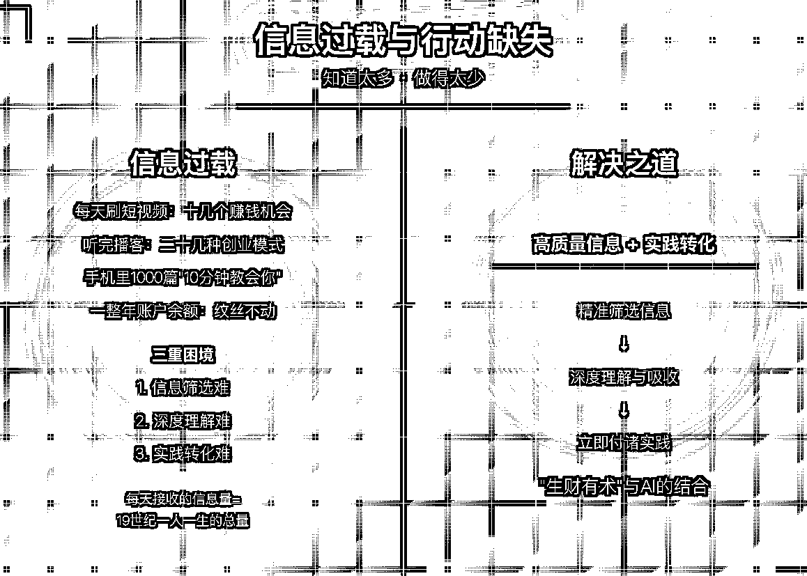

之前我每天刷完短视频，就有十几个赚钱机会。

听完播客，又有二十几种创业模式。

但一整年下来，我的账户余额却纹丝不动。

这就是信息过载。算法让我注意力停留在看了世界这么大，可我依旧一贫如洗。

信息太多，行动太少。手机里存了 1000 篇"10 分钟教你月入 10 万"的文章，却连第一步都迈不出去。

数据显示，我们平均每天接收的信息量相当于 19 世纪一个人一生接收的总量。

而我们的大脑处理能力却没有同步提升。

这就造成了三重困境：

1.  信息筛选难：哪些值得关注，哪些只是噪音？

1.  深度理解难：表面理解容易，真正消化吸收难

1.  实践转化难：知道不等于做到

尤其在赚钱领域，这种困境更为明显。

朋友小林曾花 5000 元报了个"AI 写作赚钱课"，结果发现课程内容 80%都能在公开渠道免费获取。

这是信息差，更是认知差。

随着我对认知差的理解加深，一个问题始终萦绕在我脑海：

有没有一种方法，能让我既获取高质量信息，又能快速理解并付诸实践？

答案在"生财有术"和 AI 的结合中找到了。

* * *

## 生财有术：赚钱信息的"黄埔军校"

第一次听说"生财有术"，是 2024 年 7 月的 《人人玩转 ChatGPT》作者黄小刀告诉我，

"那里汇集了 6.7 万人，每天都在分享实战赚钱经验。"她这样介绍。

起初我并不以为然。互联网上教人赚钱的平台太多了，大多是"卖铲子的比挖金者更赚钱"的游戏。

直到我真正加入，才明白它的与众不同。

生财有术不是简单的知识付费平台，而是一个完整的赚钱信息生态：

1.  信息筛选：每年筛选出近千篇精华帖，19000 多条风向标，覆盖几乎所有主流赚钱领域

1.  实战落地：8+次"航海"集训营，从理论到实践的完整闭环

1.  高质量社交：67000+会员中不乏各行各业顶尖从业者，形成独特的人脉网络

一个圈友"紫菜"的故事让我印象深刻：他通过从生财有术挑选优质项目，

交给团队去复制执行，每个项目基本能实现七位数收入。

这就是生财有术的核心价值：信息筛选和信心支持。


但问题来了，生财有术内容量如此庞大，从哪里下手？

如何在短时间内学习吸收？每天除了本职工作，我能挤出的时间不过 2-3 小时。

这时，AI 成了我的秘密武器。

* * *

## AI 学习 = 10 倍速吸收海量信息

首先，我明确了 AI 学习的三大原则：

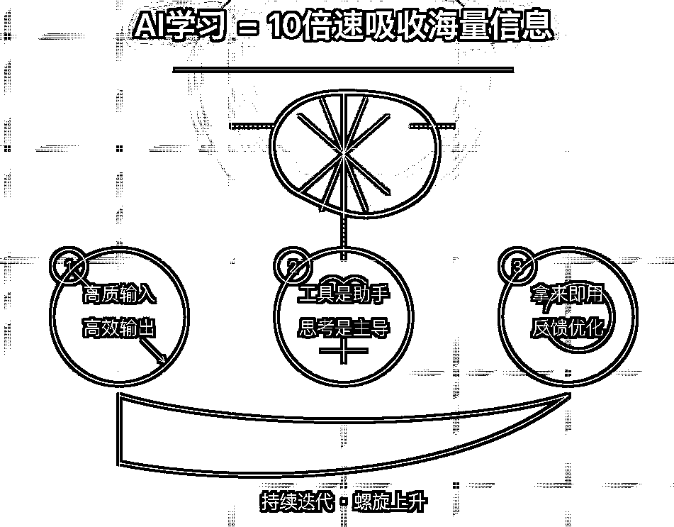

1.  输入高质，输出才高效

1.  工具只是助手，思考是主导

1.  拿来即用，反馈闭环，不断优化

然后，我搭建了自己的 AI 学习生财，核心是三个模块：

### 模块一：内容筛选与分类

生财有术的内容实在太多，单靠人力根本看不完。我用 AI 帮我智能筛选和总结。

比如分类：我用这个方法处理了生财有术《生财使用指南》的使用手册，20 分钟内就掌握了核心玩法和注意事项。相比之下，我的一个朋友花了整整一周才看完。

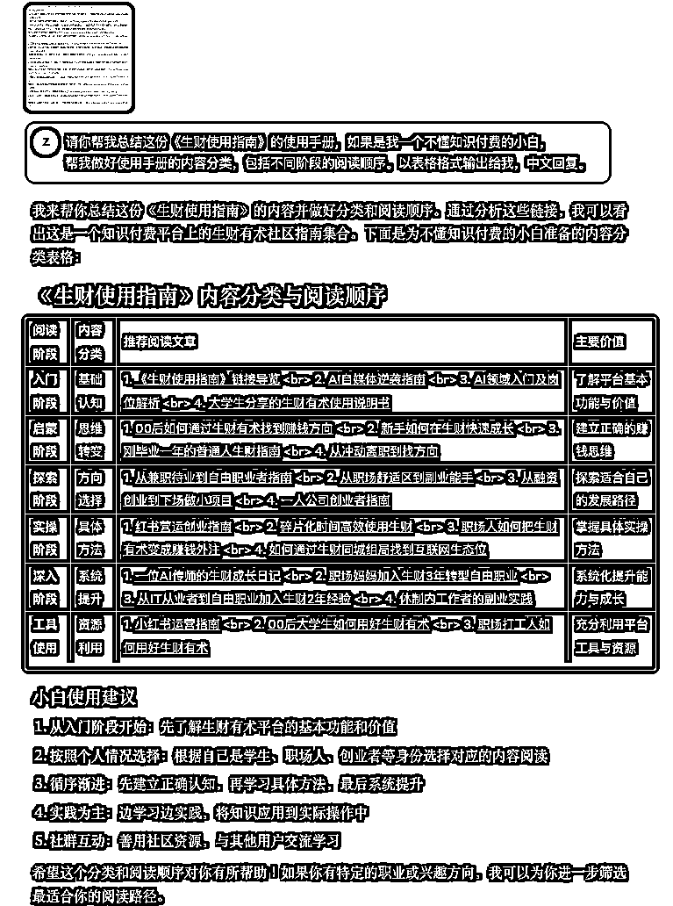

再比如筛选：小红书的垂直内容

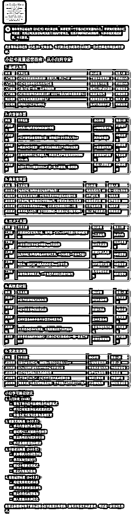

### 模块二：知识转化与深度理解

内容筛选只是第一步，更重要的是深度理解。

我设计了一套"费曼学习法+AI"的组合拳：

1.  阅读筛选后的内容

1.  用自己的话向 AI 解释核心概念

1.  AI 指出我理解中的误区和盲点

1.  要求 AI 提出 3-5 个应用场景问题，检验我的理解

本质就是给自己拉通一个刻意练习的老师，快速理解和对齐陌生知识的卡点。、

比如：

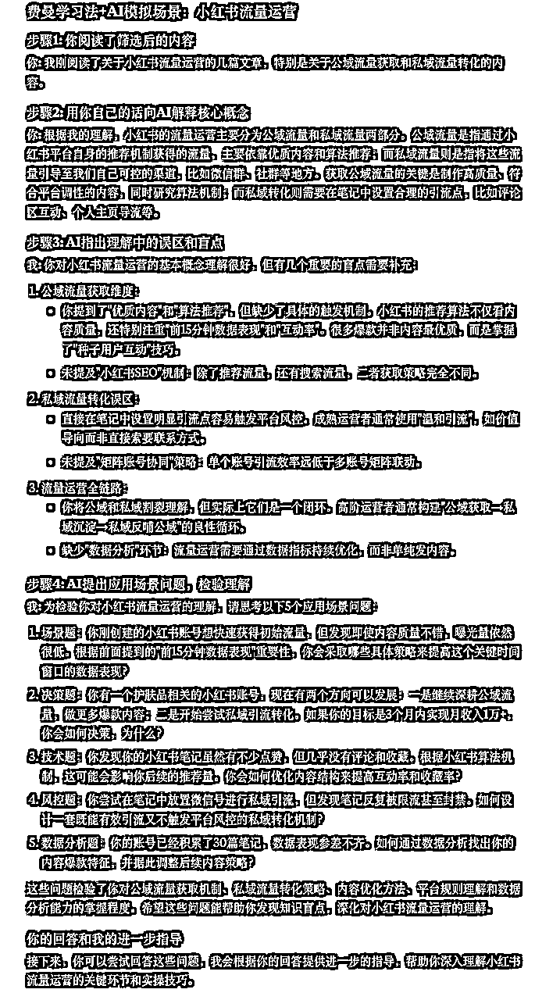

### 模块三：行动计划与执行追踪

知识不转化为行动，等于零。

我用 AI 帮我：

1.  将学到的知识点转化为可执行的行动计划

1.  拆分大目标为小里程碑

1.  设计执行追踪表，记录每日进度

1.  分析执行障碍，提供解决方案

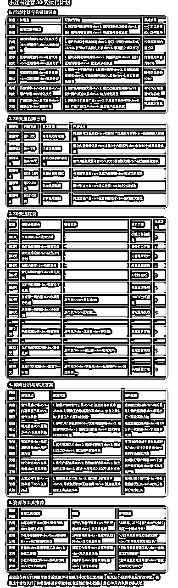

执行过程中，我每天反馈执行情况，AI 根据反馈调整计划。一个月后，我成功将 5 个小红书账号从 0 粉丝增长到平均 500+，其中一个账号还获得了小红书官方推荐。可能不明显，但比摸不到头脑和长期 100 流量好得多。

* * *

## AI+生财有术（优质信息源）学习方法论：AI 觉醒学习模型

传统学习：看 10 篇文章→理解 70%→记住 30%→实际用上 10%

AI 学习：看 1 篇精华帖→理解 90%→记住 60%→实际用上 40%

过去一年，我通过 AI+生财有术的方式，成功启动了 3 个副业项目，

月增收 25000+元。（公众号爆文，代写，小绿书引流）案例：

#### What：这个方法是什么？核心逻辑是什么？

#### 比如：AI 输入并总结航海手册

输入

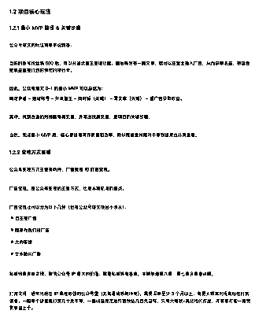

得出：

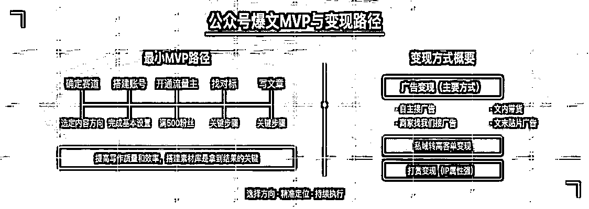

#### Why：为什么有效？背后的原理是什么？

#### 比如：AI 输入并总结航海手册解释

输入：航海手册《生财思维课之 MVP 思维》

得出：

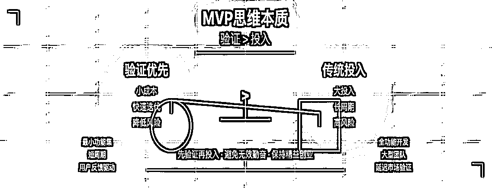

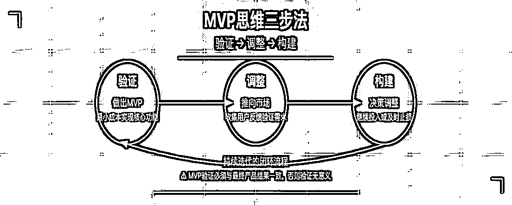

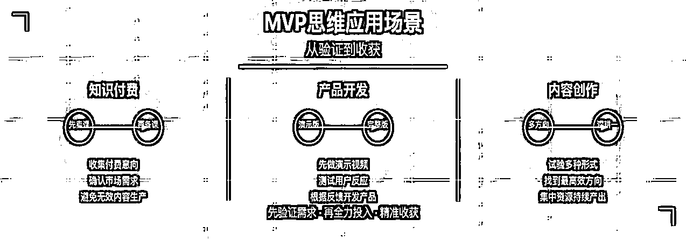

#### How：如何操作？步骤是什么？有什么注意事项？

#### 比如：给 AI 输入并实操航海手册生成提示词

输入：

输入：

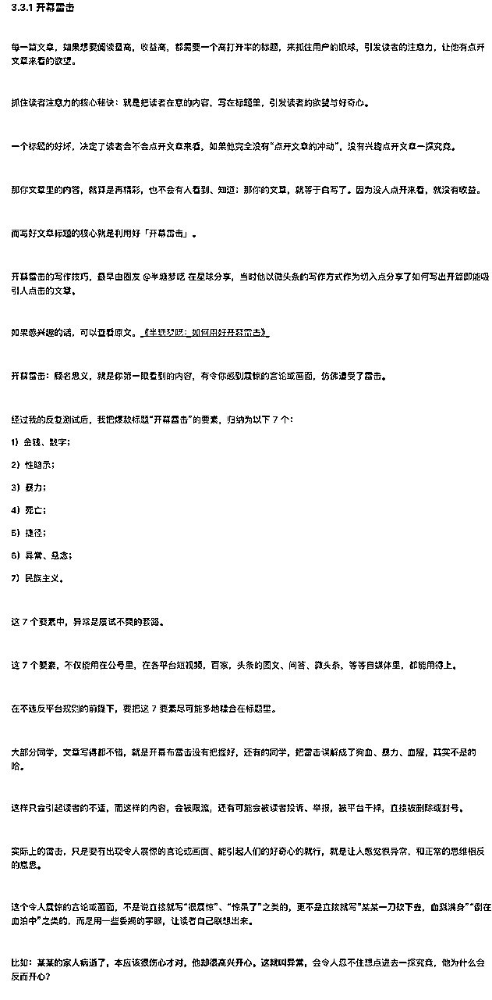

提示词：

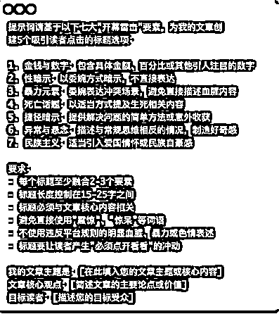

效果：

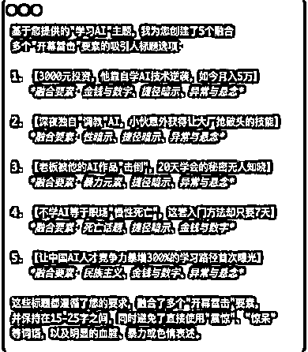

#### 结论

传统学习模式是线性的：接收信息→记忆信息→应用信息。


AI+生财模式（优质信息源）是网状的：提问→获取答案→提炼模型→应用→反馈→迭代。

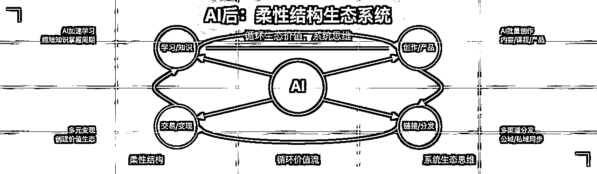

通过这种方式，我不再是信息的被动接收者，而是知识的主动构建者。

AI 也不是取代思考，而是帮我更高效地思考。从信息→知识→智慧的转化过程中，AI 是强大的催化剂。

* * *

## 学习是为了更好地创造和分享

随着我对 AI 运用和生财有术的深入学习，

我也开始从单纯的知识消费者转变为分享者。

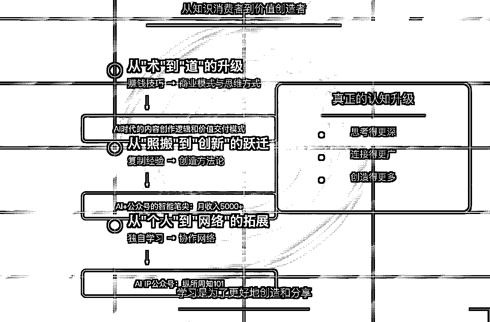

这个过程中，我发现了三个关键转折点：

#### 从"术"到"道"的升级

最初，我只关注具体的赚钱技巧（术）。 现在，我更注重商业模式和思维方式（道）。

例如，我不再只关注"如何用 AI 写爆款文案"，而是思考"AI 时代的内容创作逻辑和价值交付模式"。

#### 从"照搬"到"创新"的跃迁

开始阶段，我只是复制别人的成功经验。 现在，我能融合多领域知识，创造自己的方法论。

我将生财有术中学到的公众号爆文运营经验与 AI 自动化技术结合，开发出了一套"AI+公众号的工具"的智能笔尖，这这个产品已经帮助我的一些朋友实现了每月 5000+的副业收入。

```
地址：https://aiawaken.top/dc/v53e930y
```

##### 效果：

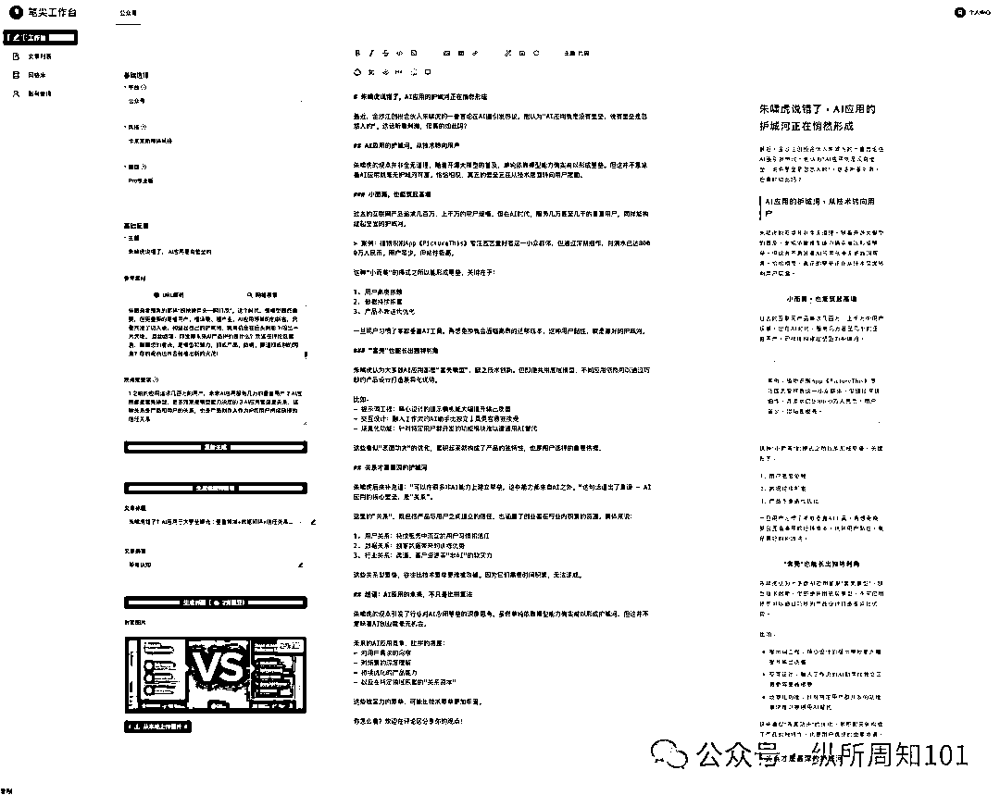

#### 从"个人"到"网络"的拓展

初期，我只是独自学习和实践。 现在，我开始链接资源，形成协作网络。

用在生财的输出文章的思路开始做自己 AI Ip 公众号：纵所周知 101

这三个转折点让我明白：

真正的认知升级不是知道得更多，而是思考得更深、连接得更广、创造得更多。

这就是，我说的觉醒学习模型运用。

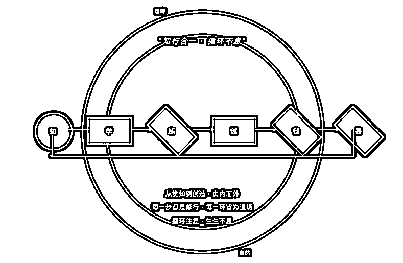

左手学习，右手生产链接。

* * *

2025 年，我觉得 AI 与知识社群的结合将迎来爆发期。

据微软 2025 年 AI 趋势报告预测，AI 驱动的智能体将拥有更高的自主性执行任务，

并深入到工作与生活场景中。AI 不再是简单的工具，而是成为人们学习和工作的重要伙伴。

我已经看到生财有术在 AI 能力建设上的积极动作：

*   AI 精华速读

*   AI 智能拆解风向标

*   AI 导图与搜索

*   AI 传术师俱乐部

这些功能不仅让学习更高效，更重要的是，它们正在重塑我们获取和应用知识的方式。

未来，AI+优质社群的组合将带来三大变革：

1.  选择高质量信息源解决信息差：通过不同优质的信息源作为你的个人知识库

1.  AI 学习，缩短认知差周期：参考觉醒学习模型

1.  生成产品：从学习到输出封装产品的周期大幅缩短

* * *

回顾过去近一年来时的路，最大的收获不是技术，不是项目，而是一种学习方法和思维模式。

*   对于信息：不是获取更多，而是获取更高质量

*   对于内容：不是记住更多，而是提取更多模式

*   对于方法：不是被动接收，而是主动构建适合自己

AI+优质信息源的组合让我明白：胜出的不是拥有最多信息的人，而是能最有效处理信息并转化为行动的人。

这种能力是一种元能力，会随着时间推移产生复利效应。

今天你比别人快 10%，一年后可能就是 100%，三年后可能就是 1000%。

我想送给大家一句话：工具会迭代，平台会更替，但学习的能力和行动的习惯将伴随你终生。

AI 觉醒思考，方得始终。

最后，推荐一下生财有术。

一个稀缺的高质量的、可实操的信息源。

* * *