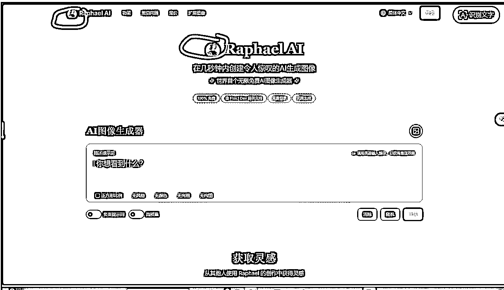

# AI图片站全程详解+前端制作技巧分享

> 来源：[https://bcn5ot9wwnew.feishu.cn/docx/HRlJd95FqoIT9lx4X1oc4gEonwd](https://bcn5ot9wwnew.feishu.cn/docx/HRlJd95FqoIT9lx4X1oc4gEonwd)

hello，大家好，我是念明。今天来给大家分享我如何制作一个AI图片站的全过程详解和前端制作的技巧。为了节约大家的时间成本，本文用最干练的语言进行叙述，不会掺杂一句废话。

AI图片站网址：picassoai.top

# 一、AI图片站全过程详解

## （一）流程介绍

确定技术栈和开发计划——落地页设计——接入API——UI精修——部署上线

## （二）具体操作

### 1、确定技术栈和开发计划

#### 与cursor对话：

1）我的目标：建立一个AI图片站，可以用文本生成图片，只需要完成一个MVP版本

2）补充细节：我不需要保存用户的任何数据，用户生成的图片在用户退出应用后及时清除

3）输出内容：请你告诉我所需要采用的技术栈以及能实现的具体流程（具体到每一步），给我输出一个Markdown文档(readme.md)来记录。

#### 多次对话来完善readme.md

根据自己的需求来完善。比如，cursor让你采用某个方案你觉得过于复杂，你就让他给一个简单的方案。多轮对话，达到你能理解的可实施操作的readme.md版本。（此过程非常重要，多花时间，磨刀不误砍柴工）

#### 我的readme.md文档

（先阅读，否则后续不容易理解我的一些内容）

### 2、落地页设计

在进行前端页面设计之前，需要按照readme.md将开发环境设置、获取API秘钥、项目初始化完成。

#### 我的落地页设计提示词

这里涉及模版以及修改，具体操作我放这个文档： 。

每个人根据自己网站的功能和特点稍加修改即可，AI图片站中级的加入一个AI图片生成器的功能区域。

然后把prompt输出给cursor，很快cursor就会输出一个比较优美的落地页：index.html，可以在文件管理器中点击，打开浏览器预览。

如果觉得不够美观，不要着急，后续把核心功能添加后再精修UI。

### 3、接入API

#### 与cursor对话

“我现在想接入文生图功能的API，而且免费，你给我推荐一些方案”

然后，cursor就会输出很多方案，我综合考虑后，选择了调用阿里云百炼的API——FLUX.1-schnell模型。

#### 我的调用方法如下：

1）点击阿里云官网的“大模型”

2）点击：“免费体验”

然后完成它的相关勾选内容，就可以进行免费体验，来到这个页面。

3）点击左侧导航栏的”视觉模型”，再点击图中的“图片生成”

4）你可以随便选择模型进行体验，体验完后，心中选定一款心仪的模型。

然后点击页面上方的“API参考”

5）获取API KEY

点击上图中所示的准备工作，仔细阅读，跟着做，到了“配置API KEY到环境变量”这一步，一定要选择windows系统，继续跟着操作就好，不需要安装SDK。

6）然后选择相应模型进行无脑配置

左侧导航栏向下滑，找到你想要的模型，然后开始无脑模式

第一种：把现在的截图发给cursor，问他“如果我想接入API，请你一步步指导我操作”。然后做完一步，截图发给cursor，他会一步步指导你完成API的接入。

第二种：把当前网址发给cursor，告诉他你想配置哪个模型的API，然后让他自动配置就好了。（可能需要MCP工具，如果不行就采用第三种办法）然后把截图中的模型

第三种：承接第二种方法，Ctrl+A全选，然后复制粘贴当前具体模型网页对应的所有内容给cursor，让它自行配置，如果出了问题，就让它解决就好了。

还有第四种技术流方法，不适合大多数人。

然后API调用就实现了，理论上就可以在自己的应用上生图了。

但是

#### 注意

想要生图，在我的技术栈里面，必须同时启用前端服务器和API服务器，否则只能打开页面，而不能完成生图。，出现如图所示情况：

详细原因我放这个文档了：

### 4精修UI

我采用的方法是模仿+创新。

#### 模仿

##### （1）找UI设计优秀的网站汲取精华：

1）Raphael.app（小排老师的网站）

2）ghiblio.art

3）youphoto.ai

##### （2）全面分析：

让cursor来分析他们的优点，以及哪些可以补充到自己的网站中。

然后就进行个大概的优化

##### （3）细节补充

1）截图替换

我现在觉得小排老师的网站的header和hero区域做得很好，然后我就把它截图下来，发给AI，告诉它：

请你参考这个截图所示的header和hero区域，我要你根据我的网站的特色进行模仿，但不得抄袭，可以模仿大概的按钮和功能区域，但在样式上要有自己的独特风格。（按照自己的喜好给prompt）

2）巧用工具

如图中的logo标志的设计：

这个logo是AI直接复刻的，就需要你自己来想办法解决：

a、免费的logo制作网站，请打开google自行寻找

b、用AI+AI来解决。

首先打开小排老师的网站：Raphael.app，进行如下操作：

然后选择一张满意的图片下载下来，然后发给cursor让他写一个脚本把这张图片进行裁剪，裁剪成一张30×30的圆形图片和一张60×60的圆形图片，就能分别用作前面header和hero区域的两张logo标志了，让cursor把他们添加进网站即可。

#### 创新

字面意思，基于自己对网站构建的认知进行创造，或者让cursor在模仿的基础上进行创造。属于长期锻炼的能力。

### 5部署上线

按照自己技术栈中的描述，进行部署上线即可，我选择的是cloudflare pages部署。

# 二、前端制作技巧

上述说了，创新是属于一种长期接触网站而不断磨练得以提升的能力。所以应该如何培养呢？有没有一点系统性的方法呢？有的，基于我自己创建网页时，总不是很得心应手，我的UI修改想法与AI的并不是总是一模一样，做出来的设计总是会有偏差，所以有两条路，第一条路是使用figma，但由于我自己还没太深入研究，不做过多介绍；第二条路是建立在对UI设计的全面认知上，因此我花3小时用cursor做了一个专门学习UI的网站，部署到了vercel上，里面不仅包含UI的基础讲解，更包含UI组件、UI组件库、UI组件通用属性介绍、颜色分类和颜色大全。

网站地址：https://iu-topaz.vercel.app/index.html

但由于我自己都还没把网站上的内容学完，我就不自己介绍了，我就放一些图以及来自cursor的专业介绍：

UI指导书是一站式UI设计知识平台，系统化呈现现代界面设计的核心要素。

核心内容

*   基础理论：深入解析HTML、CSS与UI的关系，为初学者奠定坚实基础

*   组件体系：涵盖基础、表单、数据展示、导航及反馈等五大类UI组件，配合视觉示例

*   组件库分类：精选主流UI框架，按桌面端、移动端、小程序及跨平台四大场景分类，含使用方法

*   通用属性：详解尺寸、间距、状态控制及主题样式等UI组件共性属性

*   色彩系统：提供专业色彩分类与完整色彩库，包含主题色、功能色及中性色、渐变色、混合色、渐变混合色

特色价值

*   结构化知识体系，从原理到实践全覆盖

*   直观视觉呈现，降低学习门槛

*   代码示例丰富，便于实际应用

*   响应式设计，支持多终端访问

*   持续更新迭代，紧跟设计趋势

适用于UI/UX设计师、前端开发者及产品经理，是设计系统构建与UI规范制定的理想参考资源。

希望对你有所启发和帮助！