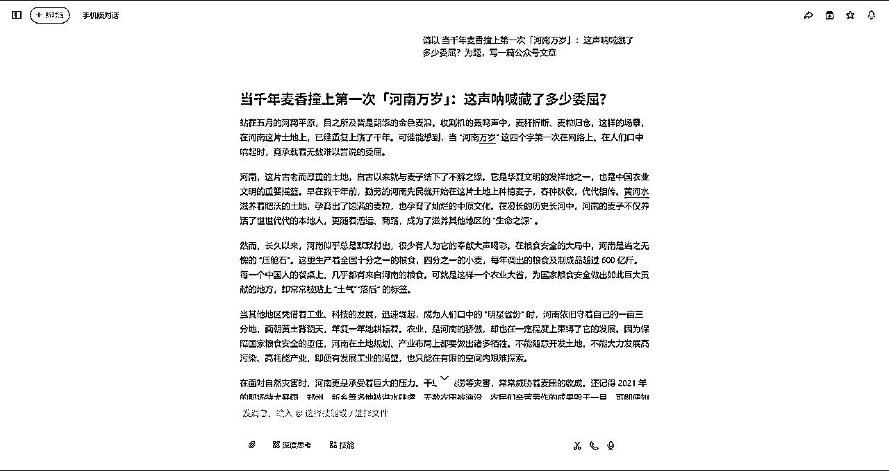

# 做公众号一个月，单篇爆了 27 万，我是怎么做的？

> 来源：[https://parwc0x6nb.feishu.cn/docx/VX3hdGNPBotPJdxPPu2cDYrvnsT](https://parwc0x6nb.feishu.cn/docx/VX3hdGNPBotPJdxPPu2cDYrvnsT)

大家好，我是刘同学。了解我的人可能都知道，4 月 1 号之前我从未提过任何关于公众号的信息，因为没做过不懂，所以也没什么好讲的。

但就我目前开始接触自学以来，我发现公众号的操作空间真的太大了，下面我给大家晒一些数据。

# 一、为什么选择做公众号？

因为公众号是生财 12 期航海项目。如果这个项目不赚钱，生财为什么做了 12 期？如果这个东西不赚钱，为什么随便一个人拿出来的数据都是几千，上万的收益？答案是真的太赚钱了！从我刚开始做，拿到的数据就是 1 万阅读 50 块钱往上，差一点也有 45 块钱。但当我做起来后发现，1 万阅读、太简单了，当然 10 万还是有难度。上面的图，大家可以自己计算。

# 二、公众号怎么做？

## 快速涨粉教程

看下面这个链接。https://t.zsxq.com/LeM6H 来自天津老秦公众号涨粉精华帖

## 全新的涨粉方法：

1.  进行视频号开播，并将视频号绑定公众号。

1.  直播不要用图片，要用实景视频直接播。去镇上或者城市最热闹的十字路口直播，直播时间选在晚上 10 点左右。我的账号在长沙五一广场直播时，流量好的时候一个小时涨粉五百多很正常。

1.  福袋要不断发，直播间有 3 个人就发 3 个福袋，4 个人就发 5 个福袋，8 个人就发 10 个福袋，一直到直播间有十几个人发 20 个福袋。但尽量不要让每个人都领到福袋，也可以让他们重复领，把氛围拉起来，这样你涨粉才能快。要知道时间就是金钱。

有人会问：“我直接买粉不行吗？”不行！我以前就是卖粉的，买粉价格贵，可能还没有售后，而且现在很多人也知道买粉会影响权限，所以不如花点时间搞真正的粉丝。开直播这个方法一定要一次性涨粉到位，不要三天打鱼两天晒网，不然粉丝掉得快，成本也会不断上涨，因为靠福袋来的粉丝没有任何忠诚度。

# 三、我从 12 期航海手册中自学到了什么关键点？

## 标题写法：

一定要吸引人，要有情绪化、包含金钱、数字等元素，具体内容航海手册里讲得更仔细。

## 选题定生死：

选题真的非常重要，花时间优化选题，比优化内容重要得多。只要选题够劲爆，文章就不会差，谁写的都不重要（这里说的是选题，不是标题）。

## 选题怎么选：

比如写公众号文章，要在微信搜一搜里搜索所选的选题，看它够不够劲爆，最近一段时间甚至最近一年有没有很多 10 万+的文章出现。如果没有，就不能仅凭自己觉得好，一定要经过大数据验证，这样才会爆。

## 文章字数：

建议文章字数不要超过 1500 字，也不要低于 800 字。原因涉及广告投放，我觉得没必要研究文章内广告和底部广告的展现次数，不如研究选题以及内容与广告的匹配度，因为广告是根据文章内容进行匹配的。

# 四、以“河南麦子”选题为例，讲解具体操作

最近河南的麦子非常火，我们就以它作为选题，进行讲解，不作为实际选题参考。

## 搜一搜：

我会在微信搜索“河南的麦子”“河南麦子”等关键词，看最近有没有爆火的文章。如果有，通过自己的判断，选择觉得能更爆的方向去写。看下面这个数据，最近半年达到 10000 播放、100000 播放的文章基本上没多少条，这样的选题想爆太难了。再看最近七天，只有一条 4.2 万播放的，你觉得自己会是那个幸运儿吗？此处是为了演示，我们就选这个。

## 豆包以选题定标题：

以“麦子熟了几千回，河南万岁第一次”这个标题为例，我会直接打开豆包，说：“你好，我是一个公众号写手，请你帮我以河南的麦子熟了几千回，河南万岁第一次为选题写一个爆款标题，爆款的标题特征是要具有情感冲突。”

第一次生成的标题，我觉得波澜不惊，不知所云，就让它重新生成。

第二次产出的标题“当千年麦香撞上第一次河南万岁，这声呐喊藏了多少委屈”，我觉得可以，就按照这个来写。

## 豆包写文：

接着告诉豆包：“请以当千年麦香撞上第一次河南万岁，这声呐喊藏了多少委屈为题，写一篇公众号文章。”豆包生成文章后，直接复制粘贴到飞书，利用飞书的公众号编辑器编辑，不需要任何付费工具，就是这么简单。

## 最后一步精修：

*   先用飞书的文字排版助手排版，再用公众号排版器排版，然后复制粘贴到公众号。

*   简单进行排版，我的原则是加 3 张或 4 张图，图可以直接在小红书上找小博主的，有 AI 生成的重点考虑，不要选有真人出镜的，容易出事。

*   检查广告能否插入两条，像我这篇 1215 字的文章，能插入两条广告就可以发布了。

# 五、提问答疑

很多朋友看完之后提的问题进行一个回复，以上内容无任何修改。

## Q:豆包生成直接发布？

A:这肯定是不行的啊，我正文中提到最后一步要精修，所以是一定要改的，不能直接发

## Q:怎么精修？

A:第一步，检查文字数量，大于1500或者少于800进行增加或者减少

第二步，修改明显看起来不顺眼的地方，比如markdowwn格式的大标题

第三步，换掉文中提到的阳春白雪类高端词汇，使得下里巴人能够阅读通畅，代入感情（就是说，简单点，别整高端词汇，你的读者群众看不到懂啊）

第四步，寻找符合文章主题的图片，放在合适的位置即可，你要分析广告会在那个位置，简单来说就是3-4章图，一般横屏的，然后均匀放就行

第五步，结尾要修改成能够引发共鸣的，或者读者评论的句子

进阶步骤，修改部分合理的数据或者词汇，让他不合理，或者没有道理，埋下槽点，引发读者评论，让他们觉得作者水平低，不如他们，使其嘲笑或者痛骂

## Q:你认为公众号的推流是怎么样的？

A：文章一旦爆火，推流速度和时间会很长，如果没有爆，可能三四天就完成了50%甚至100%的推流，不过随着时间或者其他文章的爆火，你的所有文章流量会得到明显提升，甚至第二春，不过提升不是很夸张。

## 我在这篇文中提到的关键性建议是什么？

1、入局项目要快，时间和金钱，我建议你选择时间。

一天开通流量主和10天开通，错的太久了。

2、细枝末节快速做，关键节点慢慢做。

开流量主要快，排版快，选图快，

选题要慢慢选，认真选；精修要认真，不能随便去修，这个很重要

具体的经验，我真没什么特别的，就是多发！我总共发了 10 几条就爆了。多发、多测试、多做，总有一篇会爆。一旦爆了，收入就是一两千、两三千，相当于月收入能达到四五千、五六千，这种生意为什么不做呢？ 切记，只有实际下场，才会有真感受，才能拿到真结果，同时也是最好的祛魅！

补充：公众号排版器飞书链接https://app.feishu.cn/app/cli_a782728235f1500c?from=share&visit_from=searchlz

# 六、账号及作品展示

文章内容展示