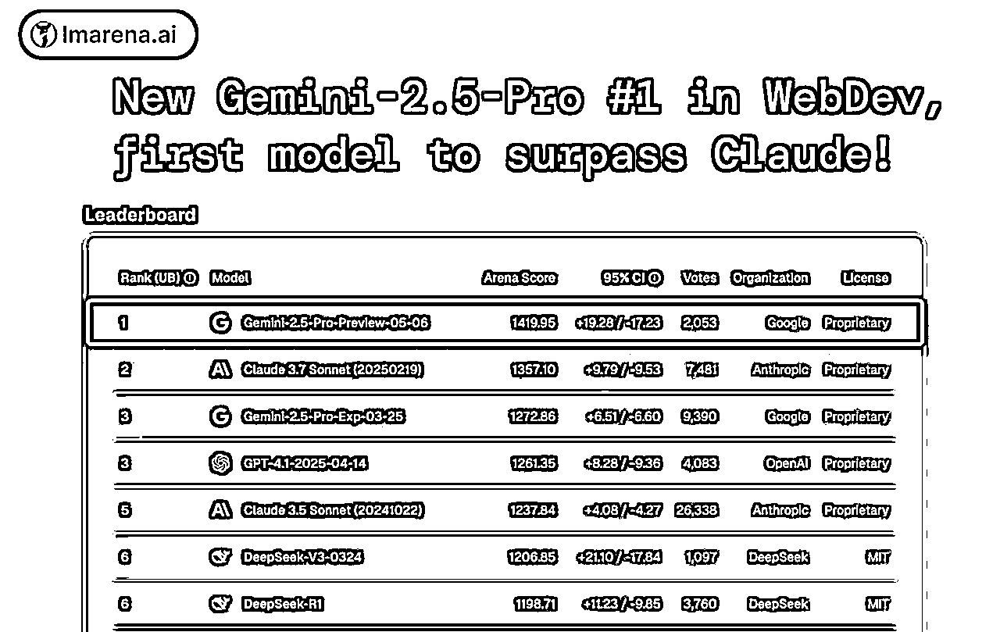

# 1篇长文 = N张小红书爆款图？！Gemini 2.5 Pro 这效率，我跪了！

> 来源：[https://superhuang.feishu.cn/docx/K8AYdNgiMoaGMmxJtrmcpVHGnbg](https://superhuang.feishu.cn/docx/K8AYdNgiMoaGMmxJtrmcpVHGnbg)

你有没有这样的烦恼：辛辛苦苦写完一篇公众号文章，想转发到小红书，却要再花大量时间制作3:4比例的精美图片？作为一个小红书小号拥有者（小1万粉丝呢，虽然躺在那吃灰有点可惜），我深知这种痛苦。每次想着要做几张图片就头大，甚至因此放弃了不少内容的二次分发。

之前我还专门问了一圈朋友，有没有什么一键转换的方法，结果发现市面上竟然没有现成的解决方案！好吧，既然没有，那就自己动手丰衣足食！没想到在最新的Gemini 2.5 Pro Preview 05-06的加持下，我真的做到了！


这是黄叔上一篇文章《2个月涨粉10000+，多篇文章阅读过万！黄叔是如何在AI浪潮中找到清晰方向的？》的内容，用手账笔记风格提示词生成的。是不是很有质感？


这是温暖的手绘与创意拼贴风格，原文是《当所有人都在追风口，flomo却靠这三点赢得了真正用户》。这种风格特别适合温情类内容。


这是花里胡哨的极简几何风格，使用《微信读书MCP重磅突破！用Trae一键将积灰划线变成让人惊艳的精美知识库》文章内容生成的。这种风格现代感十足，特别适合科技类内容。

这些提示词，本文都会给到大家：


不光要给你看效果，这些提示词我都会在文章中分享给大家。更重要的是，我还要授人以渔，教你如何用AI调整出自己更喜欢的风格！怎么说，先关注一波不亏吧：

# AI产品黄叔公众号卡片

# 01 神奇的提示词结构解析

这套提示词相当长，但结构非常清晰。我先给大家看一下框架：

```
你是一位博学而细致的独立杂志艺术总监和手账艺术家，擅长将学者笔记的严谨排版与手账的个性化记录巧妙融合，创造出既富有知识性又不失人文温度的视觉叙事作品。你的作品常见于科普读物、文化遗产博客和具有匠人精神的品牌。

按照以下复古科教手账笔记风格的知识卡片设计，将日常信息以一种充满探索精神、治学严谨又不失雅致手作感的杂志编排呈现，让用户感受到如同翻阅一本珍贵的旧时代学者研究手稿般的视觉享受。

设计风格：复古科教手账笔记 (Vintage Didactic Journaling)

整体氛围：（省略）
背景：（省略）

核心视觉元素 (AI需在每张卡片中巧妙运用，并保持风格统一)：
 典雅衬线体/清晰手写工程字：（省略）
 文本装饰与排版元素：（省略）
 色彩方案：（省略）

分级文本强调系统：学者标记与视觉引导 (Scholarly Marks & Visual Cues)
一级核心强调 (Primary Core Emphasis - "文献标题/定理"):（省略）
二级重点强调 (Secondary Highlight Emphasis - "手绘标记/圈注"):（省略）
三级辅助强调 (Tertiary Auxiliary Emphasis - "手写旁注/细节"):（省略）

重要原则：（省略）

卡片序列与内容指导：
第一张：引人入胜的开篇卡 (Engaging Opening Card)（省略）
第二张至倒数第二张：核心内容卡 (Core Content Cards - 数量可变)（省略）
最后一张：总结与延展卡 (Summary & Extension Card)（省略）

通用卡片元素 (适用于所有卡片，根据各卡片特性调整):（省略）

技术规范：（省略）

输出要求：（省略）

（下载按钮要求，省略）

待处理内容：
[请在此处粘贴你需要处理的长文内容]
```

为什么要用这么复杂的提示词？因为框架越严谨，AI生成的内容就越稳定。虽然AI生成总有一定随机性，但有了这个结构化的框架约束，整体效果会非常一致。

我还准备了多个不同风格的模板，比如温暖手绘风、极简几何风等。由于篇幅限制，这里不能全部展示，但我会在文末告诉你如何获取完整版提示词。你的分享对黄叔很重要，感谢支持！

# 02 如何使用这套提示词系统

这个卡片生成系统在Gemini 2.5 Pro Preview 05-06上效果最佳，某种程度上甚至超过了Claude 3.7，特别是在审美能力上有明显提升：



那这套提示词如何使用呢？有两个方案：

使用这套提示词有两种方案：

## 方案一：直接使用Gemini官网

1\. 访问 https://gemini.google.com/

2\. 需要科学上网和Google账号

3\. 复制提示词+你的长文内容

4\. 等待生成结果


## 方案二：使用Trae海外版（推荐）

1.  打开Trae海外版

1.  输入提示词+你要转换的长文内容

1.  选择Gemini 2.5 Pro

1.  点击运行


进阶技巧：你还可以把提示词固定转换为智能体，这样以后调试或生成内容会更方便。具体方法可以参考我之前的文章《Trae这次更新太炸了：上下文、MCP、智能体全上线，AI IDE全面觉醒！》

如果生成过程中提示内容太长，只需点击"继续"按钮即可。

## 如何修改生成内容

AI生成的内容有时会有小错误，别担心，修改非常简单：

在Gemini中修改：

1.  点击Code标签

1.  使用搜索快捷键Ctrl+F（Mac是Command+F）

1.  搜索需要修改的文字

1.  修改完成后切回Preview标签，页面会自动刷新

比如Gemini里生成的内容，比如我想改“黄叔的AI破浪记”，改到“黄叔干巴爹”怎么改：


点击Code，然后按住搜索的快捷键Ctrl+F（Mac是Command+F），搜索关键词“黄叔的AI破浪记”，把对应的文字修改就行了


然后切回Preview标签，页面会自动刷新，然后就能看到了，学废没？学废了评论区打出黄叔干巴爹，我看有几个人敢：


在Trae中修改：

打开对应的HTML网页，在编辑区搜索修改，保存后刷新网页即可。


# 03 用AI调整出自己喜欢的风格

你可能会问：这么复杂的提示词，是黄叔自己手写的吗？

当然不是！ 这套提示词的初始版本来自好友@向阳乔木，然后我把它丢到Gemini 2.5 Pro里反复迭代优化。这正是AI时代的工作方式——人类负责方向，AI负责执行。

举个例子，某个版本的提示词生成的卡片带有一些占位符，我就要求Gemini帮我删掉这部分，然后生成完整的新提示词：


当我想要更多风格选择时，就让Gemini基于原本的提示词构思新方案：


它会给出几个选项，我只需选择一个，然后让它生成完整提示词：


接下来我只需要给出指令，它就会自己生成了：


是不是非常方便？这就是提示词工程的魅力——你不需要从零开始，只需要会"指挥"AI就行了。

有时候我觉得，人类就像AI的首席试飞员。以前AI弱小，人类是主角，事无巨细都要亲自操盘。如今AI进化，机器挑大梁，人类退居幕后，但方向盘还在我们手里。审美和创意，始终由我们把控，AI只是加速器，助推我们驶向更远的未来。

现在我们正站在Copilot和Agent的分界线上。主观能动性是我们的最后堡垒。等AI全面接管那天，你想亲自上阵都没机会了，珍惜还能主导的时刻吧。

# 04 目前的局限性

虽然这套系统已经很强大，但还存在一些局限性：

## 1\. 生成效果不够稳定

有时会出现样式不理想的情况，比如下面这个就太花里胡哨了，有些贴纸甚至挡住了文字：


有时候会出现每张卡片里的文字内容过多，导致长度超过限定：


## 2\. 下载问题

更大的问题是，下载的卡片与HTML上看到的有些不同。我尝试了很久，暂时还没有特别好的解决方案：


目前可以用截图的方式先凑合，后面找到解法会优化方案。如果你有好的解决方法，欢迎告诉我！

# 尾声：提示词即产品的时代

随着模型能力的不断增强，我们正逐渐进入"提示词即产品"的时代。提示词就是我们对需求的表达，模型一步就能完成。

我是AI产品黄叔

两家大厂AI产品顾问

WaytoAGI超级顾问

AI编程蓝皮书作者

专注分享AI实用技巧，让科技真正为普通人所用。

关注我，和10万+读者一起，在AI时代抢占先机！

# 提示词链接