# 从 0 到1搭建 AI赋能的小红书高效运营体系

> 来源：[https://p03a4vs9s2.feishu.cn/docx/X3LpdzSIAozSsTxJIuWcCMV2n8H](https://p03a4vs9s2.feishu.cn/docx/X3LpdzSIAozSsTxJIuWcCMV2n8H)

大家好，我是叁斤，生财有术多期小红书相关航海的教练、AI传术师，深耕小红书 5 年了。

近期精华帖：

AI 赋能小红书运营：

小红书运营常见问题汇总：

在分享「AI 赋能小红书运营」之后，我的工作流程又升级了。

现在，我可以在10分钟内生成一篇高质量的小红书IP文案。同时，还能批量生成100条爆款小红书笔记，涵盖不同选题和内容形式。甚至还用AI搭建了自己的知识库，方便随时检索和复用优质内容。

今天分享下我是如何从0到1，搭建起这套运营体系的。友情提示：不涉及 A I 成图片，数字人和自动化RPA流程。

# 目录：

# 01\. AI 工具选择

现在市面上 AI 工具非常多，我选择工具时，我主要看三个方面：一看上手难度，二看内容生成质量，三看是否支持多平台协作。这样可以确保每个环节都能高效衔接。

比工具更重要的，还是我们自己要先想清楚：我需要 AI 解决什么问题？哪个工具最适合？我希望结果以什么形式呈现？我能否直接用这个结果？

我用不少工具，现在真正融入我日常工作流的，只剩下这几个：

DeepSeek ： 易上手，API接入飞书多维表格后，效率真的非常高！我用这个做了一个笔记分析表格，节省了很多账号分析的时间。

Claude ： 逻辑性强，适合生成公众号/小红书长文案、代码、卡片图片等。可以不投喂信息，只要给清晰的提示词就行了。

Gemini ： 适合投喂大量个人信息、竞品笔记进行深度分析和风格模仿，非常适合写个人 IP 文案和短视频逐字稿。

Dia浏览器： 能总结网页信息、在网页直接跟 AI 对话。

工具在精不在多，我只保留了能真正融入到工作流的工具，后面会详细讲它们的用法，所以先介绍一下。

# 02\. AI 做账号规划和定位

如果你的账号定位已经很清晰，可以直接跳到下一节，了解我的 AI 工作流方法。

AI 拥有庞大知识库，只要限定范围，它做的账号规划可能比个人的更加详细。

之前在： 的文章中提过账号定位的方法，这里再补充两个新思路。

## 2.1\. Claude 做账号规划

Claude 逻辑性强，适合梳理账号定位和内容方向，所以我会先用Claude梳理账号定位。

只要输入个人信息、目标用户画像、内容方向和差异化优势，它就会给出详细的账号规划建议。

提示词复制：

```
## 角色设定

你是一位资深的个人IP定位专家，拥有丰富的自媒体运营和内容创作经验，特别擅长小红书平台的账号定位与内容策略。你将基于专业知识，帮助创作者找到精准的个人IP定位，打造差异化竞争优势，实现从流量到变现的完整路径。

## 输入要求

请描述你的基本情况、兴趣特长和期望方向，我将为你提供全面的个人IP定位分析。

## 分析框架

我将从以下维度为你分析个人IP定位:

1\. **账号定位基础分析**
   - 基于你的特长、经验和优势选择适合的细分赛道
   - 明确你能解决哪一个人群在哪个具体生活场景中的哪一个问题
   - 找到你的独特领域和差异化优势

2\. **目标受众精准画像**
   - 构建具体、立体的受众形象(年龄、职业、生活状态、消费能力)
   - 分析受众的痛点、需求和行为习惯
   - 确定如何通过"点状吸引"找到有购买力的精准人群

3\. **个人IP构建策略**
   - 设计符合你特质的IP人设和表达风格
   - 制定视觉一致性策略(封面风格、配色、字体等)
   - 规划三种自我介绍类型(起号介绍、内容植入、强化IP置顶笔记)

4\. **内容策略规划**
   - 基于账号定位设计内容选题方向(生活出发、避雷类、与金钱相关、情感相关)
   - 制定内容结构和呈现形式
   - 规划内容矩阵和频道思维

5\. **对标账号分析**
   - 选择合适的对标账号(非蓝V且持续更新)
   - 分析对标账号的内容策略、互动质量和运营动作
   - 提取可借鉴的成功要素和差异化机会

6\. **变现路径设计**
   - 明确从流量到变现的具体路径
   - 规划账号成长的三个阶段(初期、中期、成熟期)的变现策略
   - 设计多元化的变现方式

7\. **避坑指南**
   - 识别常见定位误区(过于宽泛、盲目跟风、过度迎合、缺乏差异化)
   - 提供针对性的解决方案

## 输出内容

我将为你提供一份完整的个人IP定位方案，包括:

1\. **一句话定位**: 简洁明了地概括你的个人IP核心
2\. **账号定位公式**: 价值×用户×人设×类型×风格的具体展开
3\. **目标受众画像**: 详细描述你的目标用户群体
4\. **内容策略**: 3-5个核心内容方向和具体选题建议
5\. **IP风格指南**: 视觉风格、语言风格和内容结构的一致性建议
6\. **成长路径**: 账号发展的三个阶段规划
7\. **变现策略**: 短期和长期的变现方式建议
8\. **执行建议**: 具体可操作的起号策略和内容计划

请分享你的情况，我将为你量身定制一份专业的个人IP账号定位方案。
```

个人介绍包括：性别、年龄、性格、账号方向、变现模式、背景特长、偏好平台、个人故事等，越详细越好。

生成的账号内容，会包括个人IP构建策略，用于打造个人 IP ，非常适合刚起步、需要整体规划的账号。

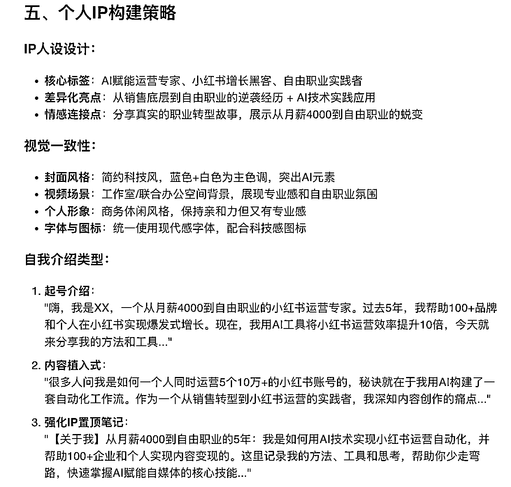

## 2.2\. Gemini 深度训练

除了账号定位规划，还可以把 AI 训练成“最懂你的小助手”，只要明确告知 AI 的需求（需要它帮你做什么），再输入你的详细信息，AI 就能帮你完成。

这部分是跟 @阿甜 学的，要求输入大量个人信息，比账号定位更详细。内容会非常多，所以用 Gemini 是最合适的。

我准备的个人介绍有 5000 多字，还有 30 多篇观点类的文案，全部投喂过去后，Gemini生成的文案就非常符合我的风格。

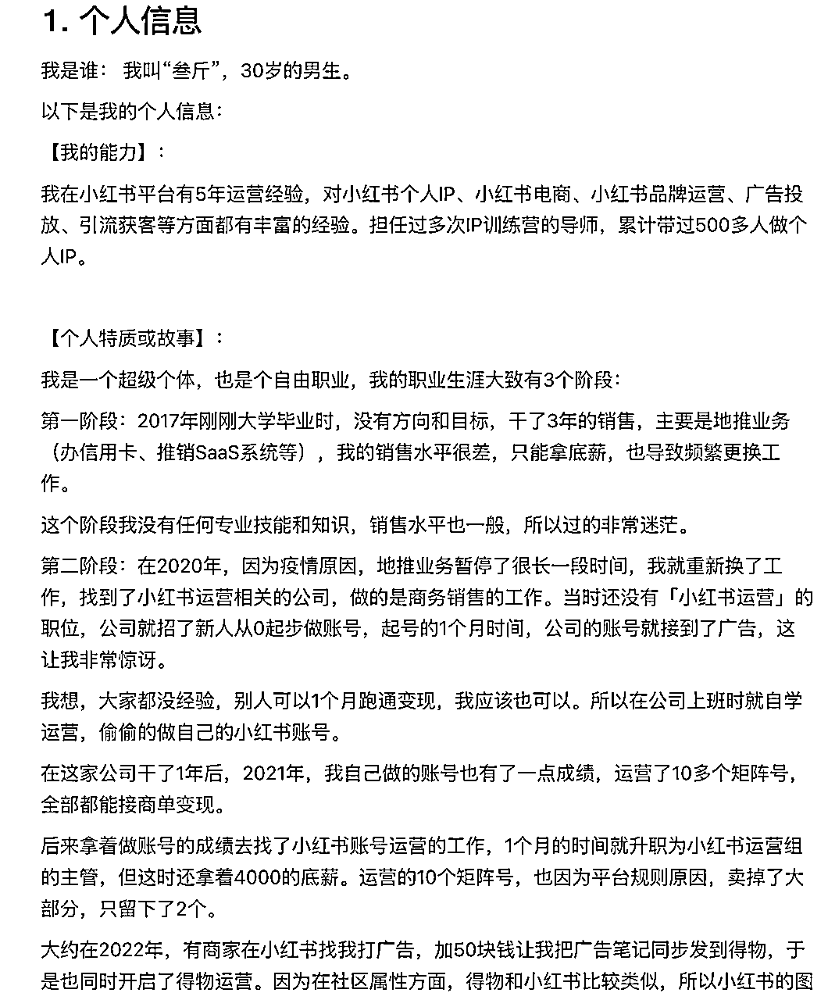

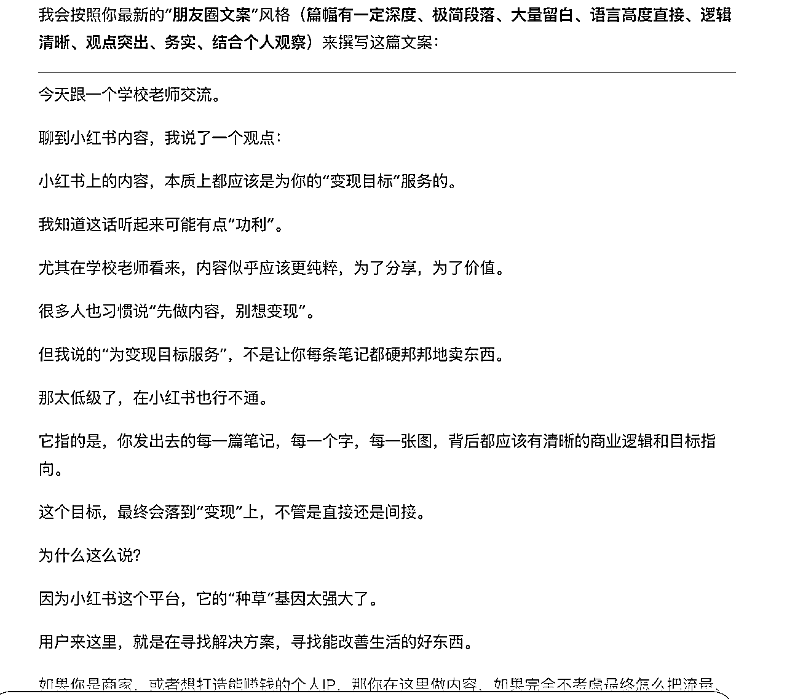

不仅是账号定位，建议大家如果要深度使用 AI 帮你完成某事，尤其是文案创作类，一定要准备一个详细的个人说明。

我在训练了小助手后，还用 Gemini 帮我重新写了一份个人说明书，比原来的版本清晰很多。

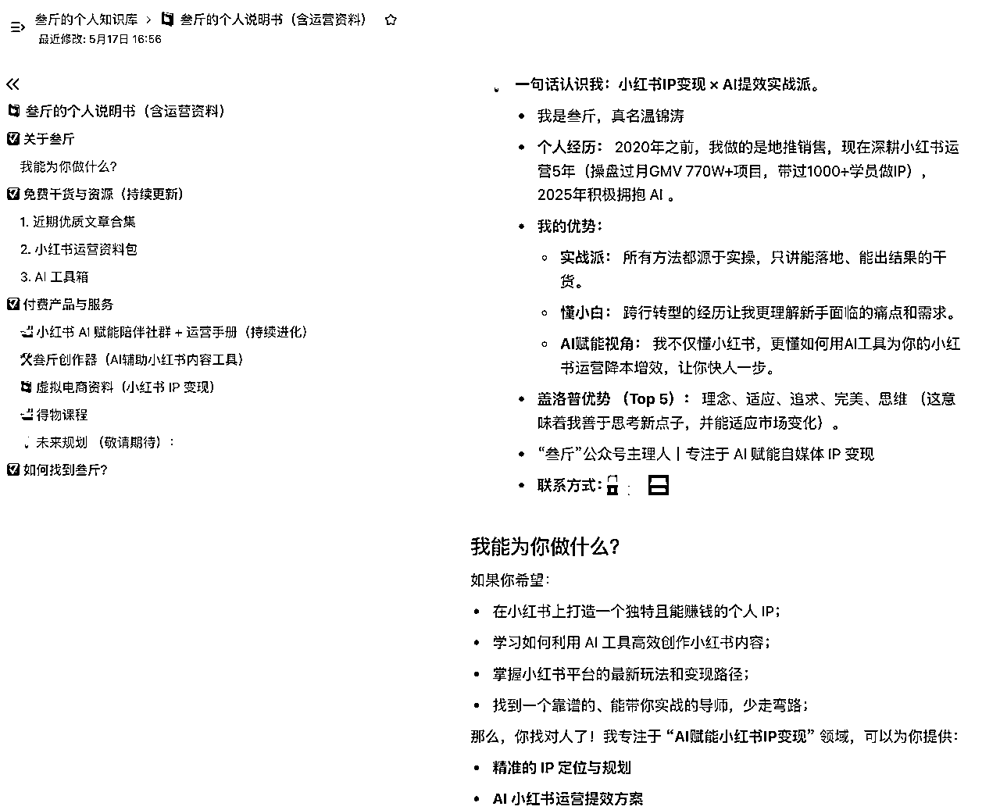

# 03\. ‼️【重点】我的小红书选题系统

AI生成的账号定位报告本身就包含了很多内容方向，如果还不够，或者需要一个源源不断的选题来源的话，分享下我用 AI 搭建的选题系统，可以实现：

1.把平时的闪念、笔记变成选题

2.把对标爆文编成选题

3.把热点编成选题

……

## 3.1\. 闪念选题体系

我用 AI 搭建了一个 知识库 ，包含日常信息记录、输出体系，我觉得这是所有「内容创作者」都用的是这套系统。

它把你的闪念、想法、笔记全部记录下来，形成一个知识库。具体做法如下：

### 1\. ALL IN ONE 记录法

All in One 的笔记记录方法强调的是“有想法就立即记下来，不求完美，只求能随时记录”，这是我从 @静静教主 这里学来的

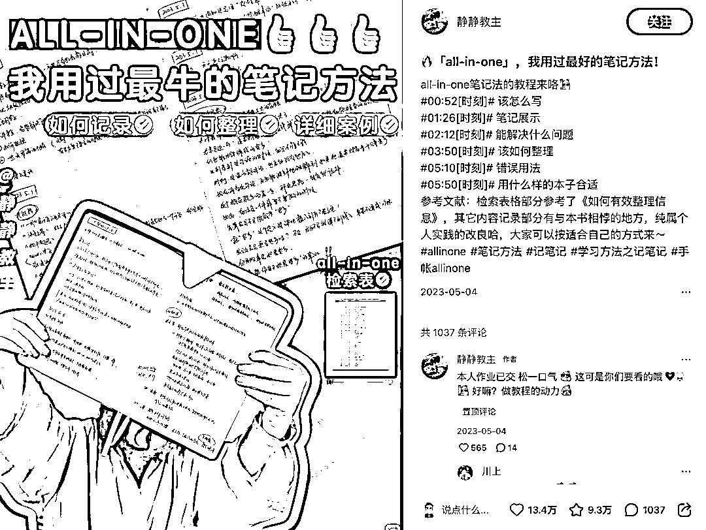

这个方法最核心的，就是 不要做那么多分类，全部记录下来，不要分什么读书记录、学习记录 什么的。

有任何的想法，包括你的todo list、done list等等，只要有想法，就全部往一个本子上写。

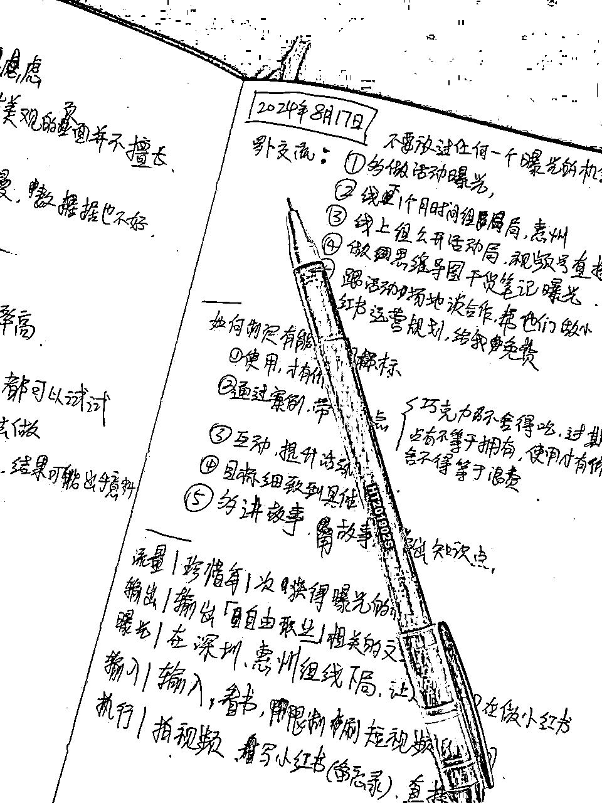

这个笔记方法我坚持了半年，但我觉得还不够方便，因为我有很多其他场景，是没办法及时拿出笔记本记录的。

所以在静静教主的分享基础上，我加工了一下，让ALL IN ONE的笔记方法更适合自己。

除了笔记本外，我新增了一些信息记录场景：

微信对话框：

微信可以建立一个只有自己的群聊，在这里我可以快速记录文字、链接等等。比如，在看到一个文章还不错，但没时间看完的时候，会统一放到「阅读文件」的群里。

也会添加flomo笔记，在微信使用的场景中有什么想法，就往flomo笔记上丢。

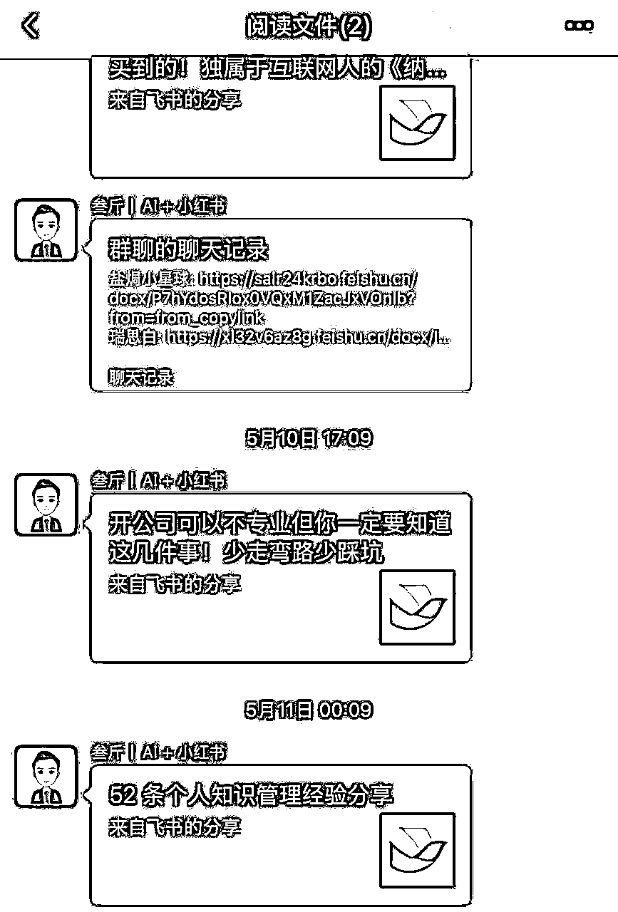

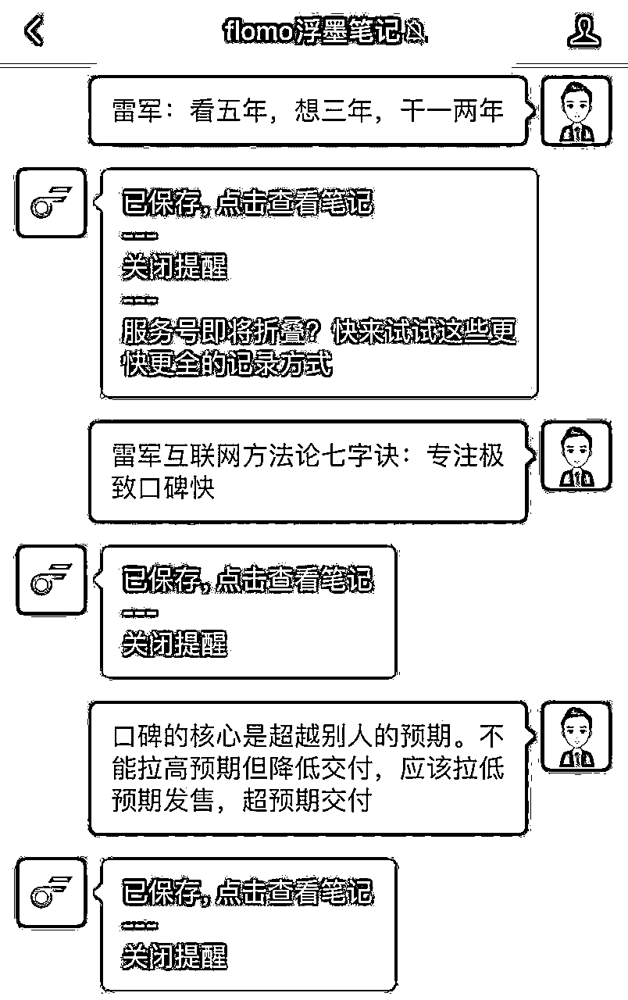

手机备忘录：

在非微信场景，不想被消息打扰的情况下。比如阅读实体书的时候，会用到手机自带的备忘录，并且会把备忘录添加到桌面组件，这样随时有想法，都可以点击组建快速记录。

举个例子，在看书的时候，发现某一个观点跟我的账号有关系，可以作为一个选题的话，我就会快速记录到选题库。

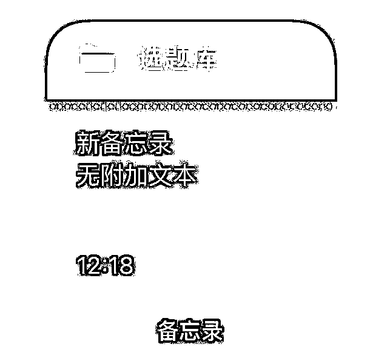

Get笔记 (或其他语音备忘录)：

当我在路上、不方便打字，或想快速把一个闪念记录下来的时候，我会用get笔记，他的好处是，我只要把闪念、想法告诉它，不需要有什么逻辑，语句不通顺的瞎说也可以，它会自动帮我总结成笔记。

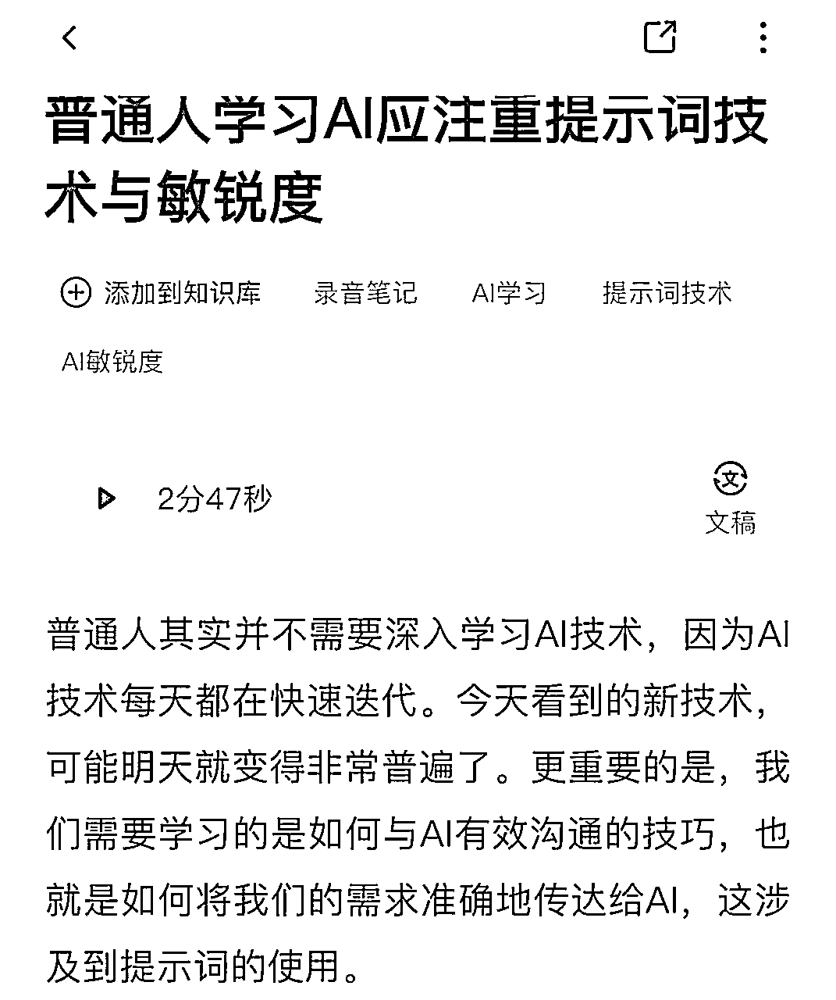

发现了吗？看似工具很多，但不同的工具，只是 用到的场景不同 ，我会根据当下场景选择最便捷的工具，确保一有想法，随手就能记录。

核心是 “不放过任何一个想法” ，而不是当想法产生时，还要找到专门的笔记app，再记录，这对P人不够友好。

笔记本、微信对话框、备忘录、语音笔记，这些几乎覆盖了我所有能产生想法的场景，我可以在每天晚上或者每周日进行复盘，把这些「闪念碎片」统一放到知识库进行整理。

### 2\. 闪念复盘体系：搭建知识库

只有闪念记录还不够，这些想法都分散在若干个工具里，而且是 ALL IN ONE ，没有整理，意味着这些想法都是散碎的，不成体系的。

所以定时需要对这些散碎的知识进行整理复盘，复盘是让零散记录产生价值的核心。

知识库体系简介：

在复盘的时候，我会把不同工具的记录进行筛选和提炼重点信息，并收集到知识库中。一些不重要的想法，或者todo list就不会记录进去。

知识库的搭建有很多工具，如notion、飞书、ima等等，我用的是飞书。建议使用有AI功能的，效率会更高。

大概流程如下：

1\. 筛选信息记录到「闪念记录」库

2\. 在「闪念记录」中对知识进行分类，收藏进对应知识库

3\. 有「输出」价值的信息会添加「#选题」标签

我的 AI 知识库体系

在知识库的第一栏，我放的是「闪念沉淀」的飞书多维表格，为的是我一打开知识库，立马就能整理闪念。

如前面说的，在这里，我会把筛选过的有用信息全部放进来。

给你们看下表格：

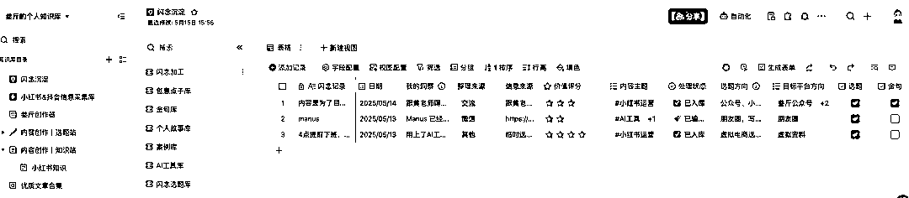

把所有信息放到「闪念记录」，在所有工具的信息都整理进来后，我会简单整理，写一下洞察、价值评分，还有潜在的选题方向，方便后续输出时写内容。

我还搭建了几个「专项素材库」，比如创意点子、金句、个人故事、案例等等，如果我觉得某个想法是个不错的金句，就会在「金句」这里打勾，这条闪念信息就会自动添加到「金句库」，其他素材库同理。

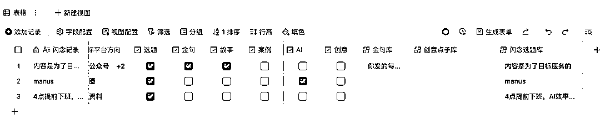

在这里统一整理，就不会花很多时间，而且飞书多维表格有自动化，打个勾就能自动把信息收集在「专项素材库」，非常方便，对 P 人也很友好。

「输出」信息整理

内容「输出」最关键的就是想法和灵感，如果没有灵感，输出也不知道写什么。

我的灵感、选题流程也很简单，就是把闪念想法收集到知识库后，把有「选题」潜力的，收集到「选题库」，并对选题进行整理分类。

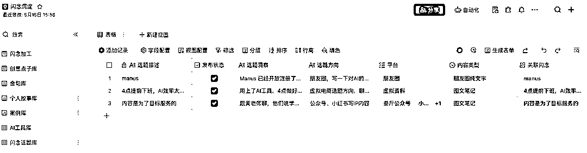

我也可以在「个人故事库」筛选过往的故事融入到文章中，或者在「金句库」挑选金句放到文章中。

## 3.2\. 对标选题

前面只是知识库、选题的其中一部分日常闪念和笔记记录，到真正输出的时候，只有这些信息还不够，还要最近的热点、对标账号的爆文等等。

之前分享过采集工具，我完善了采集、分析、选题生成的流程，这一步，我也收录进了知识库中。

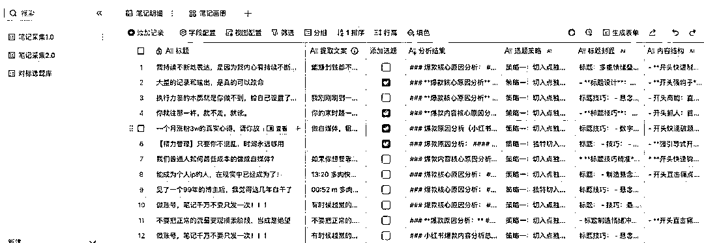

在看到爆文后，收藏到飞书多维表格，并接入DeepSeek进行爆文分析，分析选题策略、封面特点、内容结构等等，如果这个爆文的选题跟账号定位契合，我也会添加到「选题库」。

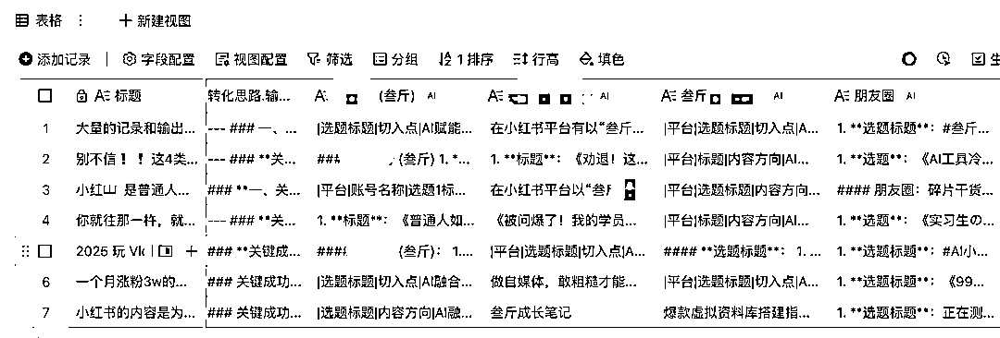

收集到选题库后，AI 会帮我分析，我的账号定位可以怎么利用这个爆款，并给出对应的选题建议和切入点。这样能大大提升我的输出效率。

这一步，就会用到我们第一步生成的账号定位了，如果帮你账号比较多，可以每个账号都生成一遍。

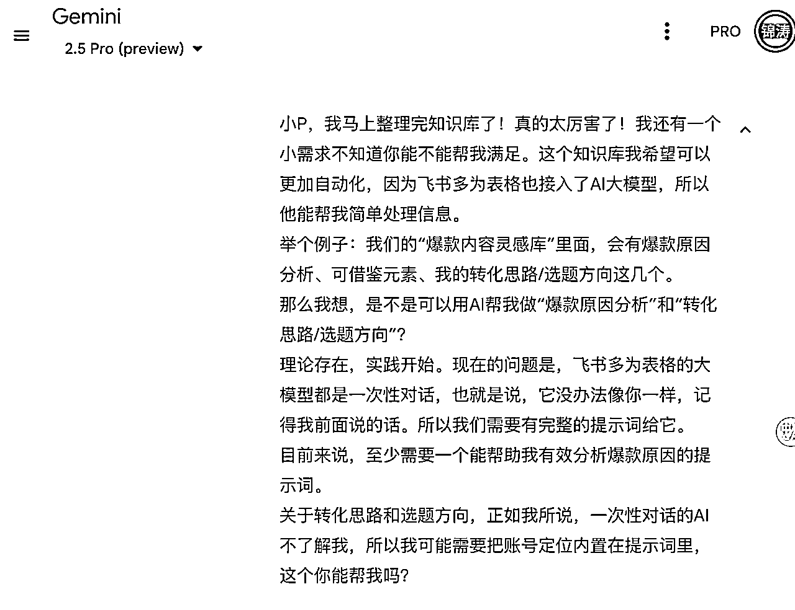

提示词我是用 AI 帮我生成的，你们可以参考，敏感信息已手动打码：

提示词复制：

```
作为一名资深的个人品牌战略与内容孵化顾问，尤其擅长AI赋能自媒体运营，你的任务是基于以下提供的“爆款内容原文（标题与文案）”以及“叁斤的个人品牌定位”，为叁斤策划针对性的内容转化思路和具体选题方向。
**一、 叁斤的个人品牌定位与账号信息：**
* **核心定位：** AI赋能型小红书变现实战导师
* **对外标签/Slogan：** 叁斤 | 小红书IP变现 × AI提效
* **核心业务方向：** AI赋能小红书IP变现
* **目标用户：** 渴望通过小红书打造个人IP并高效变现的个体创业者、自由职业者；想通过自媒体获得一份副业收入的职场人、大学生、宝妈。
* **目标用户核心痛点：** 不懂小红书运营方法、缺乏时间、没有合适的副业项目、不熟悉或不会有效利用AI工具、内容创作效率低、难以通过小红书变现。
* **叁斤提供的核心价值：**
    * 精准的IP定位与规划指导
    * AI驱动的内容创作与运营提效方案和实操方法
    * 多元化的小红书变现模式拆解与实战指导
    * 可复制的从0到1小红书起号与持续增长策略
* **叁斤的内容风格：** 专业、靠谱、实战派、不浮夸、平静、乐于分享、与观众建立朋友般的信任关系。
* **叁斤的主要内容支柱（参考）：** AI提效工具在小红书的具体应用、个人IP从0到1的真实案例拆解、自媒体相关的副业变现项目分析与指导、小红书平台规则与玩法解读。
* **叁斤的目标发布平台：**
    * 公众号 (名称: 叁斤)
    * 小红书 (名称: xxxx - 定位：偏个人IP成长与AI提效方法论)
    * 小红书 (名称: XXXX - 定位：偏具体产品种草、虚拟资料的亮点介绍、小红书运营实操干货)
    * 朋友圈
**二、 待转化的爆款内容信息：**
* **原爆款内容标题： 。**
* **原爆款内容文案： 。** 
* **原爆款视频文案： 。** 
**三、 你的任务与输出要求：**
**任务1：分析爆款内容的关键成功要素**
    * 请首先仔细阅读并分析提供的“原爆款内容标题”和“原爆款内容文案”。
    * 从中提炼出 **2-4个最核心、最值得借鉴的成功要素或策略**。例如：选题切入点、标题吸引力、痛点共鸣技巧、价值呈现方式、内容结构、文案节奏、互动引导方法、独特的AI应用视角（如果内容与AI相关）等。
    * 对每个提炼出的要素进行简要说明。
**任务2：基于分析结果和叁斤的定位，策划转化思路与选题方向**
1\.  **内容转化思路（总体策略）：**
    * 针对你在任务1中分析得出的“关键成功要素”，提出2-3条核心的转化策略。
    * 详细说明叁斤应如何学习和应用这些要素，并巧妙融入他“AI赋能小红书IP变现”的特色。
    * 思考如何将这些要素与叁斤的目标用户痛点相结合，提供独特的价值。
2\.  **具体选题方向（按平台）：**
    * 基于上述转化思路，为叁斤的以下每个平台分别提供2-3个具体的、可操作的选题建议：
        * **公众号 (叁斤)：** (选题方向应偏深度分析、体系化方法论、AI赋能工作流的完整介绍)
        * **小红书 (xxxx)：** (选题方向应偏个人IP成长技巧、AI提效小妙招、学习心得的快速分享，风格实用、易懂)
        * **小红书 (xxxx)：** (选题方向应偏具体AI工具在小红书运营中的应用教程、叁斤的虚拟资料的某个亮点的详细介绍、可落地的小红书运营实操干货)
        * **朋友圈：** (选题方向应偏简短精炼的干货小tip、即时思考、互动问答、课程或产品动态的巧妙预热)
    * 每个选题建议请尽可能包含：
        * **选题标题（或核心点）：**
        * **简要内容方向/切入点：**
        * **（重点）如何巧妙融入AI元素或叁斤的“AI赋能小红书IP变现”的独特视角：**
**请确保你的建议：**
* 高度契合叁斤的个人品牌定位、目标用户及各平台特性。
* 具有强实操性，方便叁斤直接采纳并进行内容创作。
* 能鲜明体现“AI赋能”的核心特色，并传递叁斤的专业价值。
* 针对不同平台的特性有所侧重，避免内容同质化。
输出时，请先简要列出你从原文中分析出的“关键成功要素”，然后给出“内容转化思路”，再按以下格式给出“具体选题方向”。
公众号 (叁斤)：输出公众号 (叁斤)的选题方向。
小红书 (xxxx)：输出小红书 (xxxx)的选题方向。
小红书 (xxxx)：输出 小红书 (xxxx)的选题方向
朋友圈：输出朋友圈的选题方向。
```

虽然有 2 个选题库，但我平时不会每个都打开，而是把两个选题库都放到「选题站」里，每天我只要打开「选题站」，就能看到闪念记录的选题和爆文选题。

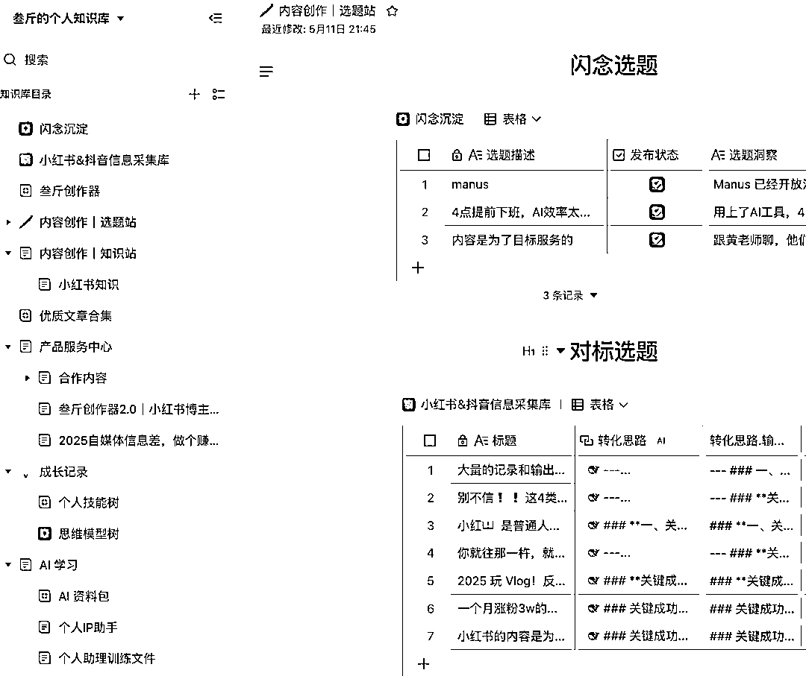

这样我的 输入 ➡️ 记录 ➡️ 输出 的系统就变得非常丝滑，这套体系对我来说，几乎没有多余的动作，帮助我 更轻松地做到“大量记录和输出” ，而且输出的 质量都还不错。

## 3.3\. 其他选题

前面两个是知识库的选题，除了这些，我还会使用别的选题方式。如果你做的是个人IP账号，那么在后续的选题方式里，都要把你的个人定位准备好。

### 1\. Dia浏览器：灰豚爆款笔记

这是我用过最牛逼的浏览器！结合灰豚数据，真的无敌！我的流程如下：

1.打开灰豚数据，筛选热门笔记榜、低粉爆文榜、涨粉博主榜

2.用Dia浏览器快速分析对标笔记的选题、标题、封面风格

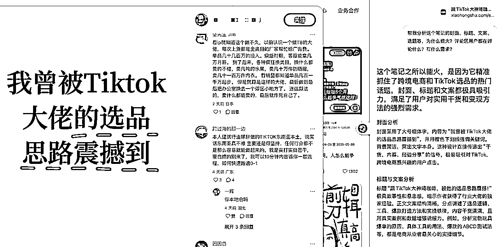

3.输入定位，并让他结合定位生成选题建议。

案例是我随机找的，Dia浏览器会分析爆款原因，总结爆款结构，并给出对应选题建议、文案结构等等。

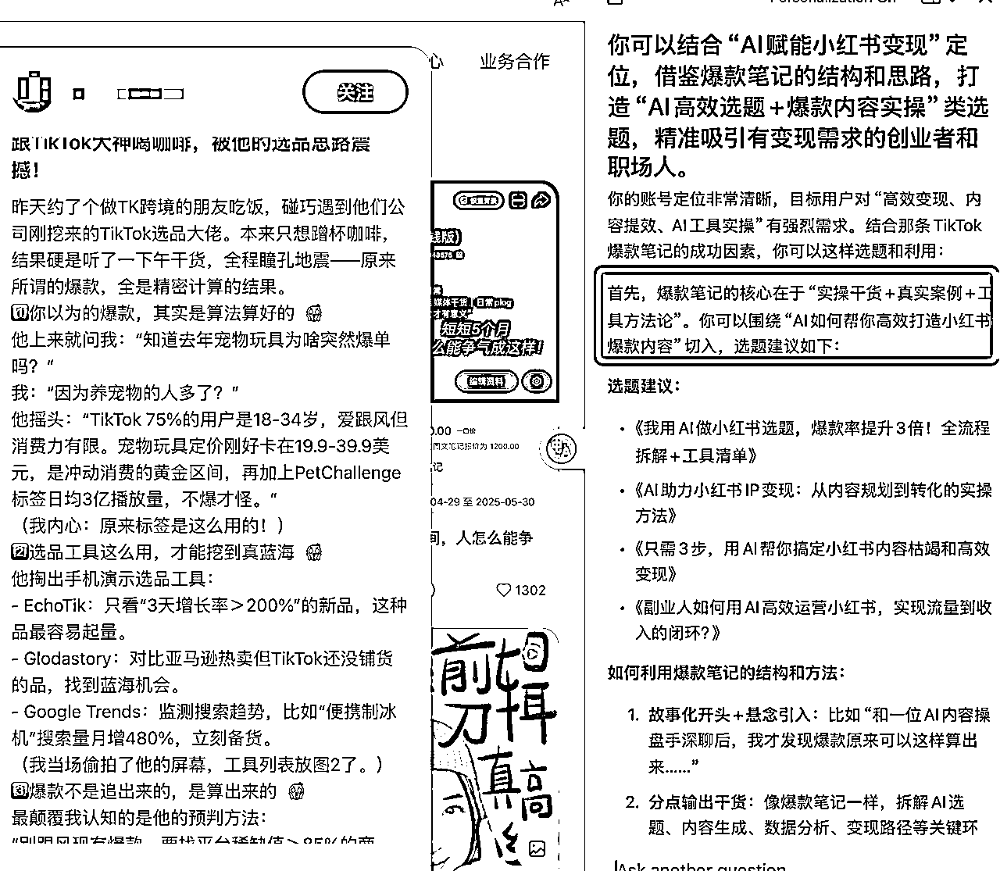

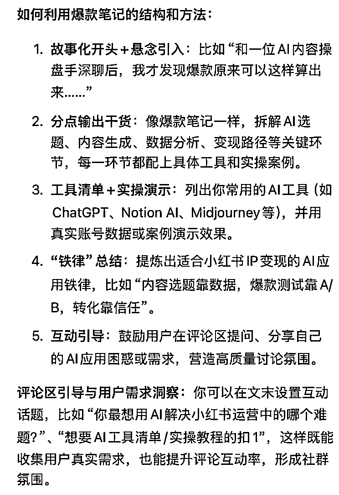

### 2\. DeepSeek：全网热点选题

这个会更简单，打开DeepSeek联网模式，把你的账号定位输入给他，让他搜集全网最热门的话题，把其中一个最合适的热点变成账号选题。

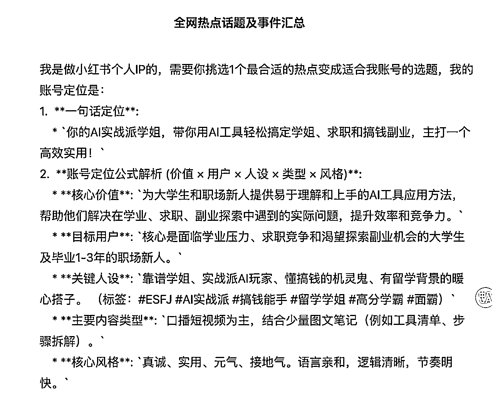

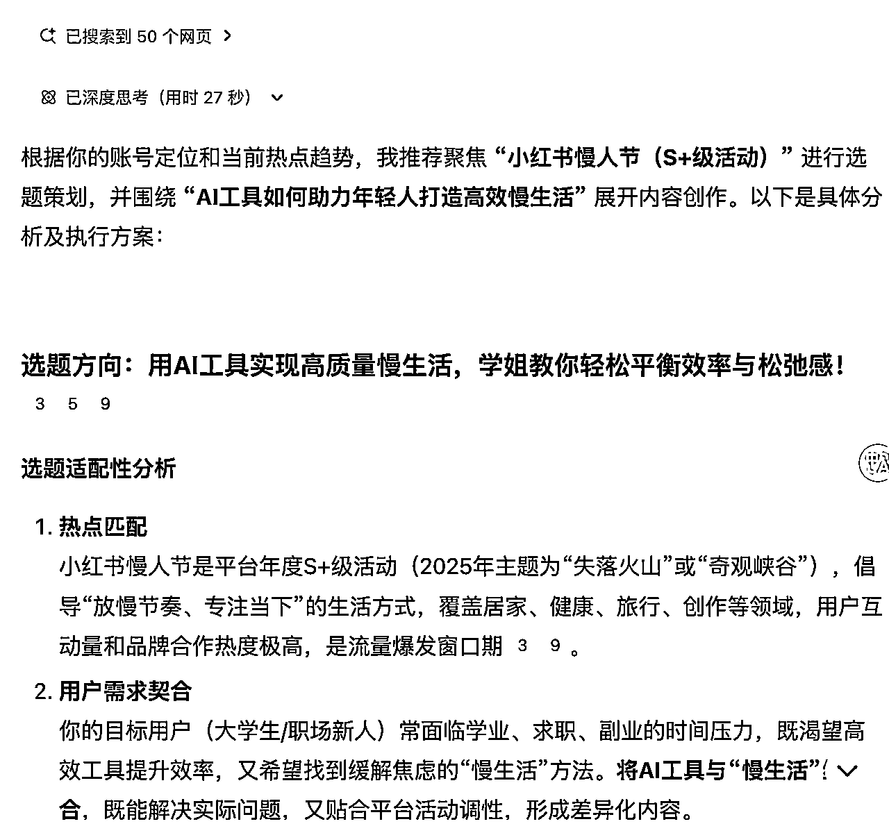

### 3\. 飞书多维表格创作器：

每次选题都要打开DeepSeek，太麻烦了，所以我把账号定位信息和选题提示词，都放到了飞书多维表格。

每次只要输入选题想法、或者再开一个字段加上全网热点，就能自动为我生成符合账号定位的选题方向。

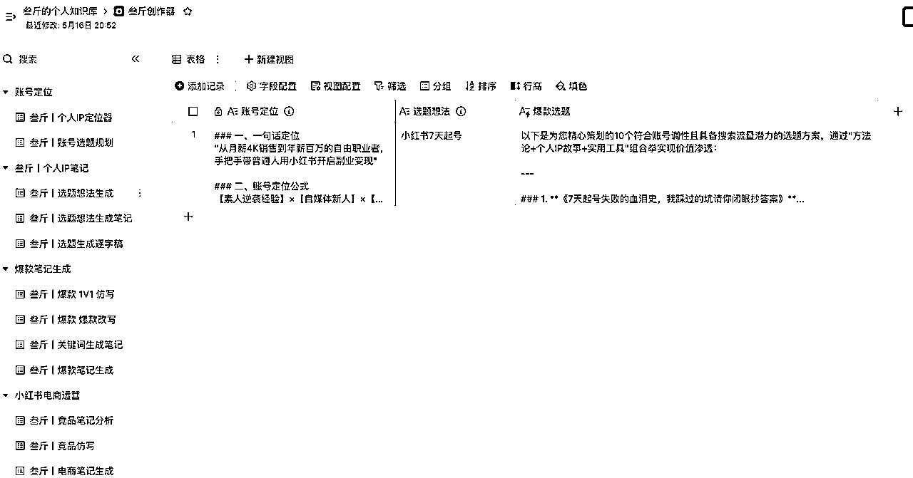

有以上这几个选题方式，几乎就有了源源不断，怎么都写不完的选题灵感。

之后，就要开始写文案了。

# 04\. AI 高效产出文案

生成文案有 2 个模式，一个非常高效，一个非常精准。

## 4.1\. Gemini 个人IP文案创作

个人IP文案尽量选择Gemini，它能记得你曾经说过的个人故事，也能持续学习你的文案风格。

流程可以大概分为投喂、输出和学习。

### 1\. 投喂：

先把你的个人详细介绍投喂给他，这个前面说过。再把你过往写过的优质文案、逐字稿投喂过去，10篇以上，我通常会投喂30篇左右。

如果自己没有写过文案的话，可以找对标的，你觉得他风格不错，就把文案扒下来喂进去。

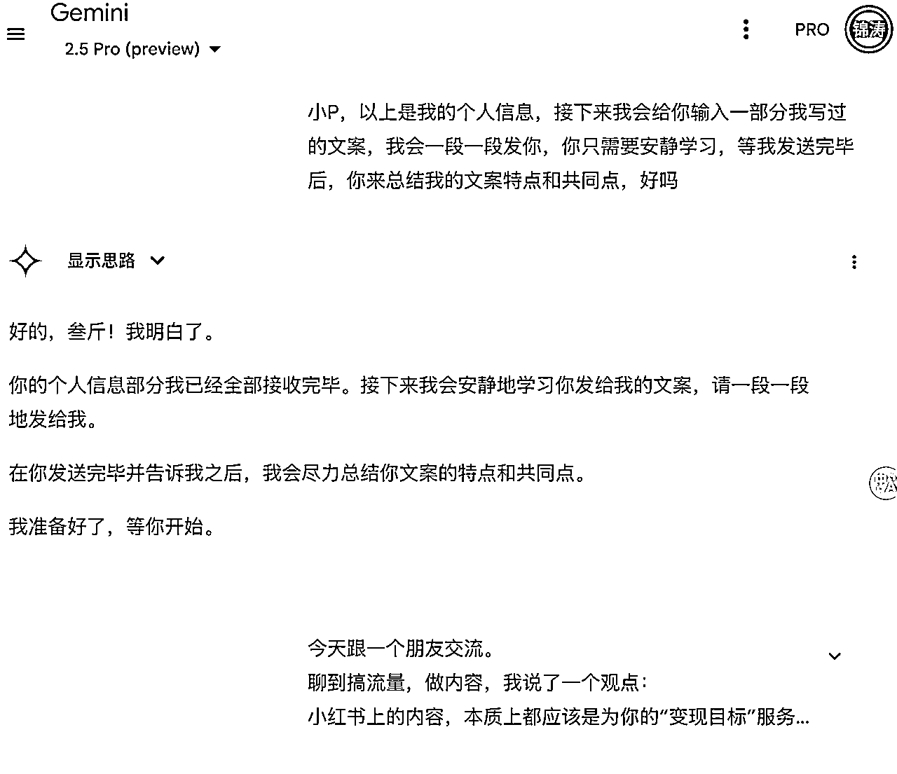

重点是，一定要专一，大量投喂同一种风格，不要东一个西一个的。

### 2\. 输出：

先让AI学习你的风格，并给它对应的选题，让它根据你的风格输出文案

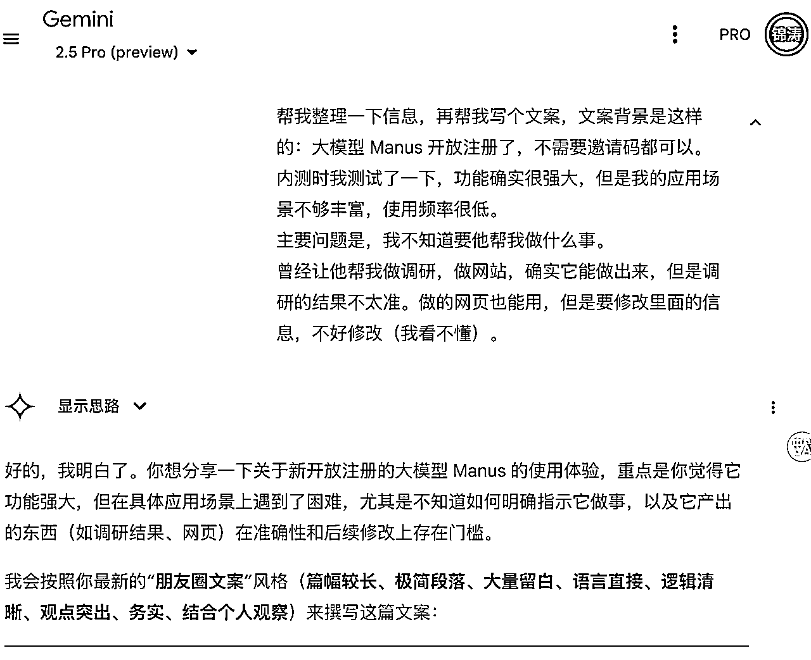

### 3\. 学习：

刚开始，AI写的文案还不够适合你，需要自行修改。这时，务必亲自开口读出来！不要只用眼睛看，读出来跟眼睛看是完全不一样的感觉。

你要找到自己的风格，就一定要读出来！发现语句有问题就修改，再把修改后的版本投喂回去，AI会通过这种方式持续学习和优化。

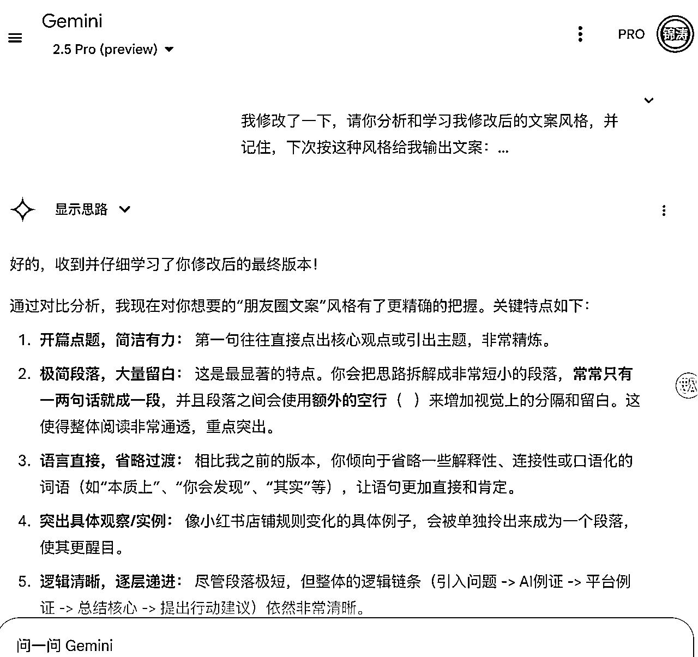

## 4.2\. 飞书多维表格高效生成文案

前面给大家看过了我做的 飞书多维表格的AI创作器，除了账号定位、选题外，还有文案生成。

可以分析竞品笔记，并根据自己的账号定位，期望突出的主题和要点进行定向改写。

比如我测试的这个，强行把「香薰」的爆款笔记结构、户外办公的关键词和我的账号定位进行结合，生成一个全新的选题。

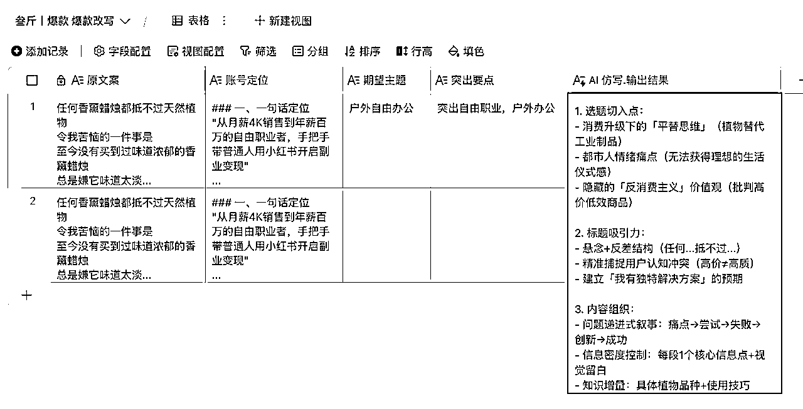

当然，最高效的，是只要输入关键词，就能自动生成笔记，这个可以批量导入关键词，批量生成文案。

关于DeepSeek接入多维表格的教程已经很多了，我就不多啰嗦，大家可以自行搜一下。

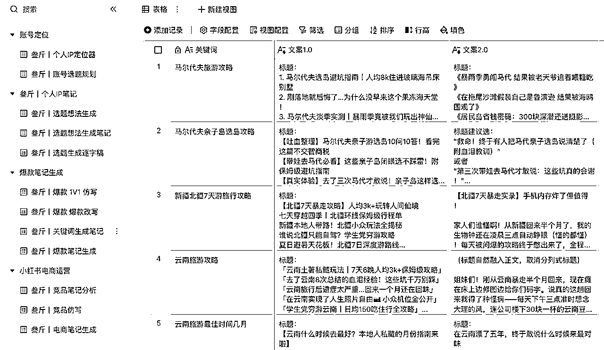

# 最后

我的工作流中，AI 提效就是这些，没有用上 AI 生图，原因是我觉得调试过程太麻烦，而且调试好之后也不能一劳永逸，之后生成还需要重新调试，费时间。

而文案生成部分，只要 AI 学习完，可以一劳永逸，后面生成的文案，都是自己的风格。

最最后，我觉得「闪念复盘知识库」真的非常牛！这篇分享也有几千字，从选题构思到排版完成，花了不到2小时。大量用上了知识库的内容！

AI 工具只是辅助，核心还是我们对内容和用户的理解。

并结合自身需求选对工具，才能最大化发挥 AI 的价值。希望今天的内容对你有用，如果你有更好的工具或方法，欢迎一起交流。