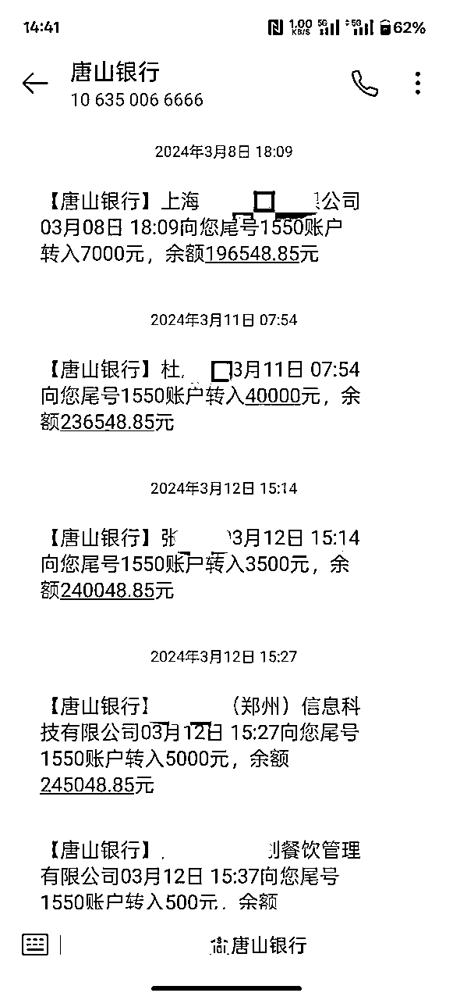

# 《100万学费买的教训：创业不做这4件事，永远困在小作坊》

> 来源：[https://ogsvnukdtf.feishu.cn/docx/XEqYdvZXMoG8QmxOHepcNxmVnng](https://ogsvnukdtf.feishu.cn/docx/XEqYdvZXMoG8QmxOHepcNxmVnng)

大家好，我是江天，生财4年会员，当前是一家小规模企业服务公司老板。

回想自己做企业信用项目+开公司这接近两年的时间，太多方面没做或者没做到位，导致自己的年收益困在了100w以内，现在想想十分遗憾。

"为什么同样的时间和精力，有人能年赚500万而我只有100万？"

将自己的遗憾写下来，给自己之后的事业以思考，也给各位圈友分享共勉。

### 一、错失的投流“放大杠杆”​

项目的初始流量来自于淘宝和抖音。因为自己之前是做淘宝出身，会通过补单搞一些免费的流量，当时每天就能加10-20个微信，自己说实在的有点接待不过来客户了，所以就一直补单，并没有开直通车。现在想想是如此悔恨~ o(*￣▽￣*)ブ，为什么悔恨？

1.现在开着直通车，成本比补单大好几倍，一天也才2、3个微信

2.2025年成交的客户，也有很多都是2024年加的，私域太重要了，尤其是企业服务赛道。这些老板或者拥有老板资源的私域，会一直为我推单子，以后有新业务，也会开展的非常顺利。

23年的客户，根本没有过小单子，都是新客户

最近的客户，大部分都是老客户介绍，客单价也明显下降

再说抖音，作为一直玩免费流量的人，肯定是一毛钱也不会往抖音投！当时跟着抖音seo航海，发了很多抖音图文，也拍了一些视频，获得了一些客户，每天也有微信加。所以也是没投流，错过了这个最大的流量池。

最开始企业信用修复赛道，抖音投流，一个客户的费用70左右，其实绝对能回本，碰上大客户，那就赚大了。但是自己一毛钱也没投。现在听说一个获客成本得150左右了，而且信用修复的价格也降低了很多，更不敢投流去放大了。

回头来看，付费投流是放大项目最省心的方式，没有之一。以后再遇到蓝海项目，必须先拿出几万资金，随时准备放大！

### 二、人力杠杆：从个人到团队

当时单子做不过来了，顺理成章招聘了两个文员一起做单子。这点并不是做的很好地方，因为任何一个人工作做不过来，肯定都会往这个方向发展。

但是做的不好在于自己没有招聘销售！

自己也去过3家企业服务公司学习过，有两家做的比较上规模，公司修复师和我公司数量一样3-4个，但是销售数量都是十几个，而且那段时间都是正收益，能给企业产值。

有好的产品一定要及时想各种方式放大，何况这个回本周期还很快。现在想想确实自己太年轻，悔不当初。

从23年底到25年5月份，团队一直是我们几个人

### 三、短视频红利的半途而废

做任何事情，任何企业肯定都要有抖音号这没得说。在23年的蓝海红利期，注册了抖音号，弄了蓝v，当时只是在小红书随便找了同行的图片，去水印发到抖音上，就引来了五分之一的营业收入。后来自己也做短视频IP，但是因为其他方面的客资很多，抖音又经常违规而且见效慢，导致自己并没有沉下心去做一个有个人IP属性的短视频。

当时只是随便搬运一些图片，就会有seo流量

时间来到现在，同行做的头部IP，粉丝7000人左右，每天发一些老板工作的视频，不直接发业务，也会每天都有客资。并且她这种账号，以后做任何企业服务方面的业务，都可以快速无成本的拓客，真香！

当然，我觉得任何时候开始做个人IP都不晚，前提是选对了行业。我认为企业服务这个行业，解决的是老板的刚需，而且服务类的，可以说基本是0成本，并且后端完全可以外包、嫁接，自己只要做好前端的个人IP，一个靠谱的企业服务专家就行。一单和企业产生了第一次成交，后续只要价格不是高的过于离谱，客户总会选靠谱的，成交过的值得信任的人去合作。

所以，个人IP的事情我会继续做下去，以后一定要形成简单可行有效的SOP，减少阻力，长期主义。

### 四、被丢掉的稳定现金流

之前自己是做淘宝虚拟资料出身，连续两年每年都赚了30W+。为什么会被放弃？

1.23年企业信用修复非常蓝，当时每个月赚的比淘宝虚拟资料多的多

2.淘宝虚拟资料会不定期被售假，售假了就要重新起店，还是有点繁琐

3.由于以上事情，导致自己精力不够，

最终淘宝虚拟资料这个稳定的现金收入就被放弃了。

23年到24年信用修复简直跟捡钱一样，这只是走了公账的费用

等到今年企业信用客单价下降，人力开销缓缓增大的时候，逐渐觉得有一点压力，还是有稳定的现金流香！再加上今年看到生财中亦仁回复的一个帖子，讲千万不要轻易放弃已经跑通赚钱的项目，非常有感触，于是重新讲我的“现金流”操持了起来。

亦仁的给圈友的回复

重新操持起来的淘宝虚拟资料，都是真实成交，纯利润

### 关键思考与未来行动

1.  格局思维：做事业一定要越来越往大了做

回头看这两年，最大的感悟就是：做事业一定要有“做大”的格局。刚开始的时候，总想着稳一点、慢一点，结果就是错过了很多放大的机会。其实，市场和机会永远是留给敢于投入、敢于放大的人的。以后无论做什么项目，都要时刻提醒自己，不能小打小闹，要敢于投入、敢于放大，才能突破收入的天花板。

1.  稳定现金流是底气

这两年让我明白，稳定的现金流业务就是创业路上的“压舱石”。无论是企业信用修复，还是后续拓展的企业服务，只要能持续带来现金流，就能给自己更多试错和创新的空间。以后做项目，哪怕再想追风口、搞创新，也一定要保留一个稳定现金流的业务线，这样才能有底气去做更大的尝试。

1.  做事情要留痕，形成SOP

以前做事太凭感觉，很多流程和经验都没有沉淀下来，导致团队协作效率低、自己也容易陷入重复劳动。现在越来越意识到，做任何事情都要“留痕”，把每一步流程、每个细节都记录下来，形成标准化的SOP。这样不但能让团队成员快速上手，也能让业务更容易复制和放大。未来无论是短视频运营、客户转化，还是销售管理，我都会坚持把流程标准化，减少阻力，提升效率。

### 未来的行动计划

*   投流放大：以后遇到蓝海项目，第一时间拿出预算，敢于投流，快速验证和放大。

*   团队扩张：不再犹豫，及时招聘销售和运营，充分利用人力杠杆。

*   深耕个人IP：持续输出内容，打造个人品牌，形成可复制的短视频SOP。

*   现金流业务保底：无论做什么新项目，始终保留一个稳定现金流的业务线。

*   流程标准化：所有业务流程都要沉淀为SOP，方便团队协作和业务扩张。

* * *

创业路上，遗憾和错过在所难免，但只要能及时复盘、总结经验，未来就一定能走得更远。

希望我的这些反思和教训，能给自己和大家一些启发。共勉！