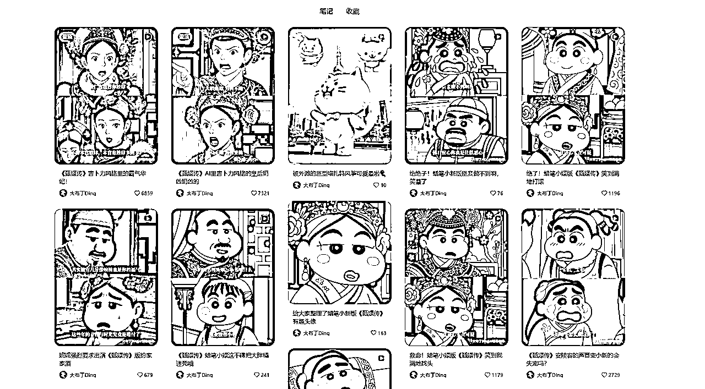
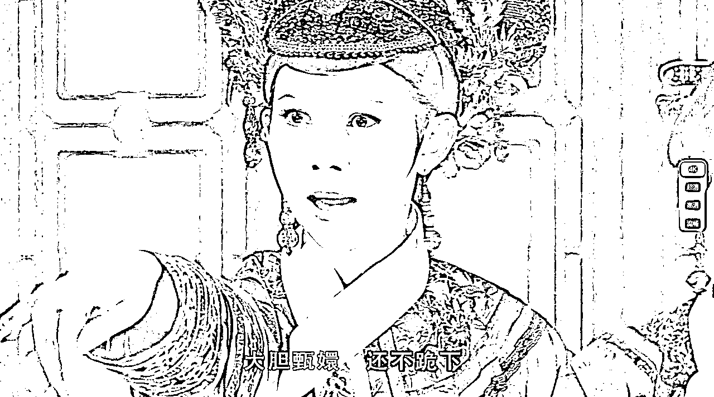
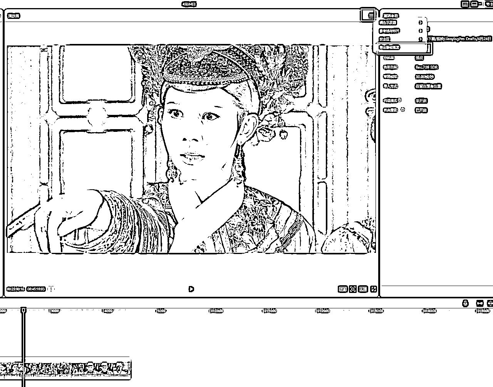
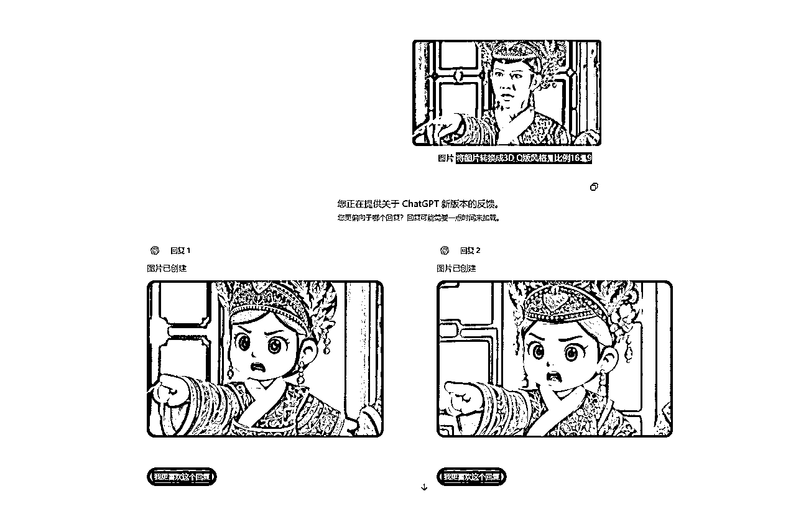
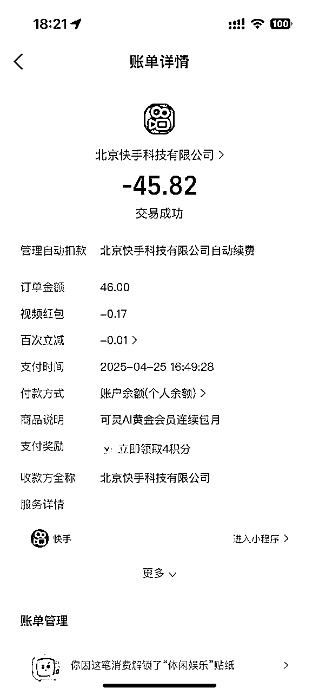
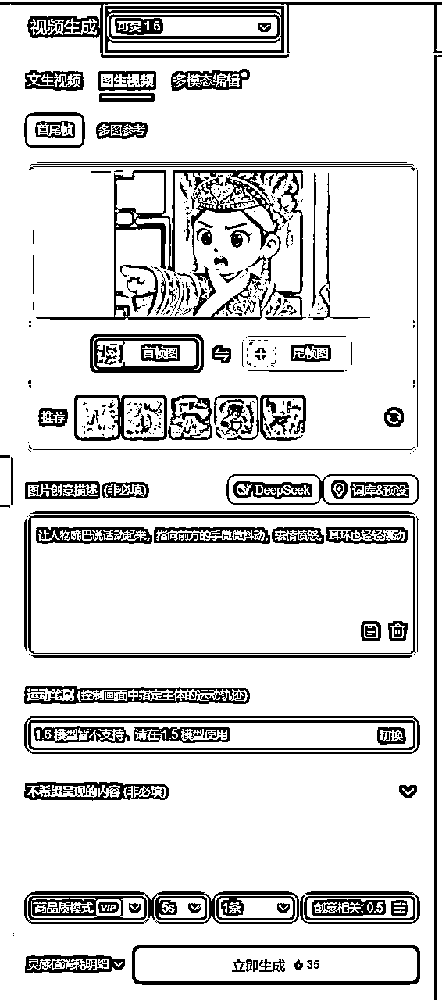
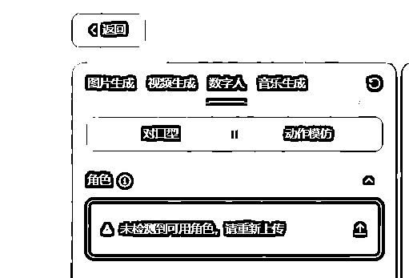
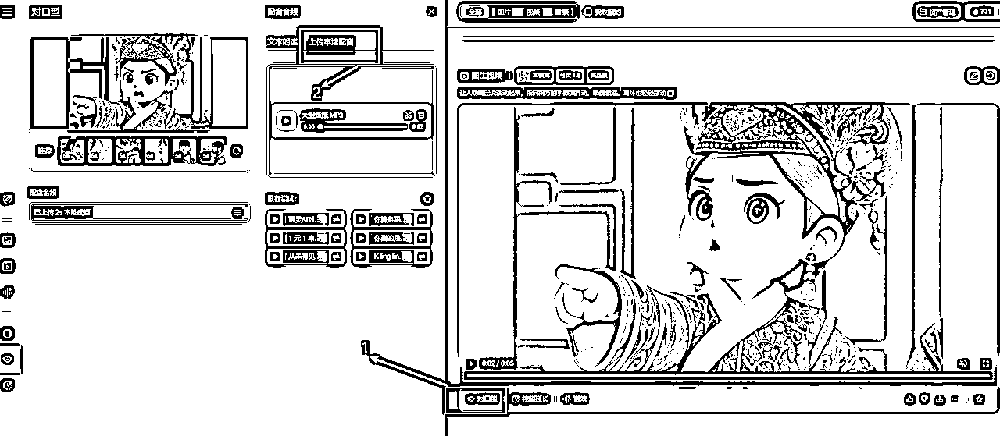

# 保姆级教程 | 利用AI制作3D动画版甄嬛传文字教程

> 来源：[https://nyol5qf3ak.feishu.cn/docx/QOoxd6vQpoSylbxlXjkccNDTnHg](https://nyol5qf3ak.feishu.cn/docx/QOoxd6vQpoSylbxlXjkccNDTnHg)

最近不管是刷小红书还是抖音，发现魔改版甄嬛传火了，有3D动画版，有吉卜力版，还有蜡笔小新版。例如这个博主发的作品

可以看到不管是点赞量还是评论，数据都非常好，变现方式目前我能想到的就是收徒卖课程，或者参与分成计划。

这种视频在咱们社群里面也是AI风向标之一。既然是风向标，我们就有理由去试试水，所以蛋蛋星期六下午就制作了一下3D动画版，在这里分享一下我剪辑过程中的经验，希望对正在做这方面的视频的小伙伴有所帮助。

整个制作流程也很简单，分为剪辑素材-制作Q版人物照片—让照片动起来——人物对口型——再次剪辑拼接。

## 1️⃣剪辑素材

甄嬛传素材大家都能找到吧，不管你是从网站下载还是利用网盘，只要清晰度OK就可以。我这里是保存了甄嬛传4K版的夸克网盘资源，然后进行下载。

我们尽量选取甄嬛传的名场面，单一镜头人物不多的，这样制作起来也稍微简单一点。这里我选取的场景是《甄嬛传》第63集滴血认亲。

这里我们可以将素材导入剪映，然后剪辑你需要重制的片段镜头（这个镜头最好没有字幕，方便后面生成Q版图片），然后选择导出静帧画面。

同时将素材音频分离，单独保存，方便后面人物对口型使用。

## 2️⃣ 创建Q版图片

来到ChatGPT网站，利用4o的生图能力将画面转换成Q版照片，注意限制一下图片比例。

提示词：将图片转换成3D Q版风格，比例16：9

ChatGPT官网：（国内无法访问）

https://chatgpt.com/

当然如果你不能访问ChatGPT官网，也可以使用一些AI镜像网站，也是一样的效果，我这里就是利用这个镜像网站制作的。

AI镜像网站：（国内可以访问，QQ邮箱注册即可）

https://chendandan.ai1.bar/

## 3️⃣图片转视频

接下来我们需要让Q版人物动起来，我用了两个不同的场景和风格，试了好几个AI工具，最后总结了一下，还是充钱后的可灵AI效果好一点，视频画面更加稳定生动。

记住，你必须氪金成为会员，不然的话生成速度太慢。

先给大家看看相同的图片在相同的提示词下，不同的AI工具制作出来的效果。

1 可灵AI

2 即梦AI

3 海螺AI

上述或许看的还不够明显，但是你多试几次不同的画面，就会发现还是可灵AI好一点，其次是海螺AI，当然即梦AI胜在免费。

（在网页版即梦AI生成视频以后，利用idm下载工具下载视频，就可以无水印了）

（听说即梦AI3.0视频模型也在内测了，比较期待）

可灵AI：

https://app.klingai.com/cn/

即梦AI：

https://jimeng.jianying.com/

海螺AI:

https://hailuoai.com/

这里蛋蛋氪金了45元，充值了可灵AI月会员。

我们选择视频生成，上传Q版图片，然后加上描述词即可，模型可以选择1.6，2.0大师版模型太贵了，用不起。

然后耐心等待几分钟，5秒的视频即可生成完毕。如果你不氪金，可能需要等好几个小时。

## 4️⃣对口型

要想视频更加真实，我们还需要让人物对口型，这里我们依然用上可灵AI的对口型工具。

即梦AI也有对口型，但是我上传好几次视频，总是提示我【未检测到可用角色，请重新上传】，不知道是不是因为Q版卡通人物不合适。

我们在可灵AI生成好的视频坐下角选择【对口型】，然后选择【上传本地配音】，上传第一步我们分离出来的音频即可。

对口型比较耗费时间，需要5-7分钟。

可灵AI充值成为黄金会员以后，会送660灵感值，而生成一条5秒的视频就需要35灵感值，对口型又需要5灵感值，所以在可灵AI里面，生成Q版甄嬛传一个简单的镜头，就需要40灵感值，真的很耗钱。

### 5️⃣重新剪辑

按照上述步骤，我们可以生成不同的场景镜头，然后将这些镜头视频导入剪映重新拼接剪辑，添加字幕等，最后导出即可。至此，动画版甄嬛传就算完成了。

蛋蛋也只是制作了一小段，大家可以看看效果

这个视频制作起来其实并不复杂，但是我们容易停留在看看就代表会了的阶段，缺少执行力，我想说的是，行动起来就是成功的一半了，你我共勉。

后续我又制作了一个长一点的视频，风格是冰雪奇缘型