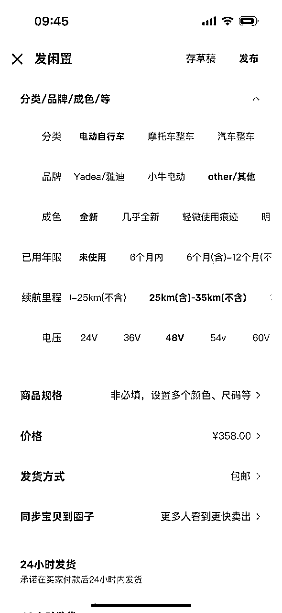

# 闲鱼电动车项目完整攻略：实操变现指南（月入5k+，附详细操作流程）

> 来源：[https://zf7r28t8wa.feishu.cn/docx/YKLYdKRMUoHLmLxUhFdctbOZnAA](https://zf7r28t8wa.feishu.cn/docx/YKLYdKRMUoHLmLxUhFdctbOZnAA)

"杨老师，我不想听你讲什么知识扩大啥的，我就想按照步骤走，你告诉我123，我完成123，然后收款赚钱。"

这是上周一位圈友在看完我上篇文章后对我说的话。

看到这条留言时，我放下手机，静静思考了好一会儿。

太多朋友被各种"大道理"和"高深概念"绕晕了，听了一堆课，看了一堆文章，结果啥也没落地。说实话，我理解这种焦虑，因为三年前的我就是这样 - 知识越来越多，钱包却没变化。

所以今天，我不讲理论，只讲实操。手把手教你怎么在闲鱼上卖电动车，月入5000+。

这是我过去3年，经过100多个账号实战、数千单交易沉淀下来的方法。没有任何花哨的东西，全是我亲自踩过的坑和验证过的经验。

## 为什么我放弃了爆单的小百货，转做电动车？

很多老圈友知道，我最开始在闲鱼做的是小百货和图书。那时候订单多到爆炸，记得最忙那阵子我和合伙人轮流填单号，经常忙到凌晨两三点。

累是真累，钱也是真赚，但问题太多了：

*   每天填写单号到头疼，凌晨不睡觉

*   售后问题层出不穷，管理售后难上加难（当时没有软件也没有退款栏）

*   财务进货的资金总是不对数

*   闲鱼当时对小百货管控越来越严

最要命的是，那阵子我们好几个账号被同行眼红举报，收入从万元跌到几千，关键是看不到希望在哪里...

痛定思痛，转型成了必然选择。

当时我已经积累了接近100个账号，放弃闲鱼太可惜。经过一周的头脑风暴和市场调研，我们决定：继续用好闲鱼这个平台，只是换个赛道。

这个决定背后，是我对闲鱼平台本质的理解：

闲鱼的灵魂是二手交易，它再怎么变，也不会扔掉二手交易。

在二手电商领域，闲鱼就是老大，其他平台连小弟都算不上。

## 我是怎么锁定电动车这个品类的？

找新品类时，我列了几个必须满足的条件：

1.  二手属性强：得符合闲鱼的基因

1.  需求量大：没有流量等于零

1.  客单价高：一单赚个百八十的，值得花时间

1.  不便携带：就是搬家的时候不容易弄走，只能卖掉。

1.  有损耗性：就是市场一直需要

1.  用户群匹配：得适合闲鱼的主力用户（大学生、年轻上班族）

筛了半天，最后就剩几个选项：山地车、电动车、洗衣机、小冰柜和空调。

最终锁定电动车，是因为我发现了三个独特优势：

*   使用频率高、使用场景广（学生上课、白领通勤、送外卖）

*   损耗明显，二手转卖有充分理由，想买的想卖的都在里面

*   客单价在600-800元，既不至于让人犹豫太久，又有足够利润空间

## 实战数据展示：这是我真实的成绩单

讲再多不如看数据。下面是我团队一个普通账号的表现：

每天99+的咨询量，客单价600-900元，利润100-200元/单。

没有任何奇迹，就是踏踏实实的数字。有人会问：咨询这么多，转化率怎么这么低？

这就是电动车品类的特点 - 咨询多，但真正下单需要时间。数据表明，平均50个咨询才能成交1单，这是行业常态，别被吓到。

关键是咨询量大，只要你及时回复，总能转化一部分。一个账号一天出1-2单已经很不错了，三个账号运营起来，月入5000+一点都不夸张。

## 第一步：注册账号（1人最多3个）——打造你的闲鱼军团

闲鱼不同于其他平台，它有自己的"潜规则"。掌握这些，能让你少走很多弯路。

### 账号规划与注册技巧

首先记住：一机一卡一号。具体说：

*   一个人最多同时运营3个支付宝账户（对应3个闲鱼账号）

*   每个账号需要独立手机号绑定

*   理想情况是每个账号配一台手机，但预算有限可以用分身软件

闲鱼现在可以绑定微信登录，而且有了闲鱼小程序，也支持微信付款，这对我们是个福音，操作更方便了。

实操建议与避坑指南：

1.  优先用新号：我测试过，新号流量扶持明显高于老号

1.  别用有违规记录的账号：系统有"记忆"，这些号建议注销重新开出来

1.  分批注册：一次性注册多个容易触发风控

1.  保持登录IP稳定：频繁换IP会被系统盯上

去年我有个学员不听劝，用了一个违规过的老号，结果辛辛苦苦养了一周，流量还是没起色，还不如直接注销重来，白忙活一场。

## 第二步：养号与市场调研——打造高权重账号

很多朋友一上来就猛发产品，然后抱怨没流量。我想说：养号不是可选项，是必修课！

### 养号技巧与实战指南

根据账号状态，养号方式有区别：

1\. 全新注册的账号：

*   完善个人资料：传真实头像（用成年女性照片，增加信任感）

*   昵称里加行业关键词，比如"XX电动车行"

*   前3天每天登录至少30分钟，浏览相关品类商品（不用同一时间，分散开就行）

*   收藏5-10件同行商品，关注3-5个同行店铺

*   适当点赞、评论，但别太频繁，现在可以私信一些同行了解产品

2\. 长期闲置的老号：

*   修改密码重新登录（告诉系统"我回来了"）

*   清理历史消息和无效收藏

*   按照新号方式重新活跃操作

记得去年我重启了一个闲置了8个月的号，就是用这个方法，两周后这个号居然比新号还活跃，月入过万。所以老号也不是没救，关键看方法。

### 高效市场调研方法

养号同时，一定要调研市场。我的独门秘籍是：先以"顾客"身份咨询同行。这样做的好处太多了：

1.  了解行业标准报价和销售话术

1.  收集优质快捷回复，为己所用

1.  分析竞争对手回复速度和专业度

1.  发现产品卖点和顾客关注点

特别提醒：记录下回复速度快、专业度高的同行，他们就是你的标杆。

这个方法我用了3年，屡试不爽。记得有一次我假装客户，连续咨询了15家电动车店，结果发现一个规律：回复时间超过15分钟的店铺，基本很难成交。这个发现后来成了我团队的铁律：必须1-3分钟内回复响应客户。

### 如何快速找到优质同行？

我一般用这几个标准筛选：

*   寻找文案详细、图片清晰的店铺

*   查找昵称带"XX车行"、"电动车"等关键词的账号

*   关注发布多个同类宝贝（10个以上）的商家

*   看评价数量和内容，真实评价能反映真实水平

建议至少研究20-40家不同规模的同行，全面了解行情。

还有个点，就是你先点击进一个产品，你往下刷，会推荐出来很多相同的优秀的同行链接。

## 第三步：坚持上品破万法——打造你的电动车帝国

这是整个项目的核心，我把它称为"上品破万法"——通过持续上架高质量商品，最终实现月入过万的目标。

### 文案准备：让你的产品脱颖而出

电动车这个领域，专业、详细的文案能大大提高成交率。但不需要你从零开始写。

高效文案获取法：

1.  同行借鉴法：直接查看市场上表现最好的产品文案，拿来主义

1.  AI辅助法：把优质文案复制粘贴用AI编辑重组，避免完全复制

1.  套用改写法：使用成熟模板，替换里面部分文案

记住一点：电动车不需要花哨文案。我一直告诉我的学员：一个账号坚持上架30-50个产品，总有几个会爆的。

### 图片获取：视觉决定第一印象

好的产品图能极大提升点击率。图片获取有几个渠道：

*   拼多多商家评价图：用Fatkun插件批量下载（找不到可以找我发给你）

*   淘宝评价图：找和你产品基本一致的下载，用Fatkun插件批量下载

*   闲鱼同行图片：通过网页端，或者手机端分享到qq然后保存无水印，或者用群控软件直接抄下来

图片选择原则：

1.  整车清晰照：能看清车身细节

1.  高清无水印：低质量图片影响信任感

1.  无明显马赛克：避免处理过的图片

1.  背景简洁：车子占据主体部分

1.  多角度展示：正面、侧面、细节特写等

每个产品准备200张以上不同角度的图片，以便后续直接使用，第一张放最能展示整车外观的照片。

说个我自己的经验：同样的商品，我测试过只发3-4张图片和发满9张图片的效果差距，结果点击率和咨询量整整差了20%！所以尽量多放图！多放清楚的图！

### 产品发布攻略：细节决定成败

图文准备好了，发布时还有很多细节需要注意。

价格与库存设置策略：

*   标价区间：300-600元之间（经过大量测试的最佳心理价位）但是我们要卖700+哈，这里低价引流

*   太低不行：低于300元转化程度加大

*   太高不行：超600元又失去对比同行的优势

*   原价设置：1000-1500元区间，显得让利出来了，系统会推流量

*   库存数量：有于小铺后可以设置，100个就完事

品牌选择与描述技巧：

*   避免用知名品牌名（如爱玛、雅迪等），后续可能会引发纠纷

*   品牌选用： 直接在更多里面输入其他

属性与参数填写：

发布时间与频率：

*   最佳发布时间：工作日10:00-11:30和14:00-16:00 针对发布困难的圈友，不用看时间，有时间就发，发布时间玄学

*   避开时间：深夜和凌晨

*   单日发布频率：每账号3-5个产品，前期可以少，后面稳定5个就行

### 起号技巧：从0到1的关键48小时

新账号最关键的是度过初始的"冷启动"阶段。我的快速起号法：

1\. 朋友助力法：

*   上品后立即分享链接给1-2位朋友

*   请他们依次点击、浏览、咨询、收藏

*   引导1位完成下单流程（发货点无需寄件）

*   3-4天让朋友完成好评，完成评价

2\. 标题优化法：

*   标题加热门关键词如"上班代步"、"大学生电动车"等，发布后不要进行修改，这个是首次发布用的

*   尝试不同价格区间（同款产品设置300-600价格）

*   记录效果最好的标题组合，重点使用

3\. 限时优惠法：

*   发布后第3天小幅降价（10-30元），后面每天也可以操作降价

*   系统会推送给收藏过的用户

每日任务清单（必须坚持）：

*   坚持每天上架3-5个新产品

*   后续每天看后台数据，淘汰流量差的链接，发布很长时间但是我想要低的

*   有咨询的产品重点维护

*   确保咨询10分钟内及时回复

只要坚持一周，上架30+链接，账号流量会趋于稳定。我团队的经验是：新账号通常在3-5天内能获得第一单自然成交。

### 后端维护核心：回复是命脉，速度决定一切

电动车项目最大特点：咨询量大但转化率低。回复速度和质量，是绝对关键。

回复速度决定成交率，做不到及时回复，就别碰电动车类目。

如果你能在5分钟内回复，比1小时后回复的成交可能性高5倍！

高效回复策略：

1.  设置标准快捷短语，覆盖90%常见问题

1.  设置首次回复短语，来了直接告诉他标价是电池价格，全新电车带电池包邮到家只要xxx元，然后质保一年，不满意包退包换。

1.  主动引导提问：亲亲看中哪款车子了，打算用多大的电池

1.  制作价格表，节省报价时间。

1.  设置自动回复，无法及时回复时至少让客户知道你会处理

提高转化的核心话术：

*   "亲，厂家现在正在打包发货呢，确定要的话建议尽快下单，这边安排发货哦"

*   "我们是工厂直营，没有经销商环节，比实体店优惠300-500元"

*   "这个价格是活动特价，明天可能恢复原价，今天下单可以锁定"

*   "亲，还打算要吗，如果能下单的话，这边给老板申请下，可以在优惠30元"

*   "亲今天下单可以送您头盔，价值20多呢"

记住：50个咨询≈1单成交，是正常水平。别因转化率低气馁，行业就这样，坚持下去单子会来。

有次我带一个新人，他抱怨连续三天咨询破百却没出单。我让他检查回复时间，发现他平均回复时间超过40分钟，调整后第二天就成交了。细节决定成败

### 后端维护核心

回复速度决定成交率，我再强调一次。

*   及时回复每条咨询

*   主动催促顾客付款

*   如咨询多但无成交，可找朋友补单

*   记住转化标准：50个咨询≈1单算正常

### 矩阵运营方案

*   兼职做的话，单号约2-3天出1单

*   小米等安装可双开登录

*   大规模操作可用群控软件（控制5-100个账号）

*   群控软件的主要作用是采集同行的链接，直接发布到自己的闲鱼上

*   消息回复选择：

1.  手机直接回复

1.  电脑投屏软件控制

1.  闲鱼管家服务（可远程回复）

### 进货渠道与注意事项

*   初期：拼多多拿货

*   单量增加后：找商家线下谈合作（量大稳定后可以找我供货）

拼多多拿货注意事项：

1.  电话填自己的（平台会电话告知上牌事宜）

1.  地址不要太详细（派送时告知快递员客户真实电话）

1.  预留足够发货时间（通常2天出单号，3-4天发出）

### 售后处理

*   顾客咨询直接转问上游商家，再回复客户

*   电动车退货难度大（尤其电池问题），尽量协商不退

*   电动车会磕碰之类的，让商家补发配件就可以了

*   电动车续航不够，尽量虚报不要太多，避免售后

有个学员去年遇到一起纠纷，客户说车子有异响。我让他直接联系厂家售后，拍视频给厂家看，厂家确认是正常现象，提供了解决方案，最终客户理解并给了好评。专业的态度能解决很多问题。

## 第四步：风险防控与问题处理指南

### 核心风险点规避

1.  文案风险防控

电动车作为低价引流产品，文案描述需要格外谨慎。避免使用"标价仅为定金"、"价格为电池价格"等误导性话术，系统会自动识别并判定为虚假定价，导致链接被删除。即使被删除也无需担心，继续上传新品即可。

1.  站外交易风险

当顾客询问线下自提或直接提供手机号时，切记不要回复"好的"、"OK"或类似表情，这些回应容易被判定为引导站外交易，导致封号。最佳处理方式是不回复或明确表示"仅支持闲鱼平台内沟通"。

1.  地域发布策略

上传商品时需注意发布地址选择。北京、上海、浙江等一线城市对电动车上牌要求较为严格，建议避开这些地区发布，降低因无法上牌导致的退货风险。

1.  运费承诺风险

避免在产品描述中承诺"退货包运费"等表述。电动车退货物流成本高昂，此类承诺可能带来较大经济损失。

1.  品牌标识核查

电动车外观相似度高，主要区别在于品牌Logo。上传商品时需仔细核对图片中的品牌标识，确保与实际商品一致。同时关注顾客发来的图片，核实车辆是否带有相应Logo。

1.  供应链信息保护

从拼多多等平台进货时，务必规避手机号和具体地址信息泄露。避免顾客收到上游供应商电话，影响交易体验和信任度。

### 账户异常处理

### 封号原因分析

正常经营情况下，闲鱼不会无故封号。常见封号原因包括：

*   引导站外交易导致的禁言处罚

*   违规操作触发平台风控机制

需要注意的是，上传商品信息有误通常只会删除链接，不会直接封号。

### 账户恢复方案

如果之前经营其他品类产品，可以选择注销当前账户后重新注册。

实测处理技巧：账户被封禁后，可尝试拨打12345政务热线投诉闲鱼平台，有一定概率获得账户恢复机会。

### 预防性建议

建立良好的经营习惯，严格遵守平台规则，是避免账户风险的根本方法。定期关注平台政策更新，及时调整经营策略。

### 账户异常处理

#### 封号原因分析

正常经营情况下，闲鱼不会无故封号。常见封号原因包括：

*   引导站外交易导致的禁言处罚

*   违规操作触发平台风控机制

需要注意的是，上传商品信息有误通常只会删除链接，不会直接封号。

#### 账户恢复方案

如果之前经营其他品类产品，导致封号，可以选择注销当前账户后重新注册。

应急处理技巧：账户被封禁后，可尝试拨打12345政务热线投诉闲鱼平台，有一定概率获得账户恢复机会。

#### 预防性建议

建立良好的经营习惯，严格遵守平台规则，是避免账户风险的根本方法。定期关注平台政策更新，及时调整经营策略。

## 写在最后

电动车项目门槛不高，但需要耐心和执行力。这是一个适合踏实人的项目。

一个人3-5个账号，坚持每天上架、及时回复，一单赚100-200元，一天一二单，月入5000+不是问题。（非常保守，正常全职可以破万）

我带过很多学员，最后能赚到钱的都是那些"看完就干"的人。理论不值钱，行动才是硬道理。

做起来，比看十遍文章都有效。

把手弄脏！

电动车实操有问题随时可以私信我，我会尽力帮助大家！因为我深信，利他终将利己。