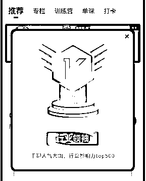

# (38 赞)中介思维发财术与 AI 提效方法分享

> 原文：[`www.yuque.com/for_lazy/zhoubao/wov6anenrmgslhny`](https://www.yuque.com/for_lazy/zhoubao/wov6anenrmgslhny)

## (38 赞)中介思维发财术与 AI 提效方法分享

作者： 领飞懂运营

日期：2025-06-13

**哈喽！我是领飞！！！**

一个爱潜水的航海家！我的赚钱方法就是整合。

之前写过一篇被加精华的文章。

[【倒爷（中介）发财术】复制别人没啥意思，合作别人才有意思，大家一起分钱](https://articles.zsxq.com/id_wus55cjxodtw.html)

我说：要写 108 个【中介思维发财术】目前也才写了 22 个；

很惭愧，去年低大病一场，自己也迷茫了一段时间。

印象最深的一个圈友留言：要给他上大学的儿子看。（哈哈，看来真的有价值）

3 月份我去航海家聚会，对 Ai 感触颇深，见了很多高手！

对我而已，用 AI 先做好自己，提效自己才是当前对我的影响。

我平时很喜欢讲课，如果说整合赚钱是我一项能力，那么卖课程也是我钞能力吧！

卖课我做到【千聊影响力 TOP.500】，领域关键词排名连续 7 年第一。

（这个不重要，顺便也发个求职：有哪些大佬害怕讲课，缺线上讲师；我很愿意为你服务。）

OK！

写作太消耗精力了，我宁愿讲一课，也不愿意坐下来写一篇文章。

很多时候我讲课，从来不会提前准备大纲，当课程讲完了大纲也就形成了。

当然，不得已时候，提前才准备大标题下几个小标题。

我测试过一项能力，给我一个 PPT 我就能讲出一堂课；前些年，也拿这项能力去给一些团队做讲课，赚一些外快。

现在 Ai 的赋能，让我对【随意话题讲课的能力】，有了更好后期多样性运用。

【108 个中介思维发财术】就拿这个为例子吧。

**一、正常的方法是：**

把一个选题坐在电脑前，一边琢磨，一边思考，一边敲字，一边排版

这一套下来，精疲力竭，太烧脑了，怎么也要 2-3 个小时吧。

更别说课程了。

这篇文章其实写出来，不一定比 Ai 好，Ai 能给你重新架构选题，但是你有此文章基础，Ai 生成的文章你会更满意，甚至比你写的好，增加的内容更丰富。

这就不多少了，重点是下面。

**二、Ai 的方法是：**

把一个选题直接对着微信（文章传输助手讲），一段，一段的讲，其实和你写文章差不多，只不过写文章更消耗精力。

当然你要具备知识的储备，不然真没法做下去。

这是一段段语音讲完，也可以是一篇文章。

把一段段语音合成就是一个课程，把语音转文字合成一起，就是一篇文章。

**重点是：**

这里有个 BUG，一段段合成的文字，并不能直接使用，需要进行梳理。

梳理就有意思了：看你怎么梳理

一种方式：不改变内容每段话，只做去口语化梳理。

一种方式：不改变内容整体，还按照你的原内容梳理清晰。

一种方式：原内容可改变，更条例的归原内容。

**我怎么做呢？**

先把一段段的语音合成到一起，之后用【腾讯元宝】给出提示词：“把上面内容整理公众号文章，要求不遗漏任何一个知识点，可适当的插入案例，文字 3000 字”。

有意思的是【腾讯元宝】有 2 个智能体：hunyuan 和 deepseek

会给出 2 个不同的整理。

你还别说，这 2 个整理还都不曲解你的意思，合成一下更好。

**需求就是机遇：**

1、把一段段的微信语音，合成一个完整的音频，不用手动，这是需求。

有没有智能体工作流能完成。

2、把一段段语音转化文字，整理到一个文档，不用手动，这是需求。

有没有智能体工作流能完成。

3、合成的文档，自动 AI 整理文章。

4、合成的语音，自动优化完成音频。

5、优化的文章与音频，合成课程。

我觉得，凡是带团队的老大，都需要这样的功能，把碎片的课程用 AI 智能体进行整理，二次的利用。

做智能体的兄弟，我觉得这个产品可以研发下。

OK！

最后，大家感触下我的工作提升效率的方式：

也同时分享，3 个【中介思维发财术】为一些寻求项目的圈友，提供一些选择性意见。

#### 第一个：【Ai 智能体（中介）发财术】如何用“搬运+整合”模式年赚百万？

#### 第二个：【Ai 提示词（中介）发财术】值得做 5 年，复利自己月入 10 万

#### 第三个：【地图掘金（中介）发财术】用 5 号儿运营+笨方法，半年攒了 2 万精准客户

请移步飞书：

[`x87o4rv4xr.feishu.cn/docx/NlLydJhSaoTFRAx4yQtcaSH6nSf?from=from_copylink`](https://x87o4rv4xr.feishu.cn/docx/NlLydJhSaoTFRAx4yQtcaSH6nSf?from=from_copylink)

* * *

评论区：

吴泽承 : 🐮写的真牛，受益匪浅

领飞懂运营 : 寻求哪个圈友 AI 提示词高手，能把音频内容原封不动的梳理成文，而不是 AI 提炼增加和减少内容，脱离了原味。

逸尘 : 这个通义听悟应该能办到吧

七月白粥 : 牛！

守仁明志 : 可以拉一个工具转文字，接入 api，然后变成逐字稿就可。 后面才是提示词的部分，就进行专门的要求格式设置，如果可以，可以 dd 我，我最近在做这个工具