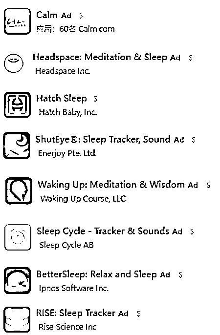
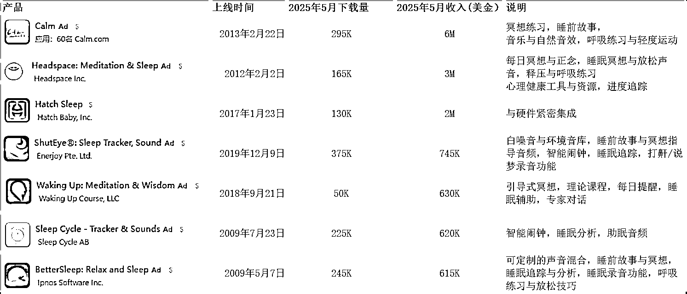
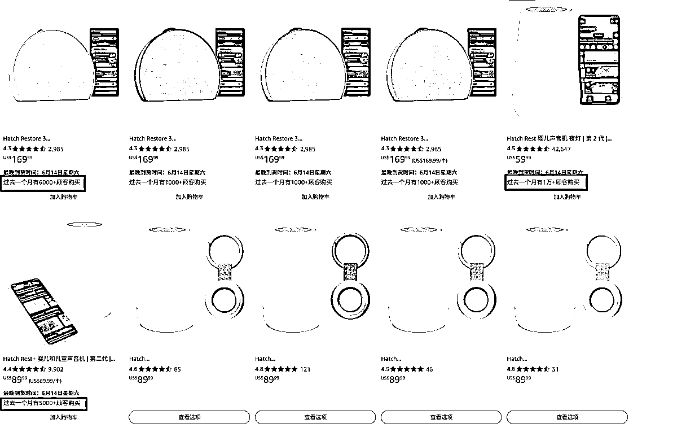
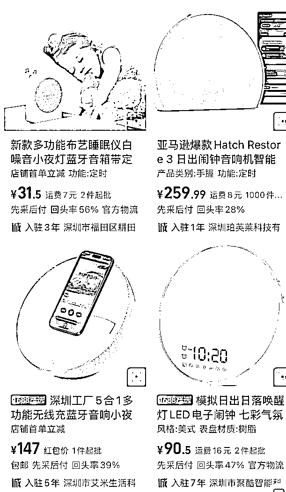
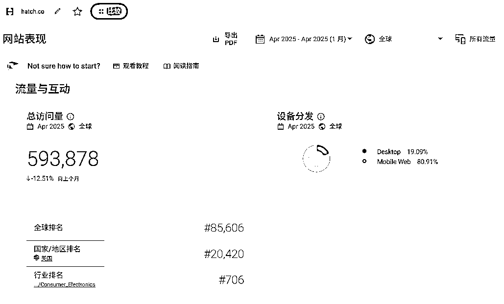
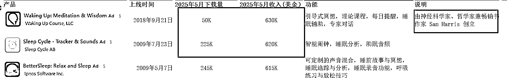

# (14 赞)App 与跨境电商结合出海新思路

> 原文：[`www.yuque.com/for_lazy/zhoubao/tc8l2eunbvyy1q4t`](https://www.yuque.com/for_lazy/zhoubao/tc8l2eunbvyy1q4t)

## (14 赞)App 与跨境电商结合出海新思路

作者： 特里莎的出海手记

日期：2025-06-13

Hi 生财的朋友们好，我是微信公众号 【特里莎出海手记】
和知识星球【特里莎出海手记】的主理人特里莎，今天给大家分享一个 App 和跨境电商结合的出海新思路。我一直从事 App 出海，对于跨境电商不太熟悉，也希望借这篇文章能认识到一些熟知跨境电商行业的朋友们破圈交流，进入新的赛道。

这几年做 App 越来越难，特别是在应用市场流量获取这件事上，许多开发者都感到无力。即使你的产品评分很高，用户评价良好，也可能在 App Store 或 Google
Play 里被埋没。问题不是出在产品，而是整个流量生态已经发生了根本性的变化。

### **传统 App 获客的多重困境:**

第一，**AI 正在改变用户的搜索路径** 。

过去人们会在 App
Store 里搜索各种关键词来寻找 App，如今他们可能直接在 ChatGPT 上获取解决方案，这意味着用户的注意力被分流，应用市场流量。关于这个，上次我写过

《 [新风口，新机会：你的应用后台看到来自 ChatGPT 免费推荐的流量了吗？](https://mp.weixin.qq.com/s/ATybWABURHuvZcIipYNSEg) 》

第二，**应用市场本身的流量越来越商业化** 。

以 App
Store 为例，原本的自然搜索结果现在被大量 ASA 广告位取代，自然流量被平台“有价化”。即使你是优质开发者，也不得不通过投放广告才能拿到展示位置。下图标着蓝色 Ad 的都在做 ASA 广告的产品。

第三，**平台更倾向扶持已有成功记录的“大 V 开发者”** 。

大家都知道谷歌给优秀开发者和优秀应用的流量扶持非常明显，这几年 Appstore 流量也越来越向被编辑推荐的 App 倾斜，而这些产品往往集中在大公司或平台信任的开发者手中。新人、小团队的机会越来越少。

当然，我们从应用商店的角度来看也很正常，编辑也是人，应用市场的 App 有几百万个，编辑眼睛能看到的产品非常有限，而且他们也踩过无数不良开发者的坑，不知道那些表面看着漂亮干净的 App 底下存在什么坑，所以当然要找可信任的合作。

### **第四，广告成本节节上升，出海投放越来越难**

应用市场获客难，很多团队把希望寄托在 Facebook、Google、TikTok 等广告平台上，但是谁做谁知道，这些渠道**广告成本如今有多高，ROI 有多低** 。

在这种背景下，继续内卷式投放、竞价式买量已经很难支撑健康的 ROI。普通开发者和中小团队亟需“破圈”的新思路。下面这个产品也许提供了一种出道新思路。

**Hatch：从卖硬件入手，带动 App 增长**

最近我在观察应用市场的健康健美榜单，感觉这个市场真的是卷成麻花，榜单被几个熟面孔牢牢占据，这些熟面孔大部分被苹果推荐过，甚至得过奖，大部分都在买量。在产品方面重复度极高，几乎所有 App 都在内容、音频、AI 上内卷。

但是，其中却有一家公司 Hatch
Sleep 却走了不一样的路——从电商切入，卖硬件、赚订阅、再带 App 流量，实现了“打破次元壁”的稳定增长新路径。我们通过上图也能看到，**Hatch
Sleep 是唯一一个没有投 ASA 广告的 App** ，但是应用内购买**月收入 200 万美金** （这里统一用的点点的数据，Sensor
Tower 显示是 100 万美金，还是在这个表里排第三）却仅次于老牌的 Calm 和 Headspace，这两个拿过苹果大奖且上线超赤 10 年的产品。

### 通过下图的两个 Sleep app 在过去几年的收入对比我们可以看到，Hatch

Sleep 和一般的买量睡眠 App 一个很大的不同点，**依靠买量增长的 App 的收入，会随着买量费用的剧烈变化而变化，但 Hatch 却是始终稳定增长。** images.zsxq.com/FvVHWCgLNBgiUyF4V30eu6rDXy7k)

Hatch 是一款结合智能硬件与睡眠 App 的产品。它最初并未以传统 App 的方式推广，而是将核心投入放在**独立站** 和**亚马逊等电商平台的智能睡眠灯销售上** 。用户购买硬件后，为了设定和使用功能，自然会下载 Hatch App。这一策略，形成了“卖硬件 → 带下载 →
提高留存 → 推动续费”的正循环。

**Hatch 是****亚马逊平台增速最快的黑马，****根据 Modern Retail 的报道，Hatch 在 2023 销售额约 1.4
亿美元。**

**你们猜猜上面的产品哪里产的？原价是多少？这个答案作为福利，留给特里莎的知识星球用户。****答案见下图来自阿里巴巴 1688 平台的截图：**

**Hatch 独立站流量：每月 59 万，留存率 42%**

在应用市场流量见顶，纯获客成本不断提高的今天，Hatch 这种“从电商切入，软硬件流量一体化，用硬件反哺应用生态”的策略带来了几大优势：

**不依赖应用商店分发**

用户通过亚马逊、独立站、社交媒体、育儿博主种草买硬件，App 只是服务入口，不靠榜单流量。

**通过社交媒体，KOL, KOC 种草，以及用户评论自带口碑效应** ：

这个主打 "睡眠训练系统" 的品牌，在 TikTok 上创造了单条视频 2000 万播放、用户生成内容（UGC）超 50
万条。在亚马逊商品页，用户也常提及 App 好用、配合硬件效果更佳，这样也为 App 带来了流量。

**电商即增长入口，用 App 收入分摊电商推广成本**

每一个硬件用户都是 App 的潜在订阅者，电商获客分摊到 App 推广成本，整体获客成本远低于纯 App 广告或电商广告。

**软硬件结合，形成软留存闭环，用户生命周期更长，提升留存，促进续费**

Hatch
Sleep 用了非手机解决方案，形成睡前使用仪式感。硬件提高了 App 的留存，而反过来，通过 App，又可以不断更新硬件的内容，也提高了硬件的留存。而且用户行为数据来自真实硬件交互，远比“睡眠打分”准确，未来可与
AI 更深整合。

**独立站流量来源多样化**

Hatch 独立站每个月流量 59 万，包括自然流量，社交平台的流量，也有部分投流。大部分来自美国。 images.zsxq.com/FllO_nNTZm0031s2pn2X_MFAU1Ff)

**投放数据更加准确可靠，更利于 ROI 的优化**

这几年 IOS
APP 数据问题有多讨厌，增长投放的同学都懂的。然而谷歌也一直说它也要出这个隐私保护，不知道什么时候安卓 app 投放也会变成一种痛？但是如果投网页独立站，投亚马逊站内广告，是不是可以舒服很多？你都不用 W2A 了，你就是 W!

### **通过 Hatch 的例子，普通开发者能学什么？**

**1****.** **不要被应用商店绑架** ：

想办法在 App 生态之外找“流量捷径”，比如跨境电商、独立站、电商内容平台，Hatch
用电商和硬件做到了。下一步，也许你能用 AI、内容、IP 或者别的什么方式打破边界。

**比如我们上面的睡眠榜单，其实还藏着一个以 IP 变现的产品，不知道你可曾留意到?**

**Waking Up，月入 63 万美金，RPD（收入/下载）超过 12 美金，由神经科学家、哲学家、畅销书作家 Sam
Harris 创立。一个个人 IP，带动那么大的收入，Amazing!**

**2****.** **软硬结合可以突破信任门槛，提高留存, 提升收入** ：

硬件是用户信任的锚点，配合 App 提升使用深度；另外，用户卸载一个 App 的可能性远高于扔掉一个硬件的可能性，毕竟前者只要在手机上点一下就可以，后者，是要把一个花钱买来的东西分类整理掉。

**3****.** **我们再来发散思考一下，在未来 AI 与场景结合** ：

### 在这个 AI 改变世界的时代，我们可以以 Hatch 为例，对未来多一点想像：**AI 会不会是 Hatch 下一步的跳跃点?从陪伴工具变成智能助手?**

随着 AI 技术的发展，Hatch 的产品形态正从单一功能型设备，向智能助手方向演化：

利用大模型，Hatch 未来可提供语音互动、个性化睡眠建议、情绪识别等服务；

智能硬件成为 AI 触达家庭的终端入口，是天然的“注意力占位器”；

**4****.** **App 和硬件的结合，可以演进为 AI+IoT 平台，且具备长期订阅与高 ARPU 能力。**

换句话说，也许存在着一条“从硬件切入 → 用软件留存 → 以 AI 升级”的路径，这比单纯做一个 App 或一个设备，更具有护城河和商业潜力。

## **结语：应用市场的内卷，不如打破它**

在流量被垄断、广告越来越贵的今天，“破圈”是活下来的关键。不是每个团队都能做出爆款 App，你需要构建自己的“流量入口 + 变现通路”。

**毕竟，一鱼多吃，才是当下最值得追的增长策略****。**

* * *

* * *

评论区：

暂无评论