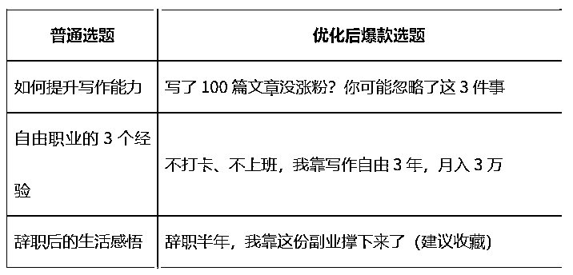

# (46 赞)8 年写作经验：爆文底层公式大揭秘

> 原文：[`www.yuque.com/for_lazy/zhoubao/pm7vv558lifxumac`](https://www.yuque.com/for_lazy/zhoubao/pm7vv558lifxumac)

## (46 赞)8 年写作经验：爆文底层公式大揭秘

作者： 何老师

日期：2025-06-10

做公众号写作 8 年，我踩过的坑比你想象的多。

有段时间，我一周写 3 篇，连续写了半年，平均阅读不过 3000，几乎零涨粉。那时候我也怀疑，是不是自己根本不适合写作？

直到 2025 年，我做了一次彻底的复盘。

我发现，我之前根本不懂什么是真正的“爆文写作”。

真正能做到 10 万+、带来涨粉和转化的文章，背后都有一套可复制的底层公式。我按这个方法重构写作逻辑之后，连续写出 30 篇 10 万+，一个月涨粉 2000+，顺利转化出第一批铁粉，甚至开始变现。

这是我的第一篇爆文的数据：

这篇文章，我会把这套“爆文写作底层公式”拆开来讲清楚，**不讲空洞套路，只讲最实在的方法论。**

### **一、写爆文前，先搞清楚这 3 个关键问题**

每一篇爆文的出发点，都不是“我要写点什么”，而是：

#### **1****.** **这篇文章是写给谁看的？**

写给谁，决定你用什么语言、讲什么故事、打什么情绪点。

● 如果你的目标是年轻上班族，你就不能写“如何做好办公室人际关系”，这不够痛。

● 他们真正痛的，是「每天打卡上班，毫无自由」。

这才是真正能引起共鸣的起点。

#### **2****.** **你的受众最焦虑的点是什么？**

痛点清单举几个：

● 刚辞职的人：焦虑未来收入不稳定

● 想转行的人：担心自己没有经验、没方向

● 自由职业者：时间自由，但没掌控感

● 写作小白：每天输出，月入却为零

写爆文，就是写他们最焦虑的那个点。

#### **3****.** **你这篇文章能解决他们什么问题？**

不要“讲道理”，要“给方案”。

比如：

● 告诉自由职业者：如何打造个人品牌，每月稳定 3 万+

● 告诉想转行者：如何用写作副业，摆脱 996

● 告诉写作小白：为什么你写了 100 篇，还没人看？你忽略了这 3 个写作公式……

### **二、爆文的选题，99%都赢在起跑线**

很多人写不出爆文，问题不是文笔不好，而是**选题太平、太宽、太没冲击力。**

来，看这组对比：

选题的底层公式是：

👉  **强情绪 + 反常识 + 明确人群 + 高冲突感**

举几个你可以立刻用的公式：

● **反转型** ：我越放弃写作，越赚到钱

● **冲突型** ：我很努力，但没用（为什么你做得对，却没有结果？）

● **钩子型** ：稳定赚钱，真的不靠自律（那靠什么？）

每天你可以建立一个“选题池”表格，每天记录 1~3 个选题灵感，一个月下来至少 30 个，写作再也不缺方向。

（说实话，能这样做的人很少，但是能坚持下来的，都能写出爆款。）

这是我第二篇爆文的数据：

### **三、爆文的结构公式：黄金 3 段式**

我教的所有学员，都是靠这一套结构，快速写出第一篇 10 万+。

#### **1****.** **开头：钩子三连**

目标就是一句话，**3 秒抓住用户！**

● 提问式：你是不是也有这种感觉……？

● 冲突式：辞职半年，我靠副业月入 3 万，但我很焦虑

● 对话式：朋友问我，你真的靠写作活下来了？

开头最忌讳的，是“我今天来分享一下……”。没人在意你要分享什么，读者只在意“这对我有没有用”。

#### **2****.** **正文：案例 + 方法 + 情绪共鸣**

内容部分，建议用「问题—解决方案—情绪升华」结构。

比如：

● 我为什么写了 100 篇还没人看？问题定位

● 后来我用了这套结构，每篇都爆：解决方案

● 然后讲一个案例，情绪落点拉满

● 加入 1~2 组数据，增强可信度

写到这里，用户已经「看懂 + 感动 + 得到方法」，剩下的就是收尾。

#### **3****.** **结尾：高能收尾 + 行动召唤**

别写鸡汤式“希望你也越来越好”，那太弱了。

要写：

● 情绪上升：哪怕你现在写得不行，也不要放弃，因为你只差一个方法

● 行动召唤：如果你想学这套爆文结构，我准备了我的写作手册，公众号后台回复【爆文】领取

**钩子+行动召唤=涨粉神器。**

这是我第三篇爆文数据：

### **四、真正涨粉和变现的秘密，不在文章里，而在“钩子”上**

一篇爆文的转化公式是：

👉  **阅读量 × 转化率 = 粉丝数**

阅读量靠标题，转化率靠钩子。

你在正文中埋一个诱饵：

● 比如：「我做了个表格，每天 1 分钟就能生成选题，关注后私信我，免费送」

● 或者：「我总结了一份 10 万+文章的写作结构，后台回复“公式”即可获取」

这才是高转化的关键。

涨粉不是靠运气，是靠设计。爆文背后，全是细节。

### **五、总结：爆文写作的底层公式**

这是一整套闭环系统：

1.  **选题公式** ：强情绪 + 明确痛点 + 反常识冲突

2.  **结构公式** ：钩子开头 + 方法正文 + 情绪结尾

3.  **钩子设计** ：在文中自然埋钩子，引导关注&私信

4.  **用户转化** ：精准受众+精准情绪+有用信息=真铁粉

这套方法，我实战过几十次，带出无数 10 万+，你也可以复制。

这是我第四篇爆文数据：

**希望你不是一个「写了很多却没人看」的人，而是下一个，被别人模仿的写作范本。**

（联系何老师，可找鱼丸）

* * *

评论区：

素商 : 感谢何老师分享，实操性很强[抱拳][抱拳][抱拳]