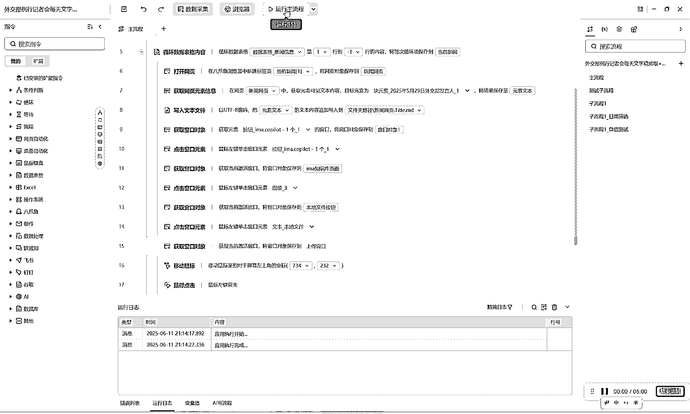
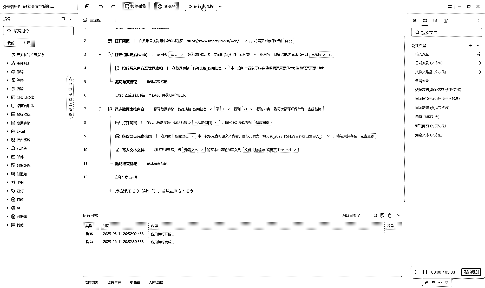

# (24 赞)用八爪鱼 RPA 自动维护外交知识库实践

> 原文：[`www.yuque.com/for_lazy/zhoubao/wzu3p9n5re380bcn`](https://www.yuque.com/for_lazy/zhoubao/wzu3p9n5re380bcn)

## (24 赞)用八爪鱼 RPA 自动维护外交知识库实践

作者： 小查

日期：2025-06-12

## 前言

最近在担任生财有术 AI 知识库航海的教练，在与圈友们日常交流的过程中，遇到这样一个问题引发了我的思考——**知识库怎么才能高效、低成本地持续维护？有没有什么方法能实现自动维护？**

正好最近在学习 RPA（机器人流程自动化）工具的使用，我萌生了一个实践的想法：**能不能借助 RPA，实现知识库自动更新和维护？**

于是，我决定以外交部例行记者会网站为例，开启一次 RPA 实战探索——**每天自动抓取最新发布的记者会文字稿，并自动上传到 ima 知识库中，打造一个可查询、可提问的外交信息知识库** 。希望这个案例能为大家提供一个利用 RPA 技术自动化维护知识库的新思路，也帮助更多朋友快速建立起来自己的 AI 知识库，迈出实操的第一步。

先来看看最终实现的效果，文末也分享了这个应用的链接，大家也可以亲自试一下。

## 工具介绍与准备

### 八爪鱼 RPA 简介

这次我选取了市面上使用人数很多的一款 RPA 工具-
八爪鱼 RPA，它是一款可视化、零代码、适合普通用户的数据采集和自动化流程搭建工具，广泛应用于网页数据抓取、自动批量处理等场景。

先去官网下载和安装八爪鱼 RPA 软件，[完成账号注册和登录。](https://partner.rpa.bazhuayu.com/xiaochaai)

### ima 知识库简介

这次用的知识库是 ima，腾讯出品的一款知识库管理软件，我已经在上面建了 20 多个共享知识库，这次新建的知识库主题是“外交部例行记者会”，用于收录从外交部官网获取的例行记者会文字稿。

## 案例一：外交部例行记者会历史文字稿批量采集

### 需求梳理

外交部网站记录了从 2021 年 3 月以来全部例行记者会的文字稿，网站结构非常简单清晰，非常适合 RPA 自动化提取：主页是历次记者会的索引页，每次记者会召开完毕都会单独生成一个新闻网页，用于记录当天记者会的全部文字稿内容。

网站地址：

*   外交部例行记者会主页 [`www.fmprc.gov.cn/web/fyrbt_673021/jzhsl_673025/index.shtml`](https://www.fmprc.gov.cn/web/fyrbt_673021/jzhsl_673025/index.shtml)

*   单场记者会网页（2025 年 6 月 11 日外交部发言人林剑主持例行记者会）[`www.fmprc.gov.cn/web/fyrbt_673021/jzhsl_673025/202506/t20250611_11645752.shtml`](https://www.fmprc.gov.cn/web/fyrbt_673021/jzhsl_673025/202506/t20250611_11645752.shtml)

**我的目标是先搞定历史存量新闻，把网站上所有的历史稿件一键采集到本地，并以 标题名.md 的方式存储，为后续导入知识库做准备** 。

### 流程步骤

#### （1）新建采集任务并设置网址

*   打开八爪鱼 RPA，点击“应用”下的“新建应用”，创建一个新应用。

#### （2）设计爬取流程

通过指令来实现数据爬取流程。做 RPA 的时候一定要先列出一个整体思路，然后按照这个思路一步步细化。

以这个案例为例，我设计了三个大的步骤。

*   用八爪鱼浏览器打开例行记者会主页（也可以使用 chrome 浏览器，需要提前装八爪鱼的插件）

*   创建一个循环相似元素，把单场新闻的网页循环抓取一遍，存到数据表格中。

*   创建另一个循环，把数据表格里记录的单场新闻网页遍历打开，抓取里面的内容并保存到本地文件中。

这个过程中的重点和难点在于要理解循环以及使用数据表格存储单场新闻的链接，为后续循环打开抓取打下基础。作为初学 RPA 的小白，我也是看了很多社区中的帮助文件和案例后，并请教了有经验的网友才明确了这个做法。

展开看一下具体的指令。

用八爪鱼浏览器打开例行记者会主页，并保存到变量“网页”中。（理解变量的概念也很重要，你可以把它简单看作是一个过程的临时存储）。

创建循环相似元素，用窗口捕获的方式以把主页上一系列单场新闻的链接作为相似元素捕获下来，存到变量“当前网页元素”中。

然后把单场新闻的标题和链接依次存到一个数据表格中。

创建数据表格的循环，依次把表格中存储的单场新闻的链接打开，用捕获的方式获取全部文本内容，并保存到变量“元素文本”中。最后一步是把保存的文本内容写入在本地电脑新建的文件夹中，并用单场新闻的标题命名，保存为 md 格式的文件。

我们来看一下运行效果

非常完美的实现了既定目标。

由于是批量获取历史文件，我采取了先批量下载再一次性上传到 ima 知识库的方式，后面上传到 ima 的步骤就是手工操作完成，只需点几下鼠标即可。

## 案例二：每日增量新闻的自动采集与知识库自动上传

### 需求梳理

案例一中解决了批量下载历史新闻的问题，但是后续每天增量产生的例行记者会新闻稿如何处理？我想到了再搭一个 RPA 应用来解决这个问题。在这个案例中，我的目标是**让 RPA 访问外交部记者会页面，抓取新增内容并自动上传 ima 知识库，持续更新 ima 知识库** 。不仅要抓新闻到本地，还要能自动上传到 ima。

### 流程步骤

在这个案例中，我主要设计了两大步骤：

*   让 RPA 打开最新一天的单场新闻页面并自动抓取内容保存到本地文档。

*   让 RPA 模拟人操作电脑的方式操作 ima，完成点击上传按钮、选取上传文件的动作。

#### （1）新建采集任务并抓去新闻到本地

参照案例一中的做法，打开最新一天指定日期的新闻单页，抓取内容并保存到本地 md 文件中。

#### （2）模拟人操作在 ima 中上传

实现这一步我采用的是模拟人的方式，让 RPA 像人操作鼠标那样获取窗口对象、点击窗口对象，依次操作。在这个过程中，需要保证人每一步的动作都被分解并有一个 RPA 的指令承接，才能保证最终的效果。

这个过程也说明了像是八爪鱼这样的 RPA 软件，不仅能操作网页，还能够操作本地的其他软件、操作系统、办公软件，这无疑会带来很多的可能性。

我总感觉这个办法比较笨，特别是针对需要操作很多步骤的情况下，每次运行存在失败的概率（找不到按钮），需用重新调整。但目前对 RPA 的理解还比较浅，还没找到更好的实现方式，后续还需要去多看看社区的文档和别人的实践案例。

同样来看一下最终的效果。

## 整体流程启发与扩展玩法

### 自动化知识采集的高效体验

通过本案例可以看到，利用八爪鱼 RPA 抓取数据、整理信息、搭建知识库，**大大节省了繁琐重复的人工操作** 。只需会用鼠标拖拽配置好流程，便可实现“信息的自动搬运工”——这不仅适用于外交部例行记者会网站，几乎所有结构清晰、固定领域的数据源都可以快速适配。

### 灵活迁移，构建更多知识场景

掌握此思路后，你可以自行拓展到**财经资讯、企业公告、法律法规、学术动态等领域** ，为自己或团队定制知识问答库。例如，金融分析师可批量抓取上市公司公告，教师可以每日自动收集教研新政策，同类方法都适用。

我刚刚创建的这个 ima 知识库，就可以用于问询关于例行记者会上的信息。

### 八爪鱼 RPA 应用市场——无限玩法，等你探索

八爪鱼官方近期推出了“应用市场”，**提供了成百上千种现成的 RPA 玩法与自动化应用模板** ，涵盖数据采集、电商、社媒、新媒体运营等各个场景。例如：

*   小红书数据采集、内容监控

*   电商商品自动比价、评价抓取

*   微信群数据整理

*   招聘信息爬取

*   短视频平台热门评论收集

新手可以直接在市场中搜索需求，下载修改即用，无需从零搭建，大大加快了上手速度和实际应用效率。

## 结尾

我这两天的体会是，要想快速入门 RPA，有三个诀窍，也分享给大家：

> *   想一个实际的需求，在满足需求的过程中学习；
> 
> *   多看官方社区的帮助文档和案例，学习别人的经验；
> 
> *   直接找一个差不多需求的模板，以此为基础改成适合自己的应用。

最后，把我这两天摸索的上面两个案例的应用也免费分享出来，希望对你能有所启发和帮助。

外交部例行记者会新闻文字稿历史全量数据抓取 jiao-bu-li-xing-ji-zhe-hui-wen-zi-gao-zhua-qu--li-shi-quan-liang?ref=WxXg1c)  <[`rpa.bazhuayu.com/appstore/app/dev_n6y-jc/wai-jiao-bu-li-xing-ji-zhe-`](https://rpa.bazhuayu.com/appstore/app/dev_n6y-jc/wai-jiao-bu-li-xing-ji-zhe-) hui-wen-zi-gao-zhua-qu--li-shi-quan-liang?ref=WxXg1c>

外交部例行记者会新闻文字稿最新一天数据抓取并上传到 ima jiao-bu-li-xing-ji-zhe-hui-wen-zi-gao-zhua-qu--li-shi-quan-liang?ref=WxXg1c)  <[`rpa.bazhuayu.com/appstore/app/dev_n6y-jc/wai-jiao-bu-li-xing-ji-zhe-`](https://rpa.bazhuayu.com/appstore/app/dev_n6y-jc/wai-jiao-bu-li-xing-ji-zhe-) hui-mei-ri-wen-zi-gao-zhua-qu-bing-zi-dong-shang-chuan-zhiima?ref=WxXg1c>

欢迎大家结合自己的实际需求勇敢动手尝试，哪怕完全不会代码，也可以借助 RPA 和知识库工具，实现高效的信息采集与管理——把工作生活中重复、枯燥、低价值的环节，交给自动化，自己专注思考和创造。

如果你有更好的想法和实践经验，欢迎留言交流！让我们一起用好 RPA，用好 AI，让信息更有价值。

* * *

* * *

评论区：

暂无评论