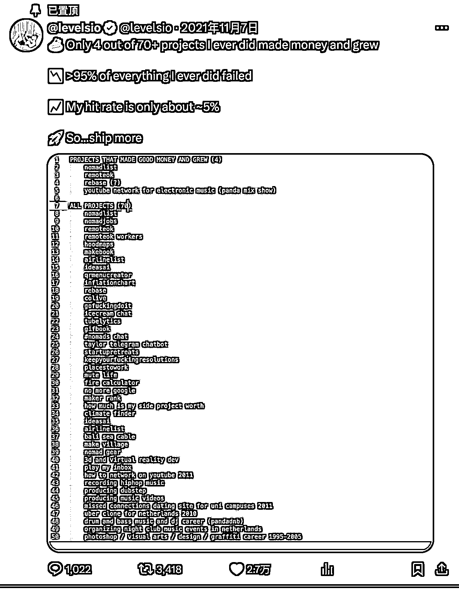
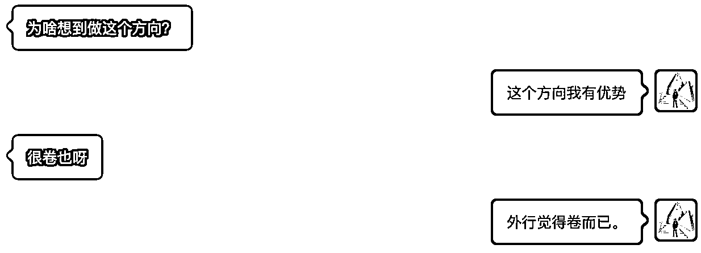

# (精华帖)(567 赞)如何提高做产品的成功率？

> 原文：[`www.yuque.com/for_lazy/zhoubao/lih86qznc7nvsq8y`](https://www.yuque.com/for_lazy/zhoubao/lih86qznc7nvsq8y)

## (精华帖)(567 赞)如何提高做产品的成功率？

作者： 刘小排

日期：2025-05-25

大家好，我是刘小排。

下面的内容，我在过去几个月，通过生财有术的直播、SCAI 实验室的开业典礼、还有哥飞的北京见面会等等场所，都零零星星分享过。今天感觉差不多比较完整了，整理成文字，全部分享给大家。

首先，做海外产品本质上是一场数量游戏。做很多其他事情也一样。我以前在生财跟朋友们分享过，独立开发者的大神 Pieter
Levels，做产品的成功率也只有 5%。 我们需要用数量来对冲概率，这是基本操作，无需赘言。

在 AI 的帮助下，产品开发的成本越来越低。记得两三年前我分享过（见我的生财帖子），做一个 MVP 产品只需要一个周末，甚至一天。这篇帖子帮助过很多很多的朋友。
在当时，听起来难以置信。现在有了 ChatGPT 和 Cursor，回头再看看那篇帖子( [`t.zsxq.com/acxP2`](https://t.zsxq.com/acxP2) )，我们会发现，今天每个人做 MVP 可能都只需要半天或一天。如果你参加了我的课程，你会发现学习完前三课，不需要编程基础，无论啥花里胡哨的产品 MVP 都能做了。

产品的基本数量问题，到这里算是彻底解决了。

那接下来，值得我们研究的是 —— 如何在保证基础数量的前提下，提升单款产品的成功率。

作为产品经理，我从很久以前就开始研究这个问题。世界上有很多知名企业家的成功是有运气因素的。能够一辈子连续做多个产品、每个产品完全不同、每个产品都获得巨大成功的人，非常少，
其中，对我影响最大的，是一位叫杜国楹的老前辈企业家。

也许你没听过杜国楹这个名字，但你一定听过他的产品。20 多年前，年仅 20 多岁的杜国营就凭借第一款产品"背背佳"一炮而红，这款产品至今仍在热销。此后二十几年，他接连打造了"好记星"、"E 人 E 本"、"8848 手机"、“小罐茶”等多个爆款产品，每个都红极一时，成功率高达 100%。

学习杜国楹先生所有的访谈、报道、书籍、课程，深刻影响了我的产品方法论。我做产品的成功率也得到了极大的提升。

在这里，我想跟你分享我学习到的两个关键：

**第一，需求倒做** 。

**第二，顺势而为** 。

# 一、需求倒做

我们很多朋友在做产品时，并不这样想。尤其是一些有技术背景的人，或者 AI 自媒体博主。他们往往会发现一些新技术、发现一些新的 Prompt，然后拍脑门觉得“这个技术/这条 Prompt 套个壳包装产品，肯定行”。
大部分人的思维方式都是如此，因为这样更符合直觉。我们习惯于从供给侧出发，而供给侧往往是技术。

别说普通人了，就算是两年前红极一时的“大模型六小虎”，汇聚了全中国最厉害的高端技术人才。他们从供给侧技术出发，而不是从需求出发，今天也几乎全都遇到了瓶颈。

杜国楹先生的方法论完全反过来。所谓的“需求倒做”，是把整个产品开发的逻辑完全倒过来。

先找到核心需求点，再设计产品，再开发产品，然后找到与之匹配的独特渠道。

核心需求点 → 产品设计 → 产品开发 → 独特渠道

我喜欢讲故事，你也喜欢听故事。那我们按照老规矩，就从故事开始。

以当年的"背背佳"为例，杜国楹发现了什么需求呢？他观察到，当时家长们希望孩子在上课和做作业时能保持挺拔的坐姿。这个需求在当时全球范围内都没有解决方案。

面对这个**核心需求点** ，杜国营四处寻找，最终找到了一个**可行的方案** 。在 1997 年，他以**5000 元** 的资金从天津大学物理学教授袁兵教授买下技术方案，取名为“背背佳”，8 月推出产品。1998 年销售额冲到**4.5 亿元** ，一举成名。

背背佳在 1997 年的主要渠道是电视购物，因为当时主要面对中小学生和学生家长。这是为目标人群设计的**独特渠道** 。

背背佳直到今天还很火，中间经过至少三轮**核心技术** 升级，目标人群也随着时代的发展进行调整。2023 年以后的背背佳，目标人群已经切换为了健身人群、久坐职场人，做“体态管理”需求点，
渠道切换为了抖音和京东自营。

一款产品卖了二十八年。

背背佳成功的关键，在于**找到并解决了真需求** ，并不是在于舍得砸钱。砸电视广告的产品很多，每年央视都有新的标王，但是只有背背佳（和很少的其他产品如“脑白金”），能够长盛不衰。

最近有一些朋友拿着自己的网站产品，一点特色都有没有的那种产品，问我怎么搞流量。不好意思，我真的不知道。我甚至怀疑全世界都没人知道。妄想会有什么神奇的渠道能够让任何一个平平无奇、不创造任何增量价值、不解决任何核心需求点的产品搞到流量，这叫什么？这叫幼稚。

对我触动更深的是杜国楹先生做小罐茶的故事。如果说背背佳靠“一根弹力带”证明了需求倒做在功能性消费品领域的威力，那么小罐茶则把同一套方法论复制到了“高感性、强文化属性”的品类——中国茶。它向所有技术驱动者型创业者展示：即使在极度分散、门槛看似很高的传统行业，只要抓住未被满足的关键场景，同样可以用标准化和营销科学打穿市场。

2012 年，杜国楹越来越觉得茶是一门大生意。茶是一个 3000 多亿年销售额的行业，里面竟然连一个 10 个亿的品牌都没有，这太需要创新了，一定有建立品牌的机会。

2012 年的茶有哪些痛点呢？至少有这三个痛点：

首先，茶叶是没有价格的。有人送了我一盒龙井茶，“明前龙井”，看起来非常高端。但是我并不知道它值 500 元还是 5000 元还是 50000 元。对于我一个外行来说，500 元的茶和 5000 元的茶，无论是看起来还是喝起来，都没有特别大的差别。

其次，喝茶的方式也很奇怪。每次招待客人的时候，摆上了上好的茶具、上好的茶叶，主人用拇指和食指从熟料带里夹出来一小撮茶叶放到杯子里。这一小撮茶叶到底是 3.5g 还是 4.3g，每次都不一样，全凭手感。并且不知道你注意到了吗，根本没有人在洗手的……

还有，茶的标准化也做得不好。我去年找同一个卖家买的明前龙井，觉得味道不错，今年再找他买，味道就变了……

这些早就被普通中国人长达千年习以为常的奇怪之处，都是**核心需求点** 。

找准了核心需求点，那就反向**设计产品** 、**开发产品** 。你看看今天小罐茶的形态。价格全国统一，解决了痛点一；把每款茶压缩成 4
克一小罐，像咖啡胶囊一样“一次一泡”，既锁鲜又量化价格，以此降低传统茶的“学习成本”，解决了痛点二；用工业化的方式来保证品质稳定性，解决了痛点三。

到了这都搞明白以后，再去思考与之匹配的**独特营销渠道** ，看准了茶叶是“礼品经济”，那就打透有关礼品的渠道。

这就是好产品。

我常说，

产品 = 一个具体问题的解决方案

**好** 产品 = 一个具体问题的**优雅的** 解决方案

这套方法论，结合我所在的 AI 产品领域，我总结为了一道填空题。 *什么人* ，在 *什么场景* 下，愿意 *花多少钱* ，解决 *什么问题* ？

生财的老朋友枸杞，还帮我制作成了一个微信表情：

当你发现了新的技术、新的 API、新的套壳可能性，（[`t.zsxq.com/E4uYn`](https://t.zsxq.com/E4uYn) ），先别急着自嗨，先试试能不能填这个填空题。

当你翻石头刷榜单( [`t.zsxq.com/EUnJL`](https://t.zsxq.com/EUnJL) )，不要急着去抄个一模一样的，而是要去思考，榜单上的别人的产品是怎么填好这个填空题的、他找到了什么真需求？围绕这个需求，你能设计出什么**差异化** 的产品方案？

先填好填空题再去做产品的人，比拍脑门做产品的人，成功率会高很多。

口诀：先有用户，再做产品

# 二、顺势而为

这里有两个势，一个是你的**优势** ，一个是**趋势** 。

哪个更重要？与很多人想的不同，杜国楹先生认为**优势** 更重要。我完全同意他的看法。

### 1. 优势

我能做海外 AI 产品还出点成绩，因为这是我的优势。我在前公司猎豹移动，做过多款日活超过千万的海外 App 产品。所谓日活超过千万，是指每天有超过一千万人使用。我做了十年的海外 App。
同时，也是在前公司，差不多是在 2016 年 AlphaGo 击败李世石事件的时候，我们转型拥抱 AI，所以我也做了九年的 AI。

直播的时候我提到我做了 9 年的 AI，有人评论说“吹牛，ChatGPT 才只有不到 3 年的历史”。还挺好笑的，看来，做 AI 产品并不是他的优势。(^∇)

作为为一个产品经理，做了十年的海外 App、九年的 AI、再加上我从小学四年级就开始写程序了，再加上我热爱做产品，再加上我喜欢研究前沿的技术和论文……
是在一系列的 buff 叠加下，做海外 AI 产品，成为了我的优势。

再加上我从 2022 年 Q2 就开始做文生图产品了，那时连 ChatGPT 都还没有诞生。积累了三年，爬了无数坑，现在文生图，也是我的优势。

当我做 Raphael AI ( [`raphael.app`](https://raphael.app) )之前，已经是 2025 年 1 月。对所有人来说，文生图套壳产品都是红海，对于你来说，想必也是。也就是说，在我做这个产品之前，我不太可能拿到投资，因为别人和我会互相觉得对方是傻 x。然而我很清楚，我才是对的。我做了，获得了还不错的成功。

在那之前，一些我敬佩的行业大佬和我对话，是这个风格的。他在别的领域是大佬，在我的领域可不是。

这是我的优势，不是别人的。

有朋友问我，“小排老师，我不知道做啥产品，你能不能给我几个产品 idea？”

他人不错，我就从我的 list 里找了一个我还挺想做的产品 idea 给他。毫无保留，真心分享。

然后他沉默了，问：还有吗？

我又给了一个。他又沉默了，过了很久，继续问：还有吗？

……

直到我给了很多很多个，他发现一个都做不了，尴尬地走了。

因为我的产品 idea 列表，里面全是结合我自身优势而挖掘到的机会点。它们往往是我能做的，但是别人不一定能做。

刚才我们提到的一条枸杞同学，他今天很兴奋。因为在他熟悉的 AWS 电商领域，有很多尚未被解决的问题，正在苦苦等待一个好产品。枸杞认为，传统行业比 AI 变化慢，通过实体产品找出来的需求，反而没啥竞争。
一面是竞争小、一面是自己有优势，对枸杞而言，这就属于他的蓝海。

再来一个例子，生财 AI 实验室的第二轮笔试题是一个有关 Web3 的工具。

所有进入杭州生财 AI 实验室的人，一共 17 人，全都完成了这道题，技术上难度并不大。但其中只有一个人，可以把它变成真正的、可以盈利的产品。因为这个人曾经靠 Web3 拿到过 8 位数人民币的结果，
Web3 工具是他的优势。最近他开始邀请周围的朋友内测他的产品，已经有人求着他早点上线、要求第一时间购买。

还有另外一位杭州生财 AI 实验室的朋友，他也是每天很晚会单独发日报我的朋友之一。他洞察到的需求点目标用户是设计师群体，询问我的意见。虽然他的这个产品 idea 是经过我启发，但是我并不敢轻易发表意见。因为这位朋友自己有设计师背景，做以设计师为目标用户的产品，是他的优势领域，不是我的。只要他能够认真填好填空题、做好用户调研，
他猜对的可能性，比我猜对的可能更大。

每个人都是带着自己独特的优势来的。你也一定有自己的独特优势。

在生财 AI 实验室，有人曾经是 ACM 比赛的 Final 27 名，有人是某国内顶尖大学的现任教授曾经还在 UC
Berkeley 呆过、有人曾经是建筑设计师、有人有专业的心理学背景、有人在抖音本地生活做过几十个小目标的 GMV、有人是国内首屈一指的 prompt 专家、有人拥有专利知识产权服务领域头部公司、有人曾经在工业 AI 视觉算法创业取得成功、有人出版过区块链书籍……

我总是鼓励他们，不要跟风抄榜单，而是要从自己的专业优势领域出发。心理学背景的人就应该做心理学相关的 AI 产品，知识产权背景的人就应该做知识产权相关的 AI 产品，用自己优势去打别人的劣势，这样的赢面才大，产品才有壁垒。

**试想，坐拥来自名门正派的心理学学术背景，为啥你要去随随便便做过同质化的套壳产品、去跟人比拼发外链的速度和数量呢？这不是暴殄天物吗？**

前些天，有圈友告诉我，“小排老师，我悟了，原来「排学」的核心就是「做自己」！”。哈哈哈，其实连我都不知道“排学”到底是个啥玩意儿，不过那一刻，我感觉他总结得挺对的。

在自己的优势领域里击球，是最重要的顺势而为。

### 二、趋势

最后，我们讲几个趋势吧，以及它们的应对方案。

**趋势一： 海外 AI 产品，投放广告的利润会不断变薄。**

原理： 已经有很多曾经做跨境电商的人进入海外 AI 产品领域，比如咱们生财圈友 Albert、佳境。他们曾经在电商领域拿到过大结果。

对他们来说，海外 AI 产品领域是蓝海，因为电商比这卷多了。

同样是投放、同样是网站（以前他们叫“独立站”），无外乎就是以前卖实体产品，现在卖虚拟产品，一模一样啊！而且卖虚拟产品（软件产品）还不需要压货、物流、发货。

他们会用自己已经很强大的投放团队，来和我们比拼投放，**终局一定是利润越来越薄，大家都从暴利变成微利，就和电商一样。**

应对：除非你有投放优势，或者你致力于建立一个强大的投放团队，否则不要轻易做投放，你打不过他们。
我就不做投放，一方面投放完全不是我的优势领域，另一方面是我相信好的产品能够自传播。没错，做能够自传播的产品，这是我的优势啊。

**趋势二：大模型能力会不断变强，会吃掉很多套壳产品的价值**

我们假设小明和小张，两年前他们同时听说 AIGC 文生图。其中，小明卷了两年的 ComfyUI，小张躺平了两年。回到 2025 年 5 月，他们谁用 AIGC 文生图，做出来的图更好呢？

答案是：一样好！ 小明白卷了两年的 ComfyUI。因为今天小张可以直接使用 lovart.ai ，
做出来吊打任何 ComfyUI 流程的图，还不累，不需要任何学习过程，连所谓的 prompt 工程都不需要掌握。

基于 ComfyUI 的套壳产品的价值，正在被新一代的大模型技术侵蚀，以后还会越来越严重。

有趣的是，lovart.ai 的开发团队，正是在过去两年吃到 ComfyUI 套壳产品红利的同一个团队。这个团队里面有高人，他们在尝试自我颠覆。

应对：去做那些随着大模型能力变强、产品价值也会增加的产品。

例如，Curosr 就是这样一个产品。Cursor 早就存在了，我 2023 年 2 月就向二两推荐过，二两觉得很难用。Cursor 被普罗大众广泛知道，是在一年半以后的 2024 年 8 月。

是因为 2024 年 8 月它有什么重要的产品更新吗？
不！是因为 2024 年 8 月，Anthropic 发布了 claude-3.5-sonet 模型，让 Cursor 突然变得很好用。随着大模型变强，Cursor 变强了。
Cursor 是大模型的朋友！

**趋势三：交付过程的产品会很快消失殆尽，以后主流是「交付结果」的产品。**

简单的说，以后 AI 产品不再卖工具，而是卖收益；AI 进入了“赚工资”的助理时代，直接交付结果。

怎么评价一个 AI 助理类产品是个好产品？红杉给出了三条标准。

1.  能不能完全不需要人类介入、不需要抽卡，直接对某项工作交付确定性结果？

2.  能不能量化它的产出能力？到底是节省了 3 小时还是 10 小时？到底是赚了 3 美元还是 10 美元？

3.  能不能自我迭代，越来越聪明？

关于这一条，大家一定要去看 5 月红杉资本 AI 峰会的会议纪要。

信息量比较大，请大家到微信搜索“红杉 AI 闭门会”，不少博主有详细解读。

请注意，按照上面几条标准，就连 Manus 也是不完美的。就我个人的体验来说，目前的 Manus 更像是一个玩具，大部分任务的成功率只有百分之六七十（对我而言）。

我会认为垂直领域，有更大的机会。相比 Manus，我更看好 Lovart.ai

昨天 Lucas 小杨问我下一个产品是什么，这就是我的回答。我会做一个很细分的垂直领域，针对一个特别具体的工作类别，能够直接交付结果的产品。我会按照红杉给出的三条标准来要求来设计产品。

**趋势四：产品供给会急剧膨胀**

很好理解，以前做产品门槛挺高的，甚至还需要程序员；现在变容易了，每个人都是程序员了。

大家知道，我最近也开了课程，专门教没有程序员背景的人使用 AI 工具产品来做 AI 工具产品，第一期就有 960 人报名。
我只是沧海一粟，还有更多的课程、更多孵化器、更多的社群，在鼓励和号召大家做同样的事。

显而易见，未来几个月，产品供给会急剧膨胀。没有差异化、没有独特价值的产品，完全没有前途。

应对方法

1.  在自己的优势区击球！做自己！

2.  可以考虑“卖铲子”。

3.  专注于跟人比拼获取用户的效率，而不是比拼技术能力。

# 总结

1.  需求倒做。先有用户，再做产品。

2.  洞察需求的基本公式： *什么人* ，在 *什么场景* 下，愿意 *花多少钱* ，解决 *什么问题* ？

3.  有很多尚未被解决的问题，正在苦苦等待一个好产品。只有在你的优势领域击球，你才能发现它们。

4.  大胆做自己，从自己的优势出发，洞察到待解决的问题，设计一个优雅的解决方案去解决它。

5.  如果能够顺应时代趋势，可以事半功倍

* * *

很久没写这么长的文章了，谢谢你看到这里。

期待看到你的好产品。

* * *

评论区：

郁郁 : 先点赞[强][强][强]

寻宝 uni : 前排

四喜 : 先赞后收藏再深入理解

Tim : 先赞后看

Joker : 小排老师 作为 0 基础正在努力克服第一章遇到的问题，但是我相信有一天我可以的！

黄金号 : 这么多前排 真要命

啊吹(不二) : 大家都太卷了～

博子 : 努力做到一周内能够做出精致版的任意产品