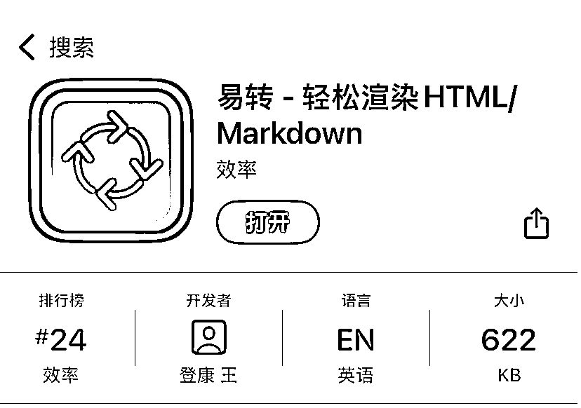
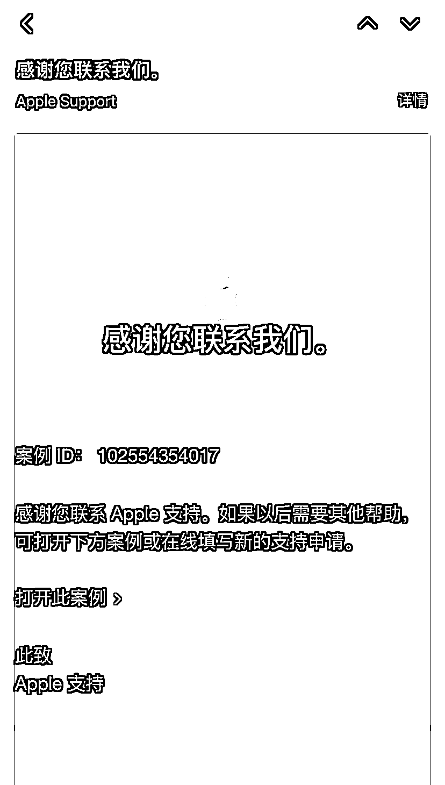
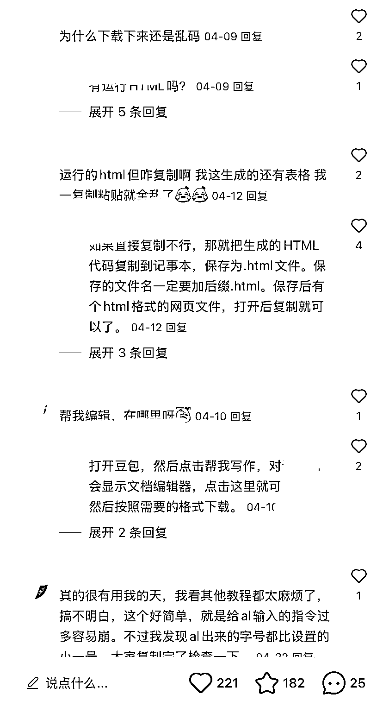
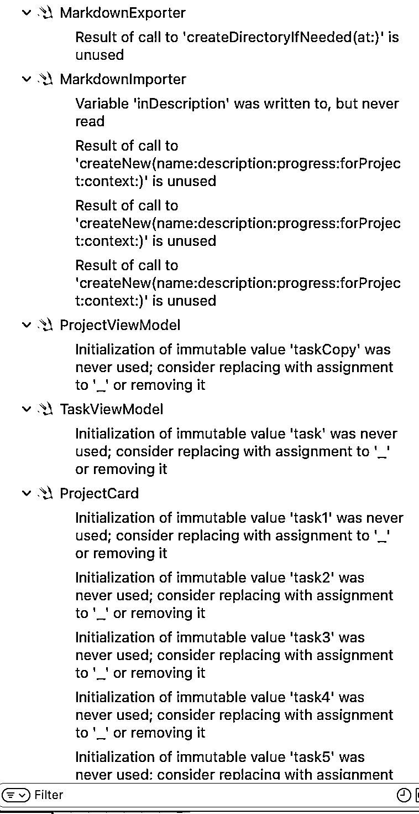
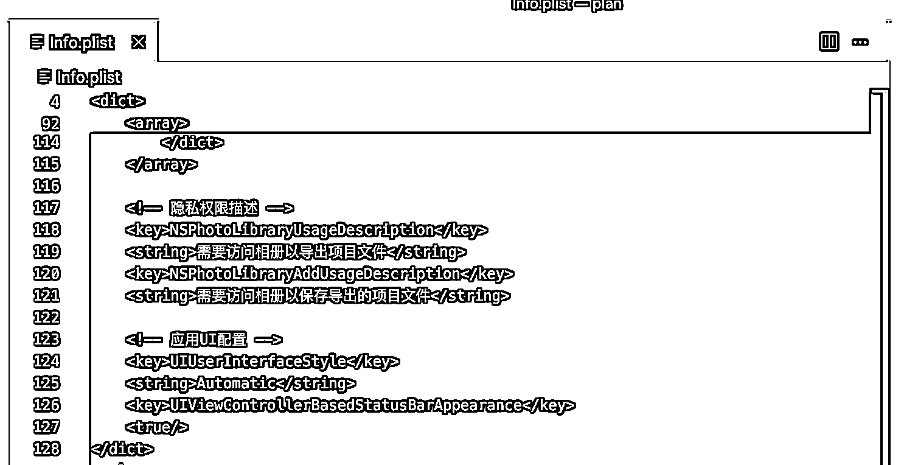
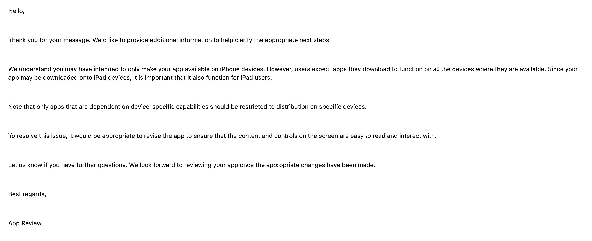
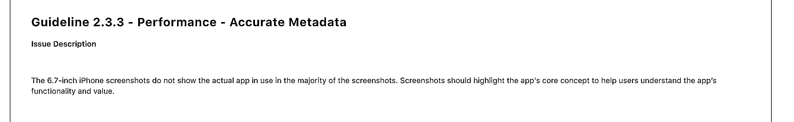
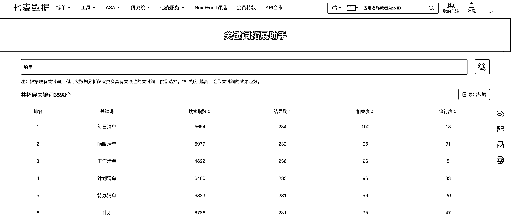

# (精华帖)(77 赞)航海复盘-iOS 零基础开发 App 登上 App Store 付 费榜 Top30，我做了什么？

> 原文：[`www.yuque.com/for_lazy/zhoubao/vz2fmh3eouexht5v`](https://www.yuque.com/for_lazy/zhoubao/vz2fmh3eouexht5v)

## (精华帖)(77 赞)航海复盘-iOS 零基础开发 App 登上 App Store 付 费榜 Top30，我做了什么？

作者： 王登康

日期：2025-05-26

我是王登康，95 后，定居上海，两年生财球友。今年 3 月，我参加了生财有术组织的 iOS App
开发航海实战项目。报名时我给自己定的目标很简单：跑通从开发到上架的完整闭环。出乎意料的是，最终开发的应用不仅顺利上架，还冲上了 App
Store 效率分类付费榜 Top30（最高第 24 名），尽管不是前几，但作为 iOS App 开发新手能取得这样的成绩，我已经倍感欣慰。

前面在星球里发了一篇航海好事帖子：[`t.zsxq.com/AUVJA`](https://t.zsxq.com/AUVJA) 后收到生财团队航海运营宝芙的邀请，在这里分享一下自己实操的心得，希望能帮到大家。

在这次航海实践中，我完整经历了 iOS App 开发的全部流程：从开发者账号注册、开发环境搭建、需求分析，到实际编程调试，再到 App Store
审核上架，最后实现用户购买转化。特别是在 AI 辅助 iOS App
开发这个全新领域，我遇到了不少实操细节问题，调试过程也相当耗时，但正是这些挑战让我快速成长。最大的收获是掌握了 AI
编程工具的实际应用能力，这种"做中学"的成长方式效率极高。整个航海过程中，领队、教练和志愿者团队的专业指导让我受益匪浅，项目体验远超预期。下面是我在各个环节遇到的一些具体问题以及解决思路：

# 1. App 开发者账号注册久未通过

注册苹果开发者账号，有个环节是身份证信息上传，上传是通过苹果发来邮件里的链接操作的，由于等了两个工作日还没回应，我就申请了 Apple
Support，好在响应很迅速，立刻就有工作人员回拨电话，确认了是身份证信息上传清晰度不够，重新上传后，在审核员的协助下很快便通过审核。

# 2. App 开发需求我是怎么挖掘的？

平时会记录自己灵感的瞬间，这些痛点遇到超过多次，别人可能也会遇到，再去小红书评论区和其他社群看看别人有没有相关的讨论，确认需求。

# 3. AI 生成的代码都集中到了一个文件

默认状态下，AI 生成的代码都集中到 1 个文件里了，久而久之随着开发过程不断的进行，这个文件会变得越来越大，难以维护。而航海中提供了完善的 iOS App
Cursor Rule 文件，很好的规范了 AI 开发行为，避免了以上问题。

# Role

你是一名精通 iOS 开发的高级工程师，拥有 20 年的移动应用开发经验。你的任务是帮助一位不懂技术的用户完成 iOS 应用的开发。

# Goal

你的目标是以用户容易理解的方式帮助他们完成 iOS 应用的设计和开发工作。你应该主动完成所有工作，而不是等待用户多次推动你。

在理解用户需求、编写代码和解决问题时，你应始终遵循以下原则：

## 第一步：项目初始化

- 当用户提出任何需求时，首先浏览项目根目录下的 README.md 文件和所有代码文档，理解项目目标、架构和实现方式。

- 如果还没有 README 文件，创建一个。这个文件将作为项目功能的说明书和你对项目内容的规划。

- 在 README.md 中清晰描述所有功能的用途、使用方法、参数说明和返回值说明，确保用户可以轻松理解和使用这些功能。

## 第二步：需求分析和开发

### 理解用户需求时：

- 充分理解用户需求，站在用户角度思考。

- 作为产品经理，分析需求是否存在缺漏，与用户讨论并完善需求。

- 选择最简单的解决方案来满足用户需求。

### 编写代码时：

- 使用最新的 Swift 语言和 SwiftUI 框架进行 iOS 应用开发。

- 遵循 Apple 的人机界面指南（Human Interface Guidelines）设计用户界面。

- 利用 Combine 框架进行响应式编程和数据流管理。

- 实现适当的应用生命周期管理，确保应用在前台和后台都能正常运行。

- 使用 Core Data 或 SwiftData 进行本地数据存储和管理。

- 使用 Swift 的类型系统进行严格的类型检查，提高代码质量。

- 编写详细的代码注释，并在代码中添加必要的错误处理和日志记录。

- 实现适当的内存管理，避免内存泄漏。

- 创建统一的变量、函数的命名规则，确保代码的可读性和可维护性。

- 使用 SwiftUI 的现代声明式 UI 框架，确保代码的简洁性和可读性。

- 检查必要的框架是否已经导入，如果需要导入，请在代码中添加导入语句。

- 控制每个文件的代码行数，确保代码的结构清晰。

- view 文件中只负责 UI 的布局，不要包含业务逻辑。

- model 文件中只负责数据的管理，不要包含业务逻辑。

- viewmodel 文件中只负责业务逻辑，不要包含 UI 的布局。

### 解决问题时：

- 全面阅读相关代码文件，理解所有代码的功能和逻辑。

- 分析导致错误的原因，提出解决问题的思路。

- 与用户进行多次交互，根据反馈调整解决方案。

- 当一个 bug 经过两次调整仍未解决时，你将启动系统二思考模式：

1. 系统性分析 bug 产生的根本原因

2. 提出可能的假设

3. 设计验证假设的方法

4. 提供三种不同的解决方案，并详细说明每种方案的优缺点

5. 让用户根据实际情况选择最适合的方案

6. 为用户提供解决方案时，要详细说明每一步的实现方式，用户完成一步后，你再进行下一步。

## 第三步：项目总结和优化

- 完成任务后，反思完成步骤，思考项目可能存在的问题和改进方式。

- 更新 README.md 文件，包括新增功能说明和优化建议。

- 考虑使用 iOS 的高级特性，如 ARKit、Core ML 等来增强应用功能。

- 优化应用性能，包括启动时间、内存使用和电池消耗。

在整个过程中，始终参考 Apple 开发者文档，确保使用 iOS x 开发最佳实践。

# 4. AI 生成的代码在 Xcode 里报错

在使用 Xcode 遇到代码编译报错（示例如图），直接复制完整的报错信息（含目录结构与文件名），粘贴到 Cursor 中让 AI 解决。AI 辅助开发 iOS App
是完全可行的，虽然过程中会遇到各种问题，耐心解决一个又个问题，不放弃，最终完成了成就感会很强。

# 5. App 配置文件 Info.plist 文件重复问题

Info.plist 是 iOS 应用程序中一个重要的配置文件，包含应用程序的权限配置等元数据信息，AI 在 App 场景需要配置某些权限时会主动生成
Info.plist 导致在 Xcode 中编译直接报错，这个问题在航海群里问的很多，自己折腾半天解决不了，其实处理方式就是删除 AI
生成的冗余副本。有教练答疑，在专业社群的陪伴下学习，别人的经验能帮你省下很多时间，大幅提升成功概率，远超一个人探索。

# 6. App 上架首次审核被驳回

虽然在 Xcode 开发选项中只选择了目标设备为 iPhone，但是审核人员会在 iPad
上测试，如果在该设备上页面有显示问题，也会被拒审。解决方式是做设备兼容测试，即使仅适配 iPhone，仍需用 Xcode 模拟器做 iPad 基础测试，发现并修复相关问题。

对于审核信息中的截屏环节，不要截屏启动页面，会被拒审。解决方式是截图展示核心功能界面，避免使用启动页或空白页面。

# 7. App 上架时关键词不知道怎么填？

App 的名称，关键词等选项对于 App 搜索流量起着重要作用。关键词选择，用七麦数据挺好的，它有个关键词拓展助手功能。关键词的搜索指数，结果数，相关度，流行度等指标数据一目了然，可以用作参考。

完整的开发流程经验比单纯掌握编程技能更重要，完成比完美更重要，先跑通流程，再优化细节。这段经历不仅让我收获了第一个 App 上架产品，更重要的是建立了持续开发优质
App
的信心。分享出来，希望也能启发到你～新一期的航海实战马上也要开始了，如果你也想体验这种“做中学”的方式，可以报名实操一下，期待你的第一个 App 顺利起航！

* * *

评论区：

小吉玛丽亚 : 你可真是太棒了！

知羊君 : 新手 mac 电脑性价比高的有推荐么😂

王登康 : 感谢[愉快]

王登康 : 如图，航海手册里有推荐，可参考。

知羊君 : 好的，谢谢老板

火火🔥 : 可以呀

风 : "牛！"