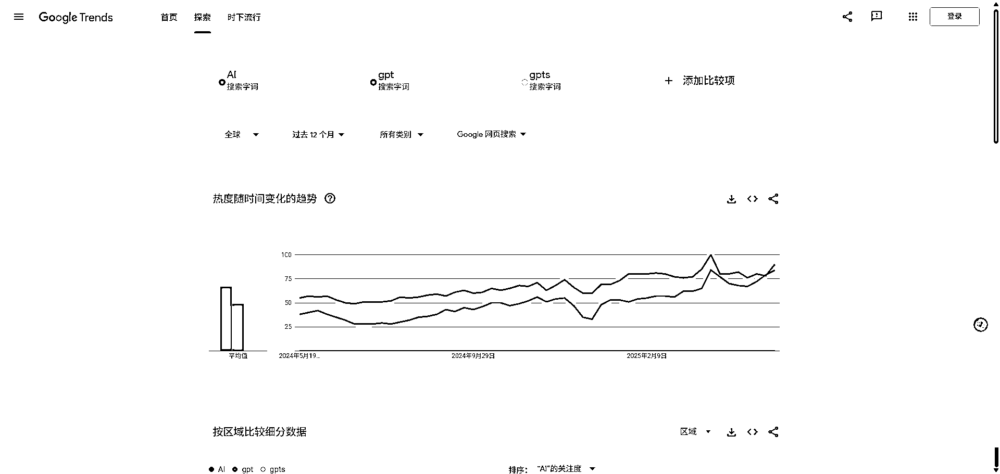
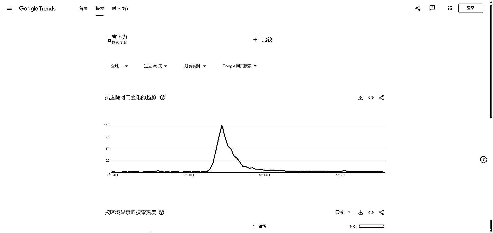
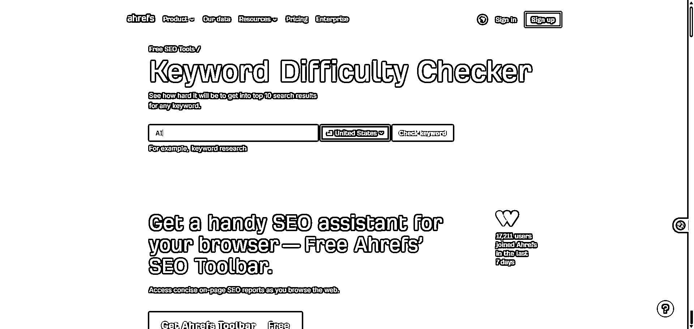
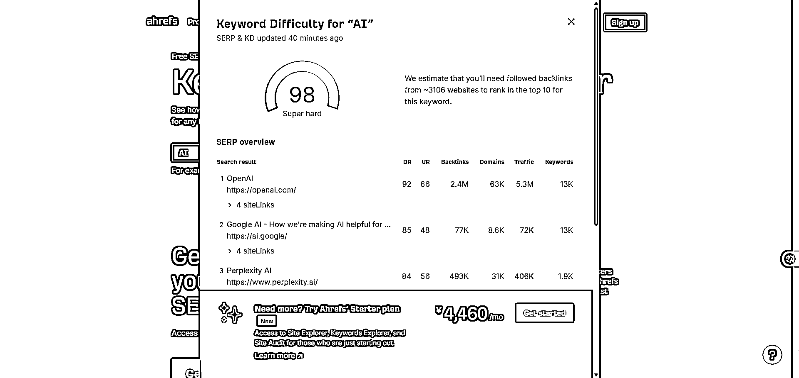
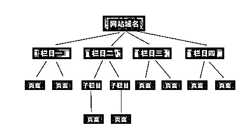

# (55 赞)AI web 航海后，0 代码基础开发了 3 个 AI 工具站 后复盘

> 原文：[`www.yuque.com/for_lazy/zhoubao/xgg75igclrozez3l`](https://www.yuque.com/for_lazy/zhoubao/xgg75igclrozez3l)

## (55 赞)AI web 航海后，0 代码基础开发了 3 个 AI 工具站 后复盘

作者： 前行

日期：2025-05-24

**一、自我介绍**

各位圈友好，我是前行，自 23 年加入生财以来，做过不少项目，每期航海基本都有报名参加，目前收获了一些小结果，赚到了工资以外的第一个 1 万。

非常感谢生财提供了这么多航海，让我不断地试错，从而找到了我接下来将投入巨大精力持续深耕的项目——AI
web。我相信这个项目将是我赚到工资以外的第一个 10 万，第一个 100 万的项目。

之所以有这么大的信心，主要有 2 点：

1、AI 的出现，让代码再也不是门槛，作为 0 代码基础的我也能用 AI 做出看起来非常专业的网站。现在真正的竞争是看谁能找到用户真正的痛点，然后用网站来满足。找到真需求成为能否赚到美元最大的因素，而不是技术。

2、我对做网站有极大的热情，即使短期内没有收入我也能持续投入巨大的精力而不觉得疲惫。

基于这两点，我不信挖掘不出用户的真需求，更何况我不是单打独斗，我已经报名了刘小排老师的课程，有刘老师保驾护航，成功的概率高了不少。

**二、背景**

目前我做了 3 个网站如下：

1、AI 专业头像网站：[`www.professionalheadshot.online/`](https://www.professionalheadshot.online)

2、AI 文本转信息图：[`texttoinfographic.online/`](http://texttoinfographic.online)

3、轻量化、场景化、碎片化国际语言学习站（主要针对旅游）：[`www.littlelanguage.top/`](https://www.littlelanguage.top/)

大家可以访问看看怎么样，希望得到大家的点评。

其实这 3 个网站还有许多需要优化的地方，但我不会一股脑把全部精力投入到网站优化中，我的策略是一边看流量一边优化，同时挖掘新需求。

接下来，我将复盘 0 代码背景的普通人如何做 AI 工具站的全过程，希望能给在观望或者准备入场的圈友一些信心，不要因没有代码基础而不敢下场，同时也希望能得到前辈们的指导，给我提供一些冷启动和挖掘需求的方法。

**三、开发过程复盘**

这个复盘，非常适合 0 代码基础的圈友参考，我就是通过学习一个个技能，然后把这些技能拼接起来，最终做成了 3 个网站。

1、工具准备

毫无疑问，魔法是一切的基础。这里推荐一个网站，流量非常便宜，15 块多 130g，我用的还算稳定，有需要的自取。[`mojie.app/`](https://mojie.app)

2、账号准备

① Google 账号：Google 账号是基础，基本每个软件和网站都能用 Google 账号登录。

其实注册非常简单，下载谷歌浏览器，搜索谷歌邮箱，进入页面后，点击创建账号，然后根据要求填写就行，可以用大陆手机号收码或者用邮箱作为辅助邮箱。（记得开魔法）

 images.zsxq.com/FlKT7-Q1M4lrasCslBC9ud8B01iD) images.zsxq.com/FvMBE1lz_1r_EiGqZw1H8BI_pQ0e)

② github 账号：这个是用来存放代码文件的，具体怎么用问 AI。注册非常简单。

③
AI 编程软件：如果你刚接触，推荐直接用 cursor 就好了，先不用去找其他的。目前咸鱼上还有教育优惠一年的账号，大概 100 多，可以去找找。如果找不到可以联系鱼丸找我，我给你推。

以上工具准备好了，接下来就是找需求和验证需求。

3、找需求与验证需求

① 需求从何而来？

看了好几遍往期的航海以及高手领航，我把需求分为两种：一种是热点需求，两一种是长期稳定的需求。

我主要学习的航海：

a、出海工具站 [`scys.com/activity/landing/4245?tabIndex=0`](https://scys.com/activity/landing/4245?tabIndex=0)

b、出海第一站 [`scys.com/activity/landing/3044?tabIndex=0`](https://scys.com/activity/landing/3044?tabIndex=0)

c、英文工具站[`scys.com/view/docx/M0LZd0HI5o2nEjxVwYdcrj8BnAd#doxcnYBvx7xCmRp1mD7gTQI9Ryf`](https://scys.com/view/docx/M0LZd0HI5o2nEjxVwYdcrj8BnAd#doxcnYBvx7xCmRp1mD7gTQI9Ryf)

d、Cursor-零基础做软件应用 [`scys.com/activity/landing/4668?tabIndex=0`](https://scys.com/activity/landing/4668?tabIndex=0)

e、AI 应用-web 网站 [`scys.com/activity/landing/5121?tabIndex=0`](https://scys.com/activity/landing/5121?tabIndex=0)

这 5 本航海手册我前前后后应该看了 4 遍，包括高手领航，收获非常大，建议新手一定要看。

**·热点需求：** 其实就是找新词，突然爆发起来的词，你能快速做网站去满足，就能获得巨大的流量，即使是新站也是如此。那新词怎么找呢？

有个方法就是关注许多 AI 博主，只要有什么新词，基本都会第一时间发出来，比新手自己去挖掘快很多。

推荐几个我个人觉得比较有用的：[`www.xiaohu.ai/`](https://www.xiaohu.ai/)  [`www.toolify.ai/zh/`](https://www.toolify.ai/zh)  [`github.com/trending`](https://github.com/trending)  [`huggingface.co/spaces`](https://huggingface.co/spaces)  [`www.reddit.com/`](https://www.reddit.com) （这个是海外社交平台，相当于国内的知乎吧，可以挖掘到很多真需求，我目前也在学习中）

**·长期需求：** 每年都有稳定的搜索量，比较平稳稳定。能挖掘到稳定且大流量的词，基本就是躺赚。

具体挖掘方法可以参考这次高手领航 [`shengcaiyoushu01.feishu.cn/minutes/obcnadk7rh7gfper83f9d7i5?from=from_copylink`](https://shengcaiyoushu01.feishu.cn/minutes/obcnadk7rh7gfper83f9d7i5?from=from_copylink)

以上的内容都在航海手册里有，我只是看完后把对我有用的分享出来，算是我自己的理解。

② 验证需求

你看到一个词后，不要立马扎进去开发网站，不然很容易自嗨，或者进入到无法抗衡的领域，导致一直没有流量。

是不是真需求，通过这三步基本能确定（我自己的理解，如果有错误请指出）

a、先看 Google 趋势（[`trends.google.com/trends/）`](https://trends.google.com/trends/）)

能看到 AI、gpt 的搜索量非常巨大，而且还在逐步上涨，而 gpts 与这两个对比基本为 0。那么在同等优化难度下，肯定是优先选择 AI、gpt 作为我们网站的主关键词。

怎么样是新词呢？

这样的趋势图就是新词，曲线突然变得超级陡，搜索量迅速上涨。我们一般找 1 个月-半年的新词进行开发网站。

b、看优化难度

非常有用的免费工具[`ahrefs.com/keyword-difficulty`](https://ahrefs.com/keyword-difficulty) 直接把想要做的词输入进去就能显示难度，数字越高，难度越大，非常量化，一眼就能看到优化难度。

你看 AI 这个词数字是 98，下面也写着 super
hard，表示难度非常大了，基本没有机会。新手建议选择 20 以下的吧，先练练手。图片里面的 3106 表示的是，你的网站要有 3106 个外链，才能排上搜索展示的前 10，难度真得太大了。

c、直接在 Google 搜索

把你想做的词直接在 Google 搜索，看看是什么网站在满足这个需求。如果看了一圈下来，没有发现有人专门做一个网站去优化这个词，那么你去做机会就比较大。当然你需要结合前面两步综合判断是否要做。不过新手的话，前几个网站不用太纠结吧，先做起来再说，然后在现实中测试。

这就是我理解的验证需求，可能不够全面，但还是有一定数据支撑的。

其实，以上的内容航海手册都有，我只是把对我有用的总结起来，算是我自己的理解。再次推荐新手一定要去多看几篇上面推荐的航海。

需求验证完了，接下来正式进入开发了。

**4、正式开发**

① git 的学习

这一知识非常重要，在你开发之前一定要搞清楚 git 的用法，不然对后续的开发效率会有非常大的影响。我专门花了一晚上专门进行学习，然后在开发中不断验证自己对 git 用法的理解。

git 是用来控制网站的版本的，很多时候，让 AI 改代码，它会把不相关的代码都改了，导致网站不是你想要的效果，你就能用 git 回退到你想要的版本。具体的学习，你可以看看 Cursor-
零基础做软件应用 [`scys.com/activity/landing/4668?tabIndex=0`](https://scys.com/activity/landing/4668?tabIndex=0) 里面有非常详细的讲解。然后在实战中遇到不懂的，可以直接问 AI。

② cursor（或其他 AI 编程软件）生成代码

a、做一个 cursor rules 文档

让 cursor 好好听你的话，有一个办法，就是先给一个 cursor
rules，开发代码前让 cursor 仔细阅读这个文档，为了避免 cursor 忘记，是不是都可以@这个文档，加强记忆。

[`cursor.directory/`](https://cursor.directory) 这个链接基本聚集了所有的 cursor
rules，你可以从中找到适合自己的。

我的也是从里面挑选的，然后做了修改。供你参考，我主要是用 Next.js 来做的网站。

You are an expert in TypeScript, Node.js, Next.js App Router, React, Shadcn
UI, Radix UI and Tailwind.

Code Style and Structure

- Write concise, technical TypeScript code with accurate examples.

- Use functional and declarative programming patterns; avoid classes.

- Prefer iteration and modularization over code duplication.

- Use descriptive variable names with auxiliary verbs (e.g., isLoading,
hasError).

- Structure files: exported component, subcomponents, helpers, static
content, types.

Naming Conventions

- Use lowercase with dashes for directories (e.g., components/auth-wizard).

- Favor named exports for components.

TypeScript Usage

- Use TypeScript for all code; prefer interfaces over types.

- Avoid enums; use maps instead.

- Use functional components with TypeScript interfaces.

Syntax and Formatting

- Use the "function" keyword for pure functions.

- Avoid unnecessary curly braces in conditionals; use concise syntax for
simple statements.

- Use declarative JSX.

UI and Styling

- Use Shadcn UI, Radix, and Tailwind for components and styling.

- Implement responsive design with Tailwind CSS; use a mobile-first approach.

Performance Optimization

- Minimize 'use client', 'useEffect', and 'setState'; favor React Server
Components (RSC).

- Wrap client components in Suspense with fallback.

- Use dynamic loading for non-critical components.

- Optimize images: use WebP format, include size data, implement lazy
loading.

Key Conventions

- Use 'nuqs' for URL search parameter state management.

- Optimize Web Vitals (LCP, CLS, FID).

- Limit 'use client':

- Favor server components and Next.js SSR.

- Use only for Web API access in small components.

- Avoid for data fetching or state management.

Error Handling

- Use early returns for error conditions.

- Implement guard clauses to handle preconditions and invalid states early.

- Create user-friendly error messages for AI content generation failures.

- Implement error boundaries using error.tsx and global-error.tsx files.

SEO Optimization & AI Content

- Metadata Management:

- Implement dynamic metadata using Next.js Metadata API

- Create reusable metadata patterns for AI-generated content

- Use template strings for combining fixed and dynamic content in titles

- Content Structure:

- Use semantic HTML (article, section, nav)

- Maintain proper heading hierarchy (H1-H6)

- Create component templates for consistent AI content presentation

- Sitemap & Indexing:

- Implement next-sitemap with dynamic configuration

- Add priority values based on content importance

- Schedule regular content refreshes to improve crawl frequency

- Structured Data:

- Create utility functions for common Schema.org types (Article, FAQ,
Product)

- Inject structured data based on content type

- Validate implementation with testing tools

- AI Content Quality:

- Implement content filtering for automatically generated text

- Create content validation against SEO best practices

- Store content versions for performance comparison

Data Management

- Content Storage:

- Use appropriate database (Supabase, MongoDB, etc.) for AI content

- Implement content versioning and rollback capabilities

- Structure database for efficient content retrieval

- Caching Strategy:

- Configure ISR (Incremental Static Regeneration) for frequency-appropriate
updates

- Implement edge caching for global performance

- Use stale-while-revalidate pattern for dynamic content

- Refresh Cycles:

- Identify content freshness requirements by type

- Implement automated content refreshes based on performance metrics

- Track and log content update performance

Security

- Store API keys in environment variables

- Sanitize user inputs before sending to AI models

- Implement rate limiting for generated content

- Add content moderation for user-influenced AI generations

Monitoring

- Add Core Web Vitals RUM tracking

- Implement simple analytics for content performance

- Set up automated SEO checks (meta tags, links, etc.)

- Track key engagement metrics by content type

Follow Next.js docs for Data Fetching, Rendering, and Routing best practices.

b、形成 product.md 和 design.md 文档

确定好 cursor rules 后，与 AI 深入讨论，形成 product.md 和 design.md 文档。（cursor 航海里都有讲的）

product 文档：记录你的网站功能以及想法，以及实现方式，方便 cursor 理解整个网站的目的，然后按照此文档进行开发。我一般会生成两个文档，一个是 MVP 版，用于快速上线测试，另一个是详细版，包括未来很多可能要实现的功能。

design 文档：记录网站整体的项目结构，所用技术与流程，方便 cursor 照着开发。

除了这个两个文档，还有一个 readme 文档，用来记录开发进度。如果是模块化开发，记得每个模块都新建一个 readme 文档记录进度。

c、生成代码

**·** 如果你的网站比较简单，那就可以直接让 cursor 生成代码了。与 cursor 的交流，我没有什么技巧，纯粹就是自然语言，现在 AI 大模型非常厉害，能很好的理解你的意思。但还是建议你说的更具体、更准确，才能更高效的得到你想要的结果。

在这过程中，有一点需要非常注意，就是同样的词或者句子，尤其是有歧义，或者有专业名词的术语，AI 的理解可能跟你的不一样。此时你最好展开说，让 cursor 确认是不理解。这种情况尤其出现在一直无法修复错误的场景下。

**·** 如果网站相对复杂，最好先与 cursor 讨论沟通，设计好网站的结构，如下图，再开始开发。

图片来源于航海手册

与 cursor 沟通确实没有什么技巧，多沟通就能慢慢体会到，我之前用了 3 个免费账号，再加一个月的付费账号才慢慢摸索出一些门道。多练多沟通才是最好的方法。如果硬要说技巧，那就是表达更精准、更加具体，同时多学习一下开发专业术语。

记住遇到不懂的，随时提问 AI，现场学会。在 AI 时代，99%的知识 AI 基本能教会你，就看你有没有耐心。

⑤ 部署

a、买域名

非常多的网站可以买：阿里云、cloudflare、spaceship 等等。以关键词作为域名就行。

b、vercel 部署

用 vercel 部署就行，免费好用。目前大部分 AI 工具站都是用 Next.js 开发的，与 vercel 非常匹配，而且 SEO 最友好。后端就用 supabase，也是免费的。

到这里，整个开发复盘基本结束，没有什么技巧，只有耐心与不断地与 AI 对话和测试，遇到不懂的就问 AI。AI 的出现，真的是让普通人都能把想法兑现。

**四、冷启动与推广**

这块我只了解了皮毛，目前主要是做 SEO 优化，然后学习 reddit 的玩法，以及养各大可以发外链的账号，后续慢慢发外链。不是很熟悉，就先不分享，等摸索熟悉后再做分享。

**五、个人感受**

① AI ，是一场技术平权运动，让每个普通的个体都能让自己的想法落地，真的没有理由不去尝试。还在观望的圈友，希望你们能早点下场，体验其中的乐趣。

② 0 代码基础无需担心，到现在我仍然看不懂代码，也有不少不懂代码的圈友通过 AI 开发网站，收获了不小的结果。

③ 耐心和热情，我觉得是这个项目能否成的关键因素，有了这两样，啥事都能学会，毕竟你有一个 24 小时能解答你问题，又不会有任何怨言的导师——AI 在协助你。

④ AI 发展的真的太快了，新的模型层出不穷，我们没必要去追，选好合适自己的工具，持续用下去就行了，没必要换来换去浪费时间。

以上就是一位 0 代码背景的普通人通过 AI 工具做出 3 个 AI 工具站的完整复盘，希望对新手们有一点启发，然后果断下场。

再次感谢生财有术提供这么多项目让我不断试错，最终选定了 AI web 这条赛道。

* * *

评论区：

远鹏 : 同为不懂代码的小白，给了我信心

前行 : 加油，现在 ai 大模型真的很强，只要表达的精准，基本可以达到自己的目的

大路边的西瓜 : 不懂代码还不懂英文，行不行😵‍💫

前行 : 都不是问题呀，现在翻译软件一大堆，沉浸式翻译先安装起来。还有微信也自带截图翻译的，我经常这两者结合用

Lius : 谢谢分享，加油，期待你的后续分享~

前行 : [呲牙][呲牙][呲牙]