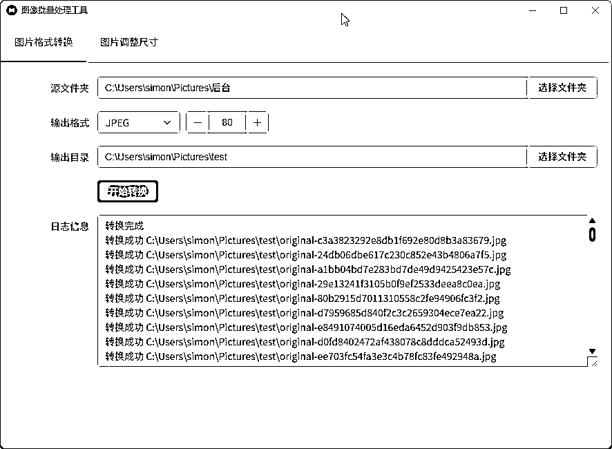
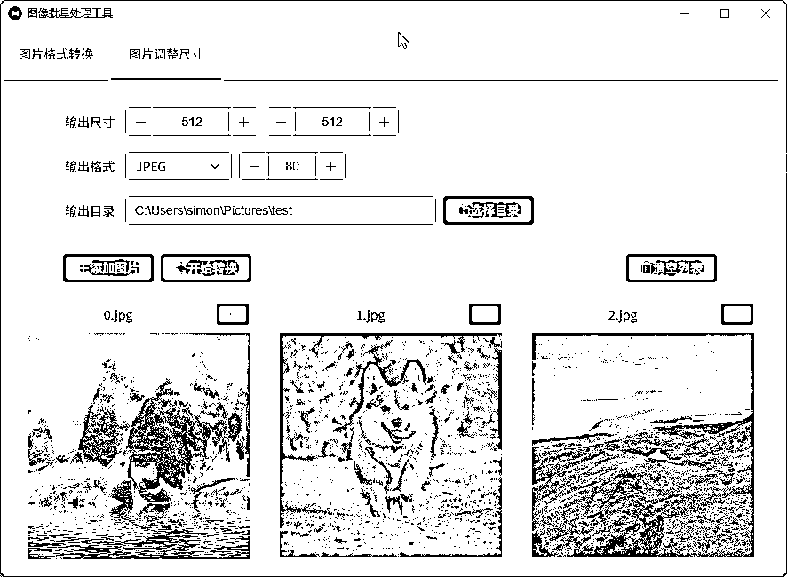
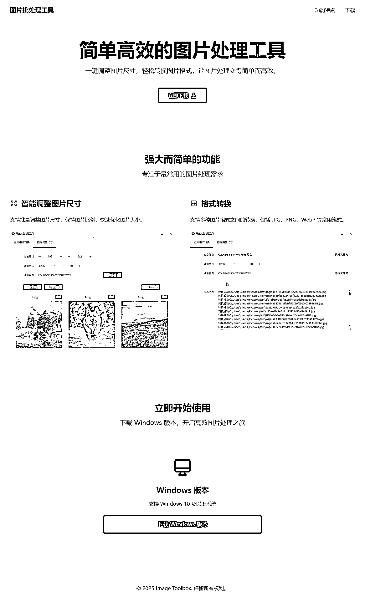

# (22 赞)花了 2 个小时用 Cursor 写了个图片处理工具

> 原文：[`www.yuque.com/for_lazy/zhoubao/qv13wcg2z1g7xf47`](https://www.yuque.com/for_lazy/zhoubao/qv13wcg2z1g7xf47)

## (22 赞)花了 2 个小时用 Cursor 写了个图片处理工具

作者： 思明

日期：2025-05-27

平时经常需要批量对图片进行处理，一直没有找到一个称手的工具，今天就用 cursor 写了个图片批量处理的小工具。

# 软件开发

起手指令：

这是一个 wails 项目,后端使用 go,前端使用 vue3,element-plus

# 项目名称

图片批量处理工具

## 功能

- 图片批量格式转换

- 选择图片文件夹

- 选择要转换成什么格式（jpg/png）

- jpg 质量

- 选择要输出的位置

- 开始转换按钮

- 图片批量调整尺寸

- 设置目标尺寸

- 设置要输出的位置

- 设置要输出的格式（jpg/png）

- jpg 质量

- 添加图片按钮

- 移除图片按钮

- 开始调整按钮

## 界面

- 菜单栏

- 页面

- 图片格式转换

- 图片调整尺寸

## 菜单栏

- 图片格式转换

- 图片调整尺寸

## 代码要求

- 代码要注释

## 目录结构

- frontend // 前端

- src

- components //组件

- pages // 页面

- router

- stores

- utils

- assets

- App.vue

- main.ts

- main.go

- app.go

中间经过不断的调整，最终成品展示：

# 再写个宣发页面

想着把这个软件放出去给大家用，于是就让 cursor 再给写一个用于宣发下载的页面。

为这个软件生成一个宣传的静态页面，页面上要提供下载地址。

软件的两个功能的截图放在 web\images 下了

生成的宣传页放到 web\index.html

网页使用 html+tailwind css ，

[#设计风格]

优雅的极简主义美学与功能的完美平衡;

- 恰到好处的留白设计;

- 细腻的微交互;

- 舒适的视觉比例;

- 响应式设计

- 支持内容区域自适应

- 移动端优先考虑核心功能展示

[#技术规格]

- 简洁的 html 结构

- 图标:引用在线矢量图标库内的图标(任何图标都不要带有背景色块、底板、外框）

- 图片: 使用开源图片网站 unsplash 链接的形式引入

- 样式必须引入 tailwindcss CDN 来完成

效果如下：

# 体验地址

只支持 window10,11。64 位

[[http://image-toolbox.app.yesiming.com/]](http://image-toolbox.app.yesiming.com/])([`image-`](http://image-) toolbox.app.yesiming.com)

* * *

评论区：

 二猫 : 顶