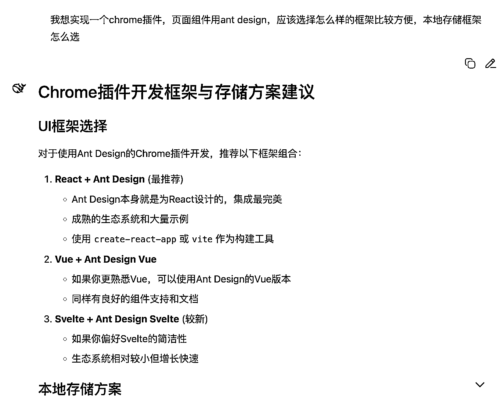
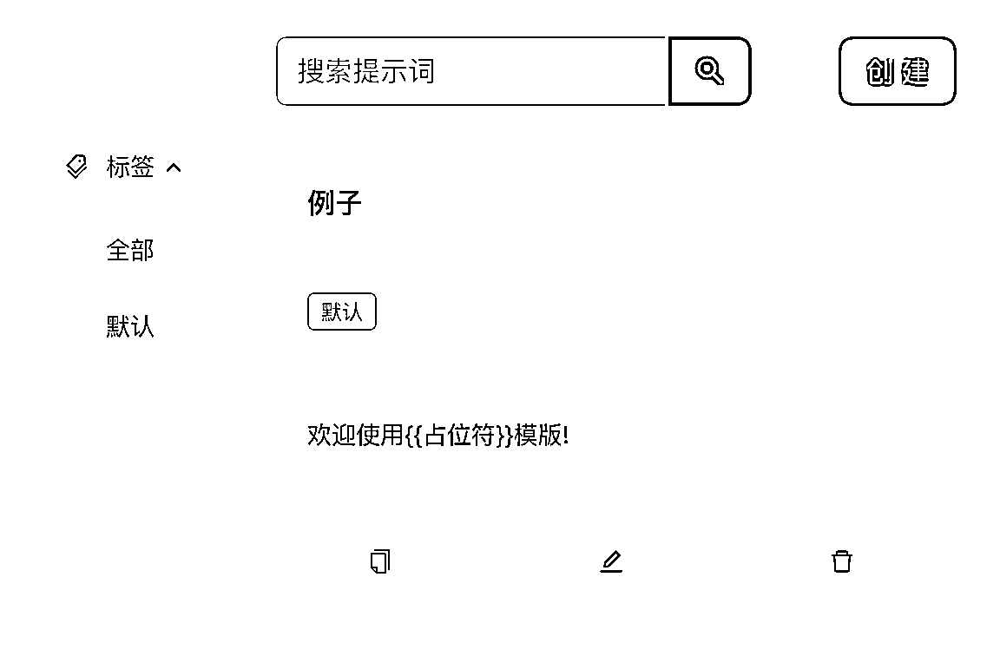
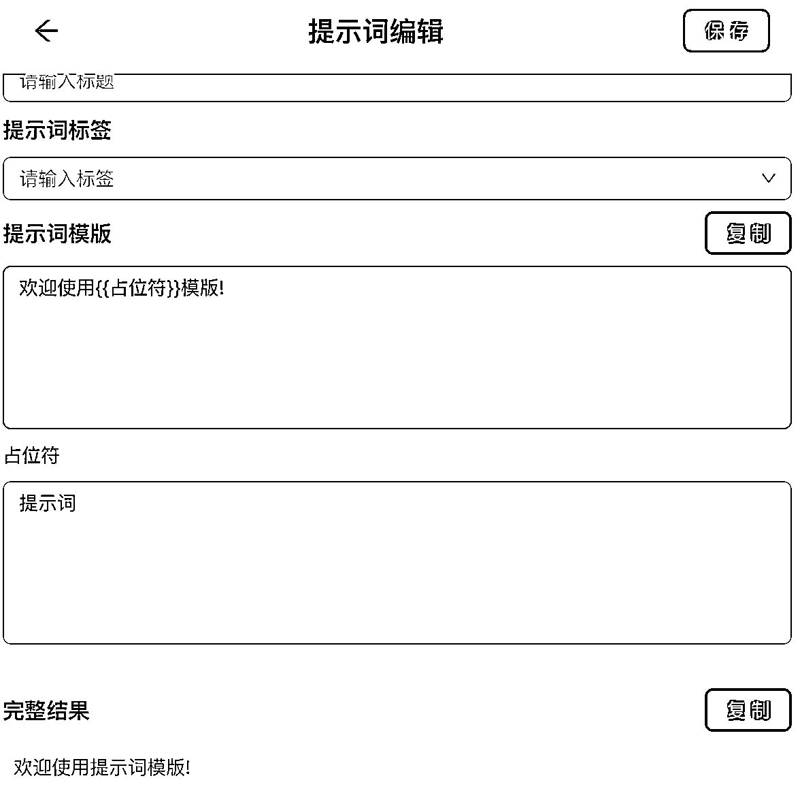
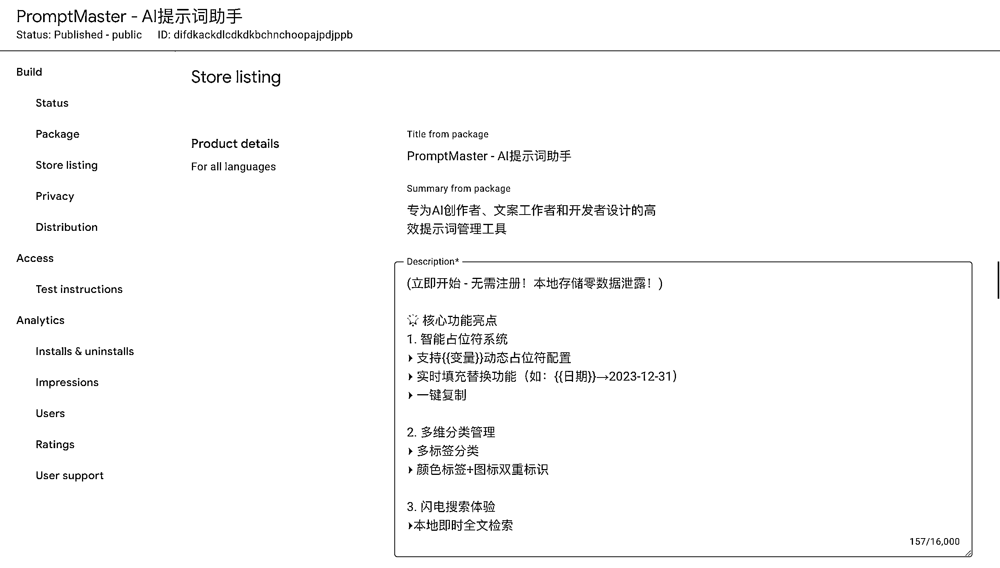

# (23 赞)单用 DeepSeek 开发 chrome 浏览器插件，并完成 上架

> 原文：[`www.yuque.com/for_lazy/zhoubao/vw3v4ayxpps4afk4`](https://www.yuque.com/for_lazy/zhoubao/vw3v4ayxpps4afk4)

## (23 赞)单用 DeepSeek 开发 chrome 浏览器插件，并完成 上架

作者： 墨迹禾

日期：2025-05-25

大家好，我是墨迹禾，主业程序员，去年双 11 加入生财，第一次在生财发帖。

这半年看了很多帖子，理论知识和见识暴涨，但是自己下场实践的时间太少，每天只抽一小时研究生财。

转折点发生在 51 假期，我刷到一篇圈友关于 prompt 管理的 chrome 插件开发，人家还是零基础通过 ai 开发。

想到 prompt 管理相关的小工具的想法还记在我的 TODO List 里，如果不是看到这篇，估计跟我平时收藏的文章一样，一直积灰。

我当时被刺激到了，脑子突然蹦出来亦仁等大佬们经常说的那句话，**要先下场干起来，先把手弄脏！**

本着生财**利他** 的价值观，做产品要先**MVP** 的指导思想，我准备先尝试最简单、最基础功能 prompt 管理的 chrome 插件，完成后再上架应用商店。

最后在 51 假期用 deepseek 完成大部分功能，最近完善测试并发布到了应用商店，名字叫（PromptMaster - AI 提示词助手）

<[`chromewebstore.google.com/detail/promptmaster-`](https://chromewebstore.google.com/detail/promptmaster-) ai 提示词助手/difdkackdlcdkdkbchnchoopajpdjppb>

说真的，完成上架的那一刻，对自己来说是一种非常大的正反馈！

下面我分享整个过程，希望能帮助到大家。

# 制定 MVP 功能目标

一、创建 prompt 页面  1、prompt 信息本地保存  2、prompt 占位符模版处理

二、查询管理 prompt 页面  1、prompt 标签  2、prompt 搜索

# 功能开发

作为程序员的职业习惯，对于未知领域先去熟悉了官网的文档，这里只做了大致的了解，因为后面只要是 deepseek 来开发，不需要深入。

再看了官方 demo 代码集，了解大致的工程结构和一些场景功能实现。

<[`github.com/GoogleChrome/chrome-extensions-`](https://github.com/GoogleChrome/chrome-extensions-) samples/tree/main/functional-samples/tutorial.hello-world>

当然，对于技术零基础的朋友来讲，上面的步骤没必要去关注，直接问大模型就行了。

我编辑器用的是 Visual Studio Code，大模型只用 deepseek。

先问整体的实现框架，后面再实现具体页面。

页面组件使用 ant design

[`ant-design.antgroup.com/components/overview-cn`](https://ant-design.antgroup.com/components/overview-cn)

工程框架 react + typescript

数据存储框架 dexie

这些都是通过问 deepseek 推荐选择的

怎么跑工程，怎么实现页面，直接问题 deepseek, 基本上边问边改，不行继续问，基本上都能解决问题。

最后还要弄个不同 logo，这里我没花时间，直接挑了官方 demo 工程里的 logo。

### 插件上架

开发完成之后，把整个工程打包 zip，发布应用商店，官方也有专门的文档  [`developer.chrome.com/docs/webstore?hl=zh-cn`](https://developer.chrome.com/docs/webstore?hl=zh-cn)

这里直接遇到了卡点，就是需要注册开发者账号才行，需要 5 刀。

可能很多朋友在这放弃了，直接发给大家 zip 本地解压也可以本地使用，但是后续可能升级，改 bug 之类后更新就不放便了。

**这里我直接在某宝上搜索 chrome 注册开发支付， 花了 70 多块钱快速搞定支付问题。**

最后只要填好相应信息就提交审核就可以了，这里的描述也是让 deepseek 生成的。

图片需要 1280*800，这个直接截图后，然后去搞定设计调整好尺寸。

另外上架了，后台也会有插件的安装卸载、用户数等等相关信息可以观察。

我不需要任何权限，也不要联网调用接口，审核第二天就过了。

# 收获

1、本来我不熟悉前端相关技术，经过这次实践，我对前端技术已经有了大致的感觉，以后开发网站啥的更有帮助

2、从三天打鱼两天晒网到集中精力完成一个小项目，踏出了真正实践的第一步，后续要持续提升执行力

3、从潜水的习惯到第一次发帖，也是一种自我突破，后续多多实践再分享

* * *

评论区：

七天@生财有术 : 从 0 到 1 闭环真不错哇！可以后续再分享下这个插件的使用和商业化的进展~