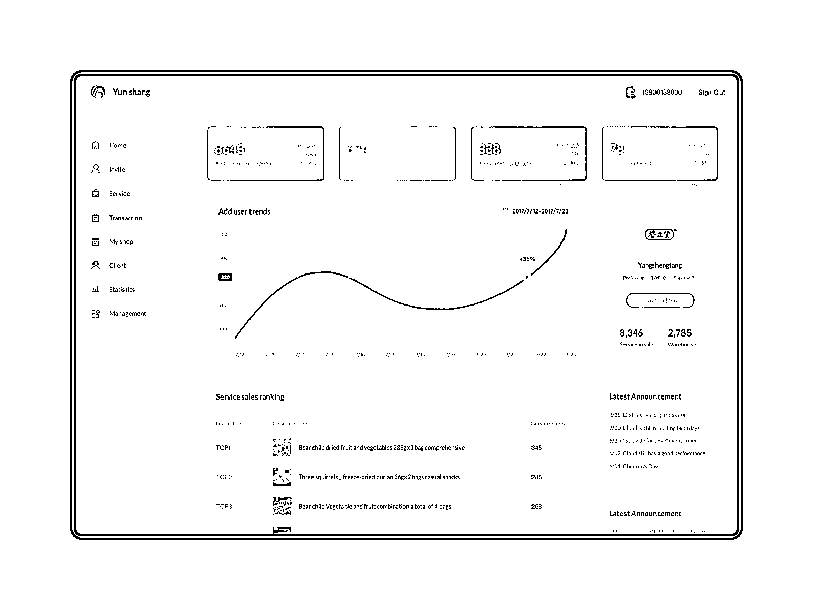
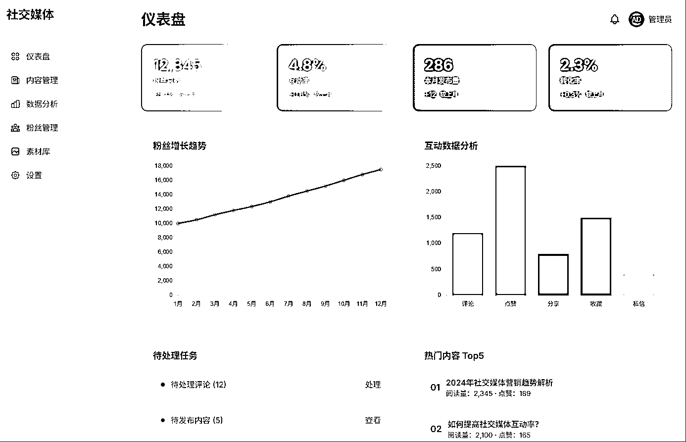
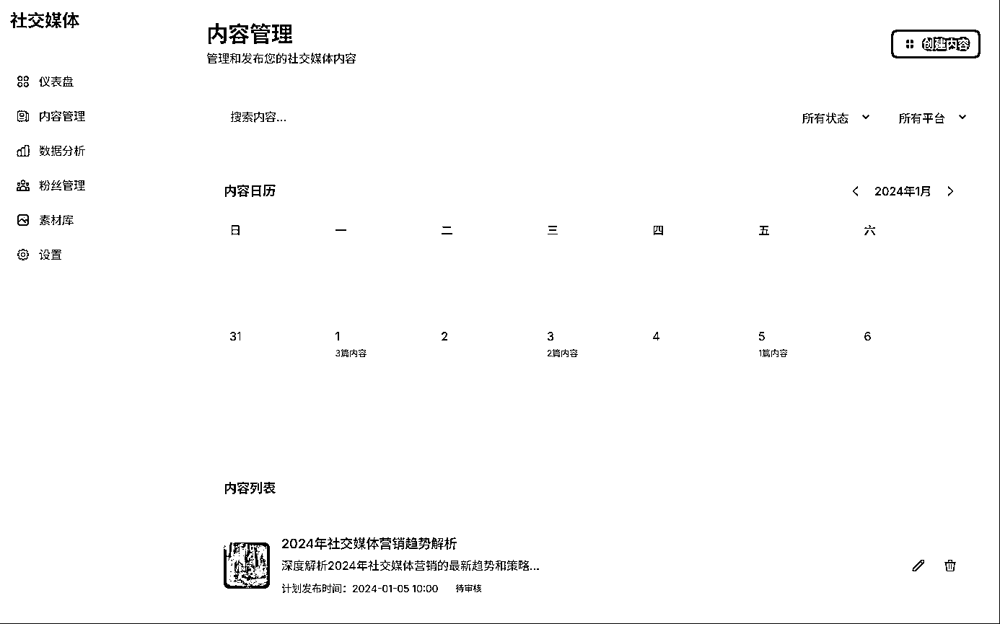
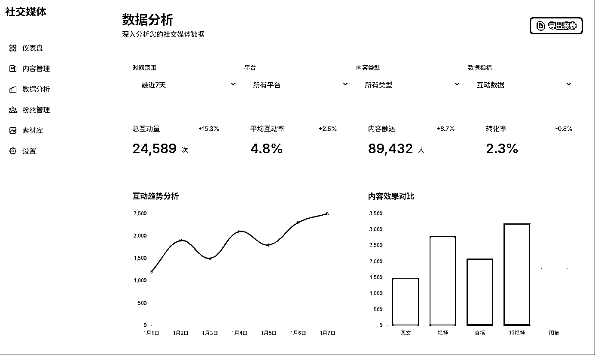
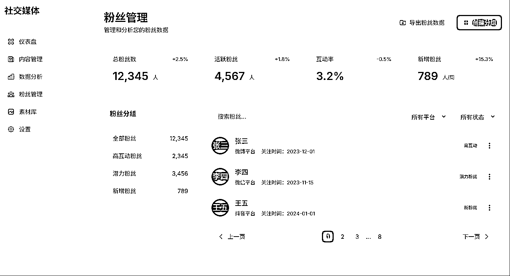
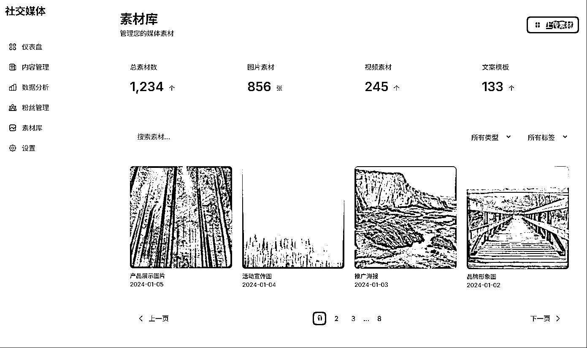
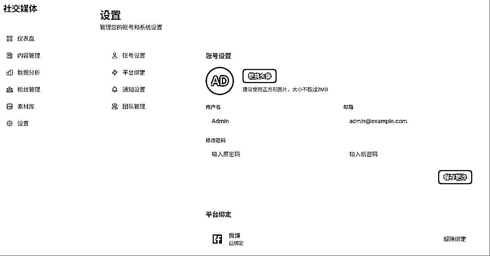

# (18 赞)AI 怎么通过参考图生成 UI,UI 规则复用指令

> 原文：[`www.yuque.com/for_lazy/zhoubao/wtf5sr4ag5rox97t`](https://www.yuque.com/for_lazy/zhoubao/wtf5sr4ag5rox97t)

## (18 赞)AI 怎么通过参考图生成 UI,UI 规则复用指令

作者： 思明

日期：2025-05-26

网上有很多通过 cursor,trae 之类的 AI 编辑器生成 UI 的教程,这边介绍一下我的一些经验，如何让 AI 生成的 UI 的时候,更加的可控．

## 参考图

我从网上找了一个后台的设计图,我希望使用同样的风格和布局. AI 生成效果图如下:  images.zsxq.com/Fh9uDgwQGyQHelFlYZgybEucHuZ2)

同时可以将此 UI 效果直接生成一个 UI 设计规范指令, 应用于后续的项目上, 或修改现有项目的 UI 效果如下:

指令有点长,请移步飞书察看全文:

[`fi9q1sf4gu.feishu.cn/docx/GYksdakjQoTGtlxnxiOcLA39nzh?from=from_copylink`](https://fi9q1sf4gu.feishu.cn/docx/GYksdakjQoTGtlxnxiOcLA39nzh?from=from_copylink)

* * *

评论区：

何西 : 有用。感谢