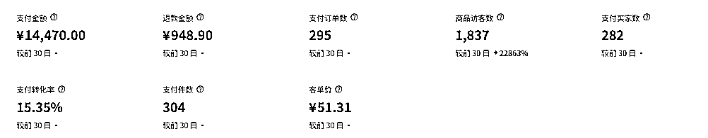

# (精华帖)(92 赞)持续终会有结果，两周利润 6000+，参与《小红书电商-蓝海实拍》航海经验分享

> 原文：[`www.yuque.com/for_lazy/zhoubao/gutuq1egk55nb6lz`](https://www.yuque.com/for_lazy/zhoubao/gutuq1egk55nb6lz)

## (精华帖)(92 赞)持续终会有结果，两周利润 6000+，参与《小红书电商-蓝海实拍》航海经验分享

作者： 风声

日期：2025-05-27

大家好，我是风声，进入生财之前一直在会计师事务所从事审计工作，参与并带队过各种企业的 IPO、年审、专审等项目。因为对频繁的出差渐渐开始不适应，所以开始寻找新的出路，后面通过书豪老师了解并加入到了生财。

通过阅读精华帖以及参加航海极大的拓宽了我的视野，并在这个期间顺势走出了职场，目前一直在做的项目除了老本行以外还有**同城家教中介** 以及**小红书电商** ，感谢生财团队宝芙的邀请，在此对最近刚拿到一点小结果的小红书电商进行一个复盘。也非常推荐新进入生财的圈友可以**“把手弄脏”，参与航海** 。

本次复盘已整理至飞书文档，欢迎大家查阅~

[`vx6swdb957w.feishu.cn/docx/BZIJd7kk2oqOUGxTmZXcuW4JnX0?from=from_copylink`](https://vx6swdb957w.feishu.cn/docx/BZIJd7kk2oqOUGxTmZXcuW4JnX0?from=from_copylink)

* * *

评论区：

亮哥 AI : 链接打不开

风声 : 感谢提醒[太阳]，已经可以啦

田园幼儿园 80224* : 感触很深啊

JIE : 我参加了但没有取得成果，学习下取得成果的人怎么做的[流泪]

风声 : 航海只是个开始，结束以后也继续加油[拥抱]

风声 : 谢谢圈友

火火🔥 : 厉害

风声 : 谢谢~只是小结果，大家一起学习