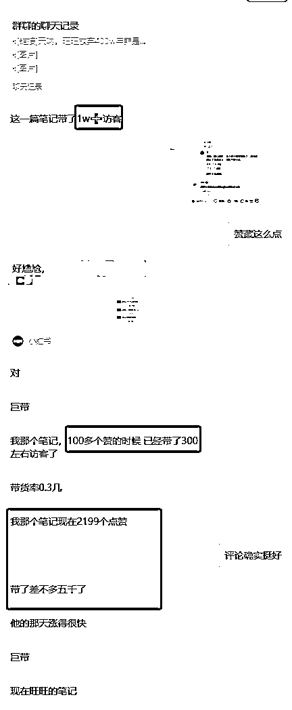
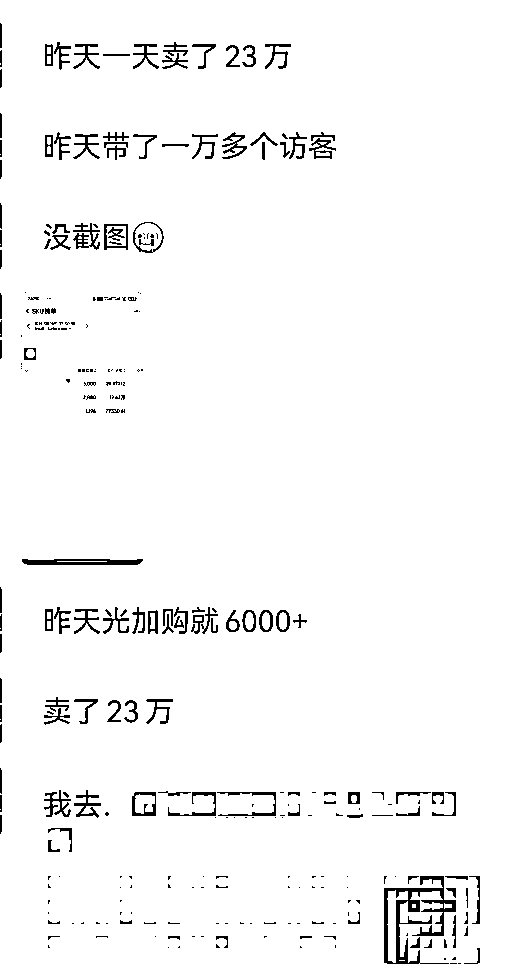
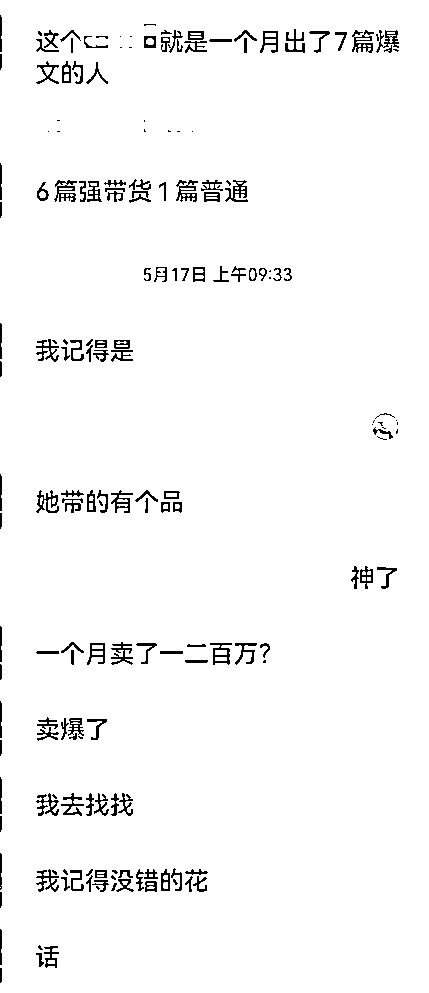

# (10 赞)拆解一个小红书年入 3000W 的赚钱项目（20-50 人）

> 原文：[`www.yuque.com/for_lazy/zhoubao/znw04gzogmsslke8`](https://www.yuque.com/for_lazy/zhoubao/znw04gzogmsslke8)

## (10 赞)拆解一个小红书年入 3000W 的赚钱项目（20-50 人）

作者： 佐伊 123

日期：2025-05-28

作为 5 年老圈友，潜水多年，之前得闲写了一篇关于小红书商单的分享没想到侥幸进了传术师俱乐部，每天看着大家各种关于 AI 的输出特别兴奋，但是受限于精力有限所以一直没能好好研究，工作中利用 AI 最多的就是声音克隆和对口型，感觉跟主流团队脱节了一样。昨天刷精华帖，看到一篇小红书聚光，一篇品牌推广，发现还是有圈友对小红书比较感兴趣，分享欲爆棚，那么除了小红书商单、店铺，还有没有适合稍微大一点的团队做的项目呢？

有，并且这个项目投入低，收入缺非常高，一个 50 人的团队一年保守估计能带来 3000W 的 GMV，利润的话大家可以自行想象。正巧我这里有一组详细数据是 618 活动刚开始那两天的，就从细节处出发，给大家拆分一下，1 个人，0 粉账号，1 篇笔记，如何带来 20W+GMV 吧，突然来的兴致所以写的有点粗略，实际上这个数值还是保守的，之前有更炸裂的数据但是我暂时没找到截图，后续找到的话更新上来！

## **一、实际数据参考**

先看一下我这几张聊天记录，聊了很多，只截图了重点：

1、带货率 0.3 几的意思就是 0.3 几个赞能带来一个访客，3000 个赞的笔记基本就是 1W+访客；

2、她连爆 3 篇，其中一天 GMV 是 15+5+20=40W，有一篇第一天就 23W+；

3、别的组的优秀员工一个月 GMV 是 100W+（没有 618 活动加持）。

为什么把这个数据放到最上面来，因为很多没做过小红书的，特别是没有深耕过小红书评论区的，可能完全没接触过这个转化率，比如我们做抖音的时候，内容好了可能 5 个点赞 1 个进店，内容差一点，几千几万赞的完全不进店也是有可能的，所以这个 0.3 几甚至她们更低的 0.1 几的进店率真的是太可怕了，并且，评论区做好的话不光转化率高，客单价也是很高的，成组买和单品买 GMV 能相差几倍。

后续内容较多，有兴趣的可移步飞书观看

[`r0w01nn96m.feishu.cn/docx/R313d4RQJow7IPx74HrcozI4nte?from=from_copylink`](https://r0w01nn96m.feishu.cn/docx/R313d4RQJow7IPx74HrcozI4nte?from=from_copylink)

* * *

评论区：

暂无评论