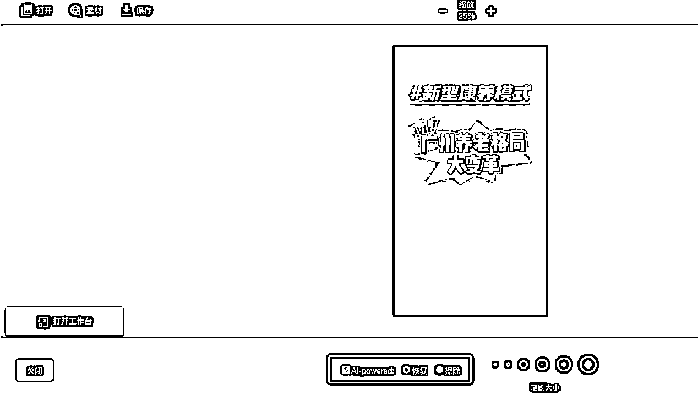
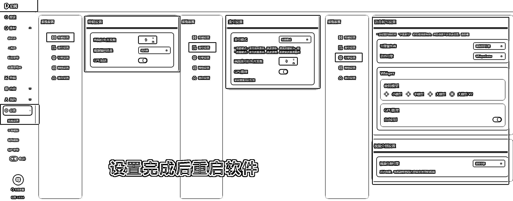
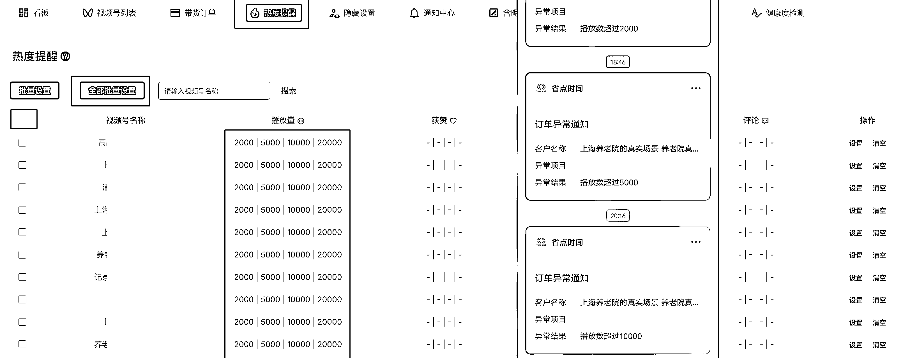

# (51 赞)本地养老公寓赛道，视频号微矩阵打法，3 个月 105W，细节++版

> 原文：[`www.yuque.com/for_lazy/zhoubao/pxgo90216ta1ruw2`](https://www.yuque.com/for_lazy/zhoubao/pxgo90216ta1ruw2)

## (51 赞)本地养老公寓赛道，视频号微矩阵打法，3 个月 105W，细节++版

作者： 王平

日期：2025-05-30

先介绍一下项目背景：此项目为养老公寓预储值卡销售性质

客户画像：能够自理并希望享受老年生活的老年人

客单价：3w/9w/18w/30w，约 6-9k 每月，含吃+住+服务+娱乐+绿化环境

客户来源：微信视频号

部分爆款展示：

数据：共 15-20 个账号，获取销售线索 2 月(125 个)，3 月(242 个)，4 月(154 个)

成果：2 月 8 日开始测试，到 5 月 8 日，3 个月成交额 105w

信息差：大部分人认为一个视频号账号只能发自己原创的视频，就是发布一条获取一条的曝光。其实 1 个账号可以授权 5 个账号发布同样的视频，也就是增加了 5 倍的曝光，大大减少需要制作的视频数量。

授权路径：视频号-创作者中心-创作者服务-更多-原创保护记录-右上角-授权账号-添加

原理：每天单个视频号账号发布 9 个视频，打造的微矩阵 1 拖 5，共计 6 个账号都发布 9 条视频，在没有爆款的前提下，单个视频会有几百个播放量，按 300 播放/条计算，每天制作 9 个视频计算，预计可以获得播放量：6(视频号数量)*9(单个视频号发布条数)*300(基础播放量)=16200 播放量，在没有爆款的情况下，也有不错的曝光量来获取意向客户。

## **大纲**

1.找对标，获取原视频+文案

2.视频内容拍摄

3.制作视频

4.视频号账号注册

5.视频号管理和发布

6.提效工具

7.最小 MVP 成本

8.安装包+表格+代码网盘分享

9.延伸

## **下方详细介绍视频号微矩阵打造步骤：**

**  **

### **1****.** **找对标，获取原视频+文案**

先添加快影下载 8 号机器人(微信:Ali1999_8)

然后在视频号搜索对应赛道关键词，找出数据好的

转发给快影下载 8 号机器人

获取爆款视频的原视频

获取爆款视频的文案后，用 ai 工具进行改写，

可以使用

kimi([`www.kimi.com/)`](https://www.kimi.com/))

豆包([`www.doubao.com/chat/)`](https://www.doubao.com/chat/))

元宝([`yuanbao.tencent.com/chat/)`](https://yuanbao.tencent.com/chat/))

deepseek([`chat.deepseek.com/)`](https://chat.deepseek.com/))

提示词：

请改写以下文案，体现积极的联想，展现出老年人入住后的美好，

产生让人向往的感觉，不要使用医疗敏感词，

输出文案不需要包含改写说明，输出每句话使用换行分行:

79 岁的李阿姨卖掉房子来到这里，选择了新型的养老方式。

在这里不用买菜做饭，不用麻烦子女，专业管家全搞定

看病不用出社区，社区就有全科医生

吃饭是现成的，活动中心，丰富的场地，随意畅玩

出门走两步就是镇中心，5 万人的成熟小区，生活配套齐全

室内外都是适老化设计，多户型可选，欢迎预约参观。

对比几个 Ai 改写后的结果，选择一个合适的

这部分属于重复性的任务，比如有 50-100 个文案，后面有提效工具介绍

拆分一个视频的构成：文案(已完成)+视频画面+封面+背景音乐+人声配音+字幕

### **2****.** **视频内容拍摄**

准备视频片段 100 个以上，优先使用苹果手机拍摄(1080P，60 帧，竖屏)

有条件的可以用稳定器拍摄

(用常规速度拍摄素材，用剪映软件最低可调到 0.5 倍速，60 帧降到 30 帧，画面一样清晰，更有高级感)

插入视频，1 慢速展示.mov(网盘文件夹可查看)

手持拍摄也不影响项目跑通，有很多赛道并没有卷到要高画质的程度

分析爆款视频里每个片段的素材分类：

项目涉及的表格，会统一在百度网盘分享

拍摄好的素材全部导入剪映 批量调整

缩放 103%

视频防抖-裁切最小

音频-基础-音量（拉到最左边，-无穷）

变速-倍速-（0.5-0.9 之间）+ 智能补帧（帧融合）

调节-基础-智能调色 60+饱和度/对比度/亮度/高光/阴影 视情况调节

以上部分功能为会员功能，不使用也可以，不影响项目跑通

注意：

1.素材拍摄注意避免拍正脸(住户容易投诉隐私，后期找视频删除比较麻烦，如果是爆款删除就难受了)

2.不要拍到二维码(比如微信支付宝收款码，连接 wifi 的二维码等，容易出违规减少推荐 0 播放)

3.避免垃圾桶等引起人不适的场景

每个素材切分为 5-10 秒，全选所有片段，右键(导出所选片段)，这样就可以批量导出多个视频，不需要单独一个个导出

导出好的素材命名分类

爆款开头分析：

插入视频：2 爆款开头.mov(网盘文件夹查看)

1.餐厅排队

2.餐厅人多

3.大巴车

4.东花园拍公寓

5.房间接待

6.接待区花园

7.琴房阳光

8.生日会

9.手机课

10 医疗区接待

总结：多拍你目标客户聚集的场景作为视频开头，更容易火

进度：文案(已完成)+视频画面(已完成)+封面+背景音乐+人声配音+字幕

### **3****.** **制作视频**

制作可重复使用的.PNG 封面(PNG 格式有透明效果)

还记得之前保存的爆款原视频吗，一般第一个画面就是封面，把封面截图下来获得多个图片

其中带有文字的部分就是我们要保留的封面，后面可重复使用

接下来打开这个网站:[`photokit.com/editor/?lang=zh`](https://photokit.com/editor/?lang=zh) 建议使用谷歌浏览器打开

打开要抠图的图片，左下角点击 AI 抠图

再使用恢复或者擦除得到想要保存的透明文字

再点左上角的保存

有些识别不是很明确的，可以先保存下来，用 PS 在处理一下细节（橡皮擦功能擦除），然后你就得到了很多透明的封面

进度：文案(已完成)+视频画面(已完成)+封面(已完成)+背景音乐+人声配音+字幕

接下来收集背景音乐

要求：你目标客户喜欢的，比如老年人喜欢老歌，广场舞歌曲等等

然后打开剪映

然后就得到了很多背景音乐

进度：文案(已完成)+视频画面(已完成)+封面(已完成)+背景音乐(已完成)+人声配音+字幕

最早是人工让 ai 随机选择视频片段，比如爆款开头作为 1-，随机出来的片段在剪映里组合成一个视频，初期可以使用这个方法

通过 kimi 随机后再选择素材导入剪映

从数字 19 开始，每组+1，前方加“1-”字符串，作为输出的第 1 行

随机从 1-55 选一个数字，前方加“2-”字符串，作为输出的第 2 行

随机从 1-86 选一个数字，前方加“3-”字符串，作为输出的第 3 行

随机从 1-31 选一个数字，前方加“4-”字符串，作为输出的第 4 行

随机从 1-18 选一个数字，前方加“5-”字符串，作为输出的第 5 行

随机从 1-38 选一个数字，前方加“6-”字符串，作为输出的第 6 行

随机从 1-31 选一个数字，前方加“7-”字符串，作为输出的第 7 行

连续输出 9 组,只要输出结果，不用给出过程

这样制作视频的时间还是比较久，之后问 ai，找到了软件：幻剪

幻剪软件可以基于本地视频素材库，ai 分析视频内容，根据文案自动匹配并导出视频

官网： [`huanjianai.com/`](https://huanjianai.com/) 安装包在末尾百度网盘有，也可以添加官网微信获取

安装好软件后，注册一个账号，

使用我的邀请码 LuqMHlt，有标准会员试用 2 天

用多个手机号注册，可以多有几个 2 天的会员

我们先进行软件的设置

设置-组件管理-基础组件-全部安装

设置-组件管理-基础组件-语音模型-安装最后一个-大模型-V2

设置-系统设置-剪辑设置 -剪辑任务并发数(3)+ 视频编码质量(高质量)+GPU 加速(开启)

设置-系统设置-索引设置 -索引模式(质量模式)+并发数(3)+GPU 推理(开启)

设置-系统设置-引擎设置 -引擎服务商(离线语音引擎)

+语音引擎(WhisperFaster)+Whisper(大模型 V2)

+GPU 推理自动识别(开启)+视频分割引擎(通用引擎)

设置完成后需要重启软件才能生效 ！

接下来把我们拍摄好的视频片段导入素材库

素材-素材库-资源管理库-“+”号给素材起个名字，可以按文件夹的方式导入

然后会自动弹出安装一个组件，安装好后会自动出现画面索引进度

索引时间比较长，请耐心等待

软件会自动分析视频是什么内容，为软件自动根据文案匹配内容做好准备

全部索引完成后，我们就可以准备生成视频了

幻剪软件最左边-剪辑-批量文案智能成片

素材匹配模式-本地素材-加载文案-txt

匹配+配音+字幕+背景音乐+素材 参考下方图片

注意：

文案分段模式选择（按照执行换行，避免字幕拆分不准确的情况。之前的文案在表格里先编辑好，每行不要太多字，单元格里的换行快捷键 Alt+Enter）

导出版式 竖屏+1080P+30 帧 即可

字幕的字体，系统安装好字体文件后，可百度字体名称+.ttf 下载，就可以选自定义的字体

配音和字幕的样式可以同一个文案测试不同的效果，最终确认后记录详细的设置

比如：

字体：微软雅黑 Blod 18 号 字幕位置 Y114 颜色#33D976

1.08 倍速 配音: 晓悠

1.04 倍速 配音:解说小帅 v2

0.98 倍速 配音:燃燃 v2

0.94 倍速 配音:炀炀

0.94 倍速 配音: 云皓

0.9 倍速 配音: 亲切男生

参数设置好后，点击右下角的生成视频就会自动匹配素材并导出视频了

前方不是提到一个爆款开头的情况吗，我们可以准备好多个开头视频片段，来单独设置视频的开头画面，在上方参数设置好后，不点击右下角的生成视频，而是点击右下角的仅创建项目。

在剪辑-最近项目-鼠标悬停-最左边点击编辑项目

把第一个视频片段右上角点下“-”减号，去掉这个素材，替换成爆款开头的素材

再点击右上角的导出视频既可

最后就会在我们设置好的导出路径得到多个导出的视频

将幻剪导出的视频批量重命名，比如是王平的素材，批量命名为 ping+随机 2 个数字-

(之前有出现过文件名是 1-30 这种简单的，导入后素材混乱的情况，发布后提示作品需要优化)

接下来是给视频加封面，我们先到剪映的全局设置里把图片默认时长改为 0.5 秒，这样就不用单独设置图片的时长了。

然后点开始创作，把命名好的文件导入，将 png 封面图片拖入每个视频最前端，

微调封面高度，不要遮挡字幕

选中视频和封面片段，把它们合成为一个复合片段，快捷键 Alt+G

把后面的多个视频和封面合并后，全选所有视频片段，鼠标右键(导出所选片段)，这样就可以批量导出多个视频，不需要单独一个个导出

导出后按发布日期命名

现在要发布的视频就准备完毕了

视频进度：文案(已完成)+视频画面(已完成)+封面(已完成)+背景音乐(已完成)+人声配音(已完成)+字幕(已完成)

### **4****.** **视频号账号注册**

如果你有联通的卡，可以 0.1 元增加一个副卡，一天可以增加 4 个副卡，和主号码的套餐通话时间和流量；

如果没有联通的，最低办理 59 的套餐，然后还要开通宽带，如果不用宽带也要 100 元作为安装费，加上预存话费 100，就是 200 元，当天就开好了 5 张卡，这个是速度最快的。

电信每个月可以开一张 5 元的

移动要 19 元一张，有的地区可以用和多号 app 开虚拟副卡大概是 5 元/月

社群应该也有其他的开手机卡的教程，这就不过多展开了。

我个人使用的是摩托罗拉手机，原装的系统支持多种 app 六开，22 年开始作为主力机使用，

多个微信同一个手机使用没有被异常掉线风控的情况，其它常用的小红书，抖音，快手都可以 6 开，不用出门带几个手机还是很舒服的。

我使用的是京东购买的全新机，几百到几千的都有，不要买二手的，避免之前有风控的矩阵手机

提醒：最安全还是一机一卡一号流量上网不连接 wifi，上方手机推荐仅作为工具推荐，

本人不对账号出现风控及其它风险负责。

然后就是用新手机号注册微信了

找家人或者朋友辅助注册，每个月可以辅助注册一个新微信，

注册好后绑定银行卡，不然容易出环境异常，解除异常需要绑定银行卡名字的人进行人脸识别

每个人可以用同一个银行卡绑定 5 个微信号完成微信的实名

新的微信可以进行真实购物消费，多模拟真人使用的场景，刷一些视频号看看同行也可以，养一养

注意：不要同一个时间注册多个微信号，间隔半天左右用流量注册；

短时间多个账号有类似动作容易风控，比如一次性给几个微信号改微信名

账号养一养就可以注册视频号了，注册好完成视频号实名，一个人可以实名 2 视频号，

给微信实名的人和给视频号实名的人不需要一致

如果要完成 6 个账号的视频号微矩阵，就需要 3 个人来完成实名

### **5****.** **视频号管理和发布**

之前没有工具的时候，使用的是 RPA 软件来完成重复的视频发布任务，

而且有一个痛点，是有人给我私信的时候，不能及时的回复，会造成客户的流失

于是去 kimi 问了一下：有哪些批量管理视频号账号的软件

找到这个叫做 快视的工具

官网 [`video.timexxs.com/`](https://video.timexxs.com/)

主要功能包含:多账号管理+热度提醒+自动回复评论和私信+主动私信+批量发布视频+设置 ip 归属城市，完美的解决方案，月费有 99/199 的方案，

99 需要每天扫码模拟登录视频号网页版，

199 是模拟登录 ipad，需要连续扫码 2 天，然后就不需要每天扫码登录了，

之前找过闲鱼自动回复私信收费都要几十/月，这个软件性价比还是很高的，节约很多时间。

软件有苹果版，win 版，和网页版，功能是很全的，微信扫码登录管理

6 个账号作为一个分组，微信扫码绑定管理后台，别名设置 ABCDEF，排序 1-6，方便后面管理

下面介绍一些常用的设置

软件右上角的头像-账户设置，可以设置公众号消息通知

热度提醒：播放量达到 2000/5000/10000/20000 的时候微信会有提示，这个时候直播效果更好

自动回复评论：

设置包含地址/价格/其他的回复策略，先单独设置一个，然后可以复制配置给其他的账号

地址：上海浦东宣桥镇镇中心，靠近 16 号线野生动物园地铁站[愉快]

价格：根据不同楼层，单人每月 6 仟-8 仟，夫妻每月 7 仟-9 仟，水+电+餐+24 小时服务全包

其他：可点头像咨询

自动回复私信：

您好，本养老社区简介：

地址：浦东南汇 宣桥镇宣中路；

服务：20 多个兴趣小组+24h 管家服务，按天扣费；

费用：根据不同楼层，单人每月 6 仟-8 仟，夫妻每月 7 仟-9 仟，水+电+餐+24 小时服务全包；

参观：地铁 16 号线 野生动物园站 1 号口接送；

可留您的联系方式给您详细介绍[微笑]

案例展示：

介绍发完，愿意留手机的就属于能接受价格的高质量客户了

视频发布之前先设置一下 1 拖 5 的授权

新号需要先发布 5-20 条视频才会出原创功能

授权路径：视频号-创作者中心-创作者服务-更多-原创保护记录-右上角-授权账号-添加

视频批量发布：

第一步批量配置：

第二步：

视频预览，主要就是设置标题和标签，可以获得一些搜索流量

并检查一下定时有没有超过一天到 00：00 分以后，如果有的话，调一下第一步的发布时间间隔

我们可以用表格提前准备一些通用的标题和本赛道的关键词

(收集同行的，或者淘宝租用 5118 网站会员 1 天，拓展关键词，[`www.5118.com/`](https://www.5118.com)，流量词库-
需求分析-高频需求)，前期可以手动复制粘贴，后面有介绍自动化工具

标题填好后，拉到最底下，点提交发布

发布后过几分钟检查一下是否发布成功，如果有异常及时处理

在指纹管理区域可以设置 ip 定位，会在视频号作者主页和评论区域有体现，如果是本地服务的出现其他城市信任感就没那么强了。

几十元/月，是付费功能，不付费默认为杭州

视频发布后的管理：

为提升账号，特别是新号的抗风险能力，避免违规，可以在视频发布后，199/月的会员可以批量声明 Ai/虚构/营销

99 元的会员就没有这个功能，需要人工手动声明，点开视频分享-感叹号-更多声明-Ai/虚构/营销

如果发布后视频显示播放量为 0 或者个位数，应该就是减少推荐了

在创作者中心-创作者服务-账号诊断 可以看见

出现这个情况，先到多开面板打开这个账号的视频号创作者网页版，把定时发布的删除

然后发布 8-10 条风景随拍，不用文案不用配音不用标题不用勾选原创，间隔 10-20 分钟发布完成，可以用批量发布视频里的定时发布设置立即发布间隔 10-20 分钟一条就可以，等 8-10 条定时的发布完成后就可以申诉了

点击减少推荐红色那里-账号详情-点那一大段文字-提交申诉

申诉文字：

尊敬的视频号审核团队，

您好！首先，我想表达我对能够在贵平台分享个人创作内容的感激之情。我在上传过程中可能未充分考虑到平台的相关规定。经过认真研读微信视频号的运营规范，特别是关于 *过度营销的部分* ，我已经深刻认识到自己的不足，并对此表示诚挚的歉意。

我恳请贵团队能够考虑给予我一次改正的机会，并恢复我的账号流量。我期待贵团队能够对我的账号进行再次审核。

感谢您的理解和支持！此致 敬礼！

*过度营销的部分* 可以改成其他的原因，一般几分钟就审核好了，然后你发布的风景视频就开始有播放量了，把这些风景视频删除或者隐藏，就可以正常发布视频了

账号第一次减少推荐可以用这个方法，第二次出现一般申诉不成功，

我这边如果出现第二次减少推荐，同时账号注册满 1 个月的话

会注销这个账号重新开始，有时候需要等待 7 天注销完成，有的当天就可以选立即注销，就可以重启

但是一个微信一年只能注册 3 次视频号，并不能每个月都重启

运行 3 个月后发现，授权其它账号发布同样视频的主账号，

因为申请了原创，出现减少推荐的情况会少很多，一般都可以用一个月以上，有的 2 个多月都是正常的

但是被授权的 5 个账号就容易出减少推荐，发布后视频播放为 0，

有的重启发布 1 天后就出减少推荐了，然后发布 10 多天第二次出现减少推荐

于是就要等 10 几天满一个月后注销重启。

圈友如果知道第二次第三次减少推荐如何申诉的办法，欢迎评论区指导，鞠躬感谢！

**下面是一种避免减少推荐的测试，还未完全验证是否可行**

**主思路就是让每个账号都能有原创的机会**

6 个账号作为一个分组，别名设置 ABCDEF，先选一个已经可以勾选原创的账号为 A，

授权路径：视频号-创作者中心-创作者服务-更多-原创保护记录-右上角-授权账号-添加

然后 A 授权 BCDEF，BCDEF 在发布非原创视频大概 2-5 天也会出原创，

然后完成 B 授权 ACDEF，C 授权 ABDEF，D 授权 ABCEF，E 授权 ABCDF，F 授权 ABCDE

每天根据下方表格发布视频，6 个账号都可以轮流原创

A 在 23 号，定时 24 号发布，文件名为-24-的视频文件，勾选原创视频

然后 CDEF 在 24 号，定时 25 号发布，文件名为-24-的视频文件，不勾选原创

B 在 25 号，定时 26 号发布，文件名为-24-的视频文件，不勾选原创

B 在 24 号，定时 25 号发布，文件名为-25-的视频文件，勾选原创视频

然后 ADEF 在 25 号，定时 26 号发布，文件名为-25-的视频文件，不勾选原创

C 在 26 号，定时 27 号发布，文件名为-25-的视频文件，不勾选原创

以此类推

最近在做这个实验，可靠性待验证

### **6****.** **提效工具**

1. 双系统

在苹果系统安装 Parallels Desktop 虚拟机，虚拟机安装 win10 系统，win10 系统运行自动化软件

不影响苹果系统操作任何工作，比如给视频加封面批量导出/收集文案等

虚拟机可以安装多个 win10 系统，相当于有多个电子员工给你打工

淘宝搜索：苹果安装 PD 虚拟机，有人远程给你安装，几十块钱

win10 电脑有原装的软件，Hyper-V，可以在 win 系统下虚拟多个 win 系统，也可以有多个电子员工给你打工，抖音可以搜下教程，搜：Hyper-V 教程

2. uibot 或者影刀，要一些编程基础，解决重复机械工作

我使用的是 Uibot，官网： [`www.uibot.com.cn/`](https://www.uibot.com.cn/)

RPA（Robotic Process Automation，机器人流程自动化）

技术通过模拟人工操作键盘鼠标，自动处理计算机中规则清晰、批量重复的工作与任务。

同时需要安装谷歌浏览器，WPS 表格

谷歌浏览器 [`www.google.cn/intl/zh-CN/chrome/`](https://www.google.cn/intl/zh-CN/chrome/)

WPS [`www.wps.cn/`](https://www.wps.cn/)

下载后安装谷歌浏览器、WPS、Uibot 软件，然后进入到 Uibot-工具-拓展程序-Chrome 拓展-安装

这样就可以通过 Uibot 软件控制谷歌浏览器了

复制源代码，在网盘的表格里

在流程块中粘贴代码

按下源代码/可视化 切换按钮，就可以比较清晰的理解代码的功能了

表格中有 4 个功能：

1. 文案中的敏感字替换

2. 文案表格转 TXT 文件

3. 快视填标题和标签

4. deepseek 网站改文案

难度不同，官网有教学视频，可自行学习

[`academy.laiye.com/teachvideo`](https://academy.laiye.com/teachvideo)

### **7****.** **最小 MVP 成本**

### **8.安装包+表格+代码网盘分享**

表格+视频+软件+代码

通过网盘分享的文件：视频号微矩阵 安装包+代码+表格

链接: [`pan.baidu.com/s/1A1ZYmB2QmiMMa6r2PeF9Lw?pwd=jpte`](https://pan.baidu.com/s/1A1ZYmB2QmiMMa6r2PeF9Lw?pwd=jpte) 提取码: jpte

### **9.延伸**

流量误区：不是流量越多越好，而是人群越优质越好

在短视频领域，涨粉、高播放量并不等于成交。流量固然重要，但真正拉开差距的，是高效变现、精准获客的能力。

可以看看生财公众号的这篇文章

《流量≠成交，短视频月获 5000+精准客资，我是怎么做到的？》

[`mp.weixin.qq.com/s/F0KXSnpeyb5lsjY2dakWFg`](https://mp.weixin.qq.com/s/F0KXSnpeyb5lsjY2dakWFg)

发布后有很多视频是没有点赞转发的，你如果打开某个作者的主页看到的是只有极少的爆款，几十个赞的都很少，但是这种账号也能获取客户，如果这个作者持续的发数据一般的视频，说明这是一个隐藏的赛道，是可以好好研究深入挖掘的。

《青云志》共勉

身处低谷不自弃，我命由我不由天！

无人扶我青云志，我自踏雪至山巅。

若是命中无此运，亦可孤身登昆仑。

红尘赠我三尺剑，酒换瘦马一世街。

世人朝路乃绝涧，独见众生止步前。

海到尽头天作岸，山登绝顶我为峰。

如若东山能再起，大鹏展翅九万里。

一入红尘梦易真，一朝悟透心境名。

一朝悟道见真我，昔日枷锁皆云烟。

天门将至百运开，拂尘轻笑问仙来。

何须扶我青云志，我自凌云至山巅。

尽管整个项目跑通了，也拿到了结果，但是在过程中有些思路或者细节上也会带有个人的偏见，欢迎圈友指出。

同时感谢生财平台提供分享机会！

提前祝大家端午安康，六一快乐，也祝自己 33 周岁生日快乐，这份经历作为礼物献给大家！

2025.5.30 王平

* * *

* * *

评论区：

高大卫 : 喂饭级别 很赞

Canui : 太牛了