# (40 赞)公众号 AI 爆文持续变现 5 位数 复盘与思考

> 原文：[`www.yuque.com/for_lazy/zhoubao/wuwlq3ugulh8tmvb`](https://www.yuque.com/for_lazy/zhoubao/wuwlq3ugulh8tmvb)

## (40 赞)公众号 AI 爆文持续变现 5 位数 复盘与思考

作者： 何老师

日期：2025-05-29

**公众号 AI 爆文持续变现 5 位数 复盘与思考**

**文章首发：何老师**

# **1.现在入局公众号刚刚好**

写作形式千千万，有人写书，有人卖稿，为什么我们选择了公众号平台做自媒体？

各大平台，如果你想看一篇稍微有点深度的文章，你会选择什么，是公众号。

各大手机软件，如果你要问每个人手机上都有的一个 APP 是什么，是微信，而且它基本不会被卸载。

公众号就「长」在微信里，所以，能尽可能最大限度接触到所有人的途径，就是公众号文章。

我已经写公众号文章 7 年了，每年写几十万、上百万文字，为什么？

因为做公众号自媒体，就是给自己做传播，不做自媒体，等于你放弃了升值自己的权力。

我身边有很多人，包括我的学弟、我同学，他们做自媒体，跨越周期，每年赚百万，每天只需要几个小时，没有领导，没有任务，不用坐班，很自由地赚钱。

这是「最干净」的地方。微信平台几乎涵盖了生活方方面面，从生活、支付、交通、水电，到社交、活动、宣传、新闻，平台一直在用各种方法过滤不干净的内容，这是迄今为止，最干净的的一个地方。

而且现在平台给新人很多机会，推荐机制，爆文机制，原创机制，就算你是新号，也有机会写 10 万+文章。

**比如我借助 AI 写的这几篇文章，连续爆火。**

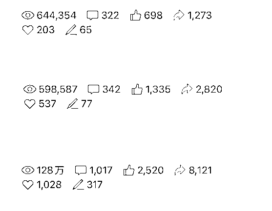

很多人说公众号红利过了，这些人往往是没有吃到红利的人，我用亲身经历证明，公众号的红利一直在，并且还在不断增长。

它最友好的是，写公众号文章没有门槛，一部手机，会打字，就可以。但不是每篇文章都能火，都有收益，做自媒体入门可以，要进阶，要赚钱，需要学习。

**结论是：公众号红利一直在，在 AI 风口，现在入局，时机刚刚好。**

# **2.用好 AI 创作可躺赚**

「会用 AI 的人将淘汰不会用 AI 的人」

这不是我说的，所有的大佬都在反复强调，许多人被迫转型，都在做 AI，要不就被淘汰。

自媒体出来这么多年，核心是写作，如果每天要花 4 个小时写一篇文章，收益很低，谁会愿意坚持呢？

现在有 AI 技术，它可以辅助写作，快速产出高质量文章，有人用它赚了百万千万，既然能创富，为何不一起呢？

这就是我们精心打造「百天 AI 爆款写作变现训练营」的目的。

在人工智能时代，谁掌握了「怎么用 AI」的能力，谁就能把作品、产品、IP 卖出去。

我用 AI 写作三个月了，写了 12 篇 10 万+，2 篇百万+，单篇收益过万，已经跑通了 AI 写作模式。

**比如我今年开年写的几篇文章。**

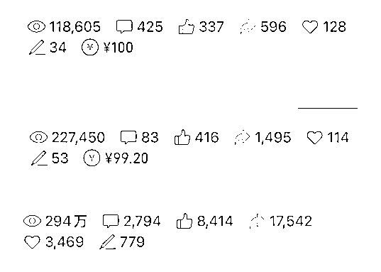

以前这种事，不可能发生。

为什么？

因为写作，是一门艺术。这门艺术，属于作家。

谁掌握了写作的艺术，谁就能当作家，这也是为什么以前的作家都喜欢投稿、出书的原因。

从前这门艺术，不太可能直接给到个人，尤其是在自媒体写作时代，能掌握写作艺术的人不会大规模传授给别人，但现在，这种艺术被 AI 打破了，它被平等地分给了每个人。

虽然内容被平台控制着，但是只要你写作的内容是有价值的，满足用户需求的，有能量的，平台就允许你的存在。

**用 AI 写作，就是拿了一把利剑，开始披荆斩棘，打开创富之路，所向披靡。**

# **3.这些赛道可以做一辈子**

**现代人物**

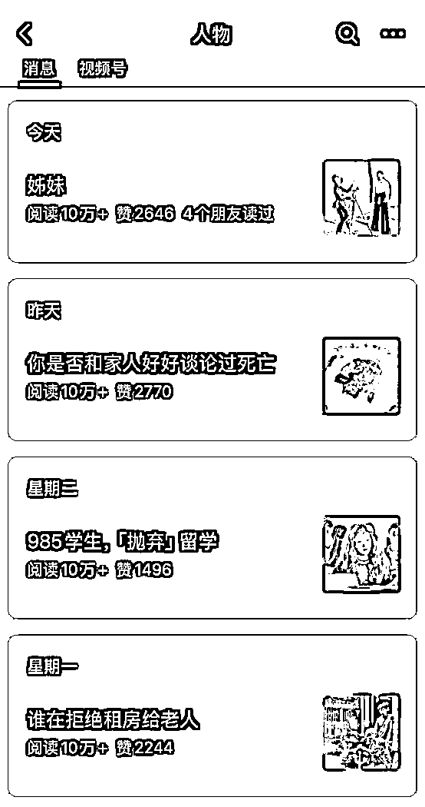

**国际局势**

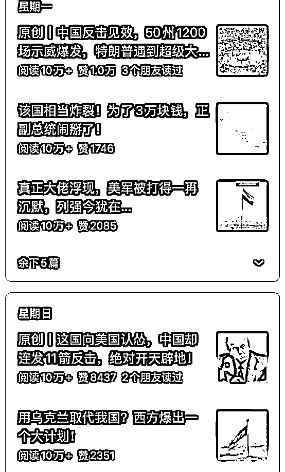

**与「钱」相关的随笔**

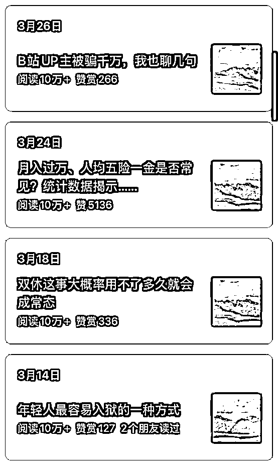

**社会现象解读**

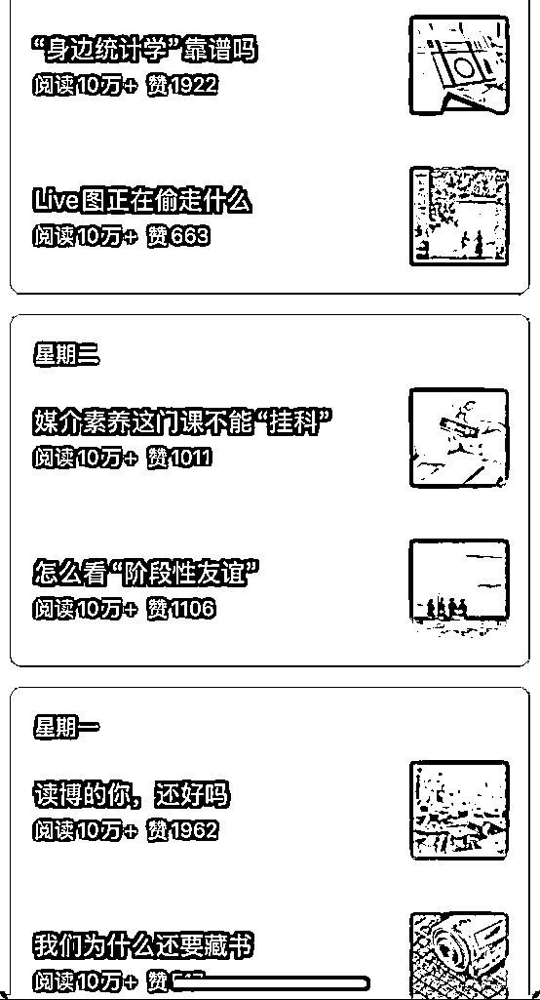

**创意风格漫画**

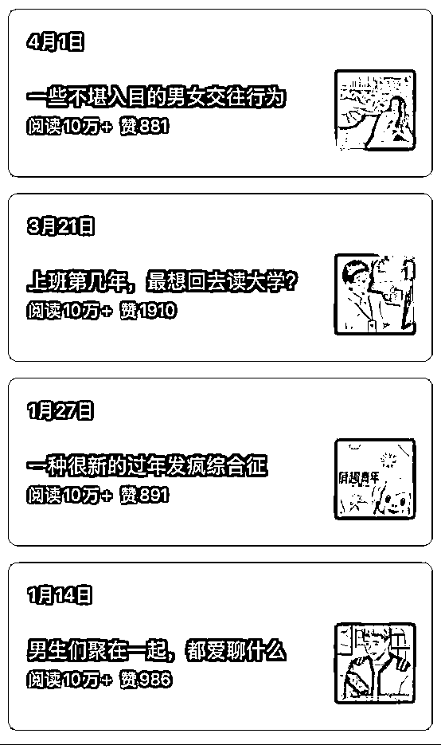

**夜听系列**

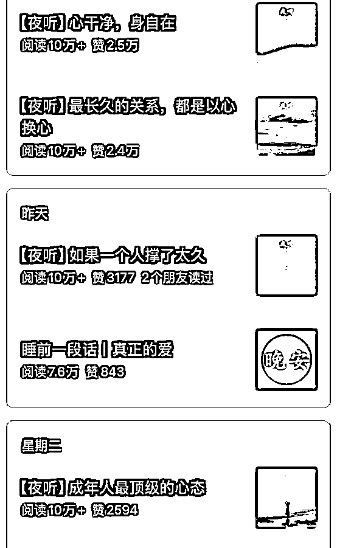

**特定历史文化**

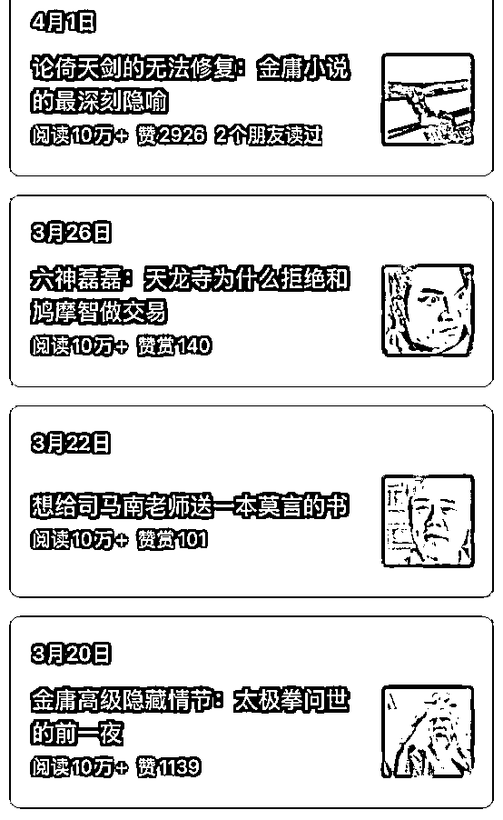

# **4.如何做 AI 爆文（必看）**

## **4.1 AI 文章可以直接发吗？**

**AI 文章可以直接发。**

在有人为干预情况下生成的文章可以直接发，并标注是原创，不会限流。我写的许多 10w+文章都有 AI 创作的成分。

但如果你没有任何参与，就只是给 AI 提了一个问题，发了一个题目，它生成了一篇文章，那最好不要标注为原创，毕竟它真的不是你写的，我们要实事求是，你可标注为 AI 创作，然后标记为原创，或者不要标注原创。

所谓人为干预，指的是有你的创作成分在里面，比如你分了很多次提示，并根据文章内容进行不断优化，最终形成了你的文章，就是原创。

还有一种，你写了一部分，让 AI 帮助你扩充、修改、润色，也是原创。

最高端的一种，你口述一篇文章，让 AI 帮你修改其中的错误，效率很高，我经常这样写，也能出爆文。

## **4.2 系统会判断文章是 AI 写的吗？**

**会判断。**

现在各大平台都在用 AI 创作的内容，比如一篇文章有一百个句子，系统会识别哪些句子是 AI 写的，哪些可能是 AI 写的，它会给一个概率，哪些是不可识别的，哪些不是 AI 的，最后综合起来，判定你的文章会不会被推荐出去。

当然，大家不要怕，根据最近几次科技界的讨论，所有的推荐并不是单纯靠算法，还是靠用户推荐，只要用户喜欢，算法就会推荐出去。

## **4.3 怎么才能有收益呢？**

**公众号起号之后，有 500 粉丝后，就能开通流量主。**

如果你有耐心，不着急变现，可以靠自己写文章累积 500 粉之后再开通流量主，开通流量主之后，文章里就可以插入广告，你就有广告收益了。

如果你很着急，且学习了「AI 爆文写作」相关的课程了，那你可以直接花点钱买 500 的真人粉，效率很快，毕竟你是出爆文的人，收益秒杀买粉的那点钱。

当你的文章爆火之后，会有人找你接商单，初期，在背调不充分的情况下，一概不接，或者找你的老师咨询，是否要接单。

大量无良商家的广告会向你袭来，你得学会拒绝，先壮大自己。

当你有自信之后，可以接商单了，这是你变现的一部分。

## **4.4 有哪些 AI 工具可以用？**

**DeepSeek，kimi，文心一言，通义千问，GPT 系列，Gemimi 等，都可以用。**

大模型用起来各家有各家的好处，你适合哪一种，可以根据喜好选择，我常用的是 kimi。

类型包括 APP、小程序、网页版，基本都支持。

## **4.5 违规了还能写吗？**

**还能写。**

看你违规的次数和问题严重性，我之前写过一篇 10w+文章，违规了，从最终收益和之后的文章流量看，几乎没有影响，放心大胆地写，不要涉及违规内容就行，我违规是因为把一个演出门票价格写错了，应该是被投诉了，但并不影响后续文章发表。

有时间的话，把公众号内容发布规则看几遍，多看几遍有好处，心里有个数。

## **4.6 可以重复发文吗？**

**可以。**

爆文的特点就是热点还在，用户喜欢的话题还在，短期内的爆文还可能再火。

建议大家二次发的时候不要偷懒，稍微修改一下，哪怕让 AI 帮你调整下逻辑，重新润色下，都可以，直接发愿文，从做人的这个角度看，不建议，坚持长期主义，要做见得光的事情。

## **4.7 每天发 8 篇文章吗？**

**可以。**

没有人限制文章发表个数，个人微信公众号，每天发一次，一次最多发八篇文章。

但是你真的有时间吗？我们用「AI 爆文写作」的方法来做，写一篇爆文最快也要 30 分钟，8 篇就是 240 分钟，等于 4 个小时，如果你是全职自媒体写作者，是可以这样做的。

我记得「十点读书」的作者起号时就是每天雷打不动发八篇文章，真得很拼。

致敬每一个奋斗者。

## **4.8 如何每天涨粉？**

**每天写文章就行。**

公域粉丝，就发公众号文章，坚持每天发，至少一周发三次。私域的就每天发朋友圈，总是有人源源不断地找上你，重点是坚持，坚持，坚持！

粉丝，是你的用户，但不是付费用户，太在意粉丝的数量反而乱了阵脚。

坚持做好文章的质量和排版，是第一位的。

## **4.9 文章字数多少合适？**

我写过几百字的，也能有接近 10 万阅读量，我写过上万字的，阅读量反而很低。

我的大多数文章字数在**1000-5000 之间** ，爆款文章字数都在这个区间。

真正厉害的作者，能用简短的话把复杂的事情说清楚，我们要练习的就是这个能力，还能减少文章字数，给自己减少压力。

## **4.10 如何提高收益？**

有内容，就有阅读量，**阅读量就是收益** 。

影响收益的因素太多了，文章标题、质量、话题热点程度、广告单价、传播程度，都会影响你的收益。

当你还不知道怎么提高收益的时候，就先把内容做好，先坚持 100 篇原创。

## **4.11 账号需要认证吗？**

**能认证，就认证。**

这是外界看你的一个重要标签，有了认证，外人看你，你会更有权威性，对内，平台有流量扶持。

## **4.12 账号没进流量池怎么办？**

**不用考虑这个问题** ，只要按照「AI 爆文写作」的方法论来，你的文章就在流量池里。

写文章，发文章，精选留言，互动，一切都会好起来的。

## **4.13 从哪里找对标账号**

**微信本身** 就是一个极好的搜索引擎，把它当作百度用，你会发现不一样的世界。

所有的对标账号都能在搜一搜里找到，搜关键词，从「新榜」看排名，看领域细分，找到头部，找到对标账号，向他学习，模仿他，最后，超越他。

# **5 单篇文章持续收益 4 位数 复盘与思考**

比如我口述文字，用 AI 整理的这篇文章：

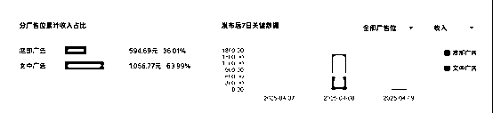

这是典型的收入分配比，用稳文中广告和底部广告。

所以保证文章字数接近 1000，这样可以插入两条广告。

注意底部广告占比 36%，所以**文章底部尽量不要插入无关的符号和图片** ，类似作者介绍，打赏之类的，如果你刚刚起号，全关掉。

这是一篇 10w+，实际阅读量是 35 万。要想文章收入上 4 位数，最少得是爆款，除非你的广告单价很高，但大部分人的广告是智能插入的，广告单价都不高，可以看看我这篇文章的 ecpm 是 6.49，也就是 1000 次阅读量的收入是 6.49 元。

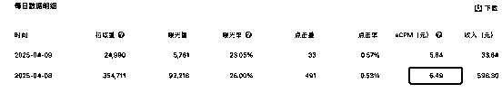

想让广告单价高一点，先做好内容吧，里面的学问很深，内容才是王道。

这篇文章内容不涉及某个热点，但却是行业话题。这是要说的另一个写作讲究，**热点赚小钱，认知赚大钱** 。

几乎所有人都知道蹭热点，但热点也分即时性的和长期性的，把握长期热点，才能让你的文章成为热点，而不是盲目跟热点，跟别人走，你吃掉的流量永远是别人剩下的。

很多人纠结发表时间，我的建议是，**不要在发表时间上浪费你的思考时间** 。写完，排版完，审核完，就直接发。

我有许多爆款是晚上凌晨发的，因为我那个时候才写完，和时间赛跑，保持更新频率。

# **6 单篇文章持续收益 5 位数 复盘与思考**

这篇文章稍微花了点心思，花了一个小时，通过不断修正逻辑，借助 AI 完成的，阅读量是 294 万。

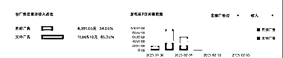

前面总结过的这里不再赘述，增加几个思考点，这篇文章**灵感来自「今日头条」** 。

当时已经快凌晨 1 点了，我找不到选题，就翻看了下今日头条，李子柒上春晚的消息映入眼帘，经过思考，我找了这个**「带有情绪」的选题** 。

从标题上看，我是带着嫉妒的，但是从内容上看，我又写的是正面的文章，这叫欲扬先抑。

从收入配比看，文中广告依然占比很大，这篇文章字数是 2000+，有两个广告，文章末尾没有多余的废话，用户能直接看到底部广告。

如果你看过文章内容就知道，文章最后是一张动图，极具吸引力，有情感共鸣的成分，这个要你自己去悟了。

再看流量推荐，流量连续推了三天，这是流量推荐的真相吗？不是！

**流量推荐并不是只持续你发文章的那几天。**

我有一篇 10w+的文章，一个月后才突然爆火，从起初的几百阅读量到 10w 加，横跨了一个月，是用户把它推出来的，不是算法。

所以，不要焦虑，当时的文章可能还没有触动到用户，但到了某个阶段，就会爆发。

# **7 持续写出 10w+ 复盘与思考**

我直接把后台数据放出来，挑选了几篇有代表性的 10w+文章：

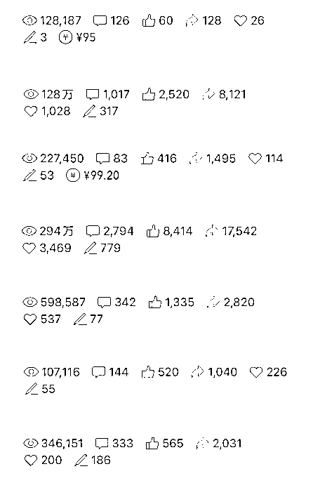

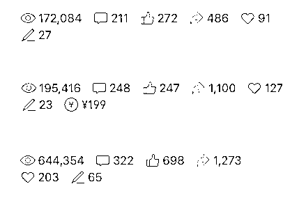

这些 10w+文章的特点是热点+人物+情绪+价值。

一篇 10w+就是你的孩子，生孩子、养孩子都不容易，我总结几个点。

1、**标题要起好** ，用户只给了你一秒钟，扫过去了，没有点击，你的文章就过去了，就少了一个阅读量，阅读量是人传人，爆炸式增长的。

2、**排版不必花里胡哨** ，有人专门买模版，除非你想做品牌，初创号记住「少就是多」，直接用默认的字体，默认的间距，默认的排版，把内容做好，就能多花功夫在质量上。

3、**有大局意识** 。什么是格局，你没有选题的时候，就看看最权威的官媒，他们在发什么，从里面找选题，用户往往喜欢看认知内的事物，官媒的传播就是赋予他们新的认知，你只需要在里面找选题，找切入点。

4、**把握趋势** 。判断未来趋势，比如我写哪吒，写饺子，写李子柒，写德国竞选，写泰国总理访华，都写在了事情发生之前，或者写在了重大事件的节点上，这叫预测。

5、**用 AI** 。自己写爆款，也可以，在不借助 AI 的情况下我需要花 2-4 小时写一篇爆款。用 AI 只要 30 分钟-1 个小时，时间就是生命，多省出来一个小时陪陪家人，多好。

6、**学会营销** 。许多人看不起销售，还不愿意学营销。世界上绝大多数富人，都是干销售出身，会把自己的作品、产品，甚至把自己卖出去的人，才会赚大钱。

……

可找鱼丸链接何老师~

* * *

评论区：

向上 : 何老师在这里看到你啦[得意][呲牙]

向上 : 我是 AI 爆款训练营第一期的[偷笑]

奔跑的 Robin : 怎么联系呢

大坤 : 干货呢[困]