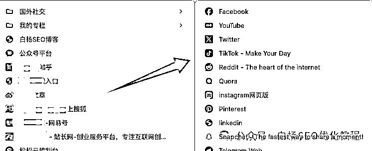

# (14 赞)白杨 SEO：简单分享下如何在 X、Facebook、YouTube、Instagram、Reddit 等上面做推广引流？

> 原文：[`www.yuque.com/for_lazy/zhoubao/pg37rqs9ms0h066m`](https://www.yuque.com/for_lazy/zhoubao/pg37rqs9ms0h066m)

## (14 赞)白杨 SEO：简单分享下如何在 X、Facebook、YouTube、Instagram、Reddit 等上面做推广引流？

作者： 白杨 SEO

日期：2025-05-29

大家好，我是白杨 SEO，专注 SEO 十年以上，全网 SEO 流量实战派，AI 搜索优化研究者。

为什么今天想到要来分享下 X、Facebook、YouTube、Instagram、Reddit、Quora、LinkedIn 等海外社媒交媒体平台怎么用来做推广呢？

第一个原因，不管是在我的微信群还是加过来的都不时有朋友问到说海外 XXX 社交媒体平台怎么推广之类；

第二个原因，大家知道现在国内市场不管是百度等搜索引擎流量还是社媒微信抖音小红书等都更难了，而且很卷，也想出海看看。

第三个原因，白杨 SEO 这个定位就是分享如何搞全网流量的，再加上我普经也做过海外社媒推广，所以想到就来分享下。

虽然比较基础，但对于不管是做产品出海，还是内容出海，还是工具出海的新朋友，看完一定会有一些帮助或启发。

**提醒：** 白杨 SEO 这里写的推广，主要是免费推广，付费投放不在本文哈。同时，介绍这些工具都需要魔法上网，这个请自我解决，不要干违法的事！

老规矩，先说下分享大纲：

1、X 平台介绍及怎么做推广？

2、Facebook 平台介绍及怎么做推广？

3、YouTube 平台介绍及怎么做推广？

4、Instagram 平台介绍及怎么做推广？

5、Reddit 平台介绍及怎么做推广？

6、Quora 平台介绍及怎么做推广？

7、LinkedIn 平台介绍及怎么做推广？

**X 平台介绍及怎么做推广？**

X，原来叫 Twitter，就像是我们国内的“微博”。这个平台成立很早了，它是一个信息分享和交流的社交平台，用户可以发布简短的推文、图片、视频等，适合快速触达北美、日本市场，B2C/B2B 业务均可适用。

相信有很多老朋友知道它，只是经过马斯克改名 X，我不知道多少朋友知道。这个平台目前全世界月活大约 15 亿，肯定在全世界平台 TOP 前 10 中。

怎么在 X 上做推广？

因为上面有说到，我们在 X 推广主要指免费手段，所以在 X 上推广最基础就是写好个人简介，放上要推广网址，关注一些相关的人或事就可以了，如图。

当然，你要把你的 X 运营起来，定期发布行业相关的内容。如流量玩法，产品使用技巧、公司动态、行业见解、客户案例等，建立你在你的行业权威影响力，吸引潜在客户。

你还可以借势热点，比如结合节日、赛事等实时话题，用 # 标签 提升曝光。像比如写流量这篇，我们可以用#Twitter #海外社媒营销 等。

**Facebook 平台介绍及怎么做推广？**

facebook，这个站就更古老了，白杨 SEO 在读大学的时候就有了。在海外，这个平台也被那些年轻人认为老古董平台了。

中文叫它脸书，国内最早模仿对象是校内网，后更名人人网，不过都消失了。现在你可以理解它就是我们的“微信”。

不过这个脸书老大哥，据说依旧是全世界流量最大的平台，月活超过 30 亿。也有人说是谷歌的 youtube 全世界月活第一，反正不管谁第一，你要做海外推广，facebook 你肯定要去搞，哈哈哈。

facebook 全年龄段覆盖，付费广告系统成熟，适合电商和品牌曝光。用户可以创建个人主页、加入群组，分享生活、交流信息等。

facebook 怎么做推广？

我们可以做好个人主页简介，可以在简介里加入个人网址，如图。我们也可以发一些内容，内容里可以带我们想要推广的网址。

我们还可以利用 facebook 群组推广，寻找与我们推广产品或业务相关的群组，如运动爱好者群组、美妆爱好者群组等，分享有价值的内容和产品信息，但要注意避免过度推销，同时遵守群组规则哈。

当然在这个上面现在 90%都是在做付费推广，也就是投 facebook 广告，如下图。你可以简单理解我们国内你的微信朋友圈广告一样的，哈哈哈。

**YouTube 平台介绍及怎么做推广？**

youtube，全世界最大的视频观看和分享平台，简单理解就是国内的“优酷”或“B 站”平台。月活 20+亿，中长视频与 Shorts 短视频双轨并行，适合深度内容和电商转化。

youtube 怎么做推广？

1、创作优质视频，制作高质量的产品介绍视频、使用教程、评测视频、创意广告等，吸引用户长时间观看并产生互动，确保视频前几秒能够抓住观众注意力。

2、优化视频 SEO，对视频标题、描述、标签等进行关键词优化，提高视频在 YouTube 搜索结果中的排名，增加曝光机会。

3、与观众互动：在视频结束时提问，鼓励观众在评论区回答，及时回复评论，增强与观众的互动关系，也能做推广。

4、利用 youtube 的 Shorts 视频引流：制作 15 秒产品展示视频，前 2 秒用强视觉冲击吸引停留。这个就类似国内的抖音，国外叫 tiktok 哈。

关于 youtube
Shorts 怎么做，详细看我之前写的这篇《出海 SEO 搜索流量怎么做？试试谷歌 youtube 的类 tiktok 短视频平台 shorts【实测】》。可以在星球搜一下或者去白杨 SEO 公众号里看有哈。

**Instagram 平台介绍及怎么做推广？**

insragram 平台是啥？简单理解，他就是我们国内的“小红书”。它的月活（全世界一起哈）也是 20 亿+，也是全世界 TOP 前 10 的平台！

一个以图片和短视频为主的社交平台，你可以分享生活点滴、创意作品、时尚穿搭等，具有较强的视觉冲击力和互动性。年轻用户占比高，视觉化内容驱动转化，适合时尚、美妆等品类。

怎么在 insragram 平台做推广？

1、insragram 介绍里可以放你的网站地址，如图。

2、发贴子，可以放购物标签：在帖子中标注商品链接，用户点击直接跳转购买。

3、Reels 短视频：结合热门音乐和挑战赛，展示产品创意用法。也可以发你的业务视频等，举例白杨 SEO 介绍 SEO 及关键词挖掘等实战视频如图。

**Reddit 平台介绍及怎么做推广？**

reddit 是啥？这个 2025 年问我的朋友最多了。有人说它是谷歌的干儿子，哈哈哈。reddit 你可以理解它是国外的“贴吧+知乎”的组合体，哈哈哈。

reddit 目前月活 4 亿+，但是人家是垂直社区聚集高粘性用户，适合科技、亚文化领域，而且在谷歌里搜索排名老好了，哈哈哈。

怎么在 reddit 上做推广？

这个，我们主要是进到 reddit 小组里去哈。

1、我们可以参与社区讨论，加入与产品相关的子版块（Subreddit），积极参与讨论，提供有价值的信息和见解，树立品牌形象，但避免过度自我推销，以免引起用户的反感。

2、我们可以创建有价值内容：在相关子版块发布与产品相关的内容，如使用心得、行业分析、问题解答等，吸引用户的关注和讨论，增加产品的曝光度。比如你要推广你的工具之类，可以来写使用方法等。

3、举办问答活动（AMA）：品牌创始人或相关专家可以举办“问我任何问题”（AMA）活动，与用户进行深入互动，回答用户的问题，提高品牌的可信度和知名度。

**Quora 平台介绍及怎么做推广？**

quora 是啥？quora 是一个超过 3 亿月活，高学历用户的问答式社交平台，你可以把它理解成国内的“知乎”。

在这里，你可以提出问题、回答问题、编辑问题等，涵盖各种领域和话题。适合 B2B 业务或知识类型的产品推广。

怎么在 quora 平台做推广？推广方法参考

1、问答植入，关注与产品相关的热门问题，提供专业、详细、有价值的回答，在回答中巧妙地提及产品，但要避免过于明显的广告推广，提供解决方案为主。

2、SEO 优化推广，在 quora 回答中嵌入用户需求搜索长尾关键词，这样可以提升它在 Google 搜索排名。

比如，某留学机构通过 “如何申请美国奖学金” 问题，获得 Quora 和 Google 双渠道流量，咨询量增长 40%。

3、当然付费也提一下，有的利用 Quora 的广告平台进行产品推广，广告形式包括问答广告、展示广告等，可以根据用户的兴趣、问题等进行精准定位。

小干货：现在有很多 AI 工具，所以有些做海外 Quora 推广，不管是回答还是问题，都用 AI 工具来写，比如用 chatgpt，claude，甚至也有人用 deepseek 等。

**LinkedIn 平台介绍及怎么做推广？**

linkedin 是全世界最大的职场社交平台，目前月活 9 亿+，你可以把它理解是国内的“脉脉”平台。为啥长像下图，因为我访问它没跳出来就这样，哈哈哈。

你可以用它建立人脉关系、分享职场经验、寻找工作机会、关注行业动态等。海量专业人士和企业决策者，它在 B2B 领域导流占比 46%！中文版是.cn，如图。

怎么在 linkedin 上做推广？

1、优化个人和公司资料，完善个人资料和公司主页，突出专业形象和品牌形象，详细描述公司的业务范围、产品特点、服务优势等，吸引潜在客户和合作伙伴。

2、发布行业相关内容或招聘信息，定期发布与行业相关的专业文章、报告、案例分析等内容，树立行业专家形象，提高品牌知名度和影响力。

发招聘信息，不就自然可以放上你企业的网址了吗？

3、参与行业讨论组，加入与产品相关的行业讨论组，积极参与讨论，分享专业见解和经验，提供解决方案，吸引潜在客户的关注。

4、建立人脉关系，主动与同行业人士、潜在客户、合作伙伴等建立联系，拓展人脉网络，通过人脉的推荐和分享，提高产品的曝光度和可信度。

OK，其实除了上面这七个主海的海外社交媒体平台之外，还有像**Pinterest ，全球最大的图片分享网站** ，拥有超过 300 亿张图片；

TikTok ，国际版抖音，可拍摄短视频的音乐创作社交软件，在美国等全球多地下载和安装数量居前列，超过**20 亿** 用户注册；

**Snapchat，月活 7 亿+** 深受年轻人喜爱的社交软件，以发送限时照片和视频而闻名，用户可创建带有涂鸦、贴纸和滤镜效果的照片和视频等。

我们做海外社媒推广，如果你把上面介绍主流的七个平台做了，哪怕只精通任何一个，你都能引来不错的流量！

当然，越老的竞争越大，比如像 X，FB，YOUTUBE，LINKDDIN 等，这种我在 10 多年前就做过了。

但比如像在谷歌里排名比较友好的 reddit、quora 等，我们更加应该关注去做，现在做工具那些，越来越多的人去这里做推广。

后续也会再写一些海外搜索引擎如谷歌，必应，yandex 等平台 SEO 玩法。而且白杨 SEO 也有专门在做海外 SEO 和社媒推广的朋友。

所以，我希望大家不要只关注国内这些平台上内卷，如果你有好的产品或服务，或者你懂技术开发，完全可以去出海，去卷外国人啊，当然最多还是我们出海中国人或者海外华人，哈哈哈。

**作者介绍：**

白杨 SEO，专注 SEO 研究十年+，全网 SEO 流量实战派，ai 搜索优化研究者。前某公司市场总监，现自由职业，企业顾问。

* * *

评论区：

暂无评论