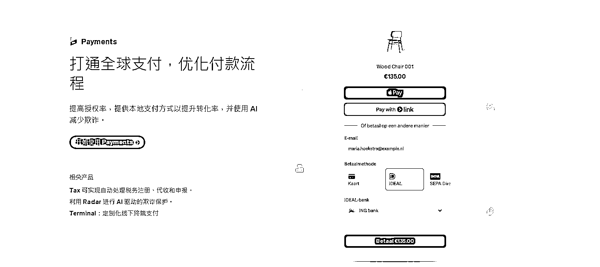
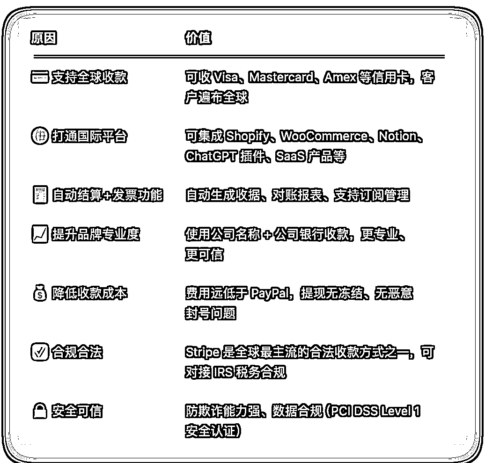
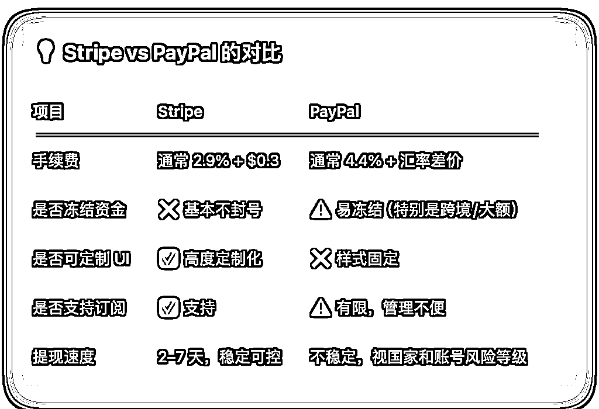
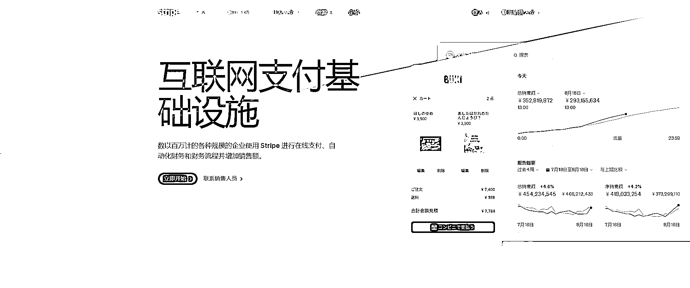
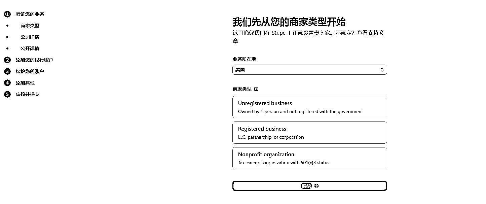
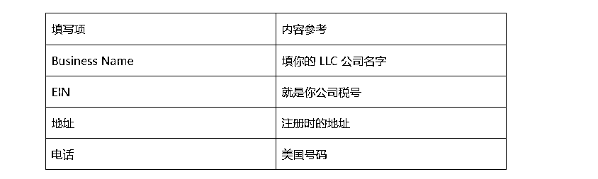
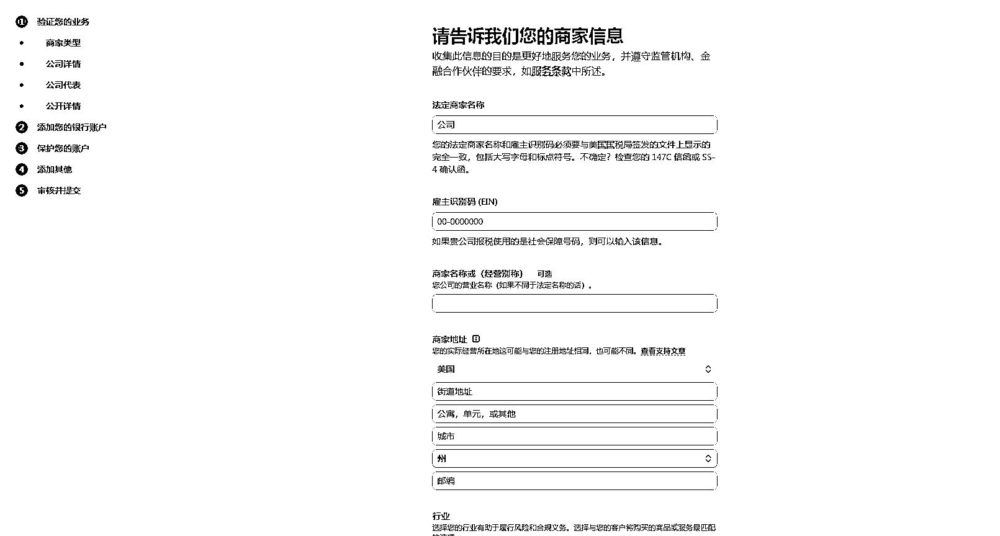

# (8 赞)3 分钟注册 Stripe 企业账号教程，超简单，0 基 础也能搞定！

> 原文：[`www.yuque.com/for_lazy/zhoubao/fh16eantzapfgbpg`](https://www.yuque.com/for_lazy/zhoubao/fh16eantzapfgbpg)

## (8 赞)3 分钟注册 Stripe 企业账号教程，超简单，0 基 础也能搞定！

作者： 国民弟弟的跨境十年

日期：2025-05-28

你还在用 PayPal 收款？那你真的是落后半拍了！

现在做跨境，不管你是搞 Shopify、Tiktok Shop、Notion 独立站、还是卖 AI 工具，没有一个 Stripe 企业账号，真的寸步难行！

今天咱们就不废话，直接来点实操干货：手把手教你怎么注册一个美区 Stripe 企业账号。

注册只要几分钟，门槛其实很低，大部分人不知道而已。只要你有一家美国公司，就能直接申请！

### 为什么一定要开 Stripe 企业账号？

国民弟弟做跨境这么多年，真心建议大家搞一个 Stripe 账号在手，尤其你要玩独立站、Tiktok
Shop、Shopify、WooCommerce……那 Stripe 就是你的“收款神器”！

### 总结的几个核心好处：

### 1）信用卡收款直接打通全球

PayPal 用起来太麻烦不说，账户一冻结你就只能干瞪眼。  Stripe 支持 Visa、Master、AMEX、Apple Pay、Google Pay……  只要客户能刷卡，就能收钱！

而且你可以直接在独立站挂收款链接，客户支付秒到账（连支付宝都支持绑定收款了），转化率爆表！

### 2）对接独立站、Tiktok、Notion 超简单

Shopify、WooCommerce 一键接入，Notion 直接贴 embed 支付链接都行。  做个卖模板、卖插件、卖 PDF 的页面，挂个 Stripe 一天被动进账都能有几十刀。

### 3）比 PayPal 稳定太多了

PayPal 动不动就限额、冻结、风控，真的是随时可能“翻车”。  Stripe 企业账号审核相对宽松，只要资料真实，很少有封号情况，而且它有专门的风控后台+客服通道，比 PayPal 靠谱多了。

### 4）你搞 AI 工具/数字产品？它就是你的“收款发动机”

现在很多人做 SaaS 工具、ChatGPT 导航、Notion 模版，用 Stripe 收钱非常香。客户付完钱还能自动开通权限，简直就是自动赚钱机器！

具体的给大家整理的一张图全面了解 Stripe 企业账号：

也给大家整理了一张与 PayPal 的对比：

### 注册 Stripe 企业账号需要准备啥？

只需要以下 4 个就可以：

一家美国公司（LLC 最好）  你如果还没注册，可以参考我这篇文章 150 美元就能搞定[`articles.zsxq.com/id_exggkcb30j69.html`](https://articles.zsxq.com/id_exggkcb30j69.html)

美国公司 EIN 税号  可找代理办理，大概 20-30 美元，或者你想 DIY 也可以，目前链接到了华美官方代理。

美国银行  推荐大家可以用水星银行

美国电话卡

美卡购买指南，[`docs.qq.com/doc/DZENab0xoV2R0TVlx`](https://docs.qq.com/doc/DZENab0xoV2R0TVlx)

也可以参考这两篇文章~

[`articles.zsxq.com/id_o6rg0ckprm5u.html`](https://articles.zsxq.com/id_o6rg0ckprm5u.html)

[`articles.zsxq.com/id_wna8dwxwoxki.html`](https://articles.zsxq.com/id_wna8dwxwoxki.html)

5.有公司网站店铺

建议有简单网站或 Shopify 店铺链接。

## Stripe 企业账号注册流程

### 第 1 步：打开 Stripe 官网

[`stripe.com`](https://stripe.com)

点击右上角 “Start now”，输入你的邮箱+密码注册。

小贴士：推荐用 Gmail 或 Outlook，别用 QQ 邮箱，可能收不到验证码。

### 第 2 步：选择“我是企业”

出现选择账户类型时，这里是企业账号与个人账号的分水岭，一定记得选“我是一个企业（LLC 公司）”。  别选错了个人账户，不然很多功能用不了。

### 第 3 步：填公司信息

这一步就是把你注册美国公司时的信息搬过来。

### 第 4 步：填法人信息

也就是你自己啦，按真实信息来就好。

*   姓名、生日

*   住址：可以填中国地址

*   SSN：没有的话可以勾选“我没有 SSN”

### 第 5 步：绑定收款账户

### 第 6 步：填你的网站链接

没有独立站？那就先用个 Notion 做个临时页面也 OK，随便挂个产品页就能通过审核。  业务描述写：

“We sell consumer goods via online store to US customers”

不要提什么虚拟币、金融服务、成人内容之类，容易被卡住。

### 第 7 步：提交审核，等待通过

基本上 1 小时内审核完成，有些快的 10 分钟就 OK！

注册成功后，登录 Stripe Dashboard，就可以生成收款链接、设置支付按钮、嵌入独立站等就可以了。

### 总结

Stripe 企业账号注册门槛并不高，有美国公司和 EIN 就能搞定；全程 5-10 分钟注册完成，真正做到“零技术、零基础”也能完成注册；如果你有做独立站、TikTok 美区、AI 工具收款需求，赶紧去搞一个，早注册早吃肉！

以上！

**国民弟弟相关创业的故事文章推荐：**

**跨境电商认知分享，个人创业者从 0 到 1000w+**

[`articles.zsxq.com/id_8n2o7gax71fr.html`](https://articles.zsxq.com/id_8n2o7gax71fr.html)

**3 分钟搞定美国公司，150 美金，超简单**

[`articles.zsxq.com/id_exggkcb30j69.html`](https://articles.zsxq.com/id_exggkcb30j69.html)

**3 分钟，如何远程开美国实体银行,送 2340 入金奖励。**

[`articles.zsxq.com/id_ubk2osmj6wzb.html`](https://articles.zsxq.com/id_ubk2osmj6wzb.html)

**美国收款工具：**

美版支付宝 Venmo:[`articles.zsxq.com/id_x73bbkhkkzau.html`](https://articles.zsxq.com/id_x73bbkhkkzau.html)

* * *

评论区：

暂无评论