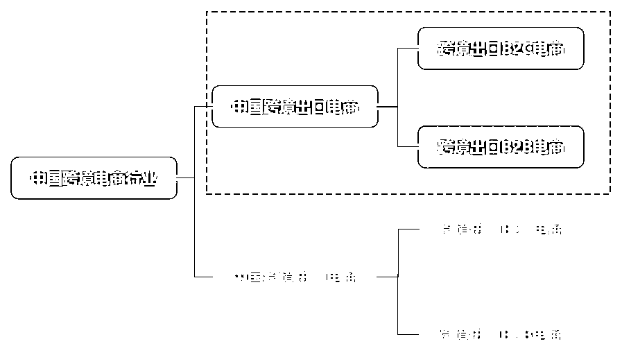
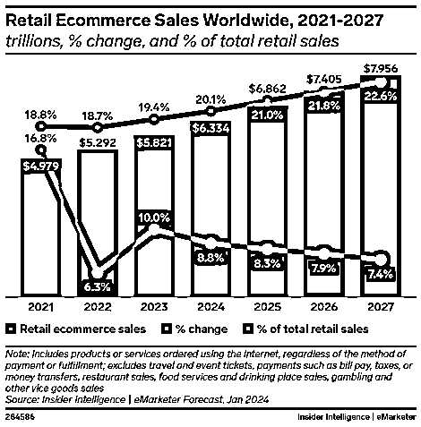
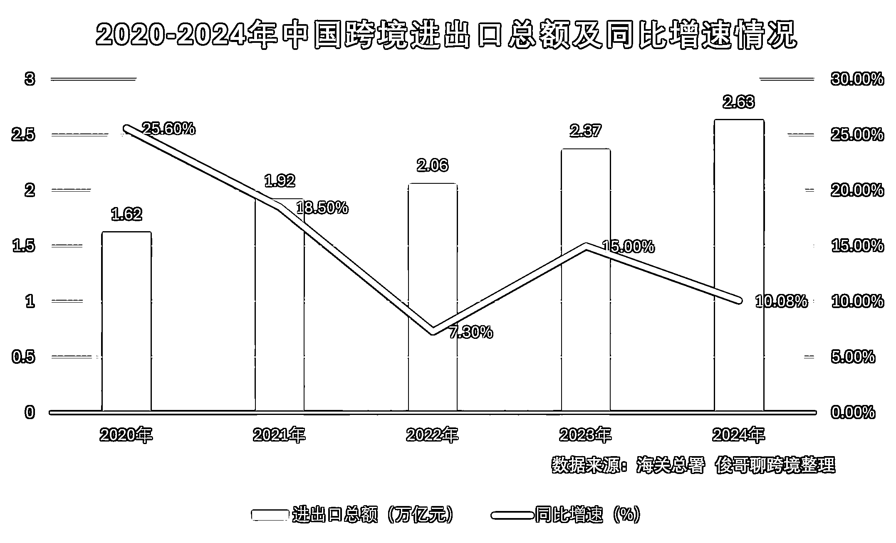
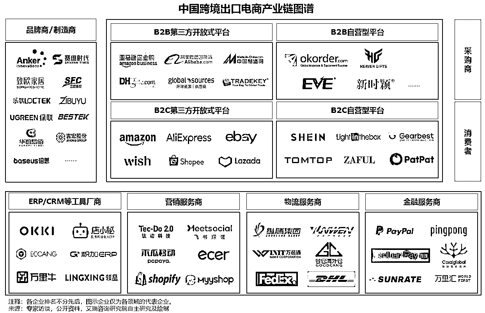
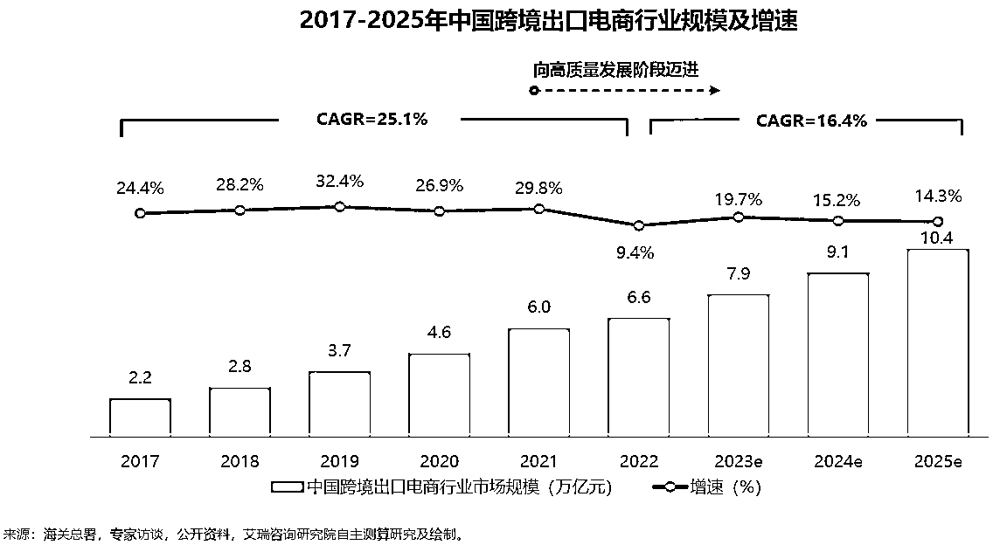
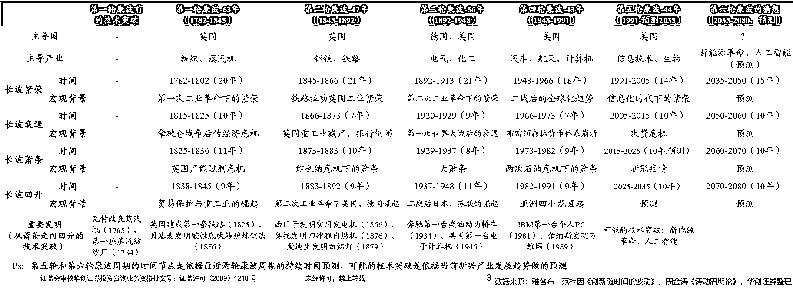
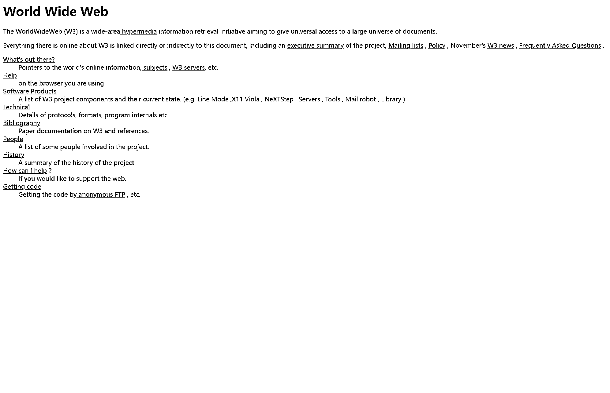
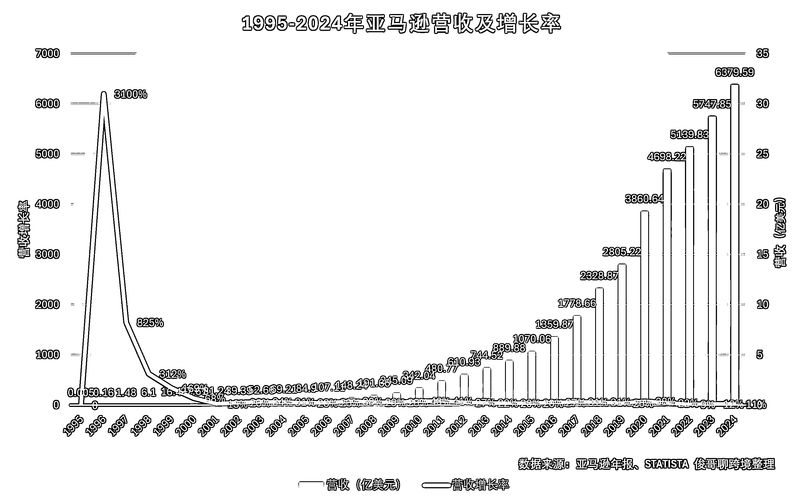
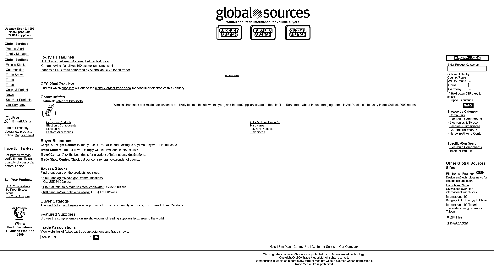
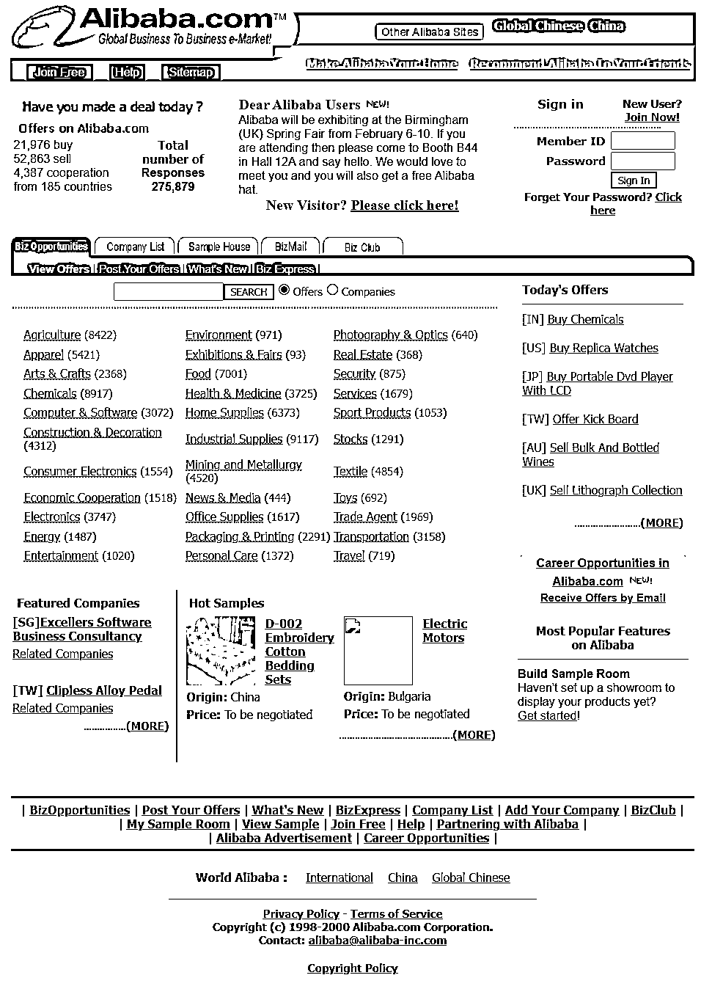

# (5 赞)狂飙 30 年：跨境电商发展史 Vol.000

> 原文：[`www.yuque.com/for_lazy/zhoubao/vxiw66sn6ofu8bsw`](https://www.yuque.com/for_lazy/zhoubao/vxiw66sn6ofu8bsw)

## (5 赞)狂飙 30 年：跨境电商发展史 Vol.000

作者： Bernie Fu

日期：2025-05-28

**摘要：**

从 1991 年全球首个网站诞生，到 1995 年 Amazon 证明在线零售可行性，再到中国跨境电商风生水起，这 30 年正好对应第五次康波周期的“繁荣—衰退—萧条”演进。本文将为你剖析跨境电商的定义、产业全链、四大发展阶段与未来突围路径。

**一、为什么要聊聊跨境电商这 30 年？**

**“见出以知入，观往以知来。” ——《列子·说符》**

透过现象可见本质，观照过往方能预判未来。

**大家好，我是俊哥，一名 10 年跨境从业者×AI 超级个体****×****一人品牌出海践行者。**

**  **

从 1995 年互联网初潮，到 2005 年平台化浪潮；从 2015 年供应链革新，到 2021 年社交与内容电商爆发；从亚马逊的“铺货为王”，到 TikTok 直播的流量狂欢；从 SHEIN 的小单快反，到独立站与 AI 驱动的微品牌……跨境电商
这个行业始终在政策红利、技术迭代与市场博弈的夹缝中野蛮生长。

外界总爱把跨境电商说成两个极端：要么是“某某大卖日出万单”的暴富神话，要么是“封号滞销资金断裂”的恐怖故事。但真相藏在灰色地带。2016 年的亚马逊“铺货时代”，深圳坂田的卖家们像疯了一样。他们从 1688 采购数据线、手机壳，用 ERP 软件批量上架，日均新增 500 个 SKU，毛利率能做到 60%。但没人告诉后来者：这种模式的核心，其实是吃透了平台流量红利期。当 2018 年亚马逊算法调整，把流量倾斜给品牌卖家时，那些囤了十万库存的铺货玩家，一夜之间全成了炮灰。

**这个行业最残酷的真相是：昨天的黄金法则，今天可能就是死亡陷阱。** 2014 年靠“跟卖”年入千万的卖家，2018 年死在封号潮里；2016 年靠“仿品”站群年入过亿的卖家，2020 年死在资金冻结里；而此刻在 TikTok 上日销百万的直播间，明天可能因为一条平台新规瞬间归零…...

十年前我带着对未来的迷茫来到了广州，机缘巧合下进入了跨境电商这个行业。当时的我什么都不懂，连“FBA”三个字母代表什么都没搞明白，更听不懂什么铺货、选品、运营、推广等。这个行业还像个江湖，没有课程，没有指南，一切都在黑暗中各自摸索着，偶尔在论坛里面刷到一些零碎的经验分享帖，感觉如获至宝。然而这个行业像一场飓风，裹挟着无数人的命运呼啸而过。

**这十年，我既是行业浪潮的参与者，也是历史变革的记录者。** 从菜鸟小白到操盘年销千万美元的 DTC 品牌，再到躬身入局创业失败重新开始，这一路走来有太多的血泪教训。

过去几年，我常被问及一个问题：**“跨境电商究竟是什么？它是怎么发展起来的？现在还值得入局吗？那些成功的企业做对了什么？失败者又踩了哪些坑？”** 遗憾的是，市面上从未有一本书或一门课程，能系统梳理这段波澜壮阔的历史——信息散落在论坛帖子的只言片语、行业大会的 PPT 碎片，甚至被封存的商业案例中。从业者对行业认知普遍碎片化——新手分不清“铺货”与“精品”的底层逻辑，投资人看不懂 SHEIN“小单快反”与传统外贸的本质区别，甚至资深卖家也难说清“亚马逊封号潮”与“独立站崛起”的历史必然性，往往只能在试错中拼凑认知，付出高昂的学费。

**于是，我决定写下这个系列——《狂飙 30 年：跨境电商发展史》。**

**  **

这不是一本堆砌数据的行业报告，而是一部“有血有肉”的实战纪录片。我将以亲历者视角，结合数百份政策文件、
企业财报、创始人访谈，以及尘封的行业报道，带大家回到历史现场，复盘那些决定行业命运的关键时刻，并尝试揭示行业规律，预判未来趋势，撕掉“暴富传说”的滤镜，还原行业真实的生存法则。每一篇文章，我都会标注核心信息的来源，**拒绝“江湖传闻”，只讲有据可查的真相。** 如果您亲历过跨境电商的某个发展阶段，或掌握珍贵的一手资料（如早期平台探索经验、企业发展历程、创业故事等），欢迎通过公众号后台联系我。您提供的线索，可能成为这个系列的重要注脚。

**如果你是行业新人，这个系列将为你补全认知拼图，少走几年弯路；如果你是资深从业者，愿这些历史案例能成为你预判未来的“战略地图”；如果你是政策研究者或投资人，愿这个系列能帮助你识别“伪风口”与“真趋势”。**

**  **

历史从未远去，它只是被遗忘在数据与流量的洪流中。

而我们要做的，是打捞记忆，照亮未来。

**二、系列 3 大核心任务：**

**  **

**1.构建历史坐标系：从“孤立事件”到“产业图谱”**

**  **

该部分将系统梳理跨境电商 30 年来的发展历程，绘制产业图谱：从进出口电商、物流、支付、政策、运营、人才、金融、园区等，全方位展示跨境电商生态的每一个环节，以及它们之间的协同与博弈。我将以四大阶段为纲，串联起行业发展的核心脉络：

**草莽年代（1995-2004）：** SEO 红利、黄页时代、亚马逊崛起

**平台崛起（2005-2014）：** 平台化、独立站、PayPal 支付、本地化 SEO

**黄金十年（2015-2024）：** 小单快反、数据驱动、社交电商、DTC 品牌、合规化

**重构纪元（2025-未来）：** AI 驱动、数智化全链路、本地化服务、DTC 微品牌、C2M 个性化

**2.解构行业变革力量：从****“现象观察”到“底层逻辑”**

**  **

该部分将系统拆解跨境电商“政策-技术-市场”的核心逻辑，从全球化博弈的高度，探讨驱动行业变革的底层因素。

**政策风向：** 加入 WTO、一带一路”政策、VAT 改革、RCEP、中美贸易摩擦等

**技术变革：** 支付、云计算、AI、区块链等

**市场格局：** 平台生态、社交种草、DTC、独立站等

**3.历史启示录：从案例中提炼可行动策略**

**  **

**成功者打法：** 比如 Amazon 的“平台+生态”思维、SHEIN
的“数据+柔性供应链”模式、Anker 以“技术专利+本地化内容”破局欧美，独立站复购率 35%，远超平台卖家。

**失败者教训：** 如兰亭集势：过度依赖婚纱品类，未布局多语言独立站，毛利率仅 15%（2018 年退市）、环球易购：忽视移动端 SEO，PC 流量占比超 80%，库存滞销率 60%（2021 年财报）等。

**未来方向：** AI
Agent 替代 80%人工选品、客服工作，生成式内容（AIGC）降低运营成本、合规生存下欧盟 DSA 法案、碳关税、本地化生产、模式迭代 DTC
3.0：AI 驱动的一人品牌模式，0 库存+社交媒体裂变等。

**三、现在让我们来聊聊什么是跨境电商？**

**  **

**跨境电商** ，即跨境电子商务（Cross-border Electronic
Commerce），是指不同国境地域的交易主体之间，以电子商务平台的方式达成交易（在线订购、支付结算，并通过跨境物流递送商品，清关，最终送达）的一种国际商业活动。从广义上看，跨境电商基本等同于外贸电商，它是将传统进出口贸易中的展示、洽谈和成交等环节电子化、数字化、网络化，并借助跨境物流完成商品送达的新型贸易方式。它具有全球性、非中心化的特性，依托于网络的无边界性，使得交易可以跨越国界进行。按交易属性划分，主要包含了 **B2B** （跨境出口企业对境外采购企业进行公对公商业活动模式）和 **B2C** （跨境出口企业直接为个人消费者提供商品和服务）。按进出口类型划分，可分为跨境进口电商与跨境出口电商，**本系列主要讨论出口跨境电商** 。

据 eMarketer 数据显示，2024 年**全球电商销售额** 预计将达到**6.3 万亿美元** ，占全球零售总额的 20.1%，同比增长 8.76%。2024 年至 2027 年，全球电商销售额将以 7.8%的复合年增长率持续攀升，预计到**2027 年将达到 8 万亿美元** 。从市场参与主体来看，根据 Built with
数据，截至 2024 年，全球共有 2720 万个电商网站，比上一年增长了 6.16%。这意味着在 2023 年至 2024 年期间，每天都有 2685 个新的电商网站面世，不断为市场注入新活力。

**  **

**近年来，跨境电商行业凭借其迅猛的发展势头，已然成为推动我国外贸增长的重要引擎。** 根据海关总署数据，2024 年，我国外贸实现了总量、增量、质量的“三量”齐升。从总量看，连续跨过 42、43 两个万亿级大关。去年，全年进出口总值达到 43.85 万亿元人民币，同比增长 5%，规模再创历史新高。**出口规模首次突破 25 万亿元** ，达到 25.45 万亿元，同比增长 7.1%，连续 8 年保持增长，展现出较强的动能和活力。其中我国**跨境电商进出口 2.63 万亿元，增长 10.8%，比 2020 年多了 1 万亿元。**

**  **

**  **

**跨境电商全产业链** 是指有效构成跨境电商发展的各个部分及环节，包括**进出口电商、物流、支付、政策、运营、人才、金融、园区** 等，各个部分及环节的发展都与行业密切相关，都能助推或影响跨境电商的发展。目前，我国已迎来跨境电商全产业链发展时代，政策助力打造跨境电商全产业链庞大的市场会驱动发展，不管是进口还是出口跨境电商，都存在着巨大的市场机遇。

据中商产业研究院预计，2024 年**中国跨境电商全产业链规模** 将达到**17.66 万亿元** ，同比增长约 7.32%。2022 年，**跨境出口电商全产业链规模** 达到了**6.6 万亿元** ，并以 16.4%的年均复合增长率实现稳中有进的发展，预计至 2025 年突破**10 万亿元** 。

**  **

**出口跨境电商从诞生那天起，就注定是不平凡的。** 回顾出口跨境电商走过的路：从 1995 年《环球资源》B2B 黄页开始对外洽单、2000 年最初跨境在线销售共享软件的那一批人，到跨境在 eBay(易趣，跨境电商平台)销售影像资料的第一波探路者；从香港邮政小包的面世促生跨境销售电子产品，到各种跨境物流服务产品层出不穷，涌现一大批垂直型跨境电商平台；从跨境零售电商企业兰亭集势冲击上市，到超级大平台速卖通及 Wish(跨境移动电商平台)出现后跨境出口模式受到资本冷遇；从各方努力解决跨境零售出口最后一公里之难，到海外仓火热流行，出口跨境电商已经经历了三十年的发展时光。

**从生产力发展周期来看** ，跨境电商走过的这三十年，正好也是第五次康波周期从繁荣走向萧条的三十年。新一轮技术革命正在酝酿，本轮核心是
AI、大数据、自动化。跨境电商将在更精细化运营与技术赋能下，迎来下一个增长拐点，依托国内强大的产业链以及 AI 技术赋能，**未来一人企业做全球品牌将不再是幻想。**

**  **

**  **

**时至今日，出口跨境电商已经走到了一个重要的历史阶段：**

面对层出不穷的关税壁垒、本地化合规、物流与仓储成本、平台规则波动、技术与金融风险、品牌出海困境、AI 技术变革、以及新兴市场强劲的本地竞争等在后续系列文章中，我们将逐一深入讨论。

**四、了解跨境电商的起源**

**1991 年 8 月 6 日，蒂姆·伯纳斯-李（Tim Berners-
Lee）创建了世界上第一个网站 info.cern.ch，****标志着互联网时代开启，奠定了后续电子商务的底层基础。** 以互联网为代表的新一轮信息技术革命的到来，不仅促进了传统产业的升级改造，更渗透到各个行业和社会、经济、生活的各个角落。跨境电商，就是在这一轮技术革命背景下产生的新兴行业。和其他行业一样，也经历了从无到有的一系列发展过程。

**1994 年 7 月 5 日，** 30 岁的杰夫·贝索斯（Jeff
Bezos）辞掉了华尔街的工作，从纽约一路驱车到西雅图，在贝尔维尤租下的简陋车库里，开始了一场改变世界零售格局的创业实验。彼时，互联网还只是科研和高校间的“小众网络”，真正的商业模式尚未出现；而
Bezos 则凭借对“全球书店”构想的极致执着，率先瞄准了线上图书交易。

**1995 年 7 月 16 日，全球第一家电商平台 Amazon.com 正式上线。** 售出第一本书（Douglas Hofstadter 著《Fluid
Concepts and Creative
Analogies》），证明在线零售可行性。正式上线第一个月，亚马逊就收到来自美国 50 个州和 45 个国家，6 多万美元的图书订单，当年亚马逊实现了 51.1 万美元的销售收入，第二年 1996 年销售收入达到 1570 万美元。这家全球跨境电商霸主开启了 30 年的狂飙之路，营收从 1995 年的 51.1 万美元增长到 2024 年的 6380 亿美元，年平均复合增长率（CAGR）高达 62.23%，营收增长高达 1,248,532 倍。

**  **

**1995 年 9 月 3 日，Pierre Omidyar 推出 AuctionWeb（eBay）。** 首件商品是一支售价$14.83 的坏激光笔，在线拍卖模式迅速吸引用户。eBay 月度营收迅速从约 1,000 美元增长至 10,000 美元，虽规模不大，却证明了线上竞价模式的可行性与用户粘性。

**中国跨境电商萌芽**

**1994 年 4 月 20 日，中国正式接入国际互联网，****奠定了跨境电商发展的基础设施。** 1995 年，黄页杂志《环球资源》上线了自己的 B2B
交易网站，在当年是中国卖家中首屈一指的平台，中国跨境电商开始萌芽。

**  **

**1999 年 6 月，中国最大的外贸信息网页平台 Alibaba.com 成立，连接中国中小制造商与全球采购商，标志着中国跨境电商的正式起步。** 据海关总署数据，2024 年，我国跨境电商进出口 2.63 万亿元，增长 10.8%。其中 B2B 模式占比 65%，B2C 模式占比 35%。过去 5 年，我国跨境电商贸易规模增长超过 10 倍。截至目前，我国跨境电商企业数量已超 12 万家，跨境电商企业累计在海外注册商标超 3 万个。

**五、结语：与未来并肩而行**

**  **

“见出以知入，观往以知来。”回望三十年跨境电商的跌宕起伏，我们不仅要洞见过去，更需以史为镜，捕捉下一波浪潮的脉动。

如果你渴望提前预判趋势，少走弯路；如果你想汲取成功与失败的经验，实现小规模“大格局”；如果你期待与更多实战大咖、行业先锋一起对话——**那就请关注「俊哥聊跨境」后续系列文章。**

**  **

下一篇 Vol.001《全球电商平台演化简史》即将上线，我们将从 Amazon 到速卖通、Shein、TikTok
Shop、Temu，带你看懂巨头们如何抢占全球市场、重塑全球贸易格局。

**— 俊哥聊跨境**

**10 年跨境从业者×AI 超级个体× 一人品牌出海践行者**

**参考资料：**

1.华创证券：《康波周期复盘：康波周期与中国式现代化》；

2.艾瑞咨询：《2023 年中国跨境出口电商行业研究报告》；

3.中国海关总署：历年进出口数据。

#跨境电商 #独立站 #品牌出海 #AI 技术

* * *

评论区：

路明 : ai 味道好重

Bernie Fu : AI 能写出来这种？

静水流深 : 我有个暗黑版的跨境发展史正在写连载，都是我经历过的事情，没 30 年，但是快 30 年了[呲牙]

Bernie Fu : 捕捉前辈大佬，在哪里连载我去拜读一下，哈哈哈哈。我入行 10 年，全靠自己一点点碎片化学习拼凑对这个行业的认知，踩过太多坑了，深感跨境发展史重要，看到太多人没有行业认知跟全局视野，被割韭菜，希望这个系列能有一点点帮助吧。

高大卫 : 期待 可以脱敏处理哈哈