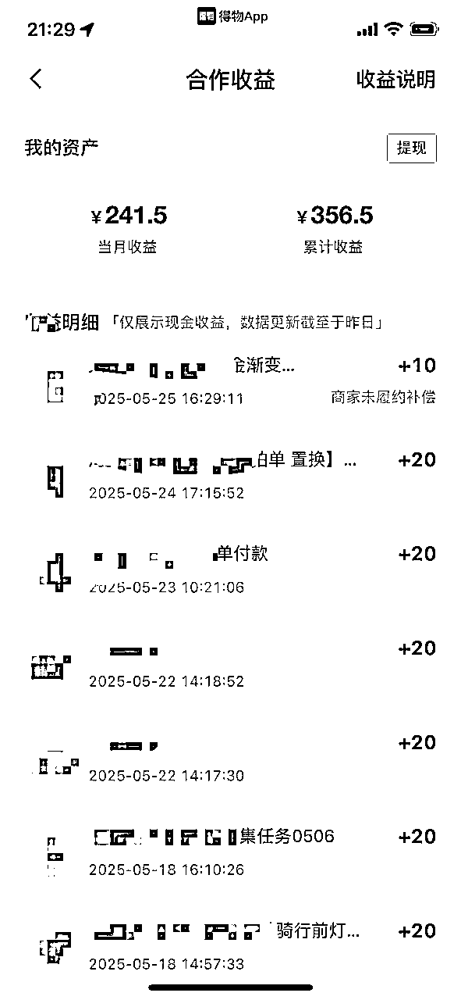

# 【得物】升级玩法稳定月入1500+，0粉也能接广告

> 来源：[https://fi8jncah4ds.feishu.cn/docx/AMfHd7Bj5o6Dtix6EBxcfhgwnrg](https://fi8jncah4ds.feishu.cn/docx/AMfHd7Bj5o6Dtix6EBxcfhgwnrg)

# 自我介绍

大家好，我是风小海。公众号同名

人在武汉，三年生财老圈友，服装行业，亏过也赚过，现在时间自由，离财富自由还差亿点点。

在过去的一年里，我通过风向标中标兑换了一年生财门票，我不是天赋型选手，只是走过不少弯路，踩过的坑刚好比你多一点。所以我想把这些年亲自试过的赚钱项目一条条写下来，这段时间我会分享100个真实项目，全都写给认真生活、认真赚钱的人。

新内容我都会同步在生财

我第一桶金的故事

# 前请提要

先说结果，通过得物纯搬运图文赏金的玩法，我总共变现了4W多，虽然废了不少号，但好在是躺赚，没有耗费我太多精力。这半个月我尝试接得物引力商单广告，2个号佛系接单算上商家的赠品大概变现了1500左右，很稳定，并且0粉账号也可以做。

看过我第一篇的得物帖子的人都知道

得物可以说是现在所有平台里最大方，最舍得给创作者钱，同时也是变现门槛最低的平台了，没有之一。

这篇帖子是得物赏金搬运的升级玩法，内容会提到如何0粉开通引力平台商单权限以及如何接到自己的第一笔广告商单。我不会像其他精华帖那样给你画大饼，这并不是说他们的内容不好，只是对于新手来说还是存在门槛，信息量巨大的干货帖只能暂缓你的知识焦虑，但看过了并不等于赚到了。我会用最简单粗暴的方法教会你如何用得物实现你的第一笔网赚

# 如何理解得物平台

简单说，得物就是“拼多多版的小红书”。

把小红书的滤镜和精致人设全扔了，只留下三个字：好卖货。

它不需要你人设完美、照片高级、生活精致，只要你敢说、肯拍、会选品，哪怕是0粉小白，也能靠内容赚到第一笔钱。得物不需要你多专业，也不指望你是个测评达人。

你不用会拍视频、不用懂摄影构图，甚至连“种草”两个字是什么意思都不用太明白。

你只要老老实实地写出你用完这个东西的真实感受，平台就能给你流量。

你越不端着，越有人看。

得物的逻辑是：

真实比包装更值钱。用户不需要你“像达人”，他们只希望你像“朋友”。

所以有时候，一个手机壳、一个护手霜、一双袜子，拍一张图、写两句话，说清楚“为啥买”和“用得咋样”，就能带来上千曝光。你越真，平台越挺你。

# 引力商单

得物的引力商单，其实就对应小红书的蒲公英平台。

说白了，就是品牌来找你发广告的地方。

不同的是，小红书是先做人设、慢慢养号、等品牌来挑你；

而得物是你完成认证、达到门槛之后，直接进“引力商单池子”抢单子。

像饿了么抢单那种，谁手快谁有饭吃。

门槛也不高，普通创作者只要满足以下几个条件，就能开通引力商单权限：

### ① 实名认证 + 年满18岁

在“得物创作者中心”中完成实名认证

年龄满18周岁即可（用身份证即可认证）

* * *

### ② 账号信用等级为 C 及以上

信用等级为 C 表示“基本合格”

如果是 D 等级，就会被限制开通

* * *

### ③ 内容发布数据要求

连续发布内容14天，这14天中，至少12条内容阅读量>500

⚠️ 注意：

不是“只发14条就行”，而是 连续14天每天至少1条，保证活跃度

要有12条内容表现达标（>500阅读）

更爽的是：

得物目前商单竞争还不激烈，品牌预算实打实，只要你会写点人话，就能赚点人钱。

一句话总结：

别把“接商单”想得太高大上，得物是个实打实给你派饭的地方——你只要饿得够快，平台就喂你吃饱。

# 如何快速满足引力商单门槛

### ①明星穿搭图文种草：

在微博和小红书找到明星穿搭的原图，在到淘宝找到同款的白底图，最后用美图秀秀排版拼图，最后用AI洗稿文案，一篇明星穿搭种草的笔记就完成了，涨粉会很快，不过这类属于白底图，这14天大概率是没有种草赏金收益的。

### ②图文搬运：

这个方法可以不既不浪费这14天的时间，又能在达成门槛的同时赚到种草赏金，不过方法不对的话容易违规，得物3次违规的话就封号了。我这个方法可以尽量避免违规

# 如何选择赛道：

### ①得物的分类：

类目上就是你可以选择的赛道，只要得物商城有售卖的东西你就能获取赏金收益，后续也能接引力商单。

### ②0粉新号怎么选赛道：

看你自己最顺手、最有货的东西是啥

经常买护肤品 👉 护肤赛道

喜欢穿搭拍照 👉 穿搭/美妆

爱买奇奇怪怪的好物 👉 好物/生活类

你要选你最“不费劲”的方向。

别人花2小时拍的视频，你20分钟拍完，就说明你选对了。

### ③ 别选这些“陷阱赛道”

# 小白为什么能接商单

很多人不信，觉得没粉丝为什么有商家给你发广告？我什么都不会，拍的广告能通过审核吗？

其实你得先明白得物这块“宝地”跟小红书不一样。没有太多华丽的包装，也没有评论区的那股戾气，

得物这里用户更接地气，更真诚，喜欢听真话，小红书的那些精致流水账在得物用户眼里反而get不到点。他们宁愿看你一脸接地气的素人分享买了啥、用着咋样，踩了哪些坑，说实话就能赢得关注和信任。

社区氛围更像邻居家大妈串门，聊得真诚热乎，没人甩脸色，没人摆架子。

你真诚写分享，大家就愿意“帮你撑场子”——点赞、评论、转发，甚至互相推荐。即使你没有粉丝，但你近期有帖子爆了，流量不错的话，品牌也会通过你的商单。

案例：比如下面这个帅小伙，这种真诚分享的风格在得物特别受欢迎，评论区也都是热情的称赞和鼓励，氛围一片祥和。在得物上这样的博主比比皆是，拍摄门槛也非常低，只要你敢于分享，平台就敢给你流量

# 注意事项

### ①不要有精神洁癖

什么选哪个赛道好？账号要不要垂直？这样会不会太low？让我骂醒你，请你不要带入自己的审美，这样你会很内耗。也许其他圈友说的是认真拍摄，坚持下去一定会有收获，但我想说的是，别自己给自己画饼，得物这个项目，活在当下就好。别想着“等粉丝高了接高价广告”，就活在今天，现在能赚钱就先赚钱。哪怕产品你一开始不喜欢，接了单，钱到手才是真的。别给自己设限，越想越累，粉丝高那天，说不定你早就放弃了。

### ②不要做女生穿搭赛道

这个时候肯定有人想说，你是不是打脸了，上面还说那个小伙穿搭赛道门槛很低可以随便涨粉？没错，男生穿搭赛道确实要比女生穿搭好做，但女生穿搭却非常卷，为什么得物会形成一个这样的现象呢？因为得物上面太多的女大学生博主，她们本身自己就爱拍照，做得物能够每天有很多衣服拍照片，对她们来说就是一件顺手的事，20块的佣金都能给你拍出一朵花来，这种良性竞争就会导致女生穿搭赛道的广告审核标准会更高，但也不至于像小红书那么高，如果你也是一个喜欢拍照的人，那就当我没说。

# 总结

这是一个对新手极其友好的项目，小白也能感受到当博主、接广告的快乐，并且还挺稳当的，有一定的上升空间。

但前提是：别内耗、别瞎想。

虽然标题是月入1500+，但实际上配合种草赏金+广告佣金的双重收益，单个账号大概能做到3000-5000/月，因为种草赏金搬运的逻辑就是缩短了你自己的创作时间，提升了创作效率，这样无脑操作，种草收益就会很可观。

你做这件事的唯一目标就是两个字：赚钱。别拐弯，别给自己加戏。

还有想对新手圈友说一句：别当精华帖的收藏家。

看得再多，不如你真下场干一把。

那些动不动1万字的干货长文，真正对你有用的，也就几百字。别焦虑，别死背。

把它当工具书、翻字典，用得上就查，用不上就放着。

请你放松点，别绷着。

赚钱这事，得是轻装上阵，别自己把自己卷死

