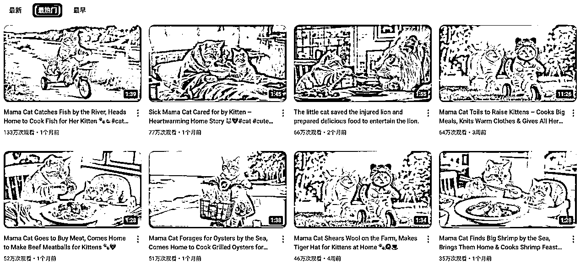
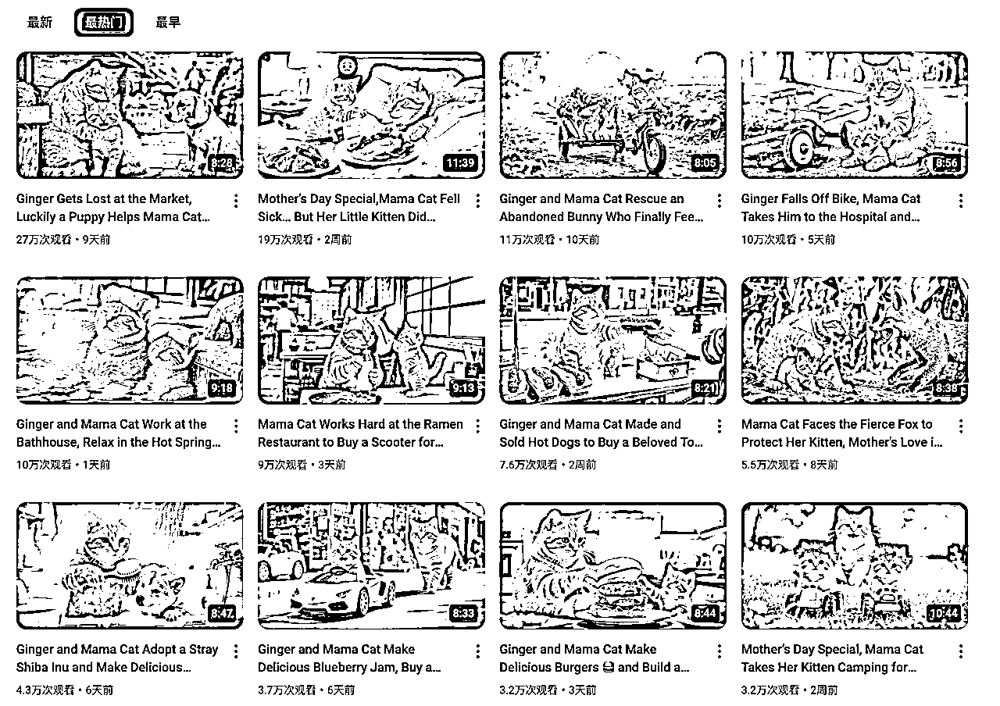
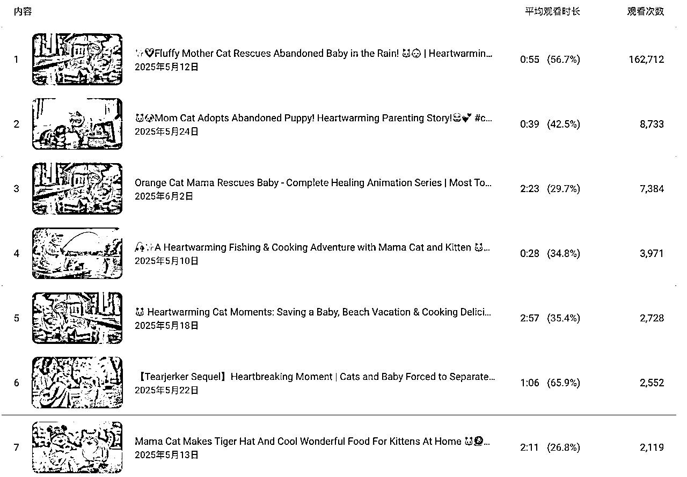
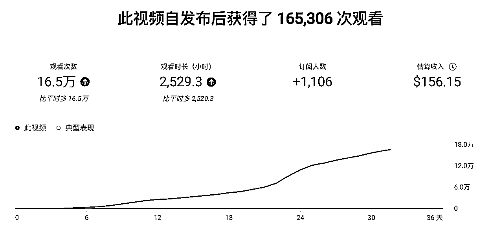
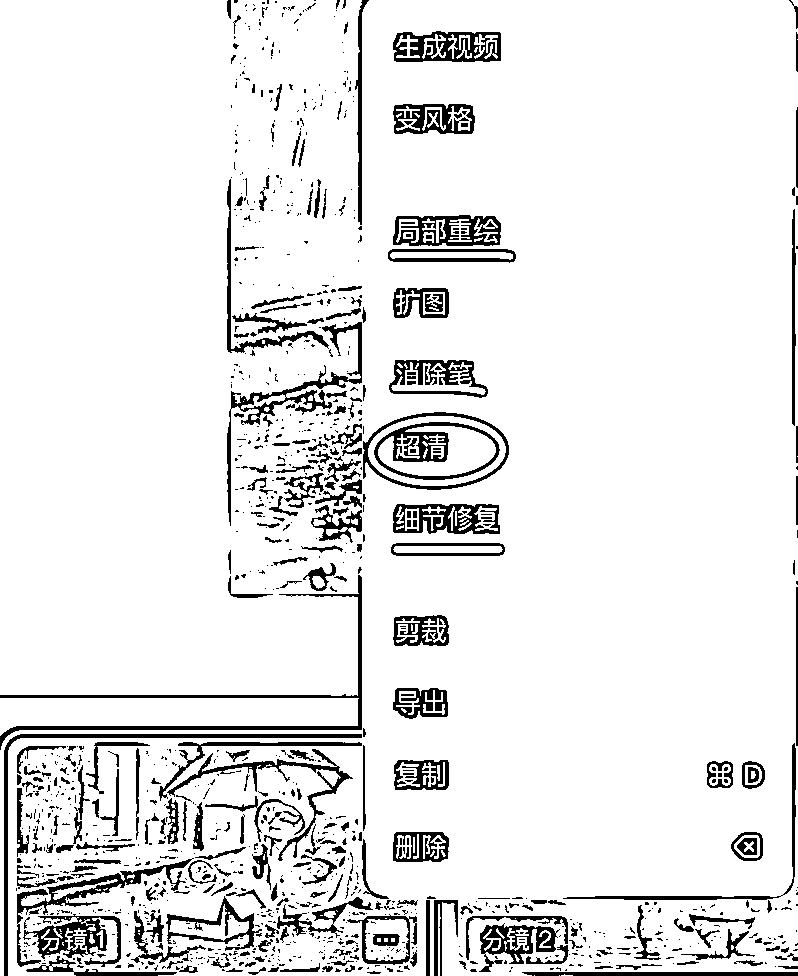
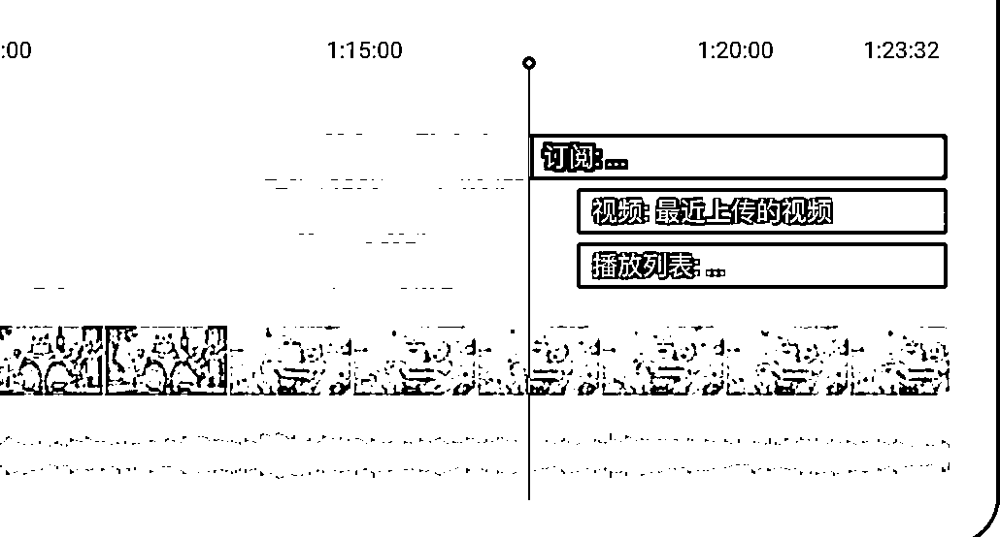
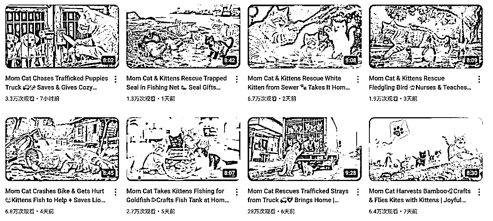
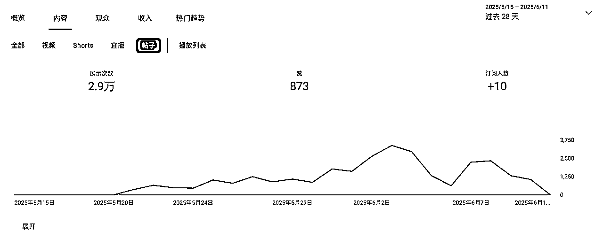
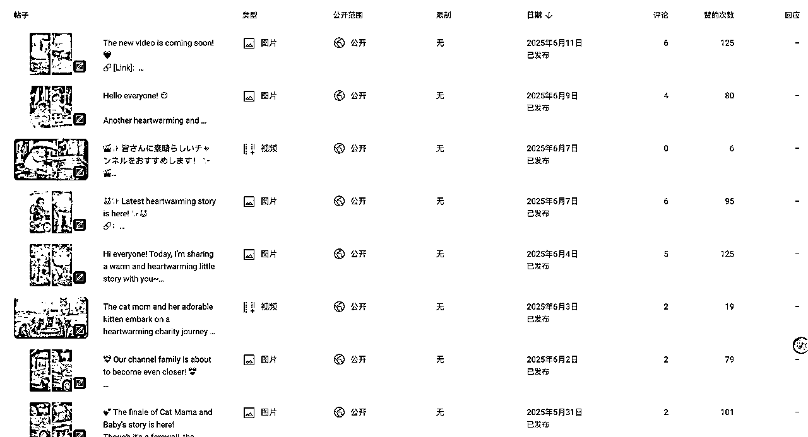
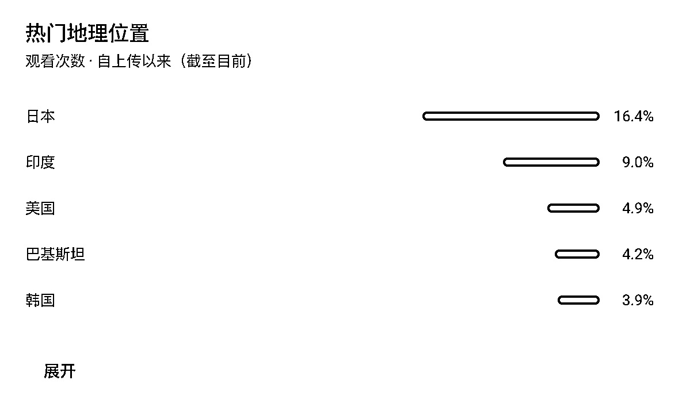

# 猫咪疗愈长视频拆解 & 频道运营技巧

> 来源：[https://lijv5pnbdb.feishu.cn/docx/AXDQd1GmtoxzljxZYl1cJT2Ankh](https://lijv5pnbdb.feishu.cn/docx/AXDQd1GmtoxzljxZYl1cJT2Ankh)

大家好，我是轻舟，生财传术师，youtube深海圈教练。

在youtube深海圈，已经有非常多的圈友开通了YPP，其中不少开通了多个YPP。

开通之后，面临收益放大的问题，那么中长视频就是必须攻克的难关。

作为youtube深海圈教练团的一员，相比其他圈友，会更早开始长视频的探索。

今天我就以猫咪疗愈长视频为例，细致地进行拆解，

最后会介绍更加通用的技能——频道运营技巧，希望能抛砖引玉，给大家带来一些启发。

# 猫咪疗愈长视频拆解

开始之前，先看数据

## 对标频道数据

https://www.youtube.com/@Yangxiaohui520

https://www.youtube.com/@MeowMemoirs97/videos

https://www.youtube.com/@StarAndManny

对标收益估算（只估算截图中的，根据我自己赛道真实RPM估算）

Yangxiaohui520：524 * 10 * 1 = 5240刀 （RPM按1来算）

MeowMemoirs97：80 * 10 * 1.2 = 960刀 （RPM按1.2来算，视频稍长一些）

StarAndManny：113.5 * 10 * 2 = 2270刀 （8分钟以上，RPM按2来算）

注意：我们在研究对标时，可以把对标收益作为上限，实际收益可能是对标的10%-50%，不同赛道情况稍有不同，要有合理预期。

## 我的频道数据

起点足够低，赛道几乎是从零开始，贴合大多数圈友现状

数据缓慢变好，没有爆款

所以，这肯定是一个非常接地气的分享，按照分享的思路，做到上面展示的数据，应该不难

## 怎么发现赛道

灵感来自深海圈风向标，当时有一个很火的猫咪视频，在它的推荐视频里面，发现了这个赛道。

看到数据不错，拆解发现制作非常简单，就开始尝试。

## 视频预览

## 制作过程

### 1、故事创作&生成分镜

#### 方法1：使用AI Studio直接拆解（有对标）

1）获取分镜

示例：

帮我拆解这个视频，输出各分镜的描述、各分镜文生图的提示词、各分镜图生视频的提示词，多一些细节，中英文输出

2）修改或替换角色、场景等（可选）

目的是防止与对标太相似，避免一些版权问题

示例：

帮我把故事中的成年橘猫换成超级胖的姜黄色成年猫咪，小橘色虎斑猫换成一只胖乎乎的姜黄色小奶猫，重新输出故事

#### 方法2：直接创作

示例（Claude 4.0）：

再创作一个故事，内容是:在一个下雨天，超级胖的姜黄色成年猫咪和胖乎乎的姜黄色小奶猫发现了一个被抛弃的婴儿，成年猫咪把婴儿带回了家，回家后，先冲了奶粉给婴儿和小奶猫，最后又煮了米糊给婴儿，饭后，婴儿和小奶猫一起玩耍，把我拆成各分镜，给出各分镜用即梦3.0文生图片的描述词

### 2、图片生成（即梦3.0）

推荐使用即梦的故事创作功能

https://jimeng.jianying.com/ai-tool/story-editor

直接在各分镜中输入提示词即可

注意：

1、故事创作中内置了智能画布功能，可方便对图片进行编辑，常用的有局部重绘、消除笔、细节修复

2、下载图片之前，图片记得做超清处理

加个知识点

即梦3.0角色一致性保持

公式：角色（特征：如外貌、衣着、状态等）+ 做什么

即梦3.0角色一致性保持示例：

温馨卧室内，金色阳光透过白色蕾丝窗帘洒入，成年猫咪（超级胖，姜黄色）温柔地轻抚一个人类婴儿（穿黄色连体衣），旁边还有一只小奶猫（胖乎乎，姜黄色）在柔软床边伸懒腰，床上有粉色小枕头和毛绒玩具，墙上挂着姜黄猫咪的家庭照片，写实风格，柔和暖光，超高清细腻画质，治愈系氛围

美丽的樱花大道上，成年猫咪（超级胖，姜黄色）用精美的并排式双人婴儿车推着一个人类婴儿（穿黄色连体衣）和一只小奶猫（胖乎乎，姜黄色），车上装饰着彩虹色气球和小风车，粉色樱花瓣飞舞，蓝天白云，写实风格，明亮温暖色调，电影级画质

华丽的旋转木马场景，精美的粉色独角兽木马配金色装饰，成年猫咪（超级胖，姜黄色）温柔抱着一个人类婴儿（穿黄色连体衣），婴儿怀里抱着一只小奶猫（胖乎乎，姜黄色），背景是梦幻的童话城堡和彩虹拱门，旋转的彩灯营造魔幻氛围，写实风格，丰富色彩，专业摄影级别

精致的儿童观光小火车内部，红色天鹅绒座椅，成年猫咪（超级胖，姜黄色）和一个人类婴儿（穿黄色连体衣）并肩而坐，一只小奶猫（胖乎乎，姜黄色）趴在窗台上，窗外是奇幻的童话世界：彩色糖果屋、巨大蘑菇森林、会发光的花朵，隧道内有星星点点的装饰灯，写实风格，梦幻光影效果，高饱和度色彩

### 3、图生视频

工具：可灵1.6（其他可自行尝试）

*   每张图生成10秒钟视频片段

*   动作要非常缓慢（疗愈赛道特色）

### 4、剪辑

*   视频适当裁剪后，简单拼接即可

*   背景音乐要使用疗愈音乐

*   可以自己生成，也可以直接拿对标的纯音乐（大家都在用，没有版权风险）

### 5、视频上传

1）标题和简介（Claude 4.0）

根据上面的故事，写一个youtube视频的标题和简介，要求进行SEO优化，内容要有吸引力，带上标签，简介要分成小段，适当增加表情，输出中英文版本

2）上传设置（记得设置片尾动画）

根据片尾动画模板，设置订阅频道、播放列表、推荐视频

建议：

*   标题和简介可以让AI帮写，记得进行SEO优化

*   视频记得加片尾画面

其他：

*   缩略图对比测试

### 6、赛道理解

1）不仅是猫咪视频赛道，更加是疗愈赛道（从评论区获得思路并验证）

2）疗愈赛道，也被称为AMSR，典型特点是疗愈心灵，外在表现就是视频很长，适合直播

总结 & 发散

*   制作简单，赛道非常安全，可以轻松日更

*   结合疗愈赛道特定，是不是可以组合成更长的视频？

*   原来的爆款重组方法，在长视频中，是否还奏效？

*   我们现在拆解的视频，就用了经典的爆款因素——婴儿

*   能不能更进一步，在爆款重组的基础上，再开发一些玩法，形成自己的壁垒呢？

*   下面的频道运营技巧告诉你

# 频道运营技巧

## 1、素材重复利用

⚠️注意：

YouTube715政策之后，加大了对重复内容的打击力度，素材重复利用要谨慎，保险点可以放弃重复利用素材。

### 1）视频可以拼接再次使用

把几个1-2分钟的视频，拼接成8分钟以上的视频，丝毫不影响视频流量

*   可以使用简单剪辑手法，比如：镜像（实测下来，直接拼也不影响流量）

*   数据分析，8分钟以上的拼接视频，数据反而比1-2分钟的长视频数据普遍要好（异常值）

*   8分钟视频的RPM，是1-2分钟视频的2-3倍

*   缩略图对视频数据影响很大，要选择吸引人的，可以使用缩略图对比测试

### 2）新视频拼接老视频

https://www.youtube.com/@Yangxiaohui520

https://www.youtube.com/@MeowMemoirs97/videos

虽然都是8分钟以上的长视频，经过仔细拆解发现：

其实只有前面一分多钟是新做的视频，后面全部是拼接的老视频

### 3）异常点解析

拼凑的8分钟以上长视频，很多时候数据反而比1-2分钟的视频好，是什么原因？

我专门跟曹教练讨论过，据他说，大概率是这个赛道的8分钟以上视频比较稀缺，赛道内的竞争是根据时长区间的，8分钟以上视频没什么竞争，所以才会有这种异常现象。

既然如此，那20分钟的呢？直接给你看！

https://www.youtube.com/@gameplus8897/videos

## 2、发帖

### 1）视频预告（增加曝光，为视频引流）

提前公布你要发的视频内容，附上一两张视频里面的图片，类似于电影的预告片

### 2）发起投票（故事走向或角色去留）

角色评选：比如猫妈妈捡到一个婴儿，度过了一段美好时光，可以在帖子中发起征求意见，要把婴儿送还给他的父母吗，还是继续留着猫咪身边（设置规则或门槛，比如票数超过100才有效、会员1票当2票等）

### 3）视频推荐（可以推荐自己频道，也可以推荐其他频道）

*   可以为自己的视频引流

*   可以为自己的小号或者转赛道的号引流，帮助完成冷启动

### 4）粉丝互动

*   会员招募&会员福利预告

通过预告会员福利，吸引普通订阅者成为会员

*   故事征集

比如：发帖征集想看的故事，会员的故事有几率被选中，并在视频中标注故事来自谁

*   定期感谢贴

针对有贡献的会员，发布感谢贴，并@对应人

帖子玩法小结

*   为视频引流，帮助视频顺利完成冷启动

*   观众与频道进行互动的有效途径，增加观众黏性

*   转化会员，每月固定收益（努力中）

*   其他玩法欢迎大家一起探索

## 3、地理位置调整

很多人的视频中，印度地区播放量遥遥领先，非常无奈

我也是这种情况，通过细致的运营，这种情况已经大幅好转。

地理位置调整思路：

*   分析现有数据，从中找到印度之外的热门地区（你想要的）

*   分析你想要地区的评论，找到他们的需求点（比如画面精美、可爱治愈等）

*   发布视频时，除了英语之外，增加你想要地区的语言（发帖子也是一样）

*   不断微调，跟你想要地区的人多互动，还可以使用他们的语言进行回复

## 4、会员玩法（待探索）

*   视频提前看

*   会员专享视频

*   全集福利

*   其他

总结：

*   通过跟用户互动和评论区，精准理解自己做的赛道

*   时长错位竞争的思路要牢记

*   长视频也要使用爆款重组的思路

*   通过运营技巧，重视老用户的体验

思考：

*   既然猫咪疗愈赛道的素材可以重复使用，那么是否可以扩展到其他赛道？

*   做长视频时，对所选赛道的理解够不够？能不能挖掘出更多的玩法？

*   频道运营怎么做？做到哪一步比较合适？

希望能给大家带来一些启发，期待与各位一起探索出更多玩法。

最后，感谢YouTube生财深海圈 方波妮总教练、感谢 Gary曹淦总教练的指导

也非常感谢七天老师对本帖的耐心指导！