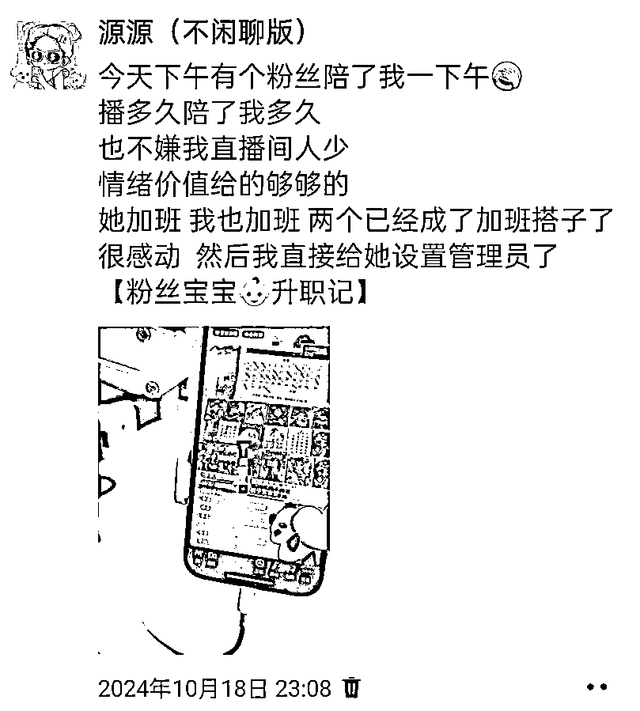
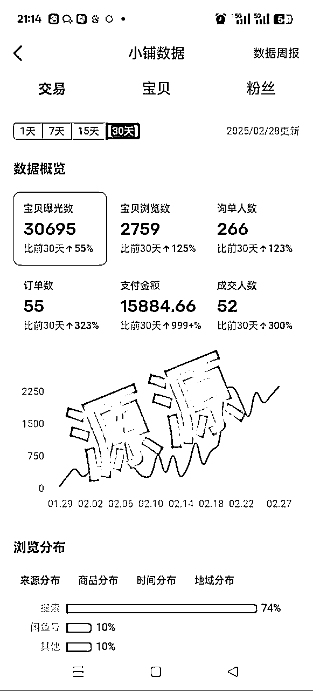
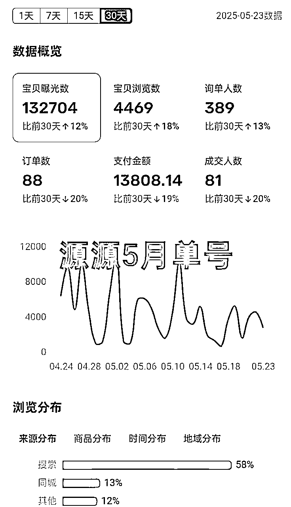
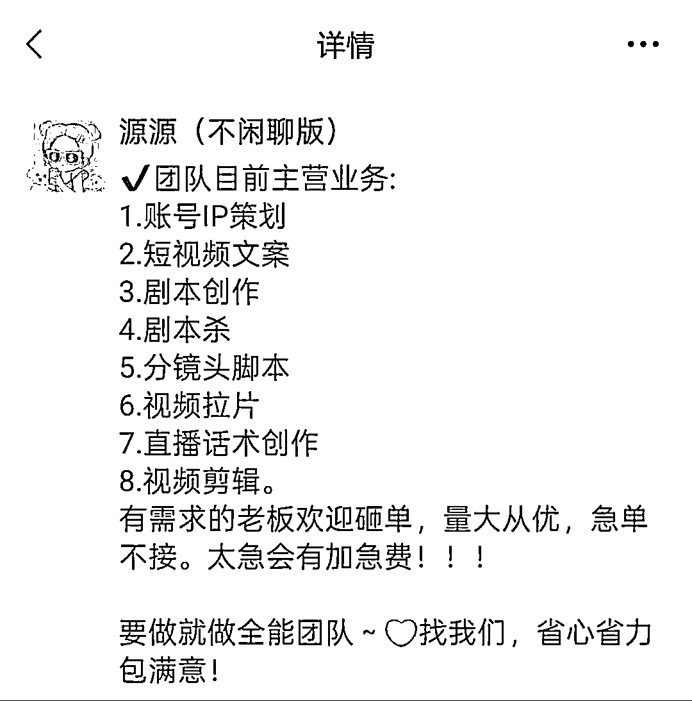
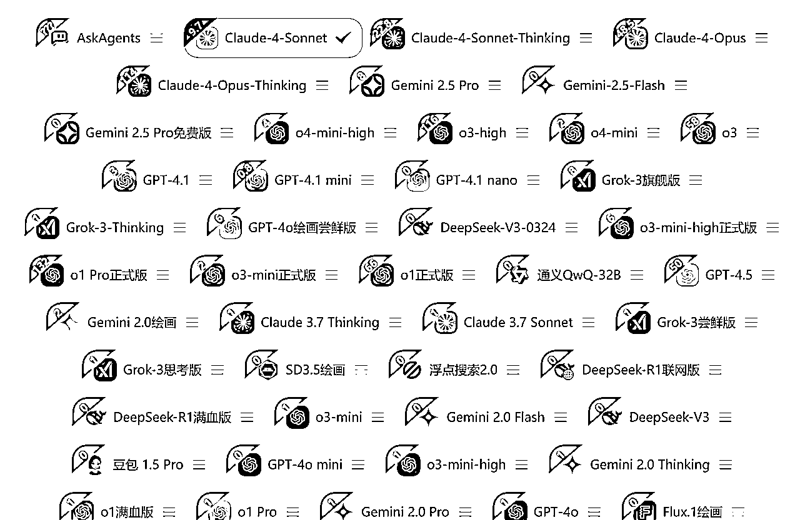
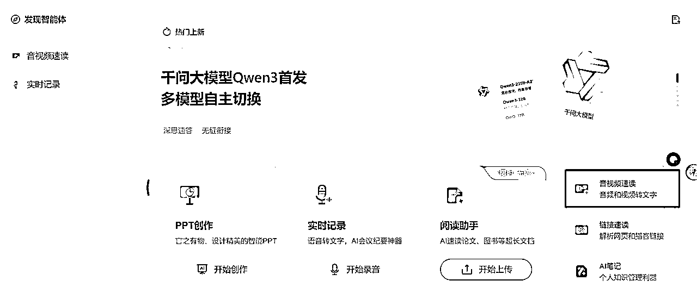
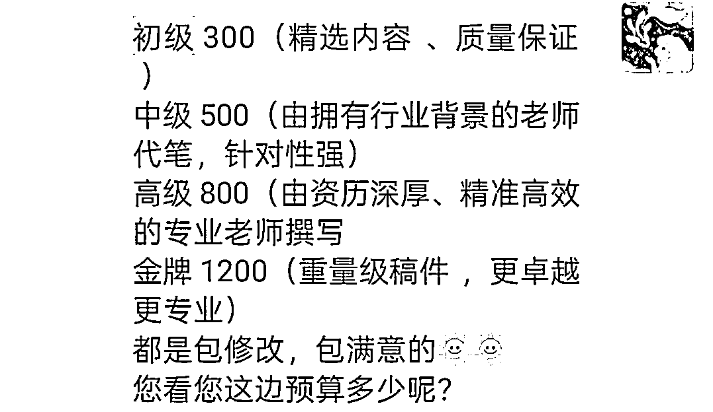

# 从月薪5千到短视频月入2w+：AI编导，让我把热爱变成了硬核业务！

> 来源：[https://uh4tzunhi6.feishu.cn/docx/AYD1drLHxoWs2Gxk76QcYM6cnxg](https://uh4tzunhi6.feishu.cn/docx/AYD1drLHxoWs2Gxk76QcYM6cnxg)

大家好，我是源源，生财编号104443。加入生财有术两年多，从一个偶尔在风向标“水”帖子的圈友，到现在拥有自己的短视频文案小团队，并取得了一些小小的成绩，我希望通过这篇帖子，将我一路上摸爬滚打的经验，毫无保留地分享给大家。

我曾经是一名探店博主，但是身在其中，不得不去跟人“卷资源、卷颜值、卷价格”，我非常不喜欢这种不稳定感。 收入的起伏不定，让我内心焦灼。为了寻求突破，在探店的空闲时间里，我开始疯狂尝试各种副业项目：闲鱼无货源、小红书虚拟资料、公众号爆文、AIP账号（4000多粉）。

但是收入不稳定的我不得不选择重回职场，去一家小公司当拆卡小主播，每天直播六七个小时，却仅有4000元底薪加微薄提成。

那种一眼望到头、比牛马还牛马的生活，令我对未来充满了厌倦和恐惧。我投入了大量金钱去报名学习各种课程，但最终收获寥寥，内心积聚了难以言说的焦虑与疲惫。然而，正是这份对摆脱现状的强烈渴望，以及内心深处对内容创作那股近乎偏执的“一腔热爱”，指引我继续前行。

我本来就是短视频博主，从2021年到2024年，近3年时间里，所有视频的文案和分镜头都是我自己“手搓”出来的，这份功底让我对内容质量充满自信。契机发生得如此偶然又必然：就在我一边挣扎在直播间、一边在各种副业中摸索时，一次无聊刷闲鱼，我鬼使神差地去搜索了“短视频文案”。结果，我惊喜地发现这个赛道发帖子的人非常少，简直是一片蓝海！我立刻决定尝试，没想到发出的第一条链接就爆了！ 这是我真正从去年11月一直做到现在，唯一一个深耕并拿到持续结果的赛道，也是我真心热爱并为之奋斗的领域，它给了我一份稳定收入。

（这是2月跟5月的，其他月份的没有截图）

我不是什么天生的大佬，没有显赫背景，更没有谁的资源和背书。像我们这种没家世背景的人，靠的只有自己，需要不断地去尝试，去摸索。 有的，只是面对未知和嘲讽时，那份明知不可为而为之的“孤勇”。我毅然决定转型，选择短视频文案这个新赛道，因为它，是我内心深处那团火唯一的出口。

我知道，很多人在开始新项目时，总想一口气吃成胖子，或者被各种机会晃花了眼。但我的“血路”告诉我，第一步不是战术布局，而是心性武装。我严格遵循一个原则：“不要贪多，一次只选择一个项目”——我的全部精力都倾注到了短视频文案这个领域。至于“大致选择一个项目，干起来再说”，这更是我的行动纲领。别去追求一击必中，发现蓝海，学到方法，直接开干。很幸运，我的第一条链接就爆了！

虽然初期因为缺乏经验，很多问询都按“一口价”报价，少挣了不少钱，但这种“傻乎乎”的开始，反而让我迅速积累了实战经验。这其中也遇到过流量不好的时候，连续几天没有问询，这真的挺考验一个人的心态。但因为我真的喜欢自由的状态，不想再回去上班了，这份“孤勇”支撑我熬过了每一次焦虑。一天能接个好几单，就可以填补这几天没有单的空缺。

我当时觉得，要是能一天挣个100多就可以了，又花不了多少时间，还很自由。一天花个1个多小时，其他时间想做什么，就做什么，运气好的时候，一天也能过千。我的目标不是和别人比，而是每天都比前一天走得更扎实、更坚定。

# 第一部分：摸爬滚打——在短视频战场中摸索与成长

## 2.1 短视频“生存法则”：我的学习与适应

踏入短视频文案这个新战场，我首先要做的，是绘制一张属于我的“生存地图”。由于我本身就是做了3年短视频的博主，对于文案质量和分镜头有着天然的自信和经验，我的文案质量也得到了其他同行的认可，甚至他们会通过微信找我帮忙，这让我对自己的核心能力充满信心。

在闲鱼上，我给自己打的身份就是“传媒专业”，因为我知道，对客户而言，这能建立初步的信任和专业认知。但对我自己来说，我深知自己是典型的“野路子出家实战派”。我没有学院派的条条框框，所有的文案技巧、分镜思路、甚至与客户沟通的经验，都是从实际项目和市场反馈中摸索、积累、再学习得来的。这份“野路子”，反而让我更接地气，更懂得如何用最直接有效的方式，解决客户的真实问题。

而真正的转折，发生在11月份。我偶然间在闲鱼搜索“短视频文案”，发现这块的同行还比较少，这是一个明显的蓝海！那一刻，我意识到这是一个巨大的机会。我不再像过去那样“围观”，而是直接结合之前通过知识付费学到的闲鱼运营方法，快速入局。

## 2.2 极致实操：把“干起来”刻进骨子里

明白了理论，更要下场实操。很荣幸，我发的第一条链接就爆了！问询量激增，这让我感受到了蓝海的魅力。虽然当时缺乏经验，很多都是一口价报价，少挣了不少钱，但这些都是宝贵的经验。我把自己当成一个永不停歇的实验品，从最开始的文案和分镜头，到后来拓展剧本、拉片、直播稿等，现在已经是短视频全链路啦，包括人设定位什么，都可以，非常乐意与有需求的圈友或团队探讨合作。

做闲鱼的宝子们都知道，想要做好闲鱼，那么每天就得上品，补单，及时回复。

### 我的闲鱼冷启动与爆单实操四步法：

#### 第一步：精准定位与市场洞察 (开干前的侦查)

怎么做：

1.  关键词搜索： 在闲鱼搜索“短视频文案”、“脚本策划”、“分镜头”、“探店文案”、“口播稿”等核心及长尾关键词。

1.  分析同行： 观察排名靠前、销量高的同行是如何设置标题、主图、文案描述、价格区间的。他们强调什么卖点？留言区客户常问什么？

1.  寻找蓝海/差异化： 像我发现“短视频文案”帖子少就是机会。思考你还能提供什么差异化服务（比如你结合AI，或者你擅长特定行业）。

注意事项：

*   不要盲目复制爆款，要找到自己的切入点。

*   记录下至少5-10个优质同行的链接，学习其优点。

*   初步判断哪些类型的文案需求量大，哪些是高价值服务。

#### 第二步：打造高吸引力商品链接 (你的线上“门面”)

怎么做：

1.  标题优化： 包含核心关键词 + 价值主张/解决痛点。例如：“AI辅助高效短视频文案定制，提升播放转化，爆款脚本打磨”。

1.  主图设计： 清晰、专业、突出服务亮点。可以是你的作品案例截图、服务流程图、AI工具界面（示意高效）、或者表明“传媒专业”等信任状。我初期可能会直接用一些简洁明了的文字图。

宝贝描述（核心）：

*   我是谁：简单介绍背景（如“3年经验短视频博主”、“AI编导实战派”）。

*   我能提供什么：清晰列出服务项（文案、分镜、剧本、直播稿、人设定位等）。

*   我的优势/案例：强调质量、效率（AI助力）、过往案例（可打码），客户好评截图。

*   如何合作/价格：可以写“具体需求私聊报价”，或者设置一个基础引流价。

*   引导行动：明确引导“点我想要私聊咨询”。

注意事项：

图片比文字更吸引眼球，至少准备3-5张有信息的图片。

文案排版清晰，多分段，用表情符号辅助。

真实案例最有说服力，初期没有可以先强调能力和态度。

#### 第三步：日常运营与流量激活 (让链接“活”起来)

怎么做：

1.  每日擦亮： 这是闲鱼的基本操作，保持活跃度。

1.  持续上新： 不要只发一个链接。可以针对不同类型的文案需求（如探店、知识口播、剧情），发布不同侧重点的链接，测试哪个方向流量更好。

“补单”策略（精细化操作）： 正如我说的“不补单那是完全没流量”。

*   初期： 找真实朋友或通过一些互助群，进行少量、高质量的“想要”和“咨询”，模拟真实用户路径。

*   中期： 当有真实咨询时，引导他们完成小额交易（比如先付一部分定金或小额服务），积累真实评价和销量。

*   频率与数量： 初期每天1-3个“想要”或咨询，少量成交。不要猛补，容易被平台识别。

*   及时回复： 设置快捷回复，保证咨询的响应速度，这对权重有影响。

(可选) 适度投流： 当某个链接数据表现不错（点击率、咨询率高）时，可以尝试闲鱼的“推广”功能，放大流量。先小额测试。

注意事项：

补单风险： 平台规则在变，过度或不当补单有风险。核心还是产品（服务）本身要好。

养号： 新号不要一上来就疯狂操作，先模拟正常用户行为。

关注数据： 每天看曝光、点击、咨询数据，分析哪个链接、哪个时间段效果好，进行调整。

#### 第四步：高效触达与客户沉淀

怎么做：

1.  引流话术打磨： 参考我上面提到的那个话术。核心是提供价值，让对方愿意主动加你（如“方便发案例/详细沟通需求，加V：XXXX，备注闲鱼文案”）。

1.  微信承接准备： 微信头像、昵称、朋友圈内容要体现专业度，提前准备好欢迎语、服务介绍、案例展示。

1.  风险规避： 在闲鱼沟通时避免直接发送微信二维码或过多提及“微信”、“转账”等敏感词，可以用谐音、图片或引导看“个人简介/自动回复”。

注意事项：

引流话术要自然，不要太硬广。

及时通过好友申请，做好客户标签和备注。

私域的首次沟通体验很重要，直接影响转化。

## 2.3 突破困境：短视频路上的“卡点”与“跨越”

这条“血路”当然不会一帆风顺。在我单兵作战的时候，主要承接的都是文案、分镜头这类单子，GMV基本维持在5000-6000元左右。当问询量上来后，我发现了一些自己解决不了的“太专业”的单子，比如写毕设解说词、复杂剧本等。我开始遇到瓶颈，并立即思考：怎么样才能吃下这些高价值的单子，实现业务的突破？

这个时候，我开始去淘宝上找专业的人去做，也是因为我经常咨询客服这类单子，他就主动找到了我，希望长期合作，价格也比我们之前合作的，优惠了很多很多，直接就是底价。就这样，我们有了一个团队的初步模型：我做流量，他做交付。

到了后面，在做项目的过程中，我又陆陆续续认识了更多各有所长的伙伴，比如写剧本的、拉片的、做直播话术的，慢慢开始组建起自己的小团队。现在的话，也还是这个模式，我自己在做流量，然后给我团队的人派单子，这更像是一种“一人公司”的运营模式，我也成了朋友们口中的“源总”。

2.4 联结共赢：不再“孤勇”，我的短视频战友团

通过与这位客服的合作，我不仅成功拓展了业务范围，也正式从单兵作战转向了团队协作。而更让我惊喜和感恩的是，这段做项目的经历，竟然帮助我这个深度“社恐”的人，完成了前所未有的蜕变。

说实话，平时我几乎不敢主动向厉害的人要微信，也不怎么跟人沟通，总是把自己封闭在一个狭小的世界里。但在这个项目过程中，我发现自己为了解决那些单凭我个人无法完成的“太专业”的单子，为了不让到手的订单流失，我竟然能鼓起勇气，主动去私聊、去积极地认识那些写剧本的、拉片的、做直播话术的专业人才。

我们交流项目、交流赚钱经验，因共同的愿景而强化了链接，共同创造价值，实现共赢。我的文案小团队由此建立，我们不仅自己做，也乐于接受更多这方面的人才合作，实现资源整合。

# 第二部分：AI利刃——赋能我的短视频创作效率

## 3.1 为什么AI是我“杀出重围”的关键？

你可能好奇，我一个“手搓”文案炉火纯青的博主，为什么还会把AI奉为“利刃”？其实早在去年5月份，我就接触过AI写作了，但当时因为自己比较懒，加上觉得淘宝结款周期太长，以及探店博主的收入不稳定，就没能沉下心来深入学习。中间搁置了好几个月，没想到，是短视频文案写作这个新赛道，又把我重新拉回了AI写作的怀抱。

不夸张地说，在AI写作爆火之前，我所有写的文案，都是纯手搓，搓的我炉火纯青。但当订单量激增，客户需求日益复杂时，我发现“手搓”的效率遇到了天花板。AI并非要取代我，而是成为了我手中最锋利的“利刃”，它将我从重复繁琐的工作中解放，让我的创作效率实现了质的飞跃，真正成为了一个“高产战士”。

原来，手搓一个1分钟的脚本，我可能需要一个小时左右，这还是算有灵感的情况下，没有灵感的话甚至可能耽误我半天的功夫。现在，我可以借助AI去给我灵感，一天完成十几篇脚本都不在话下。我觉得AI对我来说，既是得力的助手，也是并肩作战的伙伴。 这让我可以更快地响应客户，承接更多的单子，甚至在短时间内处理复杂需求。

3.2 我的AI赋能短视频工作流：从0到1的效率革命

AI不是万能的，但选对了“搭档”，它能助你一臂之力。在我的短视频文案工作流中，AI扮演了多重关键角色：

*   AI工具的迭代与选择：

在最初探索AI时，我用的是 Kimi。随着需求的提升和对效率的追求，我逐步升级到 GPT。

后来，我更常用的是 Claude，它生成的文案会更符合人的语言表达习惯，语言也更加优美，少了很多人工智能的机械感。

现在，我主要使用 Ask Many AI 这个聚合平台。它能用的工具非常多，我可以同时开启好几个网页，并利用多个AI工具同时生成初稿，进行快速对比。

*   多工具协同与高效产出：

在AskManyAI这个平台上，我会同时开启好几个AI工具的网页。我会根据生成的初稿效果，迅速筛选掉一些不理想的，最终留下1到2个效果最佳的进行精修。这个过程中，AI不只是提供答案，更是在激发我的灵感，拓展我的思路边界。我能从不同AI的反馈中找到新的切入点，大大提升了创意生成的效率。

*   人工点睛与灵魂注入： 我始终坚信，AI只是工具。它的产出是基础，而我的人工修改、注入个人情感、融入当下流行梗和独特表达，才是让视频真正“活”起来的关键，在创意这块，AI永远无法替代人类，这是我们不被替代的关键。我会删除AI的机械表达，加入我的真实思考和“血肉”，让每一个视频都带有我鲜明的印记。最终，再根据客户的具体要求进行调整。

*   效率技巧分享： 在实际操作中，我积累了一些小技巧，比如如何用AI快速提取视频重点、生成字幕，或辅助进行数据分析，这些都让我的工作效率倍增。

## 3.2 我的AI文案创作“三板斧”工作流

### 第一板斧：需求解析与AI指令工程 (让AI听懂你的话)

1.  明确客户需求： 通过前期和客户的沟通，搞清楚视频主题、目标受众、视频风格（幽默、干货、情感）、时长、核心卖点/信息点、是否有参考对标视频。

1.  选择合适的AI工具：初步构思，然后生成文案初稿，特定的任务用特定的工具

比如要给视频写旁白文案的话，我一般用的是国外的Aistudio。

→网址在这：aistudio.google.com

如果有视频的链接，需要提取视频的文案，我一般用的是【蜗牛去水印】小程序；

针对没有链接的视频，我一般用的是通义千问，里面的【音视频速读】

1.  撰写精准Prompt（指令）： 这是AI提效的核心。一个好的Prompt应该包含：

角色扮演： “你现在是一位资深的短视频编导…”

任务描述： “请为我撰写一个关于[主题]的1分钟短视频口播文案。”

目标受众： “目标用户是[人群画像]，他们关注[痛点/兴趣点]。”

风格要求： “文案风格要求[如：轻松幽默/专业严谨/情感共鸣]。”

核心要点： “必须包含以下几个信息点：A, B, C。”

结构要求： “请按照黄金3秒开头、主体内容（分点）、价值总结、引导行动的结构来写。”

字数/时长控制： “预计口播时长控制在XX秒内。”

(可选) 负面指令： “不要包含过于专业化的术语。”

注意：

*   Prompt越具体，AI输出越精准。多尝试不同的Prompt组合。

*   学会用追问的方式引导AI优化输出，比如“这个开头不够吸引人，能换个更悬念式的吗？”

### 第二板斧：多AI协作与批量产出 (提升初稿效率)

1.  怎么做（以AskManyAI为例）：

同时调用： 将精心准备的Prompt复制到AskManyAI平台，选择同时调用多个模型（如GPT-3.5, GPT-4, Claude等）。

快速对比： 同时查看不同AI生成的初稿，快速筛选出1-2个质量较高、或各有亮点的版本。

融合优化： 将不同AI稿件中的优点（比如A的开头好，B的某个论点新颖）进行融合。

1.  注意事项：

不要完全依赖一个AI的输出，多工具对比能博采众长。这个阶段追求的是“数量”和“多样性”，为后续精修提供素材。

### 第三板斧：人工精修与灵魂注入 (AI的骨肉，你的灵魂)

1.  检查与修正：

事实性错误： AI可能会编造信息，务必核实。

逻辑连贯性： 确保文案思路清晰，转折自然。

语言表达： 删除AI的机械、重复、套话，替换成更生动、更口语化、更具网感的表达。

1.  个性化与情感注入：

加入你的个人风格、独特见解。

融入当下的热梗、流行语（如果适合）。

强化情感共鸣点，让文案更有温度。

1.  分镜头/画面建议： 如果客户需要，根据文案内容，给出匹配的画面、音效、字幕提示。

1.  最终校对： 检查错别字、标点符号。

注意事项：

AI只是辅助： 最终的文案质量取决于你的人工打磨。AI帮你完成60-80%，剩下的20-40%需要你的专业和创意。

版权与原创性： 确保最终交付的文案是经过你深度修改和创作的，避免直接搬运AI内容导致的同质化或潜在风险。

# 第三部分：成果变现——让“热爱”开花结果

## 4.1 流量为帆，转化为锚：我的短视频变现模型

短视频文案不仅是创作，更是变现的载体。我将流量视为风帆，而有效的转化策略则是牢固的锚。我主要从闲鱼平台获客，然后将客户引导到私域进行触达和成交。我敢说，遇到十个客户，我的转私率能有八个，对于安全引流私域以及高效引流私域，我现在也有很多心得。

GMV放大的核心就是，要么提高客单价，要么提高客单量。最开始我单兵作战时，GMV在5000-6000元左右，后来有了剧本、拉片、直播稿这些高客单价的问询，GMV才有了显著提高。

更重要的是，在无数次与客户的沟通和报价实践中，我磨练出了一项核心能力：能一眼看出这个人到底是不是我的目标客户，也提高了我的销售能力。这让我能够更精准地分配精力和时间，避免无效沟通，大幅提升了谈单转化效率。

我的心法就是： 断舍离，细化再细化。以前我来者不拒，只要有咨询，无论对方是谁，我都会提供报价服务。但很快我发现，这种“广撒网”的方式，大量浪费了我的宝贵时间。我经常遇到学生客户，他们预算极低（50、20甚至30块钱，却想做300块的单子），沟通成本极高，最终却无法成交。这不仅是时间的巨大浪费，更是对心力的极大消耗。要知道，整个谈单过程中需要消耗的心力是巨大的，尤其是当流量很大，需要同时跟好几个客户交涉，有的甚至催得很急时。

最关键的转折点，就是开始阶梯报价。阶梯报价，可以很大程度上提高我们的成交率和利润。

### 我的高转化沟通与阶梯报价实操：

#### 第一步：高效筛选，精准“断舍离”

1.  初步判断： 对方的咨询方式（是直接问价还是详细描述需求）、头像昵称、闲鱼信用等，初步感知是否“靠谱”。

1.  前置问题： 准备几个标准问题快速了解对方需求和预算范围，如“请问您要写什么？剧本脚本还是分镜？大概什么时长？有明确的预算范围吗？”

1.  识别学生单/低价单： 如果对方明确是学生作业且预算极低（如你提到的20、30元想做300元的单），要学会委婉拒绝或引导至符合其预算的基础服务（如果你的服务体系里有的话），避免无效消耗。

时间是最大的成本，把精力留给高意向客户。拒绝也要有技巧，保持礼貌，可以说“目前档期较满，这类小需求暂时无法承接，抱歉”。

#### 第二步：专业问询，深度挖掘需求

1.  引导客户多说：通过提问，让客户详细描述他的项目背景、目标、痛点、期望效果。

1.  展示专业度：在沟通中适时抛出一些专业见解或过往类似案例的经验。

1.  确认细节：比如视频平台、风格偏好、是否有对标账号等。

千万要注意：不要急于报价，先充分了解需求，这样报价才更精准，也让客户感觉你很专业。

#### 第三步：价值导向的阶梯报价

你们可以参考我的阶梯报价的话术，改成你们自己的，以后也别再一口价报死了，这样也能给你们自己争取更大的利润。

引导选择： “根据您的需求，我推荐XX套餐，性价比最高，当然如果您对XX有更高要求，XX套餐会更合适。”

“今天店铺做活动，您这边下单初级可以给您升级中级，下单中级可以给您升级高级，您看您这边预算是多少呢？”

注意：

1.  阶梯报价不是为了坑客户，而是提供不同层次的服务满足不同需求，同时引导客户感知高价值服务的意义。

1.  价格体系要相对固定，但可根据客户具体需求的复杂程度微调。

1.  确保每个套餐的交付都能达到承诺标准。

#### 第四步：成交确认与预期管理

书面确认： 成交后，通过微信文字总结一遍服务内容、价格、交付时间、修改次数。

设定明确的合作流程： 比如“收到定金后X小时内出初稿，您反馈意见后X小时内修改”等。

管理客户预期： 不要过度承诺。如果客户问是AI的，还是手写的，咱们直接说：我们这边都是专业老师手写的哦，亲亲。

流程严谨：在客户没有签收之前，不要给客户发原稿，需要发PDF+水印打码的稿件，跟他确认稿件不需要修改了，没问题了，让他签收之后，我们再发原稿。

清晰的流程和预期管理能极大减少后续的沟通成本和纠纷，同时也要保留好所有的沟通记录，以免遇到有些白嫖党，想要白嫖，这就是宝贵的证据。

## 4.2 持续深耕：构建我的“铁粉”护城河

流量易逝，而真正的价值在于用户留存。我深知，将“散粉”聚集成“铁军”，是短视频文案业务长期发展的基石。我开始有意识地运营我的朋友圈，这要特别感谢鹅子的进阶课，让我受益匪浅。现在，我每个月都能通过私域实现不少复购。我也要感谢蛋糕老师，她让我看到了榜样的力量，她的一步步我都有目共睹，相信“相信”的力量，我以后也能越做越好。

此外，多在客户面前曝光， 在初次加到客户时，我会在“欢迎话术”上，加上我们在做的业务介绍，这样只要他读过了，他就有印象，以后有相关需求就能想到咱们。

## 4.3 高效交付与风险管理：我的“血路”护航策略

无论是为品牌方定制内容，还是进行知识付费交付，“高质量交付”是我赢得信任的基石。在这个过程中，我不断总结自己的话术，从开局引流话术，到客户进入私域后的问询话术，再到成交后的确认流程和确认话术，我已经形成了自己一套完整的流程，每天来客户，跟客户沟通的效率也大幅提高了。

在这里也建议各位单兵作战的朋友们，都可以总结总结自己的常用话术，然后加入到便捷输入法里，谁用谁方便！

至于我在平台沟通时一个规避风险的话术心得，在这里也分享给大家参考：

我的话术是：“亲，还在的，写稿很忙，遵守平台规定不要发违禁词，发了请撤回，请直接+xxx（备注闲鱼），说明你的需求，我将第一时间答复你。”

这个话术也是遇到过一次客户发违禁词之后，被平台判了，然后重新总结，到现在百试不爽的话术。以后谁发违禁词，你也可以让他撤回。比如“代写”，“作业”“毕设”“论文”这块的，让他撤回。

# 第四部分：复盘沉淀——我的“血路”提效与避坑指南

## 5.1 我的“高产战士”提效秘籍

在短视频文案的“血路”上，效率是生命线。我将“SOP思维”彻底融入我的工作流。总结常用的引流、沟通、成交话术，并运用便捷输入法，这大大提高了我的沟通效率。同时，团队的建立也让我的承接量和效率有了质的飞跃。

## 5.2 “血路”上的警示牌：我踩过的那些坑与避坑策略

我的“血路”并非坦途，也洒满了“血的教训”。最开始的“一口价”报价，让我少挣了不少钱，这就是没有经验的坑。正是那些流量不好的时候，我通过深入研究，掌握了闲鱼做流量的核心，现在形成了一套自己的心法，这让我不再被流量波动所困扰。

客户发违禁词导致被判的经历，也让我打磨出了更安全的引流话术，包括小法庭也打了很多次了，也都小有心法了。（如果在打小法庭这上面，有困惑的朋友，欢迎在评论区一起交流讨论经验。）

每一次失误都成为我优化流程、完善策略的宝贵经验。我学会了在事前明确规则，拒绝过度承诺，并懂得如何处理那些自己不那么了解的订单，通过AI辅助和持续学习，不断拓展我的能力边界，让每一次挑战都成为成长的契机。

除了实战，我还在流量的摸索上走了一条自己的路。 最开始起号，我确实会直接复制同行的爆款链接，包括他们的图片和文案。但很快我就发现，很多关于闲鱼流量的“经验之谈”，比如“所有发布的链接都需要在同一个城市”，其实并不完全适用于我。

我的实战证明，这是一种流量局限。我大胆尝试在全国区域内去发品，再结合精细化的补单和适度的投流，效果出奇的好。所以，比起去问别人实战经验，再根据人家的经验去判断项目能不能做，最重要的还是自己去做，自己去摸索，因为人家说的不一定就是适合我的。

这次经历也彻底改变了我过去那种过度追求权威、四处付费寻求标准答案的学习模式。我不再迷信“专家”的公说公有理，而是更坚信自己实战验证的成果。 每一次摸索、每一次尝试，无论成功与否，都为我提供了最宝贵的、最适合自己的经验和答案。

# 第五部分：新手启航避坑指南：项目初期常见的几大“拦路虎”

在我这条“血路”上，除了自己摸索的经验，也看到了很多新手朋友在项目初期容易遇到的共性问题。希望我的总结能帮你少走弯路，更快上岸。

## 拦路虎一：贪多嚼不烂，总想“既要又要还要”

常见表现： 同时开好几个项目，看到什么赚钱就想尝试什么，结果精力分散，哪个都没做深做透。或者在一个项目里，什么都想做，恨不得把所有功能、所有服务都加上。

我的体会与建议： 回想我最开始尝试各种副业，虽然都有涉猎，但都未深入，直到我聚焦短视频文案这一个赛道，才真正拿到了结果。“一次只选择一个项目，一个方向深耕”，这句话我深有体会。对于新手，资源和精力都有限，专注才能产生力量。先在一个点上打透，做出成绩，再考虑横向拓展。

## 拦路虎二：追求完美不敢开始，永远在“准备中”

常见表现： 总觉得自己能力不够、产品不够完美、时机不对，迟迟不敢迈出第一步。想把所有细节都规划好，结果越规划越焦虑，越焦虑越不敢动。

我的体会与建议： 我在闲鱼发第一条链接时，也没想太多，就是觉得“发帖子的人少，是个机会”，然后就去做了。结果爆了！“大致选择一个项目，干起来再说”，行动永远是治愈焦虑的良药。很多事情，你不去做，永远不知道会发生什么。先完成，再完美。在做的过程中去迭代，去优化，远比空想要有效。

## 拦路虎三：害怕犯错与被拒，玻璃心一碰就碎

常见表现： 被客户拒绝几次就信心大失，遇到一点流量波动就心态崩溃，或者产品被人说了几句不好就想放弃。

我的体会与建议： 我初期报价“一口价”少赚了钱，这就是犯错。流量不好时焦虑，这也是常态。但正如我说的，因为真的喜欢自由，不想回去上班，这份“孤勇”支撑我熬过来了。把每一次拒绝和失败都看作成长的机会。 客户的拒绝可能帮你优化报价策略，流量的波动可能促使你研究平台规则。心态建设是“血路”上的必修课。

## 拦路虎四：急于求成，短期未见效就迅速放弃

常见表现： 做了几天或者一两周，没看到明显的收益或效果，就觉得这个项目不行，然后又去寻找下一个“风口”。

我的体会与建议： 我这个短视频文案赛道，是从去年11月一直做到现在，才有了持续的结果和小团队。任何项目从启动到稳定盈利都需要一个过程。尤其对于我们普通人，没有那么多资源可以烧，更需要耐心和持续的努力。给项目一点时间，也给自己一点时间。 设定阶段性的小目标，持续优化，量变才能引起质变。

## 拦路虎五：忽视基础与细节，总想找“捷径”

常见表现： 不愿意做枯燥的基础工作，比如我提到的闲鱼“补单”，有些朋友可能觉得麻烦或者没必要，总想找一些“黑科技”或者“一招鲜”的方法。

我的体会与建议： 我亲测过，不补单链接就是没流量（除非已经爆了）。很多时候，底层逻辑是相通的，那些看起来“笨”的方法，往往是最有效的方法。 认真研究平台规则，打好基础，做好每一个细节，这些才是项目能够长久发展的根本。不要轻视任何一个看似微小的环节，它们可能就是你成功的关键。

希望以上几点能给正在或准备开始新项目的朋友们一些启发。记住，没有谁的成功是轻而易举的，找到自己热爱的方向，武装好心态，勇敢地去“干”，你也能杀出自己的“血路”！

# 结语：血路未尽，热爱不止——写给未来的自己与你

回望这一路，是最初那份“一腔热爱”点燃了火种，是面对未知和困难时的“孤勇”支撑我披荆斩棘。从一个在无数项目中辗转却变现平平的迷茫者，一个在“比牛马还牛马”的工作中挣扎的探店博主，到如今深耕短视频文案赛道并拥有自己的团队，并取得如图所示的成绩，这中间所有的摸爬滚打，都是我宝贵的财富。像我们这种没家世背景的人，靠的只有自己，需要不断地去尝试，去摸索，直到找到那条属于自己的“血路”。

短视频文案这个赛道，我非常看好！我认为无论是对于博主、商家还是实体企业，他们都需要通过短视频去放大自己的影响力，提升品牌知名度。这是一个可以长期深耕并持续创造价值的赛道。 未来充满无限可能。这条“血路”，对我而言，远未到终点，它将持续指引我探索、成长。我相信，只要内心那团“热爱”的火焰不熄，只要始终保有“孤勇”的闯劲，我将不断突破自我，在这条路上走得更远。

最后，我想由衷地感谢生财有术这个平台。 是它，为我打开了全新的商业视野，让我看到了项目与副业的无限可能。在这里，我不仅结识了无数良师益友，他们的分享和启发，成为了我走出困境的重要指引。生财所倡导的真诚、务实、分享的氛围，更是我能够坚持并最终取得成果的强大精神支柱。感谢生财，让我在摸索的“血路”上，不再孤单。

如果你也心怀热爱，渴望在这片天地中闯出自己的路，那么请勇敢地开始。善用工具，但更重要的是，请带着那份最初的激情，坚持下去。我也非常欢迎在这方面有擅长或者看好这个赛道的朋友，一起去交流学习，共同探索可能。