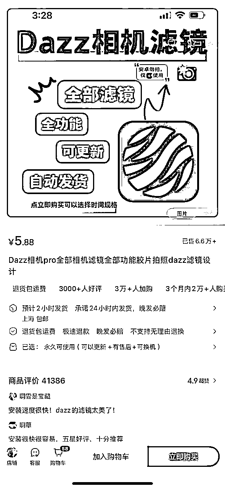

# 在小红书上卖虚拟产品 - 基础认知

> 来源：[https://zcnzawlx2ndr.feishu.cn/docx/BaJMdBTTPoY1EDxT2Lzczg6znOb](https://zcnzawlx2ndr.feishu.cn/docx/BaJMdBTTPoY1EDxT2Lzczg6znOb)

主要向大家介绍小红书虚拟产品生意最底层的逻辑，只有理解了这门生意的游戏规程，你才有更大的可能获得成功！希望大家认真看完，认真去理解，做生意和比赛一样，只有在下场前把比赛规则搞清楚，你才知道从哪里得分，才有可能赢得比赛！

## 为什么小红书虚拟产品是一门值得个人去做的生意

1.  门槛低，且前期可以一个人去完成，不需要大量资金和团队去启动

1.  现在小红书开店前期不需要缴纳保证金、且虚拟资料不需要垫付货款，是0投入、0成本启动的好项目了

1.  今年也是很好的入局时机，小红书主推店内电商，且今年开始重点扩充和运营这个品类，机会很大

1.  虚拟产品的优势在于，只需要一次创造，就可以无限分发，不需要供应链、物流，并且退货率一般可忽略不计，对于想低风险开始自己的小生意，或者想做副业却没有方向的时候，虚拟产品是很好的赛道。

1.  新人入局可以从做低客单价，容易上手的虚拟资料开始，等有了自己的SOP，以及对客户需求的把握后，我们可以自己开发或者跟机构/厂家去做一些高客单价的产品，比如课程，APP，实物产品等。

1.  如果你是想做个人IP，那么有一份自己做的虚拟资料，也会加强别人对你专业的信任感

## 什么是小红书虚拟资料项目?

1.  在小红书开店 👉上架虚拟资料产品（比如下面这些产品）👉 写相关的商品笔记吸引有需要的顾客 👉 顾客下单购买

## 虚拟资料的客单价那么低，能赚到钱吗？

1.  首先要分清楚虚拟资料和虚拟产品这两个概念

1.  虚拟资料就是一些考试资料，PPT，表格，模板等资料，因为大家卖的东西都差不多，所以一般客单价比较低，但是也更适合新手去启动。

1.  虚拟产品的范围更广，除了文档类资料外，还可以包含课程，APP，软件，游戏等客单价比较高的产品，有些课程甚至可以到1000-2000元。或者我们也可以在现有产品的基础上做差异化，提高客单价

1.  以下这些都是除了虚拟资料以外可以卖的虚拟产品

1.  所以大家不要看到别人卖1块钱1份的资料就觉得这个生意没有赚头，实际上等我们把基本的核心操作环节（选品，测评，做笔记这些环节）都跑通以后，是可以上客单价更高的虚拟产品，因为底层逻辑都是一样的

## 是否要开店去做？

1.  是的，只有开店才是顺应小红书平台官方的趋势。不开店，引流到私域变现的方式不会长久，且很废号

1.  开店后，当我们卖了产品，即使是1毛钱的产品，也可以名正言顺的把客人引流到私域

1.  感觉虚拟产品已经很多人做了，我现在去做还来得及吗？

1.  非常来得及

1.  原因1：总会有人有新身份，基于这个身份产生需求；比如大学生求职简历模版这个产品，每年都会有新毕业的大学生开始求职，对简历有需求。

1.  原因2：小红书是内容平台，新的内容永远有机会 ：不同于淘宝/拼多多这样的平台， 一旦店铺起来了权重高了，新店很难有机会。小红书是内容平台，平台想要存活就会持续需要新鲜的内容，我们入局永远有机会

1.  原因3：市场上不断出现新的需求，比如AI出来了，提示词模板，AI工具这些都是新的需求，这些都是给新人的机会。

1.  原因4：根据个人能力去做差异化。举个例子，有些资料卖的很好，但是作为用户总会有些不满意的地方，如果你能针对这个部分做些调整，且客户愿意为其付费，那么就是站在巨人的肩膀上，弯道超车。

## 小红书虚拟电商想要做成的关键是什么？

1.  下图为某虚拟产品销售数据，搜索流量占比超过50%，发现页推流占比很少

1.  所以想要能够出单，需要【找到当下有需求的产品】+写出【有效覆盖需求关键词】的【笔记】+耐心等待搜索流量的到来。

1.  所以要求大家有先认真更新100条笔记的耐心。

## 小红书虚拟资料的收入情况

1.  虚拟资料客单价低，单账号天花板有限（几千），但是出单稳定笔记制作难度低，方法熟练后，可以矩阵运营5-6个账号。前期可以先从开通个人店铺开始，后面熟练了想矩阵可以直接开通企业店铺。

## 小红书虚拟电商需要的设备和账号

1.  一机一号

1.  如果是新手，建议从一个店铺开始，但是如果想提高成功率，可以2个号2个店铺

## 小红书虚拟电商多久能见到收益

1.  选对品的情况下出单很快，但是爆单需要心理预期拉到先发100条笔记。

1.  小红书图文+搜索流量，流量会跑的很慢很慢、前期发了笔记二三十个小眼睛都是正常情况。

## 虚拟电商的货源都从哪里来

1.  主要从同行那边采购

1.  有一本手册会具体讲

## 关于资质（重要）

产品上架前，需要先确定产品要上到哪个品类，如果是卖教辅类的资料（幼小衔接，中小学练习题，包括成人教育资料等）都是需要有相关的认证和合同的，如果你随便放在虚拟产品定制，那么第二天产品就会被下架，特别是如果没有教师资格证等相关证件。但是淘宝和闲鱼是可以帮你搞掂的，只要去淘宝或者闲鱼搜 “小红书虚拟店铺”或者“小红书虚拟资质”就可以找到人帮你搞掂，而且是包过的。我用过一家，收费是￥320 一家店，开通后所有类型的虚拟资料都可以上架

## 关于粉丝的数量

粉丝的数量和你的出单量没有绝对的关联，当然，如果你本身是有粉丝量，那么你冷启动的效果肯定笔没有粉丝基础的人更加好。