# 航海期间，我用AI把N个天天999+的微信群聊做成了共享问答知识库

> 来源：[https://gpbr9zf6b9.feishu.cn/docx/BuhadtgbhookiHxWfZRc0N38nsh](https://gpbr9zf6b9.feishu.cn/docx/BuhadtgbhookiHxWfZRc0N38nsh)

大家好，我是邵先森(Jiahao)，6月航海开始了，这次有幸成为YouTube AI Shorts的教练之一。因为圈友们的热情，三个航海群日常消息简直是爆炸式的。

在答疑的过程中我发现，圈友们主要还是关注给自己提问，而不怎么看群内是否已经有人问过。另外三个群之间也有一些问题是重复的。

这两天也看到有优秀的领队，把群内的问答形成了飞书文档，工作量还是很大的，这里先给领队点个赞。

我突发奇想，用AI来把三个群内的问答整理成共享知识库，并且要做到查询时不需要精准的关键词句就能找到相关的答案。

这样圈友们在提问之前，也可以先在共享知识库找找有没有现成答案，更加方便。

最后我把几个工具串起来，做出来了一个初始版本。

* * *

# 01 效果展示

先来看看效果图。

1.  群聊信息自动提取。

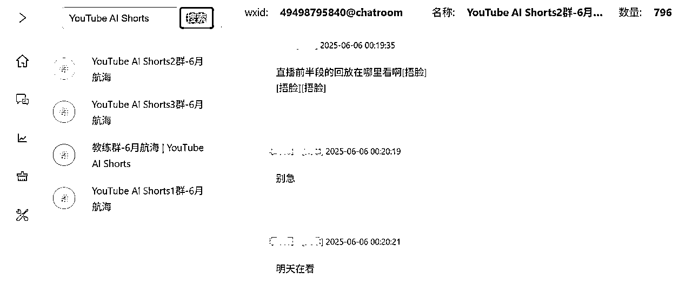

1.  群聊信息自动提取文本内容，合并、转换和导出。

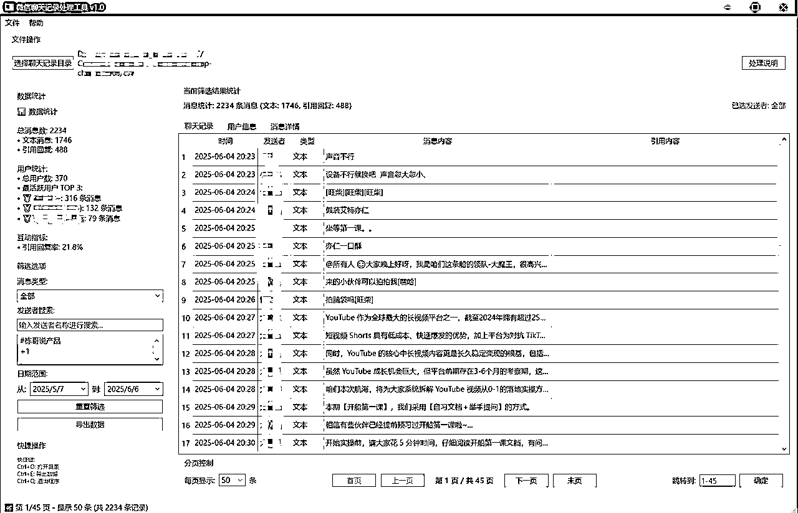

1.  问答知识库的自动整理。

比如这个案例：注册Gmail无法接码的问答，20分钟开外的回答都能自动识别出来。关键是我回复信息的时候并没有引用原始消息，完全是AI自动识别出来。

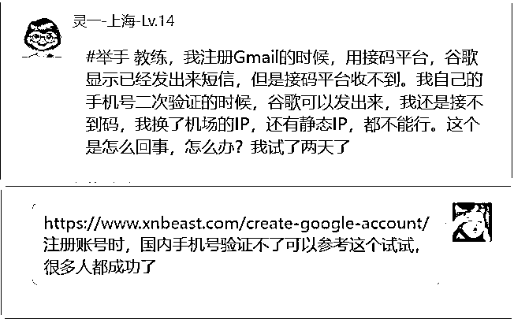

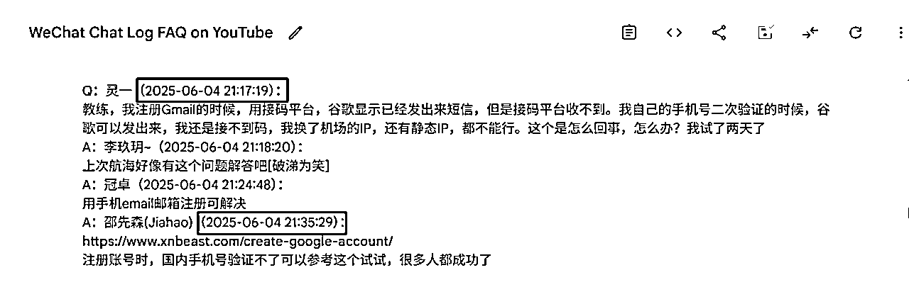

1.  向知识库提问时用自己的语言来提问，AI自动找到疑似匹配的问题和答案，省时省力省心。

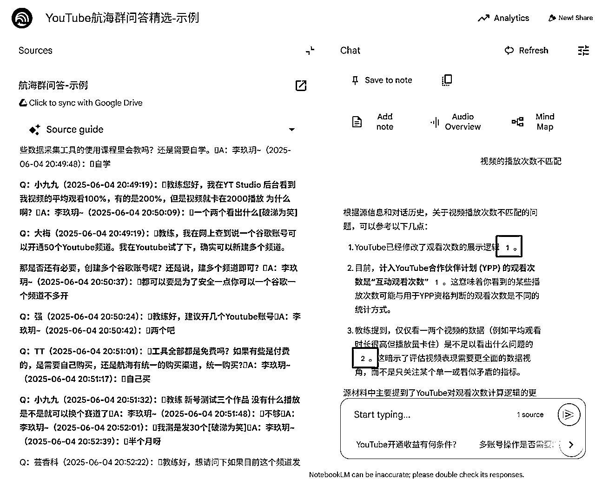

* * *

# 02 整体流程

本流程用到了第三方开源工具、找AI编的聊天记录处理工具、Gemini和NotebookLM。后面会一步一步说具体操作方法，请往下看。

* * *

# 03 提取微信聊天记录

其实之前就有圈友推荐过一个叫MemoTrace的软件，但是最近去作者主页，发现已经“删库跑路”了。

后来通过别的渠道下载到了，但发现解析的效果有点问题，大量消息解析不出来，于是去找其他工具。

你以为我自己找吗？错了，我让Gemini帮我找，直接开DeepResearch给我提供解决方案。

没想到还真让它找到了一个非常不错的开源项目PyWxDump，项目主页：

https://github.com/xaoyaoo/PyWxDump

这个项目提供了免安装版的程序，下载双击就能打开（不支持mac）。

有点可惜的是项目的文档写得较为一般，小白用户很难摸索出用法来，我弄了一会终于搞明白了。

双击程序后，浏览器自动打开网站，或者自行浏览器敲入以下网址就可以进去（前提程序必须是启动状态）。

http://localhost:5000

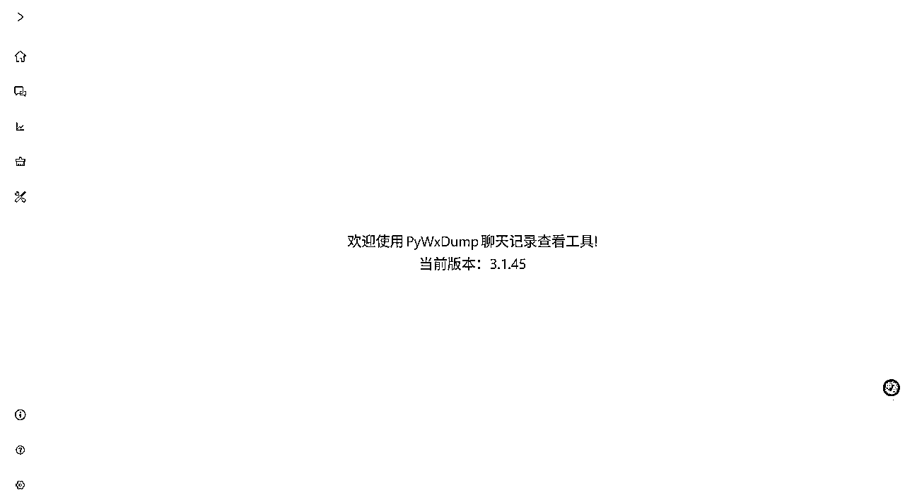

第一步，初始化设置（首次使用才需要）。

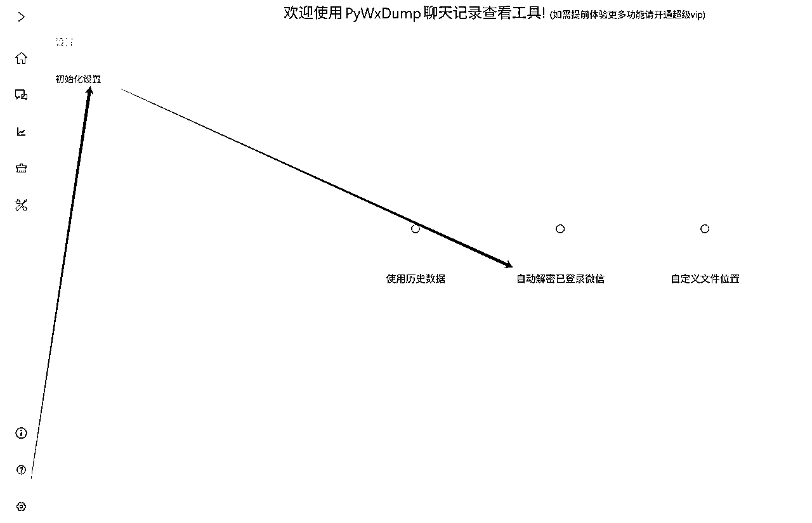

系统会自动检测目前登录的微信（注意微信版本必须是3.9版本的，4.0以上不能支持！），等待10秒左右，选择微信确定后，系统会自动读取微信的聊天记录，耐心等待读取完成即可。

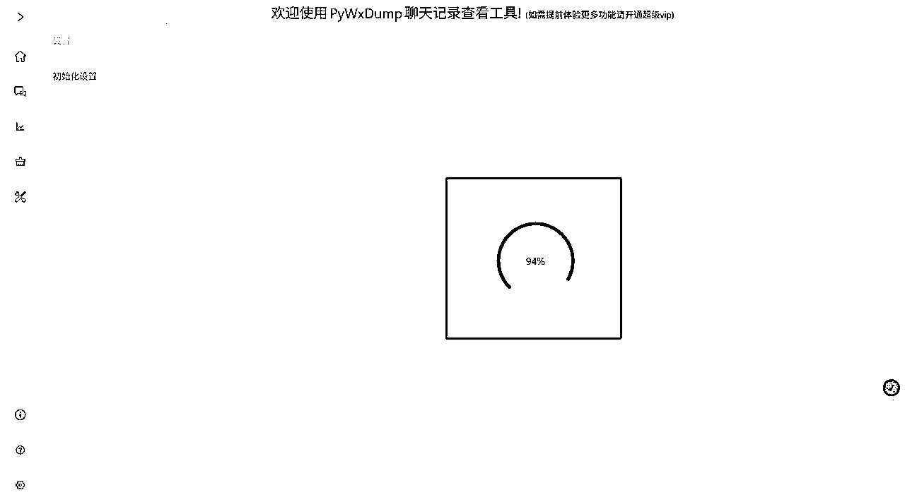

第二步，查看聊天记录（进来的时候加载会有点慢，请耐心等待）。

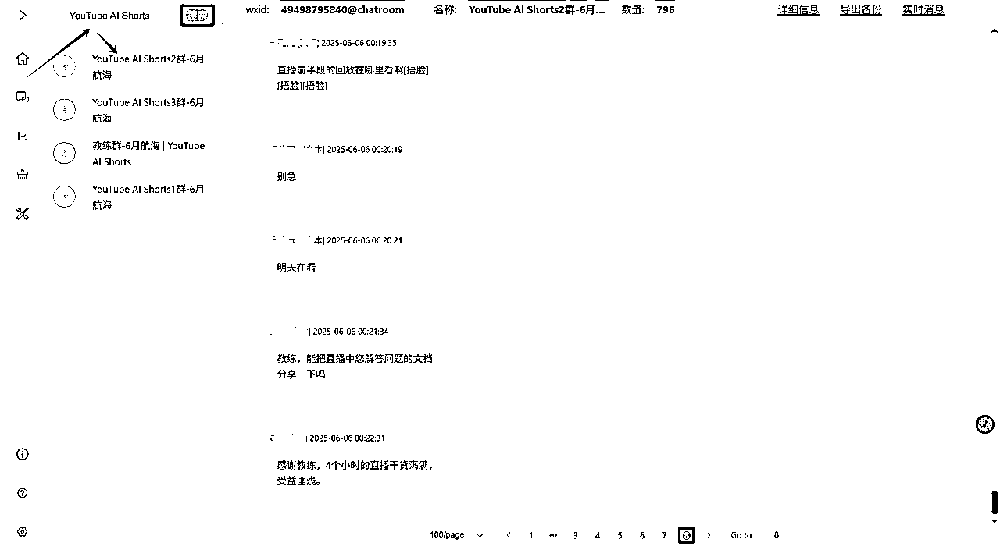

第三步，导出备份（选择csv格式）。

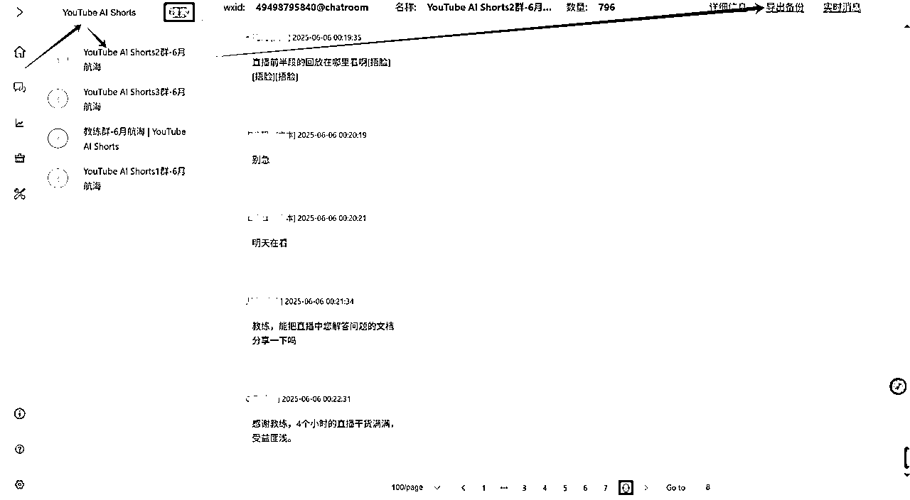

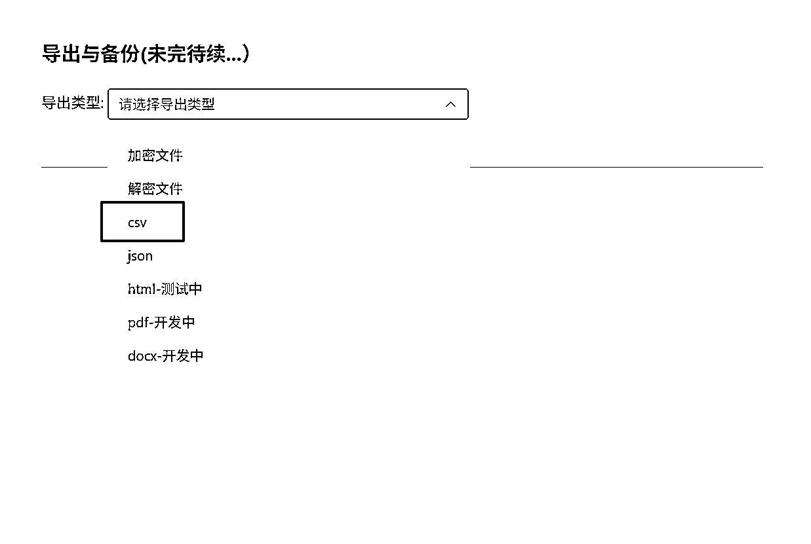

导出完成后，系统会显示导出的目录路径。

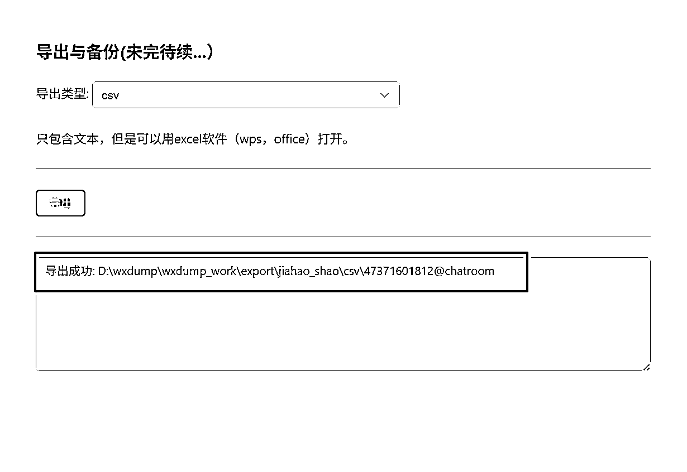

这是本地目录的文件，几个csv就是聊天记录文件（使用的是wxid，难看懂），users.json是wxid和用户昵称的对应关系。

而且这个工具目前不能支持增量导出，每次都得导出这个群的所有记录。于是，才有后面找AI开发的小工具。

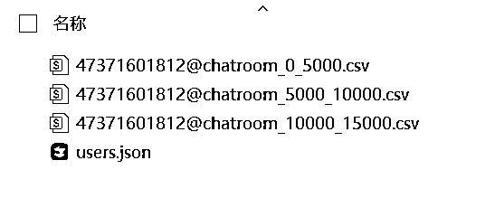

第四步，定期加载最新消息（比如次日要将今天的记录处理并加入到知识库）。

这个步骤只需要点击一次“实时消息”（不需要每个群都点一次），耐心等待“实时消息”后面的三个点消失即可加载到最新记录，按照第三步导出csv即可。

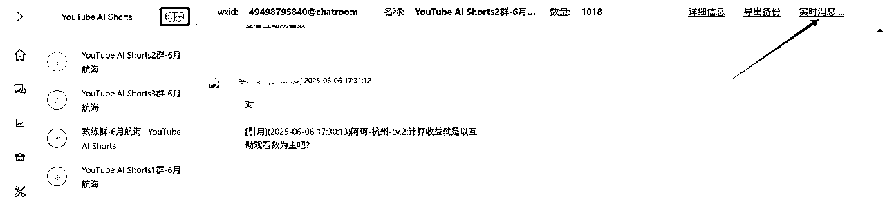

* * *

# 04 聊天记录解析、筛选、合并、导出

上面说过，提取聊天记录的工具是全量数据导出的，显然每天重复处理全量数据不太现实，并且前面提到的聊天记录里面是wxid而不是昵称，看起来很让人困惑。

于是我让AI给写了一个工具来解决这个问题。

链接: https://pan.baidu.com/s/1T9NkcmjpxgP3EfUkdeK0MQ?pwd=xim2 提取码: xim2

--来自百度网盘超级会员v4的分享

第一步，选择聊天记录目录。

因为有多个群聊的记录，所以请选择数据导出的根目录，也就是上面群聊导出的数据目录的上一级目录。

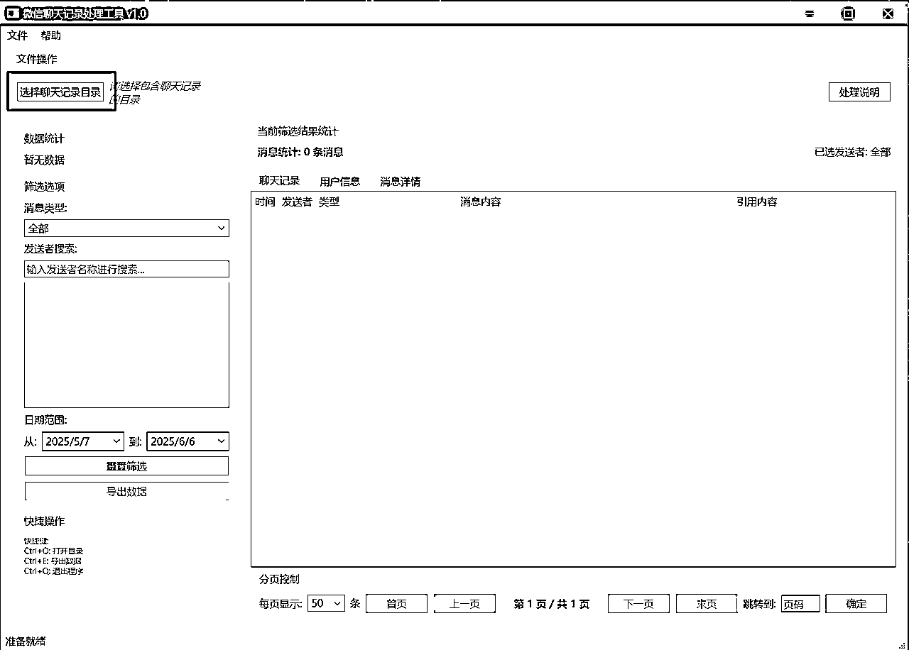

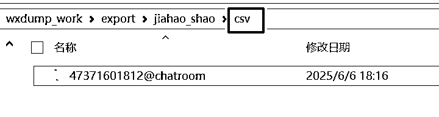

选择后，程序就会自动加载所有群聊的消息，合并、挑选出文字类的消息。

可以根据发送者（昵称查找，支持多选）、消息发送时间等对消息进行筛选并导出（后续每天增量处理的时候非常有用）。

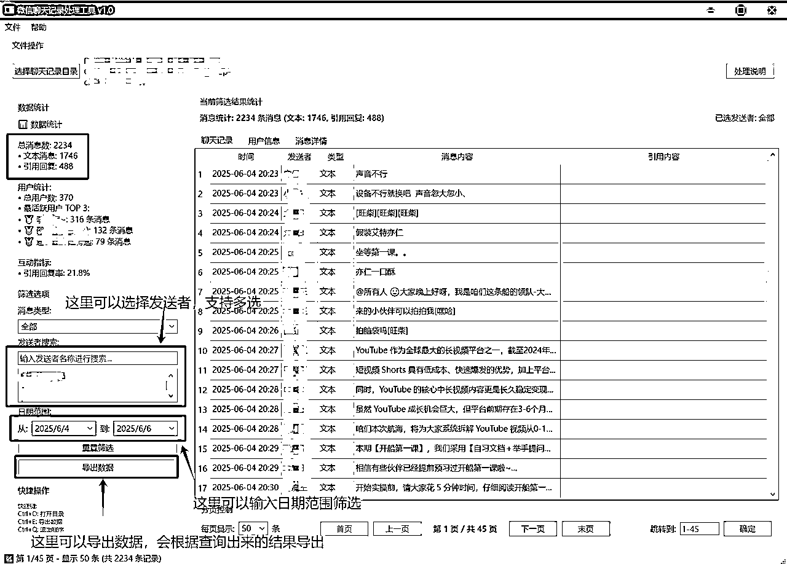

导出的时候，请选择csv。


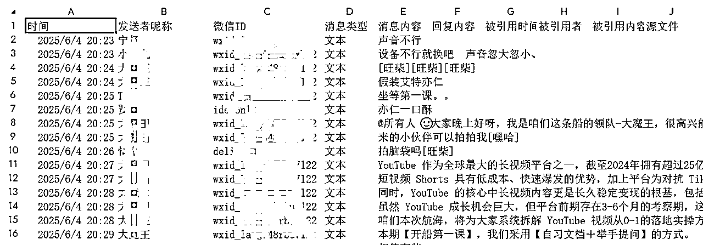

如果提取的csv文件过大（超过100万token），可以用下面这个小工具来分割，会自动按照单个文件最大字数分割成几个子文件。

链接: https://pan.baidu.com/s/1zxPcIfXu4X992_hS7gZaXA?pwd=8pni 提取码: 8pni

--来自百度网盘超级会员v4的分享

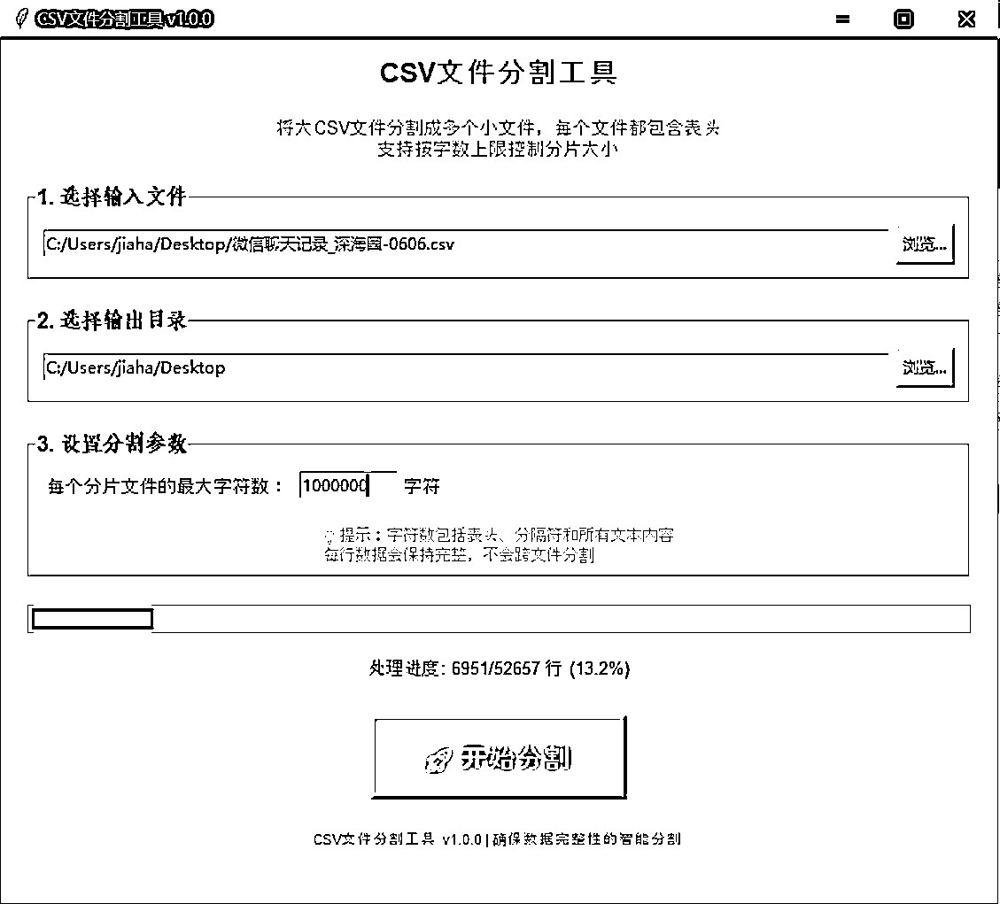

分割后的效果：

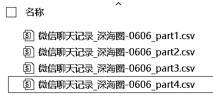

* * *

# 05 聊天记录转FAQ

这一步，我们要用到地表最强AI大模型（之一）Gemini 2.5 Pro。

用它的原因除了强大，最关键的是100万token的超长上下文，以及完全免费（暂时）。当然，更丝滑的方法是直接将Gemini接入到小工具中，非常简单，但这个需要一定的接口费用，所以暂时没做。

打开Google AI Studio（https://aistudio.google.com/），将刚才导出的csv文件拖进去，并且输入下面超简单的提示词即可。

如果文件过大，超过100万token，那么csv自行简单切割一下分批处理就可以了，但航海才开始几天，还远达不到。

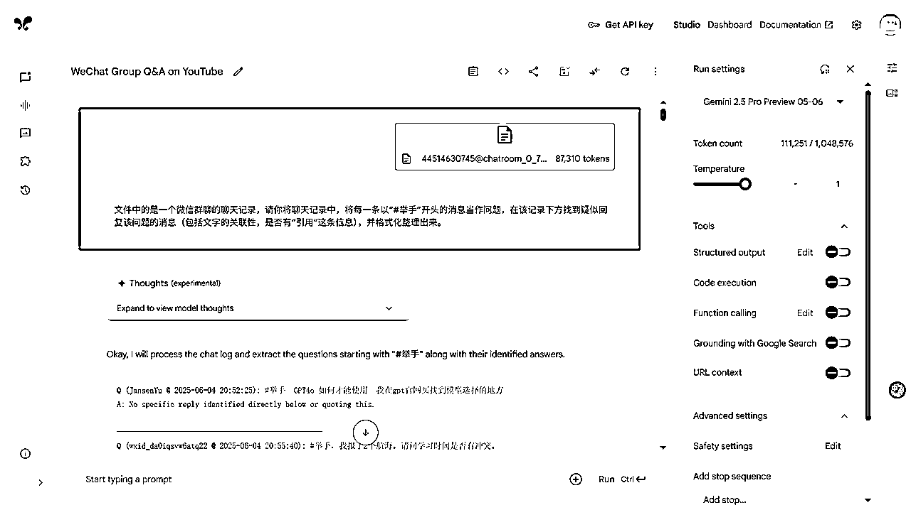

我这里以“#举手”作为有效的问题，当然你可以不用，调整下提示词即可做出自己风格。

```
文件中的是一个微信群聊的聊天记录，请你将聊天记录中，将每一条以“#举手”开头的消息当作问题，在该记录下方找到疑似回复该问题的消息（包括文字的关联性，是否有引用这条信息），并格式化整理成FAQ，每一条FAQ之间用分割线进行分隔。

格式要求（Q代表问题，A代表回答）：
Q：提问人昵称（提问时间）：
提问的原文
A：回答人昵称（回答时间）：
回答的原文
A：回答人昵称（回答时间）：
回答的原文
......
```

生成的效果如下，点击复制成文本，然后粘贴到google docs里，形成在线文档。

注意：如果有增量信息，不要加入到同一个doc中，建议用日期作为文件名来区分每一天的信息。因为后面用到的知识库，目前暂未能自动获取同一个doc的更新的能力。

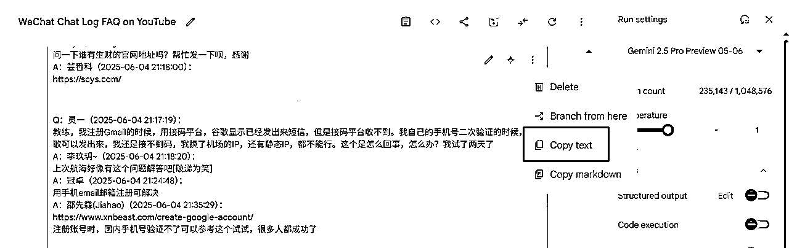

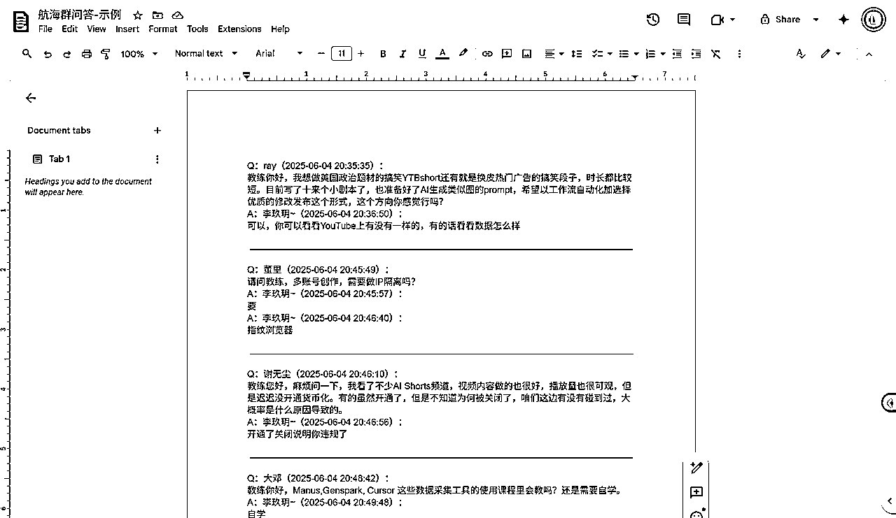

* * *

# 06 创建知识库并分享

本来真的很想用飞书问答来做，无奈飞书问答无法分享给其他人使用，而FAQ文档本身即使分享给其他人，其他人在自己的飞书问答中也没法引用到，这就很尴尬。

于是，我尝试用NotebookLM试试，没想到居然可以。关键是它搭载了Gemini，这语义理解能力实在太猛了，理解你的问题并从FAQ查找可能的匹配答案，完全不在话下。

不够好的一点是，导入了知识库后的Google docs，内容有更新在里面反应不过来，所以我刚才建议按日期来分开多个doc，每产生一个新的doc，就加入一下对应的notebook即可。

下面开始实操，首先新建一个专用的notebook。

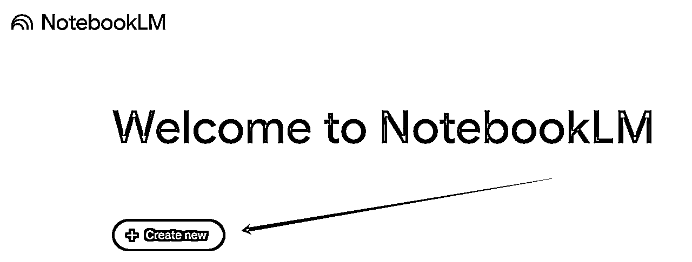

导入Google docs，选择刚才创建的doc。

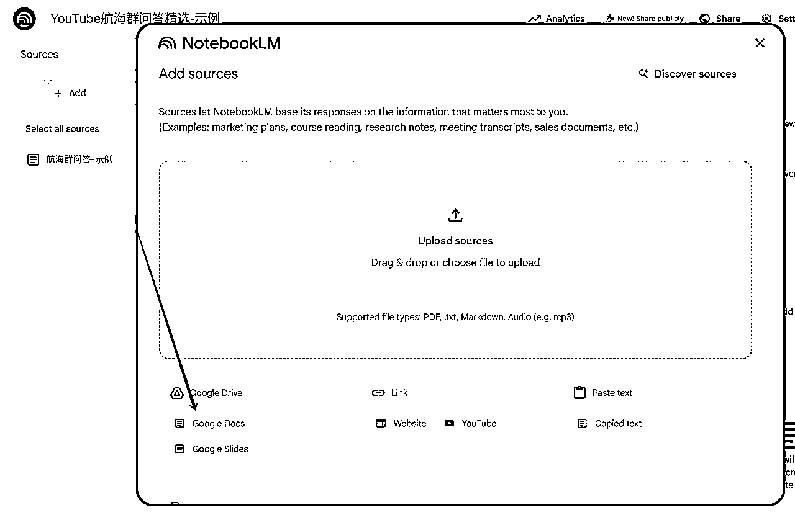

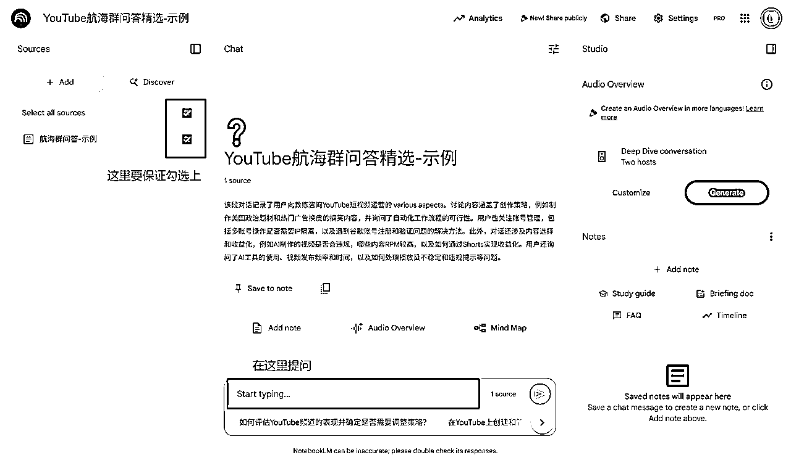

当我提问后，NotebookLM从我的doc找到了疑似匹配的答案，并且会总结发送给我，而不是简单返回一些原文片段。

当然，点击返回的答案中的数字，也可以直接定位到源文件的具体位置看原文，真的十分方便。


那么问题来了，怎么让别人使用这个知识库呢？

NotebookLM自带了分享功能，只需要点击Share按钮，将notebook的地址设置为公开访问，复制地址就可以让其他人使用啦。

如果不想其他人看到源文件以及中间的一些笔记，也可以将Viewers have access to 选项设置为Chat only，这样别人就只能提问，而看不到notebook里面的其他信息啦。

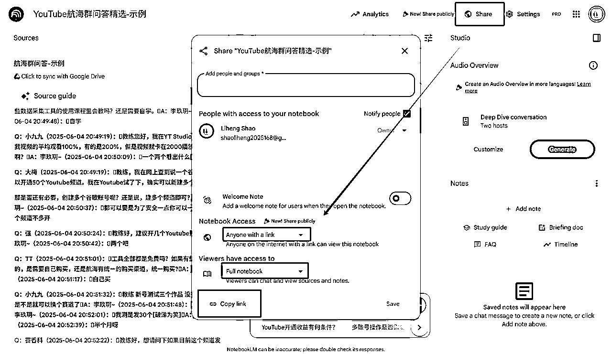

至此，一个基于多个微信群聊消息的共享知识库就搭建完成了。

* * *

# 写在最后

在做这个共享知识库的过程中，有过很多想法，但总是有些卡点突破不了，没想到这些卡点被NotebookLM全部打破，不愧是Google出品，强大！

其实很多其他工作上的问题，通过把不同的AI工具组合起来，你也能找到很好的解法，重点是要去思考和验证。

好了，以上就是本期的所有内容，大家赶紧去实操用起来吧！

如果上面的内容对你有启发，请动动你的发财手给我点个赞支持一下，谢谢。

如果实操过程中遇到问题，也可以到评论区留言哦。