# AI生图&生视频提示词保姆式使用方法（小白直接套用）

> 来源：[https://cw16bb4l9v6.feishu.cn/docx/Q5VTdOob4oQzAsx9h4tcSztfnCe](https://cw16bb4l9v6.feishu.cn/docx/Q5VTdOob4oQzAsx9h4tcSztfnCe)

这套提示词是我长时间使用总结下来的，参照本教程，小白可以很快上手，解决一些生图中遇到的一致性不好等问题，当然大神忽略！大家可以在这个基础上根据自己的使用要求和场景修改提示词。

# 1.使用顺序

【对标视频】→【Gemini2.5】→【豆包】→【即梦3.0】

# 2.对标视频反推提示词

【准备工具】

YouTube视频下载：https://tiqu.cc/

谷歌AIstudio：https://aistudio.google.com/

【第一步：下载好对标视频】

【第二步：来到谷歌AIstudio官网，先进行基础设置】

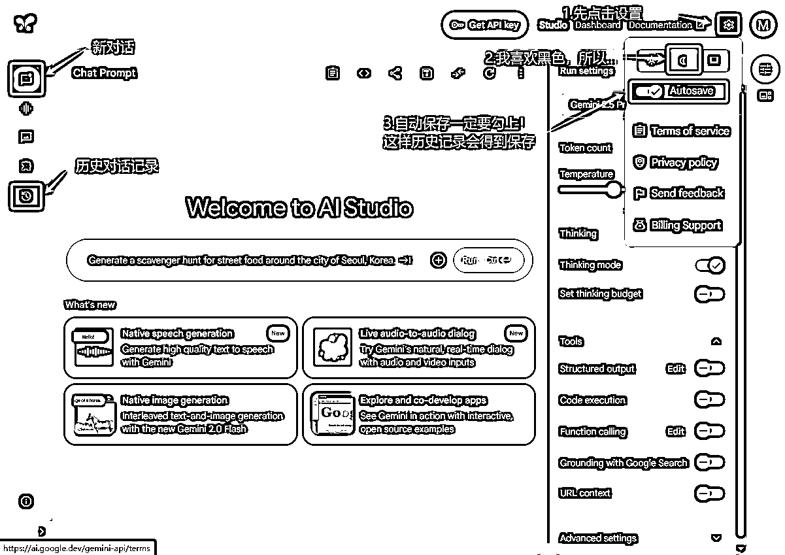

【第三步：把下载好的对标视频拖拽到对话框中，并且给到提示词（提示词↓）】

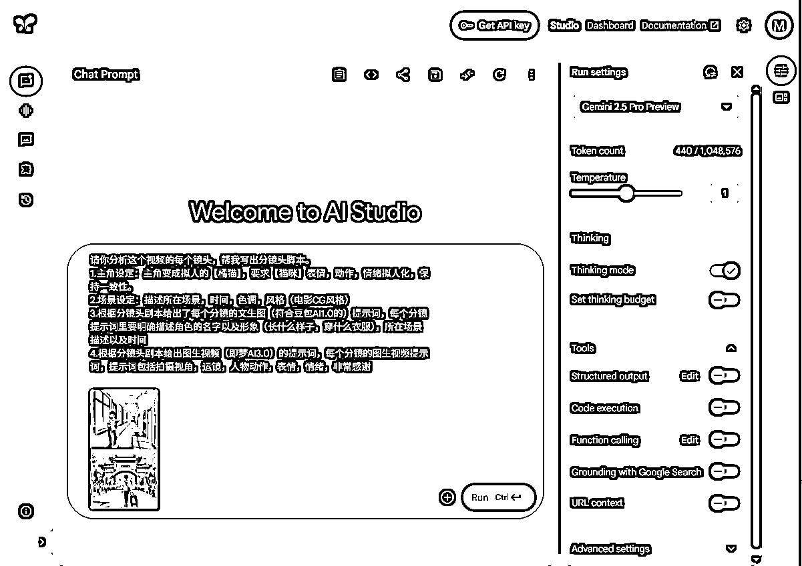

【第四步】把Gemini2.5给的提示词复制，发给豆包智能体，让他把文生图提示词给你单独整理出来。豆包智能体用好了就跟你的秘书一样，很省事，1分钟搭建完成。

1.豆包智能体搭建：

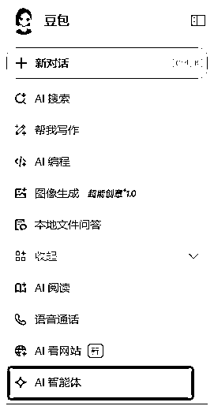

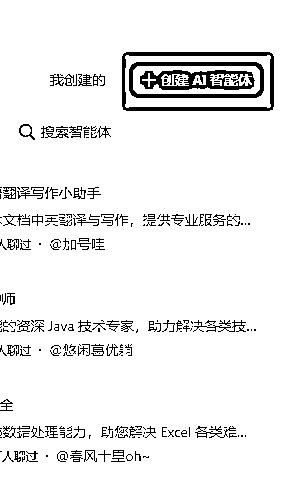

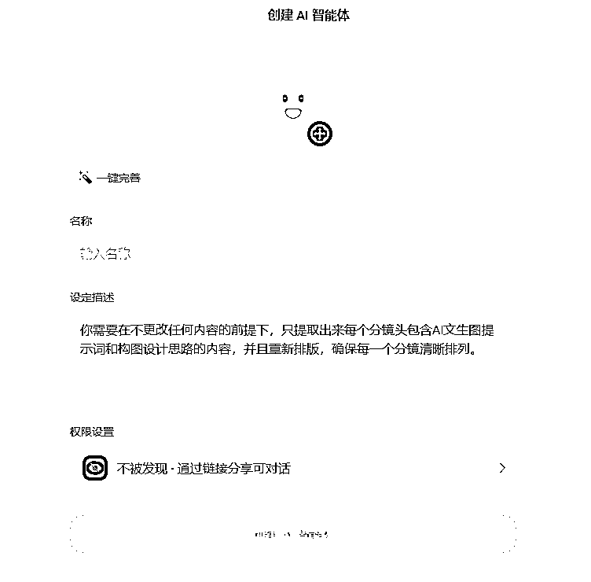

2.把Gemini2.5给的提示词复制，发给豆包智能体，让他把文生图提示词给你单独整理出来。

# 3.豆包生图

这里我常规操作在生图之前1分钟内进行4步对话，确保角色和生出的图是你想要。具体如下：

## 【第一步】基本设定，确定角色形象

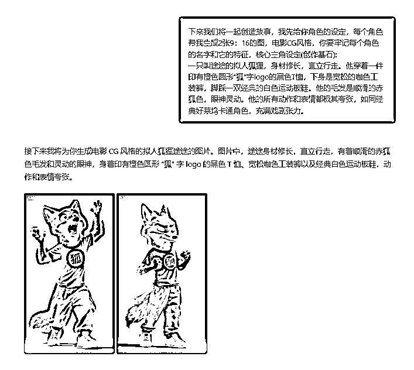

确定一下角色形象是否是你想要的，一致性是否OK？不OK调整提示词重新生成，直到你满意，OK的话继续！

## 【第二步】告知AI框架范围

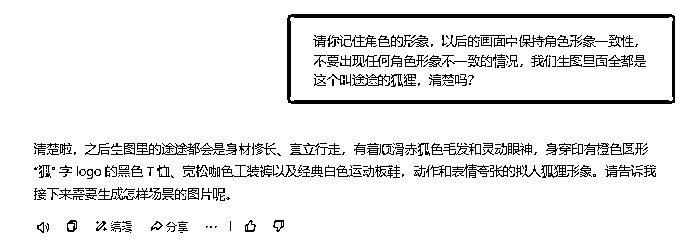

## 【第三步】设定风格、色调、生图比例、数量

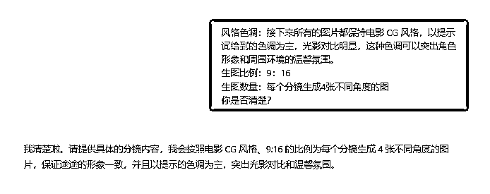

## 【第四步】执行指令

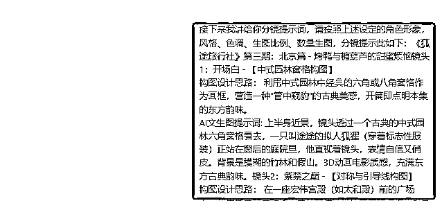

↓这个是这套流程的提示词效果很不错

给大家看下生成的图，效果很不错，一致性保持很棒！

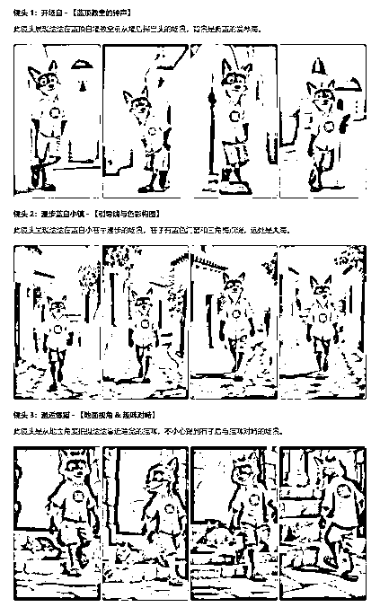

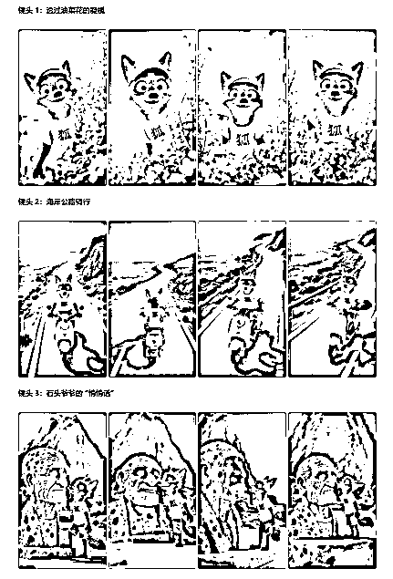

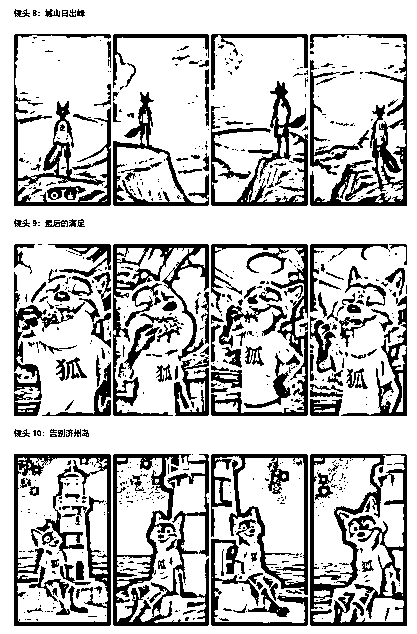

## 【第五步】如何实现超高清

有人问我，你的视频为什么这么清晰，其实在图片生成和视频生成的时候都需要提高清晰度，才能让最终成片效果很高清。至于高清是否有助于提升流量，仁者见仁智者见智吧~我是处女座没办法！

1.高清前后对比（圈友自省对比吧）

未高清↓ 已高清↓

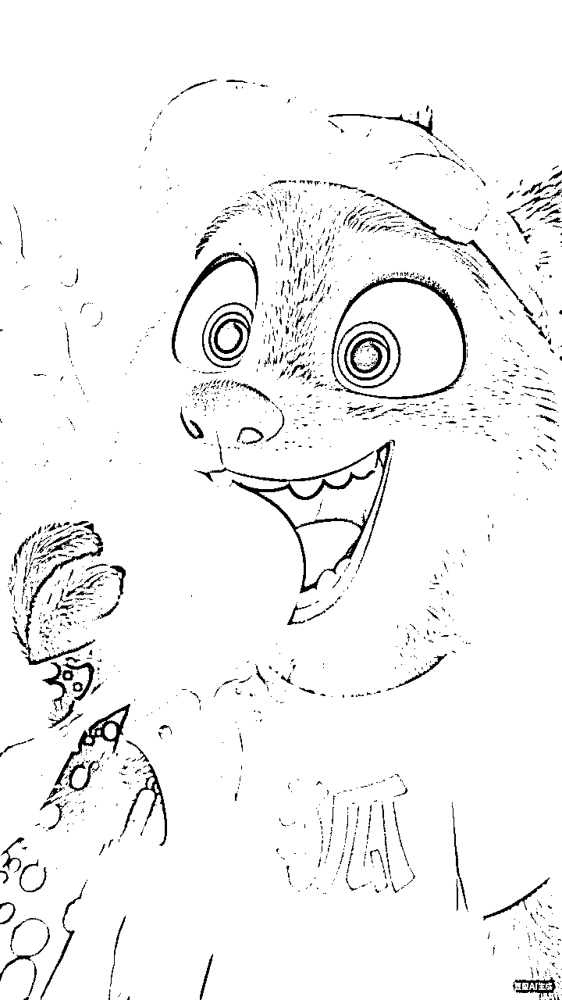

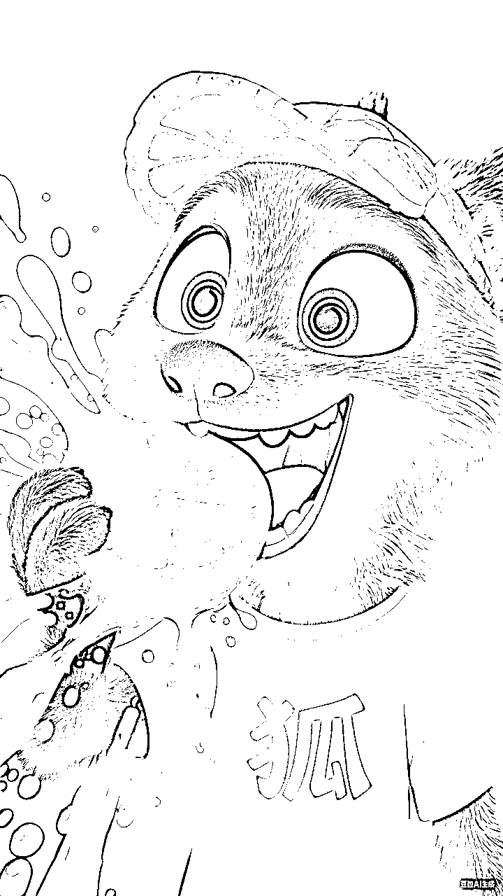

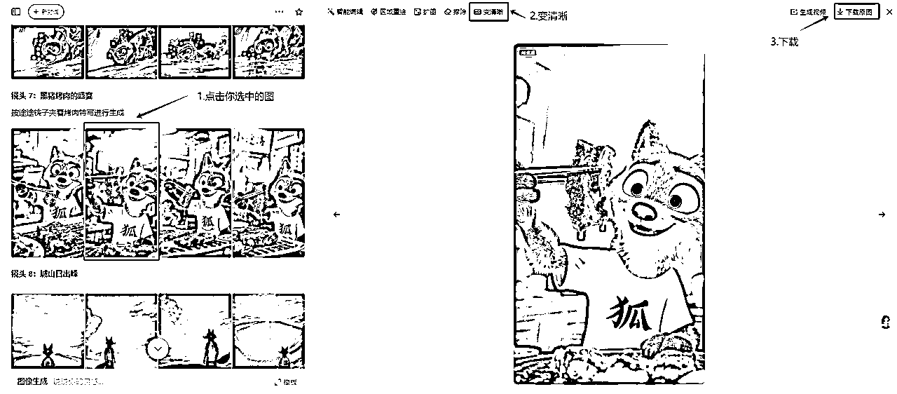

PS：如果个别分镜出现畸变或者角色不一致，那么可以调整提示词，有时候豆包也会像喝多了一样，你说啥他都听不懂，这时候你再次给他完整的描述一下角色形象+分镜提示词，基本可以解决掉。

# 4.即梦图生视频

我使用即梦生视频，因为总和性价比高，并且质量也很好很稳定，如果需要首尾帧生视频，我强烈建议用VIDU，效果非常nice，这里我们不赘述，只讲最适合不太懂AI的的圈友的方法。

## 【第一步】提取提示词

把Gemini2.5给的提示词复制，发给豆包智能体，让他把图生视频的提示词给你单独整理出来。豆包智能体搭建在上方自行查看。

## 【第二步】☆☆☆图生视频

这里给大家提供一个小技巧，即梦3.0是支持单张图片生成多镜头的操作，这样长期用可以帮我们省下银子，别问我为什么知道……举例：你原本10个分镜，需要生成10个视频，花费100积分，那么我们可以把提示词稍微修改，即可生成20个镜头的视频，大幅度提升视频的内容镜头丰富感，有助于提升后期剪辑节奏！

来看实操：

这张图片Gemini2.5给的提示词是这样：

拍摄视角：极低角度。运镜：固定。动作：狐狸停下脚步，蹲下身，他从背包里拿出一小块饼干，小心翼翼地递向土拨鼠。

但是我看到这个画面，我觉得如果他5秒钟做这几个动作太乏味，可以让镜头切换到土拨鼠吃饼干，所以我加了一下提示词，是这样的：后两秒切换到土拨鼠特写，两只手抱着饼干在吃，表情动作夸张

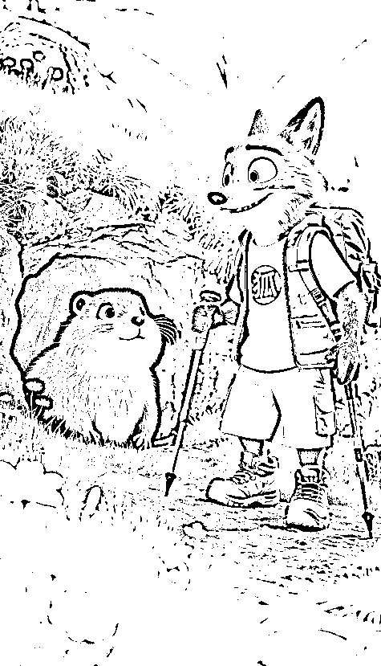

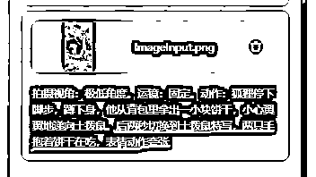

那么他生成的视频就是这样的，大家看一下↓（可以切换视角、景别）切记：后面加的内容尽量是画面中有的元素

## 【第三部】补帧+高清

1.补帧：先跟大家科普一下什么叫做“帧”，我们最长看到的视频通常是25帧或者30帧，也就是1秒的视频是由25张或者30张图组成，1秒内帧数越大视频越流畅，就像常听到的4K120帧，那么即梦生成的是24帧，所以有的时候看着总感觉动作不太流畅，所以我们给生成好的视频进行补帧（免费）建议直接60帧，如下图：

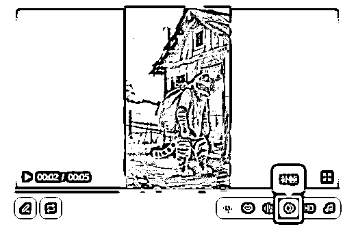

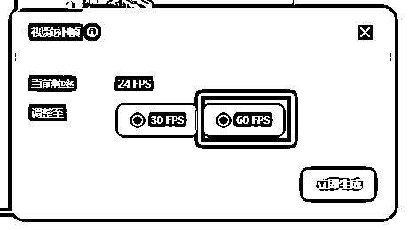

2.高清：大家应该记得上边我们已经把生成的图已经高清处理了，但是在即梦生成视频的时候还是会损失部分画质，所以，我个人习惯生成完视频后进行再次高清处理，这样保证画质最大化！具体如下图：

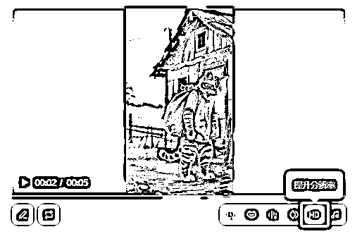

好那么接下来我们看一下对比：↓

未高清x未补帧↓ 已高清x未补帧↓

# 5.剪辑部分针对圈友说的一些问题，我会在后续继续更新！希望可以帮助到更多的圈友，加油一起破冰，打通0-1！