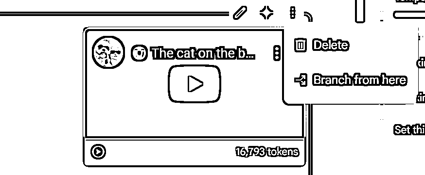
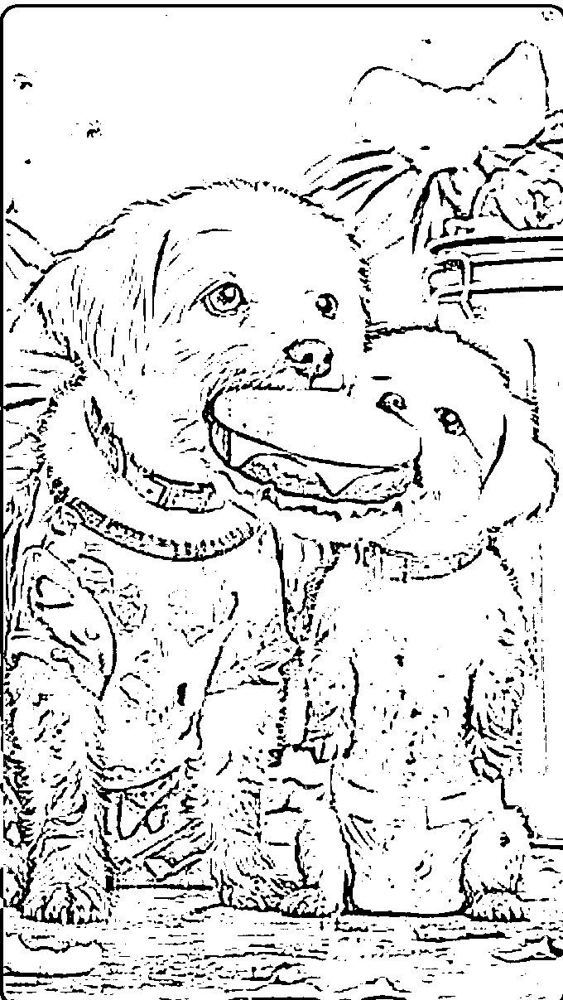
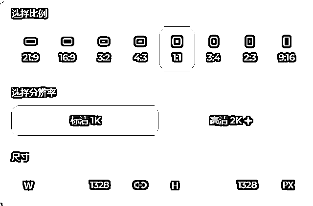
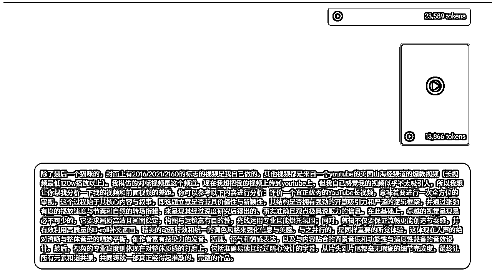

# [YouTube新人必读】擅用Google ai studio，复刻爆款AI视频易如反掌

> 来源：[https://bcn5ot9wwnew.feishu.cn/docx/IWgCdNCgMoP6nJxbZ64cMrPGnbh](https://bcn5ot9wwnew.feishu.cn/docx/IWgCdNCgMoP6nJxbZ64cMrPGnbh)

hello，大家好，我是逸尘，YouTube新人，做出好几个万播视频。本篇内容为分享从0-1做一个对标爆款的视频。对熟练度较高的大佬们没太大作用，但是对新人从0-1跑出一个万播视频应该还是有所帮助。

我先展示一下我快速从0-1做的几种风格不同的视频，如果你觉得我做的还可以，那么也许我能给你些许帮助

OK，如果你没划走，说明我还是有些许值得你学习的地方，接下来我会秉承效率至上原则，用最精炼的语言描述清楚每一个步骤，毕竟，你能阅读我已感激不尽。

# 一、找赛道-拆对标-确定内容

找赛道其实不难，对我来说，AI赛道基本上我可以不凭借任何人的指导，能复刻一个七七八八。

要做到这一点，就需要使用神器：google ai studio

这个东西的主界面介绍，我就无耻一点，借鉴下圈友（浚哲）的精华帖，侵权删哈哈😘：

## 1.爆款视频拆解：这一步很重要，能拆到什么地步，决定你的视频能达到什么高度

GAS是能同时点击“+”上传十个视频，这一步非常好操作，直接复制对标频道的所有爆款视频的URL，然后Ctrl V粘贴到对话框。（记住，爆款视频一次性粘贴的越多越好，数据越多，GAS分析地就更全面，就能拆解地更为细致）

这一步注意了，“十个”视频，只是历史最多只能上传十个，但是如下图所示，你只需要在之后的对话中把多余的视频delete，你就可以继续上传视频分析了。（而且之前的记忆会保留），这一点真的屡试不爽。但切记，只能历史十个，要不然你就无法继续对话了，它会显示internal error（但其实你删掉多余的视频就可以继续用了）

下图，就是我拆解今天做的视频，也就是上述我发的第一个视频，我把对标账号的120w播放以上的视频全部丢给了GAS让它帮我分析。（一个对话大概20w Token）

通过这个操作，你就能指导这个爆款频道的内容大概讲了什么，如果需要制作，能通过什么方法制作。

GAS会事无巨细地告诉你。

确定这是我力所能及的视频，就开始准备内容

## 2.确定故事内容

在了解了爆款视频的制作方法以及大概内容，由于GAS有记忆功能，所以我们只需要让它结合之前的视频内容和分析（同时，我们给出自身的条件），让它帮我想故事的内容，以下是我的提示词：

* * *

我会熟练地使用各种AI工具制作（除了midjourney，因为这个我没开会员）即梦+gpt+runway联合制作，但由于我觉得山海经的故事每一段小的生命线的主体的外形都是不一致的，也就是说主体一致性没有别的视频要求的那么高，所以我决定直接采用即梦+可灵进行制作。现在，我就需要你来帮我完成初步故事的构建。你必须想一个比较吸引观众的主体（必须要足够怪异，但是同时具有流量，能够吸引观众的眼球，因为前三秒特别重要，决定了视频的播放率）和故事。所以你现在给出三个你觉得足够怪异且能够吸引youtube观众的故事，让我来进行挑选或者修改

* * *

如果生成的故事，不满意，就结合你自己的需求来重新生成。记住：不能脱离对标的爆款视频来自由发挥！

最后，大概能生成这样的小片段故事描述，在这一步其实非常关键，你必须确认故事的精彩性

记住，视频的前三秒至关重要，前十秒也十分重要。这决定了视频的播放量以及算法是否会推荐。所以前10秒的内容必须足够新奇吸引观众的眼光。（切镜头要快、故事要足够新奇）我放两个例子在下面。这两幕是有独特性的，一眼就能看出场景的不寻常，才能吸引观众驻足。

# 二、文生图分镜头创作

确定好了故事的大概内容之后，就要进行分镜头的描述，这一步，也需要参考对标，让GAS分析，对标大概有多少个镜头，每个镜头多少秒。同时也要参考对标的风格（因为直接抄对标有侵权风险，最好原创，反正有GAS辅助并不难）。

我的提示词如下（其实也是让genimi 帮我生成的，需要教学的话以后也可以出）：

* * *

现在，我会采取文生图（只生成一张图片），图生视频的方式来完成素材。现在，我需要你帮我首先进行文生图的提示词描述，每一段描述里面都必须蕴含不同形象的主体（避免废话，只需要能直接生成图片的文生图提示词【中英文】）。提示词要求：

1\. 主体 (Subject): 图片最核心的内容是什么？

* 例如：一位宇航员，一只机械猫。

2.细节 (Details): 主体的外貌、穿着、姿态、表情。

*   例如：穿着未来感白色宇航服，戴着透明头盔，面带微笑，漂浮着。

3.环境 (Environment): 主体在什么地方？背景是什么？

*   例如：在土星环上，背景是深邃的宇宙和遥远的地球。

4.构图 (Composition): 画面如何取景？

*   例如：全身像，广角镜头，从下往上拍（低角度）。

5.画风 (Style): 想要什么艺术风格？

*   例如：电影概念艺术，数码插画，宫崎骏风格，照片级真实感。

6.光影 (Lighting): 光线、色调和氛围。

*   例如：电影感光照，柔和的光芒，黄金时刻，霓虹灯。

7.参数 (Parameters): 画质和尺寸。

*   例如：杰作，最高画质，8K，超精细细节，--ar 16:9（画面比例）。

提示词必须包含上述七个元素，然后以一连串字符的形式进行直接输出

* * *

通过上述提示词生成出来的文生图提示词其实很不错了，如果有不满意的，在具体生图的时候可以略加修改。

还要注意几个点：1.主角一致性 2.背景一致性 3.静态帧（不要任何连续性动词）4.一段话直接输出。

我的提示词如下可以参考：注意一些重要的点：1.为了保持主体角色性一致，你每个分镜头都必须对主体的描述词一致（比如说第一个分镜头描述的是一只穿蓝色带菊花的短裤的小猫，第二个镜头就不能描述：那只小猫，而必须重复描述“一只穿蓝色带菊花的短裤的小猫”）；2.前后同样背景的描述词也必须一致（比如说，第一个镜头小猫和猫爸爸位于一个普通的房间，这个房间有着一个沙发，一个花盆；之后的镜头如果也是同样地房间的背景，就不能说“猫爸爸所在的房间”“这个房间”，而必须描述成“一个普通的房间，这个房间有着一个沙发，一个花盆”）3.猫咪所在的每一幅图的背景都尽量描述的详细一点，背景里面有哪些元素，都描述地越详细越好。（比如，猫咪推开仓库，仓库里面有哪些内容，几排架子、一些螺丝、一些头盔、有无灰尘？这些都要描述地详细）4.所有的文生图提示词都是一个静态的画面，所以不能出现任何的动词（比如说，不能出现“推开”“穿过”这种动词，而应该描述成“小猫的手位于们上，低着头，正准备推开房门”，这种纯静态的描述，就是来形容一帧画面，而不是一个连续性的视频类的提示词） 5.上面的所有画面中包含的所有元素都必须一次性以一段话输出，不能有任何停顿

# 三、文生图

## 1.抽卡

这一步，其实是最关键的，因为图片决定了观众对你的视频内容的直接感受，所以需要反复抽卡、打磨。

但是，效率至上，所以我反复打磨提示词，让上述的文生图提示词非常精准，生成出来的图片大多数一次过（生图的时候有细微修改）。

磨刀不误砍柴工，打磨好提示词再谈生图，效率翻一倍不止

抽卡其实也有捷径，不过需要付款，需要的圈友可以去试一试这一款Chrome插件，支持GPT/即梦/MJ等主流生图工具，自动操作，加速效率。

这是官方文档：https://www.yuque.com/autojourney/docs/pkil2i72vcqfweld

Chrome商店搜：AutoGPT

即梦生图我是开了会员的，即梦生图最好用一积分的标清：

因为，有这个超清功能使得图片更清晰

## 2.去水印

注意：开通了即梦会员左上角仍然有“AI”的水印，所以去水印在所难免，我这里推荐三款去水印好用的免费工具，

如果不考虑质量的话，我直接推荐一款google商店的插件（720p，对我来说有点无法接受）

第二款和第三款画质没变：

第二款完全免费，第三款不知道是否完全免费（至少我现在用的次数它是免费的）。它们的缺点都是一次只能去水印一张图，所以可以同时用。

https://online.niuxuezhang.cn/online-photo-watermark-remover/detail/

https://www.arkthinker.com/zh/watermark-remover/

## 3.文生图我有话要说-解决人物一致性问题

我其实不止用即梦生图，只是在山海经这个内容上，由于主体不具有一致性，所以我用即梦生图一点问题都没有。

但是往往很多视频（比如故事类的视频）是有较高的人物一致性要求的，所以我采用了以下方法来解决（在我尝试了很多工具之后，包括但不限于gpt、即梦、可灵、豆包、runway、vidu、智谱清言）

我直接说结论：

由于我没充MJ，所以以下内容均不是最佳答案（最佳答案就是充MJ，这就是AI和所有创作者公认的最好用的控制人物一致性的软件）

1.gpt

2.runway

只有这两个很不错。只需要先把你要当做主体的图片上传给他，比如我之前的猫爸爸和猫猫的视频，我就先上传给了gpt和runway。

然后告诉它们，使得图片中的角色作为以下文生图提示词中的主体，再给出相应的文生图提示词。就能比较顺利地生成了。

由于gpt（大概一个号生成不超过10张图）和runway（最高1080，一次消耗积分8【720p消耗5】）使用次数有限，所以想要白嫖，就得多开几个号。如果不差钱，就结合我上述推荐的Auto工具，直接猛猛干！

# 四、图生视频

## 1.图生视频提示词

这一步，其实有朋友是有误区的，包括之前的我也是，为了节约时间，在生图的时候就把已经生成好的图片结合图生视频提示词去生视频，这其实是错误的，因为这一步有个（隐藏）方法，可以提高视频生成的精准性。

假设我们现在已经得到所有的图片，我们就可以把这些图片再次导入Google ai studio（GAS）让它根据图片来生成图生视频提示词

* * *

因为这里我之前给过它提示词了，所以没有给详细提示词。我的图生视频提示词如下：

现在你结合我生成的所有图片，给出所有的图生视频的提示词。提示词要求如下：制作即梦图片生视频的提示词，除了需要包含静态图片生成的核心要素（主体、细节、环境、构图、画风、光影、参数）之外，还需要着重描述时间的变化和镜头的运动。

以下是制作即梦图片生视频提示词需要包含的关键内容，并用最简洁的语言概括：

1.  初始状态 (Initial State): 视频开始时的画面是什么？（同静态图的完整描述）

1.  时间推移 (Time Progression): 画面中会发生什么变化？（例如：日出、烟雾弥漫、花朵绽放）

1.  角色/物体动作 (Character/Object Action): 画面中的主体会做什么动作？（例如：奔跑、挥手、变形）

1.  镜头运动 (Camera Movement): 镜头的运动方式和轨迹？（例如：缓慢拉近、快速平移、环绕拍摄）

1.  景别变化 (Shot Type Change): 画面中景别如何切换？（例如：从远景到特写）

1.  过渡效果 (Transition Effects): 画面之间如何过渡？（例如：淡入淡出、叠化）

1.  最终状态 (Final State): 视频结束时的画面是什么？

总结公式：

初始状态 + 时间推移 + 角色/物体动作 + 镜头运动 + 景别变化 + 过渡效果 + 最终状态 + (风格参数)

要求：以一段完整的形式进行输出，包含以上七种元素

* * *

## 2.图生视频

图生视频我主要充了即梦、智谱清言和可灵

排名自然：可灵>即梦>智谱清言

但是今天即梦更新了pro模型（50积分一次，没敢用），我觉得应该是不比可灵差的。

即梦的优点，生成音效功能刚上线，最近是免费，一个视频三个音效，爽！

白嫖玩家也能玩！

# 五、剪辑

## 1.google ai studio助力剪辑

这一步不比我多说，就是看大家的剪辑功底的时候，但是，有一个但是！你只要擅用Google ai studio你就算是头猪，你也能学会高端的剪辑技巧，今天就给大家上一课。

就是大家看一下我刚开始的第三个视频末尾的回忆片段，我当时看到对标视频的这个片段的时候就觉得好高级，做不来，结果，我把视频丢到GAS，它马上就手把手教我用剪映把这个效果做出来了，由于当时的对话我没保留，就不好分享图片。但是，我想强调，只要你看到某个对标视频的效果，把它丢给GAS，它真的就能一步步纯小白都能懂地教你剪辑技巧

## 2.google ai studio助力音效搭配

做动物视频的朋友们都知道，音效在故事里面至关重要（因为没有对话和字幕）。所以好的音效可以说决定了一个视频百分之三十的成败。

但是，思考搭配什么音效是一个比较困难的事情，老是在剪映的音效库里面搜索，却找不到称心如意的，那么这时候，就可以让GAS来帮我们

然后，我们照着GAS给出的音效名字去剪映搜，就比较快捷了，一般都能找到合适的。

# 六、反思-提升

是不是到这你就觉得完了？该上传视频了？其实不然。

你这时候应该把你的成品视频最后上传给GAS，让它对比对标账号的爆款视频对你的视频进行评价，找出不足，进行查漏补缺。

我的提示词：

* * *

除了最后一个猫咪的，封面上有2016/2021/2160的标志的视频是我自己做的。其他视频都是来自一个youtube的美国山海经频道的爆款视频（长视频最低120w播放以上）。我模仿的对标视频是这个频道。现在我想把我的视频上传到youtube上，但我自己感觉我的视频似乎不太吸引人，所以我想让你帮我分析一下我的视频和前面视频的差距。你可以参考以下内容进行分析：评价一个真正优秀的YouTube长视频，意味着要进行一次全方位的审视，这个过程始于其核心内容与叙事，即选题立意是否兼具价值性与新颖性，其结构是否拥有强劲的开篇吸引力和严谨的逻辑框架，并通过张弛有度的播放速度与节奏和自然的转场衔接，来呈现其经过深度研究后得出的、事实准确且观点极具说服力的信息。在此基础上，卓越的视觉呈现是必不可少的，它要求画质高清且画面稳定，构图与运镜富有目的性，光线运用专业且能烘托氛围；同时，剪辑不仅要保证流畅更能创造节奏感，并有效利用高质量的B-roll补充画面、精美的动画特效和统一的调色风格来强化信息与美感。与之并行的，是同样重要的听觉体验，这体现在人声的绝对清晰与整体音量的精妙平衡，创作者富有感染力的发音、语速、语气和情感表达，以及与内容贴合的背景音乐和功能性与适度性兼备的音效设计。最后，视频的专业高度则体现在对整体质感的打磨上，包括准确易读且经过精心设计的字幕，从片头到片尾都毫无瑕疵的细节完成度，最终让所有元素和谐共振，共同铸就一部真正经得起推敲的、完整的作品。

* * *

上面提示词中的后半部分，其实也是让genimi帮我生成的优质长视频必备元素（感兴趣也可以之后分享）

然后，GAS就给了我相应的修改建议：

太多了，就不一一呈现，反正，我又去剪映里面修改了一下。哈哈，然后又出了第二版成片，才上传的Youtube。

注意：这块导出视频的时候就选择480p、25fps就行了，因为只是进行视频的诊断， 不需要太高质量。这样可以加快上传速度，提高效率

# 七、上传视频

## 1.导出配置

按照我这个就行了，不需要太高的分辨率，对播放量没有任何影响

## 2.google ai studio助力标题和说明的生成

标题其实能为视频增加曝光量，因为一个SEO优化友好的标题，观众能通过关键词搜索，从而得到更多曝光。

说明虽然不能增加曝光量，但是某种程度上能提高点赞量，因为如果在说明里面描述一下剧情，那么观众可能能更好地理解故事的内容，从而提高点赞率。

# 八、小技巧

嘿嘿，我最喜欢分享小技巧了，之前分享过AI提效的小技巧，没拿精华优点遗憾，大家可以读一读啊：

https://scys.com/articleDetail/xq_topic/8852484828841522

## 1.YouTube下载：

很多圈友老是在群里问，但是有一个最好用的工具没人知道，我这里就公开分享一下：（真是把我的好东西全掏出来了）

这是一个YouTube对标视频页面，

点击上方的URL

删掉，ube，然后回车，神奇的事情发生了：

出现了这个界面，可以下载音频和视频。

但是美中不足，视频最高能480p，音频最高128kbit/s。但是如果付费的话最高能享受8K清晰度，包年9$一月，包月12$，更适合大佬玩家。如果只是想提取个音频啥的，倒是够了。

如果不追求过高清晰度，就使用这个网站：

https://tiqu.cc/还是比较好用的

本来还想写很多的，发现一部分已经融入在前面的内容里面了，比如去水印。

2.canva制作封面以及做内容

其实长视频的封面是需要打磨打磨的，比如我这个

就是我精心用canva打磨的，首先，我之前做视频的时候生成了16∶9的图片，然后可以使用即梦的扩图变成9∶16（记得加超清）。然后再咸鱼上买个canva的会员，一块钱。就能直接选择制作YouTube封面：

我觉得还是挺不错的。然后就是拼接上述生成的图片，这个很简单，拖动一下就好了。然后高清下载。

## 2.除了生成封面图，还能做视频内容

可以看到我最开始的熊猫最后一个回忆的片段有这样一个画面：

这封信其实也是canva做的，只需要找一个牛皮纸模版，然后修改一下，添加英文内容即可。做视频的时候弄关键帧就能做出视频中的效果

还有一部分是关于我如何提升自己YouTube制作能力的，也就是我如何获取更多的制作YouTube视频的认知的，这方面其实还有很多就可以讲的。但是内容又是另外一个层面，也比较多，就下一篇再讲喽。

如果这篇文章对你有一些帮助和启发，麻烦帮我点个赞赞！😘❤️

如果大佬们能看出我有什么地方做的不够好，或者做错了，辛苦斧正