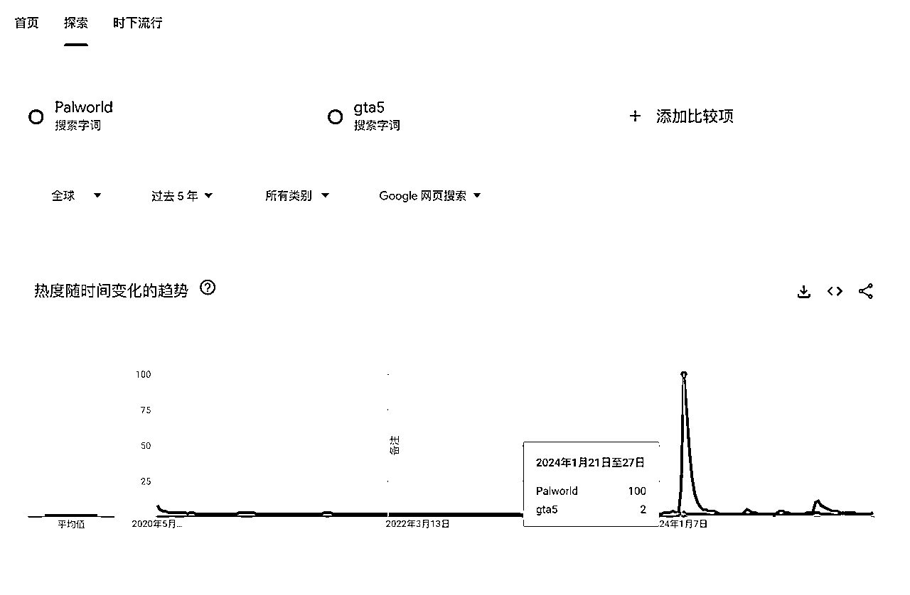

# 出海游戏网站如何玩？如何发掘潜力游戏？

> 来源：[https://ppn3f2zvoq.feishu.cn/docx/DNP7dsmjEok7BaxksPWcGDZrnJd](https://ppn3f2zvoq.feishu.cn/docx/DNP7dsmjEok7BaxksPWcGDZrnJd)

哈喽，大家好，我是PeterZEN，我做游戏站有几个月了，分享一些自己的经验和体会。

也许大家看到过这篇：游戏网站如何获取更多游戏 。这篇帖子，侧重于解决游戏获取的问题。

而本文提供的核心价值，侧重于解决游戏找词选品问题，拓展出海游戏方向的思路。

哪怕你对游戏站不感兴趣，里面很多思路可以拿去复用。

许多圈友在web航海里，用AI做出了人生的第一个网站——小游戏网站，但航海只是开始。

因此我来给大家分享如何挖掘潜力游戏？这些思维同样可以迁移到工具站。

# 为什么会选择游戏这个方向探索？

## 正反馈快：

新词游戏站，单纯的上线网站，做好seo基础，零推广，就已经获得了来自谷歌的搜索流量。

图中为4月中旬捕捉到的一个游戏关键词Crazy Cattle 3D，上站24小时的谷歌搜索后台的数据。

## 技术的进步，大大降低了行动成本：

gpt-4o出色的生图能力，让我看到了这方面的潜力，gpt-4o能够直接生成一些透明背景的图，可以直接作为游戏素材使用。技术的进步，让个人做游戏的门槛大大降低。

另外就是AI写代码做网站变得容易。直接iframe的方式能快速上线一个小游戏网站。

再加上前期有免费的cloudflare、vercel、github等，可以提供免费的托管服务。

开始行动的成本很低。

## 回报可观：

看到了最近一年里，不少人仅仅靠游戏网站seo这套玩法实现了月入百刀、千刀，甚至有人月入万刀。

## 生态之大，玩法之多：

游戏的生态很大，玩法之多。对于没有多少资源的普通人来说，不仅仅是iframe游戏网站、还有很多开源游戏、还可以围绕游戏做工具等等。

# 目前游戏站适合普通人的玩法？

常规玩法，靠综合或垂直类游戏，长期耕耘，持续更新，通过SEO、社媒等方式获取流量，靠广告/订阅/会员/分销变现。

新词游戏站，通过做新词游戏站，主要通过seo获取流量，谷歌adsense变现。这个玩法不是新玩法，但是2024年依然有人通过这个玩法实现了月入百刀千刀。我接触这一块是受到@哥飞 和 @良辰美 的启发。但是不要看到高手月入万刀就觉得游戏站很好做。

最适合新手普通人的就是前面两种玩法。

付费流玩法，靠投放赚取利差。比如靠着tiktok的便宜流量，卖给谷歌，靠adsense赚钱。靠着流量的低买高卖盈利，做流量套利。

今天这篇帖子主要分享一些方法论以及一些案例以及我的一些收获，打开游戏站的思路。

# 一些概念知识点需要你了解：

网站的流量来源来有哪些？

流量来源有社媒流量、自然搜索、直接流量、引荐流量、付费流量、邮件。

通常游戏站自然搜索、直接、引荐流量占比较大。

什么是蓝海？

刘小排老师的金句：不过就是「找软柿子捏」。

找到一个需求强但供给弱或者别人看起来很菜的市场，然后提供更好的解决方案。

什么是顶级蓝海 ？ —— 满级大佬屠杀新手村！

为什么提到这个？

因为目前的新词游戏站能玩起来的，背后逻辑就是需求强但供给弱。

一个新游戏火了，用户就会去搜索，而刚开始，提供这个游戏的网站很少，你提供了这个游戏，你的网站就能获得这部分流量。

用户需求大，供给的网站少，因此前期，做好seo就能获得来自搜索引擎的流量。

# 【重点】如何挖掘潜力游戏？

## 挖掘的切入口方向？

做电商有选品的动作，做自媒体的有选题的动作，游戏站也有选品的动作。

电商有铺货和精品的玩法，游戏站也有类似的玩法。

游戏的选品定生死。选择一个趋势向上的潜力爆款，吃流量上涨的红利。也可以选择一个持续稳定的品，吃长期的流量。

找潜力游戏就像翻石头一样，需要翻开很多个石头才能找到几个不错的。

寻找潜力游戏有很多切入口。

### 1.围绕关键词（基本功：谷歌趋势）

使用谷歌趋势是基本功。有人会问，为什么不用semrush一类的数据工具？因为游戏新词足够新，第三方数据工具更新有滞后，最新的数据不能第一时间查到，所以才选择用谷歌趋势。

谷歌趋势有两种主要用途：找关键词和关键词分析

谷歌趋势里面有两个板块需要多留意：探索 、时下流行。

在探索里面，通过关键词词根找到飙升的游戏关键词，以及做关键词的分析。

在时下流行里面，找游戏关键词。

微信有微信搜索指数来辅助判断一个需求的热度，谷歌有谷歌趋势来判断一个关键词的热度。搜索即需求，用户的需求会带来搜索行为，最终体现在数据上。

通过谷歌趋势粗略判断这个关键词的搜索量级和搜索趋势。只要是搜索量不错，趋势飙升的。都值得去做。试试看，下场干的成本不大，错过的代价太大。

如果想详细了解谷歌趋势，可以看看别的圈友写的这篇，本文就不再重复讲解如何使用谷歌趋势了。传送门：生财有术·会员主题贴

### 2.围绕游戏聚合类网站

我们还可以通过crazygames这一类的游戏聚合站挖掘游戏。

可以通过看网站的sitemap、最近更新的页面、以及分类列表来挖掘游戏。

推荐使用aitdk的浏览器插件，快速查找sitemap。

这里分享一个sitemap在线查看的工具，帮助你快速找到最近更新的游戏页面：https://sitemap-extractor.gsctool.com/

最近更新并被收录的页面可以使用高级搜索指令。

分类榜单就是点进去看，new/trendings，看数据，有多少人玩了，评分如何，游戏多久上线的……

比如，crazygames.com 里面就有New games的分类，可以到这里面看看。把新游戏的关键词拿到Google Trends看趋势如何。趋势和预估搜索体量不错就去做。

### 3.围绕社媒论坛

社媒论坛平台也是一个重要的渠道。

谷歌趋势其实也是存在一定的滞后性的。

很多关键词是在先在社媒等其他地方先火起来后，用户才有了去谷歌搜索的行为，才有了谷歌趋势上看到的数据。

那社媒如何找呢？

方法一，靠推荐算法。

把算法调教出来，让算法自动给你推荐。多看一些游戏相关的内容，互动，搜索，点赞，评论，关注，算法就会开始给你推荐。自媒体/电商都有这样的方式，游戏也可以这样。

方法二，靠搜索，搜索一些关键词。

找到异常的数据。一种思路是近期的、低粉、带异常数据的。多关注异常值。只要遇到异常值就多去看一看。

方法三，标签话题。

方法四，关注一些博主。

比如测评游戏的、经常玩游戏、游戏开发者等等。

举个例子，Crazy Cattle 3D这个游戏，itch.io上发布的，但是itchio上的数据非常一般，仅仅从itch.io上的数据，完全看不出来这个游戏有火的潜力的。在最早期，谷歌趋势也是看不出来什么苗头的。

这个游戏的爆火的源头是在社媒平台——Tiktok。

同时，当你在YouTube上搜索该关键词，就会发现许多异常值。

一些粉丝不多、平常视频数据一般的youtuber，在短时间内该游戏的视频数据异常。

上图中的这个博主的视频数据，除了Crazy Cattle 3D，还有一个异常的视频数据——Pokerogue，这个也是一个爆过的游戏。感兴趣的可以去看一看。

这个游戏我是跟了的，这张图是GSC后台24小时数据，即使我上线晚了一两天，依然拿到了不错的正反馈，零外链，零推广。

Crazy Cattle 3D这个游戏，是非常新鲜的案例，有很多值得学习的地方。这是我收集的一些值得学习参考的同行网站（数据收集于5月8日）：

crazycattle3d.com这个游戏站，90多天的时间获得了百万流量。

### 4.关注优秀开发者/小团队/游戏系列

关注一些优秀的开发者，因为它们过去产出过爆款，有不错的流量，有了一定的粉丝基础，当他们发布新游戏的时候，更容易起量。

平时在看游戏的时候，开发者的信息和数据也需要多看一看，记录下来。关注他们的网站、社媒平台账号。

比如，neal.fun。今年年初它的stimulation clicker就再次爆了。

还有infinite craft 这个游戏，24年1月发布的，爆了，新瓶装旧酒，爆款总是惊人的相似。

提到该作者，有一点需要提，版权问题，DMCA。github对于收到投诉你的仓库会被删除。谷歌会让你网页不在搜索结果中出现。

Stimulation clicker这个游戏是个有趣的例子，neal.fun是该游戏的创作者，创作者和stimulationclicker.com之前的纠纷，最开始stimulationclicker.com的站长是是iframe的方式提供游戏的，但是被neal fun给禁止了，后来他们之间就达成了某种合作，允许后面网站的站长iframe。

再后来一段时间，看到后面的站长抢占了搜索结果的第一位，正主却排在后面，3月份neal fun向谷歌提交了投诉。后面就看到stimulationclicker.com这个网站的首页就没有出现在SERP当中了。

投诉原文：https://lumendatabase.org/notices/49847007

当然，这个风险是完全有办法规避的。我的网站也在被投诉的列表里面，没被谷歌处理，存活下来了。

### 5.围绕游戏生态其他环节

游戏的生态很大，上游有游戏开发者、游戏引擎和工具等，下游有各种类型的游戏平台、玩家、各种广告和变现平台、游戏相关的社区。这些都可以作为挖掘游戏的来源。需要你深入去探索。这些就是拉开你和别人差距的地方。找到高胜率、人不多的渠道。

游戏界也有黑客松一类的比赛。

### 6.通过数据工具寻找

虽然前面说了数据工具有滞后性，而选择用谷歌趋势，但数据分析工具依然也是一个不错的渠道。数据分析工具要在数据更新后的第一时间找，机会才多。

重点关注近期流量飙升的新页面/网站。推荐的工具，similarweb或者semrush。

通过网站和关键词的方式切入寻找。从词找站，从站找页面到找词。词/页面/网站 来回循环。

### 7.经典爆款的创新/二创

游戏领域，依然存在，爆款总是惊人的相似的规律，依然存在新瓶装旧酒。

很多开发者喜欢围绕爆款/经典游戏，做创新。

比如像Wordle（一种填字游戏）、Minesweeper（扫雷）

搜索关键词可以是 ， 某某游戏 alternative/similar/like

举个例子，

比如，Little Alchemy 和 Infinite Craft。

https://allchemy.io/

Little Alchemy 首发时间是在2010 年12月，玩法就是不同元素组合升级。https://littlealchemy.com/

Infinite Craft 首发时间2024 年 1月，同样的玩法，24年就火了。

除了模仿二创，语言本地化也是一个方向。通过特定的插件、联系游戏作者获取代码、对开源的游戏展开语言本地化。小语种也是一块流量洼地。

### 8.预告游戏

投资想做好，需要找到一些提前量，比别人先获得一些信息。

做游戏站想抓爆款，依然有一些提前量可寻，最简单的提前量就是游戏预告。

不过这里面有几个风险在于，游戏开发团队解散、游戏正式发布后不及预期。

如何抓预告游戏？看预告时用户的反应。黑神话悟空，想想预告的时候就已经惊艳了游戏玩家，等正式发布后，爆火。用户预期和实际相匹配。

### 9.AI类游戏

AI游戏这一块，爆款频出，目前主要两种：AI驱动的游戏和AI生成的游戏。

AI驱动的游戏，例如：AI驱动的网页游戏，一款基于文本的冒险故事游戏：https://aidungeon.com/。

给一个关键词，感兴趣的可以深挖：AI Text Adventure Games。

AI生成的游戏， 例如，知名独立开发者Pieter Levels做的一款ai生成的游戏，https://fly.pieter.com/

btw，在深海圈已经看到圈友，做出了非常优秀的AI驱动的网页游戏。

这一块，以前就有很多文字对话游戏，现在这些游戏的选题，是不是可以拿AI重做一遍！？

## 如何分析？

如果你是某方面的游戏爱好者，找到擅长熟悉的领域，去分析挖掘。

但大部分人不是资深游戏玩家，经常会看不懂某个游戏为什么火，没关系，只要会通过各种信息，判断出是潜力爆款就足够了。关注异常值、关注趋势、关注体量。在用分析游戏潜力的时候，要保持对异常值的敏感。

通过各种渠道找到游戏，拿游戏的关键词，到谷歌、社媒等地方去搜索，看是新游戏还是老游戏。

当我们从一些地方找到异常的地方后，再把关键词拿到谷歌趋势中看。

判断下来，搜索体量大，趋势向上的新游戏就去做。

不知道如何用谷歌趋势的，看其他圈友写的保姆级教程：https://scys.com/articleDetail/xq_topic/2852224854521441

前面的一个例子，crazy cattle 3d游戏，放到谷歌趋势里面看，和其他关键词做对比。可以明显看到这个游戏的搜索体量很大。

然后拿到域名查询工具里面看，别人有没有注册该域名。搜索体量大，没有多少人注册就赶紧做。

Crazy Cattle 3D这个游戏，是非常新鲜的案例，有很多值得学习的地方。这是我收集的一些值得学习参考的同行网站（数据收集于5月8日）：

# 找到游戏关键词后，如何做以及一些常见问题？

找到潜力爆款只是起点，还需要解决供应问题。后面的竞争就是供应链和运营的竞争。

只要用户还有需求、游戏热度没有完全消失，那就需要持续运营网站。持续更新，持续满足用户需求，把流量做起来。

在寻找游戏的时候，你可能会遇到一些情况？

一些游戏词，比如主机游戏、小程序、app类，不能直接在网页浏览器上运行游玩。

这个时候，你能不能让用户不用下载就能在网站上游玩？想办法去实现这一点。主机游戏有云游戏服务。

不愿意麻烦，就去做内容站、做工具站、做图片站、做资源站也是不错的选择。

提到游戏站就不要只局限于做小游戏网站，思路打开，变为以游戏为切入点找需求，做网站，做产品。

想做游戏内容站不知道怎么做？

那就去用中文游戏关键词，看看看国内的游民星空和3dmgames这类网站是如何做的。同行就是最好的老师。

一个大型主机游戏，是有很多细分需求的，也可以做工具站。

比如，可以做相关的计算工具。

例子：

Palworld Breeding Calculator

（幻兽帕鲁，使用繁殖计算器进行父母、孩子和多个朋友的繁殖，并在 Palpedia 上一个方便的位置了解独特的组合和野生蛋机制）

幻兽帕鲁是2024年初火的一款主机游戏，热度很大，比GTA5的热度还高，直到今天的依然有非常不错的热度。

ARK Taming Calculator

（方舟生存进化，用于计算生物驯服所需物资以及一些属性值的计算器）

方舟生存进化是一款发布十年的游戏，十年前就有站长做出了相关的计算器工具并形成了品牌dododex.com，除了布局web端，还有应用app，这个网站是个百万访问量的网站。因为我是这个游戏的老玩家，刚好关注这个网站。

只要你能抓到一个持续有大量玩家的游戏，压根不愁收入。并且这个系列的游戏一直在不断更新出新版本，不断有新玩家进来。

Pokémon Damage Calculator（宝可梦伤害计算器）这个知名IP就不多说了。

游戏玩家为了把游戏玩好，取得更好的成就，也是有需求的。

有些游戏是免费的礼包兑换码的，用户想要免费的装备礼包。

有些游戏是有交易市场的，可以进行交易的。游戏有经济系统的，值得去深入研究。

有些游戏是有mod的。

……

围绕用户的需求做网站，好好运营。

这里提供一个找游戏工具站的思路，找到玩家数量较大，游戏有热度，有着不错的驯养/繁育/战斗系统的游戏，看看有没有需求，能不能做工具。万事问AI。

# 如何解决游戏供给问题？

找到潜力爆款游戏只是起点，还需要解决供应和流量。后面的竞争就是供应链和运营的竞争。

只要游戏的热度没有完全消退，在投产比可以接受的情况下，就可以继续做下去。

## 1.常用的iframe的方式

可以看看之前我写的这篇， ，

或者去看看别的圈友做的提取iframe的工具、一些分发的网站。

iframe经常会遇到一种问题，一些游戏不允许你的网站iframe。

可以尝试去联系站长，或者改用其他的方式。

## 2.跳转的方式

没有iframe链接，没有游戏资源，那可以考虑采用a标签跳转的方式。

用户搜索关键词，来到你的网站只是是有想完成某个目的，只需要你的网站能满足用户需求就可以了。

比如，用户想要玩游戏ABC，但是用户搜索出来的结果都是一些文章，而你的网站给用户提供了游玩游戏ABC的入口。

## 3.开源文件/分发平台

有些游戏是有开源代码的，找到这些开源代码。常见的地方就是GitHub，当然存在其他的渠道，可以自行探索。

另外就是一些分发平台也会提供一些游戏。

比如，https://gamedistribution.com/，https://html5games.com/

## 4.自己做/AI做

现在的AI很强大，找不到iframe资源，担心侵权，可以考虑用AI模仿改写。

比如，LovePawsona。这个是一个测试类型的小游戏，有的网站采用了iframe的方式，有的网站采用了AI模仿的方式。

自己做一个版本的好处是，当在早期的时候，用户不知道谁是原创，就会传播你的版本。

自己做的话，有很多平台工具可以用。

比如

https://godotengine.org/

https://unity.com/

https://phaser.io/

https://gamemaker.io/

https://gdevelop.io/

Scratch，等等

## 5.花钱买

各大交易平台购买源码。国内可以看淘宝咸鱼等，海外的一些渠道：

https://buy.html5games.com/

https://codecanyon.net/category/html5/games?sort=date

https://www.fiverr.com/

# 说在最后：

做电商选品，看的多了，大概一眼就知道哪些产品有潜力

做自媒体选题，看得爆款多了，随手就能写出符合爆款逻辑的内容

做网站也一样，看的网站多了，就知道如何做了。

多看，多分析，多动手做。

Ship Fast, Ship More。

很多人会看帖子，但是真正执行的人却只是少数。

即使把一个项目保姆级教程弄出来，

从看到到开始行动的人是少数，

从开始行动到遇到困难，有一部分人会放弃，一部分人会不断去解决问题，

在开始行动的人里面，一部分人做的无效行动感动自己，另一部分人做有效行动拿到反馈。

有人会持续做出有效行动，不断解决问题，直到拿到结果。

行动！执行！知行合一！

一些值得阅读的资料：

蓝海挖掘手册

出海工具站航海手册