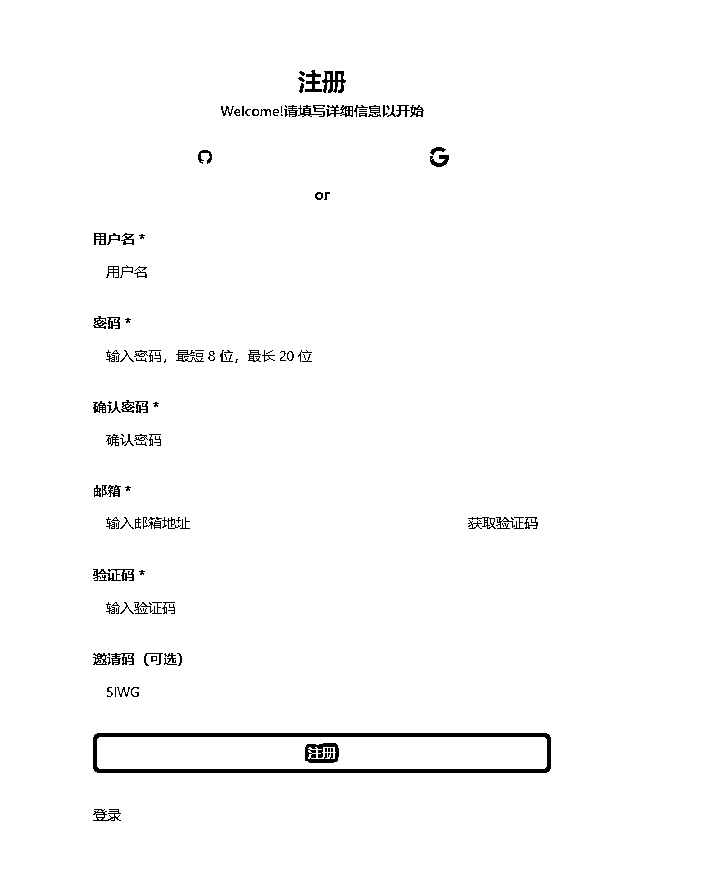
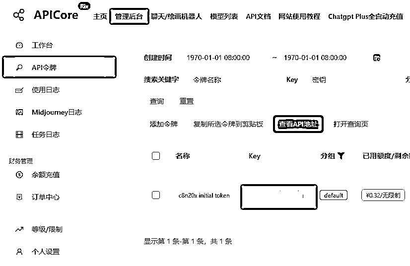
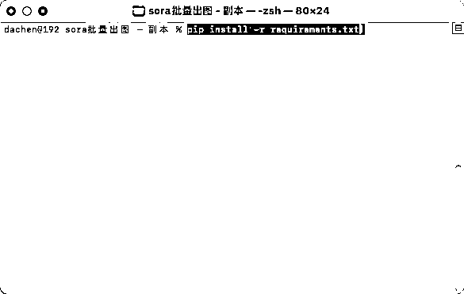
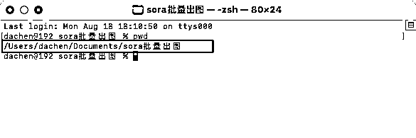
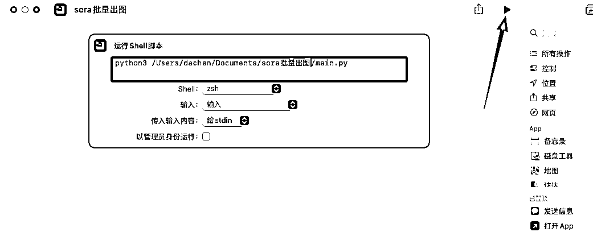
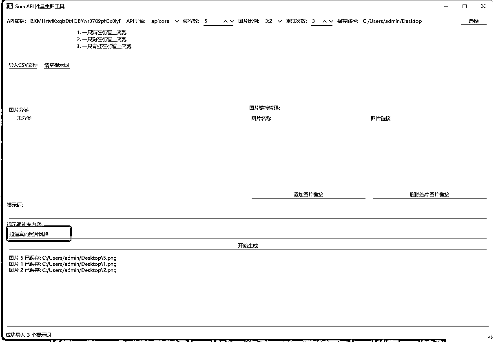
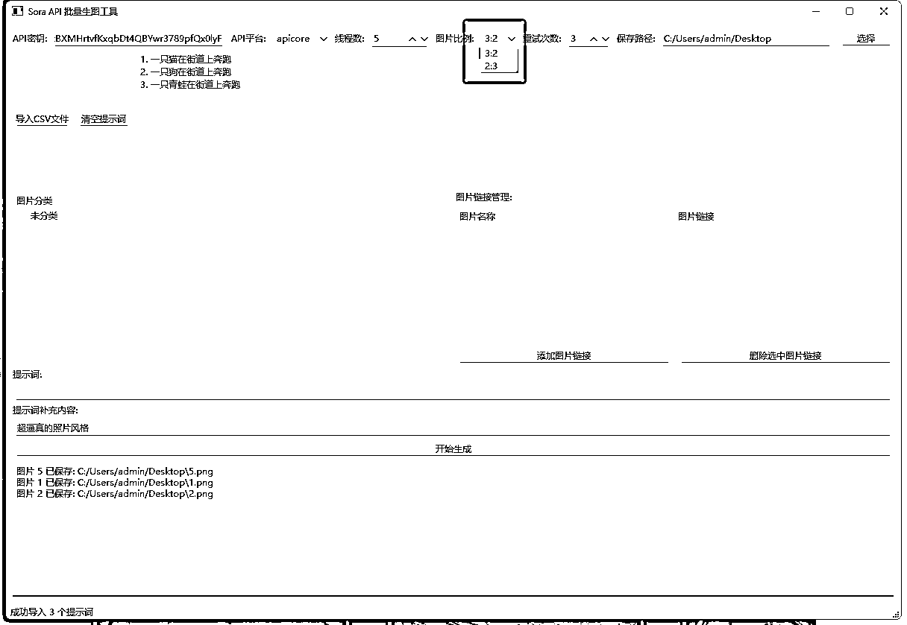
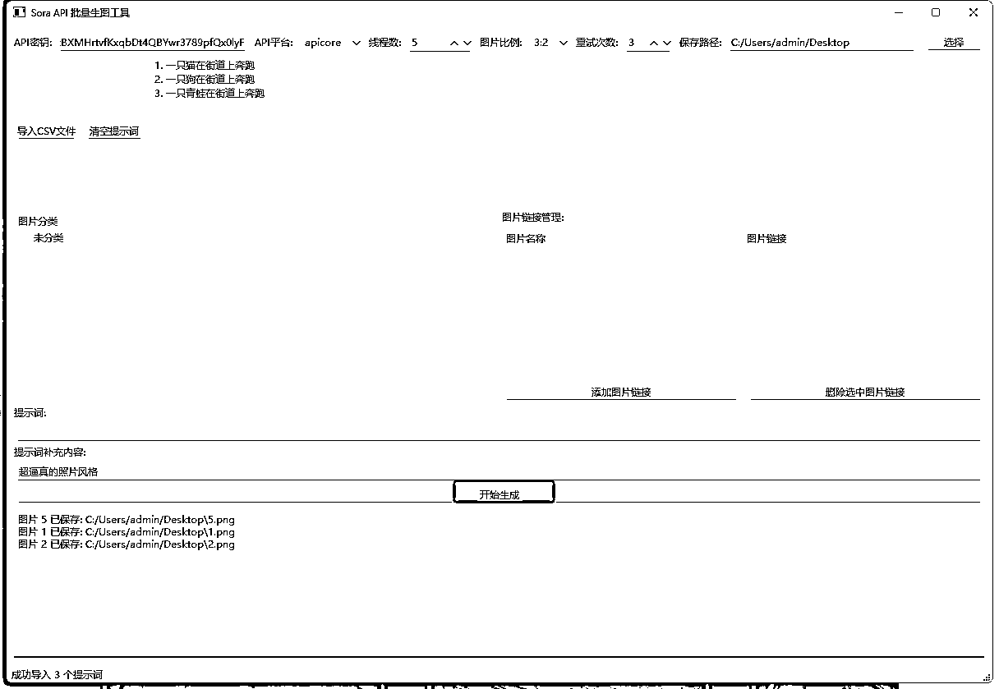

# Sora API 批量生图工具 V1.0 使用手册

> 来源：[https://wm1881zs6s.feishu.cn/docx/EVptdJgOPo9Phbx04uuc0l9EnFM](https://wm1881zs6s.feishu.cn/docx/EVptdJgOPo9Phbx04uuc0l9EnFM)

## 安装步骤

### 第一步：获取第三方API平台的密钥

脚本目前支持三个平台：

*   书虫大佬的（圈友）：https://api.apicore.ai/register?aff=5lWG (目前是2分钱一张图)

*   API易：https://api.apiyi.com/register/?aff_code=fkBK(目前是7分钱一张图)

*   云雾API：https://yunwu.zeabur.app/register?aff=9nEQ（目前是2分钱一张图）

这里就以书虫大佬的平台为例：

先进行注册，这一步就不演示了，填好自己的信息注册就行。

然后点击 管理后台 ——》 API令牌 ——》点击你的KEY就能直接复制了。

### 第二步：安装脚本

#### Windows系统

感谢@一泽圈友提供的打包程序，大家直接下载这个exe文件运行就行了。

#### Mac系统

##### 安装python

这一步请问AI如何在MAC上安装PYTHON

##### 下载脚本并安装环境

下载脚本源码，然后解压。

右击解压出来的脚步目录，然后选择【新建位于文件夹位置的终端标签页】

复制这条命令，粘贴到窗口中执行。pip install -r requirements.txt

执行完毕后，我教大家如何修改我的快捷指令，快速启动这个脚本。

在刚才执行命令的窗口中输入pwd，它会给你返回一个路径，复制这个路径，你们的和我的可能不一样。

然后通过下面的icloud共享链接导入我的快捷指令。

https://www.icloud.com/shortcuts/915b0670d80a40219ce1bf5beada3604

然后右击它选择编辑

把/main.py前面的路径都删掉，换成你刚才复制的路径就行了。注意python3以及它后面的空格不要删掉。

点击运行按钮就ok了。

#### 脚本基础配置

把刚才在API 易复制的KEY粘贴进去。API平台选apicore。

设置好保存路径，生成好的图片会直接保存在这个路径下面。

### 第三步：脚本功能介绍

#### 批量生图

这个脚本最核心的功能就是调用sora批量生图了，提示词的导入需要用到csv文档，文档的格式如下

他有两列：

*   分镜编号列：分镜的序号，同时也是保存图片的名称，比如编号5提示词生成的图片名词就是5.png。

*   分镜提示词：这里就写生图的提示词，一行一个。

导入CSV文件

导入成功了，这里会加载出写好的提示词。

这里可以填补充提示词，主要是用来控制画风，质量之类的，这里写的提示词会添加到每个分镜提示词背后，

选择图片比例，目前只支持【3:2】和【2:3】。

点击开始生成。

图片生成完成后，会在最下方提示。

图片会直接保存在你设置的目录下。

#### 单张生图

在提示词框里面写文生图提示词，然后点击生成就行了。

#### 参考图图生图

参考图图生图规则：

*   给API传参考图需要用图片的链接，而不是直接上传图片，这个需要用到图床。

*   脚本判断是否需要上传参考图是根据提示词里面的关键词来的，比如我有个图片名称叫做"木棍人"，而当提示词里面出现了"木棍人"这个词，那么木棍人的参考图的图片链接就会被上传。

就像下面这个例子。

参考图不能太多，最好控制在四张图以内(包括四张图)，这是我用sora测出来的经验，参考图太多了，生成的内容可能会混乱。

要上传参考图链接就得用图床，目前我用的下面这个网站：https://www.superbed.cn/signup?link=n911cjkc

注册好了之后，直接在主页上传图片。

上传好的图片，可以在"我的图片"中全部看到，点击"复制"就可以复制对应图片的地址。

然后点击"添加图片链接"

左边填图片名称，也就是脚本用来检测是否要上传参考图的关键词，右边填图片链接。

这里配置好之后，要批量生图还是单张生图按照前面的方法来就行了。

在图片分类框中右击，可以创建图片的分类，这样方便管理链接。