# n8n+fastgpt RAG = 王炸！！！用最强AI知识库MCP Server补全 n8n短板

> 来源：[https://ry6uq5vtyu.feishu.cn/docx/FW2IdwpcIoLEfUxyHPUc6JqKnig](https://ry6uq5vtyu.feishu.cn/docx/FW2IdwpcIoLEfUxyHPUc6JqKnig)

暑假要来了，我的教培业务也要开始进入旺季。小红书、公众号上都要开始做暑假相关的内容

但内容生产又成了老大难问题。怎么才能写出不空洞、有垂直业务经验的文章吸引目标客户呢？

答案是借助RAG：用行业经验文章形成知识库，每次写文章前都先到知识库搜一下相关内容，再基于这些内容来生产，能最大程度上解决AI幻觉、内容空间等问题。

昨天文章也提到，我所有业务工作流都放到了n8n里，但n8n并没有很好的知识库能力。

之前文章有讲到，目前最适合个人或者中小团队用的知识库是Fastgpt，而它最近升级的MCP Server能供外部工作流调用。

解决方案不就来了吗：把FastGPT上的知识库打包成MCP Server，供n8n在生产内容的时候调用。

目前效果是这样的：n8n里的AI Agent会通过MCP调用FastGPT里的知识库工作流。

## 一、Fastgpt MCP Server

FastGPT可以通过docker-compose的方式安装，但如果已经安装了，就需要升级到最新版，目前是4.9.11

https://github.com/labring/FastGPT/pkgs/container/fastgpt

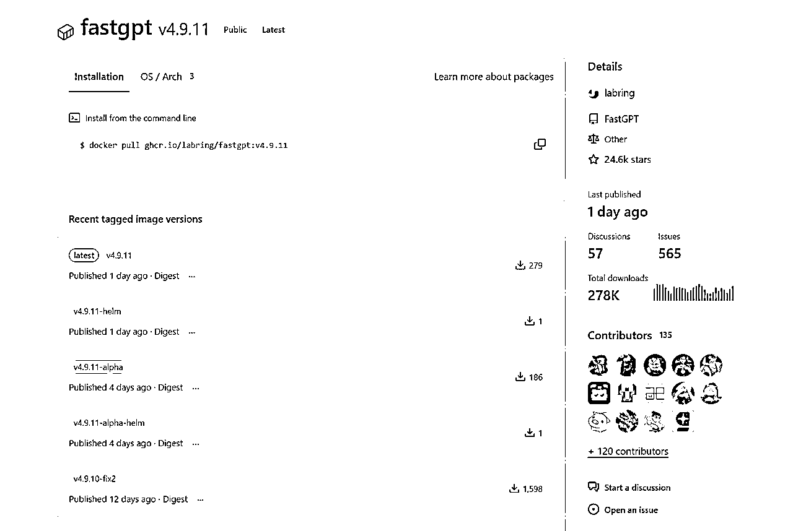

### 升级FastGPT

以宝塔面板为例，打开docker-容器编排

如图的位置就是docker-compose的内容，把它复制出来备份好。

进这里获得最新的docker-compose文件：

https://github.com/labring/FastGPT/blob/main/deploy/docker/docker-compose-pgvector.yml

如果还没安装的同学，直接用这个来安装即可。

这里可以用cursor来对比两个文件的差异，确保我们自定义的部分也同步到新的文件里。

例如我设置了默认root密码，这个在新的yml文件里也要设置。

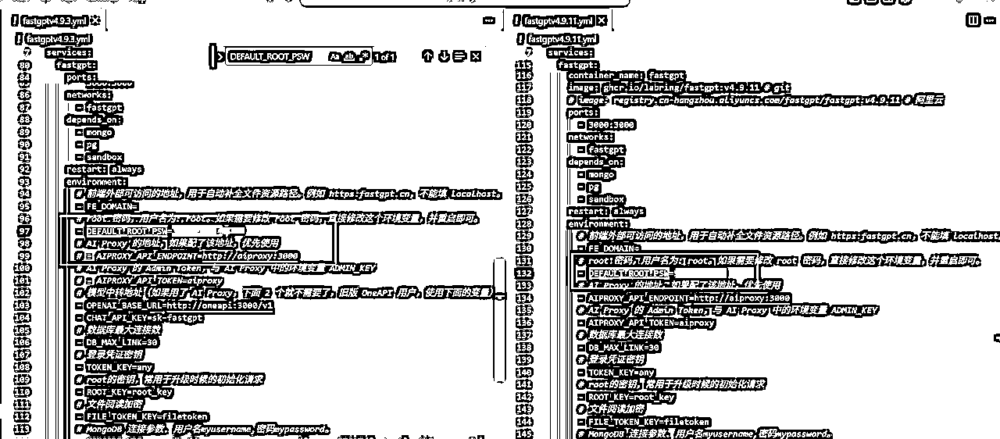

接着把改好的docker-compose文件复制黏贴进去如图位置。

再点「跳转目录」，接下来要设置config.json

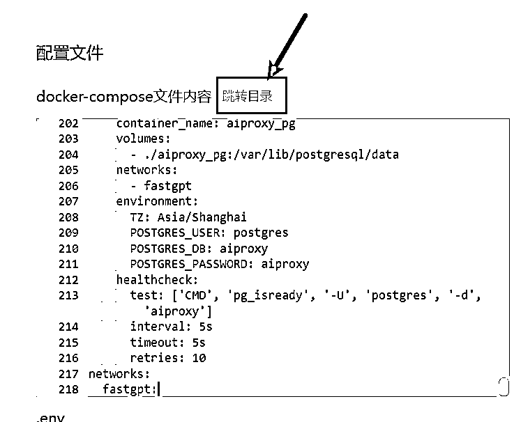

在这里下载：

https://raw.githubusercontent.com/labring/FastGPT/refs/heads/main/projects/app/data/config.json

修改图中mpcServerProxyEndpoint，改成你的ip，这是后面n8n工作流需要调用的地址

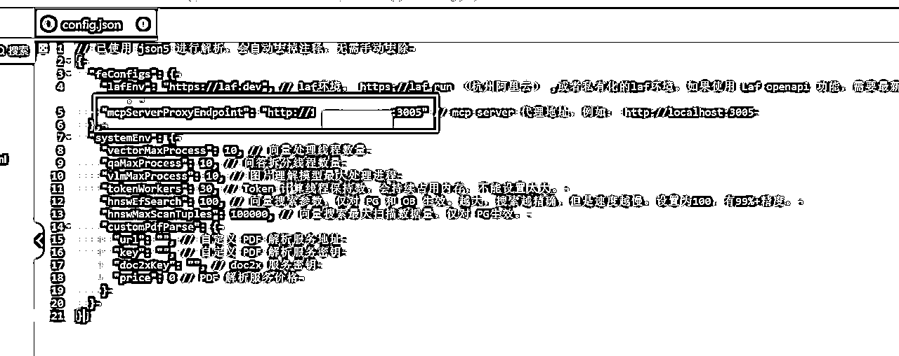

注意，这里暴露的是3005接口，要在宝塔面板添加相关的端口开放权限，确保外部能正常访问才行。

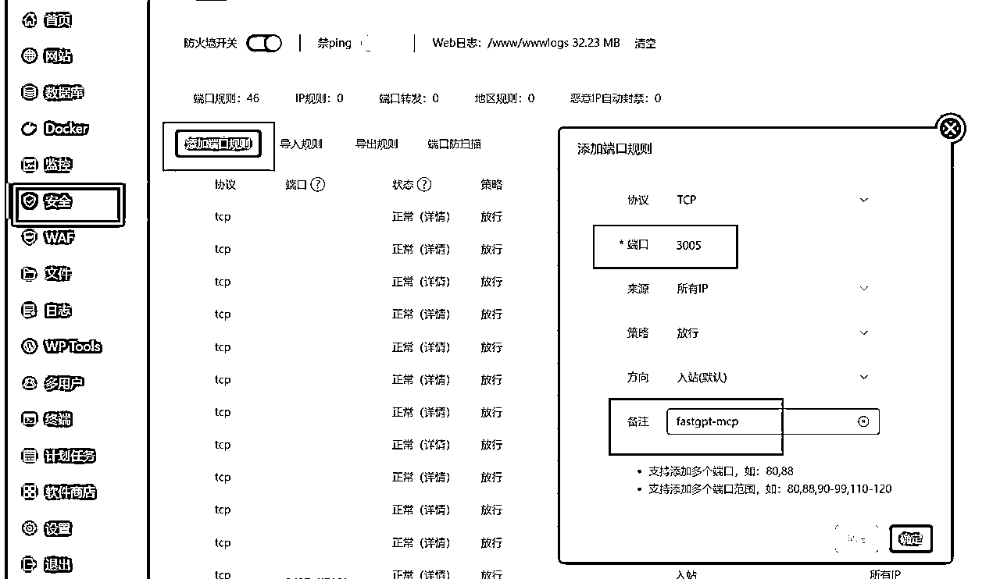

然后把修改好的config.json放到跟前面FastGPT的docker-compose文件同一个目录里。

也就是前面的「跳转目录」后打开的路径。

最后，回到docker面板点停止-更新镜像，即可。

此时打开Fastgpt，就能看到是最新版本了。

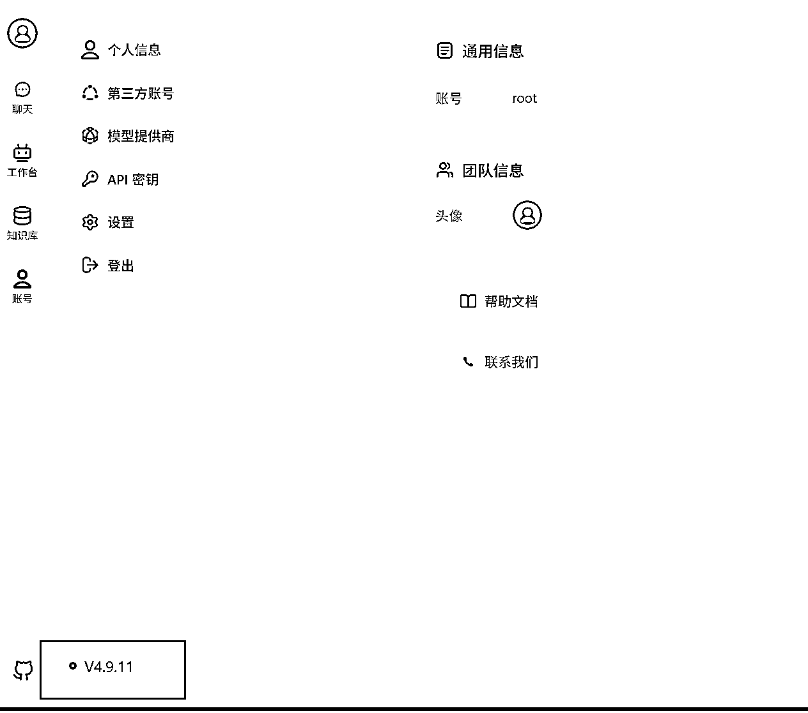

### 搭建知识库工作流

注意这里不能直接用知识库应用，否则会是经过AI处理后的结果。

我们要的是原汁原味知识库里匹配到的精准相关内容，就要通过工作流的形式把知识库引用返回。

如图：

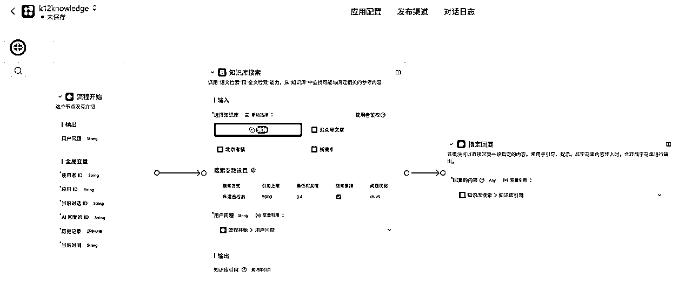

设置好后一定要点保存并发布，如果不发布的话亲测是返回不了结果的。

### 创建MCP服务

接下来，在工作台，点开MCP服务-新建服务

这里有一个要点：名字要是英文的，因为n8n是纯国外平台，加上AI大模型，本身对中文就不是很敏感，很容易调用失败。

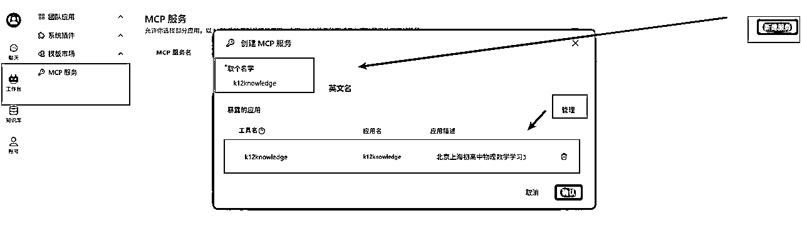

新建好后，点开始使用,切换到SSE

这里的接入地址就是我们要用的。

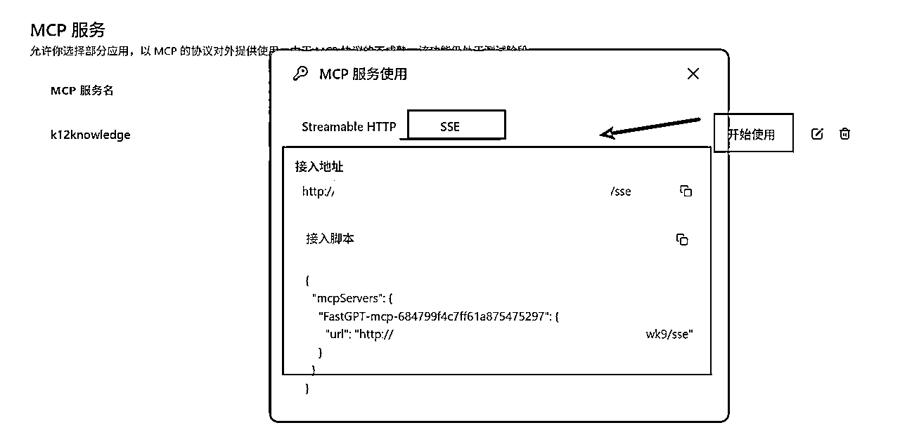

## 二、n8n工作流调用

此时回到n8n工作流

这是我的小红书模板工作流：先生成多个方向的选题标题，然后根据标题生成内容，后面再根据内容生成多张图片，最终全部保存到飞书多维表格，再调用矩阵工具读取飞书表格进行批量发布。

今天我们要解决的是生成正文这里，通过接入知识库作为参考让AI生成内容效果更佳。

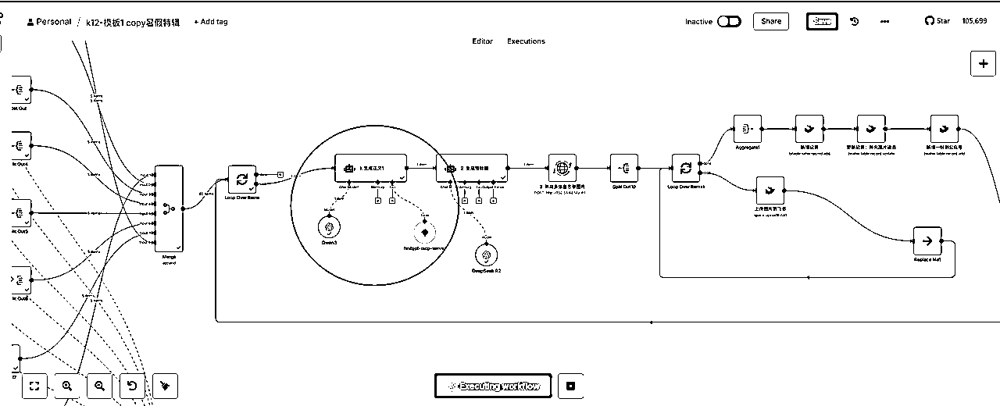

（预告一下，后面如何把内容批量生成图片的流程明天也会分享，欢迎关注催更。）

在AI Agent的Tool，搜索MCP，找到MCP Client Tool

同时要注意n8n的版本确保在1.94.1或以上才有MCP能力

接着，在SSE Endpoint输入前面在FastGPT准备好的调用网址。

点Execute step测试一下

随便输入一个内容标题

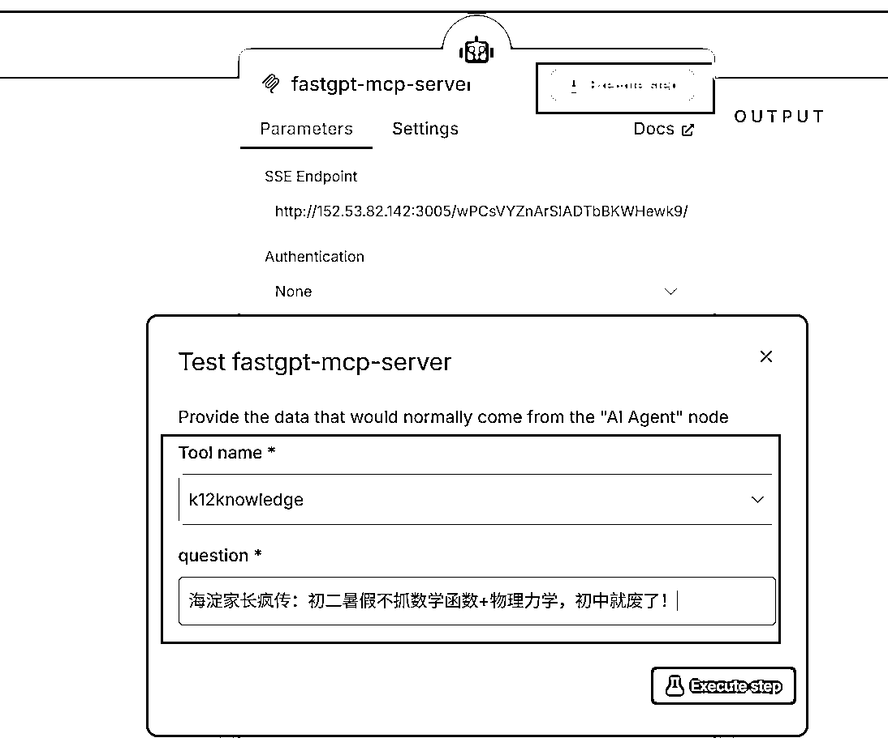

看到能正确返回内容了。

这里每个业务对于返回内容是否精准的判断都不同，所以我这里就隐去了。

具体返回效果如果，可以直接到FastGPT里处理好即可。

接着，回到AI Agent节点，测试大模型回答

注意这里的要点有两个：

1是大模型要有调工具的能力，这里我用的是魔塔社区里的API，Deepseek R1 0528虽然强但无工具调用能力，遗憾不能用。我用的是Qwen3-235B-A22B

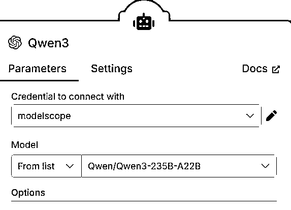

2是提示词中要明确让AI去掉用MCP工具来获取参考内容

除非把MCP名字和简介写的很好，跟当前内容匹配，否则大部分模型不会主动去调用的。

最后我们能正常看到大模型有调用mcp即可。

至此我们就把FastGPT通过MCP Server的形式整合到了n8n工作流里面。

原本就好用的n8n，补全了它知识库短板，又全面了。。

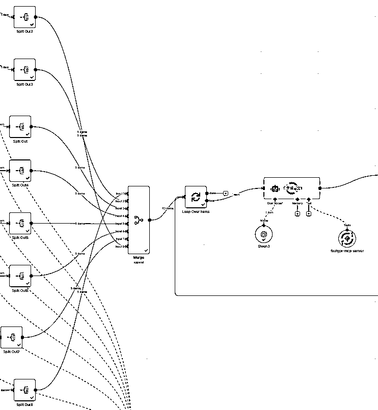