# 7天时间，一个编程小白的海外AI产品 0-1上线复盘

> 来源：[https://yneq2bf840.feishu.cn/docx/G7wHdEXU9oDNx9xc6YocWiejnAe](https://yneq2bf840.feishu.cn/docx/G7wHdEXU9oDNx9xc6YocWiejnAe)

# 一、复盘帖概述

先把网站放上来，欢迎大家提供各种意见建议，https://www.babypodcast.pro/，功能是输入宝宝的风格选项和博客话题来生成一个宝宝形象的反差感博客视频。

完整开发时间：5.18-5.24，刚好完整的一周时间，从一个一行代码都看不懂的小白到可以在一周内开发一个完整的Micro SaaS MVP总共也就2个月的时间，我在这段时间做了什么呢，这个项目的0-1开发过程是怎么样的，下面是一个完整的复盘帖，供和我一样的小白参考。

涉及了所有的技术环节的实现，开发过程中踩的一些坑和一些简单的心路历程。

网站主要技术实现方式如下：

```
*   **前端**: Next.js
*   **部署**: Vercel
*   **数据库**: supabase
*   **登录/注册**: supabase-Email/Google
*   **后端**:
    *   n8n (cloud)
    *   文字API: gpt4.1
    *   音频API: Murf AI
    *   图片API: flux.1.1-pro
    *   视频API: Hedra
*   **云存储**: Cloudflare r2
*   **支付**: creem
```

# 二、自我介绍

我之前从事投资行业，今年2月份看到了AI领域的机会，果断辞职，但是这么多细分领域做哪个呢，做过一些AI写作，AI自媒体的内容，但始终感觉没有特别摸到门路，不是我想象中的ideal direction，直到3月份参与了生财的航海，才让我对方向坚定了下来。

之前做tob投资的时候，尽调过国内几家比较知名的大模型公司，但是脱离了平台总感觉大模型离普通人很远，最近才慢慢了解到AI应用对普通人的巨大机会，刘小排老师在海外AI产品深海圈航海手册里面的一句话我认为非常正确。

“有人说，所有的产品，都可以用 AI 重新做一遍，我深以为然”。而且在AI编程工具的快速发展下，普通人自己独立完成AI产品越来越容易了。

之后3-5月份我断断续续做了5、6个网站，但就是简单的重复，基本都是html格式的游戏站和个人博客这种类型，完全和我想象中产品的形态大相径庭，看到生财SCAI实验室的招募通知我果断报名加入进来，事实也证明我这个选择无比的正确。

附1： （这是我来到杭州SCAI实验室后的每日复盘，大家可以结合这个一起阅读）

# 三、项目开发过程复盘

## 3.1、项目背景与开发目标

### 项目背景：为什么想做这个AI baby podcast

那天周六的下午刷到了一篇公众号文章介绍了海外Tiktok和YouTube上这种形式的视频特别的火，稍微研究了下发现是一家叫做Hedra公司策划的营销事件，然后爆火海外社媒，而这家公司刚好提供API，我当时判断这是一个大趋势下的小机会，可以尝试

同时呢，我当时也没有做过0-1的产品经验，所以希望通过做这个项目完善0-1的开发经验，包括数据库，登录/注册，积分体系，支付，完整后端功能等，因此也希望通过这个练手项目开发自己的第一个Micro SaaS

（PS：后来才发现良辰美老师在周六上午生财的风向标就发过这个内容了，所以还是要多刷生财风向标，项目趋势信息普遍是领先外界公开信息的）

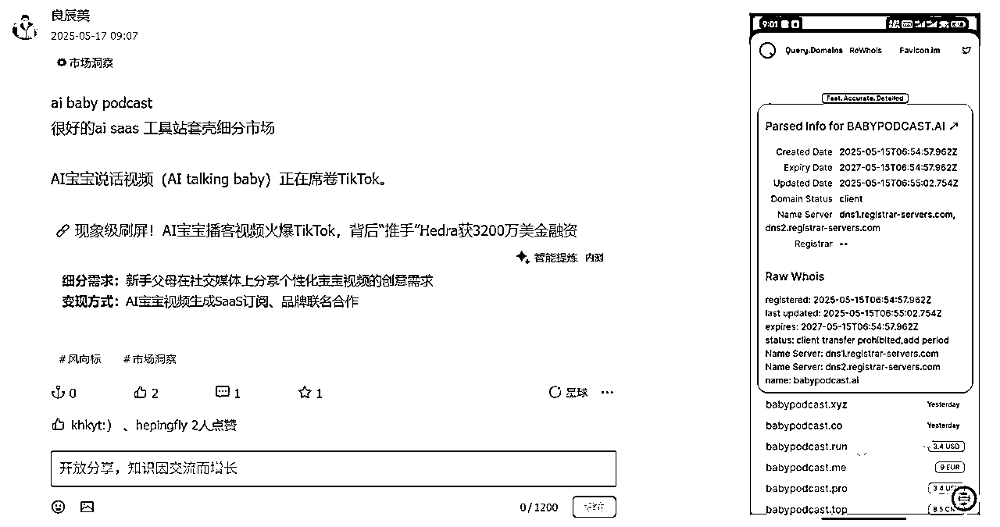

### 开发目标：3天完成前后端，快速上线，然后一周内接入支付和登录/注册

时间上，上面两个目标都完成了，但是过程比我预想的要困难的多，下面一一介绍我的开发过程和踩的一些坑

## 3.2、技术开发复盘

### 3.2.1 前端开发：Next.js

这块相对简单，我之前用next.js做了生财SCAI的面试题，我这次就参考之前的样式设计更改了一下，大家也可以采用小排老师课程里的bolt/v0等，我直接用Cursor帮我生成的，提示词大概如下：按照目标网站（这里直接放目标网站的url即可）的样式设计和如下结构帮我生成首页，需要包括Header、Hero、Features、WhatIs、HowTo、Why、Pricing、FAQ、Footer结构

然后告诉AI我想要开发的项目名字是什么，主要是什么功能，让它帮你修改各部分的内容，之后自己微调一遍就差不多了

这个目标网站大家可以找各种自己觉得样式结构比较清晰的网站去参考，后续UI可以再慢慢改，先把结构和基础样式做出来

下面我列出来我目前主要的项目组件，除了首页的还有后续功能页的，后续通过不同页面的page.tsx去引用这些组件，结构会很清楚

后面dashboard页我直接抄的Medeo的样式，稍微改了改颜色，这部分大家完全也可以这样参考一些优秀案例快速先把页面和功能做出来，再慢慢去调整（使用一些模板也可以）

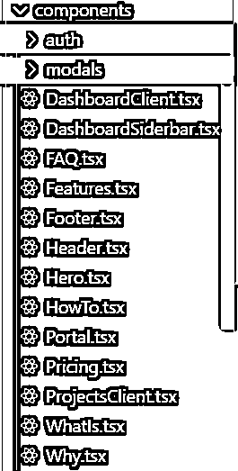


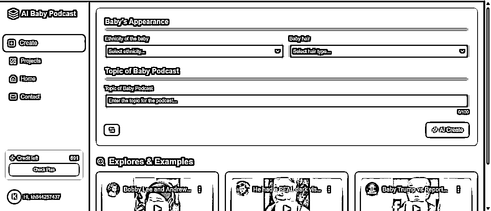

代码中主要的内容除了这样.tsx的剩下就是涉及函数和API的.ts（还有css文件），小排老师航海手册里面说要了解AI写的每一行代码是什么意思，我觉得对小白来说学习成本可能有点高，这是一个进阶的要求，我觉得在开发初期你只要搞清楚src文件夹下每一个文件是什么内容，起到什么作用，在我的前端页面的哪个部分发生交互逻辑就可以了

### 3.2.2 后端开发：n8n

#### 为什么选择n8n？

n8n是一个类似coze和dify的自动化工具，我之前是想直接使用next.js的API路由去调用外部API的，但是部署在Vercel上的API最大响应时间是有限制的，生成视频的话API响应时间是远大于免费版的最大响应时间的，我当时对于这种间断式的API路由触发和API路由响应接受还不太了解，再加上功能比较复杂，我就想着能不能想用自动化的工作流工具先搞个MVP出来，于是发现了n8n

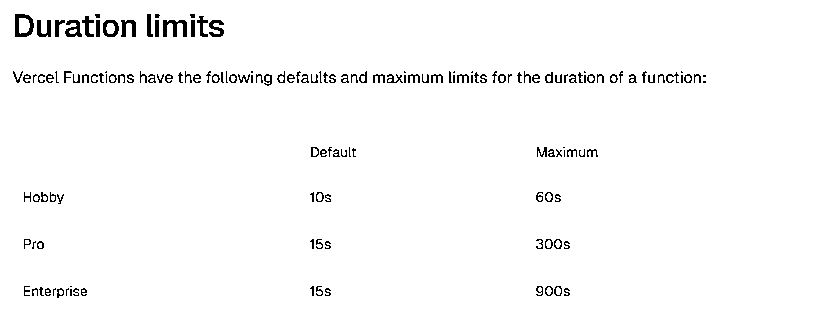

附2：Vercel官方文档

https://vercel.com/docs/functions/configuring-functions/duration

正好在YouTube上搜索时发现了一个n8n生成AI babypodcast的视频，得来全不费工夫，第二天就照着复刻出来一个工作流MVP版本，原视频大概43分钟，我复刻花了大概2-3个小时，涉及到很多官方文档这老哥没放全我就一点点去补全，大家如果想复刻一遍有什么信息不了解的话可以来找我（PS：这老哥就是通过这种视频引流它的skool，$77 /month，大概有960 members，由此也可见老外的知识付费意愿是很强的）


附3：YouTube n8n生成AIbabypodcast视频

https://www.youtube.com/watch?v=syoM1CVV1-c&t=2468s

#### 我的n8n工作流概览


思路和逻辑大概参考的上面那个视频，然后做了一定程度的微调，让它更加适配做一个工具，比如全程传递一个jobid去验证最初的请求和最后的成果是否匹配，加入duration来计算后续的积分等，后续应该会继续使用n8n丰富功能，使用自动化工作流对于新手构建后端功能我觉得非常易于理解和便于上手。（PS：n8n赠送新人14天免费版，可以进行1000条工作流执行，后续的话大概$24/month，新手用免费版2周进行开发和测试完全足够了）

整体n8n工作流的思路是：最开始webhook接受一个trigger，然后工作流触发开始运行，最终发送向我们前端的API路由发送一个http request，从中获取我们需要的信息填入Supabase数据库并在前端展示（我这个部分就包括一个唯一的任务认证id用于关联user和project，视频持续时间用于定价，视频链接用于前端返回视频给用户展示）

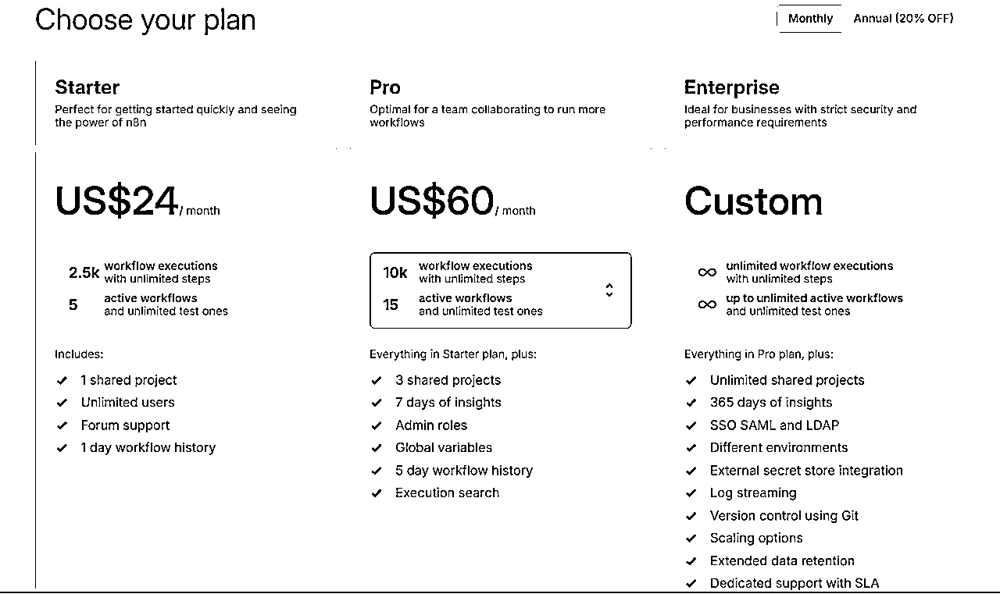

#### 调用了哪些API

这部分工作流我调用了文字、图片、音频、视频4个API，在n8n中整个流程很丝滑，按照n8n里面对应的header和body以及对应的API官方文档去填参数构建请求体即可，如果设置不对的地方直接截图问AI，或者让它帮你写一段标准的json格式请求体，然后n8n支持前置的参数作为后续变量传递给下一个节点，整体开发效率非常高。

下面放一下我平常常用的API平台，openrouter、replicate、fal.ai、rapid、V-API、麻雀API，大部分小排老师在课程里面的都写过了，后面两个是中文的API平台，优点就是便宜，缺点是支持的模型少（美元人民币兑换1：2甚至1：0.6），大家可以自行选择，然后音频和视频我都直接使用的官方API接口，整体用了4个API接口，算是稍微复杂一点的工作流程了。

当你把这个过程跑通，你会发现一片广阔的天地对你展开，比如生成图片API会调用了，AI换脸的呢，图片修复的呢，图片去水印的呢，声音生成的会调用了，声音克隆的呢，数字人的呢，而且API调用熟练之后后续你的登录注册、接入支付和云储存过程也都大同小异，本质就是不同的API接口，发送不同的数据请求和对应的key。

### 3.2.3 登录注册

登录注册我直接用的Supabase，小排老师的课程里面介绍的非常详细了，谷歌登录是一定要开的，因为老外基本都在用这个，邮箱的话会增加用户验证再跳转页面的时间成本。

简单说说我踩的坑，一个是我让cursor帮我加这部分功能它会用一个过期的包而非官方现在推荐的@supabase/supabase-js，你如果直接找到了官方文档这个错误是可以避免的，里面很清楚的写了下载什么包以及下载方式；一个是客户端和服务器端的函数调用同步和异步运行问题，这个比较简单，让你函数调用的步骤和创建对应端口时候的要求统一即可。

我比较推荐新手的一个写代码方式是每加一个新功能一定要先找到官方的文档，然后直接喂给Cursor，让它按照官方文档和你的项目结构去建立一个说明文档，把所有的步骤，示例代码和每一步的作用都明确的写出来，比如login.md/payment.md等等，之后让AI一步步去完成，反复问它你是不是按照官方文档和参考文档去实现的，如果出错了便于你排查和复盘

附4：Supabase登录注册官方指导文档

https://supabase.com/docs/guides/auth/server-side/nextjs

### 3.2.4 数据库

这部分我都是直接让Cursor给我写好Sql语句，我直接去supabase里面去粘贴运行就好了，但是它写的每一个函数你都要非常清楚是什么意思，起到什么作用，反复问它让它给你解释清楚了，这部分我基本没动手写一行代码，但是基本每个表的大概意思我都是清楚的，里面有一些重复的表暂时不影响功能的我还没删，最后之后统一处理一遍

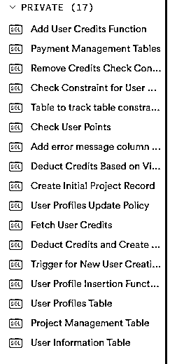

有一个坑是每个表的RLS（Row Level Security ，行级别安全）要设置清楚， 简单来说就是你允许谁对你的这个表进行什么操作，需要验证什么令牌，这个部分最好自己让AI解释给你理解透了再让它去设置，AI一遍自己生成的我自己亲测都会有点问题，尤其是涉及insert和update的最好设置成验证你的服务端身份再允许操作

### 3.2.5 云存储

这部分比较简单，直接使用Cloudflare r2，免费的10gb足够绝大多数起步阶段的项目了，附一个之前web航海里推荐的独立开发者穷鬼套餐，至于为啥用它我没去研究过，大家都说好用我觉得就属于共识了，在你没有更多需求的情况下用就完了

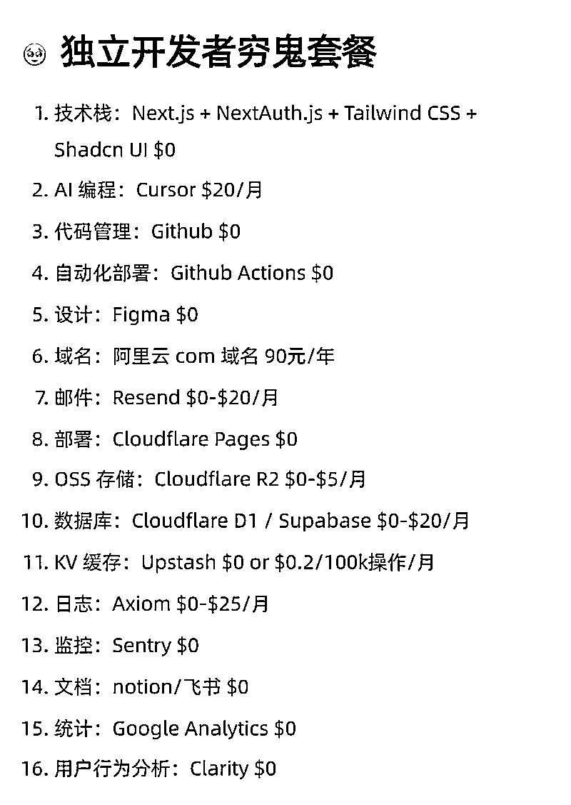

### 3.2.6 支付接入

#### 最终选择：Creem

尝试了Creem、Paddle、Paypal，Creem审核成功通过，Paddle因为涉及AI图片的内容可能被拒掉了，Paypal还在审核过程中（我名下有个小公司，个人的话按照小排老师课程用前两个即可），Stripe个人版我申请港澳通行证需要20天，公司版需要1000+成本，所以最后先使用Creem

关于Creem的一些坑，测试模式和正式版的产品id/API端口/API key均不相同，测试后需要记得更换。我直接使用官方文档中请求重定向发送success url，请求成功通过API路由直接在用户的浏览器重定向return url然后进行签名信息认证的方式，直接在用户浏览器上重定向跳转回我们设置的界面，这样在开发层面比较省时间。

同样这部分也让Cursor给你一个step by step的执行步骤，你让它给你生成文档可以用来后续追踪每一步完成的程度和并进行错误定位。


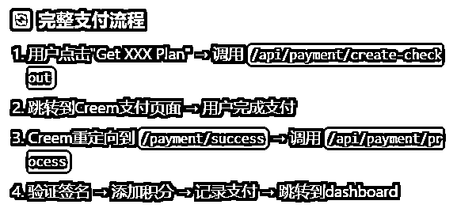

附5：Creem官方文档

https://docs.creem.io/checkout-flow

#### 最优选择：Stripe

Stripe的话两种路径：个人申请和公司申请

个人申请建议去香港办一张港卡来申请

公司申请有注册公司有英国和美国两条路径，需要1000-2000的成本（英国公司大概1200-1500，美国公司大概2100+，后续每年还有约400美元注册代理和税费）

开通Stripe之前我也找了很多内容去研究，后来发现最快最便宜的方法就在生财的经验贴和小排老师的课程里，公司版均不需要出大陆，完全可以线上办理（当然去趟香港有港卡是最推荐的）

附6：

附7：

附8：https://mp.weixin.qq.com/s/y_XRFa8pzkgV-GqttSotqw（艾逗笔大佬的经验贴）

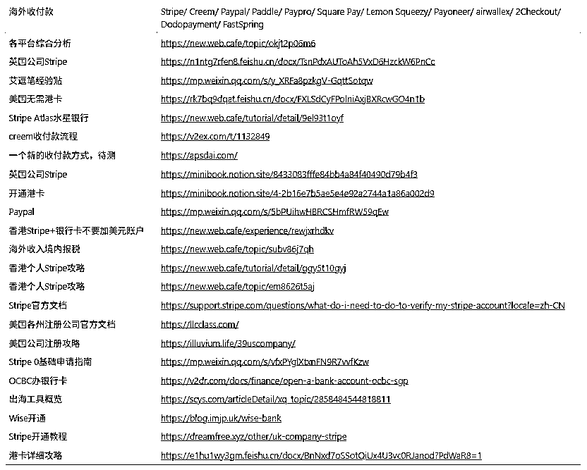

### 3.2.7 一些其他的坑&经验

#### API Key

所有API的key都要好好保存，千万不要遗漏，一般我除了env.local存一遍，Vercel部署一遍，还会在自己的文档存一遍，需要的时候找也方便

还有个小坑就是所有API key的都要参考官方的请求文档看看它有没有特定的构造和要求，我之前犯了一个很愚蠢的错误就是本地测试成功后，在Vercel部署时环境变量的“-”和“_”没有分清，可能是熬太晚了神智不清了，排查了4-5个小时找了各种原因无果后，才发现是一个简单的拼写错误，真的很无奈了可以说，尽量多去检查不要浪费时间在这种微小错误上

#### Git

我认识到这个问题的重要性后，去找了个视频尝试学习，后来发现学习成本略高，对于新手小白来说我认为使用Github desktop配合Cursor的restore checkpoint完全可以满足你初期的使用需求。

*   你在Cursor内开发乱了的直接restore checkpoint，仅能在现有文件内把代码修改复原

*   如果你大修之后越改越乱，Cursor restore checkpoint也不好使（一般涉及到新文件建立和旧文件删除，以及依赖环境变动），想回到最开始的版本，直接在Github desktop内discard changes，直接全部回到你上一次存储的本地版本

*   想要回到之前存储的的版本，直接从Github desktop找到对应的版本描述和哈希值（见下图）直接让cursor帮你还原版本即可，本地就能快速回到之前的版本

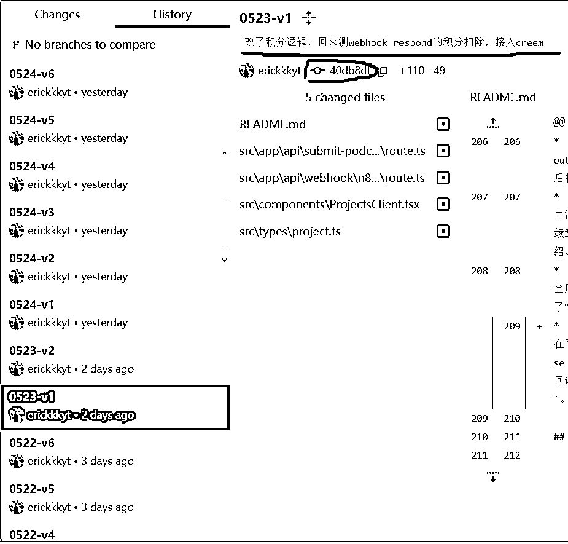

#### 产品一定要把功能跑通再上线

在没接入支付之前我就把产品上线了，但是那天肝太晚了，本地测试成功就直接传上去睡觉了，第二天起来发现n8n工作流里面的回调url没改，然后那天进了7个用户，看clarity全部用不了，纷纷退出去了，悔不当初，之后功能完善了赶紧给他们发邮件赠积分希望能挽回一下子，截止现在好像还没挽回回来...

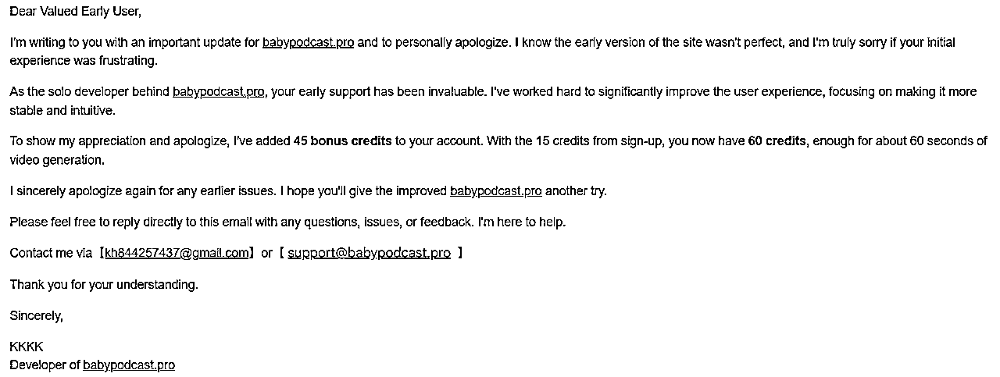

#### 用户一定要用心维护

产品在PH被feature当天，网站进了一大波流量，然后促成了我的第一个付费用户转化，99刀的月订阅，是个日本做Tiktok工作室的用户，给我发邮件说订阅了最高级别的希望我帮助他定制化功能，然后后续为了维护他方便沟通，我连夜买了张Giffgaff的电话卡开了Telegram去维护他（中国电话号无法注册Telegram），基本后续按照他的需求每天会更新一个小功能。

我去复盘很多海外知名产品比如notion，最近新兴的AI产品比如flowith，可以发现他们的社区和用户维护都做的很好，无论是在网站内部建立社区还是建立Discord，用户的沟通和维护可以说都是产品的生命线，那些早期用户给到的建议和反馈对于一个初期的产品是至关重要的。

#### 关于Coding LLM的选择

我自己体验下来做大项目很多文件构建的场景，Claude-3.7/4 sonnet效果很好，然后对于指定环节的debug gemini-2.5-pro效果很不错，这两个是我主力使用的模型。

然后与AI交流讨论的话我是使用gemini-2.5-pro为主，配合使用o3，我觉得这两个模型的思考能力真的很强，给出的建议逻辑都非常顺，数据和步骤很详实，非常适合讨论与学习

另外说一个我的个人小tip，我想同时修改项目不同环节时会选择Cursor和Trae双开，比如Cursor帮我接入支付体系的时候，我会用Trae帮我微调一些首页的文字或者构图样式。

但这样比较容易出错，建议对项目文件结构比较了解后再尝试此方法，我一般会限定Trae只调整我指定的组件，然后布置的也都是很简单的任务比如把列表框从左边移到右边，文字多换行，标题加粗等等这种简单交互，可以一定程度提高效率，但是慎用慎用，Trae的使用体验还是比Cursor差太多了。

# 四、心态&感悟

#### 心态调整

新人从0-1学习技术是一个磨心态的事情，哪怕有AI的辅助也会存在大量的问题，这个时候我们需要的不是爆发式的信心和超高的预期，而是细水长流、长期持久稳定的努力和每天进步一点点的决心，每天获得一点微小的正反馈来激励自己，从头做产品的反馈肯定不会那么快，你要意识到这是一条艰难但正确的路，摘录刘小排老师精华帖里的一句话。

“获胜的诀窍是要做到情绪稳定，打无记忆的牌。

有人因为连续输了几把冤家牌，就变得情绪急躁。还有人以为连续赢了几把，手变得松，不把筹码当成筹码了，这都是业余玩家最常见的错误。

你改变不了已经发生过的事，无论是好是坏。你也改变不了这一次你拿到的手牌，无论是好是坏。我们唯一能决定的，就是把忘记过去，不怨天尤人，把当前这手牌打到最好。”

之前我打德州的经验跟这个一样，我从来不会羡慕tan xuan，毒王这种手很凶，经常冤家牌河杀/偷鸡的选手，从大数据样本下，他们的胜率和收益率往往是同水平中倒数的，注意是同水平！

国内的传统教育体制让我适应了通过短平快的爆发式学习就可以取得还不错的成绩，熬一两个大夜基本能解决绝大多数校园和工作带来的问题。

但当你出来自己做事情的时候我真的感觉到学无止境，这是一条漫长的旅程，一时的快与慢真的不重要，重要的是千万别下牌桌。流水不争先，争的是滔滔不绝。

#### 如何看待成功

之前我做投资时尽调过很多厉害的创始人，跟很多上市公司的高管也接触过，我发现绝大多数取得世俗意义成功的人都是对自己现在做的事情坚定不移的人。

我个人定义的成功公式：一个正确的赛道+一些突出的能力+坚韧不拔的心态+持之以恒的努力，满足任意三点基本能取得还不错的成果，四点都满足的人基本都是各个领域赛道的大佬。

对于绝大多数像我一样的普通人来说，第二点需要很多东西积累，时间/经验/失败/刻意练习等等，或者是纯天赋，但是1/3/4是绝大多数人都可以自主选择的。

3/4就不展开了，生财里非常多大佬的经验贴都在说这类内容。

说说1如何选择一个正确的赛道，我觉得个人选行业一个很重要的逻辑，顺势而为。人不能和趋势对抗，之前跟着移动互联网，跟着淘宝，跟着抖音发展的基本都拿到了不错的结果。

22年底ChatGPT刚出来我就了解到了，23年我之前的公司调研了智谱/百川/月之暗面/面壁等等当时很火热的国内大模型公司以及当时零星的几家AI应用公司，得出的结论是国内AI应用还需要时间沉淀，还需要基础大模型能力发展，大模型公司的投资range又不在我们范围里，因此错过了很多机会。

当时我还无法判断AI未来到底是不是大趋势，但仅仅过去两年多的时间，世界发生了翻天覆的变化。现在国外OpenAI/Google/微软，国内字节/腾讯/阿里这些大厂在基础大模型层面投入了巨大的人力、物力和财力，你不需要再去判断这是不是未来趋势了，世界上最聪明的一波人已经“用脚投票了”，我们跟着走就好了，把用脑判断的时间交给用手去实践。

生财是我觉得国内做AI最落地的地方，没有很高的门槛，没有高大上的概念，就是踏踏实实引导普通人融入这个浪潮，这一点尤为珍贵，AI不应该是一个普通人可望而不可即的概念，应该是我们生活中触手可及的存在。也欢迎大家都来申请后续的SCAI实验室。


（PS：附一张雷总的签名照，大家也要“顺势而为”）

# 五、后续规划

#### 产品逻辑方面

回到我当下这个产品，其实我这个产品的思路和逻辑是完全倒置的，我在前期基本没有做竞品调研和需求确认就一股脑先把产品研发出来了，还是需要遵循一个完整的产品研发逻辑，找到需求→验证需求→开发MVP→用户反馈→找到PMF，找到需求和验证需求的路还需要我再去重头走一遍

#### 后续开发方面

当完成了上述需求确认后，这个产品我希望多加一些功能去尝试更多复杂的功能实现，比如face swap和voice cloning，也尝试下不同开源项目的使用。

关于现在网站的性能还有很多要优化的点，比如多语言支持，SEO结构优化，关键词建设等等。

#### 产品营销方面

之前对于SEO和社媒营销这些东西我属于仅了解没实践过，这个产品我也会把它用作实践产品营销的测试工具，过一段时间有成效了我还会来继续分享

大家有各种问题欢迎在评论区探讨或者直接来问我，知无不言。

本文附件一览

附1：

附2：Vercel官方文档

https://vercel.com/docs/functions/configuring-functions/duration

附3：YouTube n8n生成AIbabypodcast视频

https://www.youtube.com/watch?v=syoM1CVV1-c&t=2468s

附4：Supabase登录注册官方指导文档

https://supabase.com/docs/guides/auth/server-side/nextjs

附5：Creem官方文档

https://docs.creem.io/checkout-flow

附6：

附7：

附8：艾逗笔大佬的海外收款经验贴

https://mp.weixin.qq.com/s/y_XRFa8pzkgV-GqttSotqw