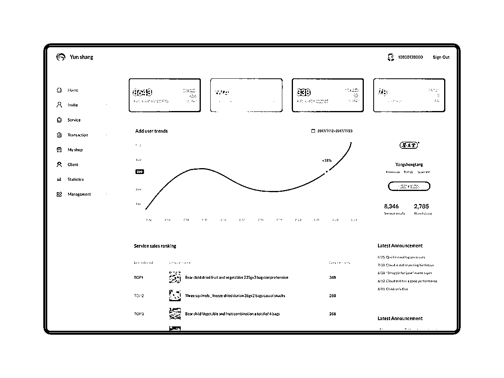
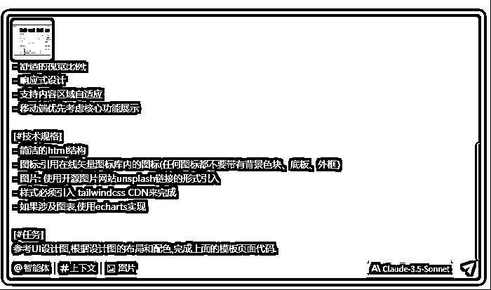
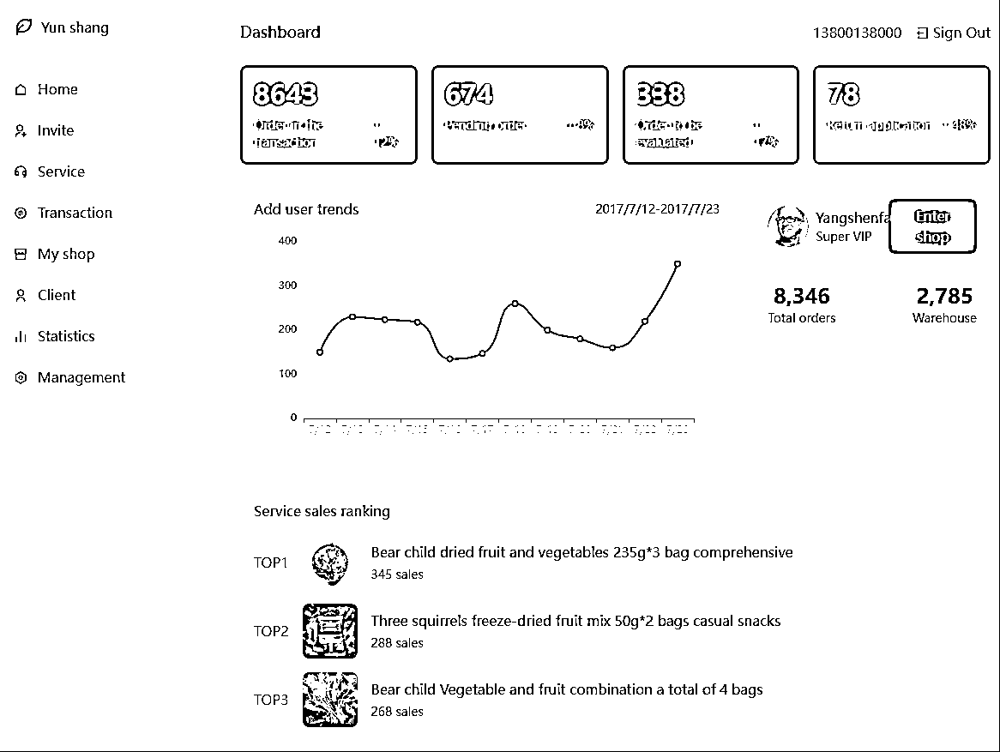
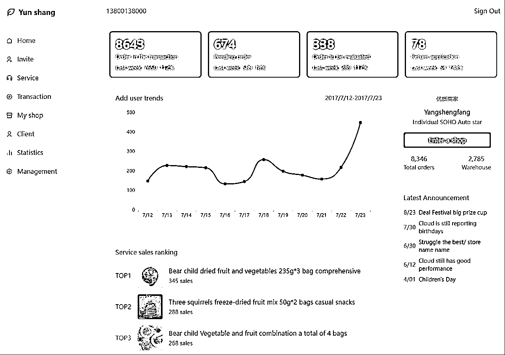
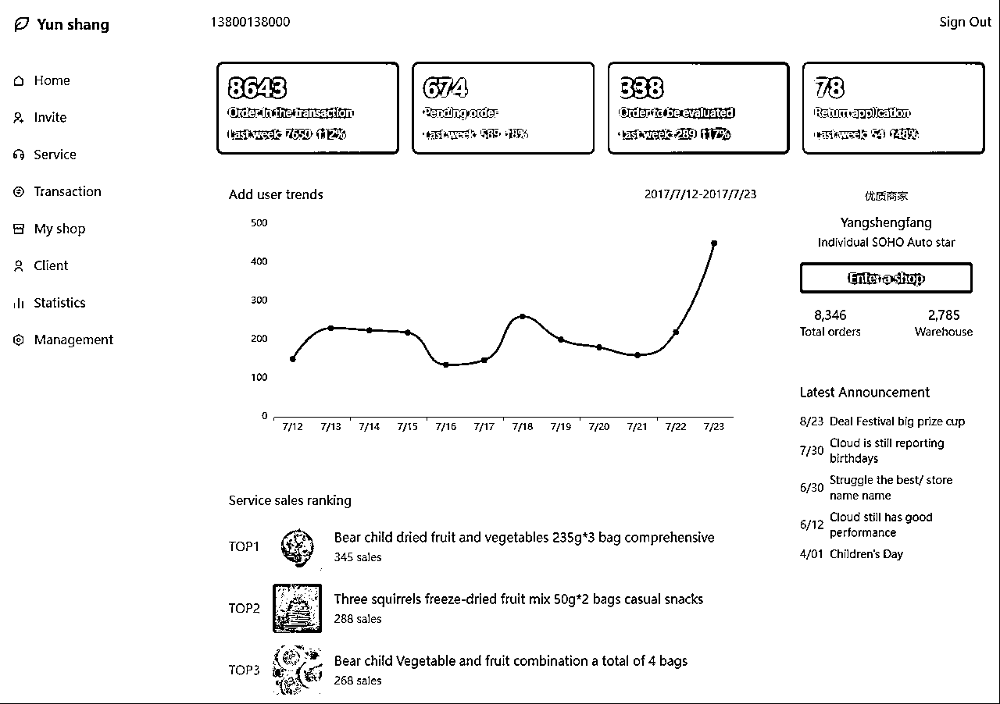

# AI怎么通过参考图生成UI,UI规则复用指令

> 来源：[https://fi9q1sf4gu.feishu.cn/docx/GYksdakjQoTGtlxnxiOcLA39nzh](https://fi9q1sf4gu.feishu.cn/docx/GYksdakjQoTGtlxnxiOcLA39nzh)

网上有很多通过cursor,trae之类的AI编辑器生成UI的教程,这边介绍一下我的一些经验，如何让AI生成的UI的时候,更加的可控．

## 参考图



我从网上找了一个后台的设计图,我希望使用同样的风格和布局,我会这么操作.

# 让AI根据参考图生成html

## 指令1.0

```
你是一位资深前端开发工程师,UI/UX设计师。

你的任务是生成一个SASS UI模板页面.

[#设计风格]

- 优雅的极简主义美学与功能的完美平衡;

- 恰到好处的留白设计;

- 细腻的微交互;

- 舒适的视觉比例;

- 响应式设计

- 支持内容区域自适应

- 移动端优先考虑核心功能展示

[#技术规格]

- 简洁的html结构

- 图标:引用在线矢量图标库内的图标(任何图标都不要带有背景色块、底板、外框）

- 图片: 使用开源图片网站unsplash链接的形式引入

- 样式必须引入 tailwindcss CDN来完成

- 如果涉及图表,使用echarts实现

[#任务]
参考UI设计图,根据设计图的布局和配色,完成上面的模板页面代码.
```

这个指令最重要的是技术规格,规范了图标,图片,样式,图表的规则.

需要把设计图上传,让AI参考设计图进行代码生成.没有图像理解能力的大模型是不可用的,需要选择claude,Gemini,GPT的大模型,我测试出来复刻UI效果最好的是claude-3.5 sonnect



效果:



可以看到,效果已经很不错了,但是在主体内容布局上还是有出入.所以我会在指令上加上页面布局的提示词.

## 指令2.0

```
你是一位资深前端开发工程师,UI/UX设计师。

你的任务是生成一个SASS UI模板页面.

[#设计风格]

- 优雅的极简主义美学与功能的完美平衡; 
- 恰到好处的留白设计;
- 细腻的微交互; 
- 舒适的视觉比例; 
- 响应式设计
- 支持内容区域自适应
- 移动端优先考虑核心功能展示

[#技术规格]
- 简洁的html结构
- 图标:引用在线矢量图标库内的图标(任何图标都不要带有背景色块、底板、外框）
- 图片: 使用开源图片网站unsplash链接的形式引入
- 样式必须引入 tailwindcss CDN来完成
- 如果涉及图表,使用echarts实现

[#页面布局]
- 左侧菜单栏
- 右侧内容区
        - 顶部菜单栏
                - 登录用户信息
                - 登录
        - 主内容区
                - 四个数据卡片
                - 核心内容区域
                        - Add User Trends
                        - Service Sales ranking 
                - 侧栏
                        - 品牌介绍
                        - Latest Announcement

[#任务]
参考UI设计图,根据设计图的布局和配色,完成上面的模板页面代码.
```

主要是增加了页面布局的提示词

效果:



可以看到主体区域的内容基本上就一致了.

## 细节调整

### 数据卡片渐变色背景

可以看到生成的四个数据卡片的背景色是纯色背景,并不像参考图的渐变色.可以通过指令进行微调


调整后效果:



# 将该风格生成设计规范文档

可以将上面生成的网页直接生成设计规范文档,应用于别的项目开发

## 指令

使用claude3.7-sonnet

```
根据这个index.html生成一个UI开发文档,需要规范布局,配置,风格,组件库,配色等规范,生成的文档可以直接用于AI生成其它页面.
```

结果如下:

```
[#UI开发规范]

1\. 概述
一个企业级SaaS应用，采用现代化的UI设计，以简洁、专业的风格为基础，提供流畅的用户体验。本文档定义了UI开发规范，包括布局结构、设计风格、组件规范、色彩系统等，用于指导开发团队和AI生成相关页面。

2\. 布局规范
2.1 页面结构
页面采用经典的左侧固定导航 + 右侧内容区的布局方式：

侧边栏：固定宽度为64px，包含品牌标识和主导航
主内容区：采用弹性布局，宽度自适应，包含顶部导航栏和主要内容
响应式设计：支持各种屏幕尺寸，小屏幕下可收起侧边栏
2.2 网格系统
基于Tailwind CSS的网格系统
主要内容区采用grid布局，间距统一为gap-6
卡片类组件统一使用rounded-xl圆角和shadow-sm阴影效果
内边距统一使用p-6，确保视觉一致性
2.3 间距体系
小间距：4px (space-x-1, space-y-1)
中间距：8px (space-x-2, space-y-2)
大间距：16px (space-x-4, space-y-4)
段落间距：24px (space-x-6, space-y-6)
区块间距：32px (space-x-8, space-y-8)
3\. 色彩系统
3.1 主色调
系统主色为水鸭绿色系，代表科技感和专业性：

主色：#40E0D0 (卡片绿)
辅助色：#98FB98 (浅绿)
3.2 功能色
粉色系：#FF69B4 -> #FFB6C1 (用于提示相关的状态)
蓝色系：#1E90FF -> #87CEEB (用于信息相关的状态)
紫色系：#9370DB -> #DDA0DD (用于特殊功能的状态)
3.3 中性色
背景色：bg-gray-50
卡片背景：bg-white
文本主色：text-gray-900
文本次要色：text-gray-600
文本淡色：text-gray-500
分割线：border-gray-200
3.4 渐变色
统一使用从左到右的渐变效果：

绿色渐变：from-green-start to-green-end
粉色渐变：from-pink-start to-pink-end
蓝色渐变：from-blue-start to-blue-end
紫色渐变：from-purple-start to-purple-end
4\. 字体与排版
4.1 字体家族
主字体：'Inter', sans-serif
备用字体：系统默认无衬线字体
4.2 字体大小
特大标题：24px (text-3xl)
大标题：20px (text-2xl)
中标题：18px (text-xl)
小标题：16px (text-lg)
正文：14px (text-base)
辅助文字：12px (text-sm)
最小文字：10px (text-xs)
4.3 字重
普通：400 (font-normal)
中等：500 (font-medium)
半粗：600 (font-semibold)
5\. 组件规范
5.1 导航组件
侧边导航
宽度：256px (w-64)
背景色：白色 (bg-white)
阴影：shadow-lg
导航项：
正常状态：text-gray-600 hover:bg-gray-50 rounded-lg
激活状态：text-teal-500 bg-teal-50 rounded-lg
内边距：px-4 py-2
5.2 统计卡片
背景：渐变色背景
圆角：rounded-xl
内边距：p-6
文字颜色：白色 (text-white)
悬停效果：轻微上移 (translateY(-2px))
高光效果：右上角45度渐变高光
5.3 图表组件
容器：白色背景、圆角、轻微阴影
线条颜色：主色 #40E0D0
线条宽度：2px
数据点颜色：主色 #40E0D0
标题样式：text-lg font-semibold
5.4 列表组件
行间距：space-y-2
悬停效果：hover:text-gray-900
文本颜色：text-gray-600
日期宽度固定：w-20
5.5 按钮组件
主按钮：bg-teal-500 text-white rounded-lg px-4 py-2 hover:bg-teal-600
次要按钮：bg-gray-100 text-gray-700 rounded-lg px-4 py-2 hover:bg-gray-200
文本按钮：text-gray-600 hover:text-gray-800
6\. 图标系统
使用stroke类型的线性图标
统一大小：w-5 h-5或w-8 h-8(大图标)
颜色：继承当前文本颜色 (currentColor)
线条宽度：2px (stroke-width="2")
线条端点：圆形 (stroke-linecap="round")
线条连接：圆形 (stroke-linejoin="round")
7\. 动效规范
过渡时间：0.3秒 (transition: all 0.3s ease)
悬停效果：轻微位移或颜色变化
保持克制，不使用夸张的动画效果
8\. 开发技术栈
HTML5 + CSS3
Tailwind CSS 框架
SVG 图标和简单图表
现代JavaScript (ES6+)
9\. Tailwind CSS 配置
```html
tailwind.config = {
    theme: {
        extend: {
            colors: {
                'card-green': '#40E0D0',
                'card-pink': '#FF69B4',
                'card-blue': '#1E90FF',
                'card-purple': '#9370DB',
            },
            gradientColorStops: {
                'green-start': '#40E0D0',
                'green-end': '#98FB98',
                'pink-start': '#FF69B4',
                'pink-end': '#FFB6C1',
                'blue-start': '#1E90FF',
                'blue-end': '#87CEEB',
                'purple-start': '#9370DB',
                'purple-end': '#DDA0DD',
            }
        }
    }
}
```
10\. 组件样式代码片段
10.1 统计卡片
```html

### 8643

交易中的订单

        +12%
        上周

```
10.2 导航项
```html
 菜单项 
```
10.3 列表项
```html

    8/23
    公告内容

```
11\. 页面模板结构
```html

    云商 - 页面名称

```