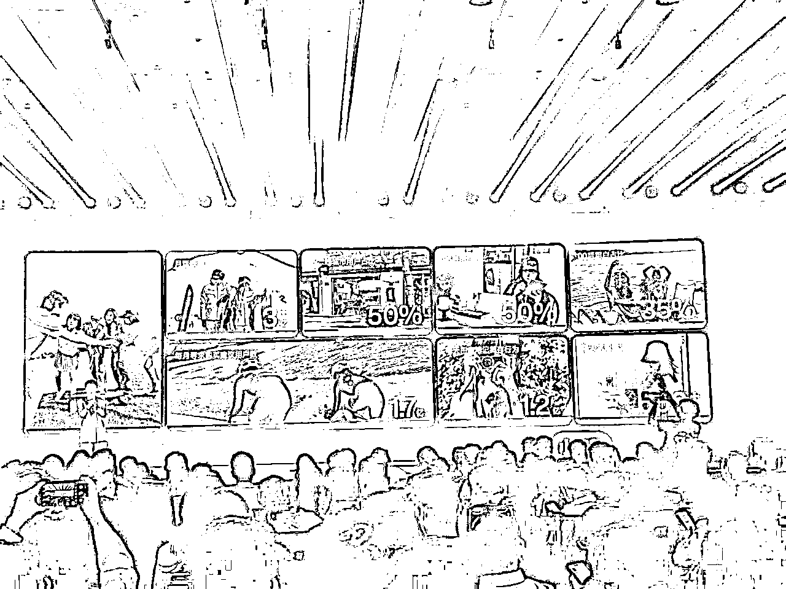
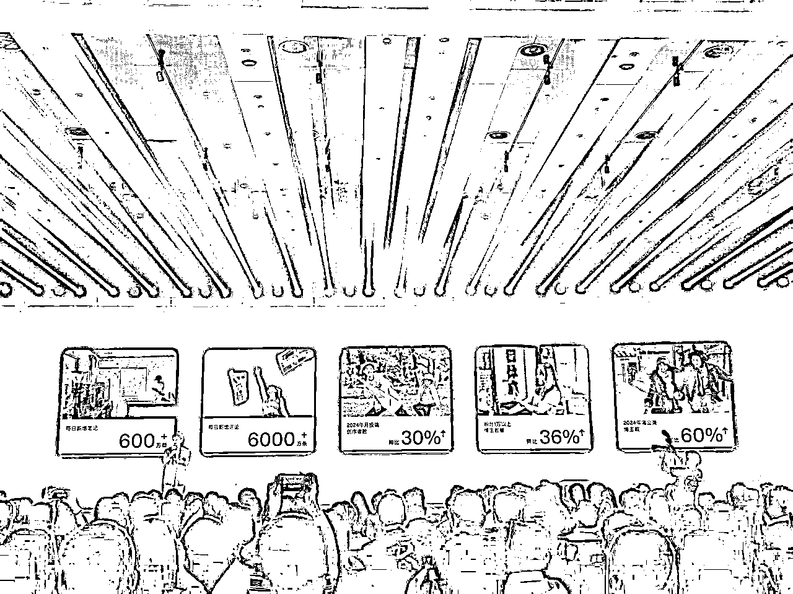
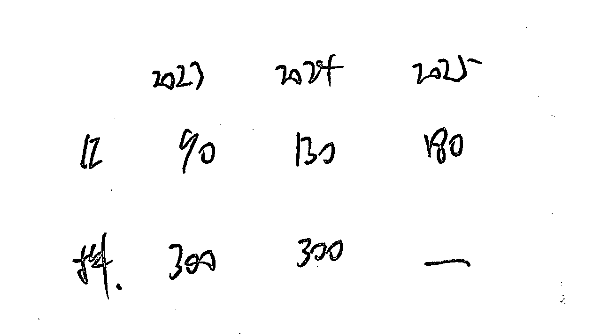
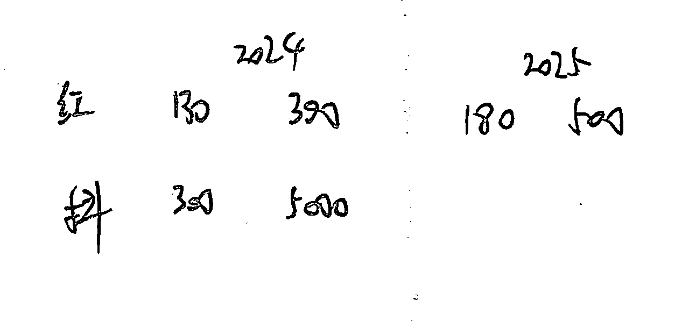
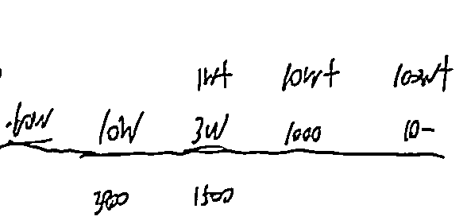

# 小红书连续两年300%的增长密码

> 来源：[https://shengcaiyoushu01.feishu.cn/docx/GltDd5HyPoLXJ6x7E9sck7e7nvd](https://shengcaiyoushu01.feishu.cn/docx/GltDd5HyPoLXJ6x7E9sck7e7nvd)

大家好，我是金虎。目前自孵化上大概孵化了六七十个IP账号，签约了三千几百个账号，快四千个了。在自孵化和签约上以及在整个小红书MCN的营收当中，应该都是比较头部的MCN机构

金虎：梭哈小红书1年，月入千万，我蒙对了什么？

方片新媒体丨2025一二月大事件

这个是一些简单的公司介绍。大家可以对于方片或者说一个小红书的MCN公司有一个大概的了解。这篇文章发出去的时候，是刚刚一个月我们1000万左右的营收。然后现在大概是4000万左右的营收。第二篇文章是我们每个季度每个月都会发一些公司的一些大事件。大家可以简单了解一下像我们这种业务的业态，大概是什么样。

OK，接下来我开始我的正式分享。

# 1、自我介绍

我是在上大学大一的时候，然后开始接触了微信公众平台，那时候应该是18、19岁，到大三的时候就开始创立了自己的新媒体公司，开始创业了。从13年到现在应该也是十几年的时间。

我大概从微信公众号，到自媒体的头条号、百家号、企鹅号、大鱼号，再到抖音再到小红书这几个平台也都做过了，里边的这个商业模式，比如说像广告或者说流量补贴，平台的拉新，电商带货，知识付费，这几个业务模型我们也都做了。

# 2、小红书的业务模型

在小红书大家做的业务，各自有各自的特点。比如说有带货的，然后有做私域的，有做知识付费的，也有做秀场的，还有做商单的。其实我是在所有的这个互联网的线上，这个业务过程当中，我是比较看好“商单”的这个业务模型的。

我觉得商单其实还有一个特别好的点，就是它的链路非常短。基本上是大家可以理解成我在平台里边去起一个账号，或者去签一个账号，然后对接广告客户，把产品植入进去，他没有说我既需要像带货那样，需要压货，需要打品，需要投流等等这些又不是特别正向的现金流的生意。

或者说又是把要赚的就大部分钱都要给到平台的这种生意，所以说我觉得整体的业务方向还不错。再加上商单的业务方向，大家可能也都知道它的利润率相对来说是比较OK的，尤其是像自孵化的话，我们可能给到自孵化的博主大概是10到20个点。然后编导加剪辑加运营可能十个点，剩下的利润是都是公司的。

所以说我就在整个大盘上，其实大概在两年之前，我就坚定的选择小红书这个平台，我觉得它一定会未来在整个大盘上肯定会高速增长。

然后我又在网红这个赛道里边选择了商单。其实商单就基本上就只有两种变现方式，一个是自孵化博主，一个是签约博主。我就选择了这个自孵化。因为我们一直是一个非常强的一个内容型的一个MCN公司。当我们内容及自孵化账号做出来的很不错的成绩，我记得应该是小红书应该有，大几十万个蒲公英的博主。然后我们在这大几十万博主当中，24年我们有两个月的时间拿到了单月涨粉增长榜的第一名有两个月。紧接着我们又开始疯狂去搭建我们的商务团队。

因为其实做商单这个事情其实就两个大模块。第一个就是把账号孵化出来，孵化的越好越大，流量越高越好。然后第二个就是搭建一个商务团队，商务对接的客户，品牌方、媒介公司的策略公司，越多越好，那就朝着两个方向上去做。

后来我发现其实光靠自孵化是不够的，我们的内容能力也是闲置的，并且我们搭建了搭建从二三十人到大几十人到现在的180多人的商务团队。他的商务资源是有闲置的，那我们就可以去做一些签约的这个业务。在签约这个业务上，我觉得在很早之前我是了解过抖音的签约，然后非常卷巨卷。抖音的很多签约公司其实利润是非常差的，甚至说很多是亏损的。所以最早期的时候我没有过度的去关注签约的业务。但是后来发现小红书的签约业务是有一个很大的一个红利期的。所以说我们就花了很多时间、精力和财力，投入到了签约这个业务。

# 3、入场小红书机遇和建议

今天可能也稍微多一点点跟大家去汇报分享一下签约的一个大概的行业情况。

签约这个业务，我们去年整个业务营收应该是做了1点八九亿，这是我们的营收，大概的利润，净利润应该在个5%左右。然后去年我们整个签约的净利润大概在1000万出头，就是签约的这个板块。我们觉得今年的增长速度还是非常大的。因为其实现在经济并没有那么好。博主靠单人，靠个人去接单的这个占比开始变得越来越激烈了变得越来越卷了。很多客户也在不断去压缩这个预算。所以说中间的这个机构，或者MCN 的重要性，尤其是对于商单上是变得越来越重要了。同时平台现在新增的创作者变得越来越多。

### 3.1 行业大盘分析

这个是我之前在三亚开小红书内部的一个分享会。他们的这个CMO制衡分享的一些数据，这里边也能看出来，就是小红书的这个博主。除了在山东省竞争比较大，然后在内容上也是比较大的24年，新增的这个博主增加了60%。今年这个博主也会变得更多一些，还会高速增长。

所以说我们就觉得这个的业务的增长趋势，我们自己内部来分析的话，它一定会非常快。所以说我们在今年定的这个营收目标，是6~8个亿。说我觉得整个大盘上我觉得还是有比较大的一个机会。因为这几个数据可能稍微有点敏感，我就直接写下来了。

想跟大家说的是在23年小红书这个大盘上的蒲公英商单是90亿，24年是130亿，25年今年的大概的一个预估是180亿。我的目标其实是定在180亿。大家很多人可能也群里有很多大佬在做抖音，抖音的星图的数据大家很多人应该也知道，其实是这两年它其实是横盘了。去年应该增长是几乎没有，应该是101%。我们估计可能25年应该会掉量，然后或者是说最多也是保持一个横盘的一个状态。

这个图大家可能能大概能get到小红书在2024年的蒲公英大盘是130亿。刚才跟大家说过了，它整个的信息流投放是300亿，25年是目标是180亿。整个广告的投放信息流是500亿。大家可以看一下这个比例，大概可能就是2分之1到3分之1不到的这么一个区间里边。

而下面这个数是抖音的星图，去年是做了300亿。但是广告的投流是4000亿、5000亿这么一个体量。所以说大家可以从这个数据当中，我们内部是这么分析的，就是说小红书是一个非常像微信生态。就是用“生态”这两个词来形容这个平台。它很克制，并且也很有调性，并且高速增长。有的平台可能就是非常极致的利己。把利润或者是收益给自己最大化。所以说这也是当时我们在抖音这个平台上，当时我们已经是有1.3个亿的粉丝量了，并且还在赚钱。但是我们预判可能再有一两年可能就会把我们给卷死，然后利润就会消失，所以说我们就提前选择了小红书。

最后一个非常核心的数据就是大家先看中间这条横线，就是目前在小红这个平台上的，开通了蒲公英的这个博主。大概是60万到80万个，就是量其实非常大的。我们觉得它是有一定的商业价值的就是属于合格的，能变现的或者偶尔能变现的。一共是10万个。

我们真正的再去做签约要去做签约的这些博主是3万个，大家可以看到这个3万上面有这么一个数字，是1万+，就是单月变现能超过1万块钱的博主，是3万多个。那在这3万个博主就是我们真正想要去签约的了。3万下面有一个数字是1500个，就是我们自己签约了。1500前面还有一个数字就是3800。这3800是我们总计累计一共签约的，可能还有一半或一半要多一点。它是没办法满足单月，或者每个月都能做到1万以上的。所以说我觉得目前我们金威市场体量或者说需求还是非常大的。我们可能也就是在占个3万分之1500，可能还得不到20分之1。

### 3.2 方片业务分析

后面这两个数据简单跟大家一过，就是一个我们从数据分析上得到非常严重的一个小问题。就是单月能工作到10万以上的博主，现在行业里边基本上就是1000个了。

我说的是各个类目，所有的垂类加起来能够做到单月100万家的，然后是十个，甚至说十个以内。在去年或者一年前的这个阶段，100万以上博主是能做到个30个到50个之间。

并且大家可以从这个数据当中分析出来一个非常严重的问题，就是超头博主他们的变现在变得越来越差。原来可能有个50万粉丝或者说100万粉丝，我变现可以非常好。但是最近这一年，包括今年、明年可能都会变得越来越差。所以说我们就决定了我们一个战略方向，就是我们签约中腰部账号。

以前我们可能聚焦于前1000名的，单月10万的。但是这个量其实也是在掉。那现在客户可能更愿意投1万左右的，或者几千块钱的博主，这个预算变得非常大。群里我看还有一些做博主的朋友，其实我们也给博主过这个建议。如果说你的单价超过了2万或者3万，那你可能在选号的时候就会有下滑，或者说成交成单数量有可能降低。

我们给的建议，一是降低大号的更新的频率，可以去做1到2个小的账号。比如说更垂一点的账号，或者说其他类目的账号。比如说我做了一个美妆的，我可以做一个vlog或母婴类的。或者说我喜欢表演，我可以做一个剧情类的账号。同时我们自己公司签约的方向可能就从原来去签超头，变成去签中腰部账号。这个的市场体量也是非常大，可能我们已经变成了头部的MCN公司，但是也是只占百分之市场市场份额的可能5%都还不到。

同时我们还拿到了两个数据，也坚定了给我们做这个方向的一个支撑。

首先第一个就是小红书今年和明年的订单增长肯定还是会高速增长的，应该至少会在150%以上。相当于是客户的这个预算其实在不断的加码加到小红书这个平台上。因为确实是在小红书投放种草，它的投入产出会相对来说更高一些。

而且现在有一些部分客户也养成了在小红书上去种草，投放广告。然后在抖音上去拔草，去开直播间去收割。并且还有一个信息就是博主的增速其实也在增加。有很多的一批博主是会被淘汰，可能内容更新或者说更新不好，可能就出局了。所以从这三个方向上，然后一个是我们自身的这个市场份额体量并不是很大，然后占比很小。

再一个就是客户，品牌方的投放投入占比越来越高，尤其是以3C、家居、汽车等等这样的这个品牌方。甚至说现在包括一些平台的京东、淘宝、阿里，包括一些AI的这个APP。比如说豆包、Kimi、通义等等甚至说我感觉可能今年或者说明年可能也会开始有一些机器人的广告开始进来了。今年我们去年我们就已经开始接机器狗的了，所以说市场体量也得变得更大。

第三个就是新旧博主在交替，然后会有很多新的博主进来。

所以说综合这三个方向，我们觉得他们签约整个市场机会还是非常大的，所以说我们定了将近2个亿，1.9个亿的营收。5%的净利润，然后毛利的话应该在个10%出头。其实行业里边也有很多公司其实是在做签约，大家的利润可能都会稍微比我们高一点点，大概可能再把7到8个点，因为我们自己其实分给了一部分的外部的合作的公司，然后导致我们可能利润在降低了一些。但是我们在节省成本这方面，我觉得我们做的还是比较OK的。一会儿可能我会详细展开跟大家去汇报一下。

再一个数据是我们自己大概的一个内部数据就是每签约100个博主，大概会有8到10万的毛利润。

### 3.3 项目机遇和难点

我可以跟大家汇报完，整个大盘还有平台我们自己的一些数据之后，我再跟大家说一下目前的一些难点上市机会。

首先第一个就是目前小红书整体的签约公司是在变多的，并且小红书还在不断的引入新的MC公司来去做签约的这个业务。今年应该我估计可能还会再引入个几百到上千家，所以说这个的竞争也确实是在变大。

再一个就是现在由于经济的情况，我觉得是越来越重商务以及越来越重服务的。我们现在这个商务团队已经是一百多人了。以前我觉得我们在AE执行上其实并没有那么多的人。但是现在在客户的交付满意度上，其实是要求越来越高。以前我有一个小小的一个误区，就是我们做 MCN 公司我们把账号签好，给客户推销优质账号，那不就是OK了吗？

但是后来我的一个合伙人给我说了一句话，就是我就直接让我醒悟了。他说“其实我们做 MCN 是提供两个产品，一个产品是“博主的内容“，另外一个产品是”我们给客户的服务”。

在这个过程当中，我们给客户提报的速度是不是快，是不是精准，然后以及客户下来题号下来了之后，我们的反应快，速度是不是够快。我们在跟博主之间的沟通是否是顺畅的。然后博主改稿，博主的重新的点击等等，这些是不是都是顺畅的？所以说在这方面我们又增加了好多执行团队的人。

第三个就是关于“签约”这个业务。它会存在一个博主流动性比较高的一个问题。博主通常解约最大的一个卡点就是没有商单或者商单少。这个是我们之前签约非常头疼的一个问题。因为我们明明知道，我们家的商务团队能力可能在行业里边已经属于非常顶的了。博主仍觉得商单少，他即使解约了，或者说换到别的机构，可能也会同样存在这样的问题。

但博主依然还会去解掉。其实我是特别能理解的，包括我自己本人也是一样的。博主其实更愿意找缺少后面文案。因为这个行业是越是头部，MCN的边际成本就越低，它的服务能力就越强，它的客户资源就越多。包括它的品牌力，包括我们就不能说随便说这个博主我们不给解约，这是不可能的。

我把机会和难点都跟大家说了。刚才其实也说的是，我们面对这些难点，我们是怎么做的，然后跟大家稍微梳理一下。

第一个就是我们疯狂的把自己的商务团队和这个运营服务团队给拉大了。大概是个一百几十人的商务，他团队让客户体验，让博主体验，然后都变得更好更长。

同时我们也在不断的去完善我们的内容运营的这个团队。然后给很多博主我们都开始给提供，如果不准联系不上，或者说回复不及时，我们就开始参与给他改稿，参与开始给他我们自己的剪辑可能给他截片的。

然后第三个就是我们也组建了我们的技术团队。从去年前年我们就开始有了技术传递。然后今年到目前我们是八个人的技术团队。这个技术我一会儿也会展开，跟大家稍微汇报一下。然后再一个就是我们要不断的跟着官方平台的要求走。我们做了很多跟官方的联动，包括官方需要这个讲师，需要编导，或者需要达人去分享，我们也都会去，同时我们也会邀请官方去给我们做了很多次的分享。

再一个就是我们基本上跟行业的几乎所有的头部的，或者说前十名或者前20名的签约的MCN公司，我们几乎全都拜访过。去跟每一家去交流，并且拿出了我们的一些解法解析思路。因为我自己的创业的初衷其实还是为了成长。我觉得司马懿那句话其实说的是非常好的。他说“皇上，臣一路行来，没有敌人，都是朋友和师长”

我也是这么去要求我自己的，所以说我们比较开放，愿意跟同行们去分享我们的一些小小的经验。下个月7号，我也会作为广州航海家新流量大会的分享嘉宾，来跟大家继续聊聊关于小红书，如果大家有做小红书相关的疑问，欢迎来交流~ 也可以在帖子的评论区留下你们的问题