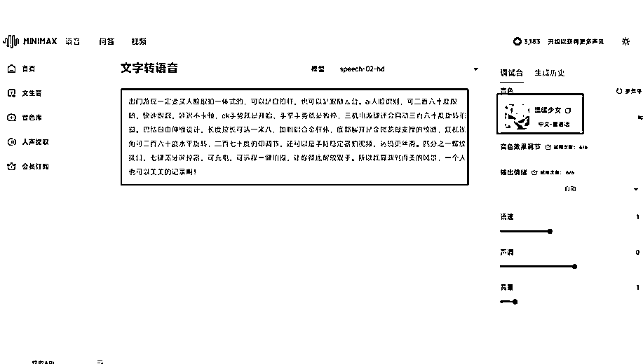

# 通过get笔记快速获取对标视频号文案，加上minimax快速创作对标视频

> 来源：[https://uwjr847ajvw.feishu.cn/docx/Gw0FdkI3qobk54xGkoWcwXRwnkd](https://uwjr847ajvw.feishu.cn/docx/Gw0FdkI3qobk54xGkoWcwXRwnkd)

# 今天刷到一个快速获取对标账号的视频文案，简直是一键操作，真是牛逼啊！

## 必须分享给小伙伴们，坚持输出！

### 这个方法就是通过一款app实现这个功能，软件名字叫 get笔记

应该这次搭建知识库的航海会用到这个软件，大家可以先下载

# 开始分享：

### 先新建一个空白知识库，随便取，不影响效果

### 点击添加内容

### 这个时候我们需要截图一个对标账号的 主页图片

### 上传图片后，系统自动识别对标账号，核实是否是对标账号，点击确定

### 点击订阅的博主，就可以查看他的视频文案了，一次操作后，后期会自动订阅博主的文案，简直不要太爽

### 点击文稿就可以查看视频文案了

## 进阶玩法：获取文案后通过minimax 进行配音+剪映 快速生成视频 （文案可以稍微优化下，不然同质化会影响推荐）

## 直接用MINIMAX AUDIO制作文案音频。

打开MINIMAX AUDIO，

网址：https://www.minimaxi.com/audio

把短视频文案复制到对话框，右侧选择对应的音色，点击生成音频，然后下载保存到本地。

## 如何1:1极致复刻短视频画面素材。

怎么做到1:1极致复刻？

1、找到这条视频，伸出你的10根手指，一边播放视频，一边数博主切换了几个不同的镜头，只要换一个场景换一个表达，都算一个镜头。（如果视频是爆款的话可以直接在剪映上建立模版，后期直接替换镜头可以快速提效）

2、然后拿个小本本出来，把每个镜头的关键词都记录下来。像我这样。这个对下一步的实操很重要哦。

## 接下来剪辑的工作我就不写了，大佬们可以根据这个思路来