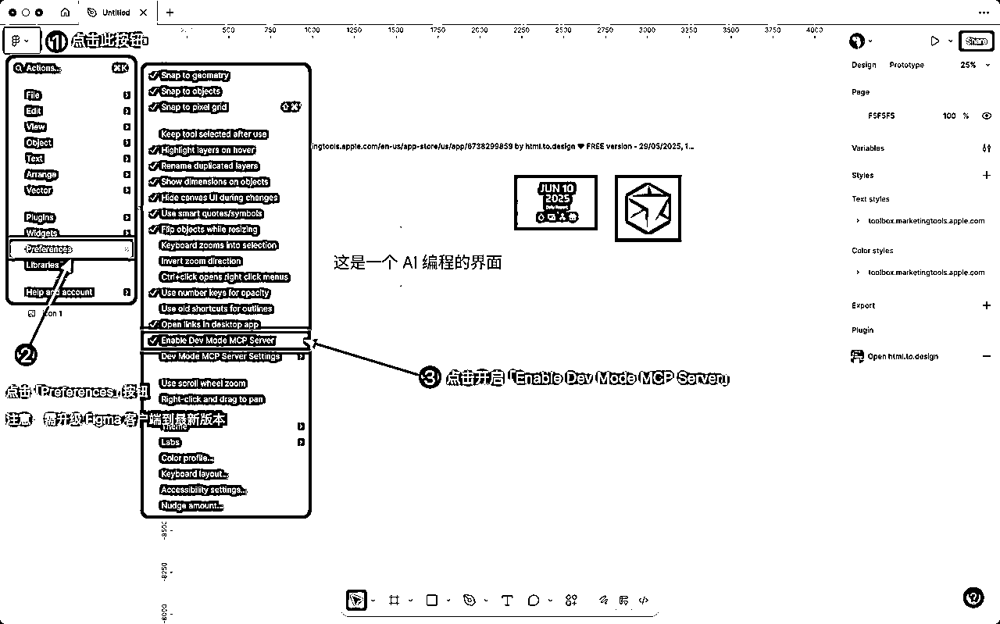
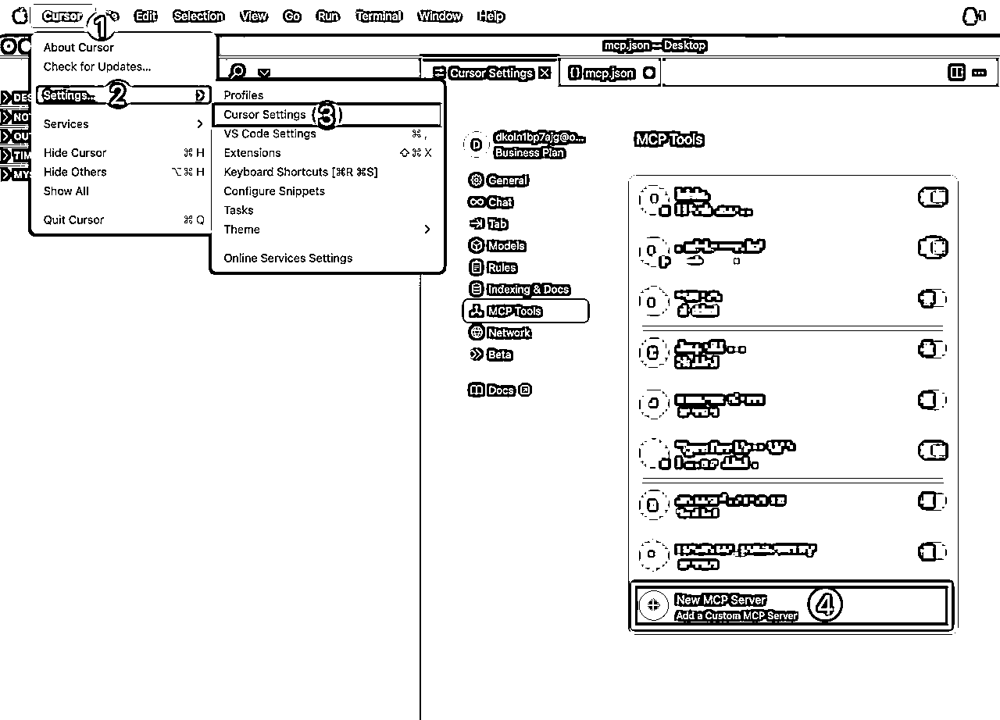
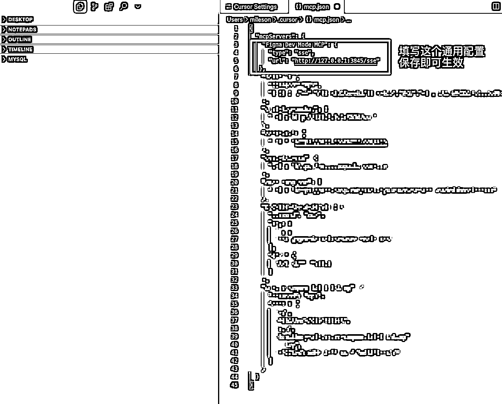
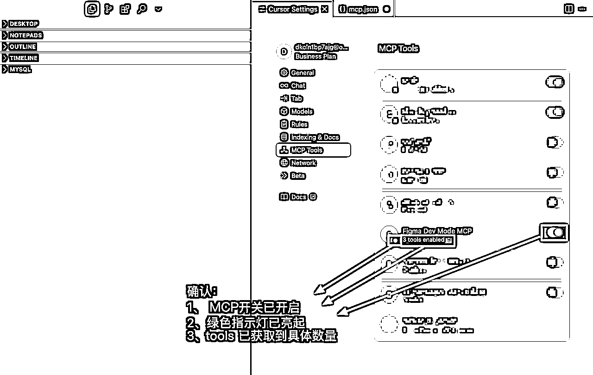
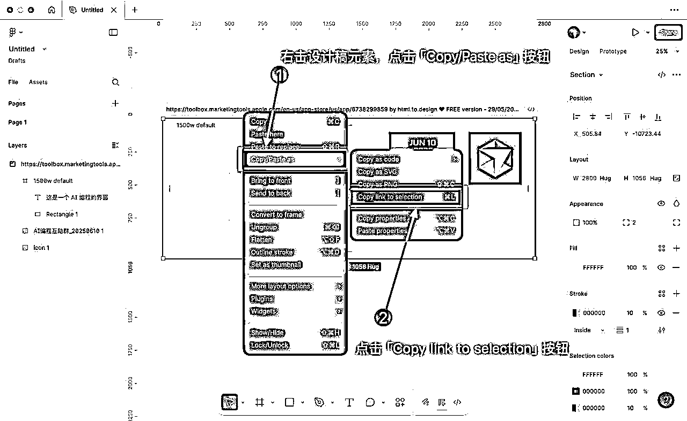
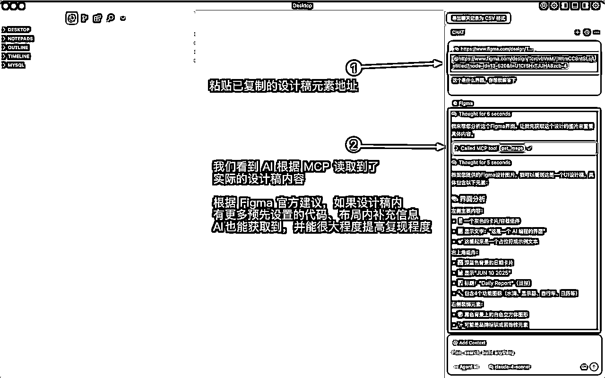

# 【保姆级教程】Cursor 对接官方版本 Figma MCP

> 来源：[https://chaojifeng.feishu.cn/docx/INzDdmA7oopBDhx3NXqcTvg6nVe](https://chaojifeng.feishu.cn/docx/INzDdmA7oopBDhx3NXqcTvg6nVe)

上周，Figma 官方发布了全新的基于开发模式下的 MCP 原生支持功能。相比原先的需要安装插件，然后保证端口一致之类的繁杂的各种操作的不稳定的第三方版本，提供了原生级别的的稳定服务、便捷使用、能力更强大的 MCP能力。

今天，我将通过图文的形式，保姆级教会你如何快速对接上这个 Figma 官方的 MCP，帮助你能够通过设计稿就能让 Cursor 等 AI 编程工具实现你所见即所得的想法！

### 一、开启 Figma MCP 服务

首先，你需要将本地的 Figma 客户端，并将客户端更新到最新版本（即 version 125.4.9 以及以上）

然后在「设置页（Preferences）」内开启“Enable Dev Mode MCP Server”选项



### 二、配置 Figma MCP 服务（以 Cursor 为例）

打开 Cursor ，并前往 Cursor 设置页 ，点击「New MCP Server」按钮，添加 Figma MCP 配置



复制下述 MCP 配置，原文粘贴到 mcp.json 内，并保存即可

```
"Figma Dev Mode MCP": {
      "type": "sse",
      "url": "http://127.0.0.1:3845/sse"
},
```



最后，返回 Cursor 设置页 ，通过如下 3 要素 ，确认下 MCP 配置是否已激活：

1.  “Figma Dev Mode MCP”的开关是否已开启

1.  指示灯是否已变绿

1.  Tools 区域是否已获取到具体数量



### 三、使用 Figma MCP 服务（以 Cursor 为例）

配置完成 Figma MCP 后，返回 Figma 客户端内，右击打算实现的设计稿，并复制链接



将复制的链接粘贴到 Cursor 内，并进行对话，我们可以看到 Cursor 能准确读取到



最后，附上目前 Figma MCP 已支持的四大能力，帮助你后续更好的使用这款 AI 编程神器：

| MCP 能力 | 作用 | 使用场景 |
| get_code | 把当前选区转成一段可直接运行的界面代码——可在设置里选择 React + Tailwind 或纯 HTML/CSS 输出 | 新起一个页面骨架：在 Cursor 里选好画板→调用 get_code→模型继续补交互；省去手工还原像素的步骤 |
| get_variable_defs | 列出此选区实际用到的颜色、间距、字号等设计系统变量，带“名字 + 当前值 + 模式” | 想让 AI 写出的样式严格沿用你的设计标准，比如 color-primary，而不是把 #FF5630 写死进代码 |
| get_code_connect_map | 告诉AI“Figma 里的这个按钮＝仓库里哪一个真实组件文件”，依赖 Figma 的 Code Connect 设置 | 大型项目维护老代码：让 AI 复用现有 <Button> 而不是“又造一个轮子”，减少后期技术债 |
| get_image | 输出选区或整个画板的 PNG/JPEG（可指定倍率），给模型一个整体排版或视觉参考 | 复杂流程、响应式断点、或组件极多时先送一张鸟瞰图，让模型判断层次关系，再配合 get_code 针对关键组件写细节 |

希望本次的分享对你有所帮助：）

更多 Figma Dev MCP 资料可参考：

[1]《Guide to the Dev Mode MCP Server》官方英文原版教程：https://help.figma.com/hc/en-us/articles/32132100833559-Guide-to-the-Dev-Mode-MCP-Server

[2] 《Introducing our Dev Mode MCP server: Bringing Figma into your workflow》这篇介绍 MCP 技术理念的文章：https://www.figma.com/blog/introducing-figmas-dev-mode-mcp-server/