# 多账号矩阵管理工具：通过Trae辅助，帮我接入多平台自动发布插件MultiPost。

> 来源：[https://udxxg5rx5m.feishu.cn/docx/J7WTdmRetolugfx25HUc6lEpngg](https://udxxg5rx5m.feishu.cn/docx/J7WTdmRetolugfx25HUc6lEpngg)

接入MultiPost后，

矩阵管理工具负责切换账号，设置浏览器的独立环境、ip，并喂给插件标题、内容、素材，

MultiPost插件则专门负责各种平台发布。

插件里所有动态图文视频平台都可以被调用。

这次接入插件的开发过程让我突然想到一个新点子：

能不能开发一个功能，让新手完全不需要看代码，

只需要写一段简单的“操作脚本”就能自动执行所有步骤？

比如这样的文本：

点击指定按钮》

输入标题》

点击指定按钮》

输入内容》

点击指定按钮》

上传文件》

设置标签》

点击发布按钮。

这样一来，就能快速生成一个符合自己需求的自动化操作流程。

这个想法在技术上是可行的，关键在于有没有足够多的人有这个需求。

实现起来虽然不复杂，但会比较繁琐，

一方面要理解用户的指令文本，

另一方面还要将其准确地转换成可执行的操作流程。

暂时放入我的未来计划里。

# MultiPost插件介绍：

MultiPost-Extension 是一个 2 月份在 GitHub 上开源的项目。

安装后测试了一下，效果确实不错。

当时发现插件本身还有一个网页版，也可以同步动态。

我看到这个插件可以自动发布到 40+ 个平台，支持的视频、图片、文章等多种内容形式，具体功能如下：

*   支持同步发布到知乎、微博、小红书、抖音等十多个主流平台

*   免登录、免注册、免 API Key，完全免费！

*   支持发布文字、图片、视频等多种内容形式

*   支持网页联动，可以开发自己的网页并设置自动化，调用扩展的发布功能，如：

*   自动抓取网页内容并发布到多个平台

*   定时发布

*   联动 AI 生成内容

这个扩展主要解决了内容创作者在多平台发布时的痛点。通过一次编辑，就能将内容同步发布到所有平台，大大提高了工作效率。

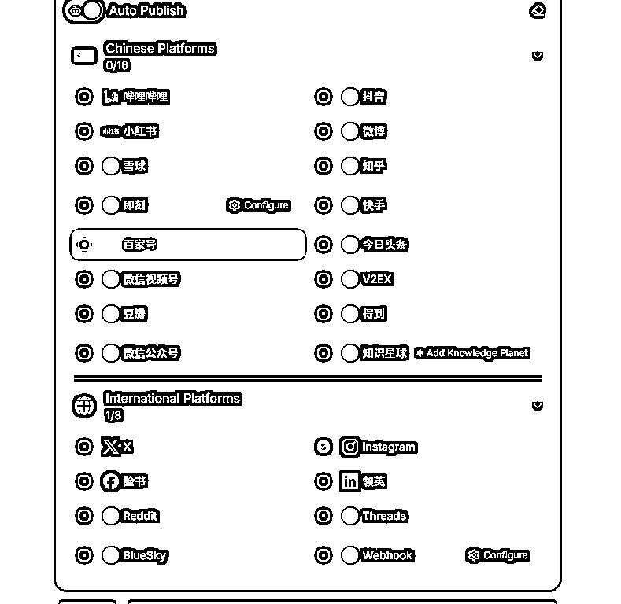

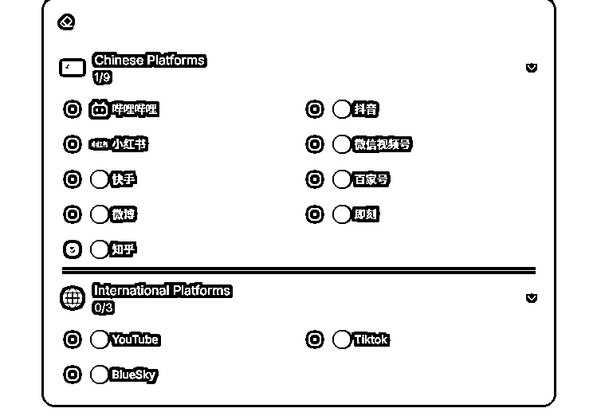

# 多账号矩阵管理工具介绍：

### 🌟 （无任何收费模式）🚫💰​​

### 🔥 多账号管理工具 🔥

---------------------------------------------------------------------------------------------------------------------------

🚀 支持创建多个子窗口保存账号，每个窗口独立运行

---------------------------------------------------------------------------------------------------------------------------

子窗口隔离系统：🔒 独立Cookie | 💾 专属缓存 | 🌐 独立IP地址 | 🖐️ 独立设备指纹

---------------------------------------------------------------------------------------------------------------------------

♾️ 无限多开窗口：💻 硬件决定上限，电脑配置越高可开窗口越多

---------------------------------------------------------------------------------------------------------------------------

📂 智能窗口管理：🏷️ 分组标签功能 | 📝 自定义备注 | ⚙️ 批量设置窗口尺寸 | 🧩 自动排列布局

---------------------------------------------------------------------------------------------------------------------------

📌 窗口置顶功能（支持钉选任意窗口）

---------------------------------------------------------------------------------------------------------------------------

🤖 自动化矩阵发布：

📲 内置一些主流平台自动发布系统。（更新精力有限这部分只会跟随我的需求进行更新）

🌐接入了MultiPost，里面有大多数主流平台的自动化发布。因为插件开源，还可以自行开发。并且插件一直在更新。

---------------------------------------------------------------------------------------------------------------------------

🎞️ 素材数据库：🗂️ 可独立配置单独账号素材 | 📦 也可一键配置多个账号素材

---------------------------------------------------------------------------------------------------------------------------

🛠️ 插件扩展中心：🔌 自定义加载Chrome插件

---------------------------------------------------------------------------------------------------------------------------

📡 飞书生态互联：

⚠️ 异常预警系统（监控视频号数据 → 飞书消息报警）

📈 视频号数据统计（视频号数据自动同步飞书表格）

🚧 已预留飞书接口后期可开发。

---------------------------------------------------------------------------------------------------------------------------

统计账号任意信息：

🔄 账号轮巡抓取并记录在软件内。

其实软件的收费功能早就做好了，

只是我屏蔽掉了。

最初开发这个工具的目的是为了能够快速完成任何平台项目的工具开发，

所以做了一个通用的账号管理工具。

后来考虑到已经投入了这么多精力，觉得做成收费工具也能带来一些额外收入。

于是不停完善软件操作方式让他更符合普通用户的习惯。

但是这块细节上的东西实在是太多了。

想要让软件符合各种用户的需求真的很难协调。

软件不停更新也导致一些功能被优化、增加、删除，

我实在懒得录制软件的全部功能说明，

导致好几次使用的朋友跟我反馈一些需求的时候，

我摸摸脑袋告诉他其实这个功能软件上有，

只不过入口藏得有点深。也没有在教程上说明。

有些朋友也很惊讶原来我早就做了相关功能，

一些很小的小功能但是能优化使用体验的我都做了进去。

其实软件可以双击隐藏只显示浮窗（软件最外围空白处双击）。

软件界面右键可以选择简易模式运行（软件最外围空白处单击右键）。

软件本身也可以置顶（软件最外围空白处单击右键）。

双击账号列表最左边可以快捷打开独立账号窗口。

如果账号太多，还可以查找账号，


能根据任何一部分账号信息，对账号进行模糊查询。

软件还有ck注入。可以直接复制浏览器内的ck，粘贴到软件注入的功能里。

还可以将账号信息导出到表格。在表格操作完后，再导入进软件。

甚至软件的账号列表内，看似固定的一些软件备注信息，它的标题名都可以自定义设置。


这样做就是为了能让用的朋友可以自己备注相关信息的标题。

还有一些细节的东西等以后有空了再说吧。

但随着时间的推移，我意识到自己的精力有限。

如果收费，可能没法及时维护和更新产品，

而且还得花时间去推广，市面上类似的产品也很多。

目前也不考虑拿这个变现，所以就一直免费供各位使用。

# 多账号矩阵管理工具接入MultiPost 指南：

## MultiPost接入矩阵管理工具方法：

因为我在矩阵管理工具MultiPost-Extension相关的设置页面留了自定义的接口，

你只要在编写自动发布代码的时候把执行发布的参数定义好，

将参数放入矩阵管理工具内，

就可以被我的软件调用。

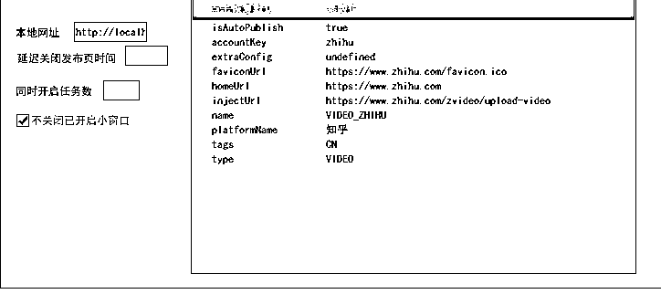

MultiPost相关参数可以通过控制台监控找到。

我的多账号矩阵管理工具里已经放入了插件（目前适配到1.1.4版本）。

因为插件更新频繁所以我放慢了适配进度。

启动浏览器时在这里打对钩，浏览器会加载这个插件。

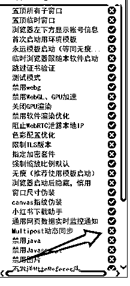

点击左上角插件会跳转官方网页https://multipost.app/dashboard/publish/dynamic。

没登录账号的可以先登录账号。

登录后点上面的publish，

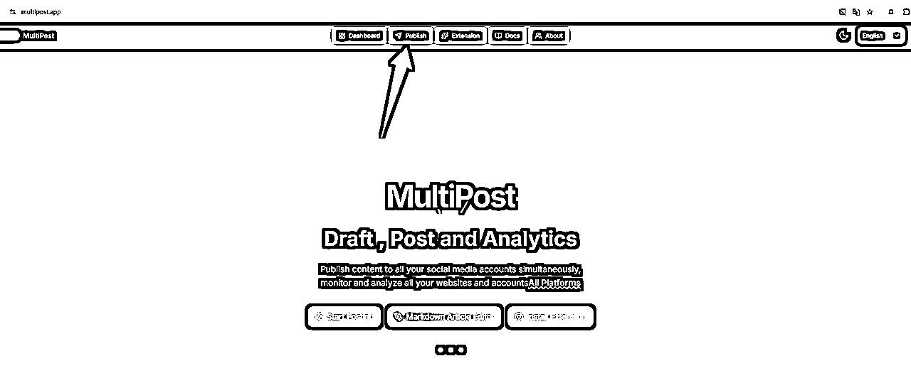

就可以看到这个界面，用来填写标题、内容和素材。


输入内容再选下一步就是选择你想发布的平台了。

这里有很多分类，可以自行研究一下。国外的一些主流平台也有。脸书、ins、X。

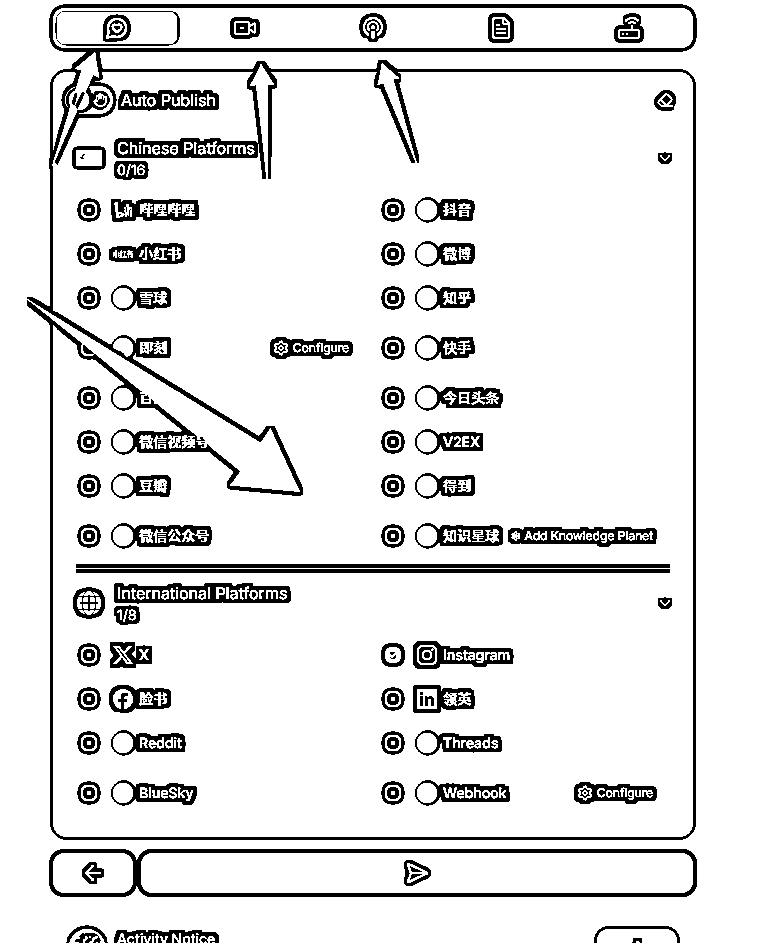

在这个界面按F12控制台，

输入以下代码。这个代码是用来监听消息，方便你看到发送的调用插件的相关消息。

```
window.addEventListener('message', (e) => {
    console.log('收到扩展响应:', e.data);
})
```

如果输入代码后弹出这个提示


则说明失败了，需要先在控制台输入 allow pasting 敲回车。

注意不能复制粘贴。必须手动输入，


然后再输入这段监听代码。

```
window.addEventListener('message', (e) => {
    console.log('收到扩展响应:', e.data);
})
```

控制台现在这样就表示成功了


这个时候不要关闭控制台。

确保你在官网页面已经填写信息，视频或图片。选择好你想发布的平台。

可以不用登录相关平台账号。

因为我们只需要获取发布时的信息即可。

注意一定是你想发布的平台，不能随便填。

因为要获取发布平台的相关参数。如果你填小红书平台，

获取了小红书发布参数。那么软件发布的就会是小红书的。

设置好发布前的相关资料。点击发布。

插件会跳转网页开始发布。

这个时候就可以把新打开的新页面关闭即可。

因为信息已经建听到了。

在原来的控制台页面可以看到这样一条信息。


这个时候依次点击小三角。把信息展开。

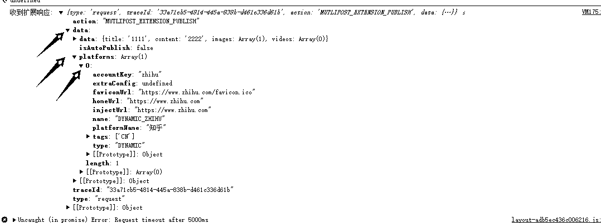

找到这部分信息，

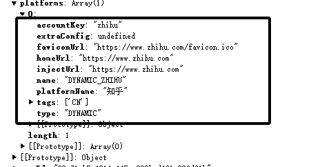

在软件里打开MultiPost设置，

然后把信息填写进去。


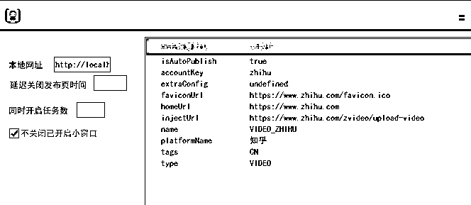

可以看到isAutoPublish这个参数并不在这个框内，

isAutoPublish是用来控制是否自动发布的，

如果是 false ,插件会在发布作品的最后一步不点击发布。

默认true就是默认自动发布。所以这里不需要改。如果你需要自己确认是否发布这里可以改成false。

到这里MultiPost 插件相关配置信息就完成了。

然后在软件内设置好每个账号对应的素材文件夹。设置好相关标题。

点击multipost就会开始发送了。


## 自己开发自定义发布流程：

而如果你想要对源码进行开发符合自己的自动发布流程。

你要参考MultiPost 的源码，

..\src\sync\ 目录内

Article podcast video dynamic account 这几个文件夹根据动态、视频、文章等做的分类

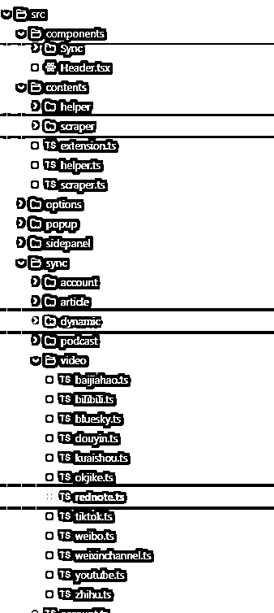

把这个开源项目直接交给Cursor或者Trae分析，

让AI来根据现有代码的框架和逻辑，

喂给AI你想编写自动发布的平台页面的数据，

让他帮你在MultiPost源码基础上。在里面再开发一个页面跳转+填写发布信息+点击发布按钮的相关代码。

打包成谷歌插件，

然后把插件接入矩阵管理工具后理论上也可以被调用。

## 软件调用MultiPost插入图片、视频方法：

想让插件在平台页面上传图片或者视频必须进行环境安装与服务器启动

1.  安装包部署

*   双击执行 node-v22.14.0-x64.msi → 保持默认路径（C盘）完成安装

1.  环境验证

*   双击运行 start-server.bat → 输入 8 回车执行检测

*   预期输出：

```
Node版本: v18.19.0  
NPM版本: 10.2.3
```

1.  依赖安装

*   输入 9 回车 → 自动安装 http-server 组件

*   安装完成返回主菜单

1.  服务启动

*   返回主菜单 → 选择1 服务启动项 → 保持弹出的 DOS窗口 运行状态

*   关键信息：记录生成的访问地址 http://localhost:43456/


* * *

# 我如何通过AI完成了这次软件开发：

放在以前想要完成这样一次接入，

对我来说是一件非常难完成的事。

我也是前一阵子刷风向标时无意间看到的。

觉得这个插件潜力很大，

于是我联系了插件的作者，

询问了一下插件的相关情况。

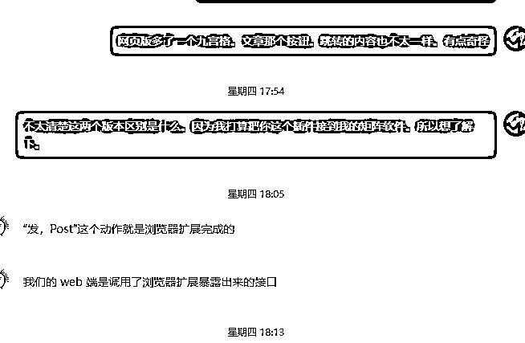

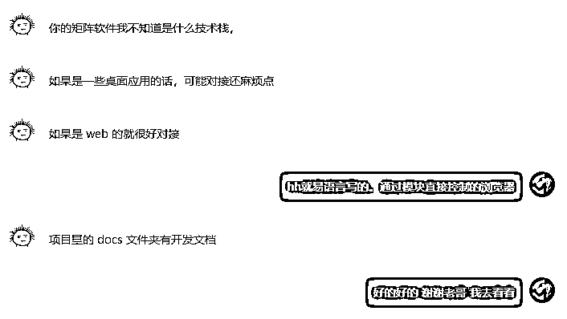

作者也给了我一些有用的建议。

原本我打算直接通过元素控制插件来实现自动化，

但和作者聊过后，我决定试试看通过开发文档中的内容来直接控制插件。

中途测试了很久都没成功，

一度有些想放弃。

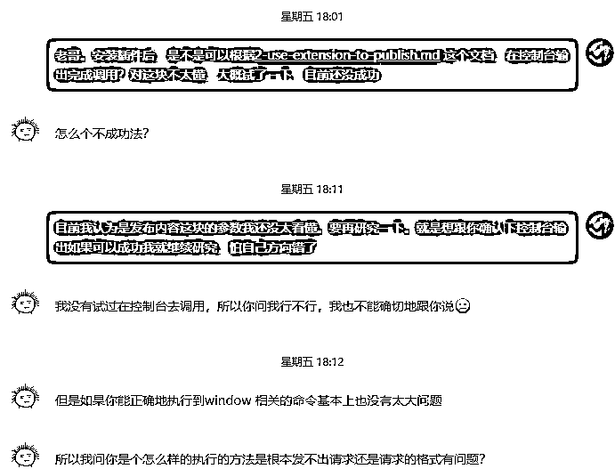

因为我并不是专业的程序员，

对一些编程基础知识了解得不多，很多时候都是根据需要学习一些特定的内容。

和项目作者聊天时，作者说的一些东西我也只是半懂不懂，

虽然似懂非懂，但也不想去问太多基础性的问题打扰他。

而且作者自己也没有尝试过用控制台调用，所以他也不能给我解答相关的疑问，

最后只能自己动手试试。

我通过deepseek、GPT和Trae等工具，向他们提问，让他们帮我分析源码，

并给我一些可行的建议。

我先是把开发文档丢给deepseek让他先理解

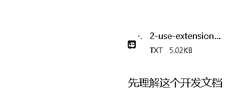

分析完后，deepseek给了我几个测试代码。

我试了一下，但没成功，于是我考虑让ai帮我分析整个源码，

但是因为源码文件太多，

不适合直接给deepseek，

于是我把源码直接发给了Trae。

我告诉他，我想通过控制台输入来给MultiPost发送消息。

不过Trae看完源码后发给我的测试代码也都没成功，

最后只好自己仔细读了一遍开发文档。

通过文档中关于授权部分的代码，

我发现Trae把 chrome.runtime.sendMessage 和 window.postMessage 混淆了，

这导致我测试了好几个小时都没成功。

接着我开始测试同步消息的代码，但控制台输入后却没有任何反应。

和Trae说完之后，他给了我一个方法。

```
window.addEventListener('message', (e) => {
  if (e.data?.type === 'response') {
    console.log('收到扩展响应:', e.data);
  }
})
```

他让我用来监听消息。

测试了一下，果然能看到消息了。

不过控制台输入的监听消息格式和我想发送的消息不太一样。

于是我开始把代码一部分一部分地对比，然后参考开发文档来检查。

终于成功发送了标题+内容的信息，插件也能正常调用了。

不过带图片和视频的消息还需要进一步研究。

我发现当我用插件发送带图片的消息时，图片部分的代码并不是一个文件路径。

于是我就问Trae。

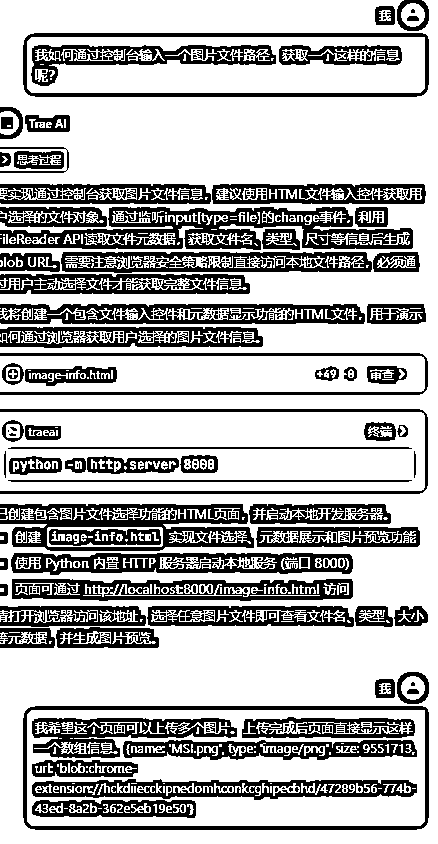

Trae给我做了一个HTML页面，并且直接帮我启动了服务器。

这个操作有点出乎我的意料。

因为这个软件还有很多朋友在用，我本来希望能简化操作方式。

于是我问了其他的可能性，

Trae告诉我，启动服务器这一步是绕不开的。


于是我要求trae能给我一个相对简单的安装方式，

试用了几个方式，最后还是选择用Node.js。


我还让Trae帮我做一个BAT文件，方便安装插件环境并启动服务器。

我觉得这种方式会让插件的环境安装变得更简单，也对新手更友好。

不过因为我自己不太懂Windows批处理脚本语言，

Trae做的BAT文件在执行时总会闪退，很多地方都会触发这个问题。

于是，我只好把代码一点一点拆开执行，逐步分析。

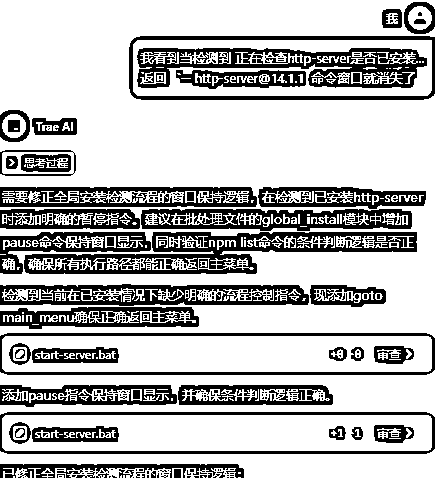


我和几个AI来回分析了好几次，

最后才终于把BAT文件弄好了。

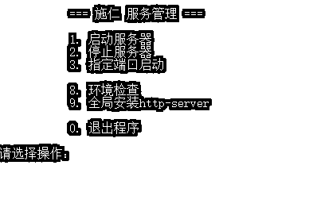

安装好Node.js后，打开BAT文件，环境检查没问题后，就可以安装http-server，安装完后就能启动服务器。

服务器配置好后，我通过自己做的页面可以获取图片信息了。

不过，参数拼接还是遇到了问题。

开发文档里的参数只有标题和内容，

虽然我通过控制台捕获到了图片信息，但自己拼接后还是报错。

于是，我把问题交给Trae帮我梳理。


最终完成拼接后，我在控制台手动测试，

插件成功调用，图片没有问题。

接着，我让Trae在页面增加了视频上传功能，

修改代码后，整个流程也正常运行了。

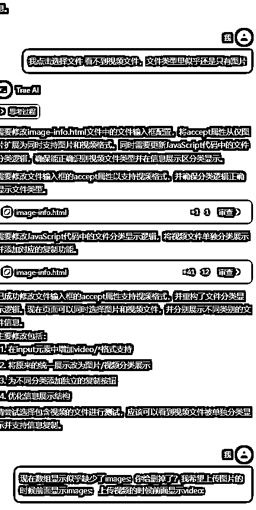

按照之前的格式拼接后，

插件确实被调用了，

但是在上传视频的页面却提示文件类型不对。

我在几个平台测试后，都是类似的提示。

问了几个AI，给出的原因都不对，

Trae一直说是少加了“videos”，

但我测试后发现并不是这个原因。

AI太固执，我换了个提问方式，

尝试了很久，还是没找到解决方法。

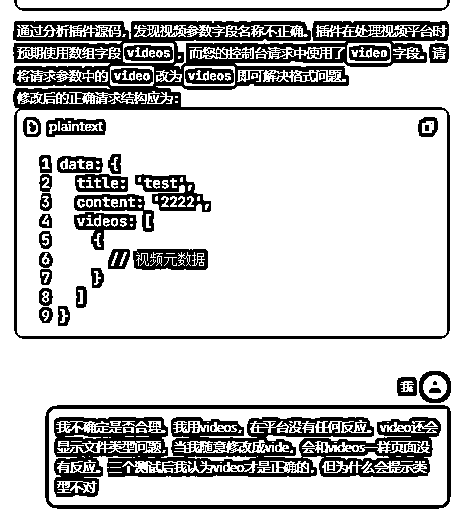

最后我咨询了作者，

结果作者也不太清楚是什么问题，

于是我只好再次监听插件发送的消息，

自己观察接收到的消息和我发送的消息到底有什么区别，

最终我发现，图片的参数是数组，而视频的参数不是，

只需要把两边的【】删除就可以了。

至此，整个流程的测试终于完成。

至于文章同步的功能，等以后有需要的人再考虑接入吧。

调用插件部分的命令都梳理清晰后，

就要开始考虑批量自动化调用，

原来软件里的发布方式是单线程的，

本来我还是想延续单线程方式去执行，

但是考虑到效率问题，

我还是决定增加多线程发布的方式，

这样的话原来的架构就完全不能用，

只好重新写了多线程对浏览器的操控，

这个过程里我发现一个问题，

我的工具原本对于浏览器的伪装是按标签页形式伪装，

但是调用插件会使浏览器新打开额外标签页，

虽然也能对标签页继续进行伪装但我认为这种方式并不完美，

于是我又更改了伪装方式，从浏览器启动就进行伪装，

随着代码量增多，任何一个改动都是牵一发而动全身。

经过多次测试修改，

目前软件已经可以完美创建独立环境启动浏览器，

然后根据素材库内容，向插件发送调用信息，

插件自行完成剩余发布，

自定义了等待时间，

等待时间结束自动关闭浏览器，

# 开发MultiPost插件注意事项：

MultiPost源码在这里：https://github.com/leaperone/MultiPost-Extension/issues

如果想开发需要注意。

因为插件源码打包出来的插件，首次加载会跳转MultiPost 官网，

而矩阵管理工具每次启动浏览器都是打开的新环境，

这就导致MultiPost 加载时每次都会跳转官网，

所以要对插件移除这里的代码。

1\. 移除了插件首次加载时的官网跳转功能 (修改位置: src/background/index.ts 第28-30行)

插件源码里还有一个授权代码。只有授权的网页才能调用插件。

批量操作账号发布作品的话一个一个手动授权很麻烦。

所以要将源码的验证也关闭。

2.移除了插件的授权验证机制 (修改位置: src/contents/extension.ts 第32-43行)

下载源码开发这个插件时。要移除这两个位置的源码。可以选择注释掉。

如果不懂的话把MultiPost源码喂给ai，并把我刚刚加粗的两段话复制给ai让他帮你完成即可。