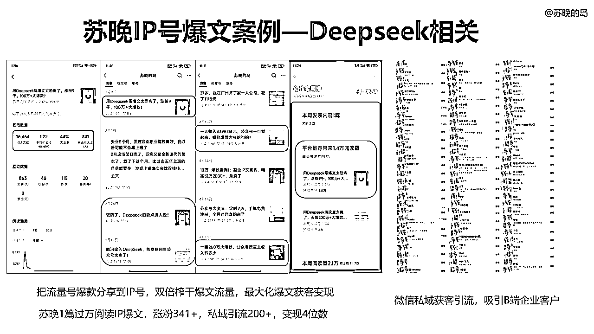
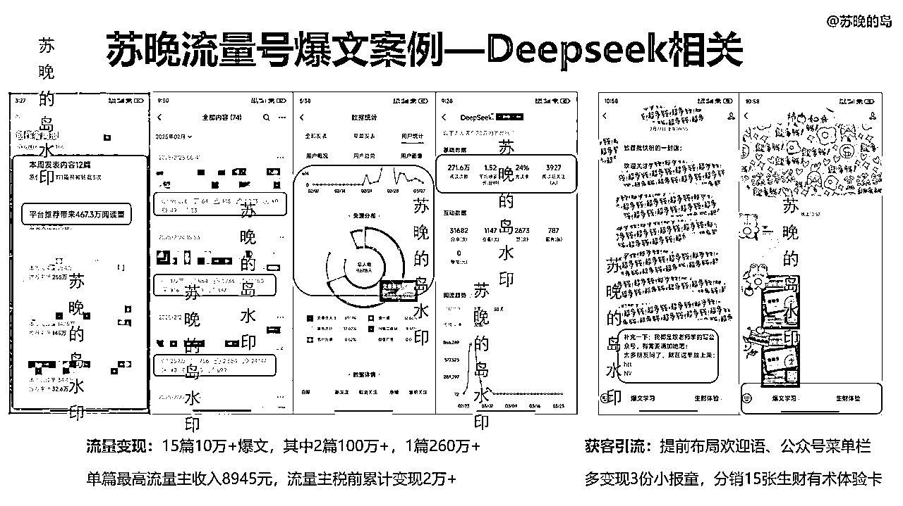
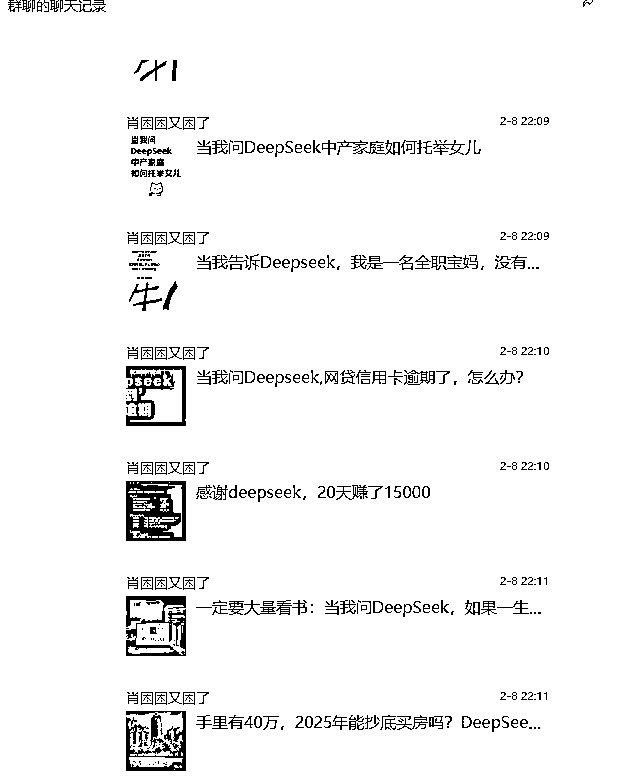
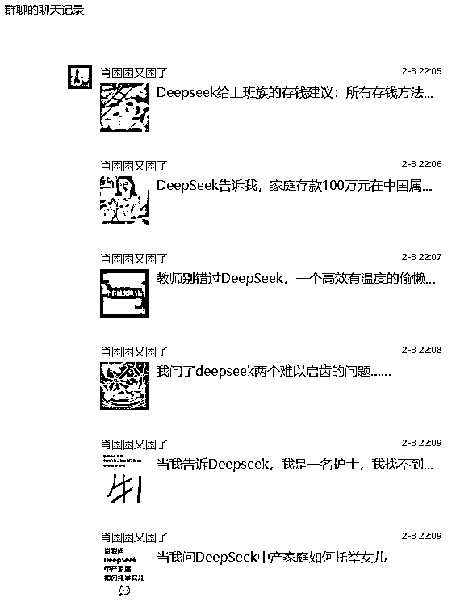
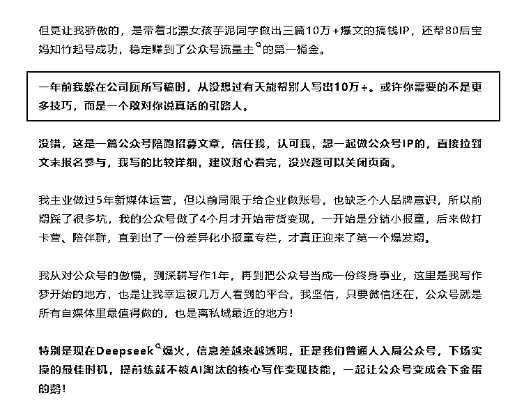
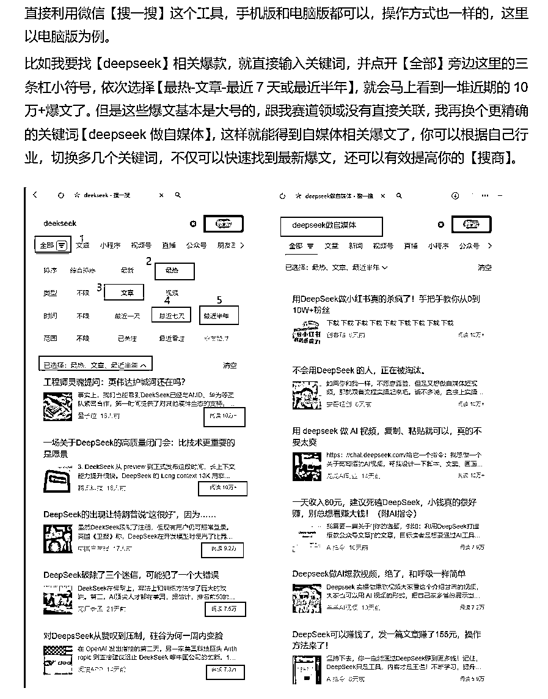
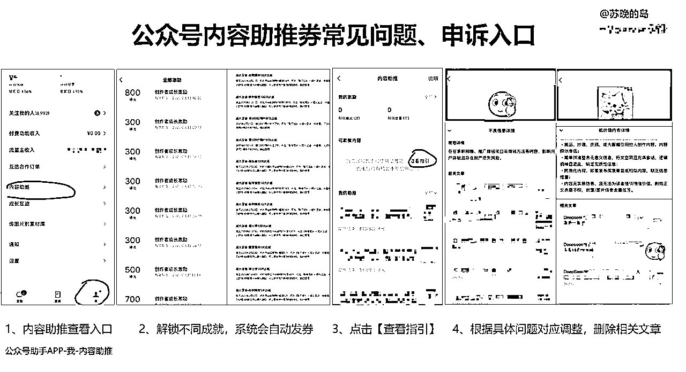
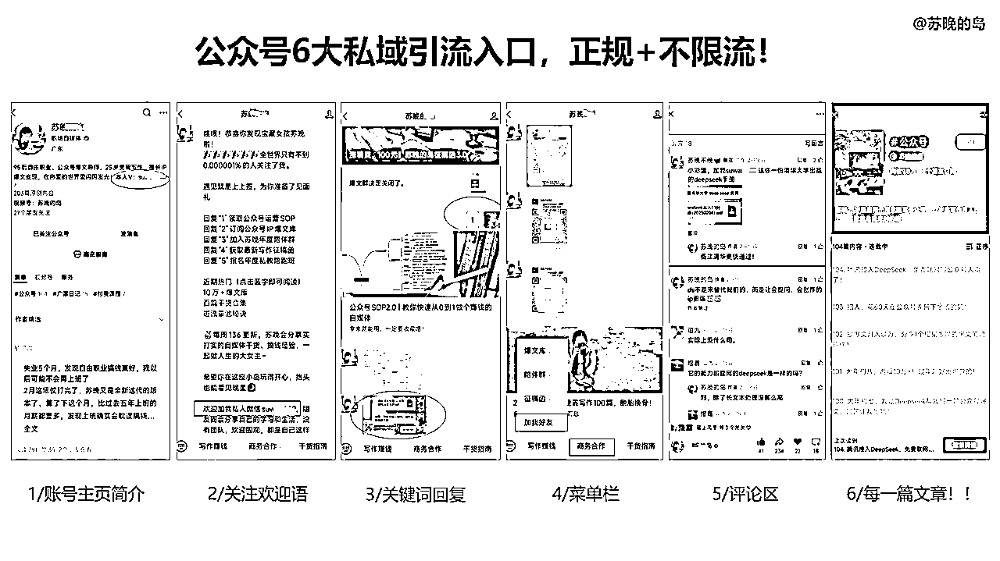

# 苏晚《我是如何用Deepseek写出3篇百万+爆文，12天涨粉9千，变现2万+》

> 来源：[https://l762hez4ol.feishu.cn/docx/JcyYdZy7FoFKcqxmHS3ck1fvnLd](https://l762hez4ol.feishu.cn/docx/JcyYdZy7FoFKcqxmHS3ck1fvnLd)

各位圈友大家好，我是苏晚，生财二年级生，95后自由职业，专注公众号IP爆文变现，我分享的主题是《我是如何用Deepseek写出3篇100万+爆文，12天涨粉9千，变现5位数》

## 背景介绍：

我主业5年运营，之前都是给企业做号，两年前才开始下场做自己的公众号，下班死磕一年后副业转正，跟着生财航海做过小红书电商、公众号爆文这两个项目，都拿到了一定成果，其中小红书这块还拿到了精华帖。目前专注公众号爆文赛道，初期靠IP爆文冷启动卖出1300份小报童，跑通0-1MVP，正在冲刺1-10阶段。

从今年Deepseek爆火后，公众号也跑出了很多爆文，我察觉到这是一个巨大的机会，因为就连我老家村里的堂妹（一枚全职宝妈）都来问我怎么用AI写公众号了！所以上半年，在25年2-4月期间，我借助AI做公众号矩阵（流量号+IP号），写出3篇百万爆文，单篇最高阅读量260万+，12天涨粉9千，流量主税前总变现2万+，当时正值生财418拉新期，我还用这个流量号成功分销了十几张生财体验卡，获客引流效果很不错！

这个过程也并非一帆风顺，我完整经历了几个流量周期，有高峰有低谷，连爆一个月后流量下跌，所以这篇会同步分享用流量助推券的优势与弊端，被踢出流量池后如何申诉调整方向，全都是我的实操经验精华，相信看完一定会对你怎么做公众号爆文领域有所启发、助益。

## 解决5个问题：

1.  用Deepseek怎么写出更多公众号爆文？我的写作指令分享

1.  用Deepseek写爆文会限流吗？要不要用助推券？限流如何优化？

1.  流量号：如何利用爆文泛流量，实现精准变现？

1.  IP号：都是1万+爆文，如何实现涨粉、变现都翻倍？

1.  如何利用AI抢流量，赋能公众号矩阵，实现一鱼多吃？

## 目录大纲：

一、我用Deepseek做公众号矩阵的底层逻辑

1.1 公众号矩阵的整体布局思路

1.2 AI助力公众号矩阵的核心价值

二、如何用Deepseek写出3篇100万+爆文

2.1 我是如何让流量号10天涨粉近万的

2.2 怎么用deepseek写稿，我的指令分享

2.3 怎么找deepseek爆款选题、对标账号

三、用了助推券后，出池、账号待优化怎么解决

3.1 被踢出流量池后，如何申诉，调整重心？

3.2 助推券能不能用？账号待优化了怎么恢复

四、如何最大化榨干流量，赋能公众号变现翻倍

4.1 流量号提前布局产品，也能变现引流

4.2 IP号分享爆款案例，精准获客变现

## 正文：

# 一、我用Deepseek做公众号矩阵的底层逻辑

首先是我做公众号矩阵的前提背景，苏晚已经在公众号跑通1.0阶段，并在靠谱姐建议下调整了商业定位，专注公众号爆文变现，具体可以回顾我上次在生财发的帖子：

https://wx.zsxq.com/group/1824528822/topic/5121482544551154

需要明确公众号起点一定是变现为主导，要么前期流量主变现，要么围绕产品体系来，比如我的是：爆文拆解专栏、爆文变现课程

现阶段，我一方面需要测不同赛道爆文案例，二是带更多学员出成果案例，放大IP势能，三是公众号流量不稳定，做多几个账号可以分散风险

## 1.1公众号矩阵的整体布局思路

我的公众号矩阵包括：

*   2个IP号：苏晚的岛、苏晚姑娘

*   4个流量号：专注不同细分领域的泛流量变现+引流IP号

公众号矩阵布局的核心优势是风险分散和流量最大化。因为流量池推荐是不稳定的，当某个账号遇到瓶颈或限流时，其他账号仍然可以保持稳定增长，实现整体收益的稳步提升。

流量号主打热点爆文，快速出爆文案例，吸引大量用户；IP号注重人设打造，提供有深度的内容，实现高转化率。两者可以相互配合：

*   流量号引流到IP号

*   IP号沉淀精准用户

*   流量号测试选题，IP号深度变现

这种策略让我能够在保持核心IP价值的同时，不错过流量红利期，实现精准变现。

## 1.2AI助力公众号矩阵的核心价值

我目前用到最多的两个AI辅助工具：Claude、Deepseek

AI对我的矩阵布局有三大核心价值：

*   内容创作效率翻倍：一天能产出3-5篇高质量文章

*   多领域选题扩展：快速进入不熟悉的领域，缩短学习曲线

*   爆文公式复制：成功模式可在不同号之间快速复制，带学员出更多案例

相当于多了一个超级AI助理，让我能够专注于高价值决策（选题、定位、变现策略），而将执行层面的基础工作交给工具，更快地拿到爆文成果。

这里我也要纠正一个误区：有了AI，人人都能成为爆文高手吗？显然不可能，AI有个很大特点，就是遇强则强，遇弱则弱，想要用它持续获取公众号流量，依然要大量实操，手动修改，提升最核心的内容原创度，这也是自媒体IP的护城河。

虽然这篇主题是讲Deepseek，但现阶段我用最多依然是Claude，因为我个人用下来，前者的成文效果已经越来越差，生成的内容也越来越雷同，对比之下Claude成文流畅、上下文修改衔接合理，虽然要付费，但这个钱花的很值，这里我也要感谢杨涛涛哥的建议，我就是参加了生财广州线下聚会，听了涛哥工作流建议才决定用Claude的。

写IP类文章，主要利用Claude拓展大纲要点、思路延伸，给到选题和要点基本可以生成60分初稿再去修改，加入自己的经历、故事、案例，手动修改20-30分钟左右，这样朱雀大模型检测出来AI度为0%；流量类文章，一开始想快速成文，但一次成文的效果，原创度不高，后续调整了很多次提示词也不行，甚至手动修改后原创度更低的情况（用的是易撰检测），也提醒大家原创度不够千万不要标记原创，腾讯平台能检测出来的，所以目前还是按IP文的写法来写流量文，每篇成文+手动修改大约30分钟，当然也可以写不标原创类的，这种就更快。

# 二、如何用Deepseek写出3篇100万+爆文

从春节deepseek爆火开始，我就用它研究写公众号，做了一个新的流量号，一开始是给队友练手发的，看到有几百阅读量后我才接手，结果半个月就跑出了3篇100万+阅读的大爆文，最高一篇260万+（相当于26篇10万+了），这个号也涨了9千多粉，光是流量主变现2万元（税前）。

爆文流量真的很可怕，两周时间就超越了苏晚大号一年的涨粉量，两个公众号加起来的月收入第一次突破我的最高值。虽然小号大部分是泛流量，不是精准用户，但却是一个特别成功的爆文案例，价值多多，最后也会分享怎么榨干它

所以我也坚信只要你认知和行动都跟上来，真的可以在公众号做成一个事业，我自己就是这么走出来的，花一年多时间做到了，以前打工5年都做不到的事情——让自己月薪翻倍，我就是这么一脚泥巴磕磕绊绊走出来的，哪怕踩了很多坑

虽然流量号是不公布的，但我可以用自己实践出来这个流量号，分享实操思路和方法！

## 2.1 我是如何让流量号10天涨粉近万的

公众号爆文界有句话，叫做选题定生死，选题包括主题+标题，直接决定了这篇文章能在赛马机制里跑到多少流量

我拿到3篇百万爆文这个成果，最最重要的就是找准爆款选题【deepseek+存款】，而且是跟平台风口热点紧密相关的！爆文内容几乎都是用AI写的初稿再手动调整，DS生成的内容还有很多数据错误的地方，经不起推敲。

这些选题文章能爆，一是受众基础大，二是最重要就是踩中了当时腾讯大力推deepseek的风口，有点应了那句话，站在风口上，猪都能起飞。

我之前也在群里分享过deepseek低粉爆文选题，我完全就是对标着最近一两个月爆款选题去写的，金钱存款相关的，没想到就爆了，爆了后核心动作就是继续出系列文章，跟爆文，有篇一天就冲到百万阅读，根本不敢停下来。

就是截图里的这类爆款对标选题，都是手动刷的：

#公众号爆款案例

最近deepseek爆火，我汇总了一批低粉爆文🔥🔥除了文章，还有不少发小绿书的，这些提问选题可以参考，也可以迁移到你的行业里

不知道你们发现没，从今年开始，腾讯在全力推广deepseek，全民化的信号，我那段时间刷手机公众号朋友圈还有电脑，就看到很多腾讯元宝的广告，这就是微信在疯狂释放的信号，所以在公众号上这一类内容会得到大量推荐，你能提供平台需要的内容，那平台才会给你流量倾斜呀，就是这么个原理

而且这个小号爆的中途突然停过一天流量的，从每天几十万推荐量突然掉到只有几万，然后隔天突然又被推了上百万阅读，估计是微信后台有在人工助推的可能，因为一般超过10万+就会有人工介入审核了

以前我觉得做IP号就行了，但是这次做小号的经验，也让我更加清醒，要时刻跳出舒适区，因为流量都是有周期性的，不可能一直在一个号上，这一个暂时没流量，那你可以去布局其他的号，多一个号，就多一个收入管道，毕竟一个号有一万，两个号就是两万

新手前期没特长没技能，那可以先做一个流量号练手，集中所有精力和时间来做爆款，再来慢慢转型或者起新的IP号，我亲自实践下来，做成一个号后，再来做第二个号就很轻松，而且比带人起号快多了哈哈

特别像我们这种农村草根出生的孩子，没有家族引路人的指引，也没有商业认知，一切都只能靠自己，那就需要付出更多的时间和行动，但现在deepseek出来后，对普通人打破信息差是非常友好的，你可以借助它看到更大的世界

我从下班后做公众号已经快两年了，才刚刚找到一点门道，但做新号只花了一周就快速涨粉近万，这是积累的能力，如果你不去实战，就永远没办法进化，没有自己的选择权，实践出真知。

最后补充下重点，我的流量号能12天涨粉9千多，也得益于我用IP号的思路去做流量号，在公众号简介、每篇文章开头都加入人设介绍、故事背景，正文（特别是开头和文末）用了很多金句引起共鸣，选题内容也都是正向为主，文末和留言区积极引导互动，这样才达到流量文也能快速涨粉的效果，突破了很多人都困扰的【流量号涨粉困难】的魔咒。这块后边IP号也有详细的案例要点。

## 2.2 怎么用deepseek写稿，我的指令分享

第二是关于怎么用deepseek写稿，其实真的很简单，没有很复杂指令，大家不用太迷信指令，我都是给他一个主题，让他生成大纲，觉得大纲没问题了，再模仿我风格生成内容，然后手动修改，重点还是手动修改的部分。

给Deepseek下指令时，我用的这个模板：

写一篇公众号爆文，主题是《用Deepseek写爆文太疯狂了，3篇100万+，收入5位数（附指令）》，通俗幽默，传播正能量，多用热梗金句，说人话，2-3个案例，重点讲怎么做，1200字左右

这个简单模板就能让AI生成50-60%可用的内容，剩下的人工重点调整即可。

其实我一开始用deepseek的时候，也非常别扭，我觉得它生成的文风和内容过于机械完美，我想在他初稿上面去修改，都找不到可以改的地方，而且这个过程比直接写要花更多时间，写着写着感觉都不像自己的文字。

关于提高AI输出质量的几点技巧：

（1）我直接用它来生成不同的开头灵感，没灵感的时候，用它来拓展思路真的很不错，下面这句话，就是deepseek帮我写的，特别戳中我

以前写一篇文章，我需要打开五六篇参考文章，看完不同思路去总结提炼新大纲，但是ds可以直接生成N个不同的大纲要点，然后我在大纲上去修改完善，这个过程确实会帮我减少很多低效重复的工作

（2）还可以把你写好的人设文投喂给AI，让它总结你的写作风格、故事经历，增加内容独特性，生成新的指令，并根据生成效果，不断调整指令，这也是在训练你的改稿思维，确保加入自己的观点和思考，不要完全依赖AI输出

（3）每天用AI，就不用再等有灵感才能写，把AI当作你的24小时创作伙伴，而不是偶尔求助的工具。每天至少花30分钟对话，探索不同的创作角度。

在我大量尝试中，发现公认的写公众号最好的工具是Claude克劳德，这也得益于参加生财的广州线下活动，当时杨涛-涛哥强烈推荐的，我用它协助写IP文效果很不错，初稿能打70分，如果你有条件（需要科~学~上~网。），一定要用起来，特别是做IP，只要你坚持每天去用的话，就会越用越顺手。

当然，用AI写爆文并不意味着你什么都不用做了，相反对创作者的要求更高了。毕竟AI只是放大你已有能力的工具，而不是替代你思考的魔法。

（4）想用好deepseek其实更考验你提问的能力，能够精准地表达自己的问题和卡点，或者说释放自己的真实情绪，多去问为什么怎么样，引导ds给你想要的答案，甚至在你情绪不好时，也可以去让它来激励你，语言系统很治愈，可以给我们注入新能量

这个提问能力也不是凭空产生的，我自己就是在大量的写作中，倒逼自己去思考，怎么解决问题，怎么拿到更好的结果，写下来那一刻，你就有了答案

## 2.3 怎么找deepseek爆款选题、对标账号

第三个重点，就是怎么找deepseek爆款选题，对标账号，有效提高自己的【搜商】，因为我发现很多人都不知道要怎么搜，或者是只搜了一两个关键词，找不到就放弃了

虽然deepseek也可以，但我认为现在最快捷准确的方法还是在微信搜一搜，主动去搜索关键词，找到最近7天或者半年的爆文，这种可以当做爆款选题，然后你再点进账号主页，如果它原创篇数只有几十篇，但是过万爆文非常多，那这个号就是低粉爆文对标账号，很有参考价值，可以重点对标！

包括我每次起标题前，也会大量去搜同类标题，去疯狂对比差异点，怎么让自己的标题更好，长期保持锻炼手感，打造自己的一个核心能力，所以写起文章或者是帮学员起标题，才能看起来毫不费力，就是把你起标题的痛苦多经历一百遍后，就不再是痛苦啦！

其实工具都是多用就熟了，关键还是看用它的那个人，大量的练习，大量的实践，大量的行动，在每一件小事上打磨，一定能够收获你意想不到的结果

# 三、用了助推券后，出池、账号待优化怎么解决

## 3.1被踢出流量池后，如何申诉，调整重心？

很多人担心AI内容会被限流，根据我的实操经验总结了几个解决方法：

（1）微信公众号目前并不会针对AI内容特别限流，反而是在推广Deepseek相关内容，重点关键是你的内容质量、原创度、用户互动，而非生成方式，哪怕纯手搓的，该掉池一样也会掉池

（2）我的流量爆文都是AI+人工修改的混合模式，建议每篇文章增加20-40%的人工修改，加入个人经历和独特见解，从我的数据来看，只要选题和内容质量过关，AI生成内容依然可以获得大量推荐流量。

（3）这个小号是用了助推券的，但在跑出3篇100万+后，也被踢出了流量池，并且显示低质量内容，不能再用助推券，我的方法是删除那几篇低质量文章，再发起申诉，第一次申诉没通过，文章数据也掉回到了几百阅读，几乎没有推荐量了，这时候我调整更新频率，停止日更，一边重新测爆文，同时重点去做另一个小号，相似的选题继续发，也跑出了一篇5万+爆文，这也是提前做矩阵的优点，毕竟流量号的生命周期普遍是3-6个月左右，所以不用太纠结这个号废了怎么办，停更一段时间，可以转型IP号，或者再去重新测，等待下一次进池，重点是另一个新号，东边不亮西边亮。

## 3.2助推券能不能用？账号待优化怎么恢复？

公众号推流机制一直在改，今年开始大力扶持新号，针对万粉以下的新号小号有流量助推券功能（灰度测试，大部分小号都有，解锁一定成就比如点赞10个、收藏20个、关注100个等都会直接送流量助推券）

那么助推券到底要不要用？前提是如果你内容质量原创度过关，在初期可以使用，但不是必要条件，我有不少学员都是用了后跑出爆文的，也有很多用了后就被限流、账号待优化的。

那么用了助推券后，出现账号待优化，怎么解决？这里我整理了社群里大家不同反馈情况提供参考

1、这个分很多种情况的，要看你待优化那里具体是什么，要点进去查看，常见的就是低质量内容、涉嫌推广引流等，这时候先把相关的文章删掉，太多的话就分批次删，有可能第二天恢复，也可能一两周才恢复，具体多久每个号都不一样（每个号违规严重程度也不同）

这个也跟最近平台的清朗运动有关，在淘汰那些用AI东拼西凑、为了流量故意博眼球、无价值无营养的账号，把更多的流量分给真正有质量、原创度高的账号

2、如果拿不准内容质量问题，引流问题，而且文末还放了二维码的话，建议尽量不用助推券，大部分情况来看，只要用了肯定都会有一定审核风险，也可能会被系统误判。

我这个百万爆文小号前期用了流量不错，后边就被提示「低质量内容」，可能也是发的几个选题比较相似吧，也用了AI辅助创作有关，所以就按步骤删文，申诉了两次，后边就没有申诉入口了，现在流量也还没恢复，但这个需要时间更新优质原创，大家也不用太担心号会废了，其实是正常的流量周期，应该很多小号都有遇到。

有群友表示，放小报童的购买图，平台都会判为营销内容助推不通过，不放就能通过，所以可以理解为平台助推券只推优质原创内容，不给做商业宣传推广。

3、拿不准的，一律建议不用，用了助推券以后会引发人工审核，有时候申诉也没用。有的刚开始低质量内容是一篇，申诉以后又变成好几篇了。大原则就是坚持更新优质原创内容，不要有营销信息或者引流信息，像如果每篇都放微信二维码和钩子这种有引导关注引流属性的，就尽量不用助推券，因为如果不用助推券，那想怎么引导都可以，微信二维码叠加带货二维码都不会影响推荐，总结来说，不用相对更安全

总之，只要不是被判违规，账号恢复推荐关键在于：重新提供高质量的原创内容，减少过度营销，增加用户互动性。当平台发现你的内容再次获得用户欢迎，通常会重新纳入推荐算法，如果连续半个月都是0推荐，建议可以停更一段时间再看看，也有的停更一个月还能重新进池的，还不行就换赛道重新测试。

# 四、如何最大化榨干流量，让公众号变现翻倍

毫不夸张地说，自媒体的尽头就是公众号，这是私域转化最丝滑的平台，没有之一，任何赛道、行业，都值得用公众号再做一遍。

因为一个公众号，至少可以布局6大私域入口，全部正规还不限流！每篇文章还可以插入微信号+二维码，写了200篇，就相当于买了200张流量彩票，拥有200个免费且优质的广告位，一旦爆了就可能被几千几万甚至上百万人看到，同一份时间可以卖出无限次，产生源源不断的睡后收入：

那么，如何最大化榨干公众号爆文流量变现？这里分享几个苏晚的独家技巧！！

## 4.1 流量号提前布局产品，也能变现引流

很多人对流量号有误解，除了可以流量主变现，还可以是引流工具，本身也有很强的变现潜力，关键是要提前做好变现规划，包括设置好引流路径、准备好转化产品，这样一旦爆了后，就能最大化承接爆文流量

这是我提前布局好的变现引流方式：

*   开通流量主：我的260万+阅读量爆文流量收益单篇近9千元

*   设置公众号菜单栏：引导购买我的小报童专栏、生财有术体验卡

*   在欢迎语预留微信号：筛选精准流量，私域转化

*   文末留言互动引导：插入往期文章，引发二次讨论转发，建立信任关系

## 4.2 IP号分享爆款案例，精准获客变现

IP公众号是我变现主阵地，通过分享爆文案例建立专业形象，一般精准话题IP文，阅读量1w可以涨粉100-300，引流私域50-150人，这个量也取决于文章质量和获客渠道完善度，我也见过单篇万阅爆文能涨粉1000+的。

IP号的核心竞争力在于人设故事、真实案例和实战经验，通过分享我用Deepseek创作爆文的经验，让用户看到实际操作和真实结果，大大提高了信任度和转化率。

公众号每一篇文章，都可以是自己的广告位，好的IP文，篇篇是广告，却又看不出是广告。经过一年多实践，我总结出了一套万能的IP爆文涨粉公式：痛点 + 解法 + 案例 + 价值观

例如我这篇IP爆文标题《用Deepseek写爆文太恐怖了，涨粉9千，100万+大爆款！》，就比平时同样1万+阅读量的爆文，涨粉、引流都多了三四倍：

·开头挖痛点：涨粉难，不会用AI写爆文

·正文提供解法：两个具体可行的方法

·真实案例：我个人的真实经历和爆文打磨过程

·价值观：永远不要低估，以年为单位的成长

我甚至都没推产品，就是在文章结尾加上固定产品模版，但所有内容都和我产品相关，爆文相关，不仅直接多卖了几十单小报童，还能涨粉350+，私域引流200+

还有我最近发的一人公司选题爆了一篇，私域也引流了近200人，其中有不少创业者，甚至还接到了企业B端的合作单子，目前还在洽谈合同条款，这里也要感谢靠谱姐建议我多发这类选题，来吸引高客单老板人群。

这就是IP文能涨粉获客翻倍的魔力，只需记住这5个核心要点：

▪️讲好人设故事

▪️输出情绪价值

▪️晒成绩，专业背书

▪️文末多用金句升华

▪️预留好产品、钩子

### 

不停测爆文的目标，也是帮助更多人快速跑通爆文变现闭环，我认为要利用公众号精准获客引流，更重要的是让掌握制作爆款的核心能力和手感，所以哪怕Deepseek能辅助找爆款，但我还是会建议大家每天至少刷30分钟爆款，建立爆款选题库，同时我也另外建了两个只有自己的对标小群，一个是流量号对标，一个是ip号对标，每天只发最新低粉爆款对标，每周定期整理，主要是为了提高爆款网感，这是每天必做功课，也是AI替代不了的核心竞争力。

爆款流量是IP个体最大的尊严，以后公众号流量很快也会像小红书一样越来越卷，越来越贵，特别是天花板高的赛道，越早布局，越早占领生态位，因为自媒体卷到尽头是私域，离私域最近的就是公众号，还能联动视频号直播，把微信生态都利用起来，这里是真正能够留存客户、留存铁粉、留存口碑的地方。

我就是通过公众号写作，开启一人公司，拥有了一门可以富养自己一辈子的小生意，哪怕再小，但只要学会了用这个技能独立赚钱，就再也不用担心失业、裁员、中年危机，用IP撬动十倍、百倍、千倍、万倍的价值。

以上就是苏晚的分享啦，有收获就点个赞给我鼓励下，也欢迎留言指正，希望大家都爆文多多，财富暴涨！