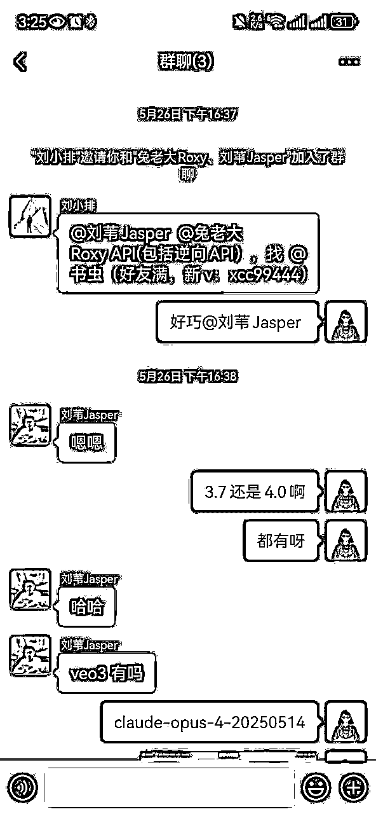

# 产品新人如何从0-1在1个多月拥有1000+个用户

> 来源：[https://bwvzbvg3i3.feishu.cn/docx/Ji5GdGVjwoLr6Fx1h8LclSrUnLc](https://bwvzbvg3i3.feishu.cn/docx/Ji5GdGVjwoLr6Fx1h8LclSrUnLc)

我是书虫，关于我自己的既往经历不重复讲述了，大家可以看一下之前的复盘贴

# 结缘

在418生财直播的时候，有幸和小排老师、Albert哥、黄亮大哥、条形马老师一起在会议室里面聊了很久，都在交流产品的时候，因为我清楚我原产品安全上可能有点问题，小鹅也借机让他们给我看看，看了以后让我早点关掉吧....

这个产品用户量确实不小，总人数一共有40w+，目前还在期的1W+，虽然还有其他项目的收入，但是这个还是占比比较大的，确实肉疼，还没弃，现在不推广也不宣传就干放着。这个产品也是一共有三个人一起弄的，自己也不是主开发，没有完全的决定权~

和他们聊了一些以后，聊到之前3月底有个4o画图吉卜力特别火；有需要这个API模型，而我正好有，并且价格便宜稳定，我就说可以找我。

我说价格0.02一次，都说那么低，后续有机会可以合作，也有幸在那会可以认识那么多位大哥成功链接上，过了几天和Albert老师约了一顿椰子鸡，吃饭的途中也聊了很多

我太习惯一个人单打独斗了，之前基本都是一个人，他就给我讲了一个例子，我印象真的特别深刻，他说如果你是一个年入百万的，就不要去做那些很基础的工作，你可以算一笔账：

一年工作12个月，每月22天，每天10小时，那么你的时薪大约是378元。

那么，做任何低于这个时薪的工作，都是不值得的。

事实上，绝大多数工作在BOSS直聘上都能找到人来替你完成，真正重要的是，要做那些无法替代的事情。

那时，我突然明白了，过去我总是陷入一个误区，觉得自己必须能做所有事情，什么都想学，什么都想会。

这种想法让我没办法从大量重复性机械的工作里解放出来去思考战略，思考发展，甚至没有时间出去交流，导致我错过了许多机遇。

一个时薪378元的人做着时薪40的工作，在这商业上其实是一种不道德

自己美其名曰说单打独斗，其实就是不愿意付出金钱的成本去尝试，殊不知时间成本更贵！

一个创业者百分之七八十的时间都在做重复琐碎的事情就很没必要；把一些重复劳动的，或者有专门的人可替代我去完成这件事情，那我在这一部分的工作就能够释放出来

聊完以后，也没有闲着，自己那会想做的就是AI自媒体（公众号）一类的、还有就是根据他们的需求，我就想重新做一个好的API集合站

能做这个产品也是刚好自己在这个行业待了蛮久，23年就开始了，有相关的资源；就像小排老师的Ai图片站，他有他的A100，自己之前思路没有跑通，跟他们聊完以后也算是思路整理完了，并且觉得能做，于是就开始了~

上截图，到至今用户1158

# 1.产品搭建过程

## ①GitHub

自己的产品并不完全自己开发，自己是在GitHub上找开源的项目：https://github.com/QuantumNous/new-api，因为目前有还算成熟的，自己就找了相关开源项目去进行改，既然开源，那就肯定没有相关的人去专门给你服务，遇到问题基本也要自己解决，加了QQ群也没有人会特别给你服务

## ②遇事不决问AI Chatgpt和Claude辅助

自己会一些代码，同时也善用各种Ai软件，ChatGPT、Claude基本能够解决我大部分的问题，自己跟Chatgpt聊天的时间基本也在8小时以上了；实在解决不了的，就按Albert说的找专业的人给自己处理，自己一点一点去完善产品

下面是跟ai聊天的冰山一角

技术人员首先从自己身边的朋友去咨询，哪些朋友会哪些，找他们帮忙，他们帮完忙以后，要懂事的发个红包，尽管关系好也要

## ③不完美主义

在产品开发过程中，我渐渐意识到，和我之前做过的项目其实并没有太大不同，最关键的还是要行动，先做出来。

即使有很多问题，先让它运行起来，接下来慢慢修复。

在创业的道路上，最常见的陷阱就是完美主义。很多人因为害怕产品不够完美而迟迟不敢推出，结果错失了市场的风口。其实，真正的成功并不是从一开始就完美无缺，而是敢于行动，敢于冒险。

完美的时机永远不会来，市场的需求也永远在变化。你所认为的完美，可能别人根本不需要。

与其把时间浪费在无休止的优化中，不如先把产品推出去，哪怕它只是一个“坨屎”。

当它一旦进入市场，你可以从用户的反馈中不断迭代，不断完善。每次更新和改进，才是产品走向成功的关键。

很多伟大的公司，都是从一个“不完美”的版本起步的。例如，Facebook最初也只是一个简单的校园社交平台，后来才发展成全球最大的社交网络。它从来没有追求完美，而是勇敢地跳出舒适区，快速上线，边跑边调整。

其实，不完美的产品同样可以运行、可以推广，可以开启第一波冷启动。‘行动胜于完美’，只有开始了，才有机会改善；只有做出来，才会有客户反馈。

客户的声音才是快速成长的捷径，自己去预设的困难和问题大部分都是自己虚构的，真实的客户反馈才能让产品有核心优化的点。

# 2.产品冷启动（如何获取种子客户）

## ①拆解对标

国外：https://openrouter.ai、https://replicate.com/、https://www.together.ai/、https://fal.ai/

国内：能做的比较大比较全的几乎没有，而硅基流动只有国内大模型，不包含国外的

在国内外市场的差异中，我们常常看到一些行业的“进化论”。就像谷歌与百度的差距，前者是全球搜索的巨头，后者则在国内牢牢占据市场份额，然而在国际化方面，百度显然还远远不及谷歌的全局视野。亚马逊与淘宝的对比也是这样，亚马逊作为全球电商领头羊，致力于全球布局，发展多元化业务，而淘宝的核心依然集中在国内市场

这就像AI行业的现状，国外的一些平台如OpenRouter、Replicate、Fal.ai，已经在这一细分领域占了一席之地。然而，国内的有做相关的平台仍然处于相对混沌的阶段，我就觉得我有机会，所以执行力拉满了就干了！

## ②微信私域

看了我文章刚开始做的那个产品，所以我肯定有一些私域用户的，但是都是Ai，但是这两种需求人群几乎是不一样的

客户端人群画像：内容创作者、学生、教育工作者、老板、客服代表、营销、职场人士等等

API人群画像：软件开发公司、独立开发者、SaaS平台提供商、自动化工具开发者、支持API接入等平台、大型公司等等

所以自己的客户只有一小部分是重合的，但是几乎用户人群得重新找，几乎又是从0开始出发，不过冷启动也算足够了

## ③公域平台扩张

微信公众号：自己微信公众号也开始做了AI相关的内容，我相信未来还是Ai的，但是目前Ai流量变现渠道还比较窄，我所获得的信息告诉我，一定要有自己的产品，有了AI相关的流量以后，自己能够创造产品，有流量，有产品也能够迅速去验证需求，最低成本去试错。

能够成为我订阅者的，信任成本也会也会降低很多；同时，目前人们对AI有一个共识，我感觉也是各种AI所带起来的，现在人们对AI的理解就是，用好的AI我们就应该付费！因为算力很贵！

因此，我开始寻找合适的写手帮助我创作内容，直到现在，我们已经发布了七篇文章。

自己找写手的方式是：在自己的社群先发布相关的信息，对写手能力有什么要求，然后自己想要对标哪些公众号，报价如何，然后试稿一篇。社群如果不满足自己的情况下，朋友圈再发一篇就可以了，筛选下来基本能找到符合自己想要的；没有自己私域的伙伴，小红书发个招募贴是个不错的方式

然而，流量增长还是较为平稳，没有明显的优秀数据还未迎来爆发式增长。

不过，因为我以前大量的做项目的经历，我已经能够去承受这种长期没有正反馈的过程，我知道这会是我想要去拿到结果前的一个必然周期。

在下一个风口来临前，我需要有足够的基建和准备才能够去接住。

例如像过年期间，DeepSeek这一波风口，有很多成熟的团队就可以在一个现象级的事件面前原地起飞。

即刻、推特：即刻和推特的玩法就挺简单粗暴的，自己有做朋友圈，所以自己只需要同步朋友圈内容就可以了，以及自己的产品都有什么更新，有变化都可以同步到这些上面增加自己的曝光

即刻：即刻的核心，我感觉在于发的时候，选好“圈子”发送，以及文案，seo上要刻意一点，这个App圈子比较小，但是用户人群都很精确，有需要的用户会找到你的

推特：推特看了之前阿西的帖子，自己也学习了一下，自己做的方式，就是有内容的时候可以多发，这个平台是鼓励多发的，自己除了发自己产品以后，也会发ai相关的内容，让人觉得你推特有价值，这是很重要的

还有一个小技巧就是，现在大模型生图的，蛮多能够生出一些擦边的图，玩推的人都知道，上面的内容尺度还蛮大的。所以发相关内容也能给推带来较大的流量，这种方式似乎也仅仅只适合推特，内容方式在推特上能带来较大的曝光

# 3.流量增长与放大

## ①口碑+转介绍

很多人最初认识我好像都是通过，最开始号贩子，销售plus会员，睁眼就是干，每天都好多用户，因为售后做的好，封号能够按天退款，口碑和转介绍也多，高峰时期几个月用了40多w美金

自己做API的方式也沿用了之前，自己做这行清楚的知道，稳定是最重要的，其次才是价格；

如果不那么稳定，那用户们宁愿选择稍微贵一点的，我很快就意识到了这个问题；所以为这个问题自己也是付出了不少努力。

一个模型为了预防突然出问题，自己一个模型最起码都是有三个备用的方式，出现问题会自动轮训，或者自己能够及时处理

其次就是价格，自己在这行两年，所以有非常多的渠道优势，自己也重新整合了一下资源，找了很多的朋友咨询合作才有了现在很不错的稳定性，还有比较不错的价格优势去争取客户

有机会链接很多的大佬后，他们使用不错后，也会给自己群里直接拉人，或者直接推V给朋友们，也非常感谢他们

## ②赞助推广

很巧，哥飞老师弄线下活动，招赞助商，我还没看见这条朋友圈的时候，葱哥就把这条朋友圈发我了

然后我就很积极的去把握机会，也成功争取到了

因为飞哥那边都是出海的玩家，结合主题，目前很多的出海玩家，几乎做的都是套壳产品，所以几乎都会需要API，也给自己产品争取更多用户

经过这一次勇敢去做这件事情告诉我，不要害怕去赞助付出很多高昂的成本

虽然成本是有，但是可以通过计算，你做这件事情roi是多少，你付出5万块，你能从这件事情里面收获多少，自己做这件事情的目的是什么，能否达到，如果都满足我们的目的，那就是合理的

记得涛哥和苏铁都跟我说过，不要害怕付出金钱，钱进兜里了，就不再愿意拿出来，只要投产比是合适的，其实都可以尝试。

验证市场需求是至关重要的，而最快的方式往往就是投入资金进行精准的市场测试。

通过付费获取流量，能够快速收集到真实的反馈，判断出项目的核心需求是否真实存在。

如果发现是伪需求，尽早放弃不仅能节省大量时间和精力，还能避免无谓的资源浪费

创业是一场试错的过程，花钱试错的成本是有限的，而时间一旦浪费，就再也无法追回。

用钱买时间，用时间节省未来的资源损失。这种方式不仅帮助我们更快地接触到真实的用户需求，还能帮助我们在市场中做出更精准的调整与迭代。

真正的风险不是试错，而是低效的延迟决策和错误的坚持。

## ③公众号投放

在我之前做gpt账号业务的过程中，我主动去链接了几乎所有的抖音博主，沉淀下来了很多客户，其中还和一个公众号大v成为了很好的朋友

在他来杭州的时候，我主动链接他并且一起吃饭聊天，他同意了接受我的付费推广

# 4.产品优化过程

## ①首页界面美化

自己慢慢做起来以后，小排老师就给我说，如果你不想只做一个草台班子，而是真的希望做成一个事业，或者说是做到国内头部，不应该再用现在非常简陋的首页界面

域名、名字、用户体验、交互、界面设计，这些自己真的都重新处理一遍

域名：这个从ismaque.org改成了api.apicore.ai api前缀+core感觉不错，让人一眼就知道你是干嘛的，并且ai后缀，据说做AI相关网站有天然权重，所以也是花了大几百重新买了，名字也是跟o3沟通了很多很多个来回进行决定的。名字就跟着域名也就决定这个了，英文也挺好的

交互、页面设计：页面设计自己重新做了一个首页，但是似乎还是不够好，用户体验和交互也是持续在完善，有用户反馈，和某一刻觉得不合适就改，这几项只要做产品，就得持续的去进步，目前还是有点low，给自己多一点时间应该会慢慢好的！

还是按最初说的，尽管很烂，先做一堆垃圾起来，然后慢慢优化，无论做产品还是项目，这个逻辑错不了！

## ②用户体验优化

葱哥也给我说，我有很多不好的地方，加大了用户的使用难度，都一点一点在优化

亦仁老大，在航海家群里面发的一个帖子，然后自己看了，一个关于模型漏斗的词，不要增加客户的使用难度，每增加一步，可能用户量和用户体验都在下降，也感慨，抖音打开就能刷，也算是做到极致了

目前我这个产品对用户体验并没有那么好，用户上手也是需要学习的，像国外的其实也要花时间成本去学习，但是会比我这个好非常多，有国外大哥走在前面，其实对我来说也是好事吧，有可以对标的对象

尽管一个产品是比较复杂的，但是仍然要尽可能的用户进来使用，要让他们上手就能够使用，而不是需要花时间去学习你产品，后面自己优化用户体验，也会尽可能的去减少使用步骤

持续努力中~

# 5.感悟与鸣谢

## ①贵人相助

小鹅、小排老师、Albert、葱哥、彪哥、黄亮哥这一个多月里面，他们好像频繁出现在自己的视野里面，给予了自己非常多的帮助，几乎遇到卡点，能够向他们请教学习，他们可以给你很好的建议和方向能够有个路径可以走，能少走非常多的弯路

感谢各位老师非常无私，真诚，开放的帮助我，更感谢生财有术这样好的平台，能够让我这样的小作坊接触到这么多热忱的大佬

能短期做的还不错，那么快有正反馈，真的离不开他们提供的帮助！

在杭州这边和小鹅在一块，这座城市真的也是一个加速器，能遇见很多很好的人，之前只能线上能够见到，在这边能够有很多机会能够线下跟他们交流，自己也获得了非常非常多的机会

## ②积极主动，才有故事发生

不管结果如何，至起码自己去争取过，产品做出来以后，除了私域、公域、赞助、投放等的推广，自己也还有主动去私聊一些大佬是否有需要API的使用，自己的优势在哪也会讲清楚，并且提供测试额度，满意了再开始用。被拒绝了不少，但是成功拉到了不少

自己还会主动去一些生财产品、出海一些线下聚会去积极参加，自我介绍的时候大大方方的说自己干啥的，有需要的话可以找到我

## ③从草台班子走向正规化，舍得花钱

自己以前做一个东西的时候，是不太愿意去投放金钱的，自己无论做项目、产品，基本都是想办法如何免费的去打广告，成长的速度就极其的缓慢，基本私域的流量推了第一波，就得看公域流量平台什么时候赏饭吃才能够有机会去做起来

后来才懂，钱不是花给别人的，是花给自己的未来。你不敢烧钱测试市场，就只能用时间去试错。花钱试错是成年人最快的成长方式。每一笔花出去的推广费，都是在买数据、买反馈、买认知——你不花钱，连试错的资格都没有。真正从草台班子走向正规军的转折点，就是那一刻你敢于为增长投钱、为产品包装投钱、为品牌认知投钱

你不投广告，永远只能等平台施舍流量；你不舍得成本，就别指望用户付你溢价。想明白了这一点，我开始做预算、找合作、谈付费推广。流量这件事，从来不是等来的，是抢来的；品牌这件事，也不是说出来的，是花出来的

有人说：省钱是保命，花钱是扩张。对，但创业者最大的成本不是烧钱，而是“不敢烧钱”。你把自己当乞丐，市场就不会把你当玩家。能跑通 ROI 的投放，哪怕是亏本买认知，都是有战略价值的

走出草台班子，第一步就是给自己立规矩、设预算、学投放。一分钱也不花的增长，早就被时代抛弃了；愿意花钱并把钱花得精准的人，才有可能玩到后面

## ④复利和积累的力量

我相信很多人认识我，是通过大学毕业存款百万那篇贴开始对我有了解，自己现有的金钱，资源，私域都不太像自己最开始的时候，虽然没有很多，但是能够支撑自己换种打法去试错；

自己再也不是像最初那样，因为省几十块钱不去买手机卡，耗不起流量而导致那会公众号项目引流停滞不前了，过去我省钱如命，却忽略了“积累的力量”；现在我懂了：“真正的财富，不在于你赚了多少钱，而在于你让每一份努力都有复利。”

复利不仅发生在金钱上，也发生在资源、经验、社群。不断积累的粉丝、信任、数据反馈，它们都会形成滚雪球效应。

## ⑤小步迭代，逐步优化

有幸前两天在广州一个聚会同时见到彪哥、杉木老板，说你这个在国内做空间还是太小了，你这个也可以出海呀，其实Albert也跟我说过，但是似乎听不太进去，自己路径依赖太严重了。

因为自己英文不好，始终会有一丝的抵触，并且自己有过套壳成功的案例，想着会复制之前的玩法

但是他们给我说了这个后，并且还给我指了几个点如何做，似乎思路通畅了很多，自己后续确实这个也要出海！国内市场虽然也不小，但是比起海外市场还是更为广阔

尽可能的做到两手抓，国内再给自己一些时间完善目前不足的点，并且继续持续推广，国外再做一个产品其实是可以一样的，换个壳子就行，全英文多语言一类，不出现中文。就是获取流量的方式不同，其他都好解决！

## ⑥目标用户和人群

自己很清楚自己的目标用户有哪些，API这个市场，其实不是一个大众赛道，我跟小排老师说用户能够有10w很不错了，两年的话，然后核心的话，我想为20-30家公司提供服务，b端用户才是自己最终想要的

## ⑦注册公司走正规化的开始

之前只弄过营业执照，只用于去申请xxxx的，并不能开发票，和公司公对公；

这次算是第一次弄正式的公司了，不懂的也问了两位老师，这两个月真的是遇到了很多很多的幸运和贵人，前进的路上基本都有人会帮助；不懂问老师、流程有人帮、细节有人盯，很多看似复杂的事情，其实只要你敢开口、敢试试，就会有人愿意教你。“创业路上最宝贵的资源不是金钱，而是愿意花时间教你的人。”