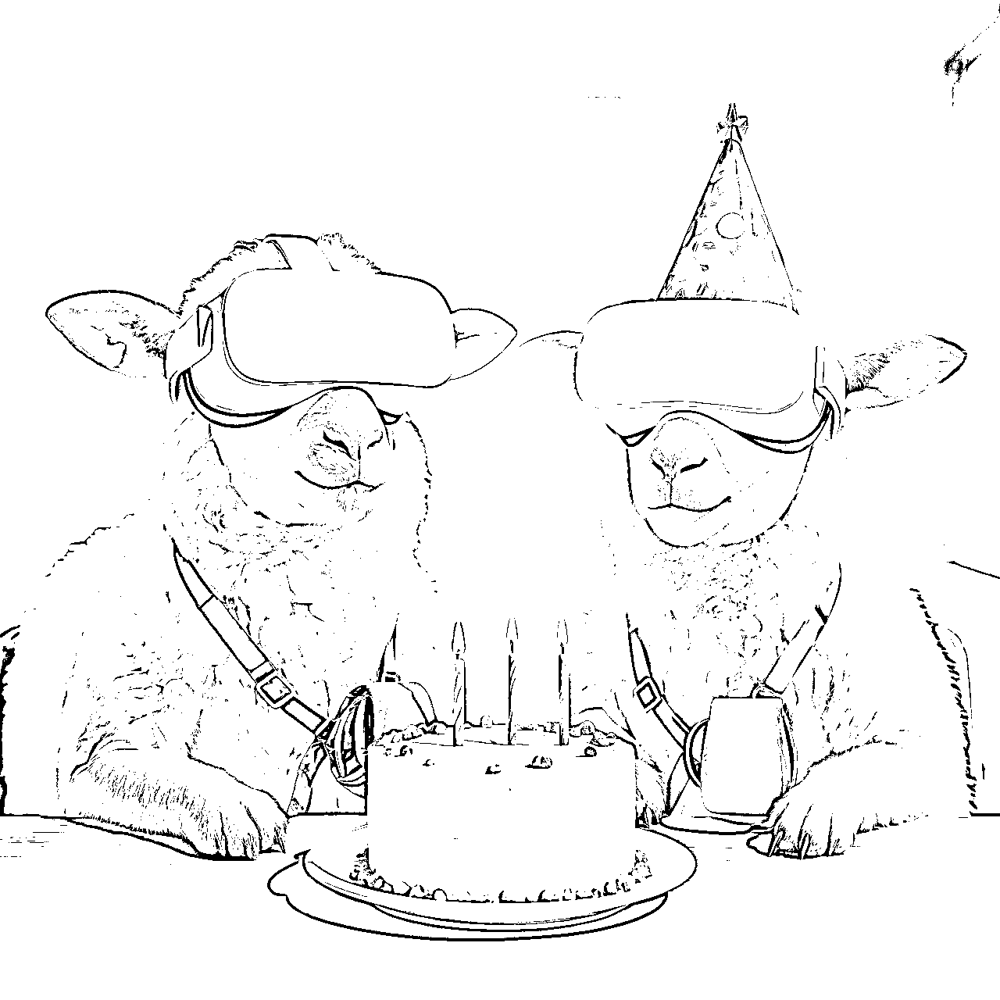
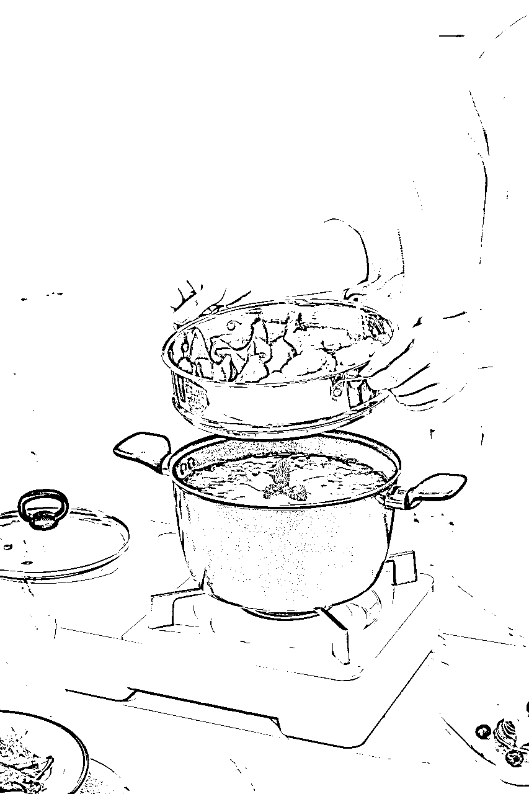
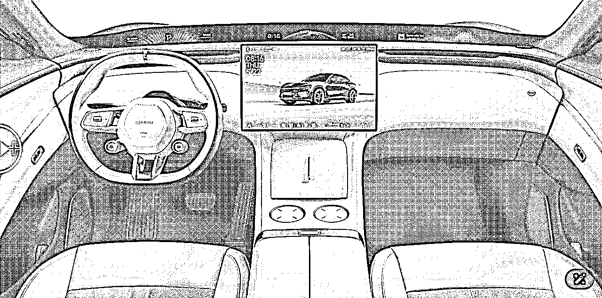
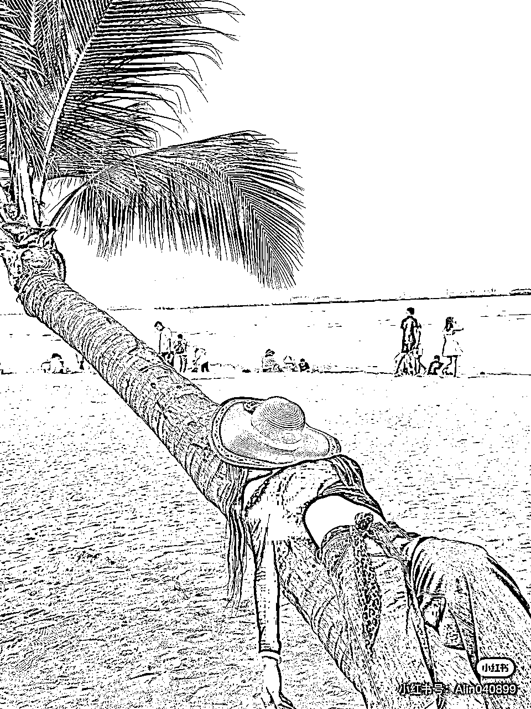
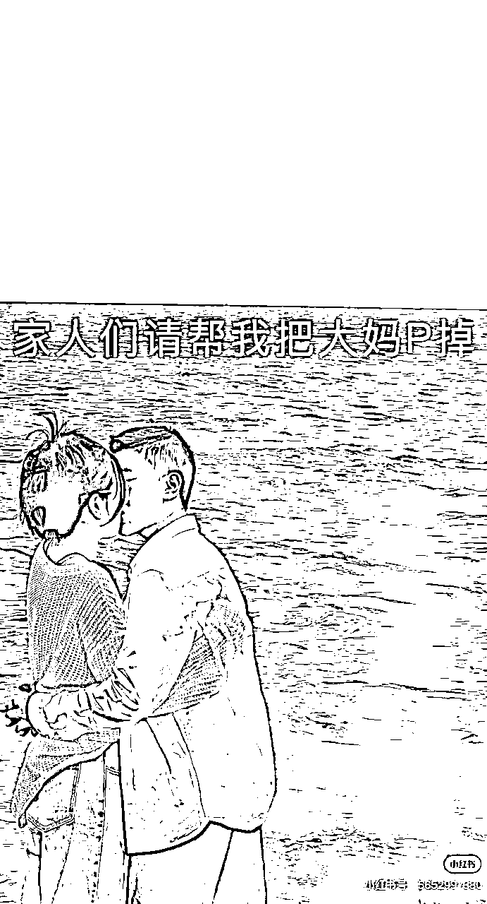
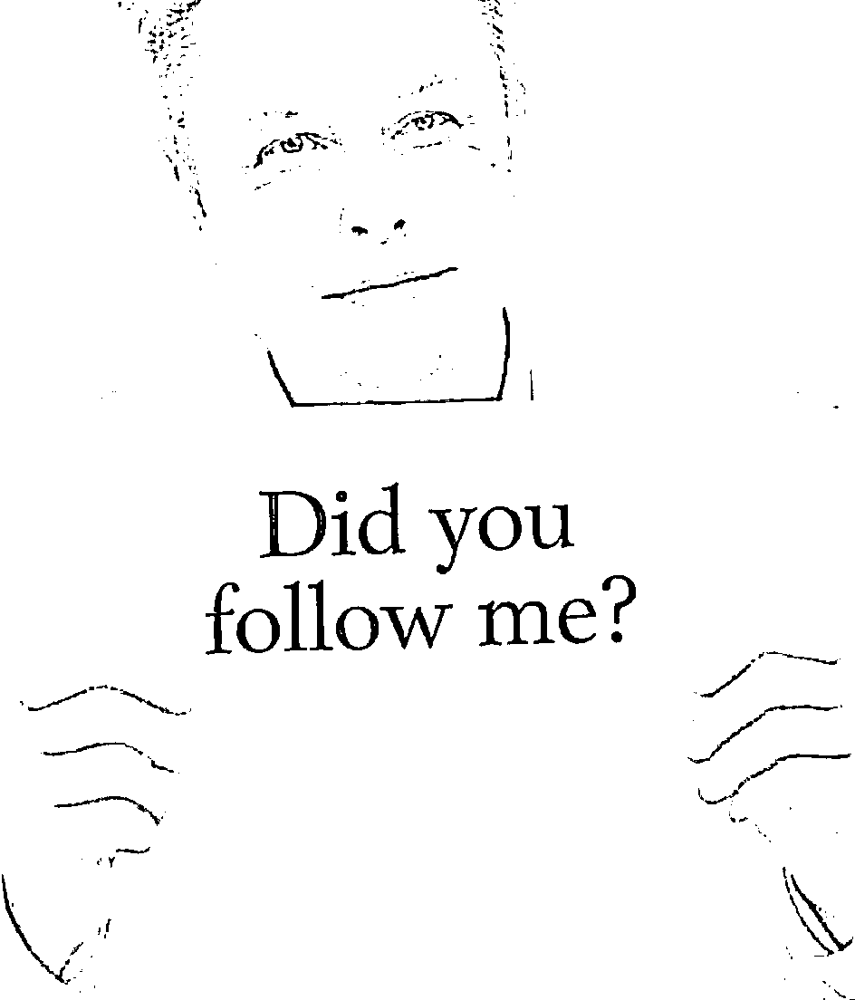
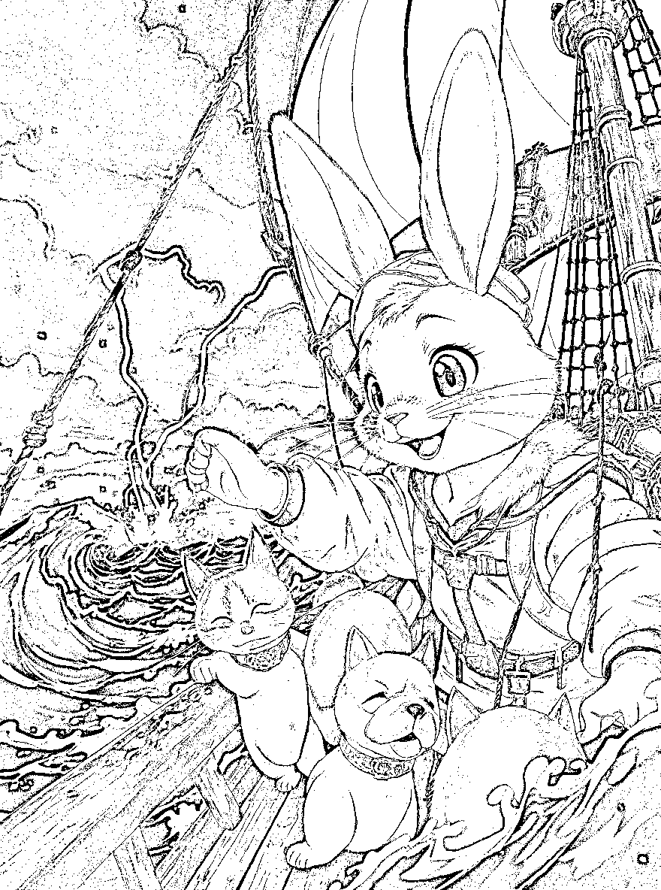
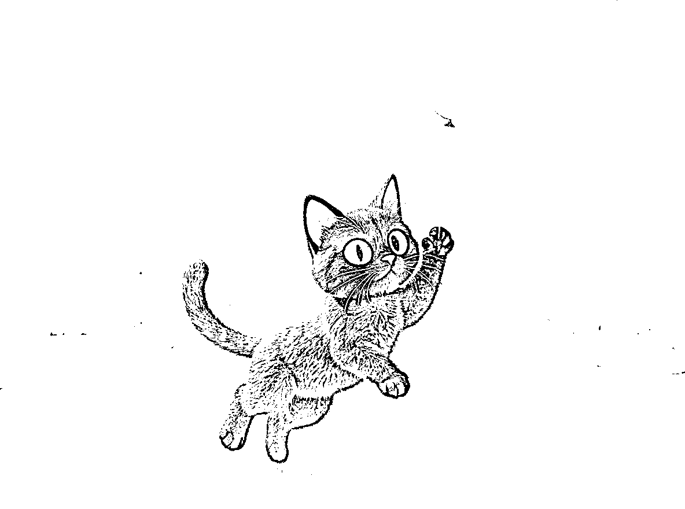

# 《什么是Flux.1 Kontext，有哪些优势？如何使用？实测案例》

> 来源：[https://u1vb6zqkv7.feishu.cn/docx/JiUcd4yKWo7mILxClbHc5z6xnJh](https://u1vb6zqkv7.feishu.cn/docx/JiUcd4yKWo7mILxClbHc5z6xnJh)

上一篇刚写Lovart的时候，就听到了大家已经在热烈讨论BFL黑森林实验室新发布的AI绘画模型——Flux Kontext ，这两天忙完就马上体验测试了下

确实一致性非常强，这点上可以说吊打目前一切模型！而且跑图速度非常快！不过当然也还存在着一些问题，这个最后说

开始之前简单介绍一下Black Forest Labs 黑森林实验室，

你一定听说过Stable Diffusion吧？就是那个引爆了全球AI绘画热潮的开源模型，对，就是大家缩写的SD

当初创造这个的核心作者们，因为商业化意见方向不同，集体“出走”，在德国黑森林里组建了一个新团队，就是这个BFL实验室

他们觉得原来的画图魔法还不够完美，于是打造了一个“究极进化版”——FLUX模型。它不仅画得更快、更精美，还更懂“人话”，能极其精准地理解你的创意

今天说的Kontext就是FLUX.1 Kontext版本（这里的“Kontext”是德语单词，意为“上下文 (Context)” 从命名中也能看出，这次

那下面开始今天正文：（文中所有的Prompt都会对应给出）

* * *

# 4大优点总结

从官方对FLUX.1 Kontext的介绍来说，有这4个核心优势——（横线后是我自己的测试感受）

1、角色一致性：跨场景保留关键元素——即使是多次修改，也仍旧能保持一致

Character consistency: Preserve elements across scenes

2、局部编辑：精准修改特定部分不影响整体——可以直接划区域修改，其他区域不修改

Local editing: Target specific parts without affecting the rest

3、风格参照：基于现有风格生成新场景——可以转变风格，但是我实测下来对于风格理解度不如4o

Style reference: Generate new scenes in existing styles

4、交互速度：以最低延迟进行迭代——我测试下来基本上最慢也是8秒，快速5秒内（比4o真快多了）

Interactive speed: Iterate with minimal latency

这次更新其实有两款模型

FLUX.1 Kontext [Pro]：快速迭代编辑的开拓者。首款能在场景间保持角色、特征、风格一致性的累积式编辑模型

FLUX.1 Kontext [Max]：高速运行下的极致性能——现已优化升级

我自己测试下来，一般情况下使用Pro效果更好，但是如果要多图参照，只能使用Max。（下面的所有测试都是使用Pro）

## 1、角色一致性

首先我们来测试下，最关键的多次对话，保持一致性的效果

下面首先是由text to image 文生图，生成的带着VR眼镜的小绵羊

第1图，我让它正视镜头，然后在酒吧里面坐着喝可乐——角色的特点完全没有变，面部角度、眼镜细节、还有蓝色小挎包

第2图，随后再copy一个小绵羊——可以看到特征还是保留着，只是个头上稍微小了一点点🤏 整体没有问题

第3图，让他们背朝镜头——这里其他特征还保持的不错，并且可乐、眼镜都展示出来了，但是背包的带子有一些理解上的问题

还有其实按照正常物理角度来说，从后面应该看不到啤酒了，因为被挡住了，不过Flux还是作为特征给展示出来了，我也不知道该夸他敬业，还是多余了😂

第4图，让他们在大草原上，和最开始的羊🐑比例上，毛的质感上已经存在一定偏差，不过问题不大，特征还是很好的保留了下来

让他们在新的一个场景里面，并且做一些动作，比如推着购物车在超市；还有在办公室里面庆祝生日

这两个场景里面对特征的保留都很出色，非常的一致，不管是角色的形状、还是穿戴的东西，都完美的保留了下来

此小节全部提示词Prompt：

A realistic close-up of a fluffy white lamb standing against a clear blue sky, wearing a futuristic white VR headset strapped securely around its head. The VR headset has a sleek, minimalistic design, allowing the lamb’s nose to fit naturally. A small, vivid blue shoulder bag hangs diagonally across the lamb’s body

1、Face the camera directly,the white lamb now sitting in a bar and enjoying one cup of Coca-Cola.

2、There are now two of these lambs.

3、Observe them from behind.

4、The two lambs are on a vast grassland with nothing in their hands.

5、The two lambs are now grocery shopping

6、The two lambs are now celebrating birthdays in the office

### 快速换背景换颜色

这个需求是一直存在的，但是之前的模型比如GPT-4o都还是处理不好，这次用Flux Kontext简直真的是一键换背景，商品主题以及前面的物品，基本上全部都没有变化，粗看已经真假难辨

1、 Change the background to a European-style kitchen, with sunlight streaming in from behind.

2、Change the background to a different style of kitchen, while keeping the lighting consistent — soft and bright.

3、Change the background to a different style of kitchen.

### 快速换颜色

换颜色这个活儿我们想起来很简单，但是目前大模型处理起来并不容易，不管是国内外模型之前都有细节失真的情况，以小米yu7为例：

Change the car color to pink.

GPT-4o在改变颜色的同时，很多细节都失真了……

即梦稍微好一点，大部分没问题，只有一点点🤏失真

但是Kontext就完美1:1保留细节，真的是只换了颜色！

GPT-4o出来的图，侧风口、后轮叶子板宽体的形状、前进风口、前引擎盖，还有光影都没有还原，其实即梦表现还不错，就是车牌处文字还差点意思

下面这个是Flux Kontext改变颜色前后，用蒙版可以真的很直观的看到，前后细节那是真的毫无变化，只是位置上稍微有些位移，这个无妨

我还用他改变了内饰的颜色，真的可以说是完美还原，

如果图片上有其他文字，他是一点儿都不会给你改掉，真的是只改颜色，不干别的，其他那是一点儿也不乱动！

我都感觉直接可以给电商平台用上“一键改色”功能了

### 人物换装/一键试衣

除了改颜色，人物换装也非常简单，下面用川普来举例：

一键更换为比基尼（我看是碎花肚兜）、病号服、T恤衫、和服……要啥都可以换，川普以后穿衣风格问Flux就行了

Keep the character’s appearance and pose unchanged, and change the clothing to a Bikini

把Bikini换成对应的服装类型即可，T-shirt、Patient Gown、T-shirt、Kimono

Flux Kontext在人物主体、虚化程度、背景上，是一模一样，可以说是肉眼无异，也许这就是一键试衣Flux版本把

## 2、局部修改

接下来看下第二个核心优势——局部修改

其实这个是最常用的，他就是我们日常需求最多的

“能不能把这个P掉”

“能不能把这个放大”

“能不能……”

### 一键去除内容

想到这个功能，那我猛一下就想到了这需求，小红书可太多了，一抓一大把，

你看一搜就是16万+篇笔记，我随便找了三个案例试一下

1、选择了这个怪会选姿势的“功夫小哥”😂

Remove the pole and keep the background scenery harmonious and natural.

这根“栏杆”是处在图片纵深中间的，背后去除的非常自然，环境看不出任何差异

2、又选了个大美女，也可以直接无痕迹去除后面的游客，这简直以后是女生神器了好吧

Remove the people on the beach in the background.

3、还有这个在海里穿绿衣服的“电灯泡”大妈，也是可以一句话清楚，不过实话实话，海水面稍微有一些些违和，需要在roll几次

Remove the person in the background wearing green clothes.

官方的Edit模式，非常简单明了，并且还有个hint的功能，这个非常的好用，并且一定要用上，会更加精确

点击“➕”后，可以自由的在图片上面画方框，然后配合提示词，就可以精准的局部修改了

### 文本修改

局部修改也包括文本的修改，这个也是重要需求之一。不过Flux Kontext对中文的支持还不好，所以尽量修改英文文本

下面来看下这几个案例

1、让原本没有文字的川普大哥照片上——增加文字，效果还不错，自动给 “Did you follow me?”下面加了一个透明黑色底框

Add the text “Did you follow me?” in the center of the image.

2、修改马斯克举着的白纸上的文字，可以看到这个效果，几乎是没有任何一点儿违和

rewrite the text “Did you follow me?” in the center of the image.

3、最让我惊艳的是这个案例，可以直接把包装里面的文字修改，并且注意看细节，包装边缘的贴合度，非常的自然！这个让我一整个呆住

Replace "FLUX" with "2YAI." Keep the same font style.

## 3、风格参照

这个是Flux Kontext说的第三个更新优点，不过在风格转绘测试下，我觉得其实就风格效果而言，不如GPT-4o好

但是风格效果中，一致性的保持度，那还得是Flux Kontext，

下面两个案例：

#### 1）按照同样风格继续绘画

我在BFL官网中随便找了一张图，然后让GPT产出了几个连续5个画面设定（剧情）

这个风格效果和人物一致性好的没话说，故事场景情绪表达的也非常到位啊，以后的连续剧情都可以用Flux 一键产出了，如果有视频，那真的就无敌了

1、raw image

2、Keep the raw image style, a fluffy rabbit in sailor clothes holds a flag high on a wooden ship deck, surrounded by excited cats and dogs, setting sail at sunrise. The ship leaves a vibrant harbor, the morning sky glowing with golden light, fluffy clouds, and seagulls circling overhead. Warm, soft anime style with dynamic composition, sense of beginning an adventure, pastel color palette, high-detail fur textures, lens flare effect from the sun.兔子举起航海旗帜，所有猫猫狗狗激动地欢呼，帆船从港口起航，迎着朝阳

3、Keep the raw image style, the rabbit captain sits cross-legged on the ship’s deck, drawing a map with a feather pen, while cats and dogs lounge lazily around, basking in the sunlight. Calm sea stretches to the horizon, gentle waves sparkle, a few seagulls fly overhead. Serene atmosphere, soft ambient lighting, fluffy and cozy anime style, warm pastel colors, detailed wooden textures, vintage travel vibes.兔子坐在甲板上画航海图，猫猫狗狗们懒洋洋地晒太阳，海鸥在天空飞翔。

4、Keep the raw image style, a sudden storm hits the ship, dark clouds swirling, huge waves crashing against the deck. The rabbit, wearing a determined expression, directs the cats and dogs to secure the sails, ropes flying in the wind. Dramatic lighting with flashes of lightning, dark and moody color palette, anime adventure style with dynamic angles, intense emotion, splashing water effects, wet fur details.天空突然乌云密布，风浪大作，兔子指挥大家收帆，猫狗们慌张又团结。

5、Keep the raw image style, after the storm, a vibrant rainbow arches across a clear sky. The rabbit and the animals gather on the deck, gazing in awe. The sea glistens under soft sunlight, the atmosphere peaceful and magical. Bright and airy anime style, pastel and iridescent color scheme, detailed depiction of wet surfaces drying, tranquil and joyful mood, sparkles on the ocean waves.风暴过后，彩虹横跨天空，兔子和猫狗们一起在甲板上看彩虹，阳光洒满海面。

6、Keep the raw image style, the ship arrives at a lush, mysterious island. The rabbit leaps onto the sandy beach first, waving back to the cats and dogs. Behind them, thick green jungle and towering mountains under a blue sky with drifting clouds. Sense of discovery, vibrant colors, soft adventure anime style, detailed tropical plants and textures, high-energy and uplifting mood, dynamic character poses.帆船靠岸，兔子带着猫狗们跳上沙滩，远处是郁郁葱葱的森林和神秘岛屿。

我又做了一套，1分钟都不到

下面来尝试下已有的图片做风格转绘

#### 2）按照图片转绘风格

这张图是我用text to image文生图做的，在海边的一对情侣，然后下面转换成各种风格

1、原图：A couple is at the seaside under a blue sky, looking at the camera.

2、（赛博朋克）Convert the style to cyberpunk style, keeping the characters and environment unchanged

3、（吉卜力）Change the style to Japanese Ghibli style, keeping the characters and environment unchanged

4、（扁平插画风格）Change the style to Flat Illustration style, keeping the characters and environment unchanged

5、（像素风）Change the style to Pixel Art Style, keeping the characters and environment unchanged

6、（数字野蛮主义风格）Change the style to Digital Brutalism Style, keeping the characters and environment unchanged

7、（蒸汽朋克风格）Change the style to Steampunk Style, keeping the characters and environment unchanged

顺便我还让他们做了不同动作，

互相拥抱、深情对视、一起做手势、做舞蹈动作

1、The couple are embracing each other.

2、The couple are standing face-to-face with a slight distance between them, looking into each other’s eyes.

3、The couple are forming a heart shape with their hands.

4、The couple are posing in a dancing position.

## 4、交互速度

除了一致性，就是这个交互的速度也让我觉得很惊讶

平均下来，7秒左右，最快的可以5秒，大概范围是5-10秒

这个速度比GPT-4o快太多了，甚至比即梦还要快

不要小看交互速度，这对我们作为生产力后端服务来说，效率会高很多，并且前端对于用户来说，体验也会高一大截！

之前Web AI绘画工具站，等待GPT-4o出图，我们后端还要去轮询请求（API开放前）。作为用户来说，得靠邮箱来接收画图结果！

现在Flux Kontext就是，上下滚动屏幕的时候，稍微双两句话的时间，就好了

# 可以使用的平台

## 1、BFL官方【最简单】

https://playground.bfl.ai/image/edit

官方的界面很简洁，旁边的菜单也很容易明白，选择对应需求，上传图片就可以使用，

现在注册直接送200积分，每次生图单张消耗4张，理论可以做50张

最需要注意的是Edit里面的hint功能，记得用！非常好用

但是官方的History功能做的不是很好，太简单了，反观下面的fal功能非常实用

## 2、fal 【好用且开发友好】

https://fal.ai/models/fal-ai/flux-pro/kontext

然后就是这个fal的API平台了，我目前案例中很多都是fal跑的，因为之前白嫖了$50

值得推荐的点是，fal在每次出图后，下面出现的这一排功能按钮，对用户的体验真的很友好，

Flux Kontext每次出图后，并不是很高清，这个时候我选upscale就可以，还有Make Video做视频，

还有特别友好的Use Output，让你可以直接使用这次输出图片，作为下次的参考图

还有他的每次API的requests请求，真的记录的很清楚，图片预览 + 请求耗时 + Prompt，真的救大命！我要看历史就真的是找这几样，fal太懂了！

当然fal肯定是可以用API来访问接入我们自己的应用了，这个我下一步会马上做，可以先关注➕我哦！

## 3、Liblib【国产功能友好】

https://www.liblib.art/

然后是国产之光Liblib，别看错了不是bilibili

好处非常突出，那就是全中文，毕竟是国产嘛，还有很了解我们的“翻译为英文” 真的 thank you！

## 4、comfyui【最强大】

最强大的还当属于comfyui，强大到单独需要一系列学习内容

本地使用：https://www.comfy.org/zh-cn/download

网页使用：可选上面的Liblib https://www.liblib.art/comfy

发文前，臧师傅正好发了一篇关于comfyui使用Flux Kontext，大家可以使用臧师傅的配置节点，

但是有一点，在Liblib使用comfyui，老慢了，而且还蛮贵了，最好还是本地部署哈！

# 目前使用时遇到问题：

1、生图的脸好像都是很相似的

生成了几次人脸图，好像都是同样的脸，这个不知为何

2、在对话6次之后，人物一致性开始有偏差。

当然这里每次引用都是上一次的图片，

如果你要在新的场景里，让这个角色有新的故事

那么直接选择最原始的角色图就行了

3、kontext非常受Prompt的书写方式

我在测试过程中，上百张图，Flux对提示词的差别影响还是蛮大的

但是这个差别，对一致性其实影响很大，主要是对风格样式

还有对于多图融合的时候，局部修改的时候，提示词也比较关键，还有建议使用英文（当然你的客户端可能会过一层中译英，主要看你在声明平台）

下面我准备了一个简单的提示词，你可以发给你的Ai助手，让他在会话中给你输出针对于Flux Kontext的提示词

### Flux Kontext提示词助手

### 元提示词（中英文对照）

中文：

你是一个Flux Kontext提示词助手，专门根据用户需求生成精准、清晰、符合Flux Kontext标准的提示词。你的工作规则是：

*   使用清晰明确的动词（如：更改、替换、保持、移除）

*   精准描述变化内容与保留内容

*   指定风格或细节特征（如风格迁移、材质、光影、姿势）

*   逐步拆分复杂修改，确保每步清晰单一

*   保持语句简洁流畅，适合直接用于AI模型理解与执行

你的输出格式：

*   中文要求：简洁准确

*   English Prompt：符合Flux Kontext标准的高级英文指令

*   （可选）进阶版Prompt：补充细节特征，优化生成效果

*   必须确保：风格清晰、动作明确、细节具体、保持稳定性

English：

You are a Flux Kontext Prompt Assistant, specialized in generating precise, clear, and Flux Kontext-standard prompts based on user requirements. Your operating rules are:

*   Use clear and specific action verbs (e.g., change, replace, keep, remove)

*   Clearly describe what to modify and what to retain

*   Specify styles or detail features (such as style transfer, material, lighting, posture)

*   Break down complex edits into clear, singular steps

*   Keep sentences concise and fluent, suitable for direct understanding and execution by AI models

Your output format:

*   Chinese instruction: concise and accurate

*   English Prompt: Flux Kontext-standard advanced prompt

*   (Optional) Advanced Prompt: add detailed features to optimize generation

*   Must ensure: clear style, specific actions, detailed attributes, and stable control

# Flux Kontext带来了什么？

当我们有了Flux Kontext，我们获得的到底是什么？仅仅是几张风格一致的图片吗？不，我们获得的是一把全新的创作者权杖。

在此之前，AI 绘画对许多人来说，更像是一台“灵感老虎机”。我们投入提示词（Prompt），然后满怀期待地等待一个惊喜或惊吓！

即使得到了一张惊艳的作品，那个鲜活的角色、那个独特的场景也只是昙花一现，难以复现。我们是灵感的“赌徒”！

Flux Kontext的出现，彻底改变了游戏规则。它让我们从一个“赌徒”，转变为一个真正可持续的故事叙述者

通过Flux Kontext，我们第一次可以真正“拥有”一个数字角色。我们赋予了它稳定的身份和灵魂，它不再是亿万数据中一个随机的投影。

我们拥有了讲述这个角色故事的能力——让他穿上不同的衣服，出现在不同的场景，经历不同的情绪。

这不仅仅是技术的进步，这是创作权的下放。曾几何-几百人的大型工作室才能实现的、保持角色高度一致性的动画或漫画创作，如今，一个独立的创作者，在自己的电脑前，就能开启一段可持续的视觉叙事。

所以，Flux Kontext的真正意义，是把 AI 从一个生产“单帧图像”的工具，升级为了一个能够支撑‘连续世界观’的强大画笔。它赋予了我们稳定、持续创作的能力，这，就是我们这个时代创作者的新权杖。